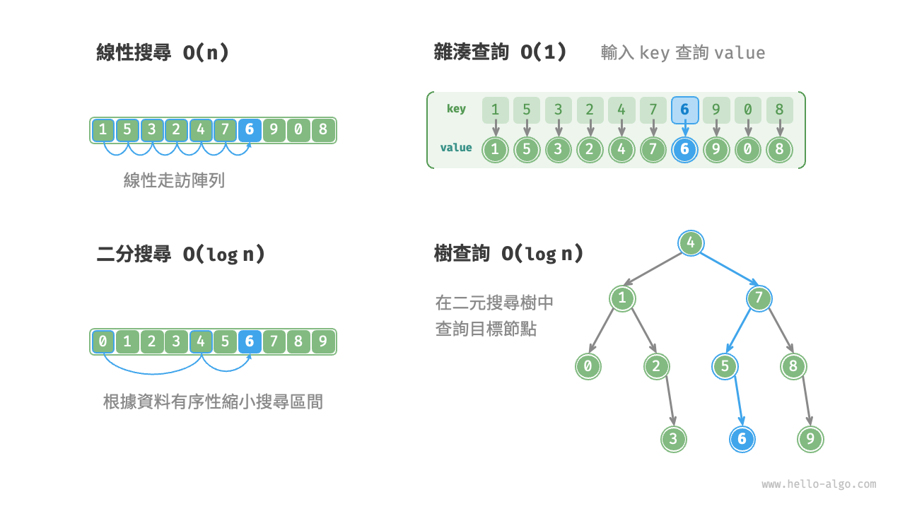

# 重識搜尋演算法

<u>搜尋演算法（searching algorithm）</u>用於在資料結構（例如陣列、鏈結串列、樹或圖）中搜索一個或一組滿足特定條件的元素。

搜尋演算法可根據實現思路分為以下兩類。

- **透過走訪資料結構來定位目標元素**，例如陣列、鏈結串列、樹和圖的走訪等。
- **利用資料組織結構或資料包含的先驗資訊，實現高效元素查詢**，例如二分搜尋、雜湊查詢和二元搜尋樹查詢等。

不難發現，這些知識點都已在前面的章節中介紹過，因此搜尋演算法對於我們來說並不陌生。在本節中，我們將從更加系統的視角切入，重新審視搜尋演算法。

## 暴力搜尋

暴力搜尋透過走訪資料結構的每個元素來定位目標元素。

- “線性搜尋”適用於陣列和鏈結串列等線性資料結構。它從資料結構的一端開始，逐個訪問元素，直到找到目標元素或到達另一端仍沒有找到目標元素為止。
- “廣度優先搜尋”和“深度優先搜尋”是圖和樹的兩種走訪策略。廣度優先搜尋從初始節點開始逐層搜尋，由近及遠地訪問各個節點。深度優先搜尋從初始節點開始，沿著一條路徑走到頭，再回溯並嘗試其他路徑，直到走訪完整個資料結構。

暴力搜尋的優點是簡單且通用性好，**無須對資料做預處理和藉助額外的資料結構**。

然而，**此類演算法的時間複雜度為 $O(n)$** ，其中 $n$ 為元素數量，因此在資料量較大的情況下效能較差。

## 自適應搜尋

自適應搜尋利用資料的特有屬性（例如有序性）來最佳化搜尋過程，從而更高效地定位目標元素。

- “二分搜尋”利用資料的有序性實現高效查詢，僅適用於陣列。
- “雜湊查詢”利用雜湊表將搜尋資料和目標資料建立為鍵值對對映，從而實現查詢操作。
- “樹查詢”在特定的樹結構（例如二元搜尋樹）中，基於比較節點值來快速排除節點，從而定位目標元素。

此類演算法的優點是效率高，**時間複雜度可達到 $O(\log n)$ 甚至 $O(1)$** 。

然而，**使用這些演算法往往需要對資料進行預處理**。例如，二分搜尋需要預先對陣列進行排序，雜湊查詢和樹查詢都需要藉助額外的資料結構，維護這些資料結構也需要額外的時間和空間開銷。

!!! tip

    自適應搜尋演算法常被稱為查詢演算法，**主要用於在特定資料結構中快速檢索目標元素**。

## 搜尋方法選取

給定大小為 $n$ 的一組資料，我們可以使用線性搜尋、二分搜尋、樹查詢、雜湊查詢等多種方法從中搜索目標元素。各個方法的工作原理如下圖所示。

上述幾種方法的操作效率與特性如下表所示。

 表 <id> &nbsp; 查詢演算法效率對比 

|              | 線性搜尋 | 二分搜尋           | 樹查詢             | 雜湊查詢        |
| ------------ | -------- | ------------------ | ------------------ | --------------- |
| 查詢元素     | $O(n)$   | $O(\log n)$        | $O(\log n)$        | $O(1)$          |
| 插入元素     | $O(1)$   | $O(n)$             | $O(\log n)$        | $O(1)$          |
| 刪除元素     | $O(n)$   | $O(n)$             | $O(\log n)$        | $O(1)$          |
| 額外空間     | $O(1)$   | $O(1)$             | $O(n)$             | $O(n)$          |
| 資料預處理   | /        | 排序 $O(n \log n)$ | 建樹 $O(n \log n)$ | 建雜湊表 $O(n)$ |
| 資料是否有序 | 無序     | 有序               | 有序               | 無序            |

搜尋演算法的選擇還取決於資料體量、搜尋效能要求、資料查詢與更新頻率等。

**線性搜尋**

- 通用性較好，無須任何資料預處理操作。假如我們僅需查詢一次資料，那麼其他三種方法的資料預處理的時間比線性搜尋的時間還要更長。
- 適用於體量較小的資料，此情況下時間複雜度對效率影響較小。
- 適用於資料更新頻率較高的場景，因為該方法不需要對資料進行任何額外維護。

**二分搜尋**

- 適用於大資料量的情況，效率表現穩定，最差時間複雜度為 $O(\log n)$ 。
- 資料量不能過大，因為儲存陣列需要連續的記憶體空間。
- 不適用於高頻增刪資料的場景，因為維護有序陣列的開銷較大。

**雜湊查詢**

- 適合對查詢效能要求很高的場景，平均時間複雜度為 $O(1)$ 。
- 不適合需要有序資料或範圍查詢的場景，因為雜湊表無法維護資料的有序性。
- 對雜湊函式和雜湊衝突處理策略的依賴性較高，具有較大的效能劣化風險。
- 不適合資料量過大的情況，因為雜湊表需要額外空間來最大程度地減少衝突，從而提供良好的查詢效能。

**樹查詢**

- 適用於海量資料，因為樹節點在記憶體中是分散儲存的。
- 適合需要維護有序資料或範圍查詢的場景。
- 在持續增刪節點的過程中，二元搜尋樹可能產生傾斜，時間複雜度劣化至 $O(n)$ 。
- 若使用 AVL 樹或紅黑樹，則各項操作可在 $O(\log n)$ 效率下穩定執行，但維護樹平衡的操作會增加額外的開銷。
