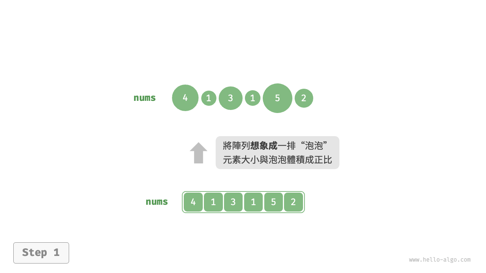
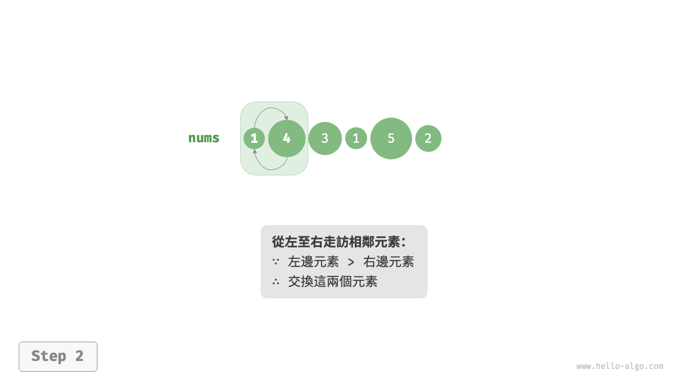
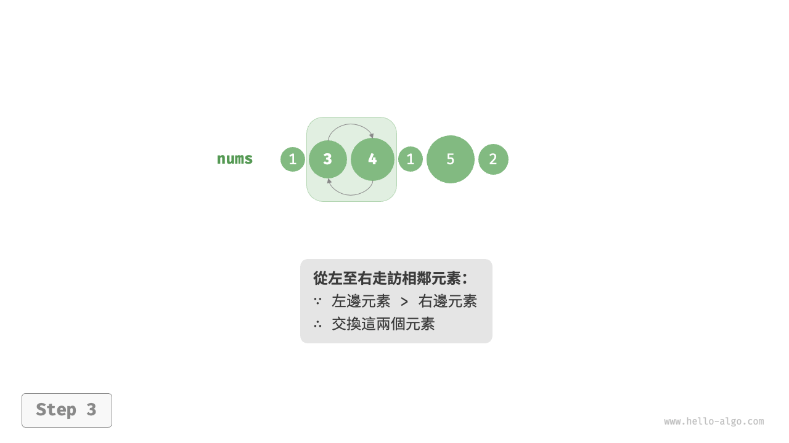
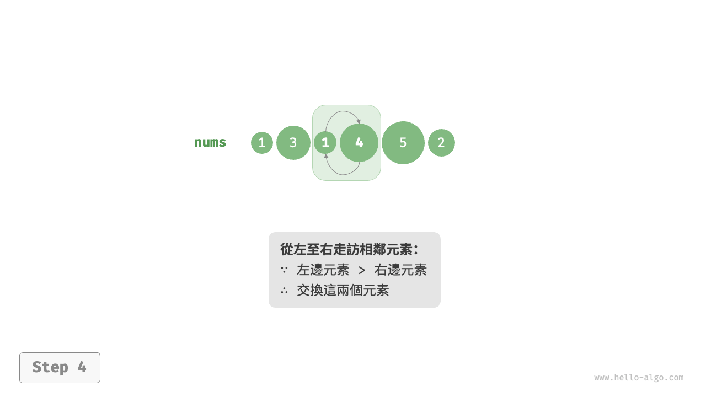
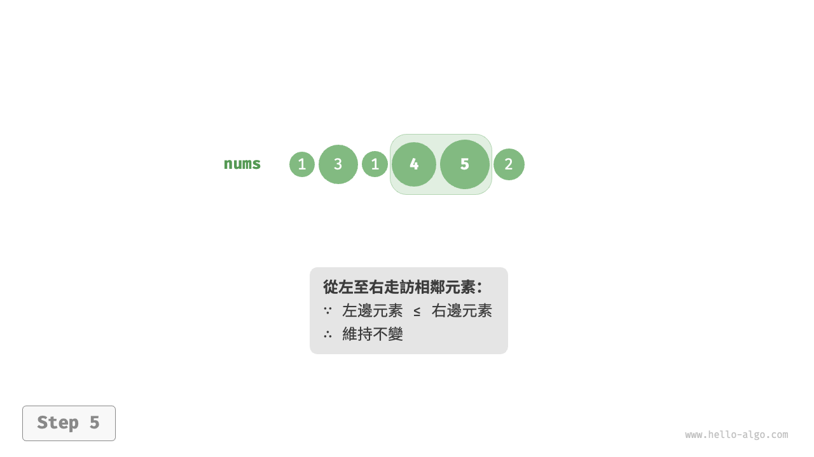
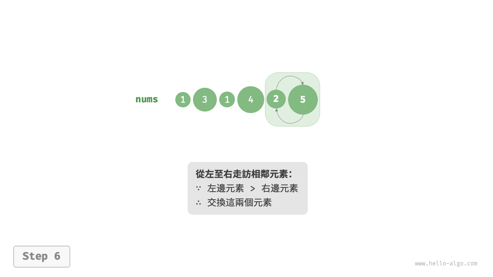
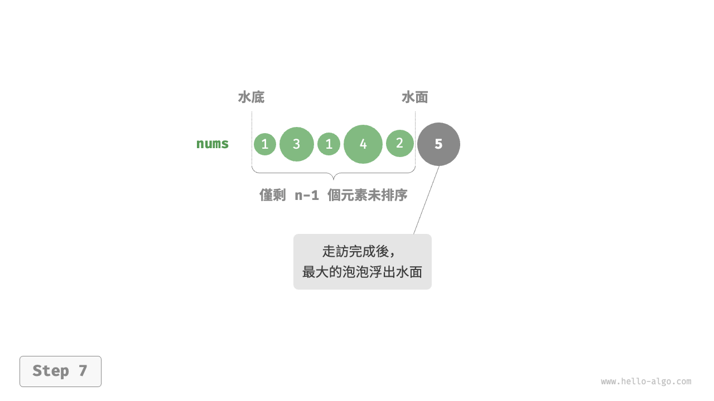
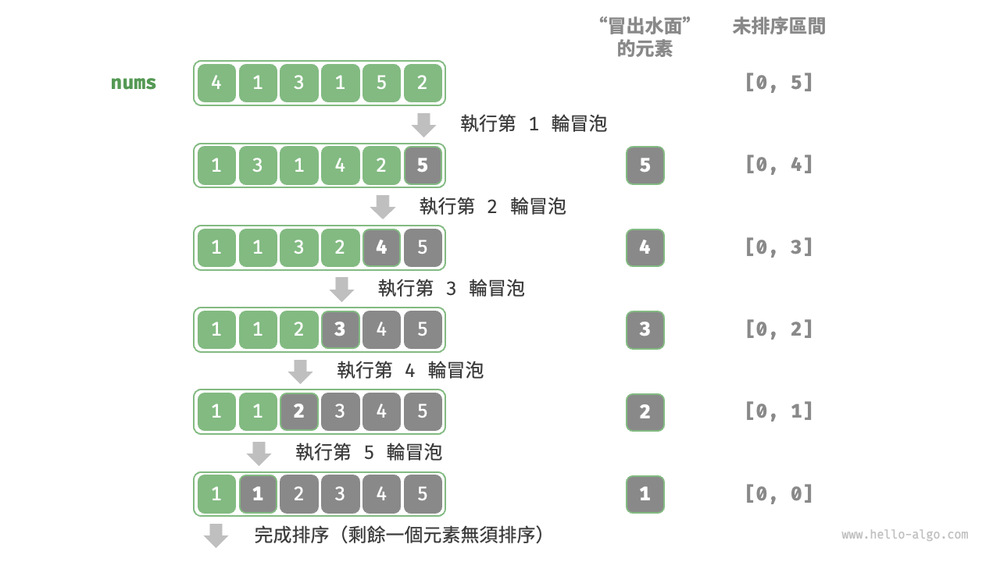

# 泡沫排序

<u>泡沫排序（bubble sort）</u>透過連續地比較與交換相鄰元素實現排序。這個過程就像氣泡從底部升到頂部一樣，因此得名泡沫排序。

如下圖所示，冒泡過程可以利用元素交換操作來模擬：從陣列最左端開始向右走訪，依次比較相鄰元素大小，如果“左元素 > 右元素”就交換二者。走訪完成後，最大的元素會被移動到陣列的最右端。

=== "<1>"
    

=== "<2>"
    

=== "<3>"
    

=== "<4>"
    

=== "<5>"
    

=== "<6>"
    

=== "<7>"
    

## 演算法流程

設陣列的長度為 $n$ ，泡沫排序的步驟如下圖所示。

1. 首先，對 $n$ 個元素執行“冒泡”，**將陣列的最大元素交換至正確位置**。
2. 接下來，對剩餘 $n - 1$ 個元素執行“冒泡”，**將第二大元素交換至正確位置**。
3. 以此類推，經過 $n - 1$ 輪“冒泡”後，**前 $n - 1$ 大的元素都被交換至正確位置**。
4. 僅剩的一個元素必定是最小元素，無須排序，因此陣列排序完成。



示例程式碼如下：

```src
[file]{bubble_sort}-[class]{}-[func]{bubble_sort}
```

## 效率最佳化

我們發現，如果某輪“冒泡”中沒有執行任何交換操作，說明陣列已經完成排序，可直接返回結果。因此，可以增加一個標誌位 `flag` 來監測這種情況，一旦出現就立即返回。

經過最佳化，泡沫排序的最差時間複雜度和平均時間複雜度仍為 $O(n^2)$ ；但當輸入陣列完全有序時，可達到最佳時間複雜度 $O(n)$ 。

```src
[file]{bubble_sort}-[class]{}-[func]{bubble_sort_with_flag}
```

## 演算法特性

- **時間複雜度為 $O(n^2)$、自適應排序**：各輪“冒泡”走訪的陣列長度依次為 $n - 1$、$n - 2$、$\dots$、$2$、$1$ ，總和為 $(n - 1) n / 2$ 。在引入 `flag` 最佳化後，最佳時間複雜度可達到 $O(n)$ 。
- **空間複雜度為 $O(1)$、原地排序**：指標 $i$ 和 $j$ 使用常數大小的額外空間。
- **穩定排序**：由於在“冒泡”中遇到相等元素不交換。
