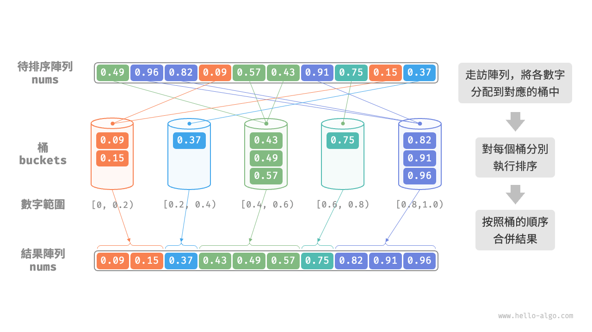
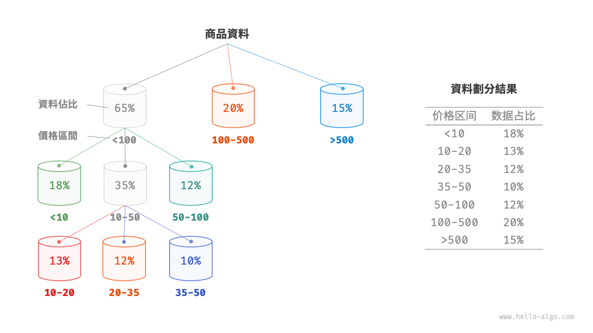
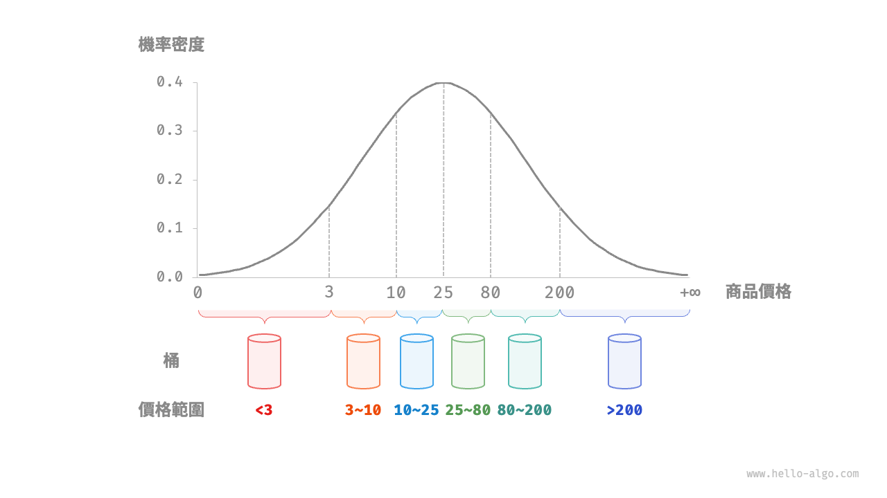

# 桶排序

前述幾種排序演算法都屬於“基於比較的排序演算法”，它們透過比較元素間的大小來實現排序。此類排序演算法的時間複雜度無法超越 $O(n \log n)$ 。接下來，我們將探討幾種“非比較排序演算法”，它們的時間複雜度可以達到線性階。

<u>桶排序（bucket sort）</u>是分治策略的一個典型應用。它透過設定一些具有大小順序的桶，每個桶對應一個數據範圍，將資料平均分配到各個桶中；然後，在每個桶內部分別執行排序；最終按照桶的順序將所有資料合併。

## 演算法流程

考慮一個長度為 $n$ 的陣列，其元素是範圍 $[0, 1)$ 內的浮點數。桶排序的流程如下圖所示。

1. 初始化 $k$ 個桶，將 $n$ 個元素分配到 $k$ 個桶中。
2. 對每個桶分別執行排序（這裡採用程式語言的內建排序函式）。
3. 按照桶從小到大的順序合併結果。



程式碼如下所示：

```src
[file]{bucket_sort}-[class]{}-[func]{bucket_sort}
```

## 演算法特性

桶排序適用於處理體量很大的資料。例如，輸入資料包含 100 萬個元素，由於空間限制，系統記憶體無法一次性載入所有資料。此時，可以將資料分成 1000 個桶，然後分別對每個桶進行排序，最後將結果合併。

- **時間複雜度為 $O(n + k)$** ：假設元素在各個桶內平均分佈，那麼每個桶內的元素數量為 $\frac{n}{k}$ 。假設排序單個桶使用 $O(\frac{n}{k} \log\frac{n}{k})$ 時間，則排序所有桶使用 $O(n \log\frac{n}{k})$ 時間。**當桶數量 $k$ 比較大時，時間複雜度則趨向於 $O(n)$** 。合併結果時需要走訪所有桶和元素，花費 $O(n + k)$ 時間。
- **自適應排序**：在最差情況下，所有資料被分配到一個桶中，且排序該桶使用 $O(n^2)$ 時間。
- **空間複雜度為 $O(n + k)$、非原地排序**：需要藉助 $k$ 個桶和總共 $n$ 個元素的額外空間。
- 桶排序是否穩定取決於排序桶內元素的演算法是否穩定。

## 如何實現平均分配

桶排序的時間複雜度理論上可以達到 $O(n)$ ，**關鍵在於將元素均勻分配到各個桶中**，因為實際資料往往不是均勻分佈的。例如，我們想要將淘寶上的所有商品按價格範圍平均分配到 10 個桶中，但商品價格分佈不均，低於 100 元的非常多，高於 1000 元的非常少。若將價格區間平均劃分為 10 個，各個桶中的商品數量差距會非常大。

為實現平均分配，我們可以先設定一條大致的分界線，將資料粗略地分到 3 個桶中。**分配完畢後，再將商品較多的桶繼續劃分為 3 個桶，直至所有桶中的元素數量大致相等**。

如下圖所示，這種方法本質上是建立一棵遞迴樹，目標是讓葉節點的值儘可能平均。當然，不一定要每輪將資料劃分為 3 個桶，具體劃分方式可根據資料特點靈活選擇。



如果我們提前知道商品價格的機率分佈，**則可以根據資料機率分佈設定每個桶的價格分界線**。值得注意的是，資料分佈並不一定需要特意統計，也可以根據資料特點採用某種機率模型進行近似。

如下圖所示，我們假設商品價格服從正態分佈，這樣就可以合理地設定價格區間，從而將商品平均分配到各個桶中。


