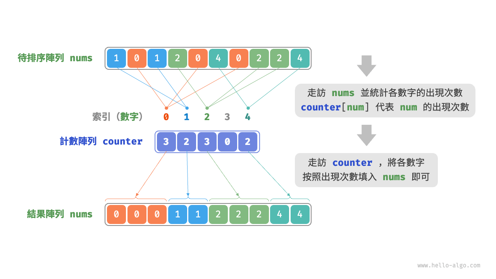
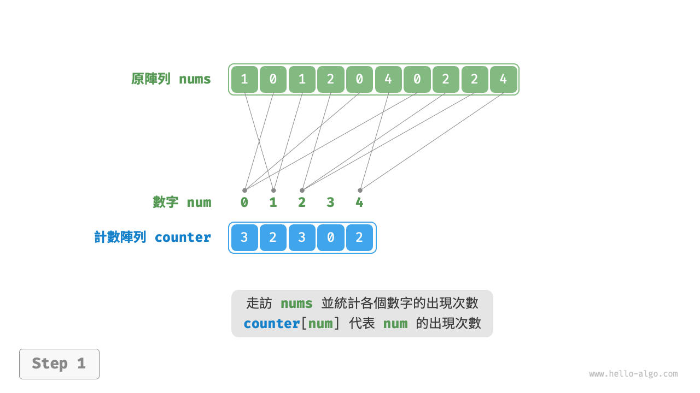
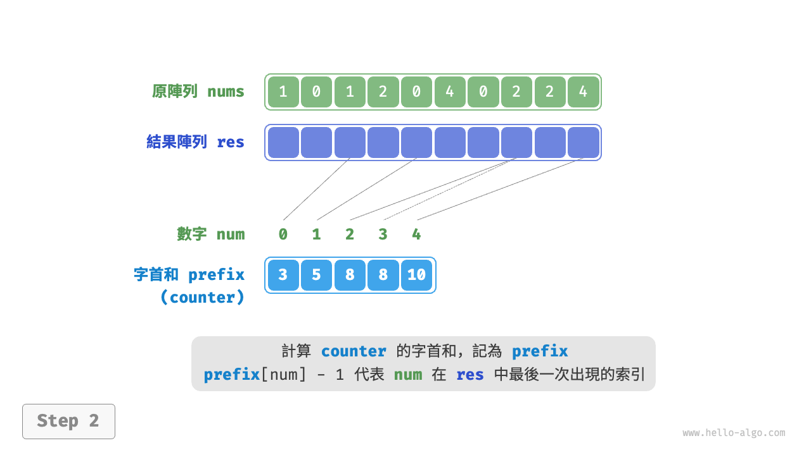
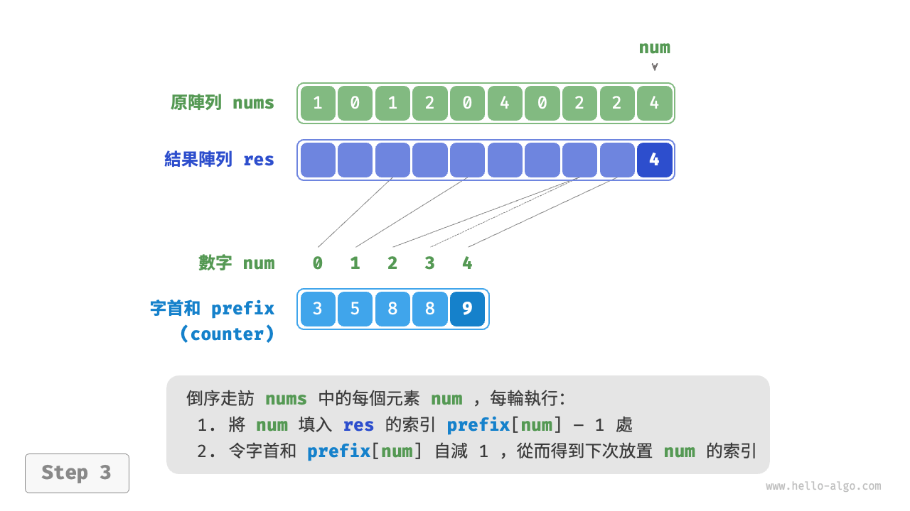
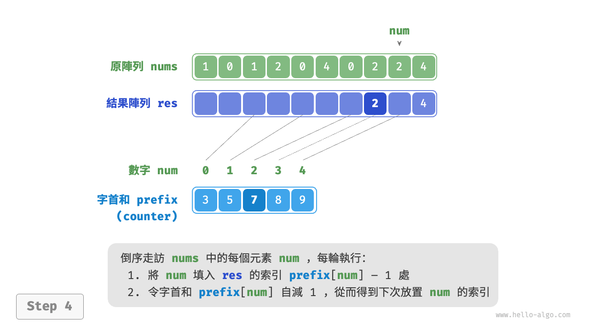
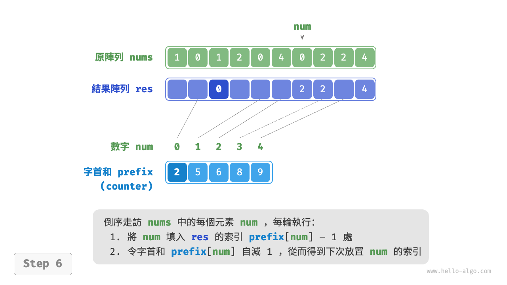
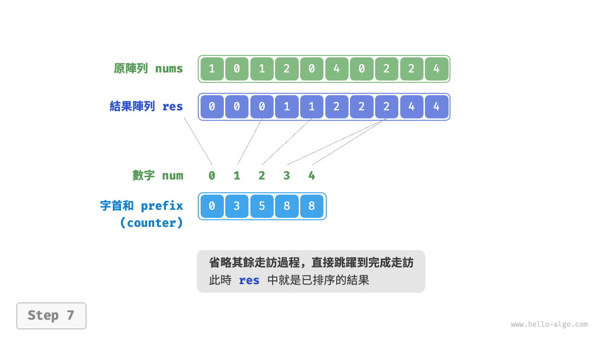

# 11.9 &nbsp; 計數排序

<u>計數排序（counting sort）</u>透過統計元素數量來實現排序，通常應用於整數陣列。

## 11.9.1 &nbsp; 簡單實現

先來看一個簡單的例子。給定一個長度為 $n$ 的陣列 `nums` ，其中的元素都是“非負整數”，計數排序的整體流程如圖 11-16 所示。

1. 走訪陣列，找出其中的最大數字，記為 $m$ ，然後建立一個長度為 $m + 1$ 的輔助陣列 `counter` 。
2. **藉助 `counter` 統計 `nums` 中各數字的出現次數**，其中 `counter[num]` 對應數字 `num` 的出現次數。統計方法很簡單，只需走訪 `nums`（設當前數字為 `num`），每輪將 `counter[num]` 增加 $1$ 即可。
3. **由於 `counter` 的各個索引天然有序，因此相當於所有數字已經排序好了**。接下來，我們走訪 `counter` ，根據各數字出現次數從小到大的順序填入 `nums` 即可。

{ class="animation-figure" }

<p align="center"> 圖 11-16 &nbsp; 計數排序流程 </p>

程式碼如下所示：

=== "Python"

    ```python title="counting_sort.py"
    def counting_sort_naive(nums: list[int]):
        """計數排序"""
        # 簡單實現，無法用於排序物件
        # 1. 統計陣列最大元素 m
        m = 0
        for num in nums:
            m = max(m, num)
        # 2. 統計各數字的出現次數
        # counter[num] 代表 num 的出現次數
        counter = [0] * (m + 1)
        for num in nums:
            counter[num] += 1
        # 3. 走訪 counter ，將各元素填入原陣列 nums
        i = 0
        for num in range(m + 1):
            for _ in range(counter[num]):
                nums[i] = num
                i += 1
    ```

=== "C++"

    ```cpp title="counting_sort.cpp"
    /* 計數排序 */
    // 簡單實現，無法用於排序物件
    void countingSortNaive(vector<int> &nums) {
        // 1. 統計陣列最大元素 m
        int m = 0;
        for (int num : nums) {
            m = max(m, num);
        }
        // 2. 統計各數字的出現次數
        // counter[num] 代表 num 的出現次數
        vector<int> counter(m + 1, 0);
        for (int num : nums) {
            counter[num]++;
        }
        // 3. 走訪 counter ，將各元素填入原陣列 nums
        int i = 0;
        for (int num = 0; num < m + 1; num++) {
            for (int j = 0; j < counter[num]; j++, i++) {
                nums[i] = num;
            }
        }
    }
    ```

=== "Java"

    ```java title="counting_sort.java"
    /* 計數排序 */
    // 簡單實現，無法用於排序物件
    void countingSortNaive(int[] nums) {
        // 1. 統計陣列最大元素 m
        int m = 0;
        for (int num : nums) {
            m = Math.max(m, num);
        }
        // 2. 統計各數字的出現次數
        // counter[num] 代表 num 的出現次數
        int[] counter = new int[m + 1];
        for (int num : nums) {
            counter[num]++;
        }
        // 3. 走訪 counter ，將各元素填入原陣列 nums
        int i = 0;
        for (int num = 0; num < m + 1; num++) {
            for (int j = 0; j < counter[num]; j++, i++) {
                nums[i] = num;
            }
        }
    }
    ```

=== "C#"

    ```csharp title="counting_sort.cs"
    /* 計數排序 */
    // 簡單實現，無法用於排序物件
    void CountingSortNaive(int[] nums) {
        // 1. 統計陣列最大元素 m
        int m = 0;
        foreach (int num in nums) {
            m = Math.Max(m, num);
        }
        // 2. 統計各數字的出現次數
        // counter[num] 代表 num 的出現次數
        int[] counter = new int[m + 1];
        foreach (int num in nums) {
            counter[num]++;
        }
        // 3. 走訪 counter ，將各元素填入原陣列 nums
        int i = 0;
        for (int num = 0; num < m + 1; num++) {
            for (int j = 0; j < counter[num]; j++, i++) {
                nums[i] = num;
            }
        }
    }
    ```

=== "Go"

    ```go title="counting_sort.go"
    /* 計數排序 */
    // 簡單實現，無法用於排序物件
    func countingSortNaive(nums []int) {
        // 1. 統計陣列最大元素 m
        m := 0
        for _, num := range nums {
            if num > m {
                m = num
            }
        }
        // 2. 統計各數字的出現次數
        // counter[num] 代表 num 的出現次數
        counter := make([]int, m+1)
        for _, num := range nums {
            counter[num]++
        }
        // 3. 走訪 counter ，將各元素填入原陣列 nums
        for i, num := 0, 0; num < m+1; num++ {
            for j := 0; j < counter[num]; j++ {
                nums[i] = num
                i++
            }
        }
    }
    ```

=== "Swift"

    ```swift title="counting_sort.swift"
    /* 計數排序 */
    // 簡單實現，無法用於排序物件
    func countingSortNaive(nums: inout [Int]) {
        // 1. 統計陣列最大元素 m
        let m = nums.max()!
        // 2. 統計各數字的出現次數
        // counter[num] 代表 num 的出現次數
        var counter = Array(repeating: 0, count: m + 1)
        for num in nums {
            counter[num] += 1
        }
        // 3. 走訪 counter ，將各元素填入原陣列 nums
        var i = 0
        for num in 0 ..< m + 1 {
            for _ in 0 ..< counter[num] {
                nums[i] = num
                i += 1
            }
        }
    }
    ```

=== "JS"

    ```javascript title="counting_sort.js"
    /* 計數排序 */
    // 簡單實現，無法用於排序物件
    function countingSortNaive(nums) {
        // 1. 統計陣列最大元素 m
        let m = 0;
        for (const num of nums) {
            m = Math.max(m, num);
        }
        // 2. 統計各數字的出現次數
        // counter[num] 代表 num 的出現次數
        const counter = new Array(m + 1).fill(0);
        for (const num of nums) {
            counter[num]++;
        }
        // 3. 走訪 counter ，將各元素填入原陣列 nums
        let i = 0;
        for (let num = 0; num < m + 1; num++) {
            for (let j = 0; j < counter[num]; j++, i++) {
                nums[i] = num;
            }
        }
    }
    ```

=== "TS"

    ```typescript title="counting_sort.ts"
    /* 計數排序 */
    // 簡單實現，無法用於排序物件
    function countingSortNaive(nums: number[]): void {
        // 1. 統計陣列最大元素 m
        let m = 0;
        for (const num of nums) {
            m = Math.max(m, num);
        }
        // 2. 統計各數字的出現次數
        // counter[num] 代表 num 的出現次數
        const counter: number[] = new Array<number>(m + 1).fill(0);
        for (const num of nums) {
            counter[num]++;
        }
        // 3. 走訪 counter ，將各元素填入原陣列 nums
        let i = 0;
        for (let num = 0; num < m + 1; num++) {
            for (let j = 0; j < counter[num]; j++, i++) {
                nums[i] = num;
            }
        }
    }
    ```

=== "Dart"

    ```dart title="counting_sort.dart"
    /* 計數排序 */
    // 簡單實現，無法用於排序物件
    void countingSortNaive(List<int> nums) {
      // 1. 統計陣列最大元素 m
      int m = 0;
      for (int _num in nums) {
        m = max(m, _num);
      }
      // 2. 統計各數字的出現次數
      // counter[_num] 代表 _num 的出現次數
      List<int> counter = List.filled(m + 1, 0);
      for (int _num in nums) {
        counter[_num]++;
      }
      // 3. 走訪 counter ，將各元素填入原陣列 nums
      int i = 0;
      for (int _num = 0; _num < m + 1; _num++) {
        for (int j = 0; j < counter[_num]; j++, i++) {
          nums[i] = _num;
        }
      }
    }
    ```

=== "Rust"

    ```rust title="counting_sort.rs"
    /* 計數排序 */
    // 簡單實現，無法用於排序物件
    fn counting_sort_naive(nums: &mut [i32]) {
        // 1. 統計陣列最大元素 m
        let m = *nums.into_iter().max().unwrap();
        // 2. 統計各數字的出現次數
        // counter[num] 代表 num 的出現次數
        let mut counter = vec![0; m as usize + 1];
        for &num in &*nums {
            counter[num as usize] += 1;
        }
        // 3. 走訪 counter ，將各元素填入原陣列 nums
        let mut i = 0;
        for num in 0..m + 1 {
            for _ in 0..counter[num as usize] {
                nums[i] = num;
                i += 1;
            }
        }
    }
    ```

=== "C"

    ```c title="counting_sort.c"
    /* 計數排序 */
    // 簡單實現，無法用於排序物件
    void countingSortNaive(int nums[], int size) {
        // 1. 統計陣列最大元素 m
        int m = 0;
        for (int i = 0; i < size; i++) {
            if (nums[i] > m) {
                m = nums[i];
            }
        }
        // 2. 統計各數字的出現次數
        // counter[num] 代表 num 的出現次數
        int *counter = calloc(m + 1, sizeof(int));
        for (int i = 0; i < size; i++) {
            counter[nums[i]]++;
        }
        // 3. 走訪 counter ，將各元素填入原陣列 nums
        int i = 0;
        for (int num = 0; num < m + 1; num++) {
            for (int j = 0; j < counter[num]; j++, i++) {
                nums[i] = num;
            }
        }
        // 4. 釋放記憶體
        free(counter);
    }
    ```

=== "Kotlin"

    ```kotlin title="counting_sort.kt"
    /* 計數排序 */
    // 簡單實現，無法用於排序物件
    fun countingSortNaive(nums: IntArray) {
        // 1. 統計陣列最大元素 m
        var m = 0
        for (num in nums) {
            m = max(m.toDouble(), num.toDouble()).toInt()
        }
        // 2. 統計各數字的出現次數
        // counter[num] 代表 num 的出現次數
        val counter = IntArray(m + 1)
        for (num in nums) {
            counter[num]++
        }
        // 3. 走訪 counter ，將各元素填入原陣列 nums
        var i = 0
        for (num in 0..<m + 1) {
            var j = 0
            while (j < counter[num]) {
                nums[i] = num
                j++
                i++
            }
        }
    }
    ```

=== "Ruby"

    ```ruby title="counting_sort.rb"
    [class]{}-[func]{counting_sort_naive}
    ```

=== "Zig"

    ```zig title="counting_sort.zig"
    [class]{}-[func]{countingSortNaive}
    ```

??? pythontutor "視覺化執行"

    <div style="height: 549px; width: 100%;"><iframe class="pythontutor-iframe" src="https://pythontutor.com/iframe-embed.html#code=def%20counting_sort_naive%28nums%3A%20list%5Bint%5D%29%3A%0A%20%20%20%20%22%22%22%E8%AE%A1%E6%95%B0%E6%8E%92%E5%BA%8F%22%22%22%0A%20%20%20%20%23%20%E7%AE%80%E5%8D%95%E5%AE%9E%E7%8E%B0%EF%BC%8C%E6%97%A0%E6%B3%95%E7%94%A8%E4%BA%8E%E6%8E%92%E5%BA%8F%E5%AF%B9%E8%B1%A1%0A%20%20%20%20%23%201.%20%E7%BB%9F%E8%AE%A1%E6%95%B0%E7%BB%84%E6%9C%80%E5%A4%A7%E5%85%83%E7%B4%A0%20m%0A%20%20%20%20m%20%3D%200%0A%20%20%20%20for%20num%20in%20nums%3A%0A%20%20%20%20%20%20%20%20m%20%3D%20max%28m,%20num%29%0A%20%20%20%20%23%202.%20%E7%BB%9F%E8%AE%A1%E5%90%84%E6%95%B0%E5%AD%97%E7%9A%84%E5%87%BA%E7%8E%B0%E6%AC%A1%E6%95%B0%0A%20%20%20%20%23%20counter%5Bnum%5D%20%E4%BB%A3%E8%A1%A8%20num%20%E7%9A%84%E5%87%BA%E7%8E%B0%E6%AC%A1%E6%95%B0%0A%20%20%20%20counter%20%3D%20%5B0%5D%20*%20%28m%20%2B%201%29%0A%20%20%20%20for%20num%20in%20nums%3A%0A%20%20%20%20%20%20%20%20counter%5Bnum%5D%20%2B%3D%201%0A%20%20%20%20%23%203.%20%E9%81%8D%E5%8E%86%20counter%20%EF%BC%8C%E5%B0%86%E5%90%84%E5%85%83%E7%B4%A0%E5%A1%AB%E5%85%A5%E5%8E%9F%E6%95%B0%E7%BB%84%20nums%0A%20%20%20%20i%20%3D%200%0A%20%20%20%20for%20num%20in%20range%28m%20%2B%201%29%3A%0A%20%20%20%20%20%20%20%20for%20_%20in%20range%28counter%5Bnum%5D%29%3A%0A%20%20%20%20%20%20%20%20%20%20%20%20nums%5Bi%5D%20%3D%20num%0A%20%20%20%20%20%20%20%20%20%20%20%20i%20%2B%3D%201%0A%0A%22%22%22Driver%20Code%22%22%22%0Aif%20__name__%20%3D%3D%20%22__main__%22%3A%0A%20%20%20%20nums%20%3D%20%5B1,%200,%201,%202,%200,%204,%200,%202,%202,%204%5D%0A%20%20%20%20counting_sort_naive%28nums%29%0A%20%20%20%20print%28f%22%E8%AE%A1%E6%95%B0%E6%8E%92%E5%BA%8F%EF%BC%88%E6%97%A0%E6%B3%95%E6%8E%92%E5%BA%8F%E5%AF%B9%E8%B1%A1%EF%BC%89%E5%AE%8C%E6%88%90%E5%90%8E%20nums%20%3D%20%7Bnums%7D%22%29&codeDivHeight=472&codeDivWidth=350&cumulative=false&curInstr=4&heapPrimitives=nevernest&origin=opt-frontend.js&py=311&rawInputLstJSON=%5B%5D&textReferences=false"> </iframe></div>
    <div style="margin-top: 5px;"><a href="https://pythontutor.com/iframe-embed.html#code=def%20counting_sort_naive%28nums%3A%20list%5Bint%5D%29%3A%0A%20%20%20%20%22%22%22%E8%AE%A1%E6%95%B0%E6%8E%92%E5%BA%8F%22%22%22%0A%20%20%20%20%23%20%E7%AE%80%E5%8D%95%E5%AE%9E%E7%8E%B0%EF%BC%8C%E6%97%A0%E6%B3%95%E7%94%A8%E4%BA%8E%E6%8E%92%E5%BA%8F%E5%AF%B9%E8%B1%A1%0A%20%20%20%20%23%201.%20%E7%BB%9F%E8%AE%A1%E6%95%B0%E7%BB%84%E6%9C%80%E5%A4%A7%E5%85%83%E7%B4%A0%20m%0A%20%20%20%20m%20%3D%200%0A%20%20%20%20for%20num%20in%20nums%3A%0A%20%20%20%20%20%20%20%20m%20%3D%20max%28m,%20num%29%0A%20%20%20%20%23%202.%20%E7%BB%9F%E8%AE%A1%E5%90%84%E6%95%B0%E5%AD%97%E7%9A%84%E5%87%BA%E7%8E%B0%E6%AC%A1%E6%95%B0%0A%20%20%20%20%23%20counter%5Bnum%5D%20%E4%BB%A3%E8%A1%A8%20num%20%E7%9A%84%E5%87%BA%E7%8E%B0%E6%AC%A1%E6%95%B0%0A%20%20%20%20counter%20%3D%20%5B0%5D%20*%20%28m%20%2B%201%29%0A%20%20%20%20for%20num%20in%20nums%3A%0A%20%20%20%20%20%20%20%20counter%5Bnum%5D%20%2B%3D%201%0A%20%20%20%20%23%203.%20%E9%81%8D%E5%8E%86%20counter%20%EF%BC%8C%E5%B0%86%E5%90%84%E5%85%83%E7%B4%A0%E5%A1%AB%E5%85%A5%E5%8E%9F%E6%95%B0%E7%BB%84%20nums%0A%20%20%20%20i%20%3D%200%0A%20%20%20%20for%20num%20in%20range%28m%20%2B%201%29%3A%0A%20%20%20%20%20%20%20%20for%20_%20in%20range%28counter%5Bnum%5D%29%3A%0A%20%20%20%20%20%20%20%20%20%20%20%20nums%5Bi%5D%20%3D%20num%0A%20%20%20%20%20%20%20%20%20%20%20%20i%20%2B%3D%201%0A%0A%22%22%22Driver%20Code%22%22%22%0Aif%20__name__%20%3D%3D%20%22__main__%22%3A%0A%20%20%20%20nums%20%3D%20%5B1,%200,%201,%202,%200,%204,%200,%202,%202,%204%5D%0A%20%20%20%20counting_sort_naive%28nums%29%0A%20%20%20%20print%28f%22%E8%AE%A1%E6%95%B0%E6%8E%92%E5%BA%8F%EF%BC%88%E6%97%A0%E6%B3%95%E6%8E%92%E5%BA%8F%E5%AF%B9%E8%B1%A1%EF%BC%89%E5%AE%8C%E6%88%90%E5%90%8E%20nums%20%3D%20%7Bnums%7D%22%29&codeDivHeight=800&codeDivWidth=600&cumulative=false&curInstr=4&heapPrimitives=nevernest&origin=opt-frontend.js&py=311&rawInputLstJSON=%5B%5D&textReferences=false" target="_blank" rel="noopener noreferrer">全螢幕觀看 ></a></div>

!!! note "計數排序與桶排序的關聯"

    從桶排序的角度看，我們可以將計數排序中的計數陣列 `counter` 的每個索引視為一個桶，將統計數量的過程看作將各個元素分配到對應的桶中。本質上，計數排序是桶排序在整型資料下的一個特例。

## 11.9.2 &nbsp; 完整實現

細心的讀者可能發現了，**如果輸入資料是物件，上述步驟 `3.` 就失效了**。假設輸入資料是商品物件，我們想按照商品價格（類別的成員變數）對商品進行排序，而上述演算法只能給出價格的排序結果。

那麼如何才能得到原資料的排序結果呢？我們首先計算 `counter` 的“前綴和”。顧名思義，索引 `i` 處的前綴和 `prefix[i]` 等於陣列前 `i` 個元素之和：

$$
\text{prefix}[i] = \sum_{j=0}^i \text{counter[j]}
$$

**前綴和具有明確的意義，`prefix[num] - 1` 代表元素 `num` 在結果陣列 `res` 中最後一次出現的索引**。這個資訊非常關鍵，因為它告訴我們各個元素應該出現在結果陣列的哪個位置。接下來，我們倒序走訪原陣列 `nums` 的每個元素 `num` ，在每輪迭代中執行以下兩步。

1. 將 `num` 填入陣列 `res` 的索引 `prefix[num] - 1` 處。
2. 令前綴和 `prefix[num]` 減小 $1$ ，從而得到下次放置 `num` 的索引。

走訪完成後，陣列 `res` 中就是排序好的結果，最後使用 `res` 覆蓋原陣列 `nums` 即可。圖 11-17 展示了完整的計數排序流程。

=== "<1>"
    { class="animation-figure" }

=== "<2>"
    { class="animation-figure" }

=== "<3>"
    { class="animation-figure" }

=== "<4>"
    { class="animation-figure" }

=== "<5>"
    { class="animation-figure" }

=== "<6>"
    { class="animation-figure" }

=== "<7>"
    { class="animation-figure" }

=== "<8>"
    { class="animation-figure" }

<p align="center"> 圖 11-17 &nbsp; 計數排序步驟 </p>

計數排序的實現程式碼如下所示：

=== "Python"

    ```python title="counting_sort.py"
    def counting_sort(nums: list[int]):
        """計數排序"""
        # 完整實現，可排序物件，並且是穩定排序
        # 1. 統計陣列最大元素 m
        m = max(nums)
        # 2. 統計各數字的出現次數
        # counter[num] 代表 num 的出現次數
        counter = [0] * (m + 1)
        for num in nums:
            counter[num] += 1
        # 3. 求 counter 的前綴和，將“出現次數”轉換為“尾索引”
        # 即 counter[num]-1 是 num 在 res 中最後一次出現的索引
        for i in range(m):
            counter[i + 1] += counter[i]
        # 4. 倒序走訪 nums ，將各元素填入結果陣列 res
        # 初始化陣列 res 用於記錄結果
        n = len(nums)
        res = [0] * n
        for i in range(n - 1, -1, -1):
            num = nums[i]
            res[counter[num] - 1] = num  # 將 num 放置到對應索引處
            counter[num] -= 1  # 令前綴和自減 1 ，得到下次放置 num 的索引
        # 使用結果陣列 res 覆蓋原陣列 nums
        for i in range(n):
            nums[i] = res[i]
    ```

=== "C++"

    ```cpp title="counting_sort.cpp"
    /* 計數排序 */
    // 完整實現，可排序物件，並且是穩定排序
    void countingSort(vector<int> &nums) {
        // 1. 統計陣列最大元素 m
        int m = 0;
        for (int num : nums) {
            m = max(m, num);
        }
        // 2. 統計各數字的出現次數
        // counter[num] 代表 num 的出現次數
        vector<int> counter(m + 1, 0);
        for (int num : nums) {
            counter[num]++;
        }
        // 3. 求 counter 的前綴和，將“出現次數”轉換為“尾索引”
        // 即 counter[num]-1 是 num 在 res 中最後一次出現的索引
        for (int i = 0; i < m; i++) {
            counter[i + 1] += counter[i];
        }
        // 4. 倒序走訪 nums ，將各元素填入結果陣列 res
        // 初始化陣列 res 用於記錄結果
        int n = nums.size();
        vector<int> res(n);
        for (int i = n - 1; i >= 0; i--) {
            int num = nums[i];
            res[counter[num] - 1] = num; // 將 num 放置到對應索引處
            counter[num]--;              // 令前綴和自減 1 ，得到下次放置 num 的索引
        }
        // 使用結果陣列 res 覆蓋原陣列 nums
        nums = res;
    }
    ```

=== "Java"

    ```java title="counting_sort.java"
    /* 計數排序 */
    // 完整實現，可排序物件，並且是穩定排序
    void countingSort(int[] nums) {
        // 1. 統計陣列最大元素 m
        int m = 0;
        for (int num : nums) {
            m = Math.max(m, num);
        }
        // 2. 統計各數字的出現次數
        // counter[num] 代表 num 的出現次數
        int[] counter = new int[m + 1];
        for (int num : nums) {
            counter[num]++;
        }
        // 3. 求 counter 的前綴和，將“出現次數”轉換為“尾索引”
        // 即 counter[num]-1 是 num 在 res 中最後一次出現的索引
        for (int i = 0; i < m; i++) {
            counter[i + 1] += counter[i];
        }
        // 4. 倒序走訪 nums ，將各元素填入結果陣列 res
        // 初始化陣列 res 用於記錄結果
        int n = nums.length;
        int[] res = new int[n];
        for (int i = n - 1; i >= 0; i--) {
            int num = nums[i];
            res[counter[num] - 1] = num; // 將 num 放置到對應索引處
            counter[num]--; // 令前綴和自減 1 ，得到下次放置 num 的索引
        }
        // 使用結果陣列 res 覆蓋原陣列 nums
        for (int i = 0; i < n; i++) {
            nums[i] = res[i];
        }
    }
    ```

=== "C#"

    ```csharp title="counting_sort.cs"
    /* 計數排序 */
    // 完整實現，可排序物件，並且是穩定排序
    void CountingSort(int[] nums) {
        // 1. 統計陣列最大元素 m
        int m = 0;
        foreach (int num in nums) {
            m = Math.Max(m, num);
        }
        // 2. 統計各數字的出現次數
        // counter[num] 代表 num 的出現次數
        int[] counter = new int[m + 1];
        foreach (int num in nums) {
            counter[num]++;
        }
        // 3. 求 counter 的前綴和，將“出現次數”轉換為“尾索引”
        // 即 counter[num]-1 是 num 在 res 中最後一次出現的索引
        for (int i = 0; i < m; i++) {
            counter[i + 1] += counter[i];
        }
        // 4. 倒序走訪 nums ，將各元素填入結果陣列 res
        // 初始化陣列 res 用於記錄結果
        int n = nums.Length;
        int[] res = new int[n];
        for (int i = n - 1; i >= 0; i--) {
            int num = nums[i];
            res[counter[num] - 1] = num; // 將 num 放置到對應索引處
            counter[num]--; // 令前綴和自減 1 ，得到下次放置 num 的索引
        }
        // 使用結果陣列 res 覆蓋原陣列 nums
        for (int i = 0; i < n; i++) {
            nums[i] = res[i];
        }
    }
    ```

=== "Go"

    ```go title="counting_sort.go"
    /* 計數排序 */
    // 完整實現，可排序物件，並且是穩定排序
    func countingSort(nums []int) {
        // 1. 統計陣列最大元素 m
        m := 0
        for _, num := range nums {
            if num > m {
                m = num
            }
        }
        // 2. 統計各數字的出現次數
        // counter[num] 代表 num 的出現次數
        counter := make([]int, m+1)
        for _, num := range nums {
            counter[num]++
        }
        // 3. 求 counter 的前綴和，將“出現次數”轉換為“尾索引”
        // 即 counter[num]-1 是 num 在 res 中最後一次出現的索引
        for i := 0; i < m; i++ {
            counter[i+1] += counter[i]
        }
        // 4. 倒序走訪 nums ，將各元素填入結果陣列 res
        // 初始化陣列 res 用於記錄結果
        n := len(nums)
        res := make([]int, n)
        for i := n - 1; i >= 0; i-- {
            num := nums[i]
            // 將 num 放置到對應索引處
            res[counter[num]-1] = num
            // 令前綴和自減 1 ，得到下次放置 num 的索引
            counter[num]--
        }
        // 使用結果陣列 res 覆蓋原陣列 nums
        copy(nums, res)
    }
    ```

=== "Swift"

    ```swift title="counting_sort.swift"
    /* 計數排序 */
    // 完整實現，可排序物件，並且是穩定排序
    func countingSort(nums: inout [Int]) {
        // 1. 統計陣列最大元素 m
        let m = nums.max()!
        // 2. 統計各數字的出現次數
        // counter[num] 代表 num 的出現次數
        var counter = Array(repeating: 0, count: m + 1)
        for num in nums {
            counter[num] += 1
        }
        // 3. 求 counter 的前綴和，將“出現次數”轉換為“尾索引”
        // 即 counter[num]-1 是 num 在 res 中最後一次出現的索引
        for i in 0 ..< m {
            counter[i + 1] += counter[i]
        }
        // 4. 倒序走訪 nums ，將各元素填入結果陣列 res
        // 初始化陣列 res 用於記錄結果
        var res = Array(repeating: 0, count: nums.count)
        for i in nums.indices.reversed() {
            let num = nums[i]
            res[counter[num] - 1] = num // 將 num 放置到對應索引處
            counter[num] -= 1 // 令前綴和自減 1 ，得到下次放置 num 的索引
        }
        // 使用結果陣列 res 覆蓋原陣列 nums
        for i in nums.indices {
            nums[i] = res[i]
        }
    }
    ```

=== "JS"

    ```javascript title="counting_sort.js"
    /* 計數排序 */
    // 完整實現，可排序物件，並且是穩定排序
    function countingSort(nums) {
        // 1. 統計陣列最大元素 m
        let m = 0;
        for (const num of nums) {
            m = Math.max(m, num);
        }
        // 2. 統計各數字的出現次數
        // counter[num] 代表 num 的出現次數
        const counter = new Array(m + 1).fill(0);
        for (const num of nums) {
            counter[num]++;
        }
        // 3. 求 counter 的前綴和，將“出現次數”轉換為“尾索引”
        // 即 counter[num]-1 是 num 在 res 中最後一次出現的索引
        for (let i = 0; i < m; i++) {
            counter[i + 1] += counter[i];
        }
        // 4. 倒序走訪 nums ，將各元素填入結果陣列 res
        // 初始化陣列 res 用於記錄結果
        const n = nums.length;
        const res = new Array(n);
        for (let i = n - 1; i >= 0; i--) {
            const num = nums[i];
            res[counter[num] - 1] = num; // 將 num 放置到對應索引處
            counter[num]--; // 令前綴和自減 1 ，得到下次放置 num 的索引
        }
        // 使用結果陣列 res 覆蓋原陣列 nums
        for (let i = 0; i < n; i++) {
            nums[i] = res[i];
        }
    }
    ```

=== "TS"

    ```typescript title="counting_sort.ts"
    /* 計數排序 */
    // 完整實現，可排序物件，並且是穩定排序
    function countingSort(nums: number[]): void {
        // 1. 統計陣列最大元素 m
        let m = 0;
        for (const num of nums) {
            m = Math.max(m, num);
        }
        // 2. 統計各數字的出現次數
        // counter[num] 代表 num 的出現次數
        const counter: number[] = new Array<number>(m + 1).fill(0);
        for (const num of nums) {
            counter[num]++;
        }
        // 3. 求 counter 的前綴和，將“出現次數”轉換為“尾索引”
        // 即 counter[num]-1 是 num 在 res 中最後一次出現的索引
        for (let i = 0; i < m; i++) {
            counter[i + 1] += counter[i];
        }
        // 4. 倒序走訪 nums ，將各元素填入結果陣列 res
        // 初始化陣列 res 用於記錄結果
        const n = nums.length;
        const res: number[] = new Array<number>(n);
        for (let i = n - 1; i >= 0; i--) {
            const num = nums[i];
            res[counter[num] - 1] = num; // 將 num 放置到對應索引處
            counter[num]--; // 令前綴和自減 1 ，得到下次放置 num 的索引
        }
        // 使用結果陣列 res 覆蓋原陣列 nums
        for (let i = 0; i < n; i++) {
            nums[i] = res[i];
        }
    }
    ```

=== "Dart"

    ```dart title="counting_sort.dart"
    /* 計數排序 */
    // 完整實現，可排序物件，並且是穩定排序
    void countingSort(List<int> nums) {
      // 1. 統計陣列最大元素 m
      int m = 0;
      for (int _num in nums) {
        m = max(m, _num);
      }
      // 2. 統計各數字的出現次數
      // counter[_num] 代表 _num 的出現次數
      List<int> counter = List.filled(m + 1, 0);
      for (int _num in nums) {
        counter[_num]++;
      }
      // 3. 求 counter 的前綴和，將“出現次數”轉換為“尾索引”
      // 即 counter[_num]-1 是 _num 在 res 中最後一次出現的索引
      for (int i = 0; i < m; i++) {
        counter[i + 1] += counter[i];
      }
      // 4. 倒序走訪 nums ，將各元素填入結果陣列 res
      // 初始化陣列 res 用於記錄結果
      int n = nums.length;
      List<int> res = List.filled(n, 0);
      for (int i = n - 1; i >= 0; i--) {
        int _num = nums[i];
        res[counter[_num] - 1] = _num; // 將 _num 放置到對應索引處
        counter[_num]--; // 令前綴和自減 1 ，得到下次放置 _num 的索引
      }
      // 使用結果陣列 res 覆蓋原陣列 nums
      nums.setAll(0, res);
    }
    ```

=== "Rust"

    ```rust title="counting_sort.rs"
    /* 計數排序 */
    // 完整實現，可排序物件，並且是穩定排序
    fn counting_sort(nums: &mut [i32]) {
        // 1. 統計陣列最大元素 m
        let m = *nums.into_iter().max().unwrap();
        // 2. 統計各數字的出現次數
        // counter[num] 代表 num 的出現次數
        let mut counter = vec![0; m as usize + 1];
        for &num in &*nums {
            counter[num as usize] += 1;
        }
        // 3. 求 counter 的前綴和，將“出現次數”轉換為“尾索引”
        // 即 counter[num]-1 是 num 在 res 中最後一次出現的索引
        for i in 0..m as usize {
            counter[i + 1] += counter[i];
        }
        // 4. 倒序走訪 nums ，將各元素填入結果陣列 res
        // 初始化陣列 res 用於記錄結果
        let n = nums.len();
        let mut res = vec![0; n];
        for i in (0..n).rev() {
            let num = nums[i];
            res[counter[num as usize] - 1] = num; // 將 num 放置到對應索引處
            counter[num as usize] -= 1; // 令前綴和自減 1 ，得到下次放置 num 的索引
        }
        // 使用結果陣列 res 覆蓋原陣列 nums
        for i in 0..n {
            nums[i] = res[i];
        }
    }
    ```

=== "C"

    ```c title="counting_sort.c"
    /* 計數排序 */
    // 完整實現，可排序物件，並且是穩定排序
    void countingSort(int nums[], int size) {
        // 1. 統計陣列最大元素 m
        int m = 0;
        for (int i = 0; i < size; i++) {
            if (nums[i] > m) {
                m = nums[i];
            }
        }
        // 2. 統計各數字的出現次數
        // counter[num] 代表 num 的出現次數
        int *counter = calloc(m, sizeof(int));
        for (int i = 0; i < size; i++) {
            counter[nums[i]]++;
        }
        // 3. 求 counter 的前綴和，將“出現次數”轉換為“尾索引”
        // 即 counter[num]-1 是 num 在 res 中最後一次出現的索引
        for (int i = 0; i < m; i++) {
            counter[i + 1] += counter[i];
        }
        // 4. 倒序走訪 nums ，將各元素填入結果陣列 res
        // 初始化陣列 res 用於記錄結果
        int *res = malloc(sizeof(int) * size);
        for (int i = size - 1; i >= 0; i--) {
            int num = nums[i];
            res[counter[num] - 1] = num; // 將 num 放置到對應索引處
            counter[num]--;              // 令前綴和自減 1 ，得到下次放置 num 的索引
        }
        // 使用結果陣列 res 覆蓋原陣列 nums
        memcpy(nums, res, size * sizeof(int));
        // 5. 釋放記憶體
        free(counter);
    }
    ```

=== "Kotlin"

    ```kotlin title="counting_sort.kt"
    /* 計數排序 */
    // 完整實現，可排序物件，並且是穩定排序
    fun countingSort(nums: IntArray) {
        // 1. 統計陣列最大元素 m
        var m = 0
        for (num in nums) {
            m = max(m.toDouble(), num.toDouble()).toInt()
        }
        // 2. 統計各數字的出現次數
        // counter[num] 代表 num 的出現次數
        val counter = IntArray(m + 1)
        for (num in nums) {
            counter[num]++
        }
        // 3. 求 counter 的前綴和，將“出現次數”轉換為“尾索引”
        // 即 counter[num]-1 是 num 在 res 中最後一次出現的索引
        for (i in 0..<m) {
            counter[i + 1] += counter[i]
        }
        // 4. 倒序走訪 nums ，將各元素填入結果陣列 res
        // 初始化陣列 res 用於記錄結果
        val n = nums.size
        val res = IntArray(n)
        for (i in n - 1 downTo 0) {
            val num = nums[i]
            res[counter[num] - 1] = num // 將 num 放置到對應索引處
            counter[num]-- // 令前綴和自減 1 ，得到下次放置 num 的索引
        }
        // 使用結果陣列 res 覆蓋原陣列 nums
        for (i in 0..<n) {
            nums[i] = res[i]
        }
    }
    ```

=== "Ruby"

    ```ruby title="counting_sort.rb"
    [class]{}-[func]{counting_sort}
    ```

=== "Zig"

    ```zig title="counting_sort.zig"
    [class]{}-[func]{countingSort}
    ```

??? pythontutor "視覺化執行"

    <div style="height: 549px; width: 100%;"><iframe class="pythontutor-iframe" src="https://pythontutor.com/iframe-embed.html#code=def%20counting_sort%28nums%3A%20list%5Bint%5D%29%3A%0A%20%20%20%20%22%22%22%E8%AE%A1%E6%95%B0%E6%8E%92%E5%BA%8F%22%22%22%0A%20%20%20%20%23%20%E5%AE%8C%E6%95%B4%E5%AE%9E%E7%8E%B0%EF%BC%8C%E5%8F%AF%E6%8E%92%E5%BA%8F%E5%AF%B9%E8%B1%A1%EF%BC%8C%E5%B9%B6%E4%B8%94%E6%98%AF%E7%A8%B3%E5%AE%9A%E6%8E%92%E5%BA%8F%0A%20%20%20%20%23%201.%20%E7%BB%9F%E8%AE%A1%E6%95%B0%E7%BB%84%E6%9C%80%E5%A4%A7%E5%85%83%E7%B4%A0%20m%0A%20%20%20%20m%20%3D%20max%28nums%29%0A%20%20%20%20%23%202.%20%E7%BB%9F%E8%AE%A1%E5%90%84%E6%95%B0%E5%AD%97%E7%9A%84%E5%87%BA%E7%8E%B0%E6%AC%A1%E6%95%B0%0A%20%20%20%20%23%20counter%5Bnum%5D%20%E4%BB%A3%E8%A1%A8%20num%20%E7%9A%84%E5%87%BA%E7%8E%B0%E6%AC%A1%E6%95%B0%0A%20%20%20%20counter%20%3D%20%5B0%5D%20*%20%28m%20%2B%201%29%0A%20%20%20%20for%20num%20in%20nums%3A%0A%20%20%20%20%20%20%20%20counter%5Bnum%5D%20%2B%3D%201%0A%20%20%20%20%23%203.%20%E6%B1%82%20counter%20%E7%9A%84%E5%89%8D%E7%BC%80%E5%92%8C%EF%BC%8C%E5%B0%86%E2%80%9C%E5%87%BA%E7%8E%B0%E6%AC%A1%E6%95%B0%E2%80%9D%E8%BD%AC%E6%8D%A2%E4%B8%BA%E2%80%9C%E5%B0%BE%E7%B4%A2%E5%BC%95%E2%80%9D%0A%20%20%20%20%23%20%E5%8D%B3%20counter%5Bnum%5D-1%20%E6%98%AF%20num%20%E5%9C%A8%20res%20%E4%B8%AD%E6%9C%80%E5%90%8E%E4%B8%80%E6%AC%A1%E5%87%BA%E7%8E%B0%E7%9A%84%E7%B4%A2%E5%BC%95%0A%20%20%20%20for%20i%20in%20range%28m%29%3A%0A%20%20%20%20%20%20%20%20counter%5Bi%20%2B%201%5D%20%2B%3D%20counter%5Bi%5D%0A%20%20%20%20%23%204.%20%E5%80%92%E5%BA%8F%E9%81%8D%E5%8E%86%20nums%20%EF%BC%8C%E5%B0%86%E5%90%84%E5%85%83%E7%B4%A0%E5%A1%AB%E5%85%A5%E7%BB%93%E6%9E%9C%E6%95%B0%E7%BB%84%20res%0A%20%20%20%20%23%20%E5%88%9D%E5%A7%8B%E5%8C%96%E6%95%B0%E7%BB%84%20res%20%E7%94%A8%E4%BA%8E%E8%AE%B0%E5%BD%95%E7%BB%93%E6%9E%9C%0A%20%20%20%20n%20%3D%20len%28nums%29%0A%20%20%20%20res%20%3D%20%5B0%5D%20*%20n%0A%20%20%20%20for%20i%20in%20range%28n%20-%201,%20-1,%20-1%29%3A%0A%20%20%20%20%20%20%20%20num%20%3D%20nums%5Bi%5D%0A%20%20%20%20%20%20%20%20res%5Bcounter%5Bnum%5D%20-%201%5D%20%3D%20num%20%20%23%20%E5%B0%86%20num%20%E6%94%BE%E7%BD%AE%E5%88%B0%E5%AF%B9%E5%BA%94%E7%B4%A2%E5%BC%95%E5%A4%84%0A%20%20%20%20%20%20%20%20counter%5Bnum%5D%20-%3D%201%20%20%23%20%E4%BB%A4%E5%89%8D%E7%BC%80%E5%92%8C%E8%87%AA%E5%87%8F%201%20%EF%BC%8C%E5%BE%97%E5%88%B0%E4%B8%8B%E6%AC%A1%E6%94%BE%E7%BD%AE%20num%20%E7%9A%84%E7%B4%A2%E5%BC%95%0A%20%20%20%20%23%20%E4%BD%BF%E7%94%A8%E7%BB%93%E6%9E%9C%E6%95%B0%E7%BB%84%20res%20%E8%A6%86%E7%9B%96%E5%8E%9F%E6%95%B0%E7%BB%84%20nums%0A%20%20%20%20for%20i%20in%20range%28n%29%3A%0A%20%20%20%20%20%20%20%20nums%5Bi%5D%20%3D%20res%5Bi%5D%0A%0A%22%22%22Driver%20Code%22%22%22%0Aif%20__name__%20%3D%3D%20%22__main__%22%3A%0A%20%20%20%20nums%20%3D%20%5B1,%200,%201,%202,%200,%204,%200,%202,%202,%204%5D%0A%20%20%20%20counting_sort%28nums%29%0A%20%20%20%20print%28f%22%E8%AE%A1%E6%95%B0%E6%8E%92%E5%BA%8F%E5%AE%8C%E6%88%90%E5%90%8E%20nums%20%3D%20%7Bnums%7D%22%29&codeDivHeight=472&codeDivWidth=350&cumulative=false&curInstr=4&heapPrimitives=nevernest&origin=opt-frontend.js&py=311&rawInputLstJSON=%5B%5D&textReferences=false"> </iframe></div>
    <div style="margin-top: 5px;"><a href="https://pythontutor.com/iframe-embed.html#code=def%20counting_sort%28nums%3A%20list%5Bint%5D%29%3A%0A%20%20%20%20%22%22%22%E8%AE%A1%E6%95%B0%E6%8E%92%E5%BA%8F%22%22%22%0A%20%20%20%20%23%20%E5%AE%8C%E6%95%B4%E5%AE%9E%E7%8E%B0%EF%BC%8C%E5%8F%AF%E6%8E%92%E5%BA%8F%E5%AF%B9%E8%B1%A1%EF%BC%8C%E5%B9%B6%E4%B8%94%E6%98%AF%E7%A8%B3%E5%AE%9A%E6%8E%92%E5%BA%8F%0A%20%20%20%20%23%201.%20%E7%BB%9F%E8%AE%A1%E6%95%B0%E7%BB%84%E6%9C%80%E5%A4%A7%E5%85%83%E7%B4%A0%20m%0A%20%20%20%20m%20%3D%20max%28nums%29%0A%20%20%20%20%23%202.%20%E7%BB%9F%E8%AE%A1%E5%90%84%E6%95%B0%E5%AD%97%E7%9A%84%E5%87%BA%E7%8E%B0%E6%AC%A1%E6%95%B0%0A%20%20%20%20%23%20counter%5Bnum%5D%20%E4%BB%A3%E8%A1%A8%20num%20%E7%9A%84%E5%87%BA%E7%8E%B0%E6%AC%A1%E6%95%B0%0A%20%20%20%20counter%20%3D%20%5B0%5D%20*%20%28m%20%2B%201%29%0A%20%20%20%20for%20num%20in%20nums%3A%0A%20%20%20%20%20%20%20%20counter%5Bnum%5D%20%2B%3D%201%0A%20%20%20%20%23%203.%20%E6%B1%82%20counter%20%E7%9A%84%E5%89%8D%E7%BC%80%E5%92%8C%EF%BC%8C%E5%B0%86%E2%80%9C%E5%87%BA%E7%8E%B0%E6%AC%A1%E6%95%B0%E2%80%9D%E8%BD%AC%E6%8D%A2%E4%B8%BA%E2%80%9C%E5%B0%BE%E7%B4%A2%E5%BC%95%E2%80%9D%0A%20%20%20%20%23%20%E5%8D%B3%20counter%5Bnum%5D-1%20%E6%98%AF%20num%20%E5%9C%A8%20res%20%E4%B8%AD%E6%9C%80%E5%90%8E%E4%B8%80%E6%AC%A1%E5%87%BA%E7%8E%B0%E7%9A%84%E7%B4%A2%E5%BC%95%0A%20%20%20%20for%20i%20in%20range%28m%29%3A%0A%20%20%20%20%20%20%20%20counter%5Bi%20%2B%201%5D%20%2B%3D%20counter%5Bi%5D%0A%20%20%20%20%23%204.%20%E5%80%92%E5%BA%8F%E9%81%8D%E5%8E%86%20nums%20%EF%BC%8C%E5%B0%86%E5%90%84%E5%85%83%E7%B4%A0%E5%A1%AB%E5%85%A5%E7%BB%93%E6%9E%9C%E6%95%B0%E7%BB%84%20res%0A%20%20%20%20%23%20%E5%88%9D%E5%A7%8B%E5%8C%96%E6%95%B0%E7%BB%84%20res%20%E7%94%A8%E4%BA%8E%E8%AE%B0%E5%BD%95%E7%BB%93%E6%9E%9C%0A%20%20%20%20n%20%3D%20len%28nums%29%0A%20%20%20%20res%20%3D%20%5B0%5D%20*%20n%0A%20%20%20%20for%20i%20in%20range%28n%20-%201,%20-1,%20-1%29%3A%0A%20%20%20%20%20%20%20%20num%20%3D%20nums%5Bi%5D%0A%20%20%20%20%20%20%20%20res%5Bcounter%5Bnum%5D%20-%201%5D%20%3D%20num%20%20%23%20%E5%B0%86%20num%20%E6%94%BE%E7%BD%AE%E5%88%B0%E5%AF%B9%E5%BA%94%E7%B4%A2%E5%BC%95%E5%A4%84%0A%20%20%20%20%20%20%20%20counter%5Bnum%5D%20-%3D%201%20%20%23%20%E4%BB%A4%E5%89%8D%E7%BC%80%E5%92%8C%E8%87%AA%E5%87%8F%201%20%EF%BC%8C%E5%BE%97%E5%88%B0%E4%B8%8B%E6%AC%A1%E6%94%BE%E7%BD%AE%20num%20%E7%9A%84%E7%B4%A2%E5%BC%95%0A%20%20%20%20%23%20%E4%BD%BF%E7%94%A8%E7%BB%93%E6%9E%9C%E6%95%B0%E7%BB%84%20res%20%E8%A6%86%E7%9B%96%E5%8E%9F%E6%95%B0%E7%BB%84%20nums%0A%20%20%20%20for%20i%20in%20range%28n%29%3A%0A%20%20%20%20%20%20%20%20nums%5Bi%5D%20%3D%20res%5Bi%5D%0A%0A%22%22%22Driver%20Code%22%22%22%0Aif%20__name__%20%3D%3D%20%22__main__%22%3A%0A%20%20%20%20nums%20%3D%20%5B1,%200,%201,%202,%200,%204,%200,%202,%202,%204%5D%0A%20%20%20%20counting_sort%28nums%29%0A%20%20%20%20print%28f%22%E8%AE%A1%E6%95%B0%E6%8E%92%E5%BA%8F%E5%AE%8C%E6%88%90%E5%90%8E%20nums%20%3D%20%7Bnums%7D%22%29&codeDivHeight=800&codeDivWidth=600&cumulative=false&curInstr=4&heapPrimitives=nevernest&origin=opt-frontend.js&py=311&rawInputLstJSON=%5B%5D&textReferences=false" target="_blank" rel="noopener noreferrer">全螢幕觀看 ></a></div>

## 11.9.3 &nbsp; 演算法特性

- **時間複雜度為 $O(n + m)$** ：涉及走訪 `nums` 和走訪 `counter` ，都使用線性時間。一般情況下 $n \gg m$ ，時間複雜度趨於 $O(n)$ 。
- **空間複雜度為 $O(n + m)$、非原地排序**：藉助了長度分別為 $n$ 和 $m$ 的陣列 `res` 和 `counter` 。
- **穩定排序**：由於向 `res` 中填充元素的順序是“從右向左”的，因此倒序走訪 `nums` 可以避免改變相等元素之間的相對位置，從而實現穩定排序。實際上，正序走訪 `nums` 也可以得到正確的排序結果，但結果是非穩定的。

## 11.9.4 &nbsp; 侷限性

看到這裡，你也許會覺得計數排序非常巧妙，僅透過統計數量就可以實現高效的排序。然而，使用計數排序的前置條件相對較為嚴格。

**計數排序只適用於非負整數**。若想將其用於其他型別的資料，需要確保這些資料可以轉換為非負整數，並且在轉換過程中不能改變各個元素之間的相對大小關係。例如，對於包含負數的整數陣列，可以先給所有數字加上一個常數，將全部數字轉化為正數，排序完成後再轉換回去。

**計數排序適用於資料量大但資料範圍較小的情況**。比如，在上述示例中 $m$ 不能太大，否則會佔用過多空間。而當 $n \ll m$ 時，計數排序使用 $O(m)$ 時間，可能比 $O(n \log n)$ 的排序演算法還要慢。
