# 11.7 &nbsp; 堆積排序

!!! tip

    閱讀本節前，請確保已學完“堆積“章節。

<u>堆積排序（heap sort）</u>是一種基於堆積資料結構實現的高效排序演算法。我們可以利用已經學過的“建堆積操作”和“元素出堆積操作”實現堆積排序。

1. 輸入陣列並建立小頂堆積，此時最小元素位於堆積頂。
2. 不斷執行出堆積操作，依次記錄出堆積元素，即可得到從小到大排序的序列。

以上方法雖然可行，但需要藉助一個額外陣列來儲存彈出的元素，比較浪費空間。在實際中，我們通常使用一種更加優雅的實現方式。

## 11.7.1 &nbsp; 演算法流程

設陣列的長度為 $n$ ，堆積排序的流程如圖 11-12 所示。

1. 輸入陣列並建立大頂堆積。完成後，最大元素位於堆積頂。
2. 將堆積頂元素（第一個元素）與堆積底元素（最後一個元素）交換。完成交換後，堆積的長度減 $1$ ，已排序元素數量加 $1$ 。
3. 從堆積頂元素開始，從頂到底執行堆積化操作（sift down）。完成堆積化後，堆積的性質得到修復。
4. 迴圈執行第 `2.` 步和第 `3.` 步。迴圈 $n - 1$ 輪後，即可完成陣列排序。

!!! tip

    實際上，元素出堆積操作中也包含第 `2.` 步和第 `3.` 步，只是多了一個彈出元素的步驟。

=== "<1>"
    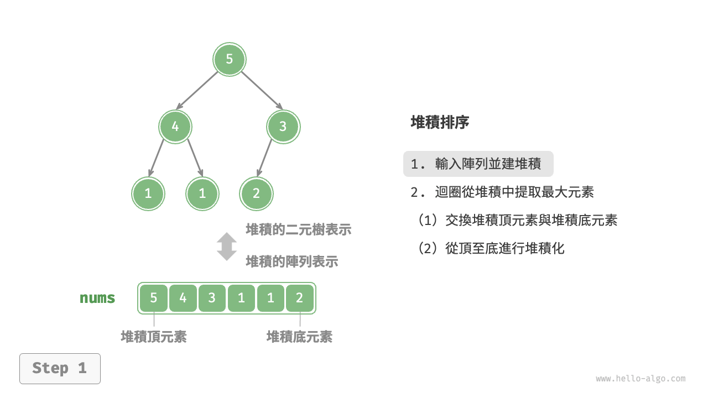{ class="animation-figure" }

=== "<2>"
    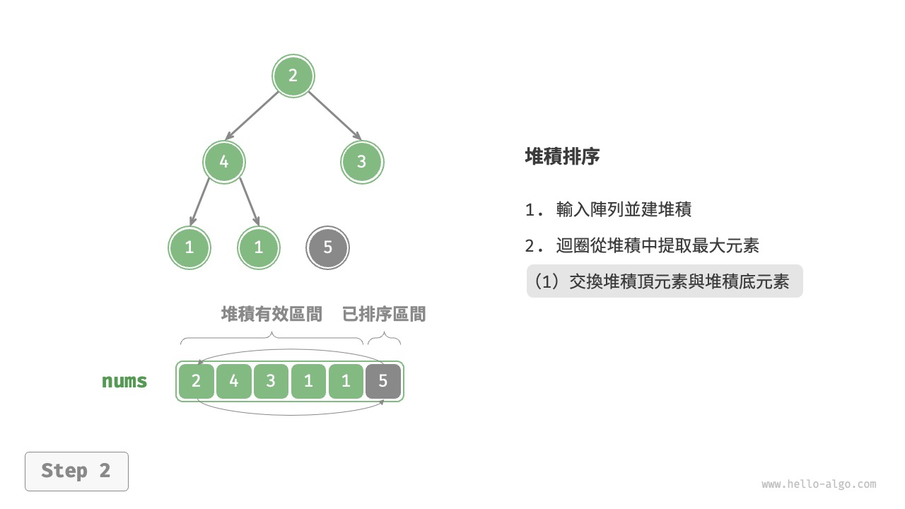{ class="animation-figure" }

=== "<3>"
    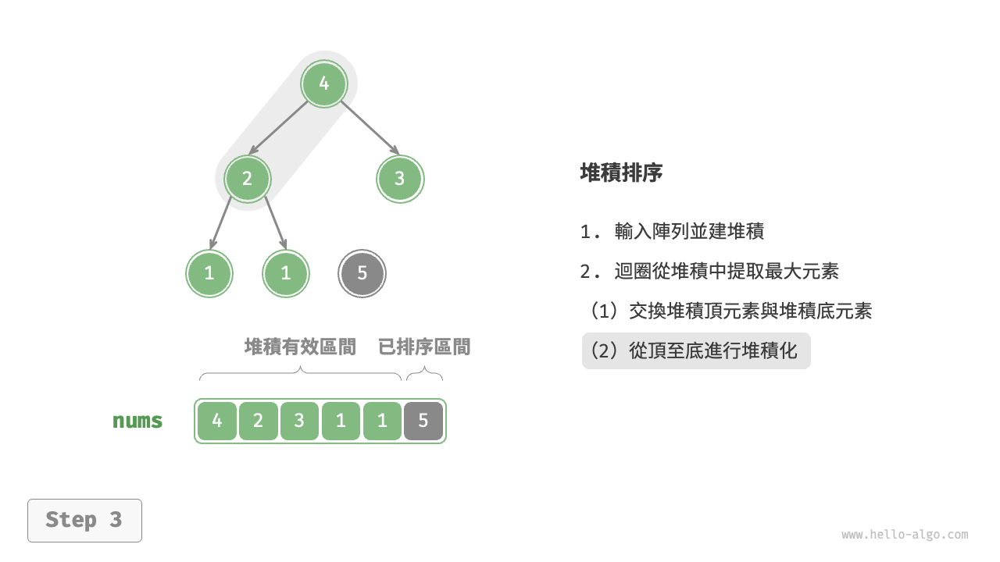{ class="animation-figure" }

=== "<4>"
    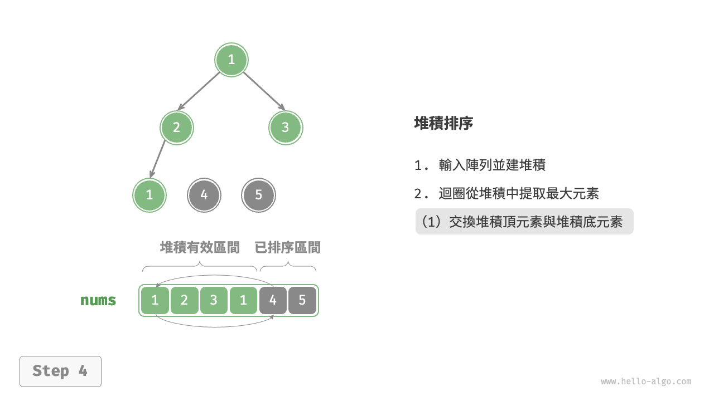{ class="animation-figure" }

=== "<5>"
    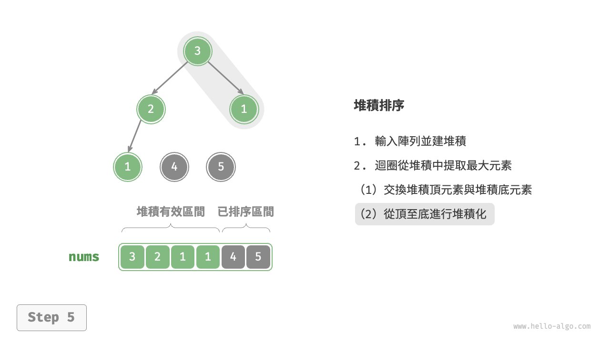{ class="animation-figure" }

=== "<6>"
    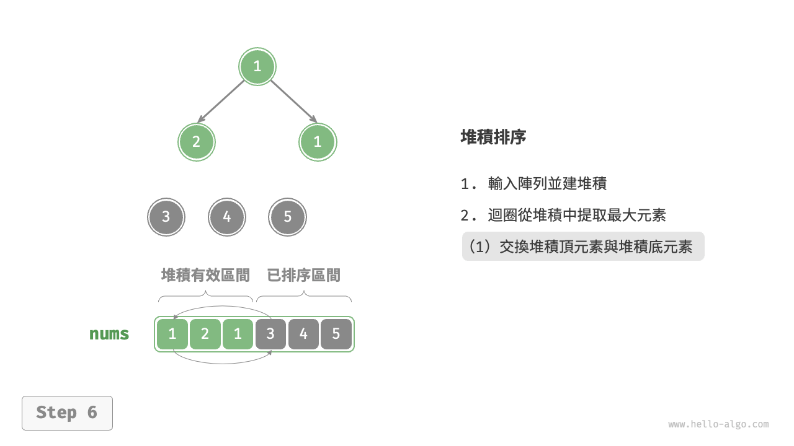{ class="animation-figure" }

=== "<7>"
    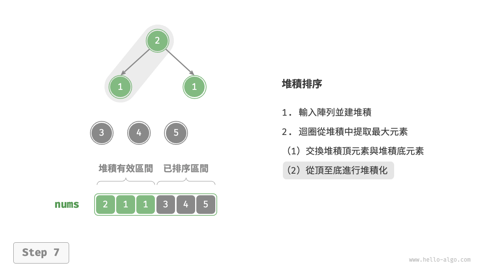{ class="animation-figure" }

=== "<8>"
    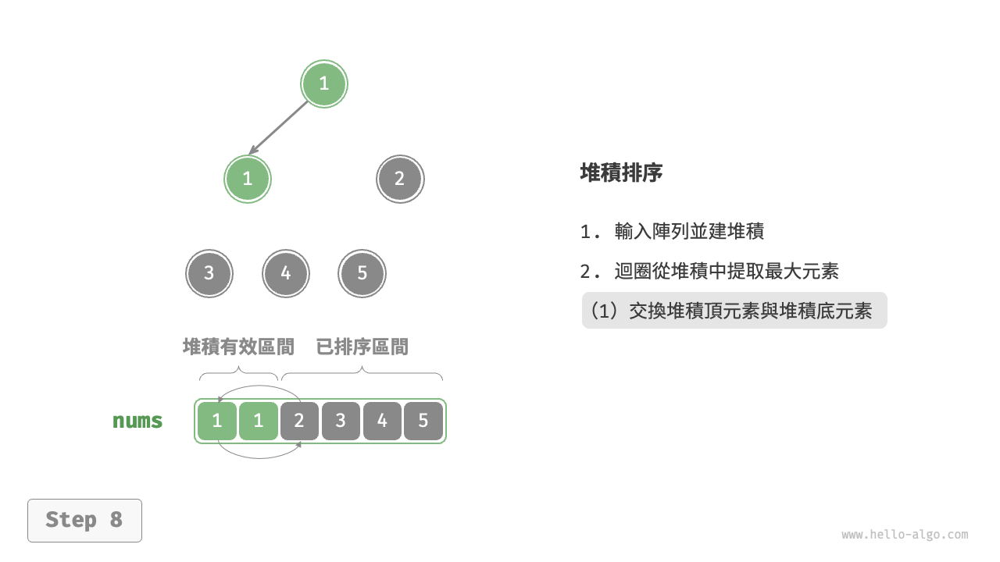{ class="animation-figure" }

=== "<9>"
    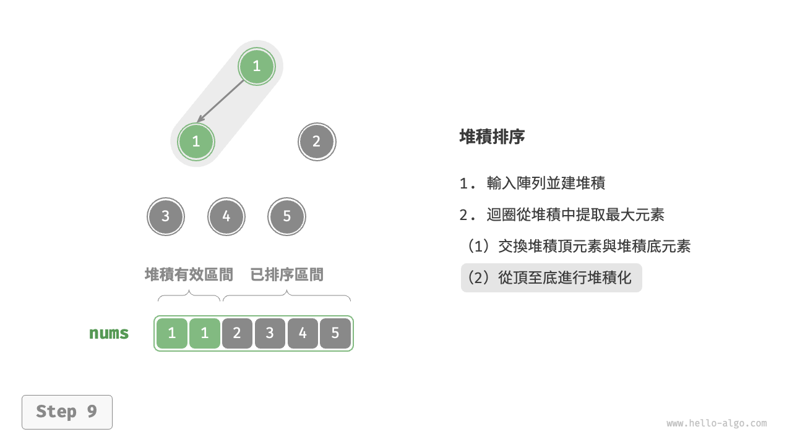{ class="animation-figure" }

=== "<10>"
    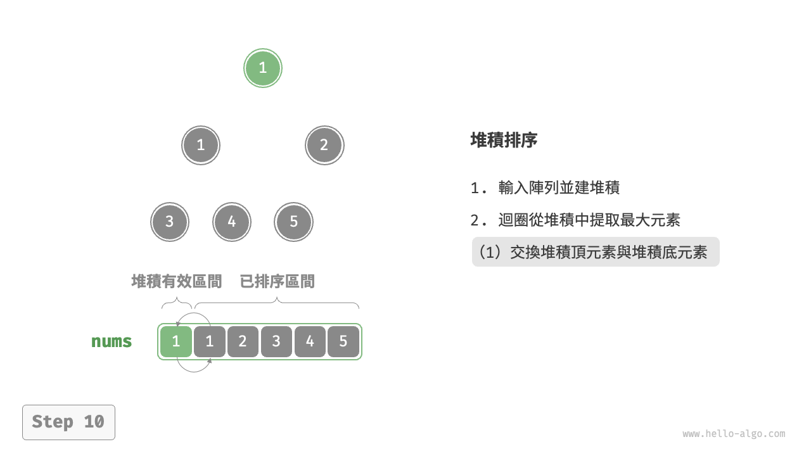{ class="animation-figure" }

=== "<11>"
    { class="animation-figure" }

=== "<12>"
    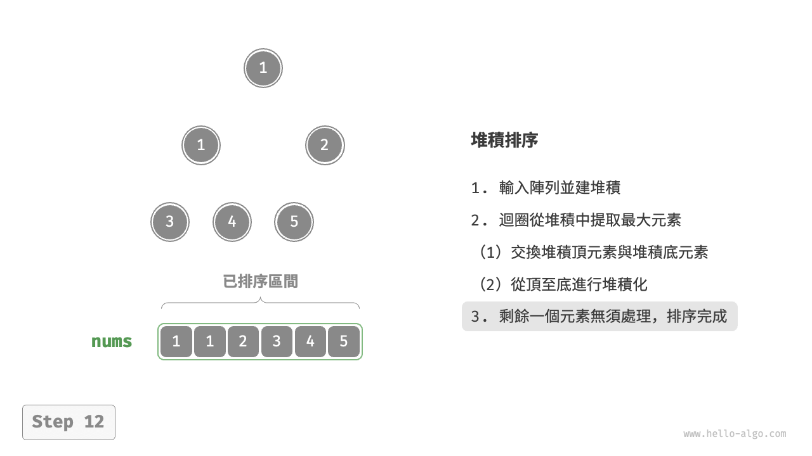{ class="animation-figure" }

<p align="center"> 圖 11-12 &nbsp; 堆積排序步驟 </p>

在程式碼實現中，我們使用了與“堆積”章節相同的從頂至底堆積化 `sift_down()` 函式。值得注意的是，由於堆積的長度會隨著提取最大元素而減小，因此我們需要給 `sift_down()` 函式新增一個長度參數 $n$ ，用於指定堆積的當前有效長度。程式碼如下所示：

=== "Python"

    ```python title="heap_sort.py"
    def sift_down(nums: list[int], n: int, i: int):
        """堆積的長度為 n ，從節點 i 開始，從頂至底堆積化"""
        while True:
            # 判斷節點 i, l, r 中值最大的節點，記為 ma
            l = 2 * i + 1
            r = 2 * i + 2
            ma = i
            if l < n and nums[l] > nums[ma]:
                ma = l
            if r < n and nums[r] > nums[ma]:
                ma = r
            # 若節點 i 最大或索引 l, r 越界，則無須繼續堆積化，跳出
            if ma == i:
                break
            # 交換兩節點
            nums[i], nums[ma] = nums[ma], nums[i]
            # 迴圈向下堆積化
            i = ma

    def heap_sort(nums: list[int]):
        """堆積排序"""
        # 建堆積操作：堆積化除葉節點以外的其他所有節點
        for i in range(len(nums) // 2 - 1, -1, -1):
            sift_down(nums, len(nums), i)
        # 從堆積中提取最大元素，迴圈 n-1 輪
        for i in range(len(nums) - 1, 0, -1):
            # 交換根節點與最右葉節點（交換首元素與尾元素）
            nums[0], nums[i] = nums[i], nums[0]
            # 以根節點為起點，從頂至底進行堆積化
            sift_down(nums, i, 0)
    ```

=== "C++"

    ```cpp title="heap_sort.cpp"
    /* 堆積的長度為 n ，從節點 i 開始，從頂至底堆積化 */
    void siftDown(vector<int> &nums, int n, int i) {
        while (true) {
            // 判斷節點 i, l, r 中值最大的節點，記為 ma
            int l = 2 * i + 1;
            int r = 2 * i + 2;
            int ma = i;
            if (l < n && nums[l] > nums[ma])
                ma = l;
            if (r < n && nums[r] > nums[ma])
                ma = r;
            // 若節點 i 最大或索引 l, r 越界，則無須繼續堆積化，跳出
            if (ma == i) {
                break;
            }
            // 交換兩節點
            swap(nums[i], nums[ma]);
            // 迴圈向下堆積化
            i = ma;
        }
    }

    /* 堆積排序 */
    void heapSort(vector<int> &nums) {
        // 建堆積操作：堆積化除葉節點以外的其他所有節點
        for (int i = nums.size() / 2 - 1; i >= 0; --i) {
            siftDown(nums, nums.size(), i);
        }
        // 從堆積中提取最大元素，迴圈 n-1 輪
        for (int i = nums.size() - 1; i > 0; --i) {
            // 交換根節點與最右葉節點（交換首元素與尾元素）
            swap(nums[0], nums[i]);
            // 以根節點為起點，從頂至底進行堆積化
            siftDown(nums, i, 0);
        }
    }
    ```

=== "Java"

    ```java title="heap_sort.java"
    /* 堆積的長度為 n ，從節點 i 開始，從頂至底堆積化 */
    void siftDown(int[] nums, int n, int i) {
        while (true) {
            // 判斷節點 i, l, r 中值最大的節點，記為 ma
            int l = 2 * i + 1;
            int r = 2 * i + 2;
            int ma = i;
            if (l < n && nums[l] > nums[ma])
                ma = l;
            if (r < n && nums[r] > nums[ma])
                ma = r;
            // 若節點 i 最大或索引 l, r 越界，則無須繼續堆積化，跳出
            if (ma == i)
                break;
            // 交換兩節點
            int temp = nums[i];
            nums[i] = nums[ma];
            nums[ma] = temp;
            // 迴圈向下堆積化
            i = ma;
        }
    }

    /* 堆積排序 */
    void heapSort(int[] nums) {
        // 建堆積操作：堆積化除葉節點以外的其他所有節點
        for (int i = nums.length / 2 - 1; i >= 0; i--) {
            siftDown(nums, nums.length, i);
        }
        // 從堆積中提取最大元素，迴圈 n-1 輪
        for (int i = nums.length - 1; i > 0; i--) {
            // 交換根節點與最右葉節點（交換首元素與尾元素）
            int tmp = nums[0];
            nums[0] = nums[i];
            nums[i] = tmp;
            // 以根節點為起點，從頂至底進行堆積化
            siftDown(nums, i, 0);
        }
    }
    ```

=== "C#"

    ```csharp title="heap_sort.cs"
    /* 堆積的長度為 n ，從節點 i 開始，從頂至底堆積化 */
    void SiftDown(int[] nums, int n, int i) {
        while (true) {
            // 判斷節點 i, l, r 中值最大的節點，記為 ma
            int l = 2 * i + 1;
            int r = 2 * i + 2;
            int ma = i;
            if (l < n && nums[l] > nums[ma])
                ma = l;
            if (r < n && nums[r] > nums[ma])
                ma = r;
            // 若節點 i 最大或索引 l, r 越界，則無須繼續堆積化，跳出
            if (ma == i)
                break;
            // 交換兩節點
            (nums[ma], nums[i]) = (nums[i], nums[ma]);
            // 迴圈向下堆積化
            i = ma;
        }
    }

    /* 堆積排序 */
    void HeapSort(int[] nums) {
        // 建堆積操作：堆積化除葉節點以外的其他所有節點
        for (int i = nums.Length / 2 - 1; i >= 0; i--) {
            SiftDown(nums, nums.Length, i);
        }
        // 從堆積中提取最大元素，迴圈 n-1 輪
        for (int i = nums.Length - 1; i > 0; i--) {
            // 交換根節點與最右葉節點（交換首元素與尾元素）
            (nums[i], nums[0]) = (nums[0], nums[i]);
            // 以根節點為起點，從頂至底進行堆積化
            SiftDown(nums, i, 0);
        }
    }
    ```

=== "Go"

    ```go title="heap_sort.go"
    /* 堆積的長度為 n ，從節點 i 開始，從頂至底堆積化 */
    func siftDown(nums *[]int, n, i int) {
        for true {
            // 判斷節點 i, l, r 中值最大的節點，記為 ma
            l := 2*i + 1
            r := 2*i + 2
            ma := i
            if l < n && (*nums)[l] > (*nums)[ma] {
                ma = l
            }
            if r < n && (*nums)[r] > (*nums)[ma] {
                ma = r
            }
            // 若節點 i 最大或索引 l, r 越界，則無須繼續堆積化，跳出
            if ma == i {
                break
            }
            // 交換兩節點
            (*nums)[i], (*nums)[ma] = (*nums)[ma], (*nums)[i]
            // 迴圈向下堆積化
            i = ma
        }
    }

    /* 堆積排序 */
    func heapSort(nums *[]int) {
        // 建堆積操作：堆積化除葉節點以外的其他所有節點
        for i := len(*nums)/2 - 1; i >= 0; i-- {
            siftDown(nums, len(*nums), i)
        }
        // 從堆積中提取最大元素，迴圈 n-1 輪
        for i := len(*nums) - 1; i > 0; i-- {
            // 交換根節點與最右葉節點（交換首元素與尾元素）
            (*nums)[0], (*nums)[i] = (*nums)[i], (*nums)[0]
            // 以根節點為起點，從頂至底進行堆積化
            siftDown(nums, i, 0)
        }
    }
    ```

=== "Swift"

    ```swift title="heap_sort.swift"
    /* 堆積的長度為 n ，從節點 i 開始，從頂至底堆積化 */
    func siftDown(nums: inout [Int], n: Int, i: Int) {
        var i = i
        while true {
            // 判斷節點 i, l, r 中值最大的節點，記為 ma
            let l = 2 * i + 1
            let r = 2 * i + 2
            var ma = i
            if l < n, nums[l] > nums[ma] {
                ma = l
            }
            if r < n, nums[r] > nums[ma] {
                ma = r
            }
            // 若節點 i 最大或索引 l, r 越界，則無須繼續堆積化，跳出
            if ma == i {
                break
            }
            // 交換兩節點
            nums.swapAt(i, ma)
            // 迴圈向下堆積化
            i = ma
        }
    }

    /* 堆積排序 */
    func heapSort(nums: inout [Int]) {
        // 建堆積操作：堆積化除葉節點以外的其他所有節點
        for i in stride(from: nums.count / 2 - 1, through: 0, by: -1) {
            siftDown(nums: &nums, n: nums.count, i: i)
        }
        // 從堆積中提取最大元素，迴圈 n-1 輪
        for i in nums.indices.dropFirst().reversed() {
            // 交換根節點與最右葉節點（交換首元素與尾元素）
            nums.swapAt(0, i)
            // 以根節點為起點，從頂至底進行堆積化
            siftDown(nums: &nums, n: i, i: 0)
        }
    }
    ```

=== "JS"

    ```javascript title="heap_sort.js"
    /* 堆積的長度為 n ，從節點 i 開始，從頂至底堆積化 */
    function siftDown(nums, n, i) {
        while (true) {
            // 判斷節點 i, l, r 中值最大的節點，記為 ma
            let l = 2 * i + 1;
            let r = 2 * i + 2;
            let ma = i;
            if (l < n && nums[l] > nums[ma]) {
                ma = l;
            }
            if (r < n && nums[r] > nums[ma]) {
                ma = r;
            }
            // 若節點 i 最大或索引 l, r 越界，則無須繼續堆積化，跳出
            if (ma === i) {
                break;
            }
            // 交換兩節點
            [nums[i], nums[ma]] = [nums[ma], nums[i]];
            // 迴圈向下堆積化
            i = ma;
        }
    }

    /* 堆積排序 */
    function heapSort(nums) {
        // 建堆積操作：堆積化除葉節點以外的其他所有節點
        for (let i = Math.floor(nums.length / 2) - 1; i >= 0; i--) {
            siftDown(nums, nums.length, i);
        }
        // 從堆積中提取最大元素，迴圈 n-1 輪
        for (let i = nums.length - 1; i > 0; i--) {
            // 交換根節點與最右葉節點（交換首元素與尾元素）
            [nums[0], nums[i]] = [nums[i], nums[0]];
            // 以根節點為起點，從頂至底進行堆積化
            siftDown(nums, i, 0);
        }
    }
    ```

=== "TS"

    ```typescript title="heap_sort.ts"
    /* 堆積的長度為 n ，從節點 i 開始，從頂至底堆積化 */
    function siftDown(nums: number[], n: number, i: number): void {
        while (true) {
            // 判斷節點 i, l, r 中值最大的節點，記為 ma
            let l = 2 * i + 1;
            let r = 2 * i + 2;
            let ma = i;
            if (l < n && nums[l] > nums[ma]) {
                ma = l;
            }
            if (r < n && nums[r] > nums[ma]) {
                ma = r;
            }
            // 若節點 i 最大或索引 l, r 越界，則無須繼續堆積化，跳出
            if (ma === i) {
                break;
            }
            // 交換兩節點
            [nums[i], nums[ma]] = [nums[ma], nums[i]];
            // 迴圈向下堆積化
            i = ma;
        }
    }

    /* 堆積排序 */
    function heapSort(nums: number[]): void {
        // 建堆積操作：堆積化除葉節點以外的其他所有節點
        for (let i = Math.floor(nums.length / 2) - 1; i >= 0; i--) {
            siftDown(nums, nums.length, i);
        }
        // 從堆積中提取最大元素，迴圈 n-1 輪
        for (let i = nums.length - 1; i > 0; i--) {
            // 交換根節點與最右葉節點（交換首元素與尾元素）
            [nums[0], nums[i]] = [nums[i], nums[0]];
            // 以根節點為起點，從頂至底進行堆積化
            siftDown(nums, i, 0);
        }
    }
    ```

=== "Dart"

    ```dart title="heap_sort.dart"
    /* 堆積的長度為 n ，從節點 i 開始，從頂至底堆積化 */
    void siftDown(List<int> nums, int n, int i) {
      while (true) {
        // 判斷節點 i, l, r 中值最大的節點，記為 ma
        int l = 2 * i + 1;
        int r = 2 * i + 2;
        int ma = i;
        if (l < n && nums[l] > nums[ma]) ma = l;
        if (r < n && nums[r] > nums[ma]) ma = r;
        // 若節點 i 最大或索引 l, r 越界，則無須繼續堆積化，跳出
        if (ma == i) break;
        // 交換兩節點
        int temp = nums[i];
        nums[i] = nums[ma];
        nums[ma] = temp;
        // 迴圈向下堆積化
        i = ma;
      }
    }

    /* 堆積排序 */
    void heapSort(List<int> nums) {
      // 建堆積操作：堆積化除葉節點以外的其他所有節點
      for (int i = nums.length ~/ 2 - 1; i >= 0; i--) {
        siftDown(nums, nums.length, i);
      }
      // 從堆積中提取最大元素，迴圈 n-1 輪
      for (int i = nums.length - 1; i > 0; i--) {
        // 交換根節點與最右葉節點（交換首元素與尾元素）
        int tmp = nums[0];
        nums[0] = nums[i];
        nums[i] = tmp;
        // 以根節點為起點，從頂至底進行堆積化
        siftDown(nums, i, 0);
      }
    }
    ```

=== "Rust"

    ```rust title="heap_sort.rs"
    /* 堆積的長度為 n ，從節點 i 開始，從頂至底堆積化 */
    fn sift_down(nums: &mut [i32], n: usize, mut i: usize) {
        loop {
            // 判斷節點 i, l, r 中值最大的節點，記為 ma
            let l = 2 * i + 1;
            let r = 2 * i + 2;
            let mut ma = i;
            if l < n && nums[l] > nums[ma] {
                ma = l;
            }
            if r < n && nums[r] > nums[ma] {
                ma = r;
            }
            // 若節點 i 最大或索引 l, r 越界，則無須繼續堆積化，跳出
            if ma == i {
                break;
            }
            // 交換兩節點
            nums.swap(i, ma);
            // 迴圈向下堆積化
            i = ma;
        }
    }

    /* 堆積排序 */
    fn heap_sort(nums: &mut [i32]) {
        // 建堆積操作：堆積化除葉節點以外的其他所有節點
        for i in (0..nums.len() / 2).rev() {
            sift_down(nums, nums.len(), i);
        }
        // 從堆積中提取最大元素，迴圈 n-1 輪
        for i in (1..nums.len()).rev() {
            // 交換根節點與最右葉節點（交換首元素與尾元素）
            nums.swap(0, i);
            // 以根節點為起點，從頂至底進行堆積化
            sift_down(nums, i, 0);
        }
    }
    ```

=== "C"

    ```c title="heap_sort.c"
    /* 堆積的長度為 n ，從節點 i 開始，從頂至底堆積化 */
    void siftDown(int nums[], int n, int i) {
        while (1) {
            // 判斷節點 i, l, r 中值最大的節點，記為 ma
            int l = 2 * i + 1;
            int r = 2 * i + 2;
            int ma = i;
            if (l < n && nums[l] > nums[ma])
                ma = l;
            if (r < n && nums[r] > nums[ma])
                ma = r;
            // 若節點 i 最大或索引 l, r 越界，則無須繼續堆積化，跳出
            if (ma == i) {
                break;
            }
            // 交換兩節點
            int temp = nums[i];
            nums[i] = nums[ma];
            nums[ma] = temp;
            // 迴圈向下堆積化
            i = ma;
        }
    }

    /* 堆積排序 */
    void heapSort(int nums[], int n) {
        // 建堆積操作：堆積化除葉節點以外的其他所有節點
        for (int i = n / 2 - 1; i >= 0; --i) {
            siftDown(nums, n, i);
        }
        // 從堆積中提取最大元素，迴圈 n-1 輪
        for (int i = n - 1; i > 0; --i) {
            // 交換根節點與最右葉節點（交換首元素與尾元素）
            int tmp = nums[0];
            nums[0] = nums[i];
            nums[i] = tmp;
            // 以根節點為起點，從頂至底進行堆積化
            siftDown(nums, i, 0);
        }
    }
    ```

=== "Kotlin"

    ```kotlin title="heap_sort.kt"
    /* 堆積的長度為 n ，從節點 i 開始，從頂至底堆積化 */
    fun siftDown(nums: IntArray, n: Int, li: Int) {
        var i = li
        while (true) {
            // 判斷節點 i, l, r 中值最大的節點，記為 ma
            val l = 2 * i + 1
            val r = 2 * i + 2
            var ma = i
            if (l < n && nums[l] > nums[ma]) 
                ma = l
            if (r < n && nums[r] > nums[ma]) 
                ma = r
            // 若節點 i 最大或索引 l, r 越界，則無須繼續堆積化，跳出
            if (ma == i) 
                break
            // 交換兩節點
            val temp = nums[i]
            nums[i] = nums[ma]
            nums[ma] = temp
            // 迴圈向下堆積化
            i = ma
        }
    }

    /* 堆積排序 */
    fun heapSort(nums: IntArray) {
        // 建堆積操作：堆積化除葉節點以外的其他所有節點
        for (i in nums.size / 2 - 1 downTo 0) {
            siftDown(nums, nums.size, i)
        }
        // 從堆積中提取最大元素，迴圈 n-1 輪
        for (i in nums.size - 1 downTo 1) {
            // 交換根節點與最右葉節點（交換首元素與尾元素）
            val temp = nums[0]
            nums[0] = nums[i]
            nums[i] = temp
            // 以根節點為起點，從頂至底進行堆積化
            siftDown(nums, i, 0)
        }
    }
    ```

=== "Ruby"

    ```ruby title="heap_sort.rb"
    ### 堆積的長度為 n ，從節點 i 開始，從頂至底堆積化 ###
    def sift_down(nums, n, i)
      while true
        # 判斷節點 i, l, r 中值最大的節點，記為 ma
        l = 2 * i + 1
        r = 2 * i + 2
        ma = i
        ma = l if l < n && nums[l] > nums[ma]
        ma = r if r < n && nums[r] > nums[ma]
        # 若節點 i 最大或索引 l, r 越界，則無須繼續堆積化，跳出
        break if ma == i
        # 交換兩節點
        nums[i], nums[ma] = nums[ma], nums[i]
        # 迴圈向下堆積化
        i = ma
      end
    end

    ### 堆積排序 ###
    def heap_sort(nums)
      # 建堆積操作：堆積化除葉節點以外的其他所有節點
      (nums.length / 2 - 1).downto(0) do |i|
        sift_down(nums, nums.length, i)
      end
      # 從堆積中提取最大元素，迴圈 n-1 輪
      (nums.length - 1).downto(1) do |i|
        # 交換根節點與最右葉節點（交換首元素與尾元素）
        nums[0], nums[i] = nums[i], nums[0]
        # 以根節點為起點，從頂至底進行堆積化
        sift_down(nums, i, 0)
      end
    end
    ```

=== "Zig"

    ```zig title="heap_sort.zig"
    [class]{}-[func]{siftDown}

    [class]{}-[func]{heapSort}
    ```

??? pythontutor "視覺化執行"

    <div style="height: 549px; width: 100%;"><iframe class="pythontutor-iframe" src="https://pythontutor.com/iframe-embed.html#code=def%20sift_down%28nums%3A%20list%5Bint%5D%2C%20n%3A%20int%2C%20i%3A%20int%29%3A%0A%20%20%20%20%22%22%22%E5%A0%86%E7%A9%8D%E7%9A%84%E9%95%B7%E5%BA%A6%E7%82%BA%20n%20%EF%BC%8C%E5%BE%9E%E7%AF%80%E9%BB%9E%20i%20%E9%96%8B%E5%A7%8B%EF%BC%8C%E5%BE%9E%E9%A0%82%E8%87%B3%E5%BA%95%E5%A0%86%E7%A9%8D%E5%8C%96%22%22%22%0A%20%20%20%20while%20True%3A%0A%20%20%20%20%20%20%20%20%23%20%E5%88%A4%E6%96%B7%E7%AF%80%E9%BB%9E%20i%2C%20l%2C%20r%20%E4%B8%AD%E5%80%BC%E6%9C%80%E5%A4%A7%E7%9A%84%E7%AF%80%E9%BB%9E%EF%BC%8C%E8%A8%98%E7%82%BA%20ma%0A%20%20%20%20%20%20%20%20l%20%3D%202%20%2A%20i%20%2B%201%0A%20%20%20%20%20%20%20%20r%20%3D%202%20%2A%20i%20%2B%202%0A%20%20%20%20%20%20%20%20ma%20%3D%20i%0A%20%20%20%20%20%20%20%20if%20l%20%3C%20n%20and%20nums%5Bl%5D%20%3E%20nums%5Bma%5D%3A%0A%20%20%20%20%20%20%20%20%20%20%20%20ma%20%3D%20l%0A%20%20%20%20%20%20%20%20if%20r%20%3C%20n%20and%20nums%5Br%5D%20%3E%20nums%5Bma%5D%3A%0A%20%20%20%20%20%20%20%20%20%20%20%20ma%20%3D%20r%0A%20%20%20%20%20%20%20%20%23%20%E8%8B%A5%E7%AF%80%E9%BB%9E%20i%20%E6%9C%80%E5%A4%A7%E6%88%96%E7%B4%A2%E5%BC%95%20l%2C%20r%20%E8%B6%8A%E7%95%8C%EF%BC%8C%E5%89%87%E7%84%A1%E9%A0%88%E7%B9%BC%E7%BA%8C%E5%A0%86%E7%A9%8D%E5%8C%96%EF%BC%8C%E8%B7%B3%E5%87%BA%0A%20%20%20%20%20%20%20%20if%20ma%20%3D%3D%20i%3A%0A%20%20%20%20%20%20%20%20%20%20%20%20break%0A%20%20%20%20%20%20%20%20%23%20%E4%BA%A4%E6%8F%9B%E5%85%A9%E7%AF%80%E9%BB%9E%0A%20%20%20%20%20%20%20%20nums%5Bi%5D%2C%20nums%5Bma%5D%20%3D%20nums%5Bma%5D%2C%20nums%5Bi%5D%0A%20%20%20%20%20%20%20%20%23%20%E8%BF%B4%E5%9C%88%E5%90%91%E4%B8%8B%E5%A0%86%E7%A9%8D%E5%8C%96%0A%20%20%20%20%20%20%20%20i%20%3D%20ma%0A%0Adef%20heap_sort%28nums%3A%20list%5Bint%5D%29%3A%0A%20%20%20%20%22%22%22%E5%A0%86%E7%A9%8D%E6%8E%92%E5%BA%8F%22%22%22%0A%20%20%20%20%23%20%E5%BB%BA%E5%A0%86%E7%A9%8D%E6%93%8D%E4%BD%9C%EF%BC%9A%E5%A0%86%E7%A9%8D%E5%8C%96%E9%99%A4%E8%91%89%E7%AF%80%E9%BB%9E%E4%BB%A5%E5%A4%96%E7%9A%84%E5%85%B6%E4%BB%96%E6%89%80%E6%9C%89%E7%AF%80%E9%BB%9E%0A%20%20%20%20for%20i%20in%20range%28len%28nums%29%20//%202%20-%201%2C%20-1%2C%20-1%29%3A%0A%20%20%20%20%20%20%20%20sift_down%28nums%2C%20len%28nums%29%2C%20i%29%0A%20%20%20%20%23%20%E5%BE%9E%E5%A0%86%E7%A9%8D%E4%B8%AD%E6%8F%90%E5%8F%96%E6%9C%80%E5%A4%A7%E5%85%83%E7%B4%A0%EF%BC%8C%E8%BF%B4%E5%9C%88%20n-1%20%E8%BC%AA%0A%20%20%20%20for%20i%20in%20range%28len%28nums%29%20-%201%2C%200%2C%20-1%29%3A%0A%20%20%20%20%20%20%20%20%23%20%E4%BA%A4%E6%8F%9B%E6%A0%B9%E7%AF%80%E9%BB%9E%E8%88%87%E6%9C%80%E5%8F%B3%E8%91%89%E7%AF%80%E9%BB%9E%EF%BC%88%E4%BA%A4%E6%8F%9B%E9%A6%96%E5%85%83%E7%B4%A0%E8%88%87%E5%B0%BE%E5%85%83%E7%B4%A0%EF%BC%89%0A%20%20%20%20%20%20%20%20nums%5B0%5D%2C%20nums%5Bi%5D%20%3D%20nums%5Bi%5D%2C%20nums%5B0%5D%0A%20%20%20%20%20%20%20%20%23%20%E4%BB%A5%E6%A0%B9%E7%AF%80%E9%BB%9E%E7%82%BA%E8%B5%B7%E9%BB%9E%EF%BC%8C%E5%BE%9E%E9%A0%82%E8%87%B3%E5%BA%95%E9%80%B2%E8%A1%8C%E5%A0%86%E7%A9%8D%E5%8C%96%0A%20%20%20%20%20%20%20%20sift_down%28nums%2C%20i%2C%200%29%0A%0A%22%22%22Driver%20Code%22%22%22%0Aif%20__name__%20%3D%3D%20%22__main__%22%3A%0A%20%20%20%20nums%20%3D%20%5B4%2C%201%2C%203%2C%201%2C%205%2C%202%5D%0A%20%20%20%20heap_sort%28nums%29%0A%20%20%20%20print%28%22%E5%A0%86%E7%A9%8D%E6%8E%92%E5%BA%8F%E5%AE%8C%E6%88%90%E5%BE%8C%20nums%20%3D%22%2C%20nums%29&codeDivHeight=472&codeDivWidth=350&cumulative=false&curInstr=5&heapPrimitives=nevernest&origin=opt-frontend.js&py=311&rawInputLstJSON=%5B%5D&textReferences=false"> </iframe></div>
    <div style="margin-top: 5px;"><a href="https://pythontutor.com/iframe-embed.html#code=def%20sift_down%28nums%3A%20list%5Bint%5D%2C%20n%3A%20int%2C%20i%3A%20int%29%3A%0A%20%20%20%20%22%22%22%E5%A0%86%E7%A9%8D%E7%9A%84%E9%95%B7%E5%BA%A6%E7%82%BA%20n%20%EF%BC%8C%E5%BE%9E%E7%AF%80%E9%BB%9E%20i%20%E9%96%8B%E5%A7%8B%EF%BC%8C%E5%BE%9E%E9%A0%82%E8%87%B3%E5%BA%95%E5%A0%86%E7%A9%8D%E5%8C%96%22%22%22%0A%20%20%20%20while%20True%3A%0A%20%20%20%20%20%20%20%20%23%20%E5%88%A4%E6%96%B7%E7%AF%80%E9%BB%9E%20i%2C%20l%2C%20r%20%E4%B8%AD%E5%80%BC%E6%9C%80%E5%A4%A7%E7%9A%84%E7%AF%80%E9%BB%9E%EF%BC%8C%E8%A8%98%E7%82%BA%20ma%0A%20%20%20%20%20%20%20%20l%20%3D%202%20%2A%20i%20%2B%201%0A%20%20%20%20%20%20%20%20r%20%3D%202%20%2A%20i%20%2B%202%0A%20%20%20%20%20%20%20%20ma%20%3D%20i%0A%20%20%20%20%20%20%20%20if%20l%20%3C%20n%20and%20nums%5Bl%5D%20%3E%20nums%5Bma%5D%3A%0A%20%20%20%20%20%20%20%20%20%20%20%20ma%20%3D%20l%0A%20%20%20%20%20%20%20%20if%20r%20%3C%20n%20and%20nums%5Br%5D%20%3E%20nums%5Bma%5D%3A%0A%20%20%20%20%20%20%20%20%20%20%20%20ma%20%3D%20r%0A%20%20%20%20%20%20%20%20%23%20%E8%8B%A5%E7%AF%80%E9%BB%9E%20i%20%E6%9C%80%E5%A4%A7%E6%88%96%E7%B4%A2%E5%BC%95%20l%2C%20r%20%E8%B6%8A%E7%95%8C%EF%BC%8C%E5%89%87%E7%84%A1%E9%A0%88%E7%B9%BC%E7%BA%8C%E5%A0%86%E7%A9%8D%E5%8C%96%EF%BC%8C%E8%B7%B3%E5%87%BA%0A%20%20%20%20%20%20%20%20if%20ma%20%3D%3D%20i%3A%0A%20%20%20%20%20%20%20%20%20%20%20%20break%0A%20%20%20%20%20%20%20%20%23%20%E4%BA%A4%E6%8F%9B%E5%85%A9%E7%AF%80%E9%BB%9E%0A%20%20%20%20%20%20%20%20nums%5Bi%5D%2C%20nums%5Bma%5D%20%3D%20nums%5Bma%5D%2C%20nums%5Bi%5D%0A%20%20%20%20%20%20%20%20%23%20%E8%BF%B4%E5%9C%88%E5%90%91%E4%B8%8B%E5%A0%86%E7%A9%8D%E5%8C%96%0A%20%20%20%20%20%20%20%20i%20%3D%20ma%0A%0Adef%20heap_sort%28nums%3A%20list%5Bint%5D%29%3A%0A%20%20%20%20%22%22%22%E5%A0%86%E7%A9%8D%E6%8E%92%E5%BA%8F%22%22%22%0A%20%20%20%20%23%20%E5%BB%BA%E5%A0%86%E7%A9%8D%E6%93%8D%E4%BD%9C%EF%BC%9A%E5%A0%86%E7%A9%8D%E5%8C%96%E9%99%A4%E8%91%89%E7%AF%80%E9%BB%9E%E4%BB%A5%E5%A4%96%E7%9A%84%E5%85%B6%E4%BB%96%E6%89%80%E6%9C%89%E7%AF%80%E9%BB%9E%0A%20%20%20%20for%20i%20in%20range%28len%28nums%29%20//%202%20-%201%2C%20-1%2C%20-1%29%3A%0A%20%20%20%20%20%20%20%20sift_down%28nums%2C%20len%28nums%29%2C%20i%29%0A%20%20%20%20%23%20%E5%BE%9E%E5%A0%86%E7%A9%8D%E4%B8%AD%E6%8F%90%E5%8F%96%E6%9C%80%E5%A4%A7%E5%85%83%E7%B4%A0%EF%BC%8C%E8%BF%B4%E5%9C%88%20n-1%20%E8%BC%AA%0A%20%20%20%20for%20i%20in%20range%28len%28nums%29%20-%201%2C%200%2C%20-1%29%3A%0A%20%20%20%20%20%20%20%20%23%20%E4%BA%A4%E6%8F%9B%E6%A0%B9%E7%AF%80%E9%BB%9E%E8%88%87%E6%9C%80%E5%8F%B3%E8%91%89%E7%AF%80%E9%BB%9E%EF%BC%88%E4%BA%A4%E6%8F%9B%E9%A6%96%E5%85%83%E7%B4%A0%E8%88%87%E5%B0%BE%E5%85%83%E7%B4%A0%EF%BC%89%0A%20%20%20%20%20%20%20%20nums%5B0%5D%2C%20nums%5Bi%5D%20%3D%20nums%5Bi%5D%2C%20nums%5B0%5D%0A%20%20%20%20%20%20%20%20%23%20%E4%BB%A5%E6%A0%B9%E7%AF%80%E9%BB%9E%E7%82%BA%E8%B5%B7%E9%BB%9E%EF%BC%8C%E5%BE%9E%E9%A0%82%E8%87%B3%E5%BA%95%E9%80%B2%E8%A1%8C%E5%A0%86%E7%A9%8D%E5%8C%96%0A%20%20%20%20%20%20%20%20sift_down%28nums%2C%20i%2C%200%29%0A%0A%22%22%22Driver%20Code%22%22%22%0Aif%20__name__%20%3D%3D%20%22__main__%22%3A%0A%20%20%20%20nums%20%3D%20%5B4%2C%201%2C%203%2C%201%2C%205%2C%202%5D%0A%20%20%20%20heap_sort%28nums%29%0A%20%20%20%20print%28%22%E5%A0%86%E7%A9%8D%E6%8E%92%E5%BA%8F%E5%AE%8C%E6%88%90%E5%BE%8C%20nums%20%3D%22%2C%20nums%29&codeDivHeight=800&codeDivWidth=600&cumulative=false&curInstr=5&heapPrimitives=nevernest&origin=opt-frontend.js&py=311&rawInputLstJSON=%5B%5D&textReferences=false" target="_blank" rel="noopener noreferrer">全螢幕觀看 ></a></div>

## 11.7.2 &nbsp; 演算法特性

- **時間複雜度為 $O(n \log n)$、非自適應排序**：建堆積操作使用 $O(n)$ 時間。從堆積中提取最大元素的時間複雜度為 $O(\log n)$ ，共迴圈 $n - 1$ 輪。
- **空間複雜度為 $O(1)$、原地排序**：幾個指標變數使用 $O(1)$ 空間。元素交換和堆積化操作都是在原陣列上進行的。
- **非穩定排序**：在交換堆積頂元素和堆積底元素時，相等元素的相對位置可能發生變化。
