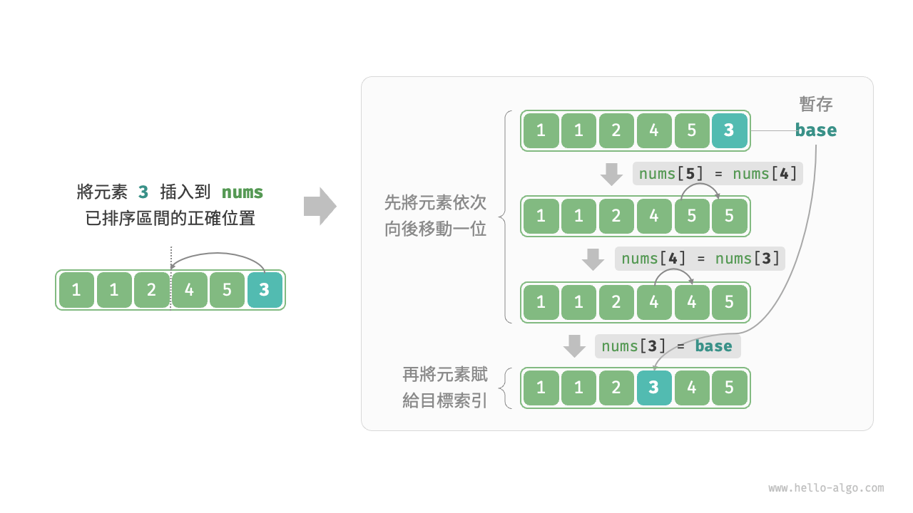
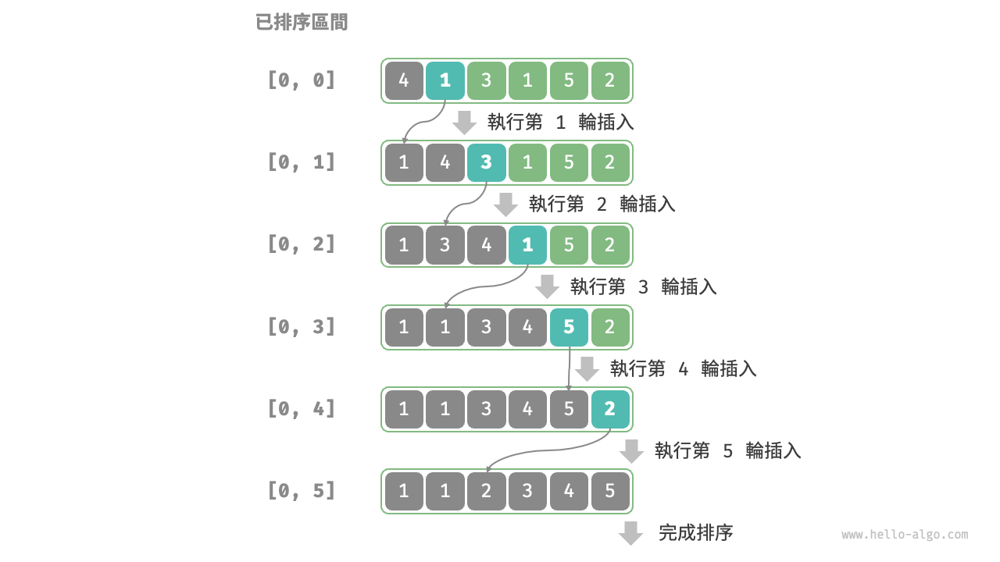

# 11.4 &nbsp; 插入排序

<u>插入排序（insertion sort）</u>是一種簡單的排序演算法，它的工作原理與手動整理一副牌的過程非常相似。

具體來說，我們在未排序區間選擇一個基準元素，將該元素與其左側已排序區間的元素逐一比較大小，並將該元素插入到正確的位置。

圖 11-6 展示了陣列插入元素的操作流程。設基準元素為 `base` ，我們需要將從目標索引到 `base` 之間的所有元素向右移動一位，然後將 `base` 賦值給目標索引。

{ class="animation-figure" }

<p align="center"> 圖 11-6 &nbsp; 單次插入操作 </p>

## 11.4.1 &nbsp; 演算法流程

插入排序的整體流程如圖 11-7 所示。

1. 初始狀態下，陣列的第 1 個元素已完成排序。
2. 選取陣列的第 2 個元素作為 `base` ，將其插入到正確位置後，**陣列的前 2 個元素已排序**。
3. 選取第 3 個元素作為 `base` ，將其插入到正確位置後，**陣列的前 3 個元素已排序**。
4. 以此類推，在最後一輪中，選取最後一個元素作為 `base` ，將其插入到正確位置後，**所有元素均已排序**。

{ class="animation-figure" }

<p align="center"> 圖 11-7 &nbsp; 插入排序流程 </p>

示例程式碼如下：

=== "Python"

    ```python title="insertion_sort.py"
    def insertion_sort(nums: list[int]):
        """插入排序"""
        # 外迴圈：已排序區間為 [0, i-1]
        for i in range(1, len(nums)):
            base = nums[i]
            j = i - 1
            # 內迴圈：將 base 插入到已排序區間 [0, i-1] 中的正確位置
            while j >= 0 and nums[j] > base:
                nums[j + 1] = nums[j]  # 將 nums[j] 向右移動一位
                j -= 1
            nums[j + 1] = base  # 將 base 賦值到正確位置
    ```

=== "C++"

    ```cpp title="insertion_sort.cpp"
    /* 插入排序 */
    void insertionSort(vector<int> &nums) {
        // 外迴圈：已排序區間為 [0, i-1]
        for (int i = 1; i < nums.size(); i++) {
            int base = nums[i], j = i - 1;
            // 內迴圈：將 base 插入到已排序區間 [0, i-1] 中的正確位置
            while (j >= 0 && nums[j] > base) {
                nums[j + 1] = nums[j]; // 將 nums[j] 向右移動一位
                j--;
            }
            nums[j + 1] = base; // 將 base 賦值到正確位置
        }
    }
    ```

=== "Java"

    ```java title="insertion_sort.java"
    /* 插入排序 */
    void insertionSort(int[] nums) {
        // 外迴圈：已排序區間為 [0, i-1]
        for (int i = 1; i < nums.length; i++) {
            int base = nums[i], j = i - 1;
            // 內迴圈：將 base 插入到已排序區間 [0, i-1] 中的正確位置
            while (j >= 0 && nums[j] > base) {
                nums[j + 1] = nums[j]; // 將 nums[j] 向右移動一位
                j--;
            }
            nums[j + 1] = base;        // 將 base 賦值到正確位置
        }
    }
    ```

=== "C#"

    ```csharp title="insertion_sort.cs"
    /* 插入排序 */
    void InsertionSort(int[] nums) {
        // 外迴圈：已排序區間為 [0, i-1]
        for (int i = 1; i < nums.Length; i++) {
            int bas = nums[i], j = i - 1;
            // 內迴圈：將 base 插入到已排序區間 [0, i-1] 中的正確位置
            while (j >= 0 && nums[j] > bas) {
                nums[j + 1] = nums[j]; // 將 nums[j] 向右移動一位
                j--;
            }
            nums[j + 1] = bas;         // 將 base 賦值到正確位置
        }
    }
    ```

=== "Go"

    ```go title="insertion_sort.go"
    /* 插入排序 */
    func insertionSort(nums []int) {
        // 外迴圈：已排序區間為 [0, i-1]
        for i := 1; i < len(nums); i++ {
            base := nums[i]
            j := i - 1
            // 內迴圈：將 base 插入到已排序區間 [0, i-1] 中的正確位置
            for j >= 0 && nums[j] > base {
                nums[j+1] = nums[j] // 將 nums[j] 向右移動一位
                j--
            }
            nums[j+1] = base // 將 base 賦值到正確位置
        }
    }
    ```

=== "Swift"

    ```swift title="insertion_sort.swift"
    /* 插入排序 */
    func insertionSort(nums: inout [Int]) {
        // 外迴圈：已排序區間為 [0, i-1]
        for i in nums.indices.dropFirst() {
            let base = nums[i]
            var j = i - 1
            // 內迴圈：將 base 插入到已排序區間 [0, i-1] 中的正確位置
            while j >= 0, nums[j] > base {
                nums[j + 1] = nums[j] // 將 nums[j] 向右移動一位
                j -= 1
            }
            nums[j + 1] = base // 將 base 賦值到正確位置
        }
    }
    ```

=== "JS"

    ```javascript title="insertion_sort.js"
    /* 插入排序 */
    function insertionSort(nums) {
        // 外迴圈：已排序區間為 [0, i-1]
        for (let i = 1; i < nums.length; i++) {
            let base = nums[i],
                j = i - 1;
            // 內迴圈：將 base 插入到已排序區間 [0, i-1] 中的正確位置
            while (j >= 0 && nums[j] > base) {
                nums[j + 1] = nums[j]; // 將 nums[j] 向右移動一位
                j--;
            }
            nums[j + 1] = base; // 將 base 賦值到正確位置
        }
    }
    ```

=== "TS"

    ```typescript title="insertion_sort.ts"
    /* 插入排序 */
    function insertionSort(nums: number[]): void {
        // 外迴圈：已排序區間為 [0, i-1]
        for (let i = 1; i < nums.length; i++) {
            const base = nums[i];
            let j = i - 1;
            // 內迴圈：將 base 插入到已排序區間 [0, i-1] 中的正確位置
            while (j >= 0 && nums[j] > base) {
                nums[j + 1] = nums[j]; // 將 nums[j] 向右移動一位
                j--;
            }
            nums[j + 1] = base; // 將 base 賦值到正確位置
        }
    }
    ```

=== "Dart"

    ```dart title="insertion_sort.dart"
    /* 插入排序 */
    void insertionSort(List<int> nums) {
      // 外迴圈：已排序區間為 [0, i-1]
      for (int i = 1; i < nums.length; i++) {
        int base = nums[i], j = i - 1;
        // 內迴圈：將 base 插入到已排序區間 [0, i-1] 中的正確位置
        while (j >= 0 && nums[j] > base) {
          nums[j + 1] = nums[j]; // 將 nums[j] 向右移動一位
          j--;
        }
        nums[j + 1] = base; // 將 base 賦值到正確位置
      }
    }
    ```

=== "Rust"

    ```rust title="insertion_sort.rs"
    /* 插入排序 */
    fn insertion_sort(nums: &mut [i32]) {
        // 外迴圈：已排序區間為 [0, i-1]
        for i in 1..nums.len() {
            let (base, mut j) = (nums[i], (i - 1) as i32);
            // 內迴圈：將 base 插入到已排序區間 [0, i-1] 中的正確位置
            while j >= 0 && nums[j as usize] > base {
                nums[(j + 1) as usize] = nums[j as usize]; // 將 nums[j] 向右移動一位
                j -= 1;
            }
            nums[(j + 1) as usize] = base; // 將 base 賦值到正確位置
        }
    }
    ```

=== "C"

    ```c title="insertion_sort.c"
    /* 插入排序 */
    void insertionSort(int nums[], int size) {
        // 外迴圈：已排序區間為 [0, i-1]
        for (int i = 1; i < size; i++) {
            int base = nums[i], j = i - 1;
            // 內迴圈：將 base 插入到已排序區間 [0, i-1] 中的正確位置
            while (j >= 0 && nums[j] > base) {
                // 將 nums[j] 向右移動一位
                nums[j + 1] = nums[j];
                j--;
            }
            // 將 base 賦值到正確位置
            nums[j + 1] = base;
        }
    }
    ```

=== "Kotlin"

    ```kotlin title="insertion_sort.kt"
    /* 插入排序 */
    fun insertionSort(nums: IntArray) {
        //外迴圈: 已排序元素為 1, 2, ..., n
        for (i in nums.indices) {
            val base = nums[i]
            var j = i - 1
            // 內迴圈：將 base 插入到已排序區間 [0, i-1] 中的正確位置
            while (j >= 0 && nums[j] > base) {
                nums[j + 1] = nums[j] // 將 nums[j] 向右移動一位
                j--
            }
            nums[j + 1] = base        // 將 base 賦值到正確位置
        }
    }
    ```

=== "Ruby"

    ```ruby title="insertion_sort.rb"
    ### 插入排序 ###
    def insertion_sort(nums)
      n = nums.length
      # 外迴圈：已排序區間為 [0, i-1]
      for i in 1...n
        base = nums[i]
        j = i - 1
        # 內迴圈：將 base 插入到已排序區間 [0, i-1] 中的正確位置
        while j >= 0 && nums[j] > base
          nums[j + 1] = nums[j] # 將 nums[j] 向右移動一位
          j -= 1
        end
        nums[j + 1] = base # 將 base 賦值到正確位置
      end
    end
    ```

??? pythontutor "視覺化執行"

    <div style="height: 513px; width: 100%;"><iframe class="pythontutor-iframe" src="https://pythontutor.com/iframe-embed.html#code=def%20insertion_sort%28nums%3A%20list%5Bint%5D%29%3A%0A%20%20%20%20%22%22%22%E6%8F%92%E5%85%A5%E6%8E%92%E5%BA%8F%22%22%22%0A%20%20%20%20%23%20%E5%A4%96%E8%BF%B4%E5%9C%88%EF%BC%9A%E5%B7%B2%E6%8E%92%E5%BA%8F%E5%8D%80%E9%96%93%E7%82%BA%20%5B0%2C%20i-1%5D%0A%20%20%20%20for%20i%20in%20range%281%2C%20len%28nums%29%29%3A%0A%20%20%20%20%20%20%20%20base%20%3D%20nums%5Bi%5D%0A%20%20%20%20%20%20%20%20j%20%3D%20i%20-%201%0A%20%20%20%20%20%20%20%20%23%20%E5%85%A7%E8%BF%B4%E5%9C%88%EF%BC%9A%E5%B0%87%20base%20%E6%8F%92%E5%85%A5%E5%88%B0%E5%B7%B2%E6%8E%92%E5%BA%8F%E5%8D%80%E9%96%93%20%5B0%2C%20i-1%5D%20%E4%B8%AD%E7%9A%84%E6%AD%A3%E7%A2%BA%E4%BD%8D%E7%BD%AE%0A%20%20%20%20%20%20%20%20while%20j%20%3E%3D%200%20and%20nums%5Bj%5D%20%3E%20base%3A%0A%20%20%20%20%20%20%20%20%20%20%20%20nums%5Bj%20%2B%201%5D%20%3D%20nums%5Bj%5D%20%20%23%20%E5%B0%87%20nums%5Bj%5D%20%E5%90%91%E5%8F%B3%E7%A7%BB%E5%8B%95%E4%B8%80%E4%BD%8D%0A%20%20%20%20%20%20%20%20%20%20%20%20j%20-%3D%201%0A%20%20%20%20%20%20%20%20nums%5Bj%20%2B%201%5D%20%3D%20base%20%20%23%20%E5%B0%87%20base%20%E8%B3%A6%E5%80%BC%E5%88%B0%E6%AD%A3%E7%A2%BA%E4%BD%8D%E7%BD%AE%0A%0A%0A%22%22%22Driver%20Code%22%22%22%0Aif%20__name__%20%3D%3D%20%22__main__%22%3A%0A%20%20%20%20nums%20%3D%20%5B4%2C%201%2C%203%2C%201%2C%205%2C%202%5D%0A%20%20%20%20insertion_sort%28nums%29%0A%20%20%20%20print%28%22%E6%8F%92%E5%85%A5%E6%8E%92%E5%BA%8F%E5%AE%8C%E6%88%90%E5%BE%8C%20nums%20%3D%22%2C%20nums%29&codeDivHeight=472&codeDivWidth=350&cumulative=false&curInstr=4&heapPrimitives=nevernest&origin=opt-frontend.js&py=311&rawInputLstJSON=%5B%5D&textReferences=false"> </iframe></div>
    <div style="margin-top: 5px;"><a href="https://pythontutor.com/iframe-embed.html#code=def%20insertion_sort%28nums%3A%20list%5Bint%5D%29%3A%0A%20%20%20%20%22%22%22%E6%8F%92%E5%85%A5%E6%8E%92%E5%BA%8F%22%22%22%0A%20%20%20%20%23%20%E5%A4%96%E8%BF%B4%E5%9C%88%EF%BC%9A%E5%B7%B2%E6%8E%92%E5%BA%8F%E5%8D%80%E9%96%93%E7%82%BA%20%5B0%2C%20i-1%5D%0A%20%20%20%20for%20i%20in%20range%281%2C%20len%28nums%29%29%3A%0A%20%20%20%20%20%20%20%20base%20%3D%20nums%5Bi%5D%0A%20%20%20%20%20%20%20%20j%20%3D%20i%20-%201%0A%20%20%20%20%20%20%20%20%23%20%E5%85%A7%E8%BF%B4%E5%9C%88%EF%BC%9A%E5%B0%87%20base%20%E6%8F%92%E5%85%A5%E5%88%B0%E5%B7%B2%E6%8E%92%E5%BA%8F%E5%8D%80%E9%96%93%20%5B0%2C%20i-1%5D%20%E4%B8%AD%E7%9A%84%E6%AD%A3%E7%A2%BA%E4%BD%8D%E7%BD%AE%0A%20%20%20%20%20%20%20%20while%20j%20%3E%3D%200%20and%20nums%5Bj%5D%20%3E%20base%3A%0A%20%20%20%20%20%20%20%20%20%20%20%20nums%5Bj%20%2B%201%5D%20%3D%20nums%5Bj%5D%20%20%23%20%E5%B0%87%20nums%5Bj%5D%20%E5%90%91%E5%8F%B3%E7%A7%BB%E5%8B%95%E4%B8%80%E4%BD%8D%0A%20%20%20%20%20%20%20%20%20%20%20%20j%20-%3D%201%0A%20%20%20%20%20%20%20%20nums%5Bj%20%2B%201%5D%20%3D%20base%20%20%23%20%E5%B0%87%20base%20%E8%B3%A6%E5%80%BC%E5%88%B0%E6%AD%A3%E7%A2%BA%E4%BD%8D%E7%BD%AE%0A%0A%0A%22%22%22Driver%20Code%22%22%22%0Aif%20__name__%20%3D%3D%20%22__main__%22%3A%0A%20%20%20%20nums%20%3D%20%5B4%2C%201%2C%203%2C%201%2C%205%2C%202%5D%0A%20%20%20%20insertion_sort%28nums%29%0A%20%20%20%20print%28%22%E6%8F%92%E5%85%A5%E6%8E%92%E5%BA%8F%E5%AE%8C%E6%88%90%E5%BE%8C%20nums%20%3D%22%2C%20nums%29&codeDivHeight=800&codeDivWidth=600&cumulative=false&curInstr=4&heapPrimitives=nevernest&origin=opt-frontend.js&py=311&rawInputLstJSON=%5B%5D&textReferences=false" target="_blank" rel="noopener noreferrer">全螢幕觀看 ></a></div>

## 11.4.2 &nbsp; 演算法特性

- **時間複雜度為 $O(n^2)$、自適應排序**：在最差情況下，每次插入操作分別需要迴圈 $n - 1$、$n-2$、$\dots$、$2$、$1$ 次，求和得到 $(n - 1) n / 2$ ，因此時間複雜度為 $O(n^2)$ 。在遇到有序資料時，插入操作會提前終止。當輸入陣列完全有序時，插入排序達到最佳時間複雜度 $O(n)$ 。
- **空間複雜度為 $O(1)$、原地排序**：指標 $i$ 和 $j$ 使用常數大小的額外空間。
- **穩定排序**：在插入操作過程中，我們會將元素插入到相等元素的右側，不會改變它們的順序。

## 11.4.3 &nbsp; 插入排序的優勢

插入排序的時間複雜度為 $O(n^2)$ ，而我們即將學習的快速排序的時間複雜度為 $O(n \log n)$ 。儘管插入排序的時間複雜度更高，**但在資料量較小的情況下，插入排序通常更快**。

這個結論與線性查詢和二分搜尋的適用情況的結論類似。快速排序這類 $O(n \log n)$ 的演算法屬於基於分治策略的排序演算法，往往包含更多單元計算操作。而在資料量較小時，$n^2$ 和 $n \log n$ 的數值比較接近，複雜度不佔主導地位，每輪中的單元操作數量起到決定性作用。

實際上，許多程式語言（例如 Java）的內建排序函式採用了插入排序，大致思路為：對於長陣列，採用基於分治策略的排序演算法，例如快速排序；對於短陣列，直接使用插入排序。

雖然泡沫排序、選擇排序和插入排序的時間複雜度都為 $O(n^2)$ ，但在實際情況中，**插入排序的使用頻率顯著高於泡沫排序和選擇排序**，主要有以下原因。

- 泡沫排序基於元素交換實現，需要藉助一個臨時變數，共涉及 3 個單元操作；插入排序基於元素賦值實現，僅需 1 個單元操作。因此，**泡沫排序的計算開銷通常比插入排序更高**。
- 選擇排序在任何情況下的時間複雜度都為 $O(n^2)$ 。**如果給定一組部分有序的資料，插入排序通常比選擇排序效率更高**。
- 選擇排序不穩定，無法應用於多級排序。
