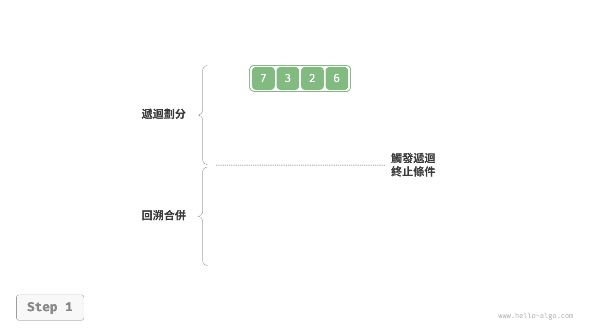
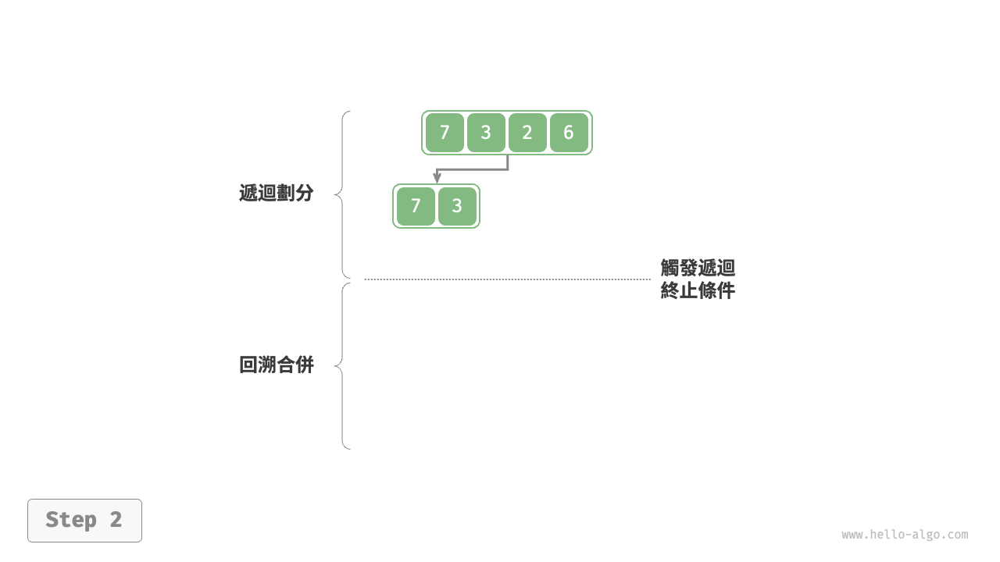
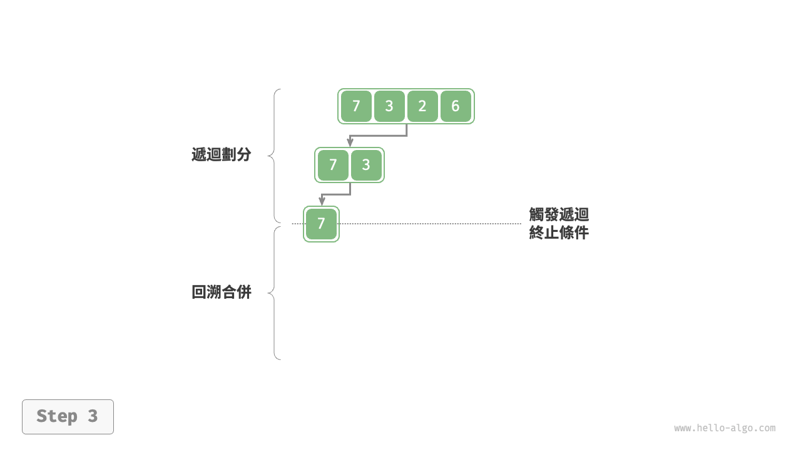
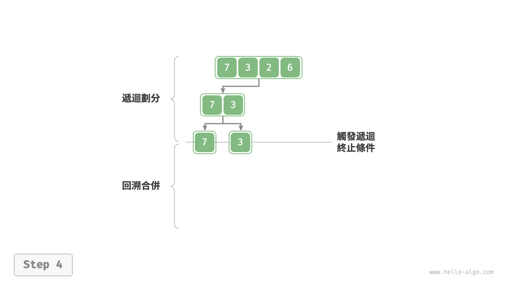
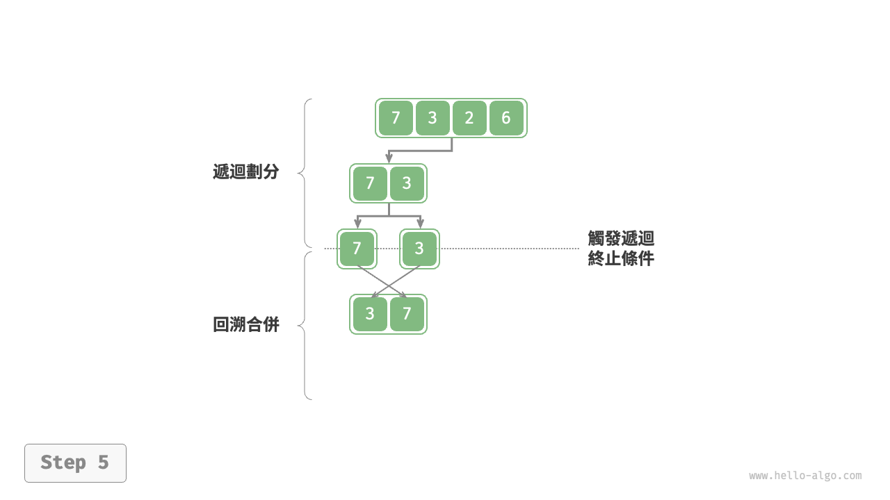
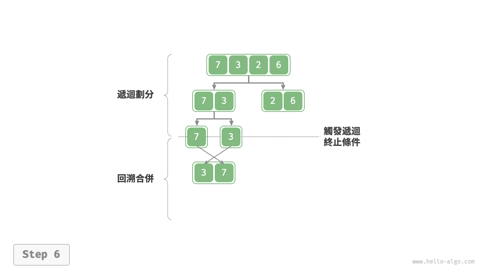
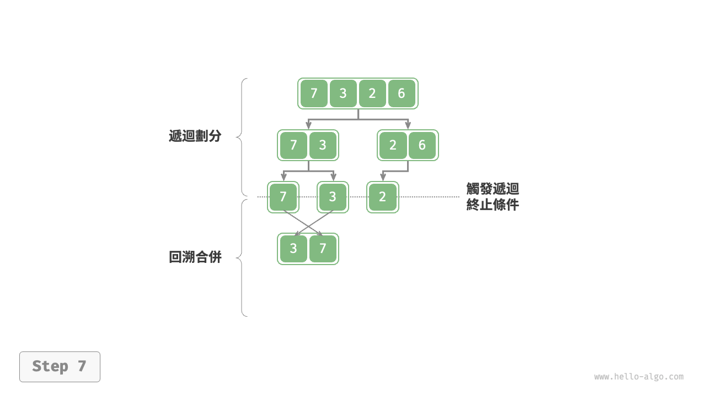
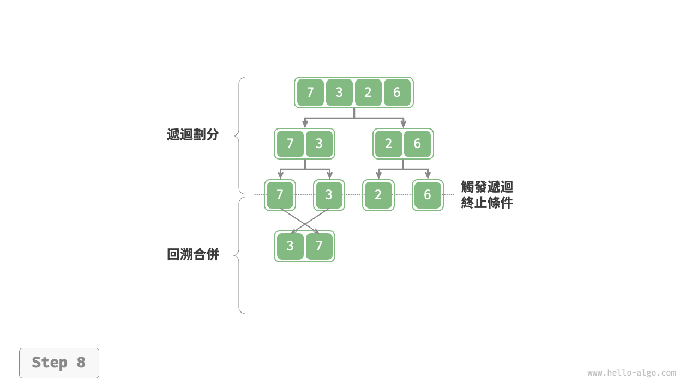
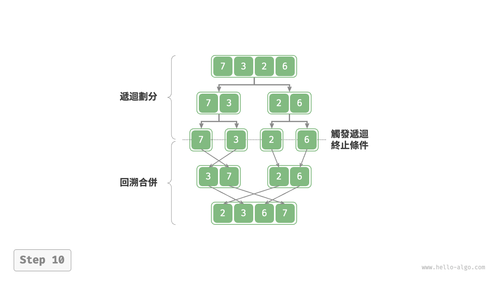

# 11.6 &nbsp; 合併排序

<u>合併排序（merge sort）</u>是一種基於分治策略的排序演算法，包含圖 11-10 所示的“劃分”和“合併”階段。

1. **劃分階段**：透過遞迴不斷地將陣列從中點處分開，將長陣列的排序問題轉換為短陣列的排序問題。
2. **合併階段**：當子陣列長度為 1 時終止劃分，開始合併，持續地將左右兩個較短的有序陣列合併為一個較長的有序陣列，直至結束。

{ class="animation-figure" }

<p align="center"> 圖 11-10 &nbsp; 合併排序的劃分與合併階段 </p>

## 11.6.1 &nbsp; 演算法流程

如圖 11-11 所示，“劃分階段”從頂至底遞迴地將陣列從中點切分為兩個子陣列。

1. 計算陣列中點 `mid` ，遞迴劃分左子陣列（區間 `[left, mid]` ）和右子陣列（區間 `[mid + 1, right]` ）。
2. 遞迴執行步驟 `1.` ，直至子陣列區間長度為 1 時終止。

“合併階段”從底至頂地將左子陣列和右子陣列合併為一個有序陣列。需要注意的是，從長度為 1 的子陣列開始合併，合併階段中的每個子陣列都是有序的。

=== "<1>"
    { class="animation-figure" }

=== "<2>"
    { class="animation-figure" }

=== "<3>"
    { class="animation-figure" }

=== "<4>"
    { class="animation-figure" }

=== "<5>"
    { class="animation-figure" }

=== "<6>"
    { class="animation-figure" }

=== "<7>"
    { class="animation-figure" }

=== "<8>"
    { class="animation-figure" }

=== "<9>"
    { class="animation-figure" }

=== "<10>"
    { class="animation-figure" }

<p align="center"> 圖 11-11 &nbsp; 合併排序步驟 </p>

觀察發現，合併排序與二元樹後序走訪的遞迴順序是一致的。

- **後序走訪**：先遞迴左子樹，再遞迴右子樹，最後處理根節點。
- **合併排序**：先遞迴左子陣列，再遞迴右子陣列，最後處理合併。

合併排序的實現如以下程式碼所示。請注意，`nums` 的待合併區間為 `[left, right]` ，而 `tmp` 的對應區間為 `[0, right - left]` 。

=== "Python"

    ```python title="merge_sort.py"
    def merge(nums: list[int], left: int, mid: int, right: int):
        """合併左子陣列和右子陣列"""
        # 左子陣列區間為 [left, mid], 右子陣列區間為 [mid+1, right]
        # 建立一個臨時陣列 tmp ，用於存放合併後的結果
        tmp = [0] * (right - left + 1)
        # 初始化左子陣列和右子陣列的起始索引
        i, j, k = left, mid + 1, 0
        # 當左右子陣列都還有元素時，進行比較並將較小的元素複製到臨時陣列中
        while i <= mid and j <= right:
            if nums[i] <= nums[j]:
                tmp[k] = nums[i]
                i += 1
            else:
                tmp[k] = nums[j]
                j += 1
            k += 1
        # 將左子陣列和右子陣列的剩餘元素複製到臨時陣列中
        while i <= mid:
            tmp[k] = nums[i]
            i += 1
            k += 1
        while j <= right:
            tmp[k] = nums[j]
            j += 1
            k += 1
        # 將臨時陣列 tmp 中的元素複製回原陣列 nums 的對應區間
        for k in range(0, len(tmp)):
            nums[left + k] = tmp[k]

    def merge_sort(nums: list[int], left: int, right: int):
        """合併排序"""
        # 終止條件
        if left >= right:
            return  # 當子陣列長度為 1 時終止遞迴
        # 劃分階段
        mid = (left + right) // 2  # 計算中點
        merge_sort(nums, left, mid)  # 遞迴左子陣列
        merge_sort(nums, mid + 1, right)  # 遞迴右子陣列
        # 合併階段
        merge(nums, left, mid, right)
    ```

=== "C++"

    ```cpp title="merge_sort.cpp"
    /* 合併左子陣列和右子陣列 */
    void merge(vector<int> &nums, int left, int mid, int right) {
        // 左子陣列區間為 [left, mid], 右子陣列區間為 [mid+1, right]
        // 建立一個臨時陣列 tmp ，用於存放合併後的結果
        vector<int> tmp(right - left + 1);
        // 初始化左子陣列和右子陣列的起始索引
        int i = left, j = mid + 1, k = 0;
        // 當左右子陣列都還有元素時，進行比較並將較小的元素複製到臨時陣列中
        while (i <= mid && j <= right) {
            if (nums[i] <= nums[j])
                tmp[k++] = nums[i++];
            else
                tmp[k++] = nums[j++];
        }
        // 將左子陣列和右子陣列的剩餘元素複製到臨時陣列中
        while (i <= mid) {
            tmp[k++] = nums[i++];
        }
        while (j <= right) {
            tmp[k++] = nums[j++];
        }
        // 將臨時陣列 tmp 中的元素複製回原陣列 nums 的對應區間
        for (k = 0; k < tmp.size(); k++) {
            nums[left + k] = tmp[k];
        }
    }

    /* 合併排序 */
    void mergeSort(vector<int> &nums, int left, int right) {
        // 終止條件
        if (left >= right)
            return; // 當子陣列長度為 1 時終止遞迴
        // 劃分階段
        int mid = (left + right) / 2;    // 計算中點
        mergeSort(nums, left, mid);      // 遞迴左子陣列
        mergeSort(nums, mid + 1, right); // 遞迴右子陣列
        // 合併階段
        merge(nums, left, mid, right);
    }
    ```

=== "Java"

    ```java title="merge_sort.java"
    /* 合併左子陣列和右子陣列 */
    void merge(int[] nums, int left, int mid, int right) {
        // 左子陣列區間為 [left, mid], 右子陣列區間為 [mid+1, right]
        // 建立一個臨時陣列 tmp ，用於存放合併後的結果
        int[] tmp = new int[right - left + 1];
        // 初始化左子陣列和右子陣列的起始索引
        int i = left, j = mid + 1, k = 0;
        // 當左右子陣列都還有元素時，進行比較並將較小的元素複製到臨時陣列中
        while (i <= mid && j <= right) {
            if (nums[i] <= nums[j])
                tmp[k++] = nums[i++];
            else
                tmp[k++] = nums[j++];
        }
        // 將左子陣列和右子陣列的剩餘元素複製到臨時陣列中
        while (i <= mid) {
            tmp[k++] = nums[i++];
        }
        while (j <= right) {
            tmp[k++] = nums[j++];
        }
        // 將臨時陣列 tmp 中的元素複製回原陣列 nums 的對應區間
        for (k = 0; k < tmp.length; k++) {
            nums[left + k] = tmp[k];
        }
    }

    /* 合併排序 */
    void mergeSort(int[] nums, int left, int right) {
        // 終止條件
        if (left >= right)
            return; // 當子陣列長度為 1 時終止遞迴
        // 劃分階段
        int mid = (left + right) / 2; // 計算中點
        mergeSort(nums, left, mid); // 遞迴左子陣列
        mergeSort(nums, mid + 1, right); // 遞迴右子陣列
        // 合併階段
        merge(nums, left, mid, right);
    }
    ```

=== "C#"

    ```csharp title="merge_sort.cs"
    /* 合併左子陣列和右子陣列 */
    void Merge(int[] nums, int left, int mid, int right) {
        // 左子陣列區間為 [left, mid], 右子陣列區間為 [mid+1, right]
        // 建立一個臨時陣列 tmp ，用於存放合併後的結果
        int[] tmp = new int[right - left + 1];
        // 初始化左子陣列和右子陣列的起始索引
        int i = left, j = mid + 1, k = 0;
        // 當左右子陣列都還有元素時，進行比較並將較小的元素複製到臨時陣列中
        while (i <= mid && j <= right) {
            if (nums[i] <= nums[j])
                tmp[k++] = nums[i++];
            else
                tmp[k++] = nums[j++];
        }
        // 將左子陣列和右子陣列的剩餘元素複製到臨時陣列中
        while (i <= mid) {
            tmp[k++] = nums[i++];
        }
        while (j <= right) {
            tmp[k++] = nums[j++];
        }
        // 將臨時陣列 tmp 中的元素複製回原陣列 nums 的對應區間
        for (k = 0; k < tmp.Length; ++k) {
            nums[left + k] = tmp[k];
        }
    }

    /* 合併排序 */
    void MergeSort(int[] nums, int left, int right) {
        // 終止條件
        if (left >= right) return;       // 當子陣列長度為 1 時終止遞迴
        // 劃分階段
        int mid = (left + right) / 2;    // 計算中點
        MergeSort(nums, left, mid);      // 遞迴左子陣列
        MergeSort(nums, mid + 1, right); // 遞迴右子陣列
        // 合併階段
        Merge(nums, left, mid, right);
    }
    ```

=== "Go"

    ```go title="merge_sort.go"
    /* 合併左子陣列和右子陣列 */
    func merge(nums []int, left, mid, right int) {
        // 左子陣列區間為 [left, mid], 右子陣列區間為 [mid+1, right]
        // 建立一個臨時陣列 tmp ，用於存放合併後的結果
        tmp := make([]int, right-left+1)
        // 初始化左子陣列和右子陣列的起始索引
        i, j, k := left, mid+1, 0
        // 當左右子陣列都還有元素時，進行比較並將較小的元素複製到臨時陣列中
        for i <= mid && j <= right {
            if nums[i] <= nums[j] {
                tmp[k] = nums[i]
                i++
            } else {
                tmp[k] = nums[j]
                j++
            }
            k++
        }
        // 將左子陣列和右子陣列的剩餘元素複製到臨時陣列中
        for i <= mid {
            tmp[k] = nums[i]
            i++
            k++
        }
        for j <= right {
            tmp[k] = nums[j]
            j++
            k++
        }
        // 將臨時陣列 tmp 中的元素複製回原陣列 nums 的對應區間
        for k := 0; k < len(tmp); k++ {
            nums[left+k] = tmp[k]
        }
    }

    /* 合併排序 */
    func mergeSort(nums []int, left, right int) {
        // 終止條件
        if left >= right {
            return
        }
        // 劃分階段
        mid := (left + right) / 2
        mergeSort(nums, left, mid)
        mergeSort(nums, mid+1, right)
        // 合併階段
        merge(nums, left, mid, right)
    }
    ```

=== "Swift"

    ```swift title="merge_sort.swift"
    /* 合併左子陣列和右子陣列 */
    func merge(nums: inout [Int], left: Int, mid: Int, right: Int) {
        // 左子陣列區間為 [left, mid], 右子陣列區間為 [mid+1, right]
        // 建立一個臨時陣列 tmp ，用於存放合併後的結果
        var tmp = Array(repeating: 0, count: right - left + 1)
        // 初始化左子陣列和右子陣列的起始索引
        var i = left, j = mid + 1, k = 0
        // 當左右子陣列都還有元素時，進行比較並將較小的元素複製到臨時陣列中
        while i <= mid, j <= right {
            if nums[i] <= nums[j] {
                tmp[k] = nums[i]
                i += 1
            } else {
                tmp[k] = nums[j]
                j += 1
            }
            k += 1
        }
        // 將左子陣列和右子陣列的剩餘元素複製到臨時陣列中
        while i <= mid {
            tmp[k] = nums[i]
            i += 1
            k += 1
        }
        while j <= right {
            tmp[k] = nums[j]
            j += 1
            k += 1
        }
        // 將臨時陣列 tmp 中的元素複製回原陣列 nums 的對應區間
        for k in tmp.indices {
            nums[left + k] = tmp[k]
        }
    }

    /* 合併排序 */
    func mergeSort(nums: inout [Int], left: Int, right: Int) {
        // 終止條件
        if left >= right { // 當子陣列長度為 1 時終止遞迴
            return
        }
        // 劃分階段
        let mid = (left + right) / 2 // 計算中點
        mergeSort(nums: &nums, left: left, right: mid) // 遞迴左子陣列
        mergeSort(nums: &nums, left: mid + 1, right: right) // 遞迴右子陣列
        // 合併階段
        merge(nums: &nums, left: left, mid: mid, right: right)
    }
    ```

=== "JS"

    ```javascript title="merge_sort.js"
    /* 合併左子陣列和右子陣列 */
    function merge(nums, left, mid, right) {
        // 左子陣列區間為 [left, mid], 右子陣列區間為 [mid+1, right]
        // 建立一個臨時陣列 tmp ，用於存放合併後的結果
        const tmp = new Array(right - left + 1);
        // 初始化左子陣列和右子陣列的起始索引
        let i = left,
            j = mid + 1,
            k = 0;
        // 當左右子陣列都還有元素時，進行比較並將較小的元素複製到臨時陣列中
        while (i <= mid && j <= right) {
            if (nums[i] <= nums[j]) {
                tmp[k++] = nums[i++];
            } else {
                tmp[k++] = nums[j++];
            }
        }
        // 將左子陣列和右子陣列的剩餘元素複製到臨時陣列中
        while (i <= mid) {
            tmp[k++] = nums[i++];
        }
        while (j <= right) {
            tmp[k++] = nums[j++];
        }
        // 將臨時陣列 tmp 中的元素複製回原陣列 nums 的對應區間
        for (k = 0; k < tmp.length; k++) {
            nums[left + k] = tmp[k];
        }
    }

    /* 合併排序 */
    function mergeSort(nums, left, right) {
        // 終止條件
        if (left >= right) return; // 當子陣列長度為 1 時終止遞迴
        // 劃分階段
        let mid = Math.floor((left + right) / 2); // 計算中點
        mergeSort(nums, left, mid); // 遞迴左子陣列
        mergeSort(nums, mid + 1, right); // 遞迴右子陣列
        // 合併階段
        merge(nums, left, mid, right);
    }
    ```

=== "TS"

    ```typescript title="merge_sort.ts"
    /* 合併左子陣列和右子陣列 */
    function merge(nums: number[], left: number, mid: number, right: number): void {
        // 左子陣列區間為 [left, mid], 右子陣列區間為 [mid+1, right]
        // 建立一個臨時陣列 tmp ，用於存放合併後的結果
        const tmp = new Array(right - left + 1);
        // 初始化左子陣列和右子陣列的起始索引
        let i = left,
            j = mid + 1,
            k = 0;
        // 當左右子陣列都還有元素時，進行比較並將較小的元素複製到臨時陣列中
        while (i <= mid && j <= right) {
            if (nums[i] <= nums[j]) {
                tmp[k++] = nums[i++];
            } else {
                tmp[k++] = nums[j++];
            }
        }
        // 將左子陣列和右子陣列的剩餘元素複製到臨時陣列中
        while (i <= mid) {
            tmp[k++] = nums[i++];
        }
        while (j <= right) {
            tmp[k++] = nums[j++];
        }
        // 將臨時陣列 tmp 中的元素複製回原陣列 nums 的對應區間
        for (k = 0; k < tmp.length; k++) {
            nums[left + k] = tmp[k];
        }
    }

    /* 合併排序 */
    function mergeSort(nums: number[], left: number, right: number): void {
        // 終止條件
        if (left >= right) return; // 當子陣列長度為 1 時終止遞迴
        // 劃分階段
        let mid = Math.floor((left + right) / 2); // 計算中點
        mergeSort(nums, left, mid); // 遞迴左子陣列
        mergeSort(nums, mid + 1, right); // 遞迴右子陣列
        // 合併階段
        merge(nums, left, mid, right);
    }
    ```

=== "Dart"

    ```dart title="merge_sort.dart"
    /* 合併左子陣列和右子陣列 */
    void merge(List<int> nums, int left, int mid, int right) {
      // 左子陣列區間為 [left, mid], 右子陣列區間為 [mid+1, right]
      // 建立一個臨時陣列 tmp ，用於存放合併後的結果
      List<int> tmp = List.filled(right - left + 1, 0);
      // 初始化左子陣列和右子陣列的起始索引
      int i = left, j = mid + 1, k = 0;
      // 當左右子陣列都還有元素時，進行比較並將較小的元素複製到臨時陣列中
      while (i <= mid && j <= right) {
        if (nums[i] <= nums[j])
          tmp[k++] = nums[i++];
        else
          tmp[k++] = nums[j++];
      }
      // 將左子陣列和右子陣列的剩餘元素複製到臨時陣列中
      while (i <= mid) {
        tmp[k++] = nums[i++];
      }
      while (j <= right) {
        tmp[k++] = nums[j++];
      }
      // 將臨時陣列 tmp 中的元素複製回原陣列 nums 的對應區間
      for (k = 0; k < tmp.length; k++) {
        nums[left + k] = tmp[k];
      }
    }

    /* 合併排序 */
    void mergeSort(List<int> nums, int left, int right) {
      // 終止條件
      if (left >= right) return; // 當子陣列長度為 1 時終止遞迴
      // 劃分階段
      int mid = (left + right) ~/ 2; // 計算中點
      mergeSort(nums, left, mid); // 遞迴左子陣列
      mergeSort(nums, mid + 1, right); // 遞迴右子陣列
      // 合併階段
      merge(nums, left, mid, right);
    }
    ```

=== "Rust"

    ```rust title="merge_sort.rs"
    /* 合併左子陣列和右子陣列 */
    fn merge(nums: &mut [i32], left: usize, mid: usize, right: usize) {
        // 左子陣列區間為 [left, mid], 右子陣列區間為 [mid+1, right]
        // 建立一個臨時陣列 tmp ，用於存放合併後的結果
        let tmp_size = right - left + 1;
        let mut tmp = vec![0; tmp_size];
        // 初始化左子陣列和右子陣列的起始索引
        let (mut i, mut j, mut k) = (left, mid + 1, 0);
        // 當左右子陣列都還有元素時，進行比較並將較小的元素複製到臨時陣列中
        while i <= mid && j <= right {
            if nums[i] <= nums[j] {
                tmp[k] = nums[i];
                i += 1;
            } else {
                tmp[k] = nums[j];
                j += 1;
            }
            k += 1;
        }
        // 將左子陣列和右子陣列的剩餘元素複製到臨時陣列中
        while i <= mid {
            tmp[k] = nums[i];
            k += 1;
            i += 1;
        }
        while j <= right {
            tmp[k] = nums[j];
            k += 1;
            j += 1;
        }
        // 將臨時陣列 tmp 中的元素複製回原陣列 nums 的對應區間
        for k in 0..tmp_size {
            nums[left + k] = tmp[k];
        }
    }

    /* 合併排序 */
    fn merge_sort(nums: &mut [i32], left: usize, right: usize) {
        // 終止條件
        if left >= right {
            return; // 當子陣列長度為 1 時終止遞迴
        }

        // 劃分階段
        let mid = (left + right) / 2; // 計算中點
        merge_sort(nums, left, mid); // 遞迴左子陣列
        merge_sort(nums, mid + 1, right); // 遞迴右子陣列

        // 合併階段
        merge(nums, left, mid, right);
    }
    ```

=== "C"

    ```c title="merge_sort.c"
    /* 合併左子陣列和右子陣列 */
    void merge(int *nums, int left, int mid, int right) {
        // 左子陣列區間為 [left, mid], 右子陣列區間為 [mid+1, right]
        // 建立一個臨時陣列 tmp ，用於存放合併後的結果
        int tmpSize = right - left + 1;
        int *tmp = (int *)malloc(tmpSize * sizeof(int));
        // 初始化左子陣列和右子陣列的起始索引
        int i = left, j = mid + 1, k = 0;
        // 當左右子陣列都還有元素時，進行比較並將較小的元素複製到臨時陣列中
        while (i <= mid && j <= right) {
            if (nums[i] <= nums[j]) {
                tmp[k++] = nums[i++];
            } else {
                tmp[k++] = nums[j++];
            }
        }
        // 將左子陣列和右子陣列的剩餘元素複製到臨時陣列中
        while (i <= mid) {
            tmp[k++] = nums[i++];
        }
        while (j <= right) {
            tmp[k++] = nums[j++];
        }
        // 將臨時陣列 tmp 中的元素複製回原陣列 nums 的對應區間
        for (k = 0; k < tmpSize; ++k) {
            nums[left + k] = tmp[k];
        }
        // 釋放記憶體
        free(tmp);
    }

    /* 合併排序 */
    void mergeSort(int *nums, int left, int right) {
        // 終止條件
        if (left >= right)
            return; // 當子陣列長度為 1 時終止遞迴
        // 劃分階段
        int mid = (left + right) / 2;    // 計算中點
        mergeSort(nums, left, mid);      // 遞迴左子陣列
        mergeSort(nums, mid + 1, right); // 遞迴右子陣列
        // 合併階段
        merge(nums, left, mid, right);
    }
    ```

=== "Kotlin"

    ```kotlin title="merge_sort.kt"
    /* 合併左子陣列和右子陣列 */
    fun merge(nums: IntArray, left: Int, mid: Int, right: Int) {
        // 左子陣列區間為 [left, mid], 右子陣列區間為 [mid+1, right]
        // 建立一個臨時陣列 tmp ，用於存放合併後的結果
        val tmp = IntArray(right - left + 1)
        // 初始化左子陣列和右子陣列的起始索引
        var i = left
        var j = mid + 1
        var k = 0
        // 當左右子陣列都還有元素時，進行比較並將較小的元素複製到臨時陣列中
        while (i <= mid && j <= right) {
            if (nums[i] <= nums[j])
                tmp[k++] = nums[i++]
            else 
                tmp[k++] = nums[j++]
        }
        // 將左子陣列和右子陣列的剩餘元素複製到臨時陣列中
        while (i <= mid) {
            tmp[k++] = nums[i++]
        }
        while (j <= right) {
            tmp[k++] = nums[j++]
        }
        // 將臨時陣列 tmp 中的元素複製回原陣列 nums 的對應區間
        for (l in tmp.indices) {
            nums[left + l] = tmp[l]
        }
    }

    /* 合併排序 */
    fun mergeSort(nums: IntArray, left: Int, right: Int) {
        // 終止條件
        if (left >= right) return  // 當子陣列長度為 1 時終止遞迴
        // 劃分階段
        val mid = (left + right) / 2 // 計算中點
        mergeSort(nums, left, mid) // 遞迴左子陣列
        mergeSort(nums, mid + 1, right) // 遞迴右子陣列
        // 合併階段
        merge(nums, left, mid, right)
    }
    ```

=== "Ruby"

    ```ruby title="merge_sort.rb"
    [class]{}-[func]{merge}

    [class]{}-[func]{merge_sort}
    ```

=== "Zig"

    ```zig title="merge_sort.zig"
    // 合併左子陣列和右子陣列
    // 左子陣列區間 [left, mid]
    // 右子陣列區間 [mid + 1, right]
    fn merge(nums: []i32, left: usize, mid: usize, right: usize) !void {
        // 初始化輔助陣列
        var mem_arena = std.heap.ArenaAllocator.init(std.heap.page_allocator);
        defer mem_arena.deinit();
        const mem_allocator = mem_arena.allocator();
        var tmp = try mem_allocator.alloc(i32, right + 1 - left);
        std.mem.copy(i32, tmp, nums[left..right+1]);
        // 左子陣列的起始索引和結束索引  
        var leftStart = left - left;
        var leftEnd = mid - left;
        // 右子陣列的起始索引和結束索引       
        var rightStart = mid + 1 - left;
        var rightEnd = right - left;
        // i, j 分別指向左子陣列、右子陣列的首元素
        var i = leftStart;
        var j = rightStart;
        // 透過覆蓋原陣列 nums 來合併左子陣列和右子陣列
        var k = left;
        while (k <= right) : (k += 1) {
            // 若“左子陣列已全部合併完”，則選取右子陣列元素，並且 j++
            if (i > leftEnd) {
                nums[k] = tmp[j];
                j += 1;
            // 否則，若“右子陣列已全部合併完”或“左子陣列元素 <= 右子陣列元素”，則選取左子陣列元素，並且 i++
            } else if  (j > rightEnd or tmp[i] <= tmp[j]) {
                nums[k] = tmp[i];
                i += 1;
            // 否則，若“左右子陣列都未全部合併完”且“左子陣列元素 > 右子陣列元素”，則選取右子陣列元素，並且 j++
            } else {
                nums[k] = tmp[j];
                j += 1;
            }
        }
    }

    // 合併排序
    fn mergeSort(nums: []i32, left: usize, right: usize) !void {
        // 終止條件
        if (left >= right) return;              // 當子陣列長度為 1 時終止遞迴
        // 劃分階段
        var mid = (left + right) / 2;           // 計算中點
        try mergeSort(nums, left, mid);         // 遞迴左子陣列
        try mergeSort(nums, mid + 1, right);    // 遞迴右子陣列
        // 合併階段
        try merge(nums, left, mid, right);
    }
    ```

??? pythontutor "視覺化執行"

    <div style="height: 549px; width: 100%;"><iframe class="pythontutor-iframe" src="https://pythontutor.com/iframe-embed.html#code=def%20merge%28nums%3A%20list%5Bint%5D%2C%20left%3A%20int%2C%20mid%3A%20int%2C%20right%3A%20int%29%3A%0A%20%20%20%20%22%22%22%E5%90%88%E4%BD%B5%E5%B7%A6%E5%AD%90%E9%99%A3%E5%88%97%E5%92%8C%E5%8F%B3%E5%AD%90%E9%99%A3%E5%88%97%22%22%22%0A%20%20%20%20%23%20%E5%B7%A6%E5%AD%90%E9%99%A3%E5%88%97%E5%8D%80%E9%96%93%E7%82%BA%20%5Bleft%2C%20mid%5D%2C%20%E5%8F%B3%E5%AD%90%E9%99%A3%E5%88%97%E5%8D%80%E9%96%93%E7%82%BA%20%5Bmid%2B1%2C%20right%5D%0A%20%20%20%20%23%20%E5%BB%BA%E7%AB%8B%E4%B8%80%E5%80%8B%E8%87%A8%E6%99%82%E9%99%A3%E5%88%97%20tmp%20%EF%BC%8C%E7%94%A8%E6%96%BC%E5%AD%98%E6%94%BE%E5%90%88%E4%BD%B5%E5%BE%8C%E7%9A%84%E7%B5%90%E6%9E%9C%0A%20%20%20%20tmp%20%3D%20%5B0%5D%20%2A%20%28right%20-%20left%20%2B%201%29%0A%20%20%20%20%23%20%E5%88%9D%E5%A7%8B%E5%8C%96%E5%B7%A6%E5%AD%90%E9%99%A3%E5%88%97%E5%92%8C%E5%8F%B3%E5%AD%90%E9%99%A3%E5%88%97%E7%9A%84%E8%B5%B7%E5%A7%8B%E7%B4%A2%E5%BC%95%0A%20%20%20%20i%2C%20j%2C%20k%20%3D%20left%2C%20mid%20%2B%201%2C%200%0A%20%20%20%20%23%20%E7%95%B6%E5%B7%A6%E5%8F%B3%E5%AD%90%E9%99%A3%E5%88%97%E9%83%BD%E9%82%84%E6%9C%89%E5%85%83%E7%B4%A0%E6%99%82%EF%BC%8C%E9%80%B2%E8%A1%8C%E6%AF%94%E8%BC%83%E4%B8%A6%E5%B0%87%E8%BC%83%E5%B0%8F%E7%9A%84%E5%85%83%E7%B4%A0%E8%A4%87%E8%A3%BD%E5%88%B0%E8%87%A8%E6%99%82%E9%99%A3%E5%88%97%E4%B8%AD%0A%20%20%20%20while%20i%20%3C%3D%20mid%20and%20j%20%3C%3D%20right%3A%0A%20%20%20%20%20%20%20%20if%20nums%5Bi%5D%20%3C%3D%20nums%5Bj%5D%3A%0A%20%20%20%20%20%20%20%20%20%20%20%20tmp%5Bk%5D%20%3D%20nums%5Bi%5D%0A%20%20%20%20%20%20%20%20%20%20%20%20i%20%2B%3D%201%0A%20%20%20%20%20%20%20%20else%3A%0A%20%20%20%20%20%20%20%20%20%20%20%20tmp%5Bk%5D%20%3D%20nums%5Bj%5D%0A%20%20%20%20%20%20%20%20%20%20%20%20j%20%2B%3D%201%0A%20%20%20%20%20%20%20%20k%20%2B%3D%201%0A%20%20%20%20%23%20%E5%B0%87%E5%B7%A6%E5%AD%90%E9%99%A3%E5%88%97%E5%92%8C%E5%8F%B3%E5%AD%90%E9%99%A3%E5%88%97%E7%9A%84%E5%89%A9%E9%A4%98%E5%85%83%E7%B4%A0%E8%A4%87%E8%A3%BD%E5%88%B0%E8%87%A8%E6%99%82%E9%99%A3%E5%88%97%E4%B8%AD%0A%20%20%20%20while%20i%20%3C%3D%20mid%3A%0A%20%20%20%20%20%20%20%20tmp%5Bk%5D%20%3D%20nums%5Bi%5D%0A%20%20%20%20%20%20%20%20i%20%2B%3D%201%0A%20%20%20%20%20%20%20%20k%20%2B%3D%201%0A%20%20%20%20while%20j%20%3C%3D%20right%3A%0A%20%20%20%20%20%20%20%20tmp%5Bk%5D%20%3D%20nums%5Bj%5D%0A%20%20%20%20%20%20%20%20j%20%2B%3D%201%0A%20%20%20%20%20%20%20%20k%20%2B%3D%201%0A%20%20%20%20%23%20%E5%B0%87%E8%87%A8%E6%99%82%E9%99%A3%E5%88%97%20tmp%20%E4%B8%AD%E7%9A%84%E5%85%83%E7%B4%A0%E8%A4%87%E8%A3%BD%E5%9B%9E%E5%8E%9F%E9%99%A3%E5%88%97%20nums%20%E7%9A%84%E5%B0%8D%E6%87%89%E5%8D%80%E9%96%93%0A%20%20%20%20for%20k%20in%20range%280%2C%20len%28tmp%29%29%3A%0A%20%20%20%20%20%20%20%20nums%5Bleft%20%2B%20k%5D%20%3D%20tmp%5Bk%5D%0A%0A%0Adef%20merge_sort%28nums%3A%20list%5Bint%5D%2C%20left%3A%20int%2C%20right%3A%20int%29%3A%0A%20%20%20%20%22%22%22%E5%90%88%E4%BD%B5%E6%8E%92%E5%BA%8F%22%22%22%0A%20%20%20%20%23%20%E7%B5%82%E6%AD%A2%E6%A2%9D%E4%BB%B6%0A%20%20%20%20if%20left%20%3E%3D%20right%3A%0A%20%20%20%20%20%20%20%20return%20%20%23%20%E7%95%B6%E5%AD%90%E9%99%A3%E5%88%97%E9%95%B7%E5%BA%A6%E7%82%BA%201%20%E6%99%82%E7%B5%82%E6%AD%A2%E9%81%9E%E8%BF%B4%0A%20%20%20%20%23%20%E5%8A%83%E5%88%86%E9%9A%8E%E6%AE%B5%0A%20%20%20%20mid%20%3D%20%28left%20%2B%20right%29%20//%202%20%20%23%20%E8%A8%88%E7%AE%97%E4%B8%AD%E9%BB%9E%0A%20%20%20%20merge_sort%28nums%2C%20left%2C%20mid%29%20%20%23%20%E9%81%9E%E8%BF%B4%E5%B7%A6%E5%AD%90%E9%99%A3%E5%88%97%0A%20%20%20%20merge_sort%28nums%2C%20mid%20%2B%201%2C%20right%29%20%20%23%20%E9%81%9E%E8%BF%B4%E5%8F%B3%E5%AD%90%E9%99%A3%E5%88%97%0A%20%20%20%20%23%20%E5%90%88%E4%BD%B5%E9%9A%8E%E6%AE%B5%0A%20%20%20%20merge%28nums%2C%20left%2C%20mid%2C%20right%29%0A%0A%0A%22%22%22Driver%20Code%22%22%22%0Aif%20__name__%20%3D%3D%20%22__main__%22%3A%0A%20%20%20%20nums%20%3D%20%5B7%2C%203%2C%202%2C%206%2C%200%2C%201%2C%205%2C%204%5D%0A%20%20%20%20merge_sort%28nums%2C%200%2C%20len%28nums%29%20-%201%29%0A%20%20%20%20print%28%22%E5%90%88%E4%BD%B5%E6%8E%92%E5%BA%8F%E5%AE%8C%E6%88%90%E5%BE%8C%20nums%20%3D%22%2C%20nums%29&codeDivHeight=472&codeDivWidth=350&cumulative=false&curInstr=5&heapPrimitives=nevernest&origin=opt-frontend.js&py=311&rawInputLstJSON=%5B%5D&textReferences=false"> </iframe></div>
    <div style="margin-top: 5px;"><a href="https://pythontutor.com/iframe-embed.html#code=def%20merge%28nums%3A%20list%5Bint%5D%2C%20left%3A%20int%2C%20mid%3A%20int%2C%20right%3A%20int%29%3A%0A%20%20%20%20%22%22%22%E5%90%88%E4%BD%B5%E5%B7%A6%E5%AD%90%E9%99%A3%E5%88%97%E5%92%8C%E5%8F%B3%E5%AD%90%E9%99%A3%E5%88%97%22%22%22%0A%20%20%20%20%23%20%E5%B7%A6%E5%AD%90%E9%99%A3%E5%88%97%E5%8D%80%E9%96%93%E7%82%BA%20%5Bleft%2C%20mid%5D%2C%20%E5%8F%B3%E5%AD%90%E9%99%A3%E5%88%97%E5%8D%80%E9%96%93%E7%82%BA%20%5Bmid%2B1%2C%20right%5D%0A%20%20%20%20%23%20%E5%BB%BA%E7%AB%8B%E4%B8%80%E5%80%8B%E8%87%A8%E6%99%82%E9%99%A3%E5%88%97%20tmp%20%EF%BC%8C%E7%94%A8%E6%96%BC%E5%AD%98%E6%94%BE%E5%90%88%E4%BD%B5%E5%BE%8C%E7%9A%84%E7%B5%90%E6%9E%9C%0A%20%20%20%20tmp%20%3D%20%5B0%5D%20%2A%20%28right%20-%20left%20%2B%201%29%0A%20%20%20%20%23%20%E5%88%9D%E5%A7%8B%E5%8C%96%E5%B7%A6%E5%AD%90%E9%99%A3%E5%88%97%E5%92%8C%E5%8F%B3%E5%AD%90%E9%99%A3%E5%88%97%E7%9A%84%E8%B5%B7%E5%A7%8B%E7%B4%A2%E5%BC%95%0A%20%20%20%20i%2C%20j%2C%20k%20%3D%20left%2C%20mid%20%2B%201%2C%200%0A%20%20%20%20%23%20%E7%95%B6%E5%B7%A6%E5%8F%B3%E5%AD%90%E9%99%A3%E5%88%97%E9%83%BD%E9%82%84%E6%9C%89%E5%85%83%E7%B4%A0%E6%99%82%EF%BC%8C%E9%80%B2%E8%A1%8C%E6%AF%94%E8%BC%83%E4%B8%A6%E5%B0%87%E8%BC%83%E5%B0%8F%E7%9A%84%E5%85%83%E7%B4%A0%E8%A4%87%E8%A3%BD%E5%88%B0%E8%87%A8%E6%99%82%E9%99%A3%E5%88%97%E4%B8%AD%0A%20%20%20%20while%20i%20%3C%3D%20mid%20and%20j%20%3C%3D%20right%3A%0A%20%20%20%20%20%20%20%20if%20nums%5Bi%5D%20%3C%3D%20nums%5Bj%5D%3A%0A%20%20%20%20%20%20%20%20%20%20%20%20tmp%5Bk%5D%20%3D%20nums%5Bi%5D%0A%20%20%20%20%20%20%20%20%20%20%20%20i%20%2B%3D%201%0A%20%20%20%20%20%20%20%20else%3A%0A%20%20%20%20%20%20%20%20%20%20%20%20tmp%5Bk%5D%20%3D%20nums%5Bj%5D%0A%20%20%20%20%20%20%20%20%20%20%20%20j%20%2B%3D%201%0A%20%20%20%20%20%20%20%20k%20%2B%3D%201%0A%20%20%20%20%23%20%E5%B0%87%E5%B7%A6%E5%AD%90%E9%99%A3%E5%88%97%E5%92%8C%E5%8F%B3%E5%AD%90%E9%99%A3%E5%88%97%E7%9A%84%E5%89%A9%E9%A4%98%E5%85%83%E7%B4%A0%E8%A4%87%E8%A3%BD%E5%88%B0%E8%87%A8%E6%99%82%E9%99%A3%E5%88%97%E4%B8%AD%0A%20%20%20%20while%20i%20%3C%3D%20mid%3A%0A%20%20%20%20%20%20%20%20tmp%5Bk%5D%20%3D%20nums%5Bi%5D%0A%20%20%20%20%20%20%20%20i%20%2B%3D%201%0A%20%20%20%20%20%20%20%20k%20%2B%3D%201%0A%20%20%20%20while%20j%20%3C%3D%20right%3A%0A%20%20%20%20%20%20%20%20tmp%5Bk%5D%20%3D%20nums%5Bj%5D%0A%20%20%20%20%20%20%20%20j%20%2B%3D%201%0A%20%20%20%20%20%20%20%20k%20%2B%3D%201%0A%20%20%20%20%23%20%E5%B0%87%E8%87%A8%E6%99%82%E9%99%A3%E5%88%97%20tmp%20%E4%B8%AD%E7%9A%84%E5%85%83%E7%B4%A0%E8%A4%87%E8%A3%BD%E5%9B%9E%E5%8E%9F%E9%99%A3%E5%88%97%20nums%20%E7%9A%84%E5%B0%8D%E6%87%89%E5%8D%80%E9%96%93%0A%20%20%20%20for%20k%20in%20range%280%2C%20len%28tmp%29%29%3A%0A%20%20%20%20%20%20%20%20nums%5Bleft%20%2B%20k%5D%20%3D%20tmp%5Bk%5D%0A%0A%0Adef%20merge_sort%28nums%3A%20list%5Bint%5D%2C%20left%3A%20int%2C%20right%3A%20int%29%3A%0A%20%20%20%20%22%22%22%E5%90%88%E4%BD%B5%E6%8E%92%E5%BA%8F%22%22%22%0A%20%20%20%20%23%20%E7%B5%82%E6%AD%A2%E6%A2%9D%E4%BB%B6%0A%20%20%20%20if%20left%20%3E%3D%20right%3A%0A%20%20%20%20%20%20%20%20return%20%20%23%20%E7%95%B6%E5%AD%90%E9%99%A3%E5%88%97%E9%95%B7%E5%BA%A6%E7%82%BA%201%20%E6%99%82%E7%B5%82%E6%AD%A2%E9%81%9E%E8%BF%B4%0A%20%20%20%20%23%20%E5%8A%83%E5%88%86%E9%9A%8E%E6%AE%B5%0A%20%20%20%20mid%20%3D%20%28left%20%2B%20right%29%20//%202%20%20%23%20%E8%A8%88%E7%AE%97%E4%B8%AD%E9%BB%9E%0A%20%20%20%20merge_sort%28nums%2C%20left%2C%20mid%29%20%20%23%20%E9%81%9E%E8%BF%B4%E5%B7%A6%E5%AD%90%E9%99%A3%E5%88%97%0A%20%20%20%20merge_sort%28nums%2C%20mid%20%2B%201%2C%20right%29%20%20%23%20%E9%81%9E%E8%BF%B4%E5%8F%B3%E5%AD%90%E9%99%A3%E5%88%97%0A%20%20%20%20%23%20%E5%90%88%E4%BD%B5%E9%9A%8E%E6%AE%B5%0A%20%20%20%20merge%28nums%2C%20left%2C%20mid%2C%20right%29%0A%0A%0A%22%22%22Driver%20Code%22%22%22%0Aif%20__name__%20%3D%3D%20%22__main__%22%3A%0A%20%20%20%20nums%20%3D%20%5B7%2C%203%2C%202%2C%206%2C%200%2C%201%2C%205%2C%204%5D%0A%20%20%20%20merge_sort%28nums%2C%200%2C%20len%28nums%29%20-%201%29%0A%20%20%20%20print%28%22%E5%90%88%E4%BD%B5%E6%8E%92%E5%BA%8F%E5%AE%8C%E6%88%90%E5%BE%8C%20nums%20%3D%22%2C%20nums%29&codeDivHeight=800&codeDivWidth=600&cumulative=false&curInstr=5&heapPrimitives=nevernest&origin=opt-frontend.js&py=311&rawInputLstJSON=%5B%5D&textReferences=false" target="_blank" rel="noopener noreferrer">全螢幕觀看 ></a></div>

## 11.6.2 &nbsp; 演算法特性

- **時間複雜度為 $O(n \log n)$、非自適應排序**：劃分產生高度為 $\log n$ 的遞迴樹，每層合併的總操作數量為 $n$ ，因此總體時間複雜度為 $O(n \log n)$ 。
- **空間複雜度為 $O(n)$、非原地排序**：遞迴深度為 $\log n$ ，使用 $O(\log n)$ 大小的堆疊幀空間。合併操作需要藉助輔助陣列實現，使用 $O(n)$ 大小的額外空間。
- **穩定排序**：在合併過程中，相等元素的次序保持不變。

## 11.6.3 &nbsp; 鏈結串列排序

對於鏈結串列，合併排序相較於其他排序演算法具有顯著優勢，**可以將鏈結串列排序任務的空間複雜度最佳化至 $O(1)$** 。

- **劃分階段**：可以使用“迭代”替代“遞迴”來實現鏈結串列劃分工作，從而省去遞迴使用的堆疊幀空間。
- **合併階段**：在鏈結串列中，節點增刪操作僅需改變引用（指標）即可實現，因此合併階段（將兩個短有序鏈結串列合併為一個長有序鏈結串列）無須建立額外鏈結串列。

具體實現細節比較複雜，有興趣的讀者可以查閱相關資料進行學習。
