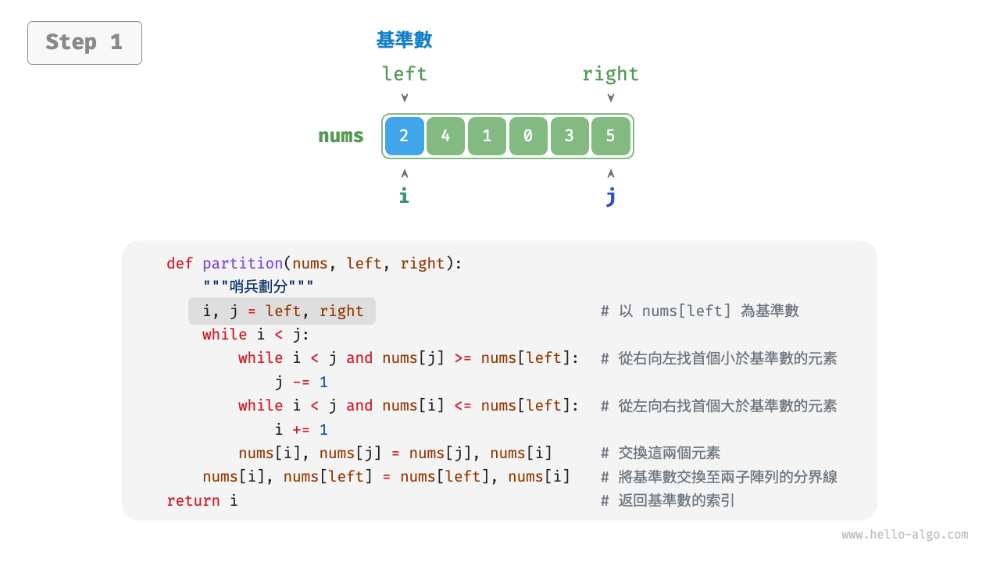
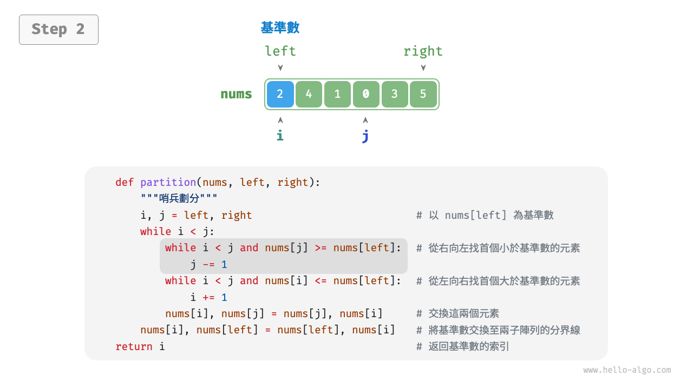
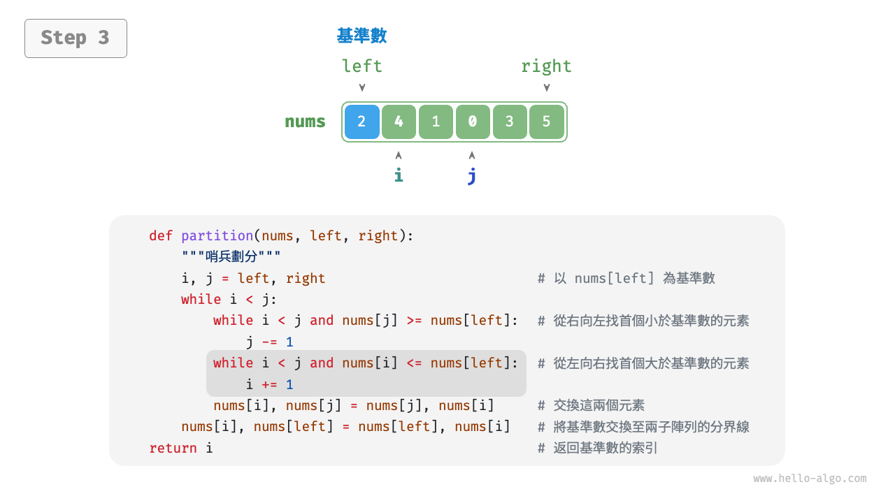
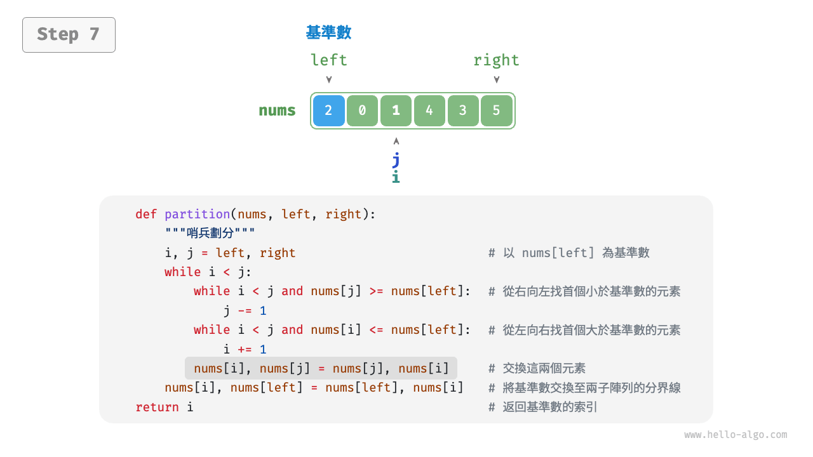
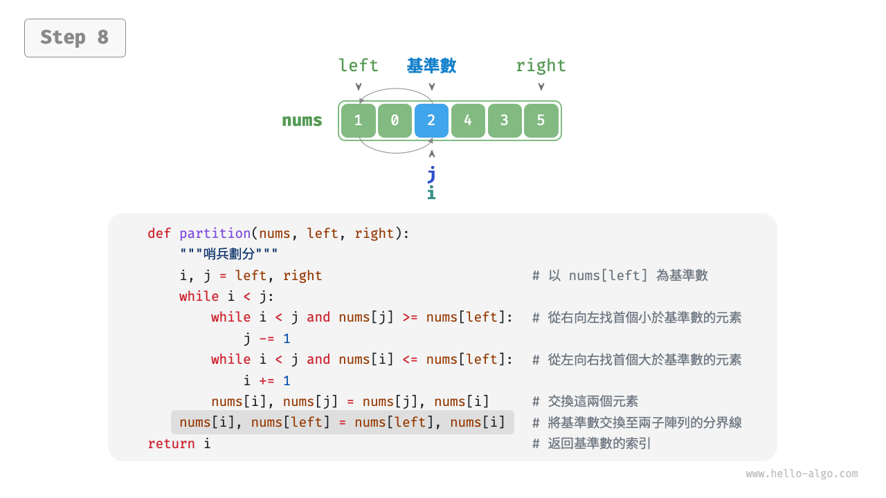
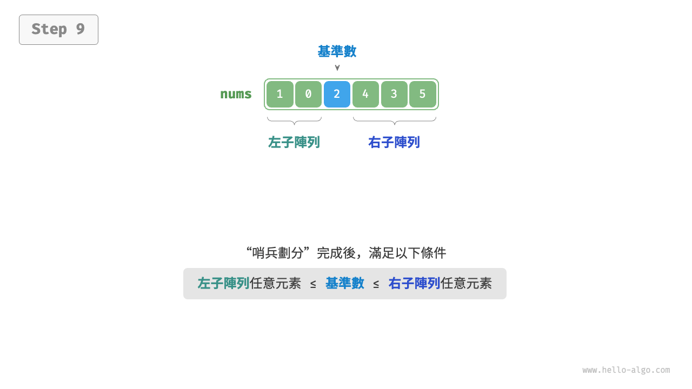
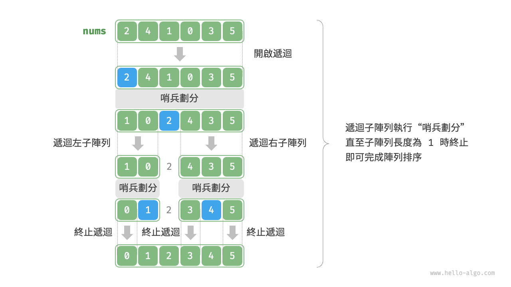

# 11.5 &nbsp; 快速排序

<u>快速排序（quick sort）</u>是一種基於分治策略的排序演算法，執行高效，應用廣泛。

快速排序的核心操作是“哨兵劃分”，其目標是：選擇陣列中的某個元素作為“基準數”，將所有小於基準數的元素移到其左側，而大於基準數的元素移到其右側。具體來說，哨兵劃分的流程如圖 11-8 所示。

1. 選取陣列最左端元素作為基準數，初始化兩個指標 `i` 和 `j` 分別指向陣列的兩端。
2. 設定一個迴圈，在每輪中使用 `i`（`j`）分別尋找第一個比基準數大（小）的元素，然後交換這兩個元素。
3. 迴圈執行步驟 `2.` ，直到 `i` 和 `j` 相遇時停止，最後將基準數交換至兩個子陣列的分界線。

=== "<1>"
    { class="animation-figure" }

=== "<2>"
    { class="animation-figure" }

=== "<3>"
    { class="animation-figure" }

=== "<4>"
    { class="animation-figure" }

=== "<5>"
    { class="animation-figure" }

=== "<6>"
    { class="animation-figure" }

=== "<7>"
    { class="animation-figure" }

=== "<8>"
    { class="animation-figure" }

=== "<9>"
    { class="animation-figure" }

<p align="center"> 圖 11-8 &nbsp; 哨兵劃分步驟 </p>

哨兵劃分完成後，原陣列被劃分成三部分：左子陣列、基準數、右子陣列，且滿足“左子陣列任意元素 $\leq$ 基準數 $\leq$ 右子陣列任意元素”。因此，我們接下來只需對這兩個子陣列進行排序。

!!! note "快速排序的分治策略"

    哨兵劃分的實質是將一個較長陣列的排序問題簡化為兩個較短陣列的排序問題。

=== "Python"

    ```python title="quick_sort.py"
    def partition(self, nums: list[int], left: int, right: int) -> int:
        """哨兵劃分"""
        # 以 nums[left] 為基準數
        i, j = left, right
        while i < j:
            while i < j and nums[j] >= nums[left]:
                j -= 1  # 從右向左找首個小於基準數的元素
            while i < j and nums[i] <= nums[left]:
                i += 1  # 從左向右找首個大於基準數的元素
            # 元素交換
            nums[i], nums[j] = nums[j], nums[i]
        # 將基準數交換至兩子陣列的分界線
        nums[i], nums[left] = nums[left], nums[i]
        return i  # 返回基準數的索引
    ```

=== "C++"

    ```cpp title="quick_sort.cpp"
    /* 元素交換 */
    void swap(vector<int> &nums, int i, int j) {
        int tmp = nums[i];
        nums[i] = nums[j];
        nums[j] = tmp;
    }

    /* 哨兵劃分 */
    int partition(vector<int> &nums, int left, int right) {
        // 以 nums[left] 為基準數
        int i = left, j = right;
        while (i < j) {
            while (i < j && nums[j] >= nums[left])
                j--; // 從右向左找首個小於基準數的元素
            while (i < j && nums[i] <= nums[left])
                i++;          // 從左向右找首個大於基準數的元素
            swap(nums, i, j); // 交換這兩個元素
        }
        swap(nums, i, left); // 將基準數交換至兩子陣列的分界線
        return i;            // 返回基準數的索引
    }
    ```

=== "Java"

    ```java title="quick_sort.java"
    /* 元素交換 */
    void swap(int[] nums, int i, int j) {
        int tmp = nums[i];
        nums[i] = nums[j];
        nums[j] = tmp;
    }

    /* 哨兵劃分 */
    int partition(int[] nums, int left, int right) {
        // 以 nums[left] 為基準數
        int i = left, j = right;
        while (i < j) {
            while (i < j && nums[j] >= nums[left])
                j--;          // 從右向左找首個小於基準數的元素
            while (i < j && nums[i] <= nums[left])
                i++;          // 從左向右找首個大於基準數的元素
            swap(nums, i, j); // 交換這兩個元素
        }
        swap(nums, i, left);  // 將基準數交換至兩子陣列的分界線
        return i;             // 返回基準數的索引
    }
    ```

=== "C#"

    ```csharp title="quick_sort.cs"
    /* 元素交換 */
    void Swap(int[] nums, int i, int j) {
        (nums[j], nums[i]) = (nums[i], nums[j]);
    }

    /* 哨兵劃分 */
    int Partition(int[] nums, int left, int right) {
        // 以 nums[left] 為基準數
        int i = left, j = right;
        while (i < j) {
            while (i < j && nums[j] >= nums[left])
                j--;          // 從右向左找首個小於基準數的元素
            while (i < j && nums[i] <= nums[left])
                i++;          // 從左向右找首個大於基準數的元素
            Swap(nums, i, j); // 交換這兩個元素
        }
        Swap(nums, i, left);  // 將基準數交換至兩子陣列的分界線
        return i;             // 返回基準數的索引
    }
    ```

=== "Go"

    ```go title="quick_sort.go"
    /* 哨兵劃分 */
    func (q *quickSort) partition(nums []int, left, right int) int {
        // 以 nums[left] 為基準數
        i, j := left, right
        for i < j {
            for i < j && nums[j] >= nums[left] {
                j-- // 從右向左找首個小於基準數的元素
            }
            for i < j && nums[i] <= nums[left] {
                i++ // 從左向右找首個大於基準數的元素
            }
            // 元素交換
            nums[i], nums[j] = nums[j], nums[i]
        }
        // 將基準數交換至兩子陣列的分界線
        nums[i], nums[left] = nums[left], nums[i]
        return i // 返回基準數的索引
    }
    ```

=== "Swift"

    ```swift title="quick_sort.swift"
    /* 哨兵劃分 */
    func partition(nums: inout [Int], left: Int, right: Int) -> Int {
        // 以 nums[left] 為基準數
        var i = left
        var j = right
        while i < j {
            while i < j, nums[j] >= nums[left] {
                j -= 1 // 從右向左找首個小於基準數的元素
            }
            while i < j, nums[i] <= nums[left] {
                i += 1 // 從左向右找首個大於基準數的元素
            }
            nums.swapAt(i, j) // 交換這兩個元素
        }
        nums.swapAt(i, left) // 將基準數交換至兩子陣列的分界線
        return i // 返回基準數的索引
    }
    ```

=== "JS"

    ```javascript title="quick_sort.js"
    /* 元素交換 */
    swap(nums, i, j) {
        let tmp = nums[i];
        nums[i] = nums[j];
        nums[j] = tmp;
    }

    /* 哨兵劃分 */
    partition(nums, left, right) {
        // 以 nums[left] 為基準數
        let i = left,
            j = right;
        while (i < j) {
            while (i < j && nums[j] >= nums[left]) {
                j -= 1; // 從右向左找首個小於基準數的元素
            }
            while (i < j && nums[i] <= nums[left]) {
                i += 1; // 從左向右找首個大於基準數的元素
            }
            // 元素交換
            this.swap(nums, i, j); // 交換這兩個元素
        }
        this.swap(nums, i, left); // 將基準數交換至兩子陣列的分界線
        return i; // 返回基準數的索引
    }
    ```

=== "TS"

    ```typescript title="quick_sort.ts"
    /* 元素交換 */
    swap(nums: number[], i: number, j: number): void {
        let tmp = nums[i];
        nums[i] = nums[j];
        nums[j] = tmp;
    }

    /* 哨兵劃分 */
    partition(nums: number[], left: number, right: number): number {
        // 以 nums[left] 為基準數
        let i = left,
            j = right;
        while (i < j) {
            while (i < j && nums[j] >= nums[left]) {
                j -= 1; // 從右向左找首個小於基準數的元素
            }
            while (i < j && nums[i] <= nums[left]) {
                i += 1; // 從左向右找首個大於基準數的元素
            }
            // 元素交換
            this.swap(nums, i, j); // 交換這兩個元素
        }
        this.swap(nums, i, left); // 將基準數交換至兩子陣列的分界線
        return i; // 返回基準數的索引
    }
    ```

=== "Dart"

    ```dart title="quick_sort.dart"
    /* 元素交換 */
    void _swap(List<int> nums, int i, int j) {
      int tmp = nums[i];
      nums[i] = nums[j];
      nums[j] = tmp;
    }

    /* 哨兵劃分 */
    int _partition(List<int> nums, int left, int right) {
      // 以 nums[left] 為基準數
      int i = left, j = right;
      while (i < j) {
        while (i < j && nums[j] >= nums[left]) j--; // 從右向左找首個小於基準數的元素
        while (i < j && nums[i] <= nums[left]) i++; // 從左向右找首個大於基準數的元素
        _swap(nums, i, j); // 交換這兩個元素
      }
      _swap(nums, i, left); // 將基準數交換至兩子陣列的分界線
      return i; // 返回基準數的索引
    }
    ```

=== "Rust"

    ```rust title="quick_sort.rs"
    /* 哨兵劃分 */
    fn partition(nums: &mut [i32], left: usize, right: usize) -> usize {
        // 以 nums[left] 為基準數
        let (mut i, mut j) = (left, right);
        while i < j {
            while i < j && nums[j] >= nums[left] {
                j -= 1; // 從右向左找首個小於基準數的元素
            }
            while i < j && nums[i] <= nums[left] {
                i += 1; // 從左向右找首個大於基準數的元素
            }
            nums.swap(i, j); // 交換這兩個元素
        }
        nums.swap(i, left); // 將基準數交換至兩子陣列的分界線
        i // 返回基準數的索引
    }
    ```

=== "C"

    ```c title="quick_sort.c"
    /* 元素交換 */
    void swap(int nums[], int i, int j) {
        int tmp = nums[i];
        nums[i] = nums[j];
        nums[j] = tmp;
    }

    /* 哨兵劃分 */
    int partition(int nums[], int left, int right) {
        // 以 nums[left] 為基準數
        int i = left, j = right;
        while (i < j) {
            while (i < j && nums[j] >= nums[left]) {
                j--; // 從右向左找首個小於基準數的元素
            }
            while (i < j && nums[i] <= nums[left]) {
                i++; // 從左向右找首個大於基準數的元素
            }
            // 交換這兩個元素
            swap(nums, i, j);
        }
        // 將基準數交換至兩子陣列的分界線
        swap(nums, i, left);
        // 返回基準數的索引
        return i;
    }
    ```

=== "Kotlin"

    ```kotlin title="quick_sort.kt"
    /* 元素交換 */
    fun swap(nums: IntArray, i: Int, j: Int) {
        val temp = nums[i]
        nums[i] = nums[j]
        nums[j] = temp
    }

    /* 哨兵劃分 */
    fun partition(nums: IntArray, left: Int, right: Int): Int {
        // 以 nums[left] 為基準數
        var i = left
        var j = right
        while (i < j) {
            while (i < j && nums[j] >= nums[left])
                j--           // 從右向左找首個小於基準數的元素
            while (i < j && nums[i] <= nums[left])
                i++           // 從左向右找首個大於基準數的元素
            swap(nums, i, j)  // 交換這兩個元素
        }
        swap(nums, i, left)   // 將基準數交換至兩子陣列的分界線
        return i              // 返回基準數的索引
    }
    ```

=== "Ruby"

    ```ruby title="quick_sort.rb"
    ### 哨兵劃分 ###
    def partition(nums, left, right)
      # 以 nums[left] 為基準數
      i, j = left, right
      while i < j
        while i < j && nums[j] >= nums[left]
          j -= 1 # 從右向左找首個小於基準數的元素
        end
        while i < j && nums[i] <= nums[left]
          i += 1 # 從左向右找首個大於基準數的元素
        end
        # 元素交換
        nums[i], nums[j] = nums[j], nums[i]
      end
      # 將基準數交換至兩子陣列的分界線
      nums[i], nums[left] = nums[left], nums[i]
      i # 返回基準數的索引
    end
    ```

=== "Zig"

    ```zig title="quick_sort.zig"
    // 元素交換
    fn swap(nums: []i32, i: usize, j: usize) void {
        var tmp = nums[i];
        nums[i] = nums[j];
        nums[j] = tmp;
    }

    // 哨兵劃分
    fn partition(nums: []i32, left: usize, right: usize) usize {
        // 以 nums[left] 為基準數
        var i = left;
        var j = right;
        while (i < j) {
            while (i < j and nums[j] >= nums[left]) j -= 1; // 從右向左找首個小於基準數的元素
            while (i < j and nums[i] <= nums[left]) i += 1; // 從左向右找首個大於基準數的元素
            swap(nums, i, j);   // 交換這兩個元素
        }
        swap(nums, i, left);    // 將基準數交換至兩子陣列的分界線
        return i;               // 返回基準數的索引
    }
    ```

??? pythontutor "視覺化執行"

    <div style="height: 549px; width: 100%;"><iframe class="pythontutor-iframe" src="https://pythontutor.com/iframe-embed.html#code=def%20partition%28nums%3A%20list%5Bint%5D%2C%20left%3A%20int%2C%20right%3A%20int%29%20-%3E%20int%3A%0A%20%20%20%20%22%22%22%E5%93%A8%E5%85%B5%E5%8A%83%E5%88%86%22%22%22%0A%20%20%20%20%23%20%E4%BB%A5%20nums%5Bleft%5D%20%E7%82%BA%E5%9F%BA%E6%BA%96%E6%95%B8%0A%20%20%20%20i%2C%20j%20%3D%20left%2C%20right%0A%20%20%20%20while%20i%20%3C%20j%3A%0A%20%20%20%20%20%20%20%20while%20i%20%3C%20j%20and%20nums%5Bj%5D%20%3E%3D%20nums%5Bleft%5D%3A%0A%20%20%20%20%20%20%20%20%20%20%20%20j%20-%3D%201%20%20%23%20%E5%BE%9E%E5%8F%B3%E5%90%91%E5%B7%A6%E6%89%BE%E9%A6%96%E5%80%8B%E5%B0%8F%E6%96%BC%E5%9F%BA%E6%BA%96%E6%95%B8%E7%9A%84%E5%85%83%E7%B4%A0%0A%20%20%20%20%20%20%20%20while%20i%20%3C%20j%20and%20nums%5Bi%5D%20%3C%3D%20nums%5Bleft%5D%3A%0A%20%20%20%20%20%20%20%20%20%20%20%20i%20%2B%3D%201%20%20%23%20%E5%BE%9E%E5%B7%A6%E5%90%91%E5%8F%B3%E6%89%BE%E9%A6%96%E5%80%8B%E5%A4%A7%E6%96%BC%E5%9F%BA%E6%BA%96%E6%95%B8%E7%9A%84%E5%85%83%E7%B4%A0%0A%20%20%20%20%20%20%20%20%23%20%E5%85%83%E7%B4%A0%E4%BA%A4%E6%8F%9B%0A%20%20%20%20%20%20%20%20nums%5Bi%5D%2C%20nums%5Bj%5D%20%3D%20nums%5Bj%5D%2C%20nums%5Bi%5D%0A%20%20%20%20%23%20%E5%B0%87%E5%9F%BA%E6%BA%96%E6%95%B8%E4%BA%A4%E6%8F%9B%E8%87%B3%E5%85%A9%E5%AD%90%E9%99%A3%E5%88%97%E7%9A%84%E5%88%86%E7%95%8C%E7%B7%9A%0A%20%20%20%20nums%5Bi%5D%2C%20nums%5Bleft%5D%20%3D%20nums%5Bleft%5D%2C%20nums%5Bi%5D%0A%20%20%20%20return%20i%20%20%23%20%E8%BF%94%E5%9B%9E%E5%9F%BA%E6%BA%96%E6%95%B8%E7%9A%84%E7%B4%A2%E5%BC%95%0A%0A%0A%22%22%22Driver%20Code%22%22%22%0Aif%20__name__%20%3D%3D%20%22__main__%22%3A%0A%20%20%20%20nums%20%3D%20%5B2%2C%204%2C%201%2C%200%2C%203%2C%205%5D%0A%20%20%20%20partition%28nums%2C%200%2C%20len%28nums%29%20-%201%29%0A%20%20%20%20print%28%22%E5%93%A8%E5%85%B5%E5%8A%83%E5%88%86%E5%AE%8C%E6%88%90%E5%BE%8C%20nums%20%3D%22%2C%20nums%29&codeDivHeight=472&codeDivWidth=350&cumulative=false&curInstr=4&heapPrimitives=nevernest&origin=opt-frontend.js&py=311&rawInputLstJSON=%5B%5D&textReferences=false"> </iframe></div>
    <div style="margin-top: 5px;"><a href="https://pythontutor.com/iframe-embed.html#code=def%20partition%28nums%3A%20list%5Bint%5D%2C%20left%3A%20int%2C%20right%3A%20int%29%20-%3E%20int%3A%0A%20%20%20%20%22%22%22%E5%93%A8%E5%85%B5%E5%8A%83%E5%88%86%22%22%22%0A%20%20%20%20%23%20%E4%BB%A5%20nums%5Bleft%5D%20%E7%82%BA%E5%9F%BA%E6%BA%96%E6%95%B8%0A%20%20%20%20i%2C%20j%20%3D%20left%2C%20right%0A%20%20%20%20while%20i%20%3C%20j%3A%0A%20%20%20%20%20%20%20%20while%20i%20%3C%20j%20and%20nums%5Bj%5D%20%3E%3D%20nums%5Bleft%5D%3A%0A%20%20%20%20%20%20%20%20%20%20%20%20j%20-%3D%201%20%20%23%20%E5%BE%9E%E5%8F%B3%E5%90%91%E5%B7%A6%E6%89%BE%E9%A6%96%E5%80%8B%E5%B0%8F%E6%96%BC%E5%9F%BA%E6%BA%96%E6%95%B8%E7%9A%84%E5%85%83%E7%B4%A0%0A%20%20%20%20%20%20%20%20while%20i%20%3C%20j%20and%20nums%5Bi%5D%20%3C%3D%20nums%5Bleft%5D%3A%0A%20%20%20%20%20%20%20%20%20%20%20%20i%20%2B%3D%201%20%20%23%20%E5%BE%9E%E5%B7%A6%E5%90%91%E5%8F%B3%E6%89%BE%E9%A6%96%E5%80%8B%E5%A4%A7%E6%96%BC%E5%9F%BA%E6%BA%96%E6%95%B8%E7%9A%84%E5%85%83%E7%B4%A0%0A%20%20%20%20%20%20%20%20%23%20%E5%85%83%E7%B4%A0%E4%BA%A4%E6%8F%9B%0A%20%20%20%20%20%20%20%20nums%5Bi%5D%2C%20nums%5Bj%5D%20%3D%20nums%5Bj%5D%2C%20nums%5Bi%5D%0A%20%20%20%20%23%20%E5%B0%87%E5%9F%BA%E6%BA%96%E6%95%B8%E4%BA%A4%E6%8F%9B%E8%87%B3%E5%85%A9%E5%AD%90%E9%99%A3%E5%88%97%E7%9A%84%E5%88%86%E7%95%8C%E7%B7%9A%0A%20%20%20%20nums%5Bi%5D%2C%20nums%5Bleft%5D%20%3D%20nums%5Bleft%5D%2C%20nums%5Bi%5D%0A%20%20%20%20return%20i%20%20%23%20%E8%BF%94%E5%9B%9E%E5%9F%BA%E6%BA%96%E6%95%B8%E7%9A%84%E7%B4%A2%E5%BC%95%0A%0A%0A%22%22%22Driver%20Code%22%22%22%0Aif%20__name__%20%3D%3D%20%22__main__%22%3A%0A%20%20%20%20nums%20%3D%20%5B2%2C%204%2C%201%2C%200%2C%203%2C%205%5D%0A%20%20%20%20partition%28nums%2C%200%2C%20len%28nums%29%20-%201%29%0A%20%20%20%20print%28%22%E5%93%A8%E5%85%B5%E5%8A%83%E5%88%86%E5%AE%8C%E6%88%90%E5%BE%8C%20nums%20%3D%22%2C%20nums%29&codeDivHeight=800&codeDivWidth=600&cumulative=false&curInstr=4&heapPrimitives=nevernest&origin=opt-frontend.js&py=311&rawInputLstJSON=%5B%5D&textReferences=false" target="_blank" rel="noopener noreferrer">全螢幕觀看 ></a></div>

## 11.5.1 &nbsp; 演算法流程

快速排序的整體流程如圖 11-9 所示。

1. 首先，對原陣列執行一次“哨兵劃分”，得到未排序的左子陣列和右子陣列。
2. 然後，對左子陣列和右子陣列分別遞迴執行“哨兵劃分”。
3. 持續遞迴，直至子陣列長度為 1 時終止，從而完成整個陣列的排序。

{ class="animation-figure" }

<p align="center"> 圖 11-9 &nbsp; 快速排序流程 </p>

=== "Python"

    ```python title="quick_sort.py"
    def quick_sort(self, nums: list[int], left: int, right: int):
        """快速排序"""
        # 子陣列長度為 1 時終止遞迴
        if left >= right:
            return
        # 哨兵劃分
        pivot = self.partition(nums, left, right)
        # 遞迴左子陣列、右子陣列
        self.quick_sort(nums, left, pivot - 1)
        self.quick_sort(nums, pivot + 1, right)
    ```

=== "C++"

    ```cpp title="quick_sort.cpp"
    /* 快速排序 */
    void quickSort(vector<int> &nums, int left, int right) {
        // 子陣列長度為 1 時終止遞迴
        if (left >= right)
            return;
        // 哨兵劃分
        int pivot = partition(nums, left, right);
        // 遞迴左子陣列、右子陣列
        quickSort(nums, left, pivot - 1);
        quickSort(nums, pivot + 1, right);
    }
    ```

=== "Java"

    ```java title="quick_sort.java"
    /* 快速排序 */
    void quickSort(int[] nums, int left, int right) {
        // 子陣列長度為 1 時終止遞迴
        if (left >= right)
            return;
        // 哨兵劃分
        int pivot = partition(nums, left, right);
        // 遞迴左子陣列、右子陣列
        quickSort(nums, left, pivot - 1);
        quickSort(nums, pivot + 1, right);
    }
    ```

=== "C#"

    ```csharp title="quick_sort.cs"
    /* 快速排序 */
    void QuickSort(int[] nums, int left, int right) {
        // 子陣列長度為 1 時終止遞迴
        if (left >= right)
            return;
        // 哨兵劃分
        int pivot = Partition(nums, left, right);
        // 遞迴左子陣列、右子陣列
        QuickSort(nums, left, pivot - 1);
        QuickSort(nums, pivot + 1, right);
    }
    ```

=== "Go"

    ```go title="quick_sort.go"
    /* 快速排序 */
    func (q *quickSort) quickSort(nums []int, left, right int) {
        // 子陣列長度為 1 時終止遞迴
        if left >= right {
            return
        }
        // 哨兵劃分
        pivot := q.partition(nums, left, right)
        // 遞迴左子陣列、右子陣列
        q.quickSort(nums, left, pivot-1)
        q.quickSort(nums, pivot+1, right)
    }
    ```

=== "Swift"

    ```swift title="quick_sort.swift"
    /* 快速排序 */
    func quickSort(nums: inout [Int], left: Int, right: Int) {
        // 子陣列長度為 1 時終止遞迴
        if left >= right {
            return
        }
        // 哨兵劃分
        let pivot = partition(nums: &nums, left: left, right: right)
        // 遞迴左子陣列、右子陣列
        quickSort(nums: &nums, left: left, right: pivot - 1)
        quickSort(nums: &nums, left: pivot + 1, right: right)
    }
    ```

=== "JS"

    ```javascript title="quick_sort.js"
    /* 快速排序 */
    quickSort(nums, left, right) {
        // 子陣列長度為 1 時終止遞迴
        if (left >= right) return;
        // 哨兵劃分
        const pivot = this.partition(nums, left, right);
        // 遞迴左子陣列、右子陣列
        this.quickSort(nums, left, pivot - 1);
        this.quickSort(nums, pivot + 1, right);
    }
    ```

=== "TS"

    ```typescript title="quick_sort.ts"
    /* 快速排序 */
    quickSort(nums: number[], left: number, right: number): void {
        // 子陣列長度為 1 時終止遞迴
        if (left >= right) {
            return;
        }
        // 哨兵劃分
        const pivot = this.partition(nums, left, right);
        // 遞迴左子陣列、右子陣列
        this.quickSort(nums, left, pivot - 1);
        this.quickSort(nums, pivot + 1, right);
    }
    ```

=== "Dart"

    ```dart title="quick_sort.dart"
    /* 快速排序 */
    void quickSort(List<int> nums, int left, int right) {
      // 子陣列長度為 1 時終止遞迴
      if (left >= right) return;
      // 哨兵劃分
      int pivot = _partition(nums, left, right);
      // 遞迴左子陣列、右子陣列
      quickSort(nums, left, pivot - 1);
      quickSort(nums, pivot + 1, right);
    }
    ```

=== "Rust"

    ```rust title="quick_sort.rs"
    /* 快速排序 */
    pub fn quick_sort(left: i32, right: i32, nums: &mut [i32]) {
        // 子陣列長度為 1 時終止遞迴
        if left >= right {
            return;
        }
        // 哨兵劃分
        let pivot = Self::partition(nums, left as usize, right as usize) as i32;
        // 遞迴左子陣列、右子陣列
        Self::quick_sort(left, pivot - 1, nums);
        Self::quick_sort(pivot + 1, right, nums);
    }
    ```

=== "C"

    ```c title="quick_sort.c"
    /* 快速排序 */
    void quickSort(int nums[], int left, int right) {
        // 子陣列長度為 1 時終止遞迴
        if (left >= right) {
            return;
        }
        // 哨兵劃分
        int pivot = partition(nums, left, right);
        // 遞迴左子陣列、右子陣列
        quickSort(nums, left, pivot - 1);
        quickSort(nums, pivot + 1, right);
    }
    ```

=== "Kotlin"

    ```kotlin title="quick_sort.kt"
    /* 快速排序 */
    fun quickSort(nums: IntArray, left: Int, right: Int) {
        // 子陣列長度為 1 時終止遞迴
        if (left >= right) return
        // 哨兵劃分
        val pivot = partition(nums, left, right)
        // 遞迴左子陣列、右子陣列
        quickSort(nums, left, pivot - 1)
        quickSort(nums, pivot + 1, right)
    }
    ```

=== "Ruby"

    ```ruby title="quick_sort.rb"
    ### 快速排序類別 ###
    def quick_sort(nums, left, right)
      # 子陣列長度不為 1 時遞迴
      if left < right
        # 哨兵劃分
        pivot = partition(nums, left, right)
        # 遞迴左子陣列、右子陣列
        quick_sort(nums, left, pivot - 1)
        quick_sort(nums, pivot + 1, right)
      end
      nums
    end
    ```

=== "Zig"

    ```zig title="quick_sort.zig"
    // 快速排序
    fn quickSort(nums: []i32, left: usize, right: usize) void {
        // 子陣列長度為 1 時終止遞迴
        if (left >= right) return;
        // 哨兵劃分
        var pivot = partition(nums, left, right);
        // 遞迴左子陣列、右子陣列
        quickSort(nums, left, pivot - 1);
        quickSort(nums, pivot + 1, right);
    }
    ```

??? pythontutor "視覺化執行"

    <div style="height: 549px; width: 100%;"><iframe class="pythontutor-iframe" src="https://pythontutor.com/iframe-embed.html#code=def%20partition%28nums%3A%20list%5Bint%5D%2C%20left%3A%20int%2C%20right%3A%20int%29%20-%3E%20int%3A%0A%20%20%20%20%22%22%22%E5%93%A8%E5%85%B5%E5%8A%83%E5%88%86%22%22%22%0A%20%20%20%20%23%20%E4%BB%A5%20nums%5Bleft%5D%20%E7%82%BA%E5%9F%BA%E6%BA%96%E6%95%B8%0A%20%20%20%20i%2C%20j%20%3D%20left%2C%20right%0A%20%20%20%20while%20i%20%3C%20j%3A%0A%20%20%20%20%20%20%20%20while%20i%20%3C%20j%20and%20nums%5Bj%5D%20%3E%3D%20nums%5Bleft%5D%3A%0A%20%20%20%20%20%20%20%20%20%20%20%20j%20-%3D%201%20%20%23%20%E5%BE%9E%E5%8F%B3%E5%90%91%E5%B7%A6%E6%89%BE%E9%A6%96%E5%80%8B%E5%B0%8F%E6%96%BC%E5%9F%BA%E6%BA%96%E6%95%B8%E7%9A%84%E5%85%83%E7%B4%A0%0A%20%20%20%20%20%20%20%20while%20i%20%3C%20j%20and%20nums%5Bi%5D%20%3C%3D%20nums%5Bleft%5D%3A%0A%20%20%20%20%20%20%20%20%20%20%20%20i%20%2B%3D%201%20%20%23%20%E5%BE%9E%E5%B7%A6%E5%90%91%E5%8F%B3%E6%89%BE%E9%A6%96%E5%80%8B%E5%A4%A7%E6%96%BC%E5%9F%BA%E6%BA%96%E6%95%B8%E7%9A%84%E5%85%83%E7%B4%A0%0A%20%20%20%20%20%20%20%20%23%20%E5%85%83%E7%B4%A0%E4%BA%A4%E6%8F%9B%0A%20%20%20%20%20%20%20%20nums%5Bi%5D%2C%20nums%5Bj%5D%20%3D%20nums%5Bj%5D%2C%20nums%5Bi%5D%0A%20%20%20%20%23%20%E5%B0%87%E5%9F%BA%E6%BA%96%E6%95%B8%E4%BA%A4%E6%8F%9B%E8%87%B3%E5%85%A9%E5%AD%90%E9%99%A3%E5%88%97%E7%9A%84%E5%88%86%E7%95%8C%E7%B7%9A%0A%20%20%20%20nums%5Bi%5D%2C%20nums%5Bleft%5D%20%3D%20nums%5Bleft%5D%2C%20nums%5Bi%5D%0A%20%20%20%20return%20i%20%20%23%20%E8%BF%94%E5%9B%9E%E5%9F%BA%E6%BA%96%E6%95%B8%E7%9A%84%E7%B4%A2%E5%BC%95%0A%0Adef%20quick_sort%28nums%3A%20list%5Bint%5D%2C%20left%3A%20int%2C%20right%3A%20int%29%3A%0A%20%20%20%20%22%22%22%E5%BF%AB%E9%80%9F%E6%8E%92%E5%BA%8F%22%22%22%0A%20%20%20%20%23%20%E5%AD%90%E9%99%A3%E5%88%97%E9%95%B7%E5%BA%A6%E7%82%BA%201%20%E6%99%82%E7%B5%82%E6%AD%A2%E9%81%9E%E8%BF%B4%0A%20%20%20%20if%20left%20%3E%3D%20right%3A%0A%20%20%20%20%20%20%20%20return%0A%20%20%20%20%23%20%E5%93%A8%E5%85%B5%E5%8A%83%E5%88%86%0A%20%20%20%20pivot%20%3D%20partition%28nums%2C%20left%2C%20right%29%0A%20%20%20%20%23%20%E9%81%9E%E8%BF%B4%E5%B7%A6%E5%AD%90%E9%99%A3%E5%88%97%E3%80%81%E5%8F%B3%E5%AD%90%E9%99%A3%E5%88%97%0A%20%20%20%20quick_sort%28nums%2C%20left%2C%20pivot%20-%201%29%0A%20%20%20%20quick_sort%28nums%2C%20pivot%20%2B%201%2C%20right%29%0A%0A%0A%22%22%22Driver%20Code%22%22%22%0Aif%20__name__%20%3D%3D%20%22__main__%22%3A%0A%20%20%20%20%23%20%E5%BF%AB%E9%80%9F%E6%8E%92%E5%BA%8F%0A%20%20%20%20nums%20%3D%20%5B2%2C%204%2C%201%2C%200%2C%203%2C%205%5D%0A%20%20%20%20quick_sort%28nums%2C%200%2C%20len%28nums%29%20-%201%29%0A%20%20%20%20print%28%22%E5%BF%AB%E9%80%9F%E6%8E%92%E5%BA%8F%E5%AE%8C%E6%88%90%E5%BE%8C%20nums%20%3D%22%2C%20nums%29&codeDivHeight=472&codeDivWidth=350&cumulative=false&curInstr=5&heapPrimitives=nevernest&origin=opt-frontend.js&py=311&rawInputLstJSON=%5B%5D&textReferences=false"> </iframe></div>
    <div style="margin-top: 5px;"><a href="https://pythontutor.com/iframe-embed.html#code=def%20partition%28nums%3A%20list%5Bint%5D%2C%20left%3A%20int%2C%20right%3A%20int%29%20-%3E%20int%3A%0A%20%20%20%20%22%22%22%E5%93%A8%E5%85%B5%E5%8A%83%E5%88%86%22%22%22%0A%20%20%20%20%23%20%E4%BB%A5%20nums%5Bleft%5D%20%E7%82%BA%E5%9F%BA%E6%BA%96%E6%95%B8%0A%20%20%20%20i%2C%20j%20%3D%20left%2C%20right%0A%20%20%20%20while%20i%20%3C%20j%3A%0A%20%20%20%20%20%20%20%20while%20i%20%3C%20j%20and%20nums%5Bj%5D%20%3E%3D%20nums%5Bleft%5D%3A%0A%20%20%20%20%20%20%20%20%20%20%20%20j%20-%3D%201%20%20%23%20%E5%BE%9E%E5%8F%B3%E5%90%91%E5%B7%A6%E6%89%BE%E9%A6%96%E5%80%8B%E5%B0%8F%E6%96%BC%E5%9F%BA%E6%BA%96%E6%95%B8%E7%9A%84%E5%85%83%E7%B4%A0%0A%20%20%20%20%20%20%20%20while%20i%20%3C%20j%20and%20nums%5Bi%5D%20%3C%3D%20nums%5Bleft%5D%3A%0A%20%20%20%20%20%20%20%20%20%20%20%20i%20%2B%3D%201%20%20%23%20%E5%BE%9E%E5%B7%A6%E5%90%91%E5%8F%B3%E6%89%BE%E9%A6%96%E5%80%8B%E5%A4%A7%E6%96%BC%E5%9F%BA%E6%BA%96%E6%95%B8%E7%9A%84%E5%85%83%E7%B4%A0%0A%20%20%20%20%20%20%20%20%23%20%E5%85%83%E7%B4%A0%E4%BA%A4%E6%8F%9B%0A%20%20%20%20%20%20%20%20nums%5Bi%5D%2C%20nums%5Bj%5D%20%3D%20nums%5Bj%5D%2C%20nums%5Bi%5D%0A%20%20%20%20%23%20%E5%B0%87%E5%9F%BA%E6%BA%96%E6%95%B8%E4%BA%A4%E6%8F%9B%E8%87%B3%E5%85%A9%E5%AD%90%E9%99%A3%E5%88%97%E7%9A%84%E5%88%86%E7%95%8C%E7%B7%9A%0A%20%20%20%20nums%5Bi%5D%2C%20nums%5Bleft%5D%20%3D%20nums%5Bleft%5D%2C%20nums%5Bi%5D%0A%20%20%20%20return%20i%20%20%23%20%E8%BF%94%E5%9B%9E%E5%9F%BA%E6%BA%96%E6%95%B8%E7%9A%84%E7%B4%A2%E5%BC%95%0A%0Adef%20quick_sort%28nums%3A%20list%5Bint%5D%2C%20left%3A%20int%2C%20right%3A%20int%29%3A%0A%20%20%20%20%22%22%22%E5%BF%AB%E9%80%9F%E6%8E%92%E5%BA%8F%22%22%22%0A%20%20%20%20%23%20%E5%AD%90%E9%99%A3%E5%88%97%E9%95%B7%E5%BA%A6%E7%82%BA%201%20%E6%99%82%E7%B5%82%E6%AD%A2%E9%81%9E%E8%BF%B4%0A%20%20%20%20if%20left%20%3E%3D%20right%3A%0A%20%20%20%20%20%20%20%20return%0A%20%20%20%20%23%20%E5%93%A8%E5%85%B5%E5%8A%83%E5%88%86%0A%20%20%20%20pivot%20%3D%20partition%28nums%2C%20left%2C%20right%29%0A%20%20%20%20%23%20%E9%81%9E%E8%BF%B4%E5%B7%A6%E5%AD%90%E9%99%A3%E5%88%97%E3%80%81%E5%8F%B3%E5%AD%90%E9%99%A3%E5%88%97%0A%20%20%20%20quick_sort%28nums%2C%20left%2C%20pivot%20-%201%29%0A%20%20%20%20quick_sort%28nums%2C%20pivot%20%2B%201%2C%20right%29%0A%0A%0A%22%22%22Driver%20Code%22%22%22%0Aif%20__name__%20%3D%3D%20%22__main__%22%3A%0A%20%20%20%20%23%20%E5%BF%AB%E9%80%9F%E6%8E%92%E5%BA%8F%0A%20%20%20%20nums%20%3D%20%5B2%2C%204%2C%201%2C%200%2C%203%2C%205%5D%0A%20%20%20%20quick_sort%28nums%2C%200%2C%20len%28nums%29%20-%201%29%0A%20%20%20%20print%28%22%E5%BF%AB%E9%80%9F%E6%8E%92%E5%BA%8F%E5%AE%8C%E6%88%90%E5%BE%8C%20nums%20%3D%22%2C%20nums%29&codeDivHeight=800&codeDivWidth=600&cumulative=false&curInstr=5&heapPrimitives=nevernest&origin=opt-frontend.js&py=311&rawInputLstJSON=%5B%5D&textReferences=false" target="_blank" rel="noopener noreferrer">全螢幕觀看 ></a></div>

## 11.5.2 &nbsp; 演算法特性

- **時間複雜度為 $O(n \log n)$、自適應排序**：在平均情況下，哨兵劃分的遞迴層數為 $\log n$ ，每層中的總迴圈數為 $n$ ，總體使用 $O(n \log n)$ 時間。在最差情況下，每輪哨兵劃分操作都將長度為 $n$ 的陣列劃分為長度為 $0$ 和 $n - 1$ 的兩個子陣列，此時遞迴層數達到 $n$ ，每層中的迴圈數為 $n$ ，總體使用 $O(n^2)$ 時間。
- **空間複雜度為 $O(n)$、原地排序**：在輸入陣列完全倒序的情況下，達到最差遞迴深度 $n$ ，使用 $O(n)$ 堆疊幀空間。排序操作是在原陣列上進行的，未藉助額外陣列。
- **非穩定排序**：在哨兵劃分的最後一步，基準數可能會被交換至相等元素的右側。

## 11.5.3 &nbsp; 快速排序為什麼快

從名稱上就能看出，快速排序在效率方面應該具有一定的優勢。儘管快速排序的平均時間複雜度與“合併排序”和“堆積排序”相同，但通常快速排序的效率更高，主要有以下原因。

- **出現最差情況的機率很低**：雖然快速排序的最差時間複雜度為 $O(n^2)$ ，沒有合併排序穩定，但在絕大多數情況下，快速排序能在 $O(n \log n)$ 的時間複雜度下執行。
- **快取使用效率高**：在執行哨兵劃分操作時，系統可將整個子陣列載入到快取，因此訪問元素的效率較高。而像“堆積排序”這類演算法需要跳躍式訪問元素，從而缺乏這一特性。
- **複雜度的常數係數小**：在上述三種演算法中，快速排序的比較、賦值、交換等操作的總數量最少。這與“插入排序”比“泡沫排序”更快的原因類似。

## 11.5.4 &nbsp; 基準數最佳化

**快速排序在某些輸入下的時間效率可能降低**。舉一個極端例子，假設輸入陣列是完全倒序的，由於我們選擇最左端元素作為基準數，那麼在哨兵劃分完成後，基準數被交換至陣列最右端，導致左子陣列長度為 $n - 1$、右子陣列長度為 $0$ 。如此遞迴下去，每輪哨兵劃分後都有一個子陣列的長度為 $0$ ，分治策略失效，快速排序退化為“泡沫排序”的近似形式。

為了儘量避免這種情況發生，**我們可以最佳化哨兵劃分中的基準數的選取策略**。例如，我們可以隨機選取一個元素作為基準數。然而，如果運氣不佳，每次都選到不理想的基準數，效率仍然不盡如人意。

需要注意的是，程式語言通常生成的是“偽隨機數”。如果我們針對偽隨機數序列構建一個特定的測試樣例，那麼快速排序的效率仍然可能劣化。

為了進一步改進，我們可以在陣列中選取三個候選元素（通常為陣列的首、尾、中點元素），**並將這三個候選元素的中位數作為基準數**。這樣一來，基準數“既不太小也不太大”的機率將大幅提升。當然，我們還可以選取更多候選元素，以進一步提高演算法的穩健性。採用這種方法後，時間複雜度劣化至 $O(n^2)$ 的機率大大降低。

示例程式碼如下：

=== "Python"

    ```python title="quick_sort.py"
    def median_three(self, nums: list[int], left: int, mid: int, right: int) -> int:
        """選取三個候選元素的中位數"""
        l, m, r = nums[left], nums[mid], nums[right]
        if (l <= m <= r) or (r <= m <= l):
            return mid  # m 在 l 和 r 之間
        if (m <= l <= r) or (r <= l <= m):
            return left  # l 在 m 和 r 之間
        return right

    def partition(self, nums: list[int], left: int, right: int) -> int:
        """哨兵劃分（三數取中值）"""
        # 以 nums[left] 為基準數
        med = self.median_three(nums, left, (left + right) // 2, right)
        # 將中位數交換至陣列最左端
        nums[left], nums[med] = nums[med], nums[left]
        # 以 nums[left] 為基準數
        i, j = left, right
        while i < j:
            while i < j and nums[j] >= nums[left]:
                j -= 1  # 從右向左找首個小於基準數的元素
            while i < j and nums[i] <= nums[left]:
                i += 1  # 從左向右找首個大於基準數的元素
            # 元素交換
            nums[i], nums[j] = nums[j], nums[i]
        # 將基準數交換至兩子陣列的分界線
        nums[i], nums[left] = nums[left], nums[i]
        return i  # 返回基準數的索引
    ```

=== "C++"

    ```cpp title="quick_sort.cpp"
    /* 選取三個候選元素的中位數 */
    int medianThree(vector<int> &nums, int left, int mid, int right) {
        int l = nums[left], m = nums[mid], r = nums[right];
        if ((l <= m && m <= r) || (r <= m && m <= l))
            return mid; // m 在 l 和 r 之間
        if ((m <= l && l <= r) || (r <= l && l <= m))
            return left; // l 在 m 和 r 之間
        return right;
    }

    /* 哨兵劃分（三數取中值） */
    int partition(vector<int> &nums, int left, int right) {
        // 選取三個候選元素的中位數
        int med = medianThree(nums, left, (left + right) / 2, right);
        // 將中位數交換至陣列最左端
        swap(nums, left, med);
        // 以 nums[left] 為基準數
        int i = left, j = right;
        while (i < j) {
            while (i < j && nums[j] >= nums[left])
                j--; // 從右向左找首個小於基準數的元素
            while (i < j && nums[i] <= nums[left])
                i++;          // 從左向右找首個大於基準數的元素
            swap(nums, i, j); // 交換這兩個元素
        }
        swap(nums, i, left); // 將基準數交換至兩子陣列的分界線
        return i;            // 返回基準數的索引
    }
    ```

=== "Java"

    ```java title="quick_sort.java"
    /* 選取三個候選元素的中位數 */
    int medianThree(int[] nums, int left, int mid, int right) {
        int l = nums[left], m = nums[mid], r = nums[right];
        if ((l <= m && m <= r) || (r <= m && m <= l))
            return mid; // m 在 l 和 r 之間
        if ((m <= l && l <= r) || (r <= l && l <= m))
            return left; // l 在 m 和 r 之間
        return right;
    }

    /* 哨兵劃分（三數取中值） */
    int partition(int[] nums, int left, int right) {
        // 選取三個候選元素的中位數
        int med = medianThree(nums, left, (left + right) / 2, right);
        // 將中位數交換至陣列最左端
        swap(nums, left, med);
        // 以 nums[left] 為基準數
        int i = left, j = right;
        while (i < j) {
            while (i < j && nums[j] >= nums[left])
                j--;          // 從右向左找首個小於基準數的元素
            while (i < j && nums[i] <= nums[left])
                i++;          // 從左向右找首個大於基準數的元素
            swap(nums, i, j); // 交換這兩個元素
        }
        swap(nums, i, left);  // 將基準數交換至兩子陣列的分界線
        return i;             // 返回基準數的索引
    }
    ```

=== "C#"

    ```csharp title="quick_sort.cs"
    /* 選取三個候選元素的中位數 */
    int MedianThree(int[] nums, int left, int mid, int right) {
        int l = nums[left], m = nums[mid], r = nums[right];
        if ((l <= m && m <= r) || (r <= m && m <= l))
            return mid; // m 在 l 和 r 之間
        if ((m <= l && l <= r) || (r <= l && l <= m))
            return left; // l 在 m 和 r 之間
        return right;
    }

    /* 哨兵劃分（三數取中值） */
    int Partition(int[] nums, int left, int right) {
        // 選取三個候選元素的中位數
        int med = MedianThree(nums, left, (left + right) / 2, right);
        // 將中位數交換至陣列最左端
        Swap(nums, left, med);
        // 以 nums[left] 為基準數
        int i = left, j = right;
        while (i < j) {
            while (i < j && nums[j] >= nums[left])
                j--;          // 從右向左找首個小於基準數的元素
            while (i < j && nums[i] <= nums[left])
                i++;          // 從左向右找首個大於基準數的元素
            Swap(nums, i, j); // 交換這兩個元素
        }
        Swap(nums, i, left);  // 將基準數交換至兩子陣列的分界線
        return i;             // 返回基準數的索引
    }
    ```

=== "Go"

    ```go title="quick_sort.go"
    /* 選取三個候選元素的中位數 */
    func (q *quickSortMedian) medianThree(nums []int, left, mid, right int) int {
        l, m, r := nums[left], nums[mid], nums[right]
        if (l <= m && m <= r) || (r <= m && m <= l) {
            return mid // m 在 l 和 r 之間
        }
        if (m <= l && l <= r) || (r <= l && l <= m) {
            return left // l 在 m 和 r 之間
        }
        return right
    }

    /* 哨兵劃分（三數取中值）*/
    func (q *quickSortMedian) partition(nums []int, left, right int) int {
        // 以 nums[left] 為基準數
        med := q.medianThree(nums, left, (left+right)/2, right)
        // 將中位數交換至陣列最左端
        nums[left], nums[med] = nums[med], nums[left]
        // 以 nums[left] 為基準數
        i, j := left, right
        for i < j {
            for i < j && nums[j] >= nums[left] {
                j-- //從右向左找首個小於基準數的元素
            }
            for i < j && nums[i] <= nums[left] {
                i++ //從左向右找首個大於基準數的元素
            }
            //元素交換
            nums[i], nums[j] = nums[j], nums[i]
        }
        //將基準數交換至兩子陣列的分界線
        nums[i], nums[left] = nums[left], nums[i]
        return i //返回基準數的索引
    }
    ```

=== "Swift"

    ```swift title="quick_sort.swift"
    /* 選取三個候選元素的中位數 */
    func medianThree(nums: [Int], left: Int, mid: Int, right: Int) -> Int {
        let l = nums[left]
        let m = nums[mid]
        let r = nums[right]
        if (l <= m && m <= r) || (r <= m && m <= l) {
            return mid // m 在 l 和 r 之間
        }
        if (m <= l && l <= r) || (r <= l && l <= m) {
            return left // l 在 m 和 r 之間
        }
        return right
    }

    /* 哨兵劃分（三數取中值） */
    func partitionMedian(nums: inout [Int], left: Int, right: Int) -> Int {
        // 選取三個候選元素的中位數
        let med = medianThree(nums: nums, left: left, mid: (left + right) / 2, right: right)
        // 將中位數交換至陣列最左端
        nums.swapAt(left, med)
        return partition(nums: &nums, left: left, right: right)
    }
    ```

=== "JS"

    ```javascript title="quick_sort.js"
    /* 選取三個候選元素的中位數 */
    medianThree(nums, left, mid, right) {
        let l = nums[left],
            m = nums[mid],
            r = nums[right];
        // m 在 l 和 r 之間
        if ((l <= m && m <= r) || (r <= m && m <= l)) return mid;
        // l 在 m 和 r 之間
        if ((m <= l && l <= r) || (r <= l && l <= m)) return left;
        return right;
    }

    /* 哨兵劃分（三數取中值） */
    partition(nums, left, right) {
        // 選取三個候選元素的中位數
        let med = this.medianThree(
            nums,
            left,
            Math.floor((left + right) / 2),
            right
        );
        // 將中位數交換至陣列最左端
        this.swap(nums, left, med);
        // 以 nums[left] 為基準數
        let i = left,
            j = right;
        while (i < j) {
            while (i < j && nums[j] >= nums[left]) j--; // 從右向左找首個小於基準數的元素
            while (i < j && nums[i] <= nums[left]) i++; // 從左向右找首個大於基準數的元素
            this.swap(nums, i, j); // 交換這兩個元素
        }
        this.swap(nums, i, left); // 將基準數交換至兩子陣列的分界線
        return i; // 返回基準數的索引
    }
    ```

=== "TS"

    ```typescript title="quick_sort.ts"
    /* 選取三個候選元素的中位數 */
    medianThree(
        nums: number[],
        left: number,
        mid: number,
        right: number
    ): number {
        let l = nums[left],
            m = nums[mid],
            r = nums[right];
        // m 在 l 和 r 之間
        if ((l <= m && m <= r) || (r <= m && m <= l)) return mid;
        // l 在 m 和 r 之間
        if ((m <= l && l <= r) || (r <= l && l <= m)) return left;
        return right;
    }

    /* 哨兵劃分（三數取中值） */
    partition(nums: number[], left: number, right: number): number {
        // 選取三個候選元素的中位數
        let med = this.medianThree(
            nums,
            left,
            Math.floor((left + right) / 2),
            right
        );
        // 將中位數交換至陣列最左端
        this.swap(nums, left, med);
        // 以 nums[left] 為基準數
        let i = left,
            j = right;
        while (i < j) {
            while (i < j && nums[j] >= nums[left]) {
                j--; // 從右向左找首個小於基準數的元素
            }
            while (i < j && nums[i] <= nums[left]) {
                i++; // 從左向右找首個大於基準數的元素
            }
            this.swap(nums, i, j); // 交換這兩個元素
        }
        this.swap(nums, i, left); // 將基準數交換至兩子陣列的分界線
        return i; // 返回基準數的索引
    }
    ```

=== "Dart"

    ```dart title="quick_sort.dart"
    /* 選取三個候選元素的中位數 */
    int _medianThree(List<int> nums, int left, int mid, int right) {
      int l = nums[left], m = nums[mid], r = nums[right];
      if ((l <= m && m <= r) || (r <= m && m <= l))
        return mid; // m 在 l 和 r 之間
      if ((m <= l && l <= r) || (r <= l && l <= m))
        return left; // l 在 m 和 r 之間
      return right;
    }

    /* 哨兵劃分（三數取中值） */
    int _partition(List<int> nums, int left, int right) {
      // 選取三個候選元素的中位數
      int med = _medianThree(nums, left, (left + right) ~/ 2, right);
      // 將中位數交換至陣列最左端
      _swap(nums, left, med);
      // 以 nums[left] 為基準數
      int i = left, j = right;
      while (i < j) {
        while (i < j && nums[j] >= nums[left]) j--; // 從右向左找首個小於基準數的元素
        while (i < j && nums[i] <= nums[left]) i++; // 從左向右找首個大於基準數的元素
        _swap(nums, i, j); // 交換這兩個元素
      }
      _swap(nums, i, left); // 將基準數交換至兩子陣列的分界線
      return i; // 返回基準數的索引
    }
    ```

=== "Rust"

    ```rust title="quick_sort.rs"
    /* 選取三個候選元素的中位數 */
    fn median_three(nums: &mut [i32], left: usize, mid: usize, right: usize) -> usize {
        let (l, m, r) = (nums[left], nums[mid], nums[right]);
        if (l <= m && m <= r) || (r <= m && m <= l) {
            return mid; // m 在 l 和 r 之間
        }
        if (m <= l && l <= r) || (r <= l && l <= m) {
            return left; // l 在 m 和 r 之間
        }
        right
    }

    /* 哨兵劃分（三數取中值） */
    fn partition(nums: &mut [i32], left: usize, right: usize) -> usize {
        // 選取三個候選元素的中位數
        let med = Self::median_three(nums, left, (left + right) / 2, right);
        // 將中位數交換至陣列最左端
        nums.swap(left, med);
        // 以 nums[left] 為基準數
        let (mut i, mut j) = (left, right);
        while i < j {
            while i < j && nums[j] >= nums[left] {
                j -= 1; // 從右向左找首個小於基準數的元素
            }
            while i < j && nums[i] <= nums[left] {
                i += 1; // 從左向右找首個大於基準數的元素
            }
            nums.swap(i, j); // 交換這兩個元素
        }
        nums.swap(i, left); // 將基準數交換至兩子陣列的分界線
        i // 返回基準數的索引
    }
    ```

=== "C"

    ```c title="quick_sort.c"
    /* 選取三個候選元素的中位數 */
    int medianThree(int nums[], int left, int mid, int right) {
        int l = nums[left], m = nums[mid], r = nums[right];
        if ((l <= m && m <= r) || (r <= m && m <= l))
            return mid; // m 在 l 和 r 之間
        if ((m <= l && l <= r) || (r <= l && l <= m))
            return left; // l 在 m 和 r 之間
        return right;
    }

    /* 哨兵劃分（三數取中值） */
    int partitionMedian(int nums[], int left, int right) {
        // 選取三個候選元素的中位數
        int med = medianThree(nums, left, (left + right) / 2, right);
        // 將中位數交換至陣列最左端
        swap(nums, left, med);
        // 以 nums[left] 為基準數
        int i = left, j = right;
        while (i < j) {
            while (i < j && nums[j] >= nums[left])
                j--; // 從右向左找首個小於基準數的元素
            while (i < j && nums[i] <= nums[left])
                i++;          // 從左向右找首個大於基準數的元素
            swap(nums, i, j); // 交換這兩個元素
        }
        swap(nums, i, left); // 將基準數交換至兩子陣列的分界線
        return i;            // 返回基準數的索引
    }
    ```

=== "Kotlin"

    ```kotlin title="quick_sort.kt"
    /* 選取三個候選元素的中位數 */
    fun medianThree(nums: IntArray, left: Int, mid: Int, right: Int): Int {
        val l = nums[left]
        val m = nums[mid]
        val r = nums[right]
        if ((m in l..r) || (m in r..l))
            return mid  // m 在 l 和 r 之間
        if ((l in m..r) || (l in r..m))
            return left // l 在 m 和 r 之間
        return right
    }

    /* 哨兵劃分（三數取中值） */
    fun partitionMedian(nums: IntArray, left: Int, right: Int): Int {
        // 選取三個候選元素的中位數
        val med = medianThree(nums, left, (left + right) / 2, right)
        // 將中位數交換至陣列最左端
        swap(nums, left, med)
        // 以 nums[left] 為基準數
        var i = left
        var j = right
        while (i < j) {
            while (i < j && nums[j] >= nums[left])
                j--                      // 從右向左找首個小於基準數的元素
            while (i < j && nums[i] <= nums[left])
                i++                      // 從左向右找首個大於基準數的元素
            swap(nums, i, j)             // 交換這兩個元素
        }
        swap(nums, i, left)              // 將基準數交換至兩子陣列的分界線
        return i                         // 返回基準數的索引
    }
    ```

=== "Ruby"

    ```ruby title="quick_sort.rb"
    ### 選取三個候選元素的中位數 ###
    def median_three(nums, left, mid, right)
      # 選取三個候選元素的中位數
      _l, _m, _r = nums[left], nums[mid], nums[right]
      # m 在 l 和 r 之間
      return mid if (_l <= _m && _m <= _r) || (_r <= _m && _m <= _l)
      # l 在 m 和 r 之間
      return left if (_m <= _l && _l <= _r) || (_r <= _l && _l <= _m)
      return right
    end

    ### 哨兵劃分（三數取中值）###
    def partition(nums, left, right)
      ### 以 nums[left] 為基準數
      med = median_three(nums, left, (left + right) / 2, right)
      # 將中位數交換至陣列最左斷
      nums[left], nums[med] = nums[med], nums[left]
      i, j = left, right
      while i < j
        while i < j && nums[j] >= nums[left]
          j -= 1 # 從右向左找首個小於基準數的元素
        end
        while i < j && nums[i] <= nums[left]
          i += 1 # 從左向右找首個大於基準數的元素
        end
        # 元素交換
        nums[i], nums[j] = nums[j], nums[i]
      end
      # 將基準數交換至兩子陣列的分界線
      nums[i], nums[left] = nums[left], nums[i]
      i # 返回基準數的索引
    end
    ```

=== "Zig"

    ```zig title="quick_sort.zig"
    // 選取三個候選元素的中位數
    fn medianThree(nums: []i32, left: usize, mid: usize, right: usize) usize {
        var l = nums[left];
        var m = nums[mid];
        var r = nums[right];
        if ((l <= m && m <= r) || (r <= m && m <= l))
            return mid; // m 在 l 和 r 之間
        if ((m <= l && l <= r) || (r <= l && l <= m))
            return left; // l 在 m 和 r 之間
        return right;
    }

    // 哨兵劃分（三數取中值）
    fn partition(nums: []i32, left: usize, right: usize) usize {
        // 選取三個候選元素的中位數
        var med = medianThree(nums, left, (left + right) / 2, right);
        // 將中位數交換至陣列最左端
        swap(nums, left, med);
        // 以 nums[left] 為基準數
        var i = left;
        var j = right;
        while (i < j) {
            while (i < j and nums[j] >= nums[left]) j -= 1; // 從右向左找首個小於基準數的元素
            while (i < j and nums[i] <= nums[left]) i += 1; // 從左向右找首個大於基準數的元素
            swap(nums, i, j);   // 交換這兩個元素
        }
        swap(nums, i, left);    // 將基準數交換至兩子陣列的分界線
        return i;               // 返回基準數的索引
    }
    ```

??? pythontutor "視覺化執行"

    <div style="height: 549px; width: 100%;"><iframe class="pythontutor-iframe" src="https://pythontutor.com/iframe-embed.html#code=def%20median_three%28nums%3A%20list%5Bint%5D%2C%20left%3A%20int%2C%20mid%3A%20int%2C%20right%3A%20int%29%20-%3E%20int%3A%0A%20%20%20%20%22%22%22%E9%81%B8%E5%8F%96%E4%B8%89%E5%80%8B%E5%80%99%E9%81%B8%E5%85%83%E7%B4%A0%E7%9A%84%E4%B8%AD%E4%BD%8D%E6%95%B8%22%22%22%0A%20%20%20%20l%2C%20m%2C%20r%20%3D%20nums%5Bleft%5D%2C%20nums%5Bmid%5D%2C%20nums%5Bright%5D%0A%20%20%20%20if%20%28l%20%3C%3D%20m%20%3C%3D%20r%29%20or%20%28r%20%3C%3D%20m%20%3C%3D%20l%29%3A%0A%20%20%20%20%20%20%20%20return%20mid%20%20%23%20m%20%E5%9C%A8%20l%20%E5%92%8C%20r%20%E4%B9%8B%E9%96%93%0A%20%20%20%20if%20%28m%20%3C%3D%20l%20%3C%3D%20r%29%20or%20%28r%20%3C%3D%20l%20%3C%3D%20m%29%3A%0A%20%20%20%20%20%20%20%20return%20left%20%20%23%20l%20%E5%9C%A8%20m%20%E5%92%8C%20r%20%E4%B9%8B%E9%96%93%0A%20%20%20%20return%20right%0A%0Adef%20partition%28nums%3A%20list%5Bint%5D%2C%20left%3A%20int%2C%20right%3A%20int%29%20-%3E%20int%3A%0A%20%20%20%20%22%22%22%E5%93%A8%E5%85%B5%E5%8A%83%E5%88%86%EF%BC%88%E4%B8%89%E6%95%B8%E5%8F%96%E4%B8%AD%E5%80%BC%EF%BC%89%22%22%22%0A%20%20%20%20%23%20%E4%BB%A5%20nums%5Bleft%5D%20%E7%82%BA%E5%9F%BA%E6%BA%96%E6%95%B8%0A%20%20%20%20med%20%3D%20median_three%28nums%2C%20left%2C%20%28left%20%2B%20right%29%20//%202%2C%20right%29%0A%20%20%20%20%23%20%E5%B0%87%E4%B8%AD%E4%BD%8D%E6%95%B8%E4%BA%A4%E6%8F%9B%E8%87%B3%E9%99%A3%E5%88%97%E6%9C%80%E5%B7%A6%E7%AB%AF%0A%20%20%20%20nums%5Bleft%5D%2C%20nums%5Bmed%5D%20%3D%20nums%5Bmed%5D%2C%20nums%5Bleft%5D%0A%20%20%20%20%23%20%E4%BB%A5%20nums%5Bleft%5D%20%E7%82%BA%E5%9F%BA%E6%BA%96%E6%95%B8%0A%20%20%20%20i%2C%20j%20%3D%20left%2C%20right%0A%20%20%20%20while%20i%20%3C%20j%3A%0A%20%20%20%20%20%20%20%20while%20i%20%3C%20j%20and%20nums%5Bj%5D%20%3E%3D%20nums%5Bleft%5D%3A%0A%20%20%20%20%20%20%20%20%20%20%20%20j%20-%3D%201%20%20%23%20%E5%BE%9E%E5%8F%B3%E5%90%91%E5%B7%A6%E6%89%BE%E9%A6%96%E5%80%8B%E5%B0%8F%E6%96%BC%E5%9F%BA%E6%BA%96%E6%95%B8%E7%9A%84%E5%85%83%E7%B4%A0%0A%20%20%20%20%20%20%20%20while%20i%20%3C%20j%20and%20nums%5Bi%5D%20%3C%3D%20nums%5Bleft%5D%3A%0A%20%20%20%20%20%20%20%20%20%20%20%20i%20%2B%3D%201%20%20%23%20%E5%BE%9E%E5%B7%A6%E5%90%91%E5%8F%B3%E6%89%BE%E9%A6%96%E5%80%8B%E5%A4%A7%E6%96%BC%E5%9F%BA%E6%BA%96%E6%95%B8%E7%9A%84%E5%85%83%E7%B4%A0%0A%20%20%20%20%20%20%20%20%23%20%E5%85%83%E7%B4%A0%E4%BA%A4%E6%8F%9B%0A%20%20%20%20%20%20%20%20nums%5Bi%5D%2C%20nums%5Bj%5D%20%3D%20nums%5Bj%5D%2C%20nums%5Bi%5D%0A%20%20%20%20%23%20%E5%B0%87%E5%9F%BA%E6%BA%96%E6%95%B8%E4%BA%A4%E6%8F%9B%E8%87%B3%E5%85%A9%E5%AD%90%E9%99%A3%E5%88%97%E7%9A%84%E5%88%86%E7%95%8C%E7%B7%9A%0A%20%20%20%20nums%5Bi%5D%2C%20nums%5Bleft%5D%20%3D%20nums%5Bleft%5D%2C%20nums%5Bi%5D%0A%20%20%20%20return%20i%20%20%23%20%E8%BF%94%E5%9B%9E%E5%9F%BA%E6%BA%96%E6%95%B8%E7%9A%84%E7%B4%A2%E5%BC%95%0A%0A%0A%22%22%22Driver%20Code%22%22%22%0Aif%20__name__%20%3D%3D%20%22__main__%22%3A%0A%20%20%20%20%23%20%E4%B8%AD%E4%BD%8D%E5%9F%BA%E6%BA%96%E6%95%B8%E6%9C%80%E4%BD%B3%E5%8C%96%0A%20%20%20%20nums%20%3D%20%5B2%2C%204%2C%201%2C%200%2C%203%2C%205%5D%0A%20%20%20%20partition%28nums%2C%200%2C%20len%28nums%29%20-%201%29%0A%20%20%20%20print%28%22%E5%93%A8%E5%85%B5%E5%8A%83%E5%88%86%EF%BC%88%E4%B8%AD%E4%BD%8D%E5%9F%BA%E6%BA%96%E6%95%B8%E6%9C%80%E4%BD%B3%E5%8C%96%EF%BC%89%E5%AE%8C%E6%88%90%E5%BE%8C%20nums%20%3D%22%2C%20nums%29&codeDivHeight=472&codeDivWidth=350&cumulative=false&curInstr=5&heapPrimitives=nevernest&origin=opt-frontend.js&py=311&rawInputLstJSON=%5B%5D&textReferences=false"> </iframe></div>
    <div style="margin-top: 5px;"><a href="https://pythontutor.com/iframe-embed.html#code=def%20median_three%28nums%3A%20list%5Bint%5D%2C%20left%3A%20int%2C%20mid%3A%20int%2C%20right%3A%20int%29%20-%3E%20int%3A%0A%20%20%20%20%22%22%22%E9%81%B8%E5%8F%96%E4%B8%89%E5%80%8B%E5%80%99%E9%81%B8%E5%85%83%E7%B4%A0%E7%9A%84%E4%B8%AD%E4%BD%8D%E6%95%B8%22%22%22%0A%20%20%20%20l%2C%20m%2C%20r%20%3D%20nums%5Bleft%5D%2C%20nums%5Bmid%5D%2C%20nums%5Bright%5D%0A%20%20%20%20if%20%28l%20%3C%3D%20m%20%3C%3D%20r%29%20or%20%28r%20%3C%3D%20m%20%3C%3D%20l%29%3A%0A%20%20%20%20%20%20%20%20return%20mid%20%20%23%20m%20%E5%9C%A8%20l%20%E5%92%8C%20r%20%E4%B9%8B%E9%96%93%0A%20%20%20%20if%20%28m%20%3C%3D%20l%20%3C%3D%20r%29%20or%20%28r%20%3C%3D%20l%20%3C%3D%20m%29%3A%0A%20%20%20%20%20%20%20%20return%20left%20%20%23%20l%20%E5%9C%A8%20m%20%E5%92%8C%20r%20%E4%B9%8B%E9%96%93%0A%20%20%20%20return%20right%0A%0Adef%20partition%28nums%3A%20list%5Bint%5D%2C%20left%3A%20int%2C%20right%3A%20int%29%20-%3E%20int%3A%0A%20%20%20%20%22%22%22%E5%93%A8%E5%85%B5%E5%8A%83%E5%88%86%EF%BC%88%E4%B8%89%E6%95%B8%E5%8F%96%E4%B8%AD%E5%80%BC%EF%BC%89%22%22%22%0A%20%20%20%20%23%20%E4%BB%A5%20nums%5Bleft%5D%20%E7%82%BA%E5%9F%BA%E6%BA%96%E6%95%B8%0A%20%20%20%20med%20%3D%20median_three%28nums%2C%20left%2C%20%28left%20%2B%20right%29%20//%202%2C%20right%29%0A%20%20%20%20%23%20%E5%B0%87%E4%B8%AD%E4%BD%8D%E6%95%B8%E4%BA%A4%E6%8F%9B%E8%87%B3%E9%99%A3%E5%88%97%E6%9C%80%E5%B7%A6%E7%AB%AF%0A%20%20%20%20nums%5Bleft%5D%2C%20nums%5Bmed%5D%20%3D%20nums%5Bmed%5D%2C%20nums%5Bleft%5D%0A%20%20%20%20%23%20%E4%BB%A5%20nums%5Bleft%5D%20%E7%82%BA%E5%9F%BA%E6%BA%96%E6%95%B8%0A%20%20%20%20i%2C%20j%20%3D%20left%2C%20right%0A%20%20%20%20while%20i%20%3C%20j%3A%0A%20%20%20%20%20%20%20%20while%20i%20%3C%20j%20and%20nums%5Bj%5D%20%3E%3D%20nums%5Bleft%5D%3A%0A%20%20%20%20%20%20%20%20%20%20%20%20j%20-%3D%201%20%20%23%20%E5%BE%9E%E5%8F%B3%E5%90%91%E5%B7%A6%E6%89%BE%E9%A6%96%E5%80%8B%E5%B0%8F%E6%96%BC%E5%9F%BA%E6%BA%96%E6%95%B8%E7%9A%84%E5%85%83%E7%B4%A0%0A%20%20%20%20%20%20%20%20while%20i%20%3C%20j%20and%20nums%5Bi%5D%20%3C%3D%20nums%5Bleft%5D%3A%0A%20%20%20%20%20%20%20%20%20%20%20%20i%20%2B%3D%201%20%20%23%20%E5%BE%9E%E5%B7%A6%E5%90%91%E5%8F%B3%E6%89%BE%E9%A6%96%E5%80%8B%E5%A4%A7%E6%96%BC%E5%9F%BA%E6%BA%96%E6%95%B8%E7%9A%84%E5%85%83%E7%B4%A0%0A%20%20%20%20%20%20%20%20%23%20%E5%85%83%E7%B4%A0%E4%BA%A4%E6%8F%9B%0A%20%20%20%20%20%20%20%20nums%5Bi%5D%2C%20nums%5Bj%5D%20%3D%20nums%5Bj%5D%2C%20nums%5Bi%5D%0A%20%20%20%20%23%20%E5%B0%87%E5%9F%BA%E6%BA%96%E6%95%B8%E4%BA%A4%E6%8F%9B%E8%87%B3%E5%85%A9%E5%AD%90%E9%99%A3%E5%88%97%E7%9A%84%E5%88%86%E7%95%8C%E7%B7%9A%0A%20%20%20%20nums%5Bi%5D%2C%20nums%5Bleft%5D%20%3D%20nums%5Bleft%5D%2C%20nums%5Bi%5D%0A%20%20%20%20return%20i%20%20%23%20%E8%BF%94%E5%9B%9E%E5%9F%BA%E6%BA%96%E6%95%B8%E7%9A%84%E7%B4%A2%E5%BC%95%0A%0A%0A%22%22%22Driver%20Code%22%22%22%0Aif%20__name__%20%3D%3D%20%22__main__%22%3A%0A%20%20%20%20%23%20%E4%B8%AD%E4%BD%8D%E5%9F%BA%E6%BA%96%E6%95%B8%E6%9C%80%E4%BD%B3%E5%8C%96%0A%20%20%20%20nums%20%3D%20%5B2%2C%204%2C%201%2C%200%2C%203%2C%205%5D%0A%20%20%20%20partition%28nums%2C%200%2C%20len%28nums%29%20-%201%29%0A%20%20%20%20print%28%22%E5%93%A8%E5%85%B5%E5%8A%83%E5%88%86%EF%BC%88%E4%B8%AD%E4%BD%8D%E5%9F%BA%E6%BA%96%E6%95%B8%E6%9C%80%E4%BD%B3%E5%8C%96%EF%BC%89%E5%AE%8C%E6%88%90%E5%BE%8C%20nums%20%3D%22%2C%20nums%29&codeDivHeight=800&codeDivWidth=600&cumulative=false&curInstr=5&heapPrimitives=nevernest&origin=opt-frontend.js&py=311&rawInputLstJSON=%5B%5D&textReferences=false" target="_blank" rel="noopener noreferrer">全螢幕觀看 ></a></div>

## 11.5.5 &nbsp; 尾遞迴最佳化

**在某些輸入下，快速排序可能佔用空間較多**。以完全有序的輸入陣列為例，設遞迴中的子陣列長度為 $m$ ，每輪哨兵劃分操作都將產生長度為 $0$ 的左子陣列和長度為 $m - 1$ 的右子陣列，這意味著每一層遞迴呼叫減少的問題規模非常小（只減少一個元素），遞迴樹的高度會達到 $n - 1$ ，此時需要佔用 $O(n)$ 大小的堆疊幀空間。

為了防止堆疊幀空間的累積，我們可以在每輪哨兵排序完成後，比較兩個子陣列的長度，**僅對較短的子陣列進行遞迴**。由於較短子陣列的長度不會超過 $n / 2$ ，因此這種方法能確保遞迴深度不超過 $\log n$ ，從而將最差空間複雜度最佳化至 $O(\log n)$ 。程式碼如下所示：

=== "Python"

    ```python title="quick_sort.py"
    def quick_sort(self, nums: list[int], left: int, right: int):
        """快速排序（尾遞迴最佳化）"""
        # 子陣列長度為 1 時終止
        while left < right:
            # 哨兵劃分操作
            pivot = self.partition(nums, left, right)
            # 對兩個子陣列中較短的那個執行快速排序
            if pivot - left < right - pivot:
                self.quick_sort(nums, left, pivot - 1)  # 遞迴排序左子陣列
                left = pivot + 1  # 剩餘未排序區間為 [pivot + 1, right]
            else:
                self.quick_sort(nums, pivot + 1, right)  # 遞迴排序右子陣列
                right = pivot - 1  # 剩餘未排序區間為 [left, pivot - 1]
    ```

=== "C++"

    ```cpp title="quick_sort.cpp"
    /* 快速排序（尾遞迴最佳化） */
    void quickSort(vector<int> &nums, int left, int right) {
        // 子陣列長度為 1 時終止
        while (left < right) {
            // 哨兵劃分操作
            int pivot = partition(nums, left, right);
            // 對兩個子陣列中較短的那個執行快速排序
            if (pivot - left < right - pivot) {
                quickSort(nums, left, pivot - 1); // 遞迴排序左子陣列
                left = pivot + 1;                 // 剩餘未排序區間為 [pivot + 1, right]
            } else {
                quickSort(nums, pivot + 1, right); // 遞迴排序右子陣列
                right = pivot - 1;                 // 剩餘未排序區間為 [left, pivot - 1]
            }
        }
    }
    ```

=== "Java"

    ```java title="quick_sort.java"
    /* 快速排序（尾遞迴最佳化） */
    void quickSort(int[] nums, int left, int right) {
        // 子陣列長度為 1 時終止
        while (left < right) {
            // 哨兵劃分操作
            int pivot = partition(nums, left, right);
            // 對兩個子陣列中較短的那個執行快速排序
            if (pivot - left < right - pivot) {
                quickSort(nums, left, pivot - 1); // 遞迴排序左子陣列
                left = pivot + 1; // 剩餘未排序區間為 [pivot + 1, right]
            } else {
                quickSort(nums, pivot + 1, right); // 遞迴排序右子陣列
                right = pivot - 1; // 剩餘未排序區間為 [left, pivot - 1]
            }
        }
    }
    ```

=== "C#"

    ```csharp title="quick_sort.cs"
    /* 快速排序（尾遞迴最佳化） */
    void QuickSort(int[] nums, int left, int right) {
        // 子陣列長度為 1 時終止
        while (left < right) {
            // 哨兵劃分操作
            int pivot = Partition(nums, left, right);
            // 對兩個子陣列中較短的那個執行快速排序
            if (pivot - left < right - pivot) {
                QuickSort(nums, left, pivot - 1);  // 遞迴排序左子陣列
                left = pivot + 1;  // 剩餘未排序區間為 [pivot + 1, right]
            } else {
                QuickSort(nums, pivot + 1, right); // 遞迴排序右子陣列
                right = pivot - 1; // 剩餘未排序區間為 [left, pivot - 1]
            }
        }
    }
    ```

=== "Go"

    ```go title="quick_sort.go"
    /* 快速排序（尾遞迴最佳化）*/
    func (q *quickSortTailCall) quickSort(nums []int, left, right int) {
        // 子陣列長度為 1 時終止
        for left < right {
            // 哨兵劃分操作
            pivot := q.partition(nums, left, right)
            // 對兩個子陣列中較短的那個執行快速排序
            if pivot-left < right-pivot {
                q.quickSort(nums, left, pivot-1) // 遞迴排序左子陣列
                left = pivot + 1                 // 剩餘未排序區間為 [pivot + 1, right]
            } else {
                q.quickSort(nums, pivot+1, right) // 遞迴排序右子陣列
                right = pivot - 1                 // 剩餘未排序區間為 [left, pivot - 1]
            }
        }
    }
    ```

=== "Swift"

    ```swift title="quick_sort.swift"
    /* 快速排序（尾遞迴最佳化） */
    func quickSortTailCall(nums: inout [Int], left: Int, right: Int) {
        var left = left
        var right = right
        // 子陣列長度為 1 時終止
        while left < right {
            // 哨兵劃分操作
            let pivot = partition(nums: &nums, left: left, right: right)
            // 對兩個子陣列中較短的那個執行快速排序
            if (pivot - left) < (right - pivot) {
                quickSortTailCall(nums: &nums, left: left, right: pivot - 1) // 遞迴排序左子陣列
                left = pivot + 1 // 剩餘未排序區間為 [pivot + 1, right]
            } else {
                quickSortTailCall(nums: &nums, left: pivot + 1, right: right) // 遞迴排序右子陣列
                right = pivot - 1 // 剩餘未排序區間為 [left, pivot - 1]
            }
        }
    }
    ```

=== "JS"

    ```javascript title="quick_sort.js"
    /* 快速排序（尾遞迴最佳化） */
    quickSort(nums, left, right) {
        // 子陣列長度為 1 時終止
        while (left < right) {
            // 哨兵劃分操作
            let pivot = this.partition(nums, left, right);
            // 對兩個子陣列中較短的那個執行快速排序
            if (pivot - left < right - pivot) {
                this.quickSort(nums, left, pivot - 1); // 遞迴排序左子陣列
                left = pivot + 1; // 剩餘未排序區間為 [pivot + 1, right]
            } else {
                this.quickSort(nums, pivot + 1, right); // 遞迴排序右子陣列
                right = pivot - 1; // 剩餘未排序區間為 [left, pivot - 1]
            }
        }
    }
    ```

=== "TS"

    ```typescript title="quick_sort.ts"
    /* 快速排序（尾遞迴最佳化） */
    quickSort(nums: number[], left: number, right: number): void {
        // 子陣列長度為 1 時終止
        while (left < right) {
            // 哨兵劃分操作
            let pivot = this.partition(nums, left, right);
            // 對兩個子陣列中較短的那個執行快速排序
            if (pivot - left < right - pivot) {
                this.quickSort(nums, left, pivot - 1); // 遞迴排序左子陣列
                left = pivot + 1; // 剩餘未排序區間為 [pivot + 1, right]
            } else {
                this.quickSort(nums, pivot + 1, right); // 遞迴排序右子陣列
                right = pivot - 1; // 剩餘未排序區間為 [left, pivot - 1]
            }
        }
    }
    ```

=== "Dart"

    ```dart title="quick_sort.dart"
    /* 快速排序（尾遞迴最佳化） */
    void quickSort(List<int> nums, int left, int right) {
      // 子陣列長度為 1 時終止
      while (left < right) {
        // 哨兵劃分操作
        int pivot = _partition(nums, left, right);
        // 對兩個子陣列中較短的那個執行快速排序
        if (pivot - left < right - pivot) {
          quickSort(nums, left, pivot - 1); // 遞迴排序左子陣列
          left = pivot + 1; // 剩餘未排序區間為 [pivot + 1, right]
        } else {
          quickSort(nums, pivot + 1, right); // 遞迴排序右子陣列
          right = pivot - 1; // 剩餘未排序區間為 [left, pivot - 1]
        }
      }
    }
    ```

=== "Rust"

    ```rust title="quick_sort.rs"
    /* 快速排序（尾遞迴最佳化） */
    pub fn quick_sort(mut left: i32, mut right: i32, nums: &mut [i32]) {
        // 子陣列長度為 1 時終止
        while left < right {
            // 哨兵劃分操作
            let pivot = Self::partition(nums, left as usize, right as usize) as i32;
            // 對兩個子陣列中較短的那個執行快速排序
            if pivot - left < right - pivot {
                Self::quick_sort(left, pivot - 1, nums); // 遞迴排序左子陣列
                left = pivot + 1; // 剩餘未排序區間為 [pivot + 1, right]
            } else {
                Self::quick_sort(pivot + 1, right, nums); // 遞迴排序右子陣列
                right = pivot - 1; // 剩餘未排序區間為 [left, pivot - 1]
            }
        }
    }
    ```

=== "C"

    ```c title="quick_sort.c"
    /* 快速排序（尾遞迴最佳化） */
    void quickSortTailCall(int nums[], int left, int right) {
        // 子陣列長度為 1 時終止
        while (left < right) {
            // 哨兵劃分操作
            int pivot = partition(nums, left, right);
            // 對兩個子陣列中較短的那個執行快速排序
            if (pivot - left < right - pivot) {
                // 遞迴排序左子陣列
                quickSortTailCall(nums, left, pivot - 1);
                // 剩餘未排序區間為 [pivot + 1, right]
                left = pivot + 1;
            } else {
                // 遞迴排序右子陣列
                quickSortTailCall(nums, pivot + 1, right);
                // 剩餘未排序區間為 [left, pivot - 1]
                right = pivot - 1;
            }
        }
    }
    ```

=== "Kotlin"

    ```kotlin title="quick_sort.kt"
    /* 快速排序（尾遞迴最佳化） */
    fun quickSortTailCall(nums: IntArray, left: Int, right: Int) {
        // 子陣列長度為 1 時終止
        var l = left
        var r = right
        while (l < r) {
            // 哨兵劃分操作
            val pivot = partition(nums, l, r)
            // 對兩個子陣列中較短的那個執行快速排序
            if (pivot - l < r - pivot) {
                quickSort(nums, l, pivot - 1) // 遞迴排序左子陣列
                l = pivot + 1 // 剩餘未排序區間為 [pivot + 1, right]
            } else {
                quickSort(nums, pivot + 1, r) // 遞迴排序右子陣列
                r = pivot - 1 // 剩餘未排序區間為 [left, pivot - 1]
            }
        }
    }
    ```

=== "Ruby"

    ```ruby title="quick_sort.rb"
    ### 快速排序（尾遞迴最佳化）###
    def quick_sort(nums, left, right)
      # 子陣列長度不為 1 時遞迴
      while left < right
        # 哨兵劃分
        pivot = partition(nums, left, right)
        # 對兩個子陣列中較短的那個執行快速排序
        if pivot - left < right - pivot
          quick_sort(nums, left, pivot - 1)
          left = pivot + 1 # 剩餘未排序區間為 [pivot + 1, right]
        else
          quick_sort(nums, pivot + 1, right)
          right = pivot - 1 # 剩餘未排序區間為 [left, pivot - 1]
        end
      end
    end
    ```

=== "Zig"

    ```zig title="quick_sort.zig"
    // 快速排序（尾遞迴最佳化）
    fn quickSort(nums: []i32, left_: usize, right_: usize) void {
        var left = left_;
        var right = right_;
        // 子陣列長度為 1 時終止遞迴
        while (left < right) {
            // 哨兵劃分操作
            var pivot = partition(nums, left, right);
            // 對兩個子陣列中較短的那個執行快速排序
            if (pivot - left < right - pivot) {
                quickSort(nums, left, pivot - 1);   // 遞迴排序左子陣列
                left = pivot + 1;                   // 剩餘未排序區間為 [pivot + 1, right]
            } else {
                quickSort(nums, pivot + 1, right);  // 遞迴排序右子陣列
                right = pivot - 1;                  // 剩餘未排序區間為 [left, pivot - 1]
            }
        }
    }
    ```

??? pythontutor "視覺化執行"

    <div style="height: 549px; width: 100%;"><iframe class="pythontutor-iframe" src="https://pythontutor.com/iframe-embed.html#code=def%20partition%28nums%3A%20list%5Bint%5D%2C%20left%3A%20int%2C%20right%3A%20int%29%20-%3E%20int%3A%0A%20%20%20%20%22%22%22%E5%93%A8%E5%85%B5%E5%8A%83%E5%88%86%22%22%22%0A%20%20%20%20%23%20%E4%BB%A5%20nums%5Bleft%5D%20%E7%82%BA%E5%9F%BA%E6%BA%96%E6%95%B8%0A%20%20%20%20i%2C%20j%20%3D%20left%2C%20right%0A%20%20%20%20while%20i%20%3C%20j%3A%0A%20%20%20%20%20%20%20%20while%20i%20%3C%20j%20and%20nums%5Bj%5D%20%3E%3D%20nums%5Bleft%5D%3A%0A%20%20%20%20%20%20%20%20%20%20%20%20j%20-%3D%201%20%20%23%20%E5%BE%9E%E5%8F%B3%E5%90%91%E5%B7%A6%E6%89%BE%E9%A6%96%E5%80%8B%E5%B0%8F%E6%96%BC%E5%9F%BA%E6%BA%96%E6%95%B8%E7%9A%84%E5%85%83%E7%B4%A0%0A%20%20%20%20%20%20%20%20while%20i%20%3C%20j%20and%20nums%5Bi%5D%20%3C%3D%20nums%5Bleft%5D%3A%0A%20%20%20%20%20%20%20%20%20%20%20%20i%20%2B%3D%201%20%20%23%20%E5%BE%9E%E5%B7%A6%E5%90%91%E5%8F%B3%E6%89%BE%E9%A6%96%E5%80%8B%E5%A4%A7%E6%96%BC%E5%9F%BA%E6%BA%96%E6%95%B8%E7%9A%84%E5%85%83%E7%B4%A0%0A%20%20%20%20%20%20%20%20%23%20%E5%85%83%E7%B4%A0%E4%BA%A4%E6%8F%9B%0A%20%20%20%20%20%20%20%20nums%5Bi%5D%2C%20nums%5Bj%5D%20%3D%20nums%5Bj%5D%2C%20nums%5Bi%5D%0A%20%20%20%20%23%20%E5%B0%87%E5%9F%BA%E6%BA%96%E6%95%B8%E4%BA%A4%E6%8F%9B%E8%87%B3%E5%85%A9%E5%AD%90%E9%99%A3%E5%88%97%E7%9A%84%E5%88%86%E7%95%8C%E7%B7%9A%0A%20%20%20%20nums%5Bi%5D%2C%20nums%5Bleft%5D%20%3D%20nums%5Bleft%5D%2C%20nums%5Bi%5D%0A%20%20%20%20return%20i%20%20%23%20%E8%BF%94%E5%9B%9E%E5%9F%BA%E6%BA%96%E6%95%B8%E7%9A%84%E7%B4%A2%E5%BC%95%0A%0Adef%20quick_sort%28nums%3A%20list%5Bint%5D%2C%20left%3A%20int%2C%20right%3A%20int%29%3A%0A%20%20%20%20%22%22%22%E5%BF%AB%E9%80%9F%E6%8E%92%E5%BA%8F%EF%BC%88%E5%B0%BE%E9%81%9E%E8%BF%B4%E6%9C%80%E4%BD%B3%E5%8C%96%EF%BC%89%22%22%22%0A%20%20%20%20%23%20%E5%AD%90%E9%99%A3%E5%88%97%E9%95%B7%E5%BA%A6%E7%82%BA%201%20%E6%99%82%E7%B5%82%E6%AD%A2%0A%20%20%20%20while%20left%20%3C%20right%3A%0A%20%20%20%20%20%20%20%20%23%20%E5%93%A8%E5%85%B5%E5%8A%83%E5%88%86%E6%93%8D%E4%BD%9C%0A%20%20%20%20%20%20%20%20pivot%20%3D%20partition%28nums%2C%20left%2C%20right%29%0A%20%20%20%20%20%20%20%20%23%20%E5%B0%8D%E5%85%A9%E5%80%8B%E5%AD%90%E9%99%A3%E5%88%97%E4%B8%AD%E8%BC%83%E7%9F%AD%E7%9A%84%E9%82%A3%E5%80%8B%E5%9F%B7%E8%A1%8C%E5%BF%AB%E9%80%9F%E6%8E%92%E5%BA%8F%0A%20%20%20%20%20%20%20%20if%20pivot%20-%20left%20%3C%20right%20-%20pivot%3A%0A%20%20%20%20%20%20%20%20%20%20%20%20quick_sort%28nums%2C%20left%2C%20pivot%20-%201%29%20%20%23%20%E9%81%9E%E8%BF%B4%E6%8E%92%E5%BA%8F%E5%B7%A6%E5%AD%90%E9%99%A3%E5%88%97%0A%20%20%20%20%20%20%20%20%20%20%20%20left%20%3D%20pivot%20%2B%201%20%20%23%20%E5%89%A9%E9%A4%98%E6%9C%AA%E6%8E%92%E5%BA%8F%E5%8D%80%E9%96%93%E7%82%BA%20%5Bpivot%20%2B%201%2C%20right%5D%0A%20%20%20%20%20%20%20%20else%3A%0A%20%20%20%20%20%20%20%20%20%20%20%20quick_sort%28nums%2C%20pivot%20%2B%201%2C%20right%29%20%20%23%20%E9%81%9E%E8%BF%B4%E6%8E%92%E5%BA%8F%E5%8F%B3%E5%AD%90%E9%99%A3%E5%88%97%0A%20%20%20%20%20%20%20%20%20%20%20%20right%20%3D%20pivot%20-%201%20%20%23%20%E5%89%A9%E9%A4%98%E6%9C%AA%E6%8E%92%E5%BA%8F%E5%8D%80%E9%96%93%E7%82%BA%20%5Bleft%2C%20pivot%20-%201%5D%0A%0A%22%22%22Driver%20Code%22%22%22%0Aif%20__name__%20%3D%3D%20%22__main__%22%3A%0A%20%20%20%20%23%20%E5%BF%AB%E9%80%9F%E6%8E%92%E5%BA%8F%EF%BC%88%E5%B0%BE%E9%81%9E%E8%BF%B4%E6%9C%80%E4%BD%B3%E5%8C%96%EF%BC%89%0A%20%20%20%20nums%20%3D%20%5B2%2C%204%2C%201%2C%200%2C%203%2C%205%5D%0A%20%20%20%20quick_sort%28nums%2C%200%2C%20len%28nums%29%20-%201%29%0A%20%20%20%20print%28%22%E5%BF%AB%E9%80%9F%E6%8E%92%E5%BA%8F%EF%BC%88%E5%B0%BE%E9%81%9E%E8%BF%B4%E6%9C%80%E4%BD%B3%E5%8C%96%EF%BC%89%E5%AE%8C%E6%88%90%E5%BE%8C%20nums%20%3D%22%2C%20nums%29&codeDivHeight=472&codeDivWidth=350&cumulative=false&curInstr=5&heapPrimitives=nevernest&origin=opt-frontend.js&py=311&rawInputLstJSON=%5B%5D&textReferences=false"> </iframe></div>
    <div style="margin-top: 5px;"><a href="https://pythontutor.com/iframe-embed.html#code=def%20partition%28nums%3A%20list%5Bint%5D%2C%20left%3A%20int%2C%20right%3A%20int%29%20-%3E%20int%3A%0A%20%20%20%20%22%22%22%E5%93%A8%E5%85%B5%E5%8A%83%E5%88%86%22%22%22%0A%20%20%20%20%23%20%E4%BB%A5%20nums%5Bleft%5D%20%E7%82%BA%E5%9F%BA%E6%BA%96%E6%95%B8%0A%20%20%20%20i%2C%20j%20%3D%20left%2C%20right%0A%20%20%20%20while%20i%20%3C%20j%3A%0A%20%20%20%20%20%20%20%20while%20i%20%3C%20j%20and%20nums%5Bj%5D%20%3E%3D%20nums%5Bleft%5D%3A%0A%20%20%20%20%20%20%20%20%20%20%20%20j%20-%3D%201%20%20%23%20%E5%BE%9E%E5%8F%B3%E5%90%91%E5%B7%A6%E6%89%BE%E9%A6%96%E5%80%8B%E5%B0%8F%E6%96%BC%E5%9F%BA%E6%BA%96%E6%95%B8%E7%9A%84%E5%85%83%E7%B4%A0%0A%20%20%20%20%20%20%20%20while%20i%20%3C%20j%20and%20nums%5Bi%5D%20%3C%3D%20nums%5Bleft%5D%3A%0A%20%20%20%20%20%20%20%20%20%20%20%20i%20%2B%3D%201%20%20%23%20%E5%BE%9E%E5%B7%A6%E5%90%91%E5%8F%B3%E6%89%BE%E9%A6%96%E5%80%8B%E5%A4%A7%E6%96%BC%E5%9F%BA%E6%BA%96%E6%95%B8%E7%9A%84%E5%85%83%E7%B4%A0%0A%20%20%20%20%20%20%20%20%23%20%E5%85%83%E7%B4%A0%E4%BA%A4%E6%8F%9B%0A%20%20%20%20%20%20%20%20nums%5Bi%5D%2C%20nums%5Bj%5D%20%3D%20nums%5Bj%5D%2C%20nums%5Bi%5D%0A%20%20%20%20%23%20%E5%B0%87%E5%9F%BA%E6%BA%96%E6%95%B8%E4%BA%A4%E6%8F%9B%E8%87%B3%E5%85%A9%E5%AD%90%E9%99%A3%E5%88%97%E7%9A%84%E5%88%86%E7%95%8C%E7%B7%9A%0A%20%20%20%20nums%5Bi%5D%2C%20nums%5Bleft%5D%20%3D%20nums%5Bleft%5D%2C%20nums%5Bi%5D%0A%20%20%20%20return%20i%20%20%23%20%E8%BF%94%E5%9B%9E%E5%9F%BA%E6%BA%96%E6%95%B8%E7%9A%84%E7%B4%A2%E5%BC%95%0A%0Adef%20quick_sort%28nums%3A%20list%5Bint%5D%2C%20left%3A%20int%2C%20right%3A%20int%29%3A%0A%20%20%20%20%22%22%22%E5%BF%AB%E9%80%9F%E6%8E%92%E5%BA%8F%EF%BC%88%E5%B0%BE%E9%81%9E%E8%BF%B4%E6%9C%80%E4%BD%B3%E5%8C%96%EF%BC%89%22%22%22%0A%20%20%20%20%23%20%E5%AD%90%E9%99%A3%E5%88%97%E9%95%B7%E5%BA%A6%E7%82%BA%201%20%E6%99%82%E7%B5%82%E6%AD%A2%0A%20%20%20%20while%20left%20%3C%20right%3A%0A%20%20%20%20%20%20%20%20%23%20%E5%93%A8%E5%85%B5%E5%8A%83%E5%88%86%E6%93%8D%E4%BD%9C%0A%20%20%20%20%20%20%20%20pivot%20%3D%20partition%28nums%2C%20left%2C%20right%29%0A%20%20%20%20%20%20%20%20%23%20%E5%B0%8D%E5%85%A9%E5%80%8B%E5%AD%90%E9%99%A3%E5%88%97%E4%B8%AD%E8%BC%83%E7%9F%AD%E7%9A%84%E9%82%A3%E5%80%8B%E5%9F%B7%E8%A1%8C%E5%BF%AB%E9%80%9F%E6%8E%92%E5%BA%8F%0A%20%20%20%20%20%20%20%20if%20pivot%20-%20left%20%3C%20right%20-%20pivot%3A%0A%20%20%20%20%20%20%20%20%20%20%20%20quick_sort%28nums%2C%20left%2C%20pivot%20-%201%29%20%20%23%20%E9%81%9E%E8%BF%B4%E6%8E%92%E5%BA%8F%E5%B7%A6%E5%AD%90%E9%99%A3%E5%88%97%0A%20%20%20%20%20%20%20%20%20%20%20%20left%20%3D%20pivot%20%2B%201%20%20%23%20%E5%89%A9%E9%A4%98%E6%9C%AA%E6%8E%92%E5%BA%8F%E5%8D%80%E9%96%93%E7%82%BA%20%5Bpivot%20%2B%201%2C%20right%5D%0A%20%20%20%20%20%20%20%20else%3A%0A%20%20%20%20%20%20%20%20%20%20%20%20quick_sort%28nums%2C%20pivot%20%2B%201%2C%20right%29%20%20%23%20%E9%81%9E%E8%BF%B4%E6%8E%92%E5%BA%8F%E5%8F%B3%E5%AD%90%E9%99%A3%E5%88%97%0A%20%20%20%20%20%20%20%20%20%20%20%20right%20%3D%20pivot%20-%201%20%20%23%20%E5%89%A9%E9%A4%98%E6%9C%AA%E6%8E%92%E5%BA%8F%E5%8D%80%E9%96%93%E7%82%BA%20%5Bleft%2C%20pivot%20-%201%5D%0A%0A%22%22%22Driver%20Code%22%22%22%0Aif%20__name__%20%3D%3D%20%22__main__%22%3A%0A%20%20%20%20%23%20%E5%BF%AB%E9%80%9F%E6%8E%92%E5%BA%8F%EF%BC%88%E5%B0%BE%E9%81%9E%E8%BF%B4%E6%9C%80%E4%BD%B3%E5%8C%96%EF%BC%89%0A%20%20%20%20nums%20%3D%20%5B2%2C%204%2C%201%2C%200%2C%203%2C%205%5D%0A%20%20%20%20quick_sort%28nums%2C%200%2C%20len%28nums%29%20-%201%29%0A%20%20%20%20print%28%22%E5%BF%AB%E9%80%9F%E6%8E%92%E5%BA%8F%EF%BC%88%E5%B0%BE%E9%81%9E%E8%BF%B4%E6%9C%80%E4%BD%B3%E5%8C%96%EF%BC%89%E5%AE%8C%E6%88%90%E5%BE%8C%20nums%20%3D%22%2C%20nums%29&codeDivHeight=800&codeDivWidth=600&cumulative=false&curInstr=5&heapPrimitives=nevernest&origin=opt-frontend.js&py=311&rawInputLstJSON=%5B%5D&textReferences=false" target="_blank" rel="noopener noreferrer">全螢幕觀看 ></a></div>
