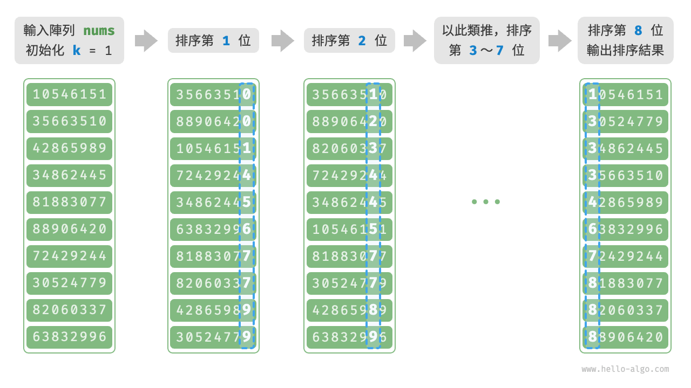

# 11.10 &nbsp; 基數排序

上一節介紹了計數排序，它適用於資料量 $n$ 較大但資料範圍 $m$ 較小的情況。假設我們需要對 $n = 10^6$ 個學號進行排序，而學號是一個 $8$ 位數字，這意味著資料範圍 $m = 10^8$ 非常大，使用計數排序需要分配大量記憶體空間，而基數排序可以避免這種情況。

<u>基數排序（radix sort）</u>的核心思想與計數排序一致，也透過統計個數來實現排序。在此基礎上，基數排序利用數字各位之間的遞進關係，依次對每一位進行排序，從而得到最終的排序結果。

## 11.10.1 &nbsp; 演算法流程

以學號資料為例，假設數字的最低位是第 $1$ 位，最高位是第 $8$ 位，基數排序的流程如圖 11-18 所示。

1. 初始化位數 $k = 1$ 。
2. 對學號的第 $k$ 位執行“計數排序”。完成後，資料會根據第 $k$ 位從小到大排序。
3. 將 $k$ 增加 $1$ ，然後返回步驟 `2.` 繼續迭代，直到所有位都排序完成後結束。

{ class="animation-figure" }

<p align="center"> 圖 11-18 &nbsp; 基數排序演算法流程 </p>

下面剖析程式碼實現。對於一個 $d$ 進位制的數字 $x$ ，要獲取其第 $k$ 位 $x_k$ ，可以使用以下計算公式：

$$
x_k = \lfloor\frac{x}{d^{k-1}}\rfloor \bmod d
$$

其中 $\lfloor a \rfloor$ 表示對浮點數 $a$ 向下取整，而 $\bmod \: d$ 表示對 $d$ 取模（取餘）。對於學號資料，$d = 10$ 且 $k \in [1, 8]$ 。

此外，我們需要小幅改動計數排序程式碼，使之可以根據數字的第 $k$ 位進行排序：

=== "Python"

    ```python title="radix_sort.py"
    def digit(num: int, exp: int) -> int:
        """獲取元素 num 的第 k 位，其中 exp = 10^(k-1)"""
        # 傳入 exp 而非 k 可以避免在此重複執行昂貴的次方計算
        return (num // exp) % 10

    def counting_sort_digit(nums: list[int], exp: int):
        """計數排序（根據 nums 第 k 位排序）"""
        # 十進位制的位範圍為 0~9 ，因此需要長度為 10 的桶陣列
        counter = [0] * 10
        n = len(nums)
        # 統計 0~9 各數字的出現次數
        for i in range(n):
            d = digit(nums[i], exp)  # 獲取 nums[i] 第 k 位，記為 d
            counter[d] += 1  # 統計數字 d 的出現次數
        # 求前綴和，將“出現個數”轉換為“陣列索引”
        for i in range(1, 10):
            counter[i] += counter[i - 1]
        # 倒序走訪，根據桶內統計結果，將各元素填入 res
        res = [0] * n
        for i in range(n - 1, -1, -1):
            d = digit(nums[i], exp)
            j = counter[d] - 1  # 獲取 d 在陣列中的索引 j
            res[j] = nums[i]  # 將當前元素填入索引 j
            counter[d] -= 1  # 將 d 的數量減 1
        # 使用結果覆蓋原陣列 nums
        for i in range(n):
            nums[i] = res[i]

    def radix_sort(nums: list[int]):
        """基數排序"""
        # 獲取陣列的最大元素，用於判斷最大位數
        m = max(nums)
        # 按照從低位到高位的順序走訪
        exp = 1
        while exp <= m:
            # 對陣列元素的第 k 位執行計數排序
            # k = 1 -> exp = 1
            # k = 2 -> exp = 10
            # 即 exp = 10^(k-1)
            counting_sort_digit(nums, exp)
            exp *= 10
    ```

=== "C++"

    ```cpp title="radix_sort.cpp"
    /* 獲取元素 num 的第 k 位，其中 exp = 10^(k-1) */
    int digit(int num, int exp) {
        // 傳入 exp 而非 k 可以避免在此重複執行昂貴的次方計算
        return (num / exp) % 10;
    }

    /* 計數排序（根據 nums 第 k 位排序） */
    void countingSortDigit(vector<int> &nums, int exp) {
        // 十進位制的位範圍為 0~9 ，因此需要長度為 10 的桶陣列
        vector<int> counter(10, 0);
        int n = nums.size();
        // 統計 0~9 各數字的出現次數
        for (int i = 0; i < n; i++) {
            int d = digit(nums[i], exp); // 獲取 nums[i] 第 k 位，記為 d
            counter[d]++;                // 統計數字 d 的出現次數
        }
        // 求前綴和，將“出現個數”轉換為“陣列索引”
        for (int i = 1; i < 10; i++) {
            counter[i] += counter[i - 1];
        }
        // 倒序走訪，根據桶內統計結果，將各元素填入 res
        vector<int> res(n, 0);
        for (int i = n - 1; i >= 0; i--) {
            int d = digit(nums[i], exp);
            int j = counter[d] - 1; // 獲取 d 在陣列中的索引 j
            res[j] = nums[i];       // 將當前元素填入索引 j
            counter[d]--;           // 將 d 的數量減 1
        }
        // 使用結果覆蓋原陣列 nums
        for (int i = 0; i < n; i++)
            nums[i] = res[i];
    }

    /* 基數排序 */
    void radixSort(vector<int> &nums) {
        // 獲取陣列的最大元素，用於判斷最大位數
        int m = *max_element(nums.begin(), nums.end());
        // 按照從低位到高位的順序走訪
        for (int exp = 1; exp <= m; exp *= 10)
            // 對陣列元素的第 k 位執行計數排序
            // k = 1 -> exp = 1
            // k = 2 -> exp = 10
            // 即 exp = 10^(k-1)
            countingSortDigit(nums, exp);
    }
    ```

=== "Java"

    ```java title="radix_sort.java"
    /* 獲取元素 num 的第 k 位，其中 exp = 10^(k-1) */
    int digit(int num, int exp) {
        // 傳入 exp 而非 k 可以避免在此重複執行昂貴的次方計算
        return (num / exp) % 10;
    }

    /* 計數排序（根據 nums 第 k 位排序） */
    void countingSortDigit(int[] nums, int exp) {
        // 十進位制的位範圍為 0~9 ，因此需要長度為 10 的桶陣列
        int[] counter = new int[10];
        int n = nums.length;
        // 統計 0~9 各數字的出現次數
        for (int i = 0; i < n; i++) {
            int d = digit(nums[i], exp); // 獲取 nums[i] 第 k 位，記為 d
            counter[d]++;                // 統計數字 d 的出現次數
        }
        // 求前綴和，將“出現個數”轉換為“陣列索引”
        for (int i = 1; i < 10; i++) {
            counter[i] += counter[i - 1];
        }
        // 倒序走訪，根據桶內統計結果，將各元素填入 res
        int[] res = new int[n];
        for (int i = n - 1; i >= 0; i--) {
            int d = digit(nums[i], exp);
            int j = counter[d] - 1; // 獲取 d 在陣列中的索引 j
            res[j] = nums[i];       // 將當前元素填入索引 j
            counter[d]--;           // 將 d 的數量減 1
        }
        // 使用結果覆蓋原陣列 nums
        for (int i = 0; i < n; i++)
            nums[i] = res[i];
    }

    /* 基數排序 */
    void radixSort(int[] nums) {
        // 獲取陣列的最大元素，用於判斷最大位數
        int m = Integer.MIN_VALUE;
        for (int num : nums)
            if (num > m)
                m = num;
        // 按照從低位到高位的順序走訪
        for (int exp = 1; exp <= m; exp *= 10) {
            // 對陣列元素的第 k 位執行計數排序
            // k = 1 -> exp = 1
            // k = 2 -> exp = 10
            // 即 exp = 10^(k-1)
            countingSortDigit(nums, exp);
        }
    }
    ```

=== "C#"

    ```csharp title="radix_sort.cs"
    /* 獲取元素 num 的第 k 位，其中 exp = 10^(k-1) */
    int Digit(int num, int exp) {
        // 傳入 exp 而非 k 可以避免在此重複執行昂貴的次方計算
        return (num / exp) % 10;
    }

    /* 計數排序（根據 nums 第 k 位排序） */
    void CountingSortDigit(int[] nums, int exp) {
        // 十進位制的位範圍為 0~9 ，因此需要長度為 10 的桶陣列
        int[] counter = new int[10];
        int n = nums.Length;
        // 統計 0~9 各數字的出現次數
        for (int i = 0; i < n; i++) {
            int d = Digit(nums[i], exp); // 獲取 nums[i] 第 k 位，記為 d
            counter[d]++;                // 統計數字 d 的出現次數
        }
        // 求前綴和，將“出現個數”轉換為“陣列索引”
        for (int i = 1; i < 10; i++) {
            counter[i] += counter[i - 1];
        }
        // 倒序走訪，根據桶內統計結果，將各元素填入 res
        int[] res = new int[n];
        for (int i = n - 1; i >= 0; i--) {
            int d = Digit(nums[i], exp);
            int j = counter[d] - 1; // 獲取 d 在陣列中的索引 j
            res[j] = nums[i];       // 將當前元素填入索引 j
            counter[d]--;           // 將 d 的數量減 1
        }
        // 使用結果覆蓋原陣列 nums
        for (int i = 0; i < n; i++) {
            nums[i] = res[i];
        }
    }

    /* 基數排序 */
    void RadixSort(int[] nums) {
        // 獲取陣列的最大元素，用於判斷最大位數
        int m = int.MinValue;
        foreach (int num in nums) {
            if (num > m) m = num;
        }
        // 按照從低位到高位的順序走訪
        for (int exp = 1; exp <= m; exp *= 10) {
            // 對陣列元素的第 k 位執行計數排序
            // k = 1 -> exp = 1
            // k = 2 -> exp = 10
            // 即 exp = 10^(k-1)
            CountingSortDigit(nums, exp);
        }
    }
    ```

=== "Go"

    ```go title="radix_sort.go"
    /* 獲取元素 num 的第 k 位，其中 exp = 10^(k-1) */
    func digit(num, exp int) int {
        // 傳入 exp 而非 k 可以避免在此重複執行昂貴的次方計算
        return (num / exp) % 10
    }

    /* 計數排序（根據 nums 第 k 位排序） */
    func countingSortDigit(nums []int, exp int) {
        // 十進位制的位範圍為 0~9 ，因此需要長度為 10 的桶陣列
        counter := make([]int, 10)
        n := len(nums)
        // 統計 0~9 各數字的出現次數
        for i := 0; i < n; i++ {
            d := digit(nums[i], exp) // 獲取 nums[i] 第 k 位，記為 d
            counter[d]++             // 統計數字 d 的出現次數
        }
        // 求前綴和，將“出現個數”轉換為“陣列索引”
        for i := 1; i < 10; i++ {
            counter[i] += counter[i-1]
        }
        // 倒序走訪，根據桶內統計結果，將各元素填入 res
        res := make([]int, n)
        for i := n - 1; i >= 0; i-- {
            d := digit(nums[i], exp)
            j := counter[d] - 1 // 獲取 d 在陣列中的索引 j
            res[j] = nums[i]    // 將當前元素填入索引 j
            counter[d]--        // 將 d 的數量減 1
        }
        // 使用結果覆蓋原陣列 nums
        for i := 0; i < n; i++ {
            nums[i] = res[i]
        }
    }

    /* 基數排序 */
    func radixSort(nums []int) {
        // 獲取陣列的最大元素，用於判斷最大位數
        max := math.MinInt
        for _, num := range nums {
            if num > max {
                max = num
            }
        }
        // 按照從低位到高位的順序走訪
        for exp := 1; max >= exp; exp *= 10 {
            // 對陣列元素的第 k 位執行計數排序
            // k = 1 -> exp = 1
            // k = 2 -> exp = 10
            // 即 exp = 10^(k-1)
            countingSortDigit(nums, exp)
        }
    }
    ```

=== "Swift"

    ```swift title="radix_sort.swift"
    /* 獲取元素 num 的第 k 位，其中 exp = 10^(k-1) */
    func digit(num: Int, exp: Int) -> Int {
        // 傳入 exp 而非 k 可以避免在此重複執行昂貴的次方計算
        (num / exp) % 10
    }

    /* 計數排序（根據 nums 第 k 位排序） */
    func countingSortDigit(nums: inout [Int], exp: Int) {
        // 十進位制的位範圍為 0~9 ，因此需要長度為 10 的桶陣列
        var counter = Array(repeating: 0, count: 10)
        // 統計 0~9 各數字的出現次數
        for i in nums.indices {
            let d = digit(num: nums[i], exp: exp) // 獲取 nums[i] 第 k 位，記為 d
            counter[d] += 1 // 統計數字 d 的出現次數
        }
        // 求前綴和，將“出現個數”轉換為“陣列索引”
        for i in 1 ..< 10 {
            counter[i] += counter[i - 1]
        }
        // 倒序走訪，根據桶內統計結果，將各元素填入 res
        var res = Array(repeating: 0, count: nums.count)
        for i in nums.indices.reversed() {
            let d = digit(num: nums[i], exp: exp)
            let j = counter[d] - 1 // 獲取 d 在陣列中的索引 j
            res[j] = nums[i] // 將當前元素填入索引 j
            counter[d] -= 1 // 將 d 的數量減 1
        }
        // 使用結果覆蓋原陣列 nums
        for i in nums.indices {
            nums[i] = res[i]
        }
    }

    /* 基數排序 */
    func radixSort(nums: inout [Int]) {
        // 獲取陣列的最大元素，用於判斷最大位數
        var m = Int.min
        for num in nums {
            if num > m {
                m = num
            }
        }
        // 按照從低位到高位的順序走訪
        for exp in sequence(first: 1, next: { m >= ($0 * 10) ? $0 * 10 : nil }) {
            // 對陣列元素的第 k 位執行計數排序
            // k = 1 -> exp = 1
            // k = 2 -> exp = 10
            // 即 exp = 10^(k-1)
            countingSortDigit(nums: &nums, exp: exp)
        }
    }
    ```

=== "JS"

    ```javascript title="radix_sort.js"
    /* 獲取元素 num 的第 k 位，其中 exp = 10^(k-1) */
    function digit(num, exp) {
        // 傳入 exp 而非 k 可以避免在此重複執行昂貴的次方計算
        return Math.floor(num / exp) % 10;
    }

    /* 計數排序（根據 nums 第 k 位排序） */
    function countingSortDigit(nums, exp) {
        // 十進位制的位範圍為 0~9 ，因此需要長度為 10 的桶陣列
        const counter = new Array(10).fill(0);
        const n = nums.length;
        // 統計 0~9 各數字的出現次數
        for (let i = 0; i < n; i++) {
            const d = digit(nums[i], exp); // 獲取 nums[i] 第 k 位，記為 d
            counter[d]++; // 統計數字 d 的出現次數
        }
        // 求前綴和，將“出現個數”轉換為“陣列索引”
        for (let i = 1; i < 10; i++) {
            counter[i] += counter[i - 1];
        }
        // 倒序走訪，根據桶內統計結果，將各元素填入 res
        const res = new Array(n).fill(0);
        for (let i = n - 1; i >= 0; i--) {
            const d = digit(nums[i], exp);
            const j = counter[d] - 1; // 獲取 d 在陣列中的索引 j
            res[j] = nums[i]; // 將當前元素填入索引 j
            counter[d]--; // 將 d 的數量減 1
        }
        // 使用結果覆蓋原陣列 nums
        for (let i = 0; i < n; i++) {
            nums[i] = res[i];
        }
    }

    /* 基數排序 */
    function radixSort(nums) {
        // 獲取陣列的最大元素，用於判斷最大位數
        let m = Number.MIN_VALUE;
        for (const num of nums) {
            if (num > m) {
                m = num;
            }
        }
        // 按照從低位到高位的順序走訪
        for (let exp = 1; exp <= m; exp *= 10) {
            // 對陣列元素的第 k 位執行計數排序
            // k = 1 -> exp = 1
            // k = 2 -> exp = 10
            // 即 exp = 10^(k-1)
            countingSortDigit(nums, exp);
        }
    }
    ```

=== "TS"

    ```typescript title="radix_sort.ts"
    /* 獲取元素 num 的第 k 位，其中 exp = 10^(k-1) */
    function digit(num: number, exp: number): number {
        // 傳入 exp 而非 k 可以避免在此重複執行昂貴的次方計算
        return Math.floor(num / exp) % 10;
    }

    /* 計數排序（根據 nums 第 k 位排序） */
    function countingSortDigit(nums: number[], exp: number): void {
        // 十進位制的位範圍為 0~9 ，因此需要長度為 10 的桶陣列
        const counter = new Array(10).fill(0);
        const n = nums.length;
        // 統計 0~9 各數字的出現次數
        for (let i = 0; i < n; i++) {
            const d = digit(nums[i], exp); // 獲取 nums[i] 第 k 位，記為 d
            counter[d]++; // 統計數字 d 的出現次數
        }
        // 求前綴和，將“出現個數”轉換為“陣列索引”
        for (let i = 1; i < 10; i++) {
            counter[i] += counter[i - 1];
        }
        // 倒序走訪，根據桶內統計結果，將各元素填入 res
        const res = new Array(n).fill(0);
        for (let i = n - 1; i >= 0; i--) {
            const d = digit(nums[i], exp);
            const j = counter[d] - 1; // 獲取 d 在陣列中的索引 j
            res[j] = nums[i]; // 將當前元素填入索引 j
            counter[d]--; // 將 d 的數量減 1
        }
        // 使用結果覆蓋原陣列 nums
        for (let i = 0; i < n; i++) {
            nums[i] = res[i];
        }
    }

    /* 基數排序 */
    function radixSort(nums: number[]): void {
        // 獲取陣列的最大元素，用於判斷最大位數
        let m = Number.MIN_VALUE;
        for (const num of nums) {
            if (num > m) {
                m = num;
            }
        }
        // 按照從低位到高位的順序走訪
        for (let exp = 1; exp <= m; exp *= 10) {
            // 對陣列元素的第 k 位執行計數排序
            // k = 1 -> exp = 1
            // k = 2 -> exp = 10
            // 即 exp = 10^(k-1)
            countingSortDigit(nums, exp);
        }
    }
    ```

=== "Dart"

    ```dart title="radix_sort.dart"
    /* 獲取元素 _num 的第 k 位，其中 exp = 10^(k-1) */
    int digit(int _num, int exp) {
      // 傳入 exp 而非 k 可以避免在此重複執行昂貴的次方計算
      return (_num ~/ exp) % 10;
    }

    /* 計數排序（根據 nums 第 k 位排序） */
    void countingSortDigit(List<int> nums, int exp) {
      // 十進位制的位範圍為 0~9 ，因此需要長度為 10 的桶陣列
      List<int> counter = List<int>.filled(10, 0);
      int n = nums.length;
      // 統計 0~9 各數字的出現次數
      for (int i = 0; i < n; i++) {
        int d = digit(nums[i], exp); // 獲取 nums[i] 第 k 位，記為 d
        counter[d]++; // 統計數字 d 的出現次數
      }
      // 求前綴和，將“出現個數”轉換為“陣列索引”
      for (int i = 1; i < 10; i++) {
        counter[i] += counter[i - 1];
      }
      // 倒序走訪，根據桶內統計結果，將各元素填入 res
      List<int> res = List<int>.filled(n, 0);
      for (int i = n - 1; i >= 0; i--) {
        int d = digit(nums[i], exp);
        int j = counter[d] - 1; // 獲取 d 在陣列中的索引 j
        res[j] = nums[i]; // 將當前元素填入索引 j
        counter[d]--; // 將 d 的數量減 1
      }
      // 使用結果覆蓋原陣列 nums
      for (int i = 0; i < n; i++) nums[i] = res[i];
    }

    /* 基數排序 */
    void radixSort(List<int> nums) {
      // 獲取陣列的最大元素，用於判斷最大位數
      // dart 中 int 的長度是 64 位的
      int m = -1 << 63;
      for (int _num in nums) if (_num > m) m = _num;
      // 按照從低位到高位的順序走訪
      for (int exp = 1; exp <= m; exp *= 10)
        // 對陣列元素的第 k 位執行計數排序
        // k = 1 -> exp = 1
        // k = 2 -> exp = 10
        // 即 exp = 10^(k-1)
        countingSortDigit(nums, exp);
    }
    ```

=== "Rust"

    ```rust title="radix_sort.rs"
    /* 獲取元素 num 的第 k 位，其中 exp = 10^(k-1) */
    fn digit(num: i32, exp: i32) -> usize {
        // 傳入 exp 而非 k 可以避免在此重複執行昂貴的次方計算
        return ((num / exp) % 10) as usize;
    }

    /* 計數排序（根據 nums 第 k 位排序） */
    fn counting_sort_digit(nums: &mut [i32], exp: i32) {
        // 十進位制的位範圍為 0~9 ，因此需要長度為 10 的桶陣列
        let mut counter = [0; 10];
        let n = nums.len();
        // 統計 0~9 各數字的出現次數
        for i in 0..n {
            let d = digit(nums[i], exp); // 獲取 nums[i] 第 k 位，記為 d
            counter[d] += 1; // 統計數字 d 的出現次數
        }
        // 求前綴和，將“出現個數”轉換為“陣列索引”
        for i in 1..10 {
            counter[i] += counter[i - 1];
        }
        // 倒序走訪，根據桶內統計結果，將各元素填入 res
        let mut res = vec![0; n];
        for i in (0..n).rev() {
            let d = digit(nums[i], exp);
            let j = counter[d] - 1; // 獲取 d 在陣列中的索引 j
            res[j] = nums[i]; // 將當前元素填入索引 j
            counter[d] -= 1; // 將 d 的數量減 1
        }
        // 使用結果覆蓋原陣列 nums
        nums.copy_from_slice(&res);
    }

    /* 基數排序 */
    fn radix_sort(nums: &mut [i32]) {
        // 獲取陣列的最大元素，用於判斷最大位數
        let m = *nums.into_iter().max().unwrap();
        // 按照從低位到高位的順序走訪
        let mut exp = 1;
        while exp <= m {
            counting_sort_digit(nums, exp);
            exp *= 10;
        }
    }
    ```

=== "C"

    ```c title="radix_sort.c"
    /* 獲取元素 num 的第 k 位，其中 exp = 10^(k-1) */
    int digit(int num, int exp) {
        // 傳入 exp 而非 k 可以避免在此重複執行昂貴的次方計算
        return (num / exp) % 10;
    }

    /* 計數排序（根據 nums 第 k 位排序） */
    void countingSortDigit(int nums[], int size, int exp) {
        // 十進位制的位範圍為 0~9 ，因此需要長度為 10 的桶陣列
        int *counter = (int *)malloc((sizeof(int) * 10));
        memset(counter, 0, sizeof(int) * 10); // 初始化為 0 以支持後續記憶體釋放
        // 統計 0~9 各數字的出現次數
        for (int i = 0; i < size; i++) {
            // 獲取 nums[i] 第 k 位，記為 d
            int d = digit(nums[i], exp);
            // 統計數字 d 的出現次數
            counter[d]++;
        }
        // 求前綴和，將“出現個數”轉換為“陣列索引”
        for (int i = 1; i < 10; i++) {
            counter[i] += counter[i - 1];
        }
        // 倒序走訪，根據桶內統計結果，將各元素填入 res
        int *res = (int *)malloc(sizeof(int) * size);
        for (int i = size - 1; i >= 0; i--) {
            int d = digit(nums[i], exp);
            int j = counter[d] - 1; // 獲取 d 在陣列中的索引 j
            res[j] = nums[i];       // 將當前元素填入索引 j
            counter[d]--;           // 將 d 的數量減 1
        }
        // 使用結果覆蓋原陣列 nums
        for (int i = 0; i < size; i++) {
            nums[i] = res[i];
        }
        // 釋放記憶體
        free(res);
        free(counter);
    }

    /* 基數排序 */
    void radixSort(int nums[], int size) {
        // 獲取陣列的最大元素，用於判斷最大位數
        int max = INT32_MIN;
        for (int i = 0; i < size; i++) {
            if (nums[i] > max) {
                max = nums[i];
            }
        }
        // 按照從低位到高位的順序走訪
        for (int exp = 1; max >= exp; exp *= 10)
            // 對陣列元素的第 k 位執行計數排序
            // k = 1 -> exp = 1
            // k = 2 -> exp = 10
            // 即 exp = 10^(k-1)
            countingSortDigit(nums, size, exp);
    }
    ```

=== "Kotlin"

    ```kotlin title="radix_sort.kt"
    /* 獲取元素 num 的第 k 位，其中 exp = 10^(k-1) */
    fun digit(num: Int, exp: Int): Int {
        // 傳入 exp 而非 k 可以避免在此重複執行昂貴的次方計算
        return (num / exp) % 10
    }

    /* 計數排序（根據 nums 第 k 位排序） */
    fun countingSortDigit(nums: IntArray, exp: Int) {
        // 十進位制的位範圍為 0~9 ，因此需要長度為 10 的桶陣列
        val counter = IntArray(10)
        val n = nums.size
        // 統計 0~9 各數字的出現次數
        for (i in 0..<n) {
            val d = digit(nums[i], exp) // 獲取 nums[i] 第 k 位，記為 d
            counter[d]++                // 統計數字 d 的出現次數
        }
        // 求前綴和，將“出現個數”轉換為“陣列索引”
        for (i in 1..9) {
            counter[i] += counter[i - 1]
        }
        // 倒序走訪，根據桶內統計結果，將各元素填入 res
        val res = IntArray(n)
        for (i in n - 1 downTo 0) {
            val d = digit(nums[i], exp)
            val j = counter[d] - 1 // 獲取 d 在陣列中的索引 j
            res[j] = nums[i]       // 將當前元素填入索引 j
            counter[d]--           // 將 d 的數量減 1
        }
        // 使用結果覆蓋原陣列 nums
        for (i in 0..<n)
            nums[i] = res[i]
    }

    /* 基數排序 */
    fun radixSort(nums: IntArray) {
        // 獲取陣列的最大元素，用於判斷最大位數
        var m = Int.MIN_VALUE
        for (num in nums) if (num > m) m = num
        var exp = 1
        // 按照從低位到高位的順序走訪
        while (exp <= m) {
            // 對陣列元素的第 k 位執行計數排序
            // k = 1 -> exp = 1
            // k = 2 -> exp = 10
            // 即 exp = 10^(k-1)
            countingSortDigit(nums, exp)
            exp *= 10
        }
    }
    ```

=== "Ruby"

    ```ruby title="radix_sort.rb"
    ### 獲取元素 num 的第 k 位，其中 exp = 10^(k-1) ###
    def digit(num, exp)
      # 轉入 exp 而非 k 可以避免在此重複執行昂貴的次方計算
      (num / exp) % 10
    end

    ### 計數排序（根據 nums 第 k 位排序）###
    def counting_sort_digit(nums, exp)
      # 十進位制的位範圍為 0~9 ，因此需要長度為 10 的桶陣列
      counter = Array.new(10, 0)
      n = nums.length
      # 統計 0~9 各數字的出現次數
      for i in 0...n
        d = digit(nums[i], exp) # 獲取 nums[i] 第 k 位，記為 d
        counter[d] += 1 # 統計數字 d 的出現次數
      end
      # 求前綴和，將“出現個數”轉換為“陣列索引”
      (1...10).each { |i| counter[i] += counter[i - 1] }
      # 倒序走訪，根據桶內統計結果，將各元素填入 res
      res = Array.new(n, 0)
      for i in (n - 1).downto(0)
        d = digit(nums[i], exp)
        j = counter[d] - 1 # 獲取 d 在陣列中的索引 j
        res[j] = nums[i] # 將當前元素填入索引 j
        counter[d] -= 1 # 將 d 的數量減 1
      end
      # 使用結果覆蓋原陣列 nums
      (0...n).each { |i| nums[i] = res[i] }
    end

    ### 基數排序 ###
    def radix_sort(nums)
      # 獲取陣列的最大元素，用於判斷最大位數
      m = nums.max
      # 按照從低位到高位的順序走訪
      exp = 1
      while exp <= m
        # 對陣列元素的第 k 位執行計數排序
        # k = 1 -> exp = 1
        # k = 2 -> exp = 10
        # 即 exp = 10^(k-1)
        counting_sort_digit(nums, exp)
        exp *= 10
      end
    end
    ```

=== "Zig"

    ```zig title="radix_sort.zig"
    // 獲取元素 num 的第 k 位，其中 exp = 10^(k-1)
    fn digit(num: i32, exp: i32) i32 {
        // 傳入 exp 而非 k 可以避免在此重複執行昂貴的次方計算
        return @mod(@divFloor(num, exp), 10);
    }

    // 計數排序（根據 nums 第 k 位排序）
    fn countingSortDigit(nums: []i32, exp: i32) !void {
        // 十進位制的位範圍為 0~9 ，因此需要長度為 10 的桶陣列
        var mem_arena = std.heap.ArenaAllocator.init(std.heap.page_allocator);
        // defer mem_arena.deinit();
        const mem_allocator = mem_arena.allocator();
        var counter = try mem_allocator.alloc(usize, 10);
        @memset(counter, 0);
        var n = nums.len;
        // 統計 0~9 各數字的出現次數
        for (nums) |num| {
            var d: u32 = @bitCast(digit(num, exp)); // 獲取 nums[i] 第 k 位，記為 d
            counter[d] += 1; // 統計數字 d 的出現次數
        }
        // 求前綴和，將“出現個數”轉換為“陣列索引”
        var i: usize = 1;
        while (i < 10) : (i += 1) {
            counter[i] += counter[i - 1];
        }
        // 倒序走訪，根據桶內統計結果，將各元素填入 res
        var res = try mem_allocator.alloc(i32, n);
        i = n - 1;
        while (i >= 0) : (i -= 1) {
            var d: u32 = @bitCast(digit(nums[i], exp));
            var j = counter[d] - 1; // 獲取 d 在陣列中的索引 j
            res[j] = nums[i];       // 將當前元素填入索引 j
            counter[d] -= 1;        // 將 d 的數量減 1
            if (i == 0) break;
        }
        // 使用結果覆蓋原陣列 nums
        i = 0;
        while (i < n) : (i += 1) {
            nums[i] = res[i];
        }
    }

    // 基數排序
    fn radixSort(nums: []i32) !void {
        // 獲取陣列的最大元素，用於判斷最大位數
        var m: i32 = std.math.minInt(i32);
        for (nums) |num| {
            if (num > m) m = num;
        }
        // 按照從低位到高位的順序走訪
        var exp: i32 = 1;
        while (exp <= m) : (exp *= 10) {
            // 對陣列元素的第 k 位執行計數排序
            // k = 1 -> exp = 1
            // k = 2 -> exp = 10
            // 即 exp = 10^(k-1)
            try countingSortDigit(nums, exp);    
        }
    } 
    ```

??? pythontutor "視覺化執行"

    <div style="height: 549px; width: 100%;"><iframe class="pythontutor-iframe" src="https://pythontutor.com/iframe-embed.html#code=def%20digit%28num%3A%20int%2C%20exp%3A%20int%29%20-%3E%20int%3A%0A%20%20%20%20%22%22%22%E7%8D%B2%E5%8F%96%E5%85%83%E7%B4%A0%20num%20%E7%9A%84%E7%AC%AC%20k%20%E4%BD%8D%EF%BC%8C%E5%85%B6%E4%B8%AD%20exp%20%3D%2010%5E%28k-1%29%22%22%22%0A%20%20%20%20%23%20%E5%82%B3%E5%85%A5%20exp%20%E8%80%8C%E9%9D%9E%20k%20%E5%8F%AF%E4%BB%A5%E9%81%BF%E5%85%8D%E5%9C%A8%E6%AD%A4%E9%87%8D%E8%A4%87%E5%9F%B7%E8%A1%8C%E6%98%82%E8%B2%B4%E7%9A%84%E6%AC%A1%E6%96%B9%E8%A8%88%E7%AE%97%0A%20%20%20%20return%20%28num%20//%20exp%29%20%25%2010%0A%0Adef%20counting_sort_digit%28nums%3A%20list%5Bint%5D%2C%20exp%3A%20int%29%3A%0A%20%20%20%20%22%22%22%E8%A8%88%E6%95%B8%E6%8E%92%E5%BA%8F%EF%BC%88%E6%A0%B9%E6%93%9A%20nums%20%E7%AC%AC%20k%20%E4%BD%8D%E6%8E%92%E5%BA%8F%EF%BC%89%22%22%22%0A%20%20%20%20%23%20%E5%8D%81%E9%80%B2%E4%BD%8D%E5%88%B6%E7%9A%84%E4%BD%8D%E7%AF%84%E5%9C%8D%E7%82%BA%200~9%20%EF%BC%8C%E5%9B%A0%E6%AD%A4%E9%9C%80%E8%A6%81%E9%95%B7%E5%BA%A6%E7%82%BA%2010%20%E7%9A%84%E6%A1%B6%E9%99%A3%E5%88%97%0A%20%20%20%20counter%20%3D%20%5B0%5D%20%2A%2010%0A%20%20%20%20n%20%3D%20len%28nums%29%0A%20%20%20%20%23%20%E7%B5%B1%E8%A8%88%200~9%20%E5%90%84%E6%95%B8%E5%AD%97%E7%9A%84%E5%87%BA%E7%8F%BE%E6%AC%A1%E6%95%B8%0A%20%20%20%20for%20i%20in%20range%28n%29%3A%0A%20%20%20%20%20%20%20%20d%20%3D%20digit%28nums%5Bi%5D%2C%20exp%29%20%20%23%20%E7%8D%B2%E5%8F%96%20nums%5Bi%5D%20%E7%AC%AC%20k%20%E4%BD%8D%EF%BC%8C%E8%A8%98%E7%82%BA%20d%0A%20%20%20%20%20%20%20%20counter%5Bd%5D%20%2B%3D%201%20%20%23%20%E7%B5%B1%E8%A8%88%E6%95%B8%E5%AD%97%20d%20%E7%9A%84%E5%87%BA%E7%8F%BE%E6%AC%A1%E6%95%B8%0A%20%20%20%20%23%20%E6%B1%82%E5%89%8D%E7%B6%B4%E5%92%8C%EF%BC%8C%E5%B0%87%E2%80%9C%E5%87%BA%E7%8F%BE%E5%80%8B%E6%95%B8%E2%80%9D%E8%BD%89%E6%8F%9B%E7%82%BA%E2%80%9C%E9%99%A3%E5%88%97%E7%B4%A2%E5%BC%95%E2%80%9D%0A%20%20%20%20for%20i%20in%20range%281%2C%2010%29%3A%0A%20%20%20%20%20%20%20%20counter%5Bi%5D%20%2B%3D%20counter%5Bi%20-%201%5D%0A%20%20%20%20%23%20%E5%80%92%E5%BA%8F%E8%B5%B0%E8%A8%AA%EF%BC%8C%E6%A0%B9%E6%93%9A%E6%A1%B6%E5%85%A7%E7%B5%B1%E8%A8%88%E7%B5%90%E6%9E%9C%EF%BC%8C%E5%B0%87%E5%90%84%E5%85%83%E7%B4%A0%E5%A1%AB%E5%85%A5%20res%0A%20%20%20%20res%20%3D%20%5B0%5D%20%2A%20n%0A%20%20%20%20for%20i%20in%20range%28n%20-%201%2C%20-1%2C%20-1%29%3A%0A%20%20%20%20%20%20%20%20d%20%3D%20digit%28nums%5Bi%5D%2C%20exp%29%0A%20%20%20%20%20%20%20%20j%20%3D%20counter%5Bd%5D%20-%201%20%20%23%20%E7%8D%B2%E5%8F%96%20d%20%E5%9C%A8%E9%99%A3%E5%88%97%E4%B8%AD%E7%9A%84%E7%B4%A2%E5%BC%95%20j%0A%20%20%20%20%20%20%20%20res%5Bj%5D%20%3D%20nums%5Bi%5D%20%20%23%20%E5%B0%87%E7%95%B6%E5%89%8D%E5%85%83%E7%B4%A0%E5%A1%AB%E5%85%A5%E7%B4%A2%E5%BC%95%20j%0A%20%20%20%20%20%20%20%20counter%5Bd%5D%20-%3D%201%20%20%23%20%E5%B0%87%20d%20%E7%9A%84%E6%95%B8%E9%87%8F%E6%B8%9B%201%0A%20%20%20%20%23%20%E4%BD%BF%E7%94%A8%E7%B5%90%E6%9E%9C%E8%A6%86%E8%93%8B%E5%8E%9F%E9%99%A3%E5%88%97%20nums%0A%20%20%20%20for%20i%20in%20range%28n%29%3A%0A%20%20%20%20%20%20%20%20nums%5Bi%5D%20%3D%20res%5Bi%5D%0A%0Adef%20radix_sort%28nums%3A%20list%5Bint%5D%29%3A%0A%20%20%20%20%22%22%22%E5%9F%BA%E6%95%B8%E6%8E%92%E5%BA%8F%22%22%22%0A%20%20%20%20%23%20%E7%8D%B2%E5%8F%96%E9%99%A3%E5%88%97%E7%9A%84%E6%9C%80%E5%A4%A7%E5%85%83%E7%B4%A0%EF%BC%8C%E7%94%A8%E6%96%BC%E5%88%A4%E6%96%B7%E6%9C%80%E5%A4%A7%E4%BD%8D%E6%95%B8%0A%20%20%20%20m%20%3D%20max%28nums%29%0A%20%20%20%20%23%20%E6%8C%89%E7%85%A7%E5%BE%9E%E4%BD%8E%E4%BD%8D%E5%88%B0%E9%AB%98%E4%BD%8D%E7%9A%84%E9%A0%86%E5%BA%8F%E8%B5%B0%E8%A8%AA%0A%20%20%20%20exp%20%3D%201%0A%20%20%20%20while%20exp%20%3C%3D%20m%3A%0A%20%20%20%20%20%20%20%20%23%20%E5%B0%8D%E9%99%A3%E5%88%97%E5%85%83%E7%B4%A0%E7%9A%84%E7%AC%AC%20k%20%E4%BD%8D%E5%9F%B7%E8%A1%8C%E8%A8%88%E6%95%B8%E6%8E%92%E5%BA%8F%0A%20%20%20%20%20%20%20%20%23%20k%20%3D%201%20-%3E%20exp%20%3D%201%0A%20%20%20%20%20%20%20%20%23%20k%20%3D%202%20-%3E%20exp%20%3D%2010%0A%20%20%20%20%20%20%20%20%23%20%E5%8D%B3%20exp%20%3D%2010%5E%28k-1%29%0A%20%20%20%20%20%20%20%20counting_sort_digit%28nums%2C%20exp%29%0A%20%20%20%20%20%20%20%20exp%20%2A%3D%2010%0A%0A%22%22%22Driver%20Code%22%22%22%0Aif%20__name__%20%3D%3D%20%22__main__%22%3A%0A%20%20%20%20%23%20%E5%9F%BA%E6%95%B8%E6%8E%92%E5%BA%8F%0A%20%20%20%20nums%20%3D%20%5B%0A%20%20%20%20%20%20%20%20105%2C%0A%20%20%20%20%20%20%20%20356%2C%0A%20%20%20%20%20%20%20%20428%2C%0A%20%20%20%20%20%20%20%20348%2C%0A%20%20%20%20%20%20%20%20818%2C%0A%20%20%20%20%5D%0A%20%20%20%20radix_sort%28nums%29%0A%20%20%20%20print%28%22%E5%9F%BA%E6%95%B8%E6%8E%92%E5%BA%8F%E5%AE%8C%E6%88%90%E5%BE%8C%20nums%20%3D%22%2C%20nums%29&codeDivHeight=472&codeDivWidth=350&cumulative=false&curInstr=6&heapPrimitives=nevernest&origin=opt-frontend.js&py=311&rawInputLstJSON=%5B%5D&textReferences=false"> </iframe></div>
    <div style="margin-top: 5px;"><a href="https://pythontutor.com/iframe-embed.html#code=def%20digit%28num%3A%20int%2C%20exp%3A%20int%29%20-%3E%20int%3A%0A%20%20%20%20%22%22%22%E7%8D%B2%E5%8F%96%E5%85%83%E7%B4%A0%20num%20%E7%9A%84%E7%AC%AC%20k%20%E4%BD%8D%EF%BC%8C%E5%85%B6%E4%B8%AD%20exp%20%3D%2010%5E%28k-1%29%22%22%22%0A%20%20%20%20%23%20%E5%82%B3%E5%85%A5%20exp%20%E8%80%8C%E9%9D%9E%20k%20%E5%8F%AF%E4%BB%A5%E9%81%BF%E5%85%8D%E5%9C%A8%E6%AD%A4%E9%87%8D%E8%A4%87%E5%9F%B7%E8%A1%8C%E6%98%82%E8%B2%B4%E7%9A%84%E6%AC%A1%E6%96%B9%E8%A8%88%E7%AE%97%0A%20%20%20%20return%20%28num%20//%20exp%29%20%25%2010%0A%0Adef%20counting_sort_digit%28nums%3A%20list%5Bint%5D%2C%20exp%3A%20int%29%3A%0A%20%20%20%20%22%22%22%E8%A8%88%E6%95%B8%E6%8E%92%E5%BA%8F%EF%BC%88%E6%A0%B9%E6%93%9A%20nums%20%E7%AC%AC%20k%20%E4%BD%8D%E6%8E%92%E5%BA%8F%EF%BC%89%22%22%22%0A%20%20%20%20%23%20%E5%8D%81%E9%80%B2%E4%BD%8D%E5%88%B6%E7%9A%84%E4%BD%8D%E7%AF%84%E5%9C%8D%E7%82%BA%200~9%20%EF%BC%8C%E5%9B%A0%E6%AD%A4%E9%9C%80%E8%A6%81%E9%95%B7%E5%BA%A6%E7%82%BA%2010%20%E7%9A%84%E6%A1%B6%E9%99%A3%E5%88%97%0A%20%20%20%20counter%20%3D%20%5B0%5D%20%2A%2010%0A%20%20%20%20n%20%3D%20len%28nums%29%0A%20%20%20%20%23%20%E7%B5%B1%E8%A8%88%200~9%20%E5%90%84%E6%95%B8%E5%AD%97%E7%9A%84%E5%87%BA%E7%8F%BE%E6%AC%A1%E6%95%B8%0A%20%20%20%20for%20i%20in%20range%28n%29%3A%0A%20%20%20%20%20%20%20%20d%20%3D%20digit%28nums%5Bi%5D%2C%20exp%29%20%20%23%20%E7%8D%B2%E5%8F%96%20nums%5Bi%5D%20%E7%AC%AC%20k%20%E4%BD%8D%EF%BC%8C%E8%A8%98%E7%82%BA%20d%0A%20%20%20%20%20%20%20%20counter%5Bd%5D%20%2B%3D%201%20%20%23%20%E7%B5%B1%E8%A8%88%E6%95%B8%E5%AD%97%20d%20%E7%9A%84%E5%87%BA%E7%8F%BE%E6%AC%A1%E6%95%B8%0A%20%20%20%20%23%20%E6%B1%82%E5%89%8D%E7%B6%B4%E5%92%8C%EF%BC%8C%E5%B0%87%E2%80%9C%E5%87%BA%E7%8F%BE%E5%80%8B%E6%95%B8%E2%80%9D%E8%BD%89%E6%8F%9B%E7%82%BA%E2%80%9C%E9%99%A3%E5%88%97%E7%B4%A2%E5%BC%95%E2%80%9D%0A%20%20%20%20for%20i%20in%20range%281%2C%2010%29%3A%0A%20%20%20%20%20%20%20%20counter%5Bi%5D%20%2B%3D%20counter%5Bi%20-%201%5D%0A%20%20%20%20%23%20%E5%80%92%E5%BA%8F%E8%B5%B0%E8%A8%AA%EF%BC%8C%E6%A0%B9%E6%93%9A%E6%A1%B6%E5%85%A7%E7%B5%B1%E8%A8%88%E7%B5%90%E6%9E%9C%EF%BC%8C%E5%B0%87%E5%90%84%E5%85%83%E7%B4%A0%E5%A1%AB%E5%85%A5%20res%0A%20%20%20%20res%20%3D%20%5B0%5D%20%2A%20n%0A%20%20%20%20for%20i%20in%20range%28n%20-%201%2C%20-1%2C%20-1%29%3A%0A%20%20%20%20%20%20%20%20d%20%3D%20digit%28nums%5Bi%5D%2C%20exp%29%0A%20%20%20%20%20%20%20%20j%20%3D%20counter%5Bd%5D%20-%201%20%20%23%20%E7%8D%B2%E5%8F%96%20d%20%E5%9C%A8%E9%99%A3%E5%88%97%E4%B8%AD%E7%9A%84%E7%B4%A2%E5%BC%95%20j%0A%20%20%20%20%20%20%20%20res%5Bj%5D%20%3D%20nums%5Bi%5D%20%20%23%20%E5%B0%87%E7%95%B6%E5%89%8D%E5%85%83%E7%B4%A0%E5%A1%AB%E5%85%A5%E7%B4%A2%E5%BC%95%20j%0A%20%20%20%20%20%20%20%20counter%5Bd%5D%20-%3D%201%20%20%23%20%E5%B0%87%20d%20%E7%9A%84%E6%95%B8%E9%87%8F%E6%B8%9B%201%0A%20%20%20%20%23%20%E4%BD%BF%E7%94%A8%E7%B5%90%E6%9E%9C%E8%A6%86%E8%93%8B%E5%8E%9F%E9%99%A3%E5%88%97%20nums%0A%20%20%20%20for%20i%20in%20range%28n%29%3A%0A%20%20%20%20%20%20%20%20nums%5Bi%5D%20%3D%20res%5Bi%5D%0A%0Adef%20radix_sort%28nums%3A%20list%5Bint%5D%29%3A%0A%20%20%20%20%22%22%22%E5%9F%BA%E6%95%B8%E6%8E%92%E5%BA%8F%22%22%22%0A%20%20%20%20%23%20%E7%8D%B2%E5%8F%96%E9%99%A3%E5%88%97%E7%9A%84%E6%9C%80%E5%A4%A7%E5%85%83%E7%B4%A0%EF%BC%8C%E7%94%A8%E6%96%BC%E5%88%A4%E6%96%B7%E6%9C%80%E5%A4%A7%E4%BD%8D%E6%95%B8%0A%20%20%20%20m%20%3D%20max%28nums%29%0A%20%20%20%20%23%20%E6%8C%89%E7%85%A7%E5%BE%9E%E4%BD%8E%E4%BD%8D%E5%88%B0%E9%AB%98%E4%BD%8D%E7%9A%84%E9%A0%86%E5%BA%8F%E8%B5%B0%E8%A8%AA%0A%20%20%20%20exp%20%3D%201%0A%20%20%20%20while%20exp%20%3C%3D%20m%3A%0A%20%20%20%20%20%20%20%20%23%20%E5%B0%8D%E9%99%A3%E5%88%97%E5%85%83%E7%B4%A0%E7%9A%84%E7%AC%AC%20k%20%E4%BD%8D%E5%9F%B7%E8%A1%8C%E8%A8%88%E6%95%B8%E6%8E%92%E5%BA%8F%0A%20%20%20%20%20%20%20%20%23%20k%20%3D%201%20-%3E%20exp%20%3D%201%0A%20%20%20%20%20%20%20%20%23%20k%20%3D%202%20-%3E%20exp%20%3D%2010%0A%20%20%20%20%20%20%20%20%23%20%E5%8D%B3%20exp%20%3D%2010%5E%28k-1%29%0A%20%20%20%20%20%20%20%20counting_sort_digit%28nums%2C%20exp%29%0A%20%20%20%20%20%20%20%20exp%20%2A%3D%2010%0A%0A%22%22%22Driver%20Code%22%22%22%0Aif%20__name__%20%3D%3D%20%22__main__%22%3A%0A%20%20%20%20%23%20%E5%9F%BA%E6%95%B8%E6%8E%92%E5%BA%8F%0A%20%20%20%20nums%20%3D%20%5B%0A%20%20%20%20%20%20%20%20105%2C%0A%20%20%20%20%20%20%20%20356%2C%0A%20%20%20%20%20%20%20%20428%2C%0A%20%20%20%20%20%20%20%20348%2C%0A%20%20%20%20%20%20%20%20818%2C%0A%20%20%20%20%5D%0A%20%20%20%20radix_sort%28nums%29%0A%20%20%20%20print%28%22%E5%9F%BA%E6%95%B8%E6%8E%92%E5%BA%8F%E5%AE%8C%E6%88%90%E5%BE%8C%20nums%20%3D%22%2C%20nums%29&codeDivHeight=800&codeDivWidth=600&cumulative=false&curInstr=6&heapPrimitives=nevernest&origin=opt-frontend.js&py=311&rawInputLstJSON=%5B%5D&textReferences=false" target="_blank" rel="noopener noreferrer">全螢幕觀看 ></a></div>

!!! question "為什麼從最低位開始排序？"

    在連續的排序輪次中，後一輪排序會覆蓋前一輪排序的結果。舉例來說，如果第一輪排序結果 $a < b$ ，而第二輪排序結果 $a > b$ ，那麼第二輪的結果將取代第一輪的結果。由於數字的高位優先順序高於低位，因此應該先排序低位再排序高位。

## 11.10.2 &nbsp; 演算法特性

相較於計數排序，基數排序適用於數值範圍較大的情況，**但前提是資料必須可以表示為固定位數的格式，且位數不能過大**。例如，浮點數不適合使用基數排序，因為其位數 $k$ 過大，可能導致時間複雜度 $O(nk) \gg O(n^2)$ 。

- **時間複雜度為 $O(nk)$、非自適應排序**：設資料量為 $n$、資料為 $d$ 進位制、最大位數為 $k$ ，則對某一位執行計數排序使用 $O(n + d)$ 時間，排序所有 $k$ 位使用 $O((n + d)k)$ 時間。通常情況下，$d$ 和 $k$ 都相對較小，時間複雜度趨向 $O(n)$ 。
- **空間複雜度為 $O(n + d)$、非原地排序**：與計數排序相同，基數排序需要藉助長度為 $n$ 和 $d$ 的陣列 `res` 和 `counter` 。
- **穩定排序**：當計數排序穩定時，基數排序也穩定；當計數排序不穩定時，基數排序無法保證得到正確的排序結果。
