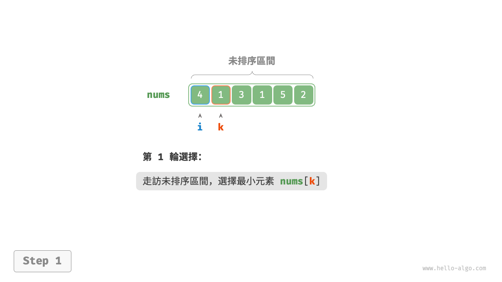
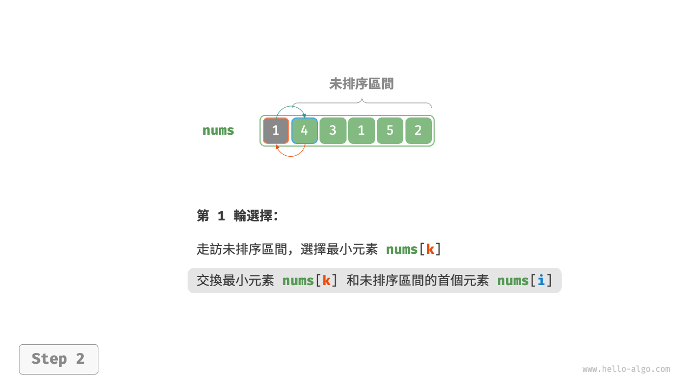
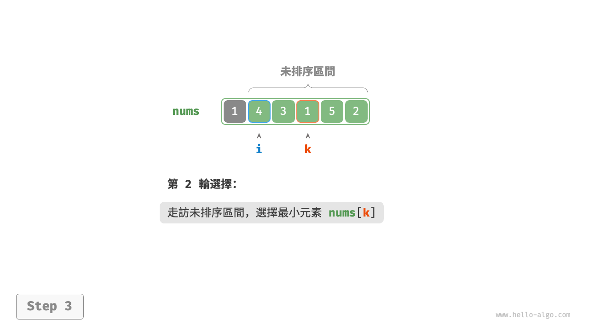
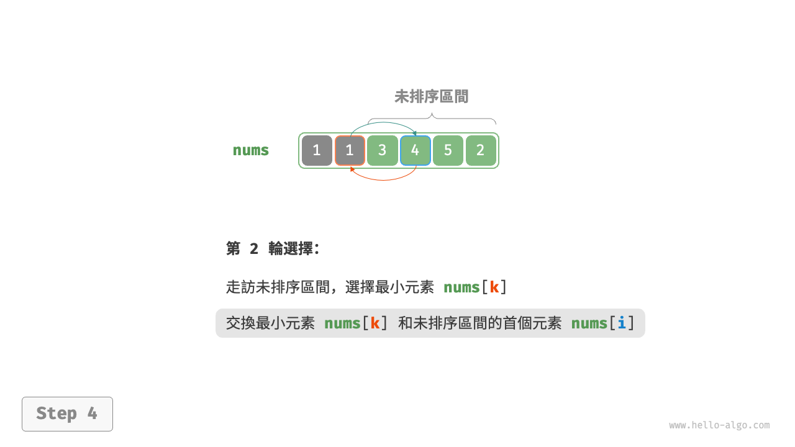
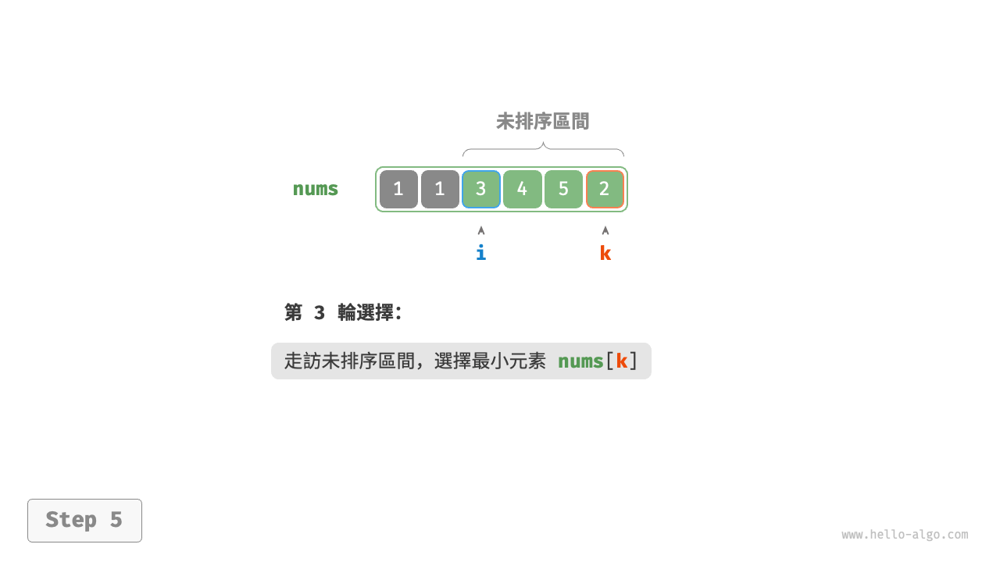
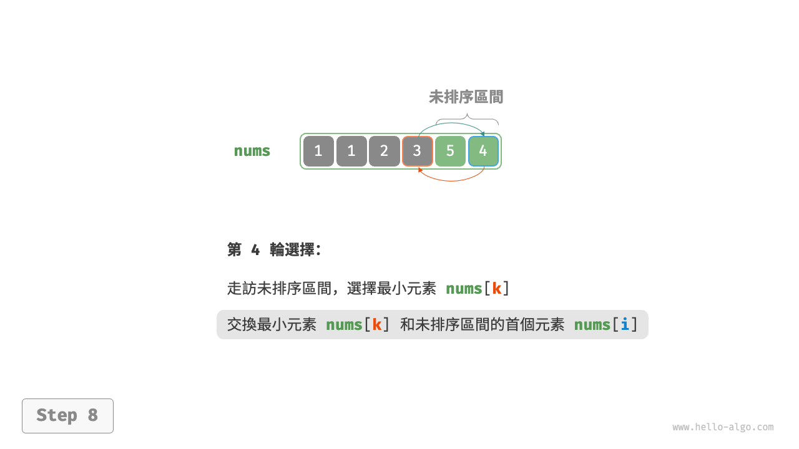
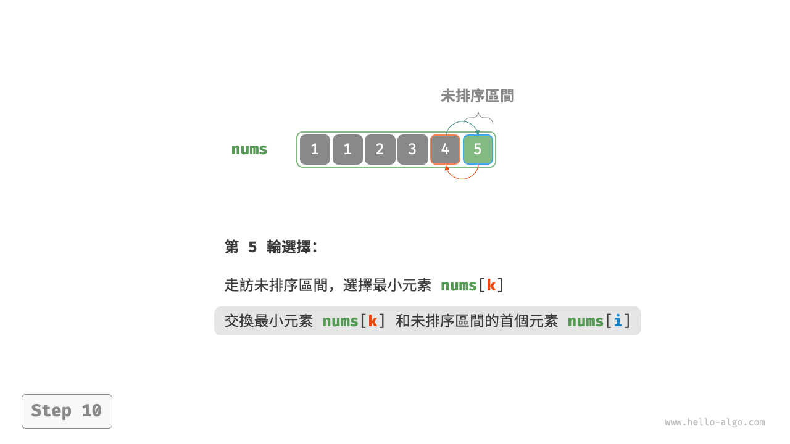
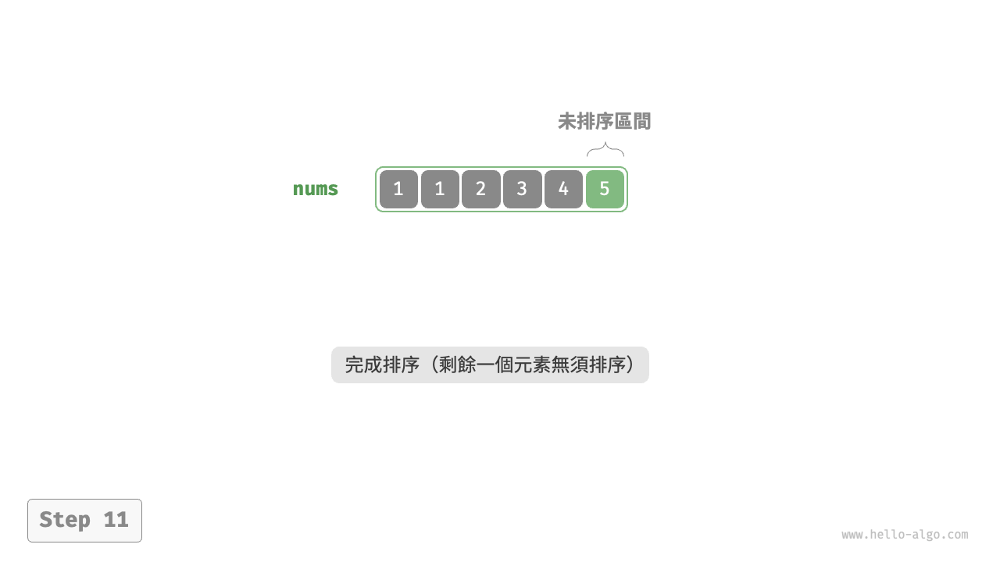
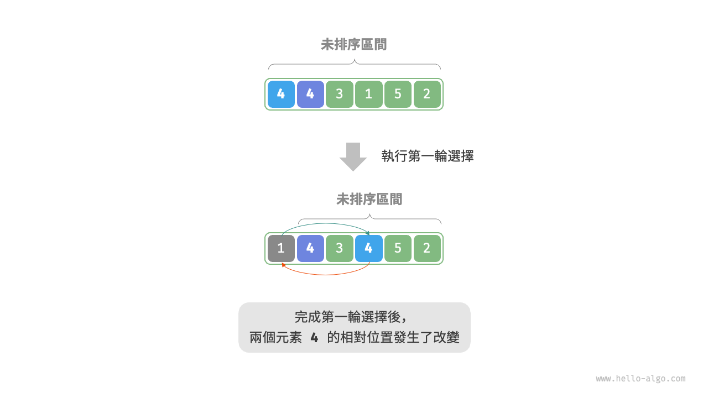

# 11.2 &nbsp; 選擇排序

<u>選擇排序（selection sort）</u>的工作原理非常簡單：開啟一個迴圈，每輪從未排序區間選擇最小的元素，將其放到已排序區間的末尾。

設陣列的長度為 $n$ ，選擇排序的演算法流程如圖 11-2 所示。

1. 初始狀態下，所有元素未排序，即未排序（索引）區間為 $[0, n-1]$ 。
2. 選取區間 $[0, n-1]$ 中的最小元素，將其與索引 $0$ 處的元素交換。完成後，陣列前 1 個元素已排序。
3. 選取區間 $[1, n-1]$ 中的最小元素，將其與索引 $1$ 處的元素交換。完成後，陣列前 2 個元素已排序。
4. 以此類推。經過 $n - 1$ 輪選擇與交換後，陣列前 $n - 1$ 個元素已排序。
5. 僅剩的一個元素必定是最大元素，無須排序，因此陣列排序完成。

=== "<1>"
    { class="animation-figure" }

=== "<2>"
    { class="animation-figure" }

=== "<3>"
    { class="animation-figure" }

=== "<4>"
    { class="animation-figure" }

=== "<5>"
    { class="animation-figure" }

=== "<6>"
    { class="animation-figure" }

=== "<7>"
    { class="animation-figure" }

=== "<8>"
    { class="animation-figure" }

=== "<9>"
    { class="animation-figure" }

=== "<10>"
    { class="animation-figure" }

=== "<11>"
    { class="animation-figure" }

<p align="center"> 圖 11-2 &nbsp; 選擇排序步驟 </p>

在程式碼中，我們用 $k$ 來記錄未排序區間內的最小元素：

=== "Python"

    ```python title="selection_sort.py"
    def selection_sort(nums: list[int]):
        """選擇排序"""
        n = len(nums)
        # 外迴圈：未排序區間為 [i, n-1]
        for i in range(n - 1):
            # 內迴圈：找到未排序區間內的最小元素
            k = i
            for j in range(i + 1, n):
                if nums[j] < nums[k]:
                    k = j  # 記錄最小元素的索引
            # 將該最小元素與未排序區間的首個元素交換
            nums[i], nums[k] = nums[k], nums[i]
    ```

=== "C++"

    ```cpp title="selection_sort.cpp"
    /* 選擇排序 */
    void selectionSort(vector<int> &nums) {
        int n = nums.size();
        // 外迴圈：未排序區間為 [i, n-1]
        for (int i = 0; i < n - 1; i++) {
            // 內迴圈：找到未排序區間內的最小元素
            int k = i;
            for (int j = i + 1; j < n; j++) {
                if (nums[j] < nums[k])
                    k = j; // 記錄最小元素的索引
            }
            // 將該最小元素與未排序區間的首個元素交換
            swap(nums[i], nums[k]);
        }
    }
    ```

=== "Java"

    ```java title="selection_sort.java"
    /* 選擇排序 */
    void selectionSort(int[] nums) {
        int n = nums.length;
        // 外迴圈：未排序區間為 [i, n-1]
        for (int i = 0; i < n - 1; i++) {
            // 內迴圈：找到未排序區間內的最小元素
            int k = i;
            for (int j = i + 1; j < n; j++) {
                if (nums[j] < nums[k])
                    k = j; // 記錄最小元素的索引
            }
            // 將該最小元素與未排序區間的首個元素交換
            int temp = nums[i];
            nums[i] = nums[k];
            nums[k] = temp;
        }
    }
    ```

=== "C#"

    ```csharp title="selection_sort.cs"
    /* 選擇排序 */
    void SelectionSort(int[] nums) {
        int n = nums.Length;
        // 外迴圈：未排序區間為 [i, n-1]
        for (int i = 0; i < n - 1; i++) {
            // 內迴圈：找到未排序區間內的最小元素
            int k = i;
            for (int j = i + 1; j < n; j++) {
                if (nums[j] < nums[k])
                    k = j; // 記錄最小元素的索引
            }
            // 將該最小元素與未排序區間的首個元素交換
            (nums[k], nums[i]) = (nums[i], nums[k]);
        }
    }
    ```

=== "Go"

    ```go title="selection_sort.go"
    /* 選擇排序 */
    func selectionSort(nums []int) {
        n := len(nums)
        // 外迴圈：未排序區間為 [i, n-1]
        for i := 0; i < n-1; i++ {
            // 內迴圈：找到未排序區間內的最小元素
            k := i
            for j := i + 1; j < n; j++ {
                if nums[j] < nums[k] {
                    // 記錄最小元素的索引
                    k = j
                }
            }
            // 將該最小元素與未排序區間的首個元素交換
            nums[i], nums[k] = nums[k], nums[i]

        }
    }
    ```

=== "Swift"

    ```swift title="selection_sort.swift"
    /* 選擇排序 */
    func selectionSort(nums: inout [Int]) {
        // 外迴圈：未排序區間為 [i, n-1]
        for i in nums.indices.dropLast() {
            // 內迴圈：找到未排序區間內的最小元素
            var k = i
            for j in nums.indices.dropFirst(i + 1) {
                if nums[j] < nums[k] {
                    k = j // 記錄最小元素的索引
                }
            }
            // 將該最小元素與未排序區間的首個元素交換
            nums.swapAt(i, k)
        }
    }
    ```

=== "JS"

    ```javascript title="selection_sort.js"
    /* 選擇排序 */
    function selectionSort(nums) {
        let n = nums.length;
        // 外迴圈：未排序區間為 [i, n-1]
        for (let i = 0; i < n - 1; i++) {
            // 內迴圈：找到未排序區間內的最小元素
            let k = i;
            for (let j = i + 1; j < n; j++) {
                if (nums[j] < nums[k]) {
                    k = j; // 記錄最小元素的索引
                }
            }
            // 將該最小元素與未排序區間的首個元素交換
            [nums[i], nums[k]] = [nums[k], nums[i]];
        }
    }
    ```

=== "TS"

    ```typescript title="selection_sort.ts"
    /* 選擇排序 */
    function selectionSort(nums: number[]): void {
        let n = nums.length;
        // 外迴圈：未排序區間為 [i, n-1]
        for (let i = 0; i < n - 1; i++) {
            // 內迴圈：找到未排序區間內的最小元素
            let k = i;
            for (let j = i + 1; j < n; j++) {
                if (nums[j] < nums[k]) {
                    k = j; // 記錄最小元素的索引
                }
            }
            // 將該最小元素與未排序區間的首個元素交換
            [nums[i], nums[k]] = [nums[k], nums[i]];
        }
    }
    ```

=== "Dart"

    ```dart title="selection_sort.dart"
    /* 選擇排序 */
    void selectionSort(List<int> nums) {
      int n = nums.length;
      // 外迴圈：未排序區間為 [i, n-1]
      for (int i = 0; i < n - 1; i++) {
        // 內迴圈：找到未排序區間內的最小元素
        int k = i;
        for (int j = i + 1; j < n; j++) {
          if (nums[j] < nums[k]) k = j; // 記錄最小元素的索引
        }
        // 將該最小元素與未排序區間的首個元素交換
        int temp = nums[i];
        nums[i] = nums[k];
        nums[k] = temp;
      }
    }
    ```

=== "Rust"

    ```rust title="selection_sort.rs"
    /* 選擇排序 */
    fn selection_sort(nums: &mut [i32]) {
        if nums.is_empty() {
            return;
        }
        let n = nums.len();
        // 外迴圈：未排序區間為 [i, n-1]
        for i in 0..n - 1 {
            // 內迴圈：找到未排序區間內的最小元素
            let mut k = i;
            for j in i + 1..n {
                if nums[j] < nums[k] {
                    k = j; // 記錄最小元素的索引
                }
            }
            // 將該最小元素與未排序區間的首個元素交換
            nums.swap(i, k);
        }
    }
    ```

=== "C"

    ```c title="selection_sort.c"
    /* 選擇排序 */
    void selectionSort(int nums[], int n) {
        // 外迴圈：未排序區間為 [i, n-1]
        for (int i = 0; i < n - 1; i++) {
            // 內迴圈：找到未排序區間內的最小元素
            int k = i;
            for (int j = i + 1; j < n; j++) {
                if (nums[j] < nums[k])
                    k = j; // 記錄最小元素的索引
            }
            // 將該最小元素與未排序區間的首個元素交換
            int temp = nums[i];
            nums[i] = nums[k];
            nums[k] = temp;
        }
    }
    ```

=== "Kotlin"

    ```kotlin title="selection_sort.kt"
    /* 選擇排序 */
    fun selectionSort(nums: IntArray) {
        val n = nums.size
        // 外迴圈：未排序區間為 [i, n-1]
        for (i in 0..<n - 1) {
            var k = i
            // 內迴圈：找到未排序區間內的最小元素
            for (j in i + 1..<n) {
                if (nums[j] < nums[k])
                    k = j // 記錄最小元素的索引
            }
            // 將該最小元素與未排序區間的首個元素交換
            val temp = nums[i]
            nums[i] = nums[k]
            nums[k] = temp
        }
    }
    ```

=== "Ruby"

    ```ruby title="selection_sort.rb"
    [class]{}-[func]{selection_sort}
    ```

=== "Zig"

    ```zig title="selection_sort.zig"
    [class]{}-[func]{selectionSort}
    ```

??? pythontutor "視覺化執行"

    <div style="height: 531px; width: 100%;"><iframe class="pythontutor-iframe" src="https://pythontutor.com/iframe-embed.html#code=def%20selection_sort%28nums%3A%20list%5Bint%5D%29%3A%0A%20%20%20%20%22%22%22%E9%81%B8%E6%93%87%E6%8E%92%E5%BA%8F%22%22%22%0A%20%20%20%20n%20%3D%20len%28nums%29%0A%20%20%20%20%23%20%E5%A4%96%E8%BF%B4%E5%9C%88%EF%BC%9A%E6%9C%AA%E6%8E%92%E5%BA%8F%E5%8D%80%E9%96%93%E7%82%BA%20%5Bi%2C%20n-1%5D%0A%20%20%20%20for%20i%20in%20range%28n%20-%201%29%3A%0A%20%20%20%20%20%20%20%20%23%20%E5%85%A7%E8%BF%B4%E5%9C%88%EF%BC%9A%E6%89%BE%E5%88%B0%E6%9C%AA%E6%8E%92%E5%BA%8F%E5%8D%80%E9%96%93%E5%85%A7%E7%9A%84%E6%9C%80%E5%B0%8F%E5%85%83%E7%B4%A0%0A%20%20%20%20%20%20%20%20k%20%3D%20i%0A%20%20%20%20%20%20%20%20for%20j%20in%20range%28i%20%2B%201%2C%20n%29%3A%0A%20%20%20%20%20%20%20%20%20%20%20%20if%20nums%5Bj%5D%20%3C%20nums%5Bk%5D%3A%0A%20%20%20%20%20%20%20%20%20%20%20%20%20%20%20%20k%20%3D%20j%20%20%23%20%E8%A8%98%E9%8C%84%E6%9C%80%E5%B0%8F%E5%85%83%E7%B4%A0%E7%9A%84%E7%B4%A2%E5%BC%95%0A%20%20%20%20%20%20%20%20%23%20%E5%B0%87%E8%A9%B2%E6%9C%80%E5%B0%8F%E5%85%83%E7%B4%A0%E8%88%87%E6%9C%AA%E6%8E%92%E5%BA%8F%E5%8D%80%E9%96%93%E7%9A%84%E9%A6%96%E5%80%8B%E5%85%83%E7%B4%A0%E4%BA%A4%E6%8F%9B%0A%20%20%20%20%20%20%20%20nums%5Bi%5D%2C%20nums%5Bk%5D%20%3D%20nums%5Bk%5D%2C%20nums%5Bi%5D%0A%0A%0A%22%22%22Driver%20Code%22%22%22%0Aif%20__name__%20%3D%3D%20%22__main__%22%3A%0A%20%20%20%20nums%20%3D%20%5B4%2C%201%2C%203%2C%201%2C%205%2C%202%5D%0A%20%20%20%20selection_sort%28nums%29%0A%20%20%20%20print%28%22%E9%81%B8%E6%93%87%E6%8E%92%E5%BA%8F%E5%AE%8C%E6%88%90%E5%BE%8C%20nums%20%3D%22%2C%20nums%29&codeDivHeight=472&codeDivWidth=350&cumulative=false&curInstr=4&heapPrimitives=nevernest&origin=opt-frontend.js&py=311&rawInputLstJSON=%5B%5D&textReferences=false"> </iframe></div>
    <div style="margin-top: 5px;"><a href="https://pythontutor.com/iframe-embed.html#code=def%20selection_sort%28nums%3A%20list%5Bint%5D%29%3A%0A%20%20%20%20%22%22%22%E9%81%B8%E6%93%87%E6%8E%92%E5%BA%8F%22%22%22%0A%20%20%20%20n%20%3D%20len%28nums%29%0A%20%20%20%20%23%20%E5%A4%96%E8%BF%B4%E5%9C%88%EF%BC%9A%E6%9C%AA%E6%8E%92%E5%BA%8F%E5%8D%80%E9%96%93%E7%82%BA%20%5Bi%2C%20n-1%5D%0A%20%20%20%20for%20i%20in%20range%28n%20-%201%29%3A%0A%20%20%20%20%20%20%20%20%23%20%E5%85%A7%E8%BF%B4%E5%9C%88%EF%BC%9A%E6%89%BE%E5%88%B0%E6%9C%AA%E6%8E%92%E5%BA%8F%E5%8D%80%E9%96%93%E5%85%A7%E7%9A%84%E6%9C%80%E5%B0%8F%E5%85%83%E7%B4%A0%0A%20%20%20%20%20%20%20%20k%20%3D%20i%0A%20%20%20%20%20%20%20%20for%20j%20in%20range%28i%20%2B%201%2C%20n%29%3A%0A%20%20%20%20%20%20%20%20%20%20%20%20if%20nums%5Bj%5D%20%3C%20nums%5Bk%5D%3A%0A%20%20%20%20%20%20%20%20%20%20%20%20%20%20%20%20k%20%3D%20j%20%20%23%20%E8%A8%98%E9%8C%84%E6%9C%80%E5%B0%8F%E5%85%83%E7%B4%A0%E7%9A%84%E7%B4%A2%E5%BC%95%0A%20%20%20%20%20%20%20%20%23%20%E5%B0%87%E8%A9%B2%E6%9C%80%E5%B0%8F%E5%85%83%E7%B4%A0%E8%88%87%E6%9C%AA%E6%8E%92%E5%BA%8F%E5%8D%80%E9%96%93%E7%9A%84%E9%A6%96%E5%80%8B%E5%85%83%E7%B4%A0%E4%BA%A4%E6%8F%9B%0A%20%20%20%20%20%20%20%20nums%5Bi%5D%2C%20nums%5Bk%5D%20%3D%20nums%5Bk%5D%2C%20nums%5Bi%5D%0A%0A%0A%22%22%22Driver%20Code%22%22%22%0Aif%20__name__%20%3D%3D%20%22__main__%22%3A%0A%20%20%20%20nums%20%3D%20%5B4%2C%201%2C%203%2C%201%2C%205%2C%202%5D%0A%20%20%20%20selection_sort%28nums%29%0A%20%20%20%20print%28%22%E9%81%B8%E6%93%87%E6%8E%92%E5%BA%8F%E5%AE%8C%E6%88%90%E5%BE%8C%20nums%20%3D%22%2C%20nums%29&codeDivHeight=800&codeDivWidth=600&cumulative=false&curInstr=4&heapPrimitives=nevernest&origin=opt-frontend.js&py=311&rawInputLstJSON=%5B%5D&textReferences=false" target="_blank" rel="noopener noreferrer">全螢幕觀看 ></a></div>

## 11.2.1 &nbsp; 演算法特性

- **時間複雜度為 $O(n^2)$、非自適應排序**：外迴圈共 $n - 1$ 輪，第一輪的未排序區間長度為 $n$ ，最後一輪的未排序區間長度為 $2$ ，即各輪外迴圈分別包含 $n$、$n - 1$、$\dots$、$3$、$2$ 輪內迴圈，求和為 $\frac{(n - 1)(n + 2)}{2}$ 。
- **空間複雜度為 $O(1)$、原地排序**：指標 $i$ 和 $j$ 使用常數大小的額外空間。
- **非穩定排序**：如圖 11-3 所示，元素 `nums[i]` 有可能被交換至與其相等的元素的右邊，導致兩者的相對順序發生改變。

{ class="animation-figure" }

<p align="center"> 圖 11-3 &nbsp; 選擇排序非穩定示例 </p>
