# 5.3 &nbsp; 雙向佇列

在佇列中，我們僅能刪除頭部元素或在尾部新增元素。如圖 5-7 所示，<u>雙向佇列（double-ended queue）</u>提供了更高的靈活性，允許在頭部和尾部執行元素的新增或刪除操作。

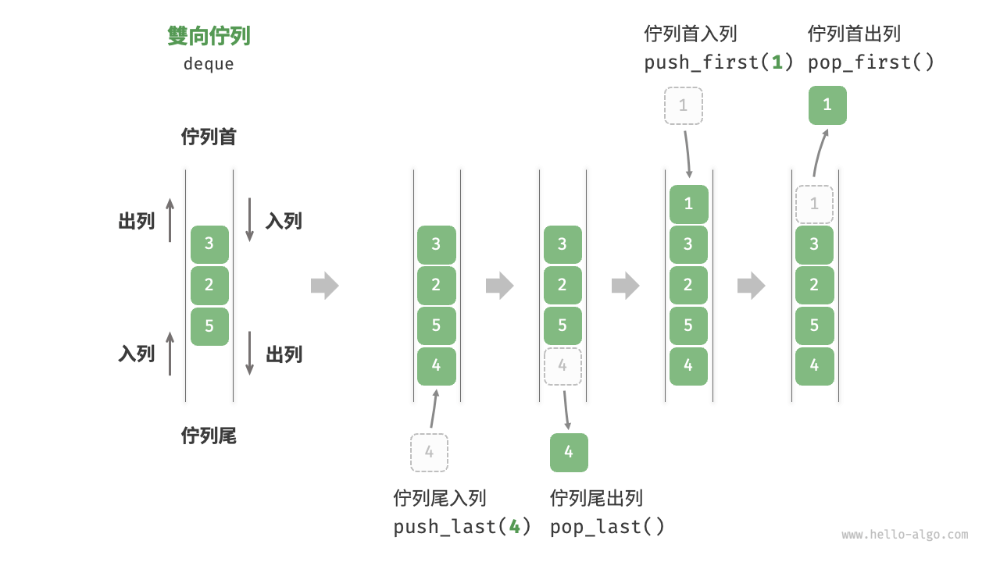{ class="animation-figure" }

<p align="center"> 圖 5-7 &nbsp; 雙向佇列的操作 </p>

## 5.3.1 &nbsp; 雙向佇列常用操作

雙向佇列的常用操作如表 5-3 所示，具體的方法名稱需要根據所使用的程式語言來確定。

<p align="center"> 表 5-3 &nbsp; 雙向佇列操作效率 </p>

<div class="center-table" markdown>

| 方法名         | 描述             | 時間複雜度 |
| -------------- | ---------------- | ---------- |
| `push_first()` | 將元素新增至佇列首 | $O(1)$     |
| `push_last()`  | 將元素新增至佇列尾 | $O(1)$     |
| `pop_first()`  | 刪除佇列首元素     | $O(1)$     |
| `pop_last()`   | 刪除佇列尾元素     | $O(1)$     |
| `peek_first()` | 訪問佇列首元素     | $O(1)$     |
| `peek_last()`  | 訪問佇列尾元素     | $O(1)$     |

</div>

同樣地，我們可以直接使用程式語言中已實現的雙向佇列類別：

=== "Python"

    ```python title="deque.py"
    from collections import deque

    # 初始化雙向佇列
    deq: deque[int] = deque()

    # 元素入列
    deq.append(2)      # 新增至佇列尾
    deq.append(5)
    deq.append(4)
    deq.appendleft(3)  # 新增至佇列首
    deq.appendleft(1)

    # 訪問元素
    front: int = deq[0]  # 佇列首元素
    rear: int = deq[-1]  # 佇列尾元素

    # 元素出列
    pop_front: int = deq.popleft()  # 佇列首元素出列
    pop_rear: int = deq.pop()       # 佇列尾元素出列

    # 獲取雙向佇列的長度
    size: int = len(deq)

    # 判斷雙向佇列是否為空
    is_empty: bool = len(deq) == 0
    ```

=== "C++"

    ```cpp title="deque.cpp"
    /* 初始化雙向佇列 */
    deque<int> deque;

    /* 元素入列 */
    deque.push_back(2);   // 新增至佇列尾
    deque.push_back(5);
    deque.push_back(4);
    deque.push_front(3);  // 新增至佇列首
    deque.push_front(1);

    /* 訪問元素 */
    int front = deque.front(); // 佇列首元素
    int back = deque.back();   // 佇列尾元素

    /* 元素出列 */
    deque.pop_front();  // 佇列首元素出列
    deque.pop_back();   // 佇列尾元素出列

    /* 獲取雙向佇列的長度 */
    int size = deque.size();

    /* 判斷雙向佇列是否為空 */
    bool empty = deque.empty();
    ```

=== "Java"

    ```java title="deque.java"
    /* 初始化雙向佇列 */
    Deque<Integer> deque = new LinkedList<>();

    /* 元素入列 */
    deque.offerLast(2);   // 新增至佇列尾
    deque.offerLast(5);
    deque.offerLast(4);
    deque.offerFirst(3);  // 新增至佇列首
    deque.offerFirst(1);

    /* 訪問元素 */
    int peekFirst = deque.peekFirst();  // 佇列首元素
    int peekLast = deque.peekLast();    // 佇列尾元素

    /* 元素出列 */
    int popFirst = deque.pollFirst();  // 佇列首元素出列
    int popLast = deque.pollLast();    // 佇列尾元素出列

    /* 獲取雙向佇列的長度 */
    int size = deque.size();

    /* 判斷雙向佇列是否為空 */
    boolean isEmpty = deque.isEmpty();
    ```

=== "C#"

    ```csharp title="deque.cs"
    /* 初始化雙向佇列 */
    // 在 C# 中，將鏈結串列 LinkedList 看作雙向佇列來使用
    LinkedList<int> deque = new();

    /* 元素入列 */
    deque.AddLast(2);   // 新增至佇列尾
    deque.AddLast(5);
    deque.AddLast(4);
    deque.AddFirst(3);  // 新增至佇列首
    deque.AddFirst(1);

    /* 訪問元素 */
    int peekFirst = deque.First.Value;  // 佇列首元素
    int peekLast = deque.Last.Value;    // 佇列尾元素

    /* 元素出列 */
    deque.RemoveFirst();  // 佇列首元素出列
    deque.RemoveLast();   // 佇列尾元素出列

    /* 獲取雙向佇列的長度 */
    int size = deque.Count;

    /* 判斷雙向佇列是否為空 */
    bool isEmpty = deque.Count == 0;
    ```

=== "Go"

    ```go title="deque_test.go"
    /* 初始化雙向佇列 */
    // 在 Go 中，將 list 作為雙向佇列使用
    deque := list.New()

    /* 元素入列 */
    deque.PushBack(2)      // 新增至佇列尾
    deque.PushBack(5)
    deque.PushBack(4)
    deque.PushFront(3)     // 新增至佇列首
    deque.PushFront(1)

    /* 訪問元素 */
    front := deque.Front() // 佇列首元素
    rear := deque.Back()   // 佇列尾元素

    /* 元素出列 */
    deque.Remove(front)    // 佇列首元素出列
    deque.Remove(rear)     // 佇列尾元素出列

    /* 獲取雙向佇列的長度 */
    size := deque.Len()

    /* 判斷雙向佇列是否為空 */
    isEmpty := deque.Len() == 0
    ```

=== "Swift"

    ```swift title="deque.swift"
    /* 初始化雙向佇列 */
    // Swift 沒有內建的雙向佇列類別，可以把 Array 當作雙向佇列來使用
    var deque: [Int] = []

    /* 元素入列 */
    deque.append(2) // 新增至佇列尾
    deque.append(5)
    deque.append(4)
    deque.insert(3, at: 0) // 新增至佇列首
    deque.insert(1, at: 0)

    /* 訪問元素 */
    let peekFirst = deque.first! // 佇列首元素
    let peekLast = deque.last! // 佇列尾元素

    /* 元素出列 */
    // 使用 Array 模擬時 popFirst 的複雜度為 O(n)
    let popFirst = deque.removeFirst() // 佇列首元素出列
    let popLast = deque.removeLast() // 佇列尾元素出列

    /* 獲取雙向佇列的長度 */
    let size = deque.count

    /* 判斷雙向佇列是否為空 */
    let isEmpty = deque.isEmpty
    ```

=== "JS"

    ```javascript title="deque.js"
    /* 初始化雙向佇列 */
    // JavaScript 沒有內建的雙端佇列，只能把 Array 當作雙端佇列來使用
    const deque = [];

    /* 元素入列 */
    deque.push(2);
    deque.push(5);
    deque.push(4);
    // 請注意，由於是陣列，unshift() 方法的時間複雜度為 O(n)
    deque.unshift(3);
    deque.unshift(1);

    /* 訪問元素 */
    const peekFirst = deque[0];
    const peekLast = deque[deque.length - 1];

    /* 元素出列 */
    // 請注意，由於是陣列，shift() 方法的時間複雜度為 O(n)
    const popFront = deque.shift();
    const popBack = deque.pop();

    /* 獲取雙向佇列的長度 */
    const size = deque.length;

    /* 判斷雙向佇列是否為空 */
    const isEmpty = size === 0;
    ```

=== "TS"

    ```typescript title="deque.ts"
    /* 初始化雙向佇列 */
    // TypeScript 沒有內建的雙端佇列，只能把 Array 當作雙端佇列來使用
    const deque: number[] = [];

    /* 元素入列 */
    deque.push(2);
    deque.push(5);
    deque.push(4);
    // 請注意，由於是陣列，unshift() 方法的時間複雜度為 O(n)
    deque.unshift(3);
    deque.unshift(1);

    /* 訪問元素 */
    const peekFirst: number = deque[0];
    const peekLast: number = deque[deque.length - 1];

    /* 元素出列 */
    // 請注意，由於是陣列，shift() 方法的時間複雜度為 O(n)
    const popFront: number = deque.shift() as number;
    const popBack: number = deque.pop() as number;

    /* 獲取雙向佇列的長度 */
    const size: number = deque.length;

    /* 判斷雙向佇列是否為空 */
    const isEmpty: boolean = size === 0;
    ```

=== "Dart"

    ```dart title="deque.dart"
    /* 初始化雙向佇列 */
    // 在 Dart 中，Queue 被定義為雙向佇列
    Queue<int> deque = Queue<int>();

    /* 元素入列 */
    deque.addLast(2);  // 新增至佇列尾
    deque.addLast(5);
    deque.addLast(4);
    deque.addFirst(3); // 新增至佇列首
    deque.addFirst(1);

    /* 訪問元素 */
    int peekFirst = deque.first; // 佇列首元素
    int peekLast = deque.last;   // 佇列尾元素

    /* 元素出列 */
    int popFirst = deque.removeFirst(); // 佇列首元素出列
    int popLast = deque.removeLast();   // 佇列尾元素出列

    /* 獲取雙向佇列的長度 */
    int size = deque.length;

    /* 判斷雙向佇列是否為空 */
    bool isEmpty = deque.isEmpty;
    ```

=== "Rust"

    ```rust title="deque.rs"
    /* 初始化雙向佇列 */
    let mut deque: VecDeque<u32> = VecDeque::new();

    /* 元素入列 */
    deque.push_back(2);  // 新增至佇列尾
    deque.push_back(5);
    deque.push_back(4);
    deque.push_front(3); // 新增至佇列首
    deque.push_front(1);

    /* 訪問元素 */
    if let Some(front) = deque.front() { // 佇列首元素
    }
    if let Some(rear) = deque.back() {   // 佇列尾元素
    }

    /* 元素出列 */
    if let Some(pop_front) = deque.pop_front() { // 佇列首元素出列
    }
    if let Some(pop_rear) = deque.pop_back() {   // 佇列尾元素出列
    }

    /* 獲取雙向佇列的長度 */
    let size = deque.len();

    /* 判斷雙向佇列是否為空 */
    let is_empty = deque.is_empty();
    ```

=== "C"

    ```c title="deque.c"
    // C 未提供內建雙向佇列
    ```

=== "Kotlin"

    ```kotlin title="deque.kt"
    /* 初始化雙向佇列 */
    val deque = LinkedList<Int>()

    /* 元素入列 */
    deque.offerLast(2)  // 新增至佇列尾
    deque.offerLast(5)
    deque.offerLast(4)
    deque.offerFirst(3) // 新增至佇列首
    deque.offerFirst(1)

    /* 訪問元素 */
    val peekFirst = deque.peekFirst() // 佇列首元素
    val peekLast = deque.peekLast()   // 佇列尾元素

    /* 元素出列 */
    val popFirst = deque.pollFirst() // 佇列首元素出列
    val popLast = deque.pollLast()   // 佇列尾元素出列

    /* 獲取雙向佇列的長度 */
    val size = deque.size

    /* 判斷雙向佇列是否為空 */
    val isEmpty = deque.isEmpty()
    ```

=== "Ruby"

    ```ruby title="deque.rb"
    # 初始化雙向佇列
    # Ruby 沒有內直的雙端佇列，只能把 Array 當作雙端佇列來使用
    deque = []

    # 元素如隊
    deque << 2
    deque << 5
    deque << 4
    # 請注意，由於是陣列，Array#unshift 方法的時間複雜度為 O(n)
    deque.unshift(3)
    deque.unshift(1)

    # 訪問元素
    peek_first = deque.first
    peek_last = deque.last

    # 元素出列
    # 請注意，由於是陣列， Array#shift 方法的時間複雜度為 O(n)
    pop_front = deque.shift
    pop_back = deque.pop

    # 獲取雙向佇列的長度
    size = deque.length

    # 判斷雙向佇列是否為空
    is_empty = size.zero?
    ```

=== "Zig"

    ```zig title="deque.zig"

    ```

??? pythontutor "視覺化執行"

    <div style="height: 549px; width: 100%;"><iframe class="pythontutor-iframe" src="https://pythontutor.com/iframe-embed.html#code=from%20collections%20import%20deque%0A%0A%22%22%22Driver%20Code%22%22%22%0Aif%20__name__%20%3D%3D%20%22__main__%22%3A%0A%20%20%20%20%23%20%E5%88%9D%E5%A7%8B%E5%8C%96%E9%9B%99%E5%90%91%E4%BD%87%E5%88%97%0A%20%20%20%20deq%20%3D%20deque%28%29%0A%0A%20%20%20%20%23%20%E5%85%83%E7%B4%A0%E5%85%A5%E5%88%97%0A%20%20%20%20deq.append%282%29%20%20%23%20%E6%96%B0%E5%A2%9E%E8%87%B3%E4%BD%87%E5%88%97%E5%B0%BE%0A%20%20%20%20deq.append%285%29%0A%20%20%20%20deq.append%284%29%0A%20%20%20%20deq.appendleft%283%29%20%20%23%20%E6%96%B0%E5%A2%9E%E8%87%B3%E4%BD%87%E5%88%97%E9%A6%96%0A%20%20%20%20deq.appendleft%281%29%0A%20%20%20%20print%28%22%E9%9B%99%E5%90%91%E4%BD%87%E5%88%97%20deque%20%3D%22%2C%20deq%29%0A%0A%20%20%20%20%23%20%E8%A8%AA%E5%95%8F%E5%85%83%E7%B4%A0%0A%20%20%20%20front%20%3D%20deq%5B0%5D%20%20%23%20%E4%BD%87%E5%88%97%E9%A6%96%E5%85%83%E7%B4%A0%0A%20%20%20%20print%28%22%E4%BD%87%E5%88%97%E9%A6%96%E5%85%83%E7%B4%A0%20front%20%3D%22%2C%20front%29%0A%20%20%20%20rear%20%3D%20deq%5B-1%5D%20%20%23%20%E4%BD%87%E5%88%97%E5%B0%BE%E5%85%83%E7%B4%A0%0A%20%20%20%20print%28%22%E4%BD%87%E5%88%97%E5%B0%BE%E5%85%83%E7%B4%A0%20rear%20%3D%22%2C%20rear%29%0A%0A%20%20%20%20%23%20%E5%85%83%E7%B4%A0%E5%87%BA%E5%88%97%0A%20%20%20%20pop_front%20%3D%20deq.popleft%28%29%20%20%23%20%E4%BD%87%E5%88%97%E9%A6%96%E5%85%83%E7%B4%A0%E5%87%BA%E5%88%97%0A%20%20%20%20print%28%22%E4%BD%87%E5%88%97%E9%A6%96%E5%87%BA%E5%88%97%E5%85%83%E7%B4%A0%20%20pop_front%20%3D%22%2C%20pop_front%29%0A%20%20%20%20print%28%22%E4%BD%87%E5%88%97%E9%A6%96%E5%87%BA%E5%88%97%E5%BE%8C%20deque%20%3D%22%2C%20deq%29%0A%20%20%20%20pop_rear%20%3D%20deq.pop%28%29%20%20%23%20%E4%BD%87%E5%88%97%E5%B0%BE%E5%85%83%E7%B4%A0%E5%87%BA%E5%88%97%0A%20%20%20%20print%28%22%E4%BD%87%E5%88%97%E5%B0%BE%E5%87%BA%E5%88%97%E5%85%83%E7%B4%A0%20%20pop_rear%20%3D%22%2C%20pop_rear%29%0A%20%20%20%20print%28%22%E4%BD%87%E5%88%97%E5%B0%BE%E5%87%BA%E5%88%97%E5%BE%8C%20deque%20%3D%22%2C%20deq%29%0A%0A%20%20%20%20%23%20%E7%8D%B2%E5%8F%96%E9%9B%99%E5%90%91%E4%BD%87%E5%88%97%E7%9A%84%E9%95%B7%E5%BA%A6%0A%20%20%20%20size%20%3D%20len%28deq%29%0A%20%20%20%20print%28%22%E9%9B%99%E5%90%91%E4%BD%87%E5%88%97%E9%95%B7%E5%BA%A6%20size%20%3D%22%2C%20size%29%0A%0A%20%20%20%20%23%20%E5%88%A4%E6%96%B7%E9%9B%99%E5%90%91%E4%BD%87%E5%88%97%E6%98%AF%E5%90%A6%E7%82%BA%E7%A9%BA%0A%20%20%20%20is_empty%20%3D%20len%28deq%29%20%3D%3D%200%0A%20%20%20%20print%28%22%E9%9B%99%E5%90%91%E4%BD%87%E5%88%97%E6%98%AF%E5%90%A6%E7%82%BA%E7%A9%BA%20%3D%22%2C%20is_empty%29&codeDivHeight=472&codeDivWidth=350&cumulative=false&curInstr=3&heapPrimitives=nevernest&origin=opt-frontend.js&py=311&rawInputLstJSON=%5B%5D&textReferences=false"> </iframe></div>
    <div style="margin-top: 5px;"><a href="https://pythontutor.com/iframe-embed.html#code=from%20collections%20import%20deque%0A%0A%22%22%22Driver%20Code%22%22%22%0Aif%20__name__%20%3D%3D%20%22__main__%22%3A%0A%20%20%20%20%23%20%E5%88%9D%E5%A7%8B%E5%8C%96%E9%9B%99%E5%90%91%E4%BD%87%E5%88%97%0A%20%20%20%20deq%20%3D%20deque%28%29%0A%0A%20%20%20%20%23%20%E5%85%83%E7%B4%A0%E5%85%A5%E5%88%97%0A%20%20%20%20deq.append%282%29%20%20%23%20%E6%96%B0%E5%A2%9E%E8%87%B3%E4%BD%87%E5%88%97%E5%B0%BE%0A%20%20%20%20deq.append%285%29%0A%20%20%20%20deq.append%284%29%0A%20%20%20%20deq.appendleft%283%29%20%20%23%20%E6%96%B0%E5%A2%9E%E8%87%B3%E4%BD%87%E5%88%97%E9%A6%96%0A%20%20%20%20deq.appendleft%281%29%0A%20%20%20%20print%28%22%E9%9B%99%E5%90%91%E4%BD%87%E5%88%97%20deque%20%3D%22%2C%20deq%29%0A%0A%20%20%20%20%23%20%E8%A8%AA%E5%95%8F%E5%85%83%E7%B4%A0%0A%20%20%20%20front%20%3D%20deq%5B0%5D%20%20%23%20%E4%BD%87%E5%88%97%E9%A6%96%E5%85%83%E7%B4%A0%0A%20%20%20%20print%28%22%E4%BD%87%E5%88%97%E9%A6%96%E5%85%83%E7%B4%A0%20front%20%3D%22%2C%20front%29%0A%20%20%20%20rear%20%3D%20deq%5B-1%5D%20%20%23%20%E4%BD%87%E5%88%97%E5%B0%BE%E5%85%83%E7%B4%A0%0A%20%20%20%20print%28%22%E4%BD%87%E5%88%97%E5%B0%BE%E5%85%83%E7%B4%A0%20rear%20%3D%22%2C%20rear%29%0A%0A%20%20%20%20%23%20%E5%85%83%E7%B4%A0%E5%87%BA%E5%88%97%0A%20%20%20%20pop_front%20%3D%20deq.popleft%28%29%20%20%23%20%E4%BD%87%E5%88%97%E9%A6%96%E5%85%83%E7%B4%A0%E5%87%BA%E5%88%97%0A%20%20%20%20print%28%22%E4%BD%87%E5%88%97%E9%A6%96%E5%87%BA%E5%88%97%E5%85%83%E7%B4%A0%20%20pop_front%20%3D%22%2C%20pop_front%29%0A%20%20%20%20print%28%22%E4%BD%87%E5%88%97%E9%A6%96%E5%87%BA%E5%88%97%E5%BE%8C%20deque%20%3D%22%2C%20deq%29%0A%20%20%20%20pop_rear%20%3D%20deq.pop%28%29%20%20%23%20%E4%BD%87%E5%88%97%E5%B0%BE%E5%85%83%E7%B4%A0%E5%87%BA%E5%88%97%0A%20%20%20%20print%28%22%E4%BD%87%E5%88%97%E5%B0%BE%E5%87%BA%E5%88%97%E5%85%83%E7%B4%A0%20%20pop_rear%20%3D%22%2C%20pop_rear%29%0A%20%20%20%20print%28%22%E4%BD%87%E5%88%97%E5%B0%BE%E5%87%BA%E5%88%97%E5%BE%8C%20deque%20%3D%22%2C%20deq%29%0A%0A%20%20%20%20%23%20%E7%8D%B2%E5%8F%96%E9%9B%99%E5%90%91%E4%BD%87%E5%88%97%E7%9A%84%E9%95%B7%E5%BA%A6%0A%20%20%20%20size%20%3D%20len%28deq%29%0A%20%20%20%20print%28%22%E9%9B%99%E5%90%91%E4%BD%87%E5%88%97%E9%95%B7%E5%BA%A6%20size%20%3D%22%2C%20size%29%0A%0A%20%20%20%20%23%20%E5%88%A4%E6%96%B7%E9%9B%99%E5%90%91%E4%BD%87%E5%88%97%E6%98%AF%E5%90%A6%E7%82%BA%E7%A9%BA%0A%20%20%20%20is_empty%20%3D%20len%28deq%29%20%3D%3D%200%0A%20%20%20%20print%28%22%E9%9B%99%E5%90%91%E4%BD%87%E5%88%97%E6%98%AF%E5%90%A6%E7%82%BA%E7%A9%BA%20%3D%22%2C%20is_empty%29&codeDivHeight=800&codeDivWidth=600&cumulative=false&curInstr=3&heapPrimitives=nevernest&origin=opt-frontend.js&py=311&rawInputLstJSON=%5B%5D&textReferences=false" target="_blank" rel="noopener noreferrer">全螢幕觀看 ></a></div>

## 5.3.2 &nbsp; 雙向佇列實現 *

雙向佇列的實現與佇列類似，可以選擇鏈結串列或陣列作為底層資料結構。

### 1. &nbsp; 基於雙向鏈結串列的實現

回顧上一節內容，我們使用普通單向鏈結串列來實現佇列，因為它可以方便地刪除頭節點（對應出列操作）和在尾節點後新增新節點（對應入列操作）。

對於雙向佇列而言，頭部和尾部都可以執行入列和出列操作。換句話說，雙向佇列需要實現另一個對稱方向的操作。為此，我們採用“雙向鏈結串列”作為雙向佇列的底層資料結構。

如圖 5-8 所示，我們將雙向鏈結串列的頭節點和尾節點視為雙向佇列的佇列首和佇列尾，同時實現在兩端新增和刪除節點的功能。

=== "LinkedListDeque"
    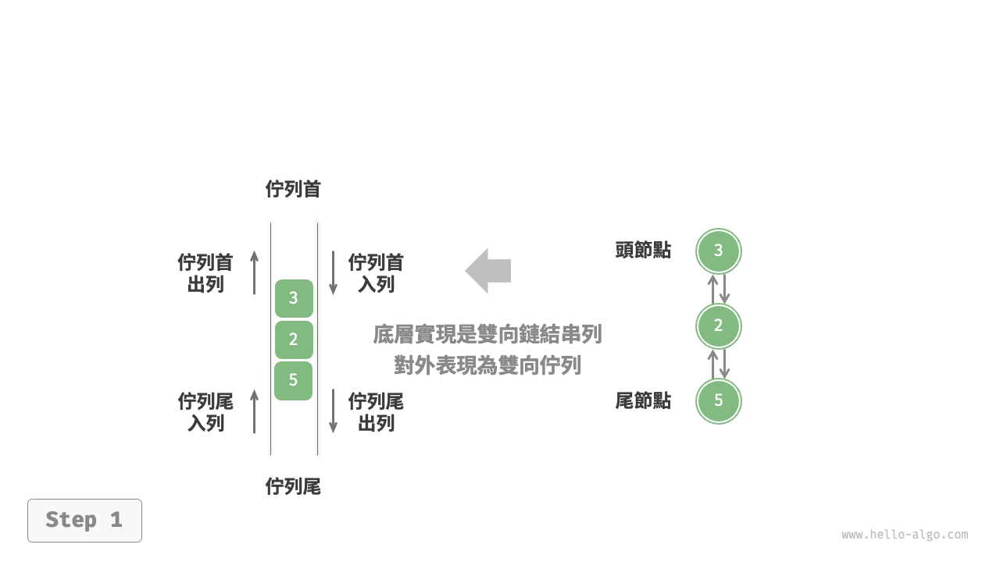{ class="animation-figure" }

=== "push_last()"
    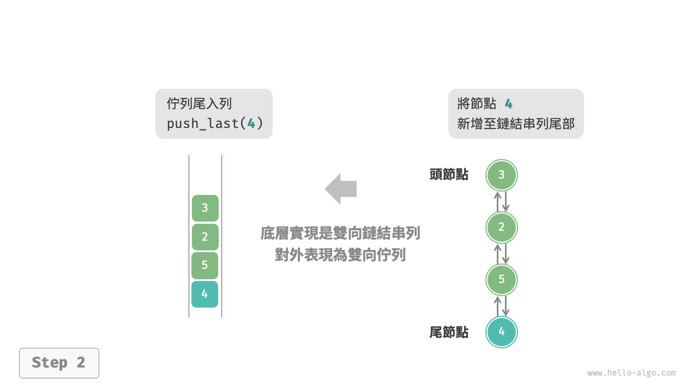{ class="animation-figure" }

=== "push_first()"
    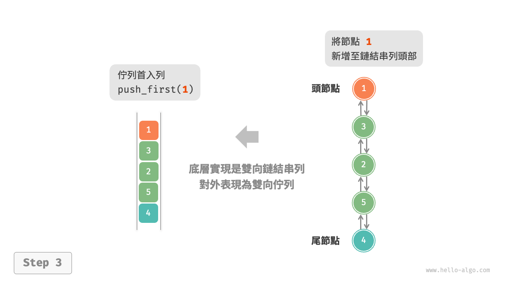{ class="animation-figure" }

=== "pop_last()"
    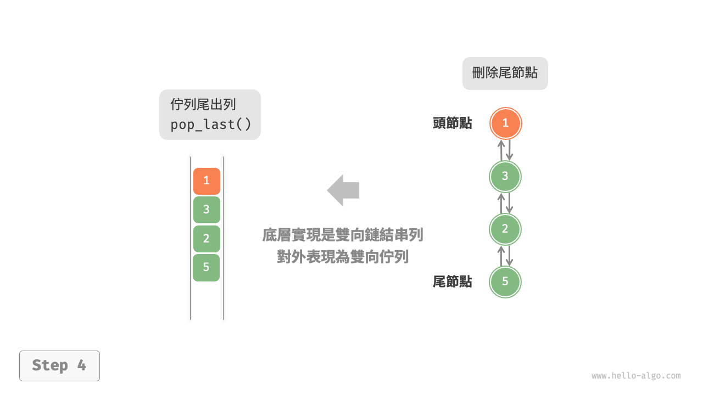{ class="animation-figure" }

=== "pop_first()"
    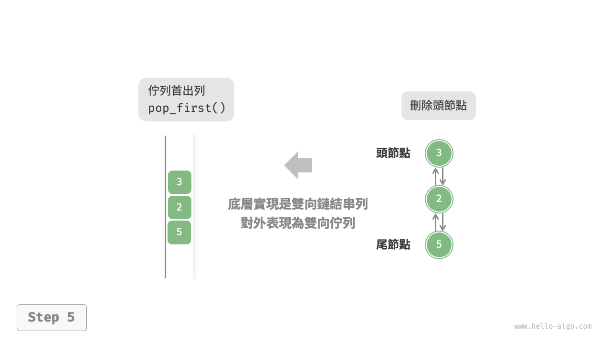{ class="animation-figure" }

<p align="center"> 圖 5-8 &nbsp; 基於鏈結串列實現雙向佇列的入列出列操作 </p>

實現程式碼如下所示：

=== "Python"

    ```python title="linkedlist_deque.py"
    class ListNode:
        """雙向鏈結串列節點"""

        def __init__(self, val: int):
            """建構子"""
            self.val: int = val
            self.next: ListNode | None = None  # 後繼節點引用
            self.prev: ListNode | None = None  # 前驅節點引用

    class LinkedListDeque:
        """基於雙向鏈結串列實現的雙向佇列"""

        def __init__(self):
            """建構子"""
            self._front: ListNode | None = None  # 頭節點 front
            self._rear: ListNode | None = None  # 尾節點 rear
            self._size: int = 0  # 雙向佇列的長度

        def size(self) -> int:
            """獲取雙向佇列的長度"""
            return self._size

        def is_empty(self) -> bool:
            """判斷雙向佇列是否為空"""
            return self._size == 0

        def push(self, num: int, is_front: bool):
            """入列操作"""
            node = ListNode(num)
            # 若鏈結串列為空，則令 front 和 rear 都指向 node
            if self.is_empty():
                self._front = self._rear = node
            # 佇列首入列操作
            elif is_front:
                # 將 node 新增至鏈結串列頭部
                self._front.prev = node
                node.next = self._front
                self._front = node  # 更新頭節點
            # 佇列尾入列操作
            else:
                # 將 node 新增至鏈結串列尾部
                self._rear.next = node
                node.prev = self._rear
                self._rear = node  # 更新尾節點
            self._size += 1  # 更新佇列長度

        def push_first(self, num: int):
            """佇列首入列"""
            self.push(num, True)

        def push_last(self, num: int):
            """佇列尾入列"""
            self.push(num, False)

        def pop(self, is_front: bool) -> int:
            """出列操作"""
            if self.is_empty():
                raise IndexError("雙向佇列為空")
            # 佇列首出列操作
            if is_front:
                val: int = self._front.val  # 暫存頭節點值
                # 刪除頭節點
                fnext: ListNode | None = self._front.next
                if fnext is not None:
                    fnext.prev = None
                    self._front.next = None
                self._front = fnext  # 更新頭節點
            # 佇列尾出列操作
            else:
                val: int = self._rear.val  # 暫存尾節點值
                # 刪除尾節點
                rprev: ListNode | None = self._rear.prev
                if rprev is not None:
                    rprev.next = None
                    self._rear.prev = None
                self._rear = rprev  # 更新尾節點
            self._size -= 1  # 更新佇列長度
            return val

        def pop_first(self) -> int:
            """佇列首出列"""
            return self.pop(True)

        def pop_last(self) -> int:
            """佇列尾出列"""
            return self.pop(False)

        def peek_first(self) -> int:
            """訪問佇列首元素"""
            if self.is_empty():
                raise IndexError("雙向佇列為空")
            return self._front.val

        def peek_last(self) -> int:
            """訪問佇列尾元素"""
            if self.is_empty():
                raise IndexError("雙向佇列為空")
            return self._rear.val

        def to_array(self) -> list[int]:
            """返回陣列用於列印"""
            node = self._front
            res = [0] * self.size()
            for i in range(self.size()):
                res[i] = node.val
                node = node.next
            return res
    ```

=== "C++"

    ```cpp title="linkedlist_deque.cpp"
    /* 雙向鏈結串列節點 */
    struct DoublyListNode {
        int val;              // 節點值
        DoublyListNode *next; // 後繼節點指標
        DoublyListNode *prev; // 前驅節點指標
        DoublyListNode(int val) : val(val), prev(nullptr), next(nullptr) {
        }
    };

    /* 基於雙向鏈結串列實現的雙向佇列 */
    class LinkedListDeque {
      private:
        DoublyListNode *front, *rear; // 頭節點 front ，尾節點 rear
        int queSize = 0;              // 雙向佇列的長度

      public:
        /* 建構子 */
        LinkedListDeque() : front(nullptr), rear(nullptr) {
        }

        /* 析構方法 */
        ~LinkedListDeque() {
            // 走訪鏈結串列刪除節點，釋放記憶體
            DoublyListNode *pre, *cur = front;
            while (cur != nullptr) {
                pre = cur;
                cur = cur->next;
                delete pre;
            }
        }

        /* 獲取雙向佇列的長度 */
        int size() {
            return queSize;
        }

        /* 判斷雙向佇列是否為空 */
        bool isEmpty() {
            return size() == 0;
        }

        /* 入列操作 */
        void push(int num, bool isFront) {
            DoublyListNode *node = new DoublyListNode(num);
            // 若鏈結串列為空，則令 front 和 rear 都指向 node
            if (isEmpty())
                front = rear = node;
            // 佇列首入列操作
            else if (isFront) {
                // 將 node 新增至鏈結串列頭部
                front->prev = node;
                node->next = front;
                front = node; // 更新頭節點
            // 佇列尾入列操作
            } else {
                // 將 node 新增至鏈結串列尾部
                rear->next = node;
                node->prev = rear;
                rear = node; // 更新尾節點
            }
            queSize++; // 更新佇列長度
        }

        /* 佇列首入列 */
        void pushFirst(int num) {
            push(num, true);
        }

        /* 佇列尾入列 */
        void pushLast(int num) {
            push(num, false);
        }

        /* 出列操作 */
        int pop(bool isFront) {
            if (isEmpty())
                throw out_of_range("佇列為空");
            int val;
            // 佇列首出列操作
            if (isFront) {
                val = front->val; // 暫存頭節點值
                // 刪除頭節點
                DoublyListNode *fNext = front->next;
                if (fNext != nullptr) {
                    fNext->prev = nullptr;
                    front->next = nullptr;
                }
                delete front;
                front = fNext; // 更新頭節點
            // 佇列尾出列操作
            } else {
                val = rear->val; // 暫存尾節點值
                // 刪除尾節點
                DoublyListNode *rPrev = rear->prev;
                if (rPrev != nullptr) {
                    rPrev->next = nullptr;
                    rear->prev = nullptr;
                }
                delete rear;
                rear = rPrev; // 更新尾節點
            }
            queSize--; // 更新佇列長度
            return val;
        }

        /* 佇列首出列 */
        int popFirst() {
            return pop(true);
        }

        /* 佇列尾出列 */
        int popLast() {
            return pop(false);
        }

        /* 訪問佇列首元素 */
        int peekFirst() {
            if (isEmpty())
                throw out_of_range("雙向佇列為空");
            return front->val;
        }

        /* 訪問佇列尾元素 */
        int peekLast() {
            if (isEmpty())
                throw out_of_range("雙向佇列為空");
            return rear->val;
        }

        /* 返回陣列用於列印 */
        vector<int> toVector() {
            DoublyListNode *node = front;
            vector<int> res(size());
            for (int i = 0; i < res.size(); i++) {
                res[i] = node->val;
                node = node->next;
            }
            return res;
        }
    };
    ```

=== "Java"

    ```java title="linkedlist_deque.java"
    /* 雙向鏈結串列節點 */
    class ListNode {
        int val; // 節點值
        ListNode next; // 後繼節點引用
        ListNode prev; // 前驅節點引用

        ListNode(int val) {
            this.val = val;
            prev = next = null;
        }
    }

    /* 基於雙向鏈結串列實現的雙向佇列 */
    class LinkedListDeque {
        private ListNode front, rear; // 頭節點 front ，尾節點 rear
        private int queSize = 0; // 雙向佇列的長度

        public LinkedListDeque() {
            front = rear = null;
        }

        /* 獲取雙向佇列的長度 */
        public int size() {
            return queSize;
        }

        /* 判斷雙向佇列是否為空 */
        public boolean isEmpty() {
            return size() == 0;
        }

        /* 入列操作 */
        private void push(int num, boolean isFront) {
            ListNode node = new ListNode(num);
            // 若鏈結串列為空，則令 front 和 rear 都指向 node
            if (isEmpty())
                front = rear = node;
            // 佇列首入列操作
            else if (isFront) {
                // 將 node 新增至鏈結串列頭部
                front.prev = node;
                node.next = front;
                front = node; // 更新頭節點
            // 佇列尾入列操作
            } else {
                // 將 node 新增至鏈結串列尾部
                rear.next = node;
                node.prev = rear;
                rear = node; // 更新尾節點
            }
            queSize++; // 更新佇列長度
        }

        /* 佇列首入列 */
        public void pushFirst(int num) {
            push(num, true);
        }

        /* 佇列尾入列 */
        public void pushLast(int num) {
            push(num, false);
        }

        /* 出列操作 */
        private int pop(boolean isFront) {
            if (isEmpty())
                throw new IndexOutOfBoundsException();
            int val;
            // 佇列首出列操作
            if (isFront) {
                val = front.val; // 暫存頭節點值
                // 刪除頭節點
                ListNode fNext = front.next;
                if (fNext != null) {
                    fNext.prev = null;
                    front.next = null;
                }
                front = fNext; // 更新頭節點
            // 佇列尾出列操作
            } else {
                val = rear.val; // 暫存尾節點值
                // 刪除尾節點
                ListNode rPrev = rear.prev;
                if (rPrev != null) {
                    rPrev.next = null;
                    rear.prev = null;
                }
                rear = rPrev; // 更新尾節點
            }
            queSize--; // 更新佇列長度
            return val;
        }

        /* 佇列首出列 */
        public int popFirst() {
            return pop(true);
        }

        /* 佇列尾出列 */
        public int popLast() {
            return pop(false);
        }

        /* 訪問佇列首元素 */
        public int peekFirst() {
            if (isEmpty())
                throw new IndexOutOfBoundsException();
            return front.val;
        }

        /* 訪問佇列尾元素 */
        public int peekLast() {
            if (isEmpty())
                throw new IndexOutOfBoundsException();
            return rear.val;
        }

        /* 返回陣列用於列印 */
        public int[] toArray() {
            ListNode node = front;
            int[] res = new int[size()];
            for (int i = 0; i < res.length; i++) {
                res[i] = node.val;
                node = node.next;
            }
            return res;
        }
    }
    ```

=== "C#"

    ```csharp title="linkedlist_deque.cs"
    /* 雙向鏈結串列節點 */
    class ListNode(int val) {
        public int val = val;       // 節點值
        public ListNode? next = null; // 後繼節點引用
        public ListNode? prev = null; // 前驅節點引用
    }

    /* 基於雙向鏈結串列實現的雙向佇列 */
    class LinkedListDeque {
        ListNode? front, rear; // 頭節點 front, 尾節點 rear
        int queSize = 0;      // 雙向佇列的長度

        public LinkedListDeque() {
            front = null;
            rear = null;
        }

        /* 獲取雙向佇列的長度 */
        public int Size() {
            return queSize;
        }

        /* 判斷雙向佇列是否為空 */
        public bool IsEmpty() {
            return Size() == 0;
        }

        /* 入列操作 */
        void Push(int num, bool isFront) {
            ListNode node = new(num);
            // 若鏈結串列為空，則令 front 和 rear 都指向 node
            if (IsEmpty()) {
                front = node;
                rear = node;
            }
            // 佇列首入列操作
            else if (isFront) {
                // 將 node 新增至鏈結串列頭部
                front!.prev = node;
                node.next = front;
                front = node; // 更新頭節點                           
            }
            // 佇列尾入列操作
            else {
                // 將 node 新增至鏈結串列尾部
                rear!.next = node;
                node.prev = rear;
                rear = node;  // 更新尾節點
            }

            queSize++; // 更新佇列長度
        }

        /* 佇列首入列 */
        public void PushFirst(int num) {
            Push(num, true);
        }

        /* 佇列尾入列 */
        public void PushLast(int num) {
            Push(num, false);
        }

        /* 出列操作 */
        int? Pop(bool isFront) {
            if (IsEmpty())
                throw new Exception();
            int? val;
            // 佇列首出列操作
            if (isFront) {
                val = front?.val; // 暫存頭節點值
                // 刪除頭節點
                ListNode? fNext = front?.next;
                if (fNext != null) {
                    fNext.prev = null;
                    front!.next = null;
                }
                front = fNext;   // 更新頭節點
            }
            // 佇列尾出列操作
            else {
                val = rear?.val;  // 暫存尾節點值
                // 刪除尾節點
                ListNode? rPrev = rear?.prev;
                if (rPrev != null) {
                    rPrev.next = null;
                    rear!.prev = null;
                }
                rear = rPrev;    // 更新尾節點
            }

            queSize--; // 更新佇列長度
            return val;
        }

        /* 佇列首出列 */
        public int? PopFirst() {
            return Pop(true);
        }

        /* 佇列尾出列 */
        public int? PopLast() {
            return Pop(false);
        }

        /* 訪問佇列首元素 */
        public int? PeekFirst() {
            if (IsEmpty())
                throw new Exception();
            return front?.val;
        }

        /* 訪問佇列尾元素 */
        public int? PeekLast() {
            if (IsEmpty())
                throw new Exception();
            return rear?.val;
        }

        /* 返回陣列用於列印 */
        public int?[] ToArray() {
            ListNode? node = front;
            int?[] res = new int?[Size()];
            for (int i = 0; i < res.Length; i++) {
                res[i] = node?.val;
                node = node?.next;
            }

            return res;
        }
    }
    ```

=== "Go"

    ```go title="linkedlist_deque.go"
    /* 基於雙向鏈結串列實現的雙向佇列 */
    type linkedListDeque struct {
        // 使用內建包 list
        data *list.List
    }

    /* 初始化雙端佇列 */
    func newLinkedListDeque() *linkedListDeque {
        return &linkedListDeque{
            data: list.New(),
        }
    }

    /* 佇列首元素入列 */
    func (s *linkedListDeque) pushFirst(value any) {
        s.data.PushFront(value)
    }

    /* 佇列尾元素入列 */
    func (s *linkedListDeque) pushLast(value any) {
        s.data.PushBack(value)
    }

    /* 佇列首元素出列 */
    func (s *linkedListDeque) popFirst() any {
        if s.isEmpty() {
            return nil
        }
        e := s.data.Front()
        s.data.Remove(e)
        return e.Value
    }

    /* 佇列尾元素出列 */
    func (s *linkedListDeque) popLast() any {
        if s.isEmpty() {
            return nil
        }
        e := s.data.Back()
        s.data.Remove(e)
        return e.Value
    }

    /* 訪問佇列首元素 */
    func (s *linkedListDeque) peekFirst() any {
        if s.isEmpty() {
            return nil
        }
        e := s.data.Front()
        return e.Value
    }

    /* 訪問佇列尾元素 */
    func (s *linkedListDeque) peekLast() any {
        if s.isEmpty() {
            return nil
        }
        e := s.data.Back()
        return e.Value
    }

    /* 獲取佇列的長度 */
    func (s *linkedListDeque) size() int {
        return s.data.Len()
    }

    /* 判斷佇列是否為空 */
    func (s *linkedListDeque) isEmpty() bool {
        return s.data.Len() == 0
    }

    /* 獲取 List 用於列印 */
    func (s *linkedListDeque) toList() *list.List {
        return s.data
    }
    ```

=== "Swift"

    ```swift title="linkedlist_deque.swift"
    /* 雙向鏈結串列節點 */
    class ListNode {
        var val: Int // 節點值
        var next: ListNode? // 後繼節點引用
        weak var prev: ListNode? // 前驅節點引用

        init(val: Int) {
            self.val = val
        }
    }

    /* 基於雙向鏈結串列實現的雙向佇列 */
    class LinkedListDeque {
        private var front: ListNode? // 頭節點 front
        private var rear: ListNode? // 尾節點 rear
        private var _size: Int // 雙向佇列的長度

        init() {
            _size = 0
        }

        /* 獲取雙向佇列的長度 */
        func size() -> Int {
            _size
        }

        /* 判斷雙向佇列是否為空 */
        func isEmpty() -> Bool {
            size() == 0
        }

        /* 入列操作 */
        private func push(num: Int, isFront: Bool) {
            let node = ListNode(val: num)
            // 若鏈結串列為空，則令 front 和 rear 都指向 node
            if isEmpty() {
                front = node
                rear = node
            }
            // 佇列首入列操作
            else if isFront {
                // 將 node 新增至鏈結串列頭部
                front?.prev = node
                node.next = front
                front = node // 更新頭節點
            }
            // 佇列尾入列操作
            else {
                // 將 node 新增至鏈結串列尾部
                rear?.next = node
                node.prev = rear
                rear = node // 更新尾節點
            }
            _size += 1 // 更新佇列長度
        }

        /* 佇列首入列 */
        func pushFirst(num: Int) {
            push(num: num, isFront: true)
        }

        /* 佇列尾入列 */
        func pushLast(num: Int) {
            push(num: num, isFront: false)
        }

        /* 出列操作 */
        private func pop(isFront: Bool) -> Int {
            if isEmpty() {
                fatalError("雙向佇列為空")
            }
            let val: Int
            // 佇列首出列操作
            if isFront {
                val = front!.val // 暫存頭節點值
                // 刪除頭節點
                let fNext = front?.next
                if fNext != nil {
                    fNext?.prev = nil
                    front?.next = nil
                }
                front = fNext // 更新頭節點
            }
            // 佇列尾出列操作
            else {
                val = rear!.val // 暫存尾節點值
                // 刪除尾節點
                let rPrev = rear?.prev
                if rPrev != nil {
                    rPrev?.next = nil
                    rear?.prev = nil
                }
                rear = rPrev // 更新尾節點
            }
            _size -= 1 // 更新佇列長度
            return val
        }

        /* 佇列首出列 */
        func popFirst() -> Int {
            pop(isFront: true)
        }

        /* 佇列尾出列 */
        func popLast() -> Int {
            pop(isFront: false)
        }

        /* 訪問佇列首元素 */
        func peekFirst() -> Int {
            if isEmpty() {
                fatalError("雙向佇列為空")
            }
            return front!.val
        }

        /* 訪問佇列尾元素 */
        func peekLast() -> Int {
            if isEmpty() {
                fatalError("雙向佇列為空")
            }
            return rear!.val
        }

        /* 返回陣列用於列印 */
        func toArray() -> [Int] {
            var node = front
            var res = Array(repeating: 0, count: size())
            for i in res.indices {
                res[i] = node!.val
                node = node?.next
            }
            return res
        }
    }
    ```

=== "JS"

    ```javascript title="linkedlist_deque.js"
    /* 雙向鏈結串列節點 */
    class ListNode {
        prev; // 前驅節點引用 (指標)
        next; // 後繼節點引用 (指標)
        val; // 節點值

        constructor(val) {
            this.val = val;
            this.next = null;
            this.prev = null;
        }
    }

    /* 基於雙向鏈結串列實現的雙向佇列 */
    class LinkedListDeque {
        #front; // 頭節點 front
        #rear; // 尾節點 rear
        #queSize; // 雙向佇列的長度

        constructor() {
            this.#front = null;
            this.#rear = null;
            this.#queSize = 0;
        }

        /* 佇列尾入列操作 */
        pushLast(val) {
            const node = new ListNode(val);
            // 若鏈結串列為空，則令 front 和 rear 都指向 node
            if (this.#queSize === 0) {
                this.#front = node;
                this.#rear = node;
            } else {
                // 將 node 新增至鏈結串列尾部
                this.#rear.next = node;
                node.prev = this.#rear;
                this.#rear = node; // 更新尾節點
            }
            this.#queSize++;
        }

        /* 佇列首入列操作 */
        pushFirst(val) {
            const node = new ListNode(val);
            // 若鏈結串列為空，則令 front 和 rear 都指向 node
            if (this.#queSize === 0) {
                this.#front = node;
                this.#rear = node;
            } else {
                // 將 node 新增至鏈結串列頭部
                this.#front.prev = node;
                node.next = this.#front;
                this.#front = node; // 更新頭節點
            }
            this.#queSize++;
        }

        /* 佇列尾出列操作 */
        popLast() {
            if (this.#queSize === 0) {
                return null;
            }
            const value = this.#rear.val; // 儲存尾節點值
            // 刪除尾節點
            let temp = this.#rear.prev;
            if (temp !== null) {
                temp.next = null;
                this.#rear.prev = null;
            }
            this.#rear = temp; // 更新尾節點
            this.#queSize--;
            return value;
        }

        /* 佇列首出列操作 */
        popFirst() {
            if (this.#queSize === 0) {
                return null;
            }
            const value = this.#front.val; // 儲存尾節點值
            // 刪除頭節點
            let temp = this.#front.next;
            if (temp !== null) {
                temp.prev = null;
                this.#front.next = null;
            }
            this.#front = temp; // 更新頭節點
            this.#queSize--;
            return value;
        }

        /* 訪問佇列尾元素 */
        peekLast() {
            return this.#queSize === 0 ? null : this.#rear.val;
        }

        /* 訪問佇列首元素 */
        peekFirst() {
            return this.#queSize === 0 ? null : this.#front.val;
        }

        /* 獲取雙向佇列的長度 */
        size() {
            return this.#queSize;
        }

        /* 判斷雙向佇列是否為空 */
        isEmpty() {
            return this.#queSize === 0;
        }

        /* 列印雙向佇列 */
        print() {
            const arr = [];
            let temp = this.#front;
            while (temp !== null) {
                arr.push(temp.val);
                temp = temp.next;
            }
            console.log('[' + arr.join(', ') + ']');
        }
    }
    ```

=== "TS"

    ```typescript title="linkedlist_deque.ts"
    /* 雙向鏈結串列節點 */
    class ListNode {
        prev: ListNode; // 前驅節點引用 (指標)
        next: ListNode; // 後繼節點引用 (指標)
        val: number; // 節點值

        constructor(val: number) {
            this.val = val;
            this.next = null;
            this.prev = null;
        }
    }

    /* 基於雙向鏈結串列實現的雙向佇列 */
    class LinkedListDeque {
        private front: ListNode; // 頭節點 front
        private rear: ListNode; // 尾節點 rear
        private queSize: number; // 雙向佇列的長度

        constructor() {
            this.front = null;
            this.rear = null;
            this.queSize = 0;
        }

        /* 佇列尾入列操作 */
        pushLast(val: number): void {
            const node: ListNode = new ListNode(val);
            // 若鏈結串列為空，則令 front 和 rear 都指向 node
            if (this.queSize === 0) {
                this.front = node;
                this.rear = node;
            } else {
                // 將 node 新增至鏈結串列尾部
                this.rear.next = node;
                node.prev = this.rear;
                this.rear = node; // 更新尾節點
            }
            this.queSize++;
        }

        /* 佇列首入列操作 */
        pushFirst(val: number): void {
            const node: ListNode = new ListNode(val);
            // 若鏈結串列為空，則令 front 和 rear 都指向 node
            if (this.queSize === 0) {
                this.front = node;
                this.rear = node;
            } else {
                // 將 node 新增至鏈結串列頭部
                this.front.prev = node;
                node.next = this.front;
                this.front = node; // 更新頭節點
            }
            this.queSize++;
        }

        /* 佇列尾出列操作 */
        popLast(): number {
            if (this.queSize === 0) {
                return null;
            }
            const value: number = this.rear.val; // 儲存尾節點值
            // 刪除尾節點
            let temp: ListNode = this.rear.prev;
            if (temp !== null) {
                temp.next = null;
                this.rear.prev = null;
            }
            this.rear = temp; // 更新尾節點
            this.queSize--;
            return value;
        }

        /* 佇列首出列操作 */
        popFirst(): number {
            if (this.queSize === 0) {
                return null;
            }
            const value: number = this.front.val; // 儲存尾節點值
            // 刪除頭節點
            let temp: ListNode = this.front.next;
            if (temp !== null) {
                temp.prev = null;
                this.front.next = null;
            }
            this.front = temp; // 更新頭節點
            this.queSize--;
            return value;
        }

        /* 訪問佇列尾元素 */
        peekLast(): number {
            return this.queSize === 0 ? null : this.rear.val;
        }

        /* 訪問佇列首元素 */
        peekFirst(): number {
            return this.queSize === 0 ? null : this.front.val;
        }

        /* 獲取雙向佇列的長度 */
        size(): number {
            return this.queSize;
        }

        /* 判斷雙向佇列是否為空 */
        isEmpty(): boolean {
            return this.queSize === 0;
        }

        /* 列印雙向佇列 */
        print(): void {
            const arr: number[] = [];
            let temp: ListNode = this.front;
            while (temp !== null) {
                arr.push(temp.val);
                temp = temp.next;
            }
            console.log('[' + arr.join(', ') + ']');
        }
    }
    ```

=== "Dart"

    ```dart title="linkedlist_deque.dart"
    /* 雙向鏈結串列節點 */
    class ListNode {
      int val; // 節點值
      ListNode? next; // 後繼節點引用
      ListNode? prev; // 前驅節點引用

      ListNode(this.val, {this.next, this.prev});
    }

    /* 基於雙向鏈結串列實現的雙向對列 */
    class LinkedListDeque {
      late ListNode? _front; // 頭節點 _front
      late ListNode? _rear; // 尾節點 _rear
      int _queSize = 0; // 雙向佇列的長度

      LinkedListDeque() {
        this._front = null;
        this._rear = null;
      }

      /* 獲取雙向佇列長度 */
      int size() {
        return this._queSize;
      }

      /* 判斷雙向佇列是否為空 */
      bool isEmpty() {
        return size() == 0;
      }

      /* 入列操作 */
      void push(int _num, bool isFront) {
        final ListNode node = ListNode(_num);
        if (isEmpty()) {
          // 若鏈結串列為空，則令 _front 和 _rear 都指向 node
          _front = _rear = node;
        } else if (isFront) {
          // 佇列首入列操作
          // 將 node 新增至鏈結串列頭部
          _front!.prev = node;
          node.next = _front;
          _front = node; // 更新頭節點
        } else {
          // 佇列尾入列操作
          // 將 node 新增至鏈結串列尾部
          _rear!.next = node;
          node.prev = _rear;
          _rear = node; // 更新尾節點
        }
        _queSize++; // 更新佇列長度
      }

      /* 佇列首入列 */
      void pushFirst(int _num) {
        push(_num, true);
      }

      /* 佇列尾入列 */
      void pushLast(int _num) {
        push(_num, false);
      }

      /* 出列操作 */
      int? pop(bool isFront) {
        // 若佇列為空，直接返回 null
        if (isEmpty()) {
          return null;
        }
        final int val;
        if (isFront) {
          // 佇列首出列操作
          val = _front!.val; // 暫存頭節點值
          // 刪除頭節點
          ListNode? fNext = _front!.next;
          if (fNext != null) {
            fNext.prev = null;
            _front!.next = null;
          }
          _front = fNext; // 更新頭節點
        } else {
          // 佇列尾出列操作
          val = _rear!.val; // 暫存尾節點值
          // 刪除尾節點
          ListNode? rPrev = _rear!.prev;
          if (rPrev != null) {
            rPrev.next = null;
            _rear!.prev = null;
          }
          _rear = rPrev; // 更新尾節點
        }
        _queSize--; // 更新佇列長度
        return val;
      }

      /* 佇列首出列 */
      int? popFirst() {
        return pop(true);
      }

      /* 佇列尾出列 */
      int? popLast() {
        return pop(false);
      }

      /* 訪問佇列首元素 */
      int? peekFirst() {
        return _front?.val;
      }

      /* 訪問佇列尾元素 */
      int? peekLast() {
        return _rear?.val;
      }

      /* 返回陣列用於列印 */
      List<int> toArray() {
        ListNode? node = _front;
        final List<int> res = [];
        for (int i = 0; i < _queSize; i++) {
          res.add(node!.val);
          node = node.next;
        }
        return res;
      }
    }
    ```

=== "Rust"

    ```rust title="linkedlist_deque.rs"
    /* 雙向鏈結串列節點 */
    pub struct ListNode<T> {
        pub val: T,                                 // 節點值
        pub next: Option<Rc<RefCell<ListNode<T>>>>, // 後繼節點指標
        pub prev: Option<Rc<RefCell<ListNode<T>>>>, // 前驅節點指標
    }

    impl<T> ListNode<T> {
        pub fn new(val: T) -> Rc<RefCell<ListNode<T>>> {
            Rc::new(RefCell::new(ListNode {
                val,
                next: None,
                prev: None,
            }))
        }
    }

    /* 基於雙向鏈結串列實現的雙向佇列 */
    #[allow(dead_code)]
    pub struct LinkedListDeque<T> {
        front: Option<Rc<RefCell<ListNode<T>>>>, // 頭節點 front
        rear: Option<Rc<RefCell<ListNode<T>>>>,  // 尾節點 rear
        que_size: usize,                         // 雙向佇列的長度
    }

    impl<T: Copy> LinkedListDeque<T> {
        pub fn new() -> Self {
            Self {
                front: None,
                rear: None,
                que_size: 0,
            }
        }

        /* 獲取雙向佇列的長度 */
        pub fn size(&self) -> usize {
            return self.que_size;
        }

        /* 判斷雙向佇列是否為空 */
        pub fn is_empty(&self) -> bool {
            return self.size() == 0;
        }

        /* 入列操作 */
        pub fn push(&mut self, num: T, is_front: bool) {
            let node = ListNode::new(num);
            // 佇列首入列操作
            if is_front {
                match self.front.take() {
                    // 若鏈結串列為空，則令 front 和 rear 都指向 node
                    None => {
                        self.rear = Some(node.clone());
                        self.front = Some(node);
                    }
                    // 將 node 新增至鏈結串列頭部
                    Some(old_front) => {
                        old_front.borrow_mut().prev = Some(node.clone());
                        node.borrow_mut().next = Some(old_front);
                        self.front = Some(node); // 更新頭節點
                    }
                }
            }
            // 佇列尾入列操作
            else {
                match self.rear.take() {
                    // 若鏈結串列為空，則令 front 和 rear 都指向 node
                    None => {
                        self.front = Some(node.clone());
                        self.rear = Some(node);
                    }
                    // 將 node 新增至鏈結串列尾部
                    Some(old_rear) => {
                        old_rear.borrow_mut().next = Some(node.clone());
                        node.borrow_mut().prev = Some(old_rear);
                        self.rear = Some(node); // 更新尾節點
                    }
                }
            }
            self.que_size += 1; // 更新佇列長度
        }

        /* 佇列首入列 */
        pub fn push_first(&mut self, num: T) {
            self.push(num, true);
        }

        /* 佇列尾入列 */
        pub fn push_last(&mut self, num: T) {
            self.push(num, false);
        }

        /* 出列操作 */
        pub fn pop(&mut self, is_front: bool) -> Option<T> {
            // 若佇列為空，直接返回 None
            if self.is_empty() {
                return None;
            };
            // 佇列首出列操作
            if is_front {
                self.front.take().map(|old_front| {
                    match old_front.borrow_mut().next.take() {
                        Some(new_front) => {
                            new_front.borrow_mut().prev.take();
                            self.front = Some(new_front); // 更新頭節點
                        }
                        None => {
                            self.rear.take();
                        }
                    }
                    self.que_size -= 1; // 更新佇列長度
                    Rc::try_unwrap(old_front).ok().unwrap().into_inner().val
                })
            }
            // 佇列尾出列操作
            else {
                self.rear.take().map(|old_rear| {
                    match old_rear.borrow_mut().prev.take() {
                        Some(new_rear) => {
                            new_rear.borrow_mut().next.take();
                            self.rear = Some(new_rear); // 更新尾節點
                        }
                        None => {
                            self.front.take();
                        }
                    }
                    self.que_size -= 1; // 更新佇列長度
                    Rc::try_unwrap(old_rear).ok().unwrap().into_inner().val
                })
            }
        }

        /* 佇列首出列 */
        pub fn pop_first(&mut self) -> Option<T> {
            return self.pop(true);
        }

        /* 佇列尾出列 */
        pub fn pop_last(&mut self) -> Option<T> {
            return self.pop(false);
        }

        /* 訪問佇列首元素 */
        pub fn peek_first(&self) -> Option<&Rc<RefCell<ListNode<T>>>> {
            self.front.as_ref()
        }

        /* 訪問佇列尾元素 */
        pub fn peek_last(&self) -> Option<&Rc<RefCell<ListNode<T>>>> {
            self.rear.as_ref()
        }

        /* 返回陣列用於列印 */
        pub fn to_array(&self, head: Option<&Rc<RefCell<ListNode<T>>>>) -> Vec<T> {
            if let Some(node) = head {
                let mut nums = self.to_array(node.borrow().next.as_ref());
                nums.insert(0, node.borrow().val);
                return nums;
            }
            return Vec::new();
        }
    }
    ```

=== "C"

    ```c title="linkedlist_deque.c"
    /* 雙向鏈結串列節點 */
    typedef struct DoublyListNode {
        int val;                     // 節點值
        struct DoublyListNode *next; // 後繼節點
        struct DoublyListNode *prev; // 前驅節點
    } DoublyListNode;

    /* 建構子 */
    DoublyListNode *newDoublyListNode(int num) {
        DoublyListNode *new = (DoublyListNode *)malloc(sizeof(DoublyListNode));
        new->val = num;
        new->next = NULL;
        new->prev = NULL;
        return new;
    }

    /* 析構函式 */
    void delDoublyListNode(DoublyListNode *node) {
        free(node);
    }

    /* 基於雙向鏈結串列實現的雙向佇列 */
    typedef struct {
        DoublyListNode *front, *rear; // 頭節點 front ，尾節點 rear
        int queSize;                  // 雙向佇列的長度
    } LinkedListDeque;

    /* 建構子 */
    LinkedListDeque *newLinkedListDeque() {
        LinkedListDeque *deque = (LinkedListDeque *)malloc(sizeof(LinkedListDeque));
        deque->front = NULL;
        deque->rear = NULL;
        deque->queSize = 0;
        return deque;
    }

    /* 析構函式 */
    void delLinkedListdeque(LinkedListDeque *deque) {
        // 釋放所有節點
        for (int i = 0; i < deque->queSize && deque->front != NULL; i++) {
            DoublyListNode *tmp = deque->front;
            deque->front = deque->front->next;
            free(tmp);
        }
        // 釋放 deque 結構體
        free(deque);
    }

    /* 獲取佇列的長度 */
    int size(LinkedListDeque *deque) {
        return deque->queSize;
    }

    /* 判斷佇列是否為空 */
    bool empty(LinkedListDeque *deque) {
        return (size(deque) == 0);
    }

    /* 入列 */
    void push(LinkedListDeque *deque, int num, bool isFront) {
        DoublyListNode *node = newDoublyListNode(num);
        // 若鏈結串列為空，則令 front 和 rear 都指向node
        if (empty(deque)) {
            deque->front = deque->rear = node;
        }
        // 佇列首入列操作
        else if (isFront) {
            // 將 node 新增至鏈結串列頭部
            deque->front->prev = node;
            node->next = deque->front;
            deque->front = node; // 更新頭節點
        }
        // 佇列尾入列操作
        else {
            // 將 node 新增至鏈結串列尾部
            deque->rear->next = node;
            node->prev = deque->rear;
            deque->rear = node;
        }
        deque->queSize++; // 更新佇列長度
    }

    /* 佇列首入列 */
    void pushFirst(LinkedListDeque *deque, int num) {
        push(deque, num, true);
    }

    /* 佇列尾入列 */
    void pushLast(LinkedListDeque *deque, int num) {
        push(deque, num, false);
    }

    /* 訪問佇列首元素 */
    int peekFirst(LinkedListDeque *deque) {
        assert(size(deque) && deque->front);
        return deque->front->val;
    }

    /* 訪問佇列尾元素 */
    int peekLast(LinkedListDeque *deque) {
        assert(size(deque) && deque->rear);
        return deque->rear->val;
    }

    /* 出列 */
    int pop(LinkedListDeque *deque, bool isFront) {
        if (empty(deque))
            return -1;
        int val;
        // 佇列首出列操作
        if (isFront) {
            val = peekFirst(deque); // 暫存頭節點值
            DoublyListNode *fNext = deque->front->next;
            if (fNext) {
                fNext->prev = NULL;
                deque->front->next = NULL;
            }
            delDoublyListNode(deque->front);
            deque->front = fNext; // 更新頭節點
        }
        // 佇列尾出列操作
        else {
            val = peekLast(deque); // 暫存尾節點值
            DoublyListNode *rPrev = deque->rear->prev;
            if (rPrev) {
                rPrev->next = NULL;
                deque->rear->prev = NULL;
            }
            delDoublyListNode(deque->rear);
            deque->rear = rPrev; // 更新尾節點
        }
        deque->queSize--; // 更新佇列長度
        return val;
    }

    /* 佇列首出列 */
    int popFirst(LinkedListDeque *deque) {
        return pop(deque, true);
    }

    /* 佇列尾出列 */
    int popLast(LinkedListDeque *deque) {
        return pop(deque, false);
    }

    /* 列印佇列 */
    void printLinkedListDeque(LinkedListDeque *deque) {
        int *arr = malloc(sizeof(int) * deque->queSize);
        // 複製鏈結串列中的資料到陣列
        int i;
        DoublyListNode *node;
        for (i = 0, node = deque->front; i < deque->queSize; i++) {
            arr[i] = node->val;
            node = node->next;
        }
        printArray(arr, deque->queSize);
        free(arr);
    }
    ```

=== "Kotlin"

    ```kotlin title="linkedlist_deque.kt"
    /* 雙向鏈結串列節點 */
    class ListNode(var _val: Int) {
        // 節點值
        var next: ListNode? = null // 後繼節點引用
        var prev: ListNode? = null // 前驅節點引用
    }

    /* 基於雙向鏈結串列實現的雙向佇列 */
    class LinkedListDeque {
        private var front: ListNode? = null // 頭節點 front
        private var rear: ListNode? = null // 尾節點 rear
        private var queSize: Int = 0 // 雙向佇列的長度

        /* 獲取雙向佇列的長度 */
        fun size(): Int {
            return queSize
        }

        /* 判斷雙向佇列是否為空 */
        fun isEmpty(): Boolean {
            return size() == 0
        }

        /* 入列操作 */
        fun push(num: Int, isFront: Boolean) {
            val node = ListNode(num)
            // 若鏈結串列為空，則令 front 和 rear 都指向 node
            if (isEmpty()) {
                rear = node
                front = rear
                // 佇列首入列操作
            } else if (isFront) {
                // 將 node 新增至鏈結串列頭部
                front?.prev = node
                node.next = front
                front = node // 更新頭節點
                // 佇列尾入列操作
            } else {
                // 將 node 新增至鏈結串列尾部
                rear?.next = node
                node.prev = rear
                rear = node // 更新尾節點
            }
            queSize++ // 更新佇列長度
        }

        /* 佇列首入列 */
        fun pushFirst(num: Int) {
            push(num, true)
        }

        /* 佇列尾入列 */
        fun pushLast(num: Int) {
            push(num, false)
        }

        /* 出列操作 */
        fun pop(isFront: Boolean): Int {
            if (isEmpty()) 
                throw IndexOutOfBoundsException()
            val _val: Int
            // 佇列首出列操作
            if (isFront) {
                _val = front!!._val // 暫存頭節點值
                // 刪除頭節點
                val fNext = front!!.next
                if (fNext != null) {
                    fNext.prev = null
                    front!!.next = null
                }
                front = fNext // 更新頭節點
                // 佇列尾出列操作
            } else {
                _val = rear!!._val // 暫存尾節點值
                // 刪除尾節點
                val rPrev = rear!!.prev
                if (rPrev != null) {
                    rPrev.next = null
                    rear!!.prev = null
                }
                rear = rPrev // 更新尾節點
            }
            queSize-- // 更新佇列長度
            return _val
        }

        /* 佇列首出列 */
        fun popFirst(): Int {
            return pop(true)
        }

        /* 佇列尾出列 */
        fun popLast(): Int {
            return pop(false)
        }

        /* 訪問佇列首元素 */
        fun peekFirst(): Int {
            if (isEmpty()) throw IndexOutOfBoundsException()
            return front!!._val
        }

        /* 訪問佇列尾元素 */
        fun peekLast(): Int {
            if (isEmpty()) throw IndexOutOfBoundsException()
            return rear!!._val
        }

        /* 返回陣列用於列印 */
        fun toArray(): IntArray {
            var node = front
            val res = IntArray(size())
            for (i in res.indices) {
                res[i] = node!!._val
                node = node.next
            }
            return res
        }
    }
    ```

=== "Ruby"

    ```ruby title="linkedlist_deque.rb"
    =begin
    File: linkedlist_deque.rb
    Created Time: 2024-04-06
    Author: Xuan Khoa Tu Nguyen (ngxktuzkai2000@gmail.com)
    =end

    ### 雙向鏈結串列節點
    class ListNode
      attr_accessor :val
      attr_accessor :next # 後繼節點引用
      attr_accessor :prev # 前軀節點引用

      ### 建構子 ###
      def initialize(val)
        @val = val
      end
    end

    ### 基於雙向鏈結串列實現的雙向佇列 ###
    class LinkedListDeque
      ### 獲取雙向佇列的長度 ###
      attr_reader :size

      ### 建構子 ###
      def initialize
        @front = nil  # 頭節點 front
        @rear = nil   # 尾節點 rear
        @size = 0     # 雙向佇列的長度
      end

      ### 判斷雙向佇列是否為空 ###
      def is_empty?
        size.zero?
      end

      ### 入列操作 ###
      def push(num, is_front)
        node = ListNode.new(num)
        # 若鏈結串列為空， 則令 front 和 rear 都指向 node
        if is_empty?
          @front = @rear = node
        # 佇列首入列操作
        elsif is_front
          # 將 node 新增至鏈結串列頭部
          @front.prev = node
          node.next = @front
          @front = node # 更新頭節點
        # 佇列尾入列操作
        else
          # 將 node 新增至鏈結串列尾部
          @rear.next = node
          node.prev = @rear
          @rear = node # 更新尾節點
        end
        @size += 1 # 更新佇列長度
      end

      ### 佇列首入列 ###
      def push_first(num)
        push(num, true)
      end

      ### 佇列尾入列 ###
      def push_last(num)
        push(num, false)
      end

      ### 出列操作 ###
      def pop(is_front)
        raise IndexError, '雙向佇列為空' if is_empty?

        # 佇列首出列操作
        if is_front
          val = @front.val # 暫存頭節點值
          # 刪除頭節點
          fnext = @front.next
          unless fnext.nil?
            fnext.prev = nil
            @front.next = nil
          end
          @front = fnext # 更新頭節點
        # 佇列尾出列操作
        else
          val = @rear.val # 暫存尾節點值
          # 刪除尾節點
          rprev = @rear.prev
          unless rprev.nil?
            rprev.next = nil
            @rear.prev = nil
          end
          @rear = rprev # 更新尾節點
        end
        @size -= 1 # 更新佇列長度

        val
      end

      ### 佇列首出列 ###
      def pop_first
        pop(true)
      end

      ### 佇列首出列 ###
      def pop_last
        pop(false)
      end

      ### 訪問佇列首元素 ###
      def peek_first
        raise IndexError, '雙向佇列為空' if is_empty?

        @front.val
      end

      ### 訪問佇列尾元素 ###
      def peek_last
        raise IndexError, '雙向佇列為空' if is_empty?

        @rear.val
      end

      ### 返回陣列用於列印 ###
      def to_array
        node = @front
        res = Array.new(size, 0)
        for i in 0...size
          res[i] = node.val
          node = node.next
        end
        res
      end
    end
    ```

=== "Zig"

    ```zig title="linkedlist_deque.zig"
    // 雙向鏈結串列節點
    fn ListNode(comptime T: type) type {
        return struct {
            const Self = @This();
            
            val: T = undefined,     // 節點值
            next: ?*Self = null,    // 後繼節點指標
            prev: ?*Self = null,    // 前驅節點指標

            // Initialize a list node with specific value
            pub fn init(self: *Self, x: i32) void {
                self.val = x;
                self.next = null;
                self.prev = null;
            }
        };
    }

    // 基於雙向鏈結串列實現的雙向佇列
    fn LinkedListDeque(comptime T: type) type {
        return struct {
            const Self = @This();

            front: ?*ListNode(T) = null,                    // 頭節點 front
            rear: ?*ListNode(T) = null,                     // 尾節點 rear
            que_size: usize = 0,                             // 雙向佇列的長度
            mem_arena: ?std.heap.ArenaAllocator = null,
            mem_allocator: std.mem.Allocator = undefined,   // 記憶體分配器

            // 建構子（分配記憶體+初始化佇列）
            pub fn init(self: *Self, allocator: std.mem.Allocator) !void {
                if (self.mem_arena == null) {
                    self.mem_arena = std.heap.ArenaAllocator.init(allocator);
                    self.mem_allocator = self.mem_arena.?.allocator();
                }
                self.front = null;
                self.rear = null;
                self.que_size = 0;
            }

            // 析構函式（釋放記憶體）
            pub fn deinit(self: *Self) void {
                if (self.mem_arena == null) return;
                self.mem_arena.?.deinit();
            }

            // 獲取雙向佇列的長度
            pub fn size(self: *Self) usize {
                return self.que_size;
            }

            // 判斷雙向佇列是否為空
            pub fn isEmpty(self: *Self) bool {
                return self.size() == 0;
            }

            // 入列操作
            pub fn push(self: *Self, num: T, is_front: bool) !void {
                var node = try self.mem_allocator.create(ListNode(T));
                node.init(num);
                // 若鏈結串列為空，則令 front 和 rear 都指向 node
                if (self.isEmpty()) {
                    self.front = node;
                    self.rear = node;
                // 佇列首入列操作
                } else if (is_front) {
                    // 將 node 新增至鏈結串列頭部
                    self.front.?.prev = node;
                    node.next = self.front;
                    self.front = node;  // 更新頭節點
                // 佇列尾入列操作
                } else {
                    // 將 node 新增至鏈結串列尾部
                    self.rear.?.next = node;
                    node.prev = self.rear;
                    self.rear = node;   // 更新尾節點
                }
                self.que_size += 1;      // 更新佇列長度
            } 

            // 佇列首入列
            pub fn pushFirst(self: *Self, num: T) !void {
                try self.push(num, true);
            } 

            // 佇列尾入列
            pub fn pushLast(self: *Self, num: T) !void {
                try self.push(num, false);
            } 
            
            // 出列操作
            pub fn pop(self: *Self, is_front: bool) T {
                if (self.isEmpty()) @panic("雙向佇列為空");
                var val: T = undefined;
                // 佇列首出列操作
                if (is_front) {
                    val = self.front.?.val;     // 暫存頭節點值
                    // 刪除頭節點
                    var fNext = self.front.?.next;
                    if (fNext != null) {
                        fNext.?.prev = null;
                        self.front.?.next = null;
                    }
                    self.front = fNext;         // 更新頭節點
                // 佇列尾出列操作
                } else {
                    val = self.rear.?.val;      // 暫存尾節點值
                    // 刪除尾節點
                    var rPrev = self.rear.?.prev;
                    if (rPrev != null) {
                        rPrev.?.next = null;
                        self.rear.?.prev = null;
                    }
                    self.rear = rPrev;          // 更新尾節點
                }
                self.que_size -= 1;              // 更新佇列長度
                return val;
            } 

            // 佇列首出列
            pub fn popFirst(self: *Self) T {
                return self.pop(true);
            } 

            // 佇列尾出列
            pub fn popLast(self: *Self) T {
                return self.pop(false);
            } 

            // 訪問佇列首元素
            pub fn peekFirst(self: *Self) T {
                if (self.isEmpty()) @panic("雙向佇列為空");
                return self.front.?.val;
            }  

            // 訪問佇列尾元素
            pub fn peekLast(self: *Self) T {
                if (self.isEmpty()) @panic("雙向佇列為空");
                return self.rear.?.val;
            }

            // 返回陣列用於列印
            pub fn toArray(self: *Self) ![]T {
                var node = self.front;
                var res = try self.mem_allocator.alloc(T, self.size());
                @memset(res, @as(T, 0));
                var i: usize = 0;
                while (i < res.len) : (i += 1) {
                    res[i] = node.?.val;
                    node = node.?.next;
                }
                return res;
            }
        };
    }
    ```

### 2. &nbsp; 基於陣列的實現

如圖 5-9 所示，與基於陣列實現佇列類似，我們也可以使用環形陣列來實現雙向佇列。

=== "ArrayDeque"
    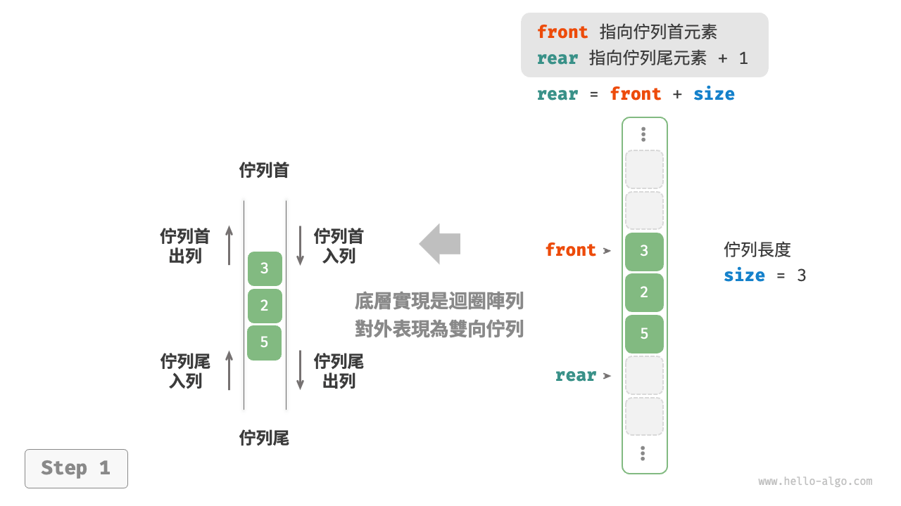{ class="animation-figure" }

=== "push_last()"
    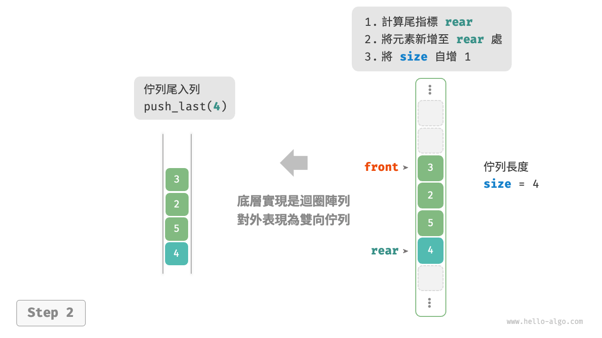{ class="animation-figure" }

=== "push_first()"
    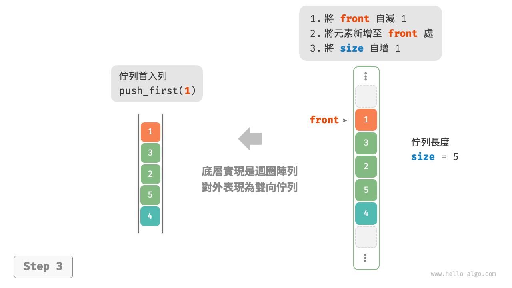{ class="animation-figure" }

=== "pop_last()"
    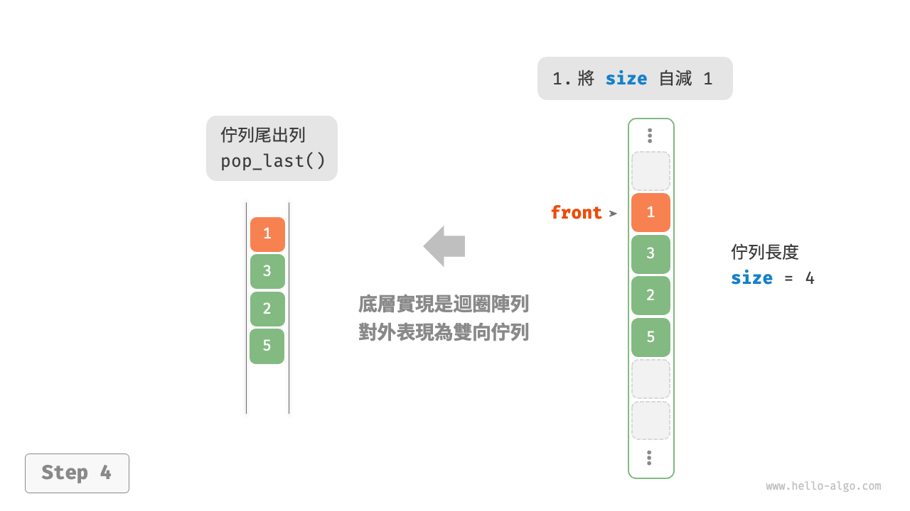{ class="animation-figure" }

=== "pop_first()"
    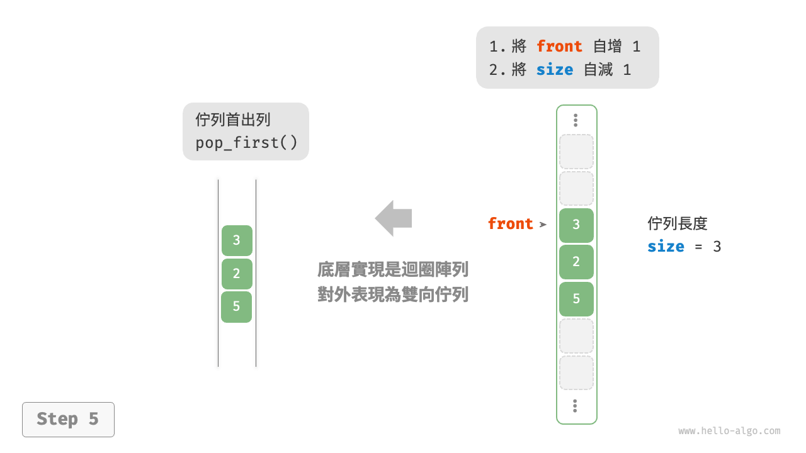{ class="animation-figure" }

<p align="center"> 圖 5-9 &nbsp; 基於陣列實現雙向佇列的入列出列操作 </p>

在佇列的實現基礎上，僅需增加“佇列首入列”和“佇列尾出列”的方法：

=== "Python"

    ```python title="array_deque.py"
    class ArrayDeque:
        """基於環形陣列實現的雙向佇列"""

        def __init__(self, capacity: int):
            """建構子"""
            self._nums: list[int] = [0] * capacity
            self._front: int = 0
            self._size: int = 0

        def capacity(self) -> int:
            """獲取雙向佇列的容量"""
            return len(self._nums)

        def size(self) -> int:
            """獲取雙向佇列的長度"""
            return self._size

        def is_empty(self) -> bool:
            """判斷雙向佇列是否為空"""
            return self._size == 0

        def index(self, i: int) -> int:
            """計算環形陣列索引"""
            # 透過取餘操作實現陣列首尾相連
            # 當 i 越過陣列尾部後，回到頭部
            # 當 i 越過陣列頭部後，回到尾部
            return (i + self.capacity()) % self.capacity()

        def push_first(self, num: int):
            """佇列首入列"""
            if self._size == self.capacity():
                print("雙向佇列已滿")
                return
            # 佇列首指標向左移動一位
            # 透過取餘操作實現 front 越過陣列頭部後回到尾部
            self._front = self.index(self._front - 1)
            # 將 num 新增至佇列首
            self._nums[self._front] = num
            self._size += 1

        def push_last(self, num: int):
            """佇列尾入列"""
            if self._size == self.capacity():
                print("雙向佇列已滿")
                return
            # 計算佇列尾指標，指向佇列尾索引 + 1
            rear = self.index(self._front + self._size)
            # 將 num 新增至佇列尾
            self._nums[rear] = num
            self._size += 1

        def pop_first(self) -> int:
            """佇列首出列"""
            num = self.peek_first()
            # 佇列首指標向後移動一位
            self._front = self.index(self._front + 1)
            self._size -= 1
            return num

        def pop_last(self) -> int:
            """佇列尾出列"""
            num = self.peek_last()
            self._size -= 1
            return num

        def peek_first(self) -> int:
            """訪問佇列首元素"""
            if self.is_empty():
                raise IndexError("雙向佇列為空")
            return self._nums[self._front]

        def peek_last(self) -> int:
            """訪問佇列尾元素"""
            if self.is_empty():
                raise IndexError("雙向佇列為空")
            # 計算尾元素索引
            last = self.index(self._front + self._size - 1)
            return self._nums[last]

        def to_array(self) -> list[int]:
            """返回陣列用於列印"""
            # 僅轉換有效長度範圍內的串列元素
            res = []
            for i in range(self._size):
                res.append(self._nums[self.index(self._front + i)])
            return res
    ```

=== "C++"

    ```cpp title="array_deque.cpp"
    /* 基於環形陣列實現的雙向佇列 */
    class ArrayDeque {
      private:
        vector<int> nums; // 用於儲存雙向佇列元素的陣列
        int front;        // 佇列首指標，指向佇列首元素
        int queSize;      // 雙向佇列長度

      public:
        /* 建構子 */
        ArrayDeque(int capacity) {
            nums.resize(capacity);
            front = queSize = 0;
        }

        /* 獲取雙向佇列的容量 */
        int capacity() {
            return nums.size();
        }

        /* 獲取雙向佇列的長度 */
        int size() {
            return queSize;
        }

        /* 判斷雙向佇列是否為空 */
        bool isEmpty() {
            return queSize == 0;
        }

        /* 計算環形陣列索引 */
        int index(int i) {
            // 透過取餘操作實現陣列首尾相連
            // 當 i 越過陣列尾部後，回到頭部
            // 當 i 越過陣列頭部後，回到尾部
            return (i + capacity()) % capacity();
        }

        /* 佇列首入列 */
        void pushFirst(int num) {
            if (queSize == capacity()) {
                cout << "雙向佇列已滿" << endl;
                return;
            }
            // 佇列首指標向左移動一位
            // 透過取餘操作實現 front 越過陣列頭部後回到尾部
            front = index(front - 1);
            // 將 num 新增至佇列首
            nums[front] = num;
            queSize++;
        }

        /* 佇列尾入列 */
        void pushLast(int num) {
            if (queSize == capacity()) {
                cout << "雙向佇列已滿" << endl;
                return;
            }
            // 計算佇列尾指標，指向佇列尾索引 + 1
            int rear = index(front + queSize);
            // 將 num 新增至佇列尾
            nums[rear] = num;
            queSize++;
        }

        /* 佇列首出列 */
        int popFirst() {
            int num = peekFirst();
            // 佇列首指標向後移動一位
            front = index(front + 1);
            queSize--;
            return num;
        }

        /* 佇列尾出列 */
        int popLast() {
            int num = peekLast();
            queSize--;
            return num;
        }

        /* 訪問佇列首元素 */
        int peekFirst() {
            if (isEmpty())
                throw out_of_range("雙向佇列為空");
            return nums[front];
        }

        /* 訪問佇列尾元素 */
        int peekLast() {
            if (isEmpty())
                throw out_of_range("雙向佇列為空");
            // 計算尾元素索引
            int last = index(front + queSize - 1);
            return nums[last];
        }

        /* 返回陣列用於列印 */
        vector<int> toVector() {
            // 僅轉換有效長度範圍內的串列元素
            vector<int> res(queSize);
            for (int i = 0, j = front; i < queSize; i++, j++) {
                res[i] = nums[index(j)];
            }
            return res;
        }
    };
    ```

=== "Java"

    ```java title="array_deque.java"
    /* 基於環形陣列實現的雙向佇列 */
    class ArrayDeque {
        private int[] nums; // 用於儲存雙向佇列元素的陣列
        private int front; // 佇列首指標，指向佇列首元素
        private int queSize; // 雙向佇列長度

        /* 建構子 */
        public ArrayDeque(int capacity) {
            this.nums = new int[capacity];
            front = queSize = 0;
        }

        /* 獲取雙向佇列的容量 */
        public int capacity() {
            return nums.length;
        }

        /* 獲取雙向佇列的長度 */
        public int size() {
            return queSize;
        }

        /* 判斷雙向佇列是否為空 */
        public boolean isEmpty() {
            return queSize == 0;
        }

        /* 計算環形陣列索引 */
        private int index(int i) {
            // 透過取餘操作實現陣列首尾相連
            // 當 i 越過陣列尾部後，回到頭部
            // 當 i 越過陣列頭部後，回到尾部
            return (i + capacity()) % capacity();
        }

        /* 佇列首入列 */
        public void pushFirst(int num) {
            if (queSize == capacity()) {
                System.out.println("雙向佇列已滿");
                return;
            }
            // 佇列首指標向左移動一位
            // 透過取餘操作實現 front 越過陣列頭部後回到尾部
            front = index(front - 1);
            // 將 num 新增至佇列首
            nums[front] = num;
            queSize++;
        }

        /* 佇列尾入列 */
        public void pushLast(int num) {
            if (queSize == capacity()) {
                System.out.println("雙向佇列已滿");
                return;
            }
            // 計算佇列尾指標，指向佇列尾索引 + 1
            int rear = index(front + queSize);
            // 將 num 新增至佇列尾
            nums[rear] = num;
            queSize++;
        }

        /* 佇列首出列 */
        public int popFirst() {
            int num = peekFirst();
            // 佇列首指標向後移動一位
            front = index(front + 1);
            queSize--;
            return num;
        }

        /* 佇列尾出列 */
        public int popLast() {
            int num = peekLast();
            queSize--;
            return num;
        }

        /* 訪問佇列首元素 */
        public int peekFirst() {
            if (isEmpty())
                throw new IndexOutOfBoundsException();
            return nums[front];
        }

        /* 訪問佇列尾元素 */
        public int peekLast() {
            if (isEmpty())
                throw new IndexOutOfBoundsException();
            // 計算尾元素索引
            int last = index(front + queSize - 1);
            return nums[last];
        }

        /* 返回陣列用於列印 */
        public int[] toArray() {
            // 僅轉換有效長度範圍內的串列元素
            int[] res = new int[queSize];
            for (int i = 0, j = front; i < queSize; i++, j++) {
                res[i] = nums[index(j)];
            }
            return res;
        }
    }
    ```

=== "C#"

    ```csharp title="array_deque.cs"
    /* 基於環形陣列實現的雙向佇列 */
    class ArrayDeque {
        int[] nums;  // 用於儲存雙向佇列元素的陣列
        int front;   // 佇列首指標，指向佇列首元素
        int queSize; // 雙向佇列長度

        /* 建構子 */
        public ArrayDeque(int capacity) {
            nums = new int[capacity];
            front = queSize = 0;
        }

        /* 獲取雙向佇列的容量 */
        int Capacity() {
            return nums.Length;
        }

        /* 獲取雙向佇列的長度 */
        public int Size() {
            return queSize;
        }

        /* 判斷雙向佇列是否為空 */
        public bool IsEmpty() {
            return queSize == 0;
        }

        /* 計算環形陣列索引 */
        int Index(int i) {
            // 透過取餘操作實現陣列首尾相連
            // 當 i 越過陣列尾部後，回到頭部
            // 當 i 越過陣列頭部後，回到尾部
            return (i + Capacity()) % Capacity();
        }

        /* 佇列首入列 */
        public void PushFirst(int num) {
            if (queSize == Capacity()) {
                Console.WriteLine("雙向佇列已滿");
                return;
            }
            // 佇列首指標向左移動一位
            // 透過取餘操作實現 front 越過陣列頭部後回到尾部
            front = Index(front - 1);
            // 將 num 新增至佇列首
            nums[front] = num;
            queSize++;
        }

        /* 佇列尾入列 */
        public void PushLast(int num) {
            if (queSize == Capacity()) {
                Console.WriteLine("雙向佇列已滿");
                return;
            }
            // 計算佇列尾指標，指向佇列尾索引 + 1
            int rear = Index(front + queSize);
            // 將 num 新增至佇列尾
            nums[rear] = num;
            queSize++;
        }

        /* 佇列首出列 */
        public int PopFirst() {
            int num = PeekFirst();
            // 佇列首指標向後移動一位
            front = Index(front + 1);
            queSize--;
            return num;
        }

        /* 佇列尾出列 */
        public int PopLast() {
            int num = PeekLast();
            queSize--;
            return num;
        }

        /* 訪問佇列首元素 */
        public int PeekFirst() {
            if (IsEmpty()) {
                throw new InvalidOperationException();
            }
            return nums[front];
        }

        /* 訪問佇列尾元素 */
        public int PeekLast() {
            if (IsEmpty()) {
                throw new InvalidOperationException();
            }
            // 計算尾元素索引
            int last = Index(front + queSize - 1);
            return nums[last];
        }

        /* 返回陣列用於列印 */
        public int[] ToArray() {
            // 僅轉換有效長度範圍內的串列元素
            int[] res = new int[queSize];
            for (int i = 0, j = front; i < queSize; i++, j++) {
                res[i] = nums[Index(j)];
            }
            return res;
        }
    }
    ```

=== "Go"

    ```go title="array_deque.go"
    /* 基於環形陣列實現的雙向佇列 */
    type arrayDeque struct {
        nums        []int // 用於儲存雙向佇列元素的陣列
        front       int   // 佇列首指標，指向佇列首元素
        queSize     int   // 雙向佇列長度
        queCapacity int   // 佇列容量（即最大容納元素數量）
    }

    /* 初始化佇列 */
    func newArrayDeque(queCapacity int) *arrayDeque {
        return &arrayDeque{
            nums:        make([]int, queCapacity),
            queCapacity: queCapacity,
            front:       0,
            queSize:     0,
        }
    }

    /* 獲取雙向佇列的長度 */
    func (q *arrayDeque) size() int {
        return q.queSize
    }

    /* 判斷雙向佇列是否為空 */
    func (q *arrayDeque) isEmpty() bool {
        return q.queSize == 0
    }

    /* 計算環形陣列索引 */
    func (q *arrayDeque) index(i int) int {
        // 透過取餘操作實現陣列首尾相連
        // 當 i 越過陣列尾部後，回到頭部
        // 當 i 越過陣列頭部後，回到尾部
        return (i + q.queCapacity) % q.queCapacity
    }

    /* 佇列首入列 */
    func (q *arrayDeque) pushFirst(num int) {
        if q.queSize == q.queCapacity {
            fmt.Println("雙向佇列已滿")
            return
        }
        // 佇列首指標向左移動一位
        // 透過取餘操作實現 front 越過陣列頭部後回到尾部
        q.front = q.index(q.front - 1)
        // 將 num 新增至佇列首
        q.nums[q.front] = num
        q.queSize++
    }

    /* 佇列尾入列 */
    func (q *arrayDeque) pushLast(num int) {
        if q.queSize == q.queCapacity {
            fmt.Println("雙向佇列已滿")
            return
        }
        // 計算佇列尾指標，指向佇列尾索引 + 1
        rear := q.index(q.front + q.queSize)
        // 將 num 新增至佇列尾
        q.nums[rear] = num
        q.queSize++
    }

    /* 佇列首出列 */
    func (q *arrayDeque) popFirst() any {
        num := q.peekFirst()
        if num == nil {
            return nil
        }
        // 佇列首指標向後移動一位
        q.front = q.index(q.front + 1)
        q.queSize--
        return num
    }

    /* 佇列尾出列 */
    func (q *arrayDeque) popLast() any {
        num := q.peekLast()
        if num == nil {
            return nil
        }
        q.queSize--
        return num
    }

    /* 訪問佇列首元素 */
    func (q *arrayDeque) peekFirst() any {
        if q.isEmpty() {
            return nil
        }
        return q.nums[q.front]
    }

    /* 訪問佇列尾元素 */
    func (q *arrayDeque) peekLast() any {
        if q.isEmpty() {
            return nil
        }
        // 計算尾元素索引
        last := q.index(q.front + q.queSize - 1)
        return q.nums[last]
    }

    /* 獲取 Slice 用於列印 */
    func (q *arrayDeque) toSlice() []int {
        // 僅轉換有效長度範圍內的串列元素
        res := make([]int, q.queSize)
        for i, j := 0, q.front; i < q.queSize; i++ {
            res[i] = q.nums[q.index(j)]
            j++
        }
        return res
    }
    ```

=== "Swift"

    ```swift title="array_deque.swift"
    /* 基於環形陣列實現的雙向佇列 */
    class ArrayDeque {
        private var nums: [Int] // 用於儲存雙向佇列元素的陣列
        private var front: Int // 佇列首指標，指向佇列首元素
        private var _size: Int // 雙向佇列長度

        /* 建構子 */
        init(capacity: Int) {
            nums = Array(repeating: 0, count: capacity)
            front = 0
            _size = 0
        }

        /* 獲取雙向佇列的容量 */
        func capacity() -> Int {
            nums.count
        }

        /* 獲取雙向佇列的長度 */
        func size() -> Int {
            _size
        }

        /* 判斷雙向佇列是否為空 */
        func isEmpty() -> Bool {
            size() == 0
        }

        /* 計算環形陣列索引 */
        private func index(i: Int) -> Int {
            // 透過取餘操作實現陣列首尾相連
            // 當 i 越過陣列尾部後，回到頭部
            // 當 i 越過陣列頭部後，回到尾部
            (i + capacity()) % capacity()
        }

        /* 佇列首入列 */
        func pushFirst(num: Int) {
            if size() == capacity() {
                print("雙向佇列已滿")
                return
            }
            // 佇列首指標向左移動一位
            // 透過取餘操作實現 front 越過陣列頭部後回到尾部
            front = index(i: front - 1)
            // 將 num 新增至佇列首
            nums[front] = num
            _size += 1
        }

        /* 佇列尾入列 */
        func pushLast(num: Int) {
            if size() == capacity() {
                print("雙向佇列已滿")
                return
            }
            // 計算佇列尾指標，指向佇列尾索引 + 1
            let rear = index(i: front + size())
            // 將 num 新增至佇列尾
            nums[rear] = num
            _size += 1
        }

        /* 佇列首出列 */
        func popFirst() -> Int {
            let num = peekFirst()
            // 佇列首指標向後移動一位
            front = index(i: front + 1)
            _size -= 1
            return num
        }

        /* 佇列尾出列 */
        func popLast() -> Int {
            let num = peekLast()
            _size -= 1
            return num
        }

        /* 訪問佇列首元素 */
        func peekFirst() -> Int {
            if isEmpty() {
                fatalError("雙向佇列為空")
            }
            return nums[front]
        }

        /* 訪問佇列尾元素 */
        func peekLast() -> Int {
            if isEmpty() {
                fatalError("雙向佇列為空")
            }
            // 計算尾元素索引
            let last = index(i: front + size() - 1)
            return nums[last]
        }

        /* 返回陣列用於列印 */
        func toArray() -> [Int] {
            // 僅轉換有效長度範圍內的串列元素
            (front ..< front + size()).map { nums[index(i: $0)] }
        }
    }
    ```

=== "JS"

    ```javascript title="array_deque.js"
    /* 基於環形陣列實現的雙向佇列 */
    class ArrayDeque {
        #nums; // 用於儲存雙向佇列元素的陣列
        #front; // 佇列首指標，指向佇列首元素
        #queSize; // 雙向佇列長度

        /* 建構子 */
        constructor(capacity) {
            this.#nums = new Array(capacity);
            this.#front = 0;
            this.#queSize = 0;
        }

        /* 獲取雙向佇列的容量 */
        capacity() {
            return this.#nums.length;
        }

        /* 獲取雙向佇列的長度 */
        size() {
            return this.#queSize;
        }

        /* 判斷雙向佇列是否為空 */
        isEmpty() {
            return this.#queSize === 0;
        }

        /* 計算環形陣列索引 */
        index(i) {
            // 透過取餘操作實現陣列首尾相連
            // 當 i 越過陣列尾部後，回到頭部
            // 當 i 越過陣列頭部後，回到尾部
            return (i + this.capacity()) % this.capacity();
        }

        /* 佇列首入列 */
        pushFirst(num) {
            if (this.#queSize === this.capacity()) {
                console.log('雙向佇列已滿');
                return;
            }
            // 佇列首指標向左移動一位
            // 透過取餘操作實現 front 越過陣列頭部後回到尾部
            this.#front = this.index(this.#front - 1);
            // 將 num 新增至佇列首
            this.#nums[this.#front] = num;
            this.#queSize++;
        }

        /* 佇列尾入列 */
        pushLast(num) {
            if (this.#queSize === this.capacity()) {
                console.log('雙向佇列已滿');
                return;
            }
            // 計算佇列尾指標，指向佇列尾索引 + 1
            const rear = this.index(this.#front + this.#queSize);
            // 將 num 新增至佇列尾
            this.#nums[rear] = num;
            this.#queSize++;
        }

        /* 佇列首出列 */
        popFirst() {
            const num = this.peekFirst();
            // 佇列首指標向後移動一位
            this.#front = this.index(this.#front + 1);
            this.#queSize--;
            return num;
        }

        /* 佇列尾出列 */
        popLast() {
            const num = this.peekLast();
            this.#queSize--;
            return num;
        }

        /* 訪問佇列首元素 */
        peekFirst() {
            if (this.isEmpty()) throw new Error('The Deque Is Empty.');
            return this.#nums[this.#front];
        }

        /* 訪問佇列尾元素 */
        peekLast() {
            if (this.isEmpty()) throw new Error('The Deque Is Empty.');
            // 計算尾元素索引
            const last = this.index(this.#front + this.#queSize - 1);
            return this.#nums[last];
        }

        /* 返回陣列用於列印 */
        toArray() {
            // 僅轉換有效長度範圍內的串列元素
            const res = [];
            for (let i = 0, j = this.#front; i < this.#queSize; i++, j++) {
                res[i] = this.#nums[this.index(j)];
            }
            return res;
        }
    }
    ```

=== "TS"

    ```typescript title="array_deque.ts"
    /* 基於環形陣列實現的雙向佇列 */
    class ArrayDeque {
        private nums: number[]; // 用於儲存雙向佇列元素的陣列
        private front: number; // 佇列首指標，指向佇列首元素
        private queSize: number; // 雙向佇列長度

        /* 建構子 */
        constructor(capacity: number) {
            this.nums = new Array(capacity);
            this.front = 0;
            this.queSize = 0;
        }

        /* 獲取雙向佇列的容量 */
        capacity(): number {
            return this.nums.length;
        }

        /* 獲取雙向佇列的長度 */
        size(): number {
            return this.queSize;
        }

        /* 判斷雙向佇列是否為空 */
        isEmpty(): boolean {
            return this.queSize === 0;
        }

        /* 計算環形陣列索引 */
        index(i: number): number {
            // 透過取餘操作實現陣列首尾相連
            // 當 i 越過陣列尾部後，回到頭部
            // 當 i 越過陣列頭部後，回到尾部
            return (i + this.capacity()) % this.capacity();
        }

        /* 佇列首入列 */
        pushFirst(num: number): void {
            if (this.queSize === this.capacity()) {
                console.log('雙向佇列已滿');
                return;
            }
            // 佇列首指標向左移動一位
            // 透過取餘操作實現 front 越過陣列頭部後回到尾部
            this.front = this.index(this.front - 1);
            // 將 num 新增至佇列首
            this.nums[this.front] = num;
            this.queSize++;
        }

        /* 佇列尾入列 */
        pushLast(num: number): void {
            if (this.queSize === this.capacity()) {
                console.log('雙向佇列已滿');
                return;
            }
            // 計算佇列尾指標，指向佇列尾索引 + 1
            const rear: number = this.index(this.front + this.queSize);
            // 將 num 新增至佇列尾
            this.nums[rear] = num;
            this.queSize++;
        }

        /* 佇列首出列 */
        popFirst(): number {
            const num: number = this.peekFirst();
            // 佇列首指標向後移動一位
            this.front = this.index(this.front + 1);
            this.queSize--;
            return num;
        }

        /* 佇列尾出列 */
        popLast(): number {
            const num: number = this.peekLast();
            this.queSize--;
            return num;
        }

        /* 訪問佇列首元素 */
        peekFirst(): number {
            if (this.isEmpty()) throw new Error('The Deque Is Empty.');
            return this.nums[this.front];
        }

        /* 訪問佇列尾元素 */
        peekLast(): number {
            if (this.isEmpty()) throw new Error('The Deque Is Empty.');
            // 計算尾元素索引
            const last = this.index(this.front + this.queSize - 1);
            return this.nums[last];
        }

        /* 返回陣列用於列印 */
        toArray(): number[] {
            // 僅轉換有效長度範圍內的串列元素
            const res: number[] = [];
            for (let i = 0, j = this.front; i < this.queSize; i++, j++) {
                res[i] = this.nums[this.index(j)];
            }
            return res;
        }
    }
    ```

=== "Dart"

    ```dart title="array_deque.dart"
    /* 基於環形陣列實現的雙向佇列 */
    class ArrayDeque {
      late List<int> _nums; // 用於儲存雙向佇列元素的陣列
      late int _front; // 佇列首指標，指向佇列首元素
      late int _queSize; // 雙向佇列長度

      /* 建構子 */
      ArrayDeque(int capacity) {
        this._nums = List.filled(capacity, 0);
        this._front = this._queSize = 0;
      }

      /* 獲取雙向佇列的容量 */
      int capacity() {
        return _nums.length;
      }

      /* 獲取雙向佇列的長度 */
      int size() {
        return _queSize;
      }

      /* 判斷雙向佇列是否為空 */
      bool isEmpty() {
        return _queSize == 0;
      }

      /* 計算環形陣列索引 */
      int index(int i) {
        // 透過取餘操作實現陣列首尾相連
        // 當 i 越過陣列尾部後，回到頭部
        // 當 i 越過陣列頭部後，回到尾部
        return (i + capacity()) % capacity();
      }

      /* 佇列首入列 */
      void pushFirst(int _num) {
        if (_queSize == capacity()) {
          throw Exception("雙向佇列已滿");
        }
        // 佇列首指標向左移動一位
        // 透過取餘操作實現 _front 越過陣列頭部後回到尾部
        _front = index(_front - 1);
        // 將 _num 新增至佇列首
        _nums[_front] = _num;
        _queSize++;
      }

      /* 佇列尾入列 */
      void pushLast(int _num) {
        if (_queSize == capacity()) {
          throw Exception("雙向佇列已滿");
        }
        // 計算佇列尾指標，指向佇列尾索引 + 1
        int rear = index(_front + _queSize);
        // 將 _num 新增至佇列尾
        _nums[rear] = _num;
        _queSize++;
      }

      /* 佇列首出列 */
      int popFirst() {
        int _num = peekFirst();
        // 佇列首指標向右移動一位
        _front = index(_front + 1);
        _queSize--;
        return _num;
      }

      /* 佇列尾出列 */
      int popLast() {
        int _num = peekLast();
        _queSize--;
        return _num;
      }

      /* 訪問佇列首元素 */
      int peekFirst() {
        if (isEmpty()) {
          throw Exception("雙向佇列為空");
        }
        return _nums[_front];
      }

      /* 訪問佇列尾元素 */
      int peekLast() {
        if (isEmpty()) {
          throw Exception("雙向佇列為空");
        }
        // 計算尾元素索引
        int last = index(_front + _queSize - 1);
        return _nums[last];
      }

      /* 返回陣列用於列印 */
      List<int> toArray() {
        // 僅轉換有效長度範圍內的串列元素
        List<int> res = List.filled(_queSize, 0);
        for (int i = 0, j = _front; i < _queSize; i++, j++) {
          res[i] = _nums[index(j)];
        }
        return res;
      }
    }
    ```

=== "Rust"

    ```rust title="array_deque.rs"
    /* 基於環形陣列實現的雙向佇列 */
    struct ArrayDeque {
        nums: Vec<i32>,  // 用於儲存雙向佇列元素的陣列
        front: usize,    // 佇列首指標，指向佇列首元素
        que_size: usize, // 雙向佇列長度
    }

    impl ArrayDeque {
        /* 建構子 */
        pub fn new(capacity: usize) -> Self {
            Self {
                nums: vec![0; capacity],
                front: 0,
                que_size: 0,
            }
        }

        /* 獲取雙向佇列的容量 */
        pub fn capacity(&self) -> usize {
            self.nums.len()
        }

        /* 獲取雙向佇列的長度 */
        pub fn size(&self) -> usize {
            self.que_size
        }

        /* 判斷雙向佇列是否為空 */
        pub fn is_empty(&self) -> bool {
            self.que_size == 0
        }

        /* 計算環形陣列索引 */
        fn index(&self, i: i32) -> usize {
            // 透過取餘操作實現陣列首尾相連
            // 當 i 越過陣列尾部後，回到頭部
            // 當 i 越過陣列頭部後，回到尾部
            return ((i + self.capacity() as i32) % self.capacity() as i32) as usize;
        }

        /* 佇列首入列 */
        pub fn push_first(&mut self, num: i32) {
            if self.que_size == self.capacity() {
                println!("雙向佇列已滿");
                return;
            }
            // 佇列首指標向左移動一位
            // 透過取餘操作實現 front 越過陣列頭部後回到尾部
            self.front = self.index(self.front as i32 - 1);
            // 將 num 新增至佇列首
            self.nums[self.front] = num;
            self.que_size += 1;
        }

        /* 佇列尾入列 */
        pub fn push_last(&mut self, num: i32) {
            if self.que_size == self.capacity() {
                println!("雙向佇列已滿");
                return;
            }
            // 計算佇列尾指標，指向佇列尾索引 + 1
            let rear = self.index(self.front as i32 + self.que_size as i32);
            // 將 num 新增至佇列尾
            self.nums[rear] = num;
            self.que_size += 1;
        }

        /* 佇列首出列 */
        fn pop_first(&mut self) -> i32 {
            let num = self.peek_first();
            // 佇列首指標向後移動一位
            self.front = self.index(self.front as i32 + 1);
            self.que_size -= 1;
            num
        }

        /* 佇列尾出列 */
        fn pop_last(&mut self) -> i32 {
            let num = self.peek_last();
            self.que_size -= 1;
            num
        }

        /* 訪問佇列首元素 */
        fn peek_first(&self) -> i32 {
            if self.is_empty() {
                panic!("雙向佇列為空")
            };
            self.nums[self.front]
        }

        /* 訪問佇列尾元素 */
        fn peek_last(&self) -> i32 {
            if self.is_empty() {
                panic!("雙向佇列為空")
            };
            // 計算尾元素索引
            let last = self.index(self.front as i32 + self.que_size as i32 - 1);
            self.nums[last]
        }

        /* 返回陣列用於列印 */
        fn to_array(&self) -> Vec<i32> {
            // 僅轉換有效長度範圍內的串列元素
            let mut res = vec![0; self.que_size];
            let mut j = self.front;
            for i in 0..self.que_size {
                res[i] = self.nums[self.index(j as i32)];
                j += 1;
            }
            res
        }
    }
    ```

=== "C"

    ```c title="array_deque.c"
    /* 基於環形陣列實現的雙向佇列 */
    typedef struct {
        int *nums;       // 用於儲存佇列元素的陣列
        int front;       // 佇列首指標，指向佇列首元素
        int queSize;     // 尾指標，指向佇列尾 + 1
        int queCapacity; // 佇列容量
    } ArrayDeque;

    /* 建構子 */
    ArrayDeque *newArrayDeque(int capacity) {
        ArrayDeque *deque = (ArrayDeque *)malloc(sizeof(ArrayDeque));
        // 初始化陣列
        deque->queCapacity = capacity;
        deque->nums = (int *)malloc(sizeof(int) * deque->queCapacity);
        deque->front = deque->queSize = 0;
        return deque;
    }

    /* 析構函式 */
    void delArrayDeque(ArrayDeque *deque) {
        free(deque->nums);
        free(deque);
    }

    /* 獲取雙向佇列的容量 */
    int capacity(ArrayDeque *deque) {
        return deque->queCapacity;
    }

    /* 獲取雙向佇列的長度 */
    int size(ArrayDeque *deque) {
        return deque->queSize;
    }

    /* 判斷雙向佇列是否為空 */
    bool empty(ArrayDeque *deque) {
        return deque->queSize == 0;
    }

    /* 計算環形陣列索引 */
    int dequeIndex(ArrayDeque *deque, int i) {
        // 透過取餘操作實現陣列首尾相連
        // 當 i 越過陣列尾部時，回到頭部
        // 當 i 越過陣列頭部後，回到尾部
        return ((i + capacity(deque)) % capacity(deque));
    }

    /* 佇列首入列 */
    void pushFirst(ArrayDeque *deque, int num) {
        if (deque->queSize == capacity(deque)) {
            printf("雙向佇列已滿\r\n");
            return;
        }
        // 佇列首指標向左移動一位
        // 透過取餘操作實現 front 越過陣列頭部回到尾部
        deque->front = dequeIndex(deque, deque->front - 1);
        // 將 num 新增到佇列首
        deque->nums[deque->front] = num;
        deque->queSize++;
    }

    /* 佇列尾入列 */
    void pushLast(ArrayDeque *deque, int num) {
        if (deque->queSize == capacity(deque)) {
            printf("雙向佇列已滿\r\n");
            return;
        }
        // 計算佇列尾指標，指向佇列尾索引 + 1
        int rear = dequeIndex(deque, deque->front + deque->queSize);
        // 將 num 新增至佇列尾
        deque->nums[rear] = num;
        deque->queSize++;
    }

    /* 訪問佇列首元素 */
    int peekFirst(ArrayDeque *deque) {
        // 訪問異常：雙向佇列為空
        assert(empty(deque) == 0);
        return deque->nums[deque->front];
    }

    /* 訪問佇列尾元素 */
    int peekLast(ArrayDeque *deque) {
        // 訪問異常：雙向佇列為空
        assert(empty(deque) == 0);
        int last = dequeIndex(deque, deque->front + deque->queSize - 1);
        return deque->nums[last];
    }

    /* 佇列首出列 */
    int popFirst(ArrayDeque *deque) {
        int num = peekFirst(deque);
        // 佇列首指標向後移動一位
        deque->front = dequeIndex(deque, deque->front + 1);
        deque->queSize--;
        return num;
    }

    /* 佇列尾出列 */
    int popLast(ArrayDeque *deque) {
        int num = peekLast(deque);
        deque->queSize--;
        return num;
    }

    /* 返回陣列用於列印 */
    int *toArray(ArrayDeque *deque, int *queSize) {
        *queSize = deque->queSize;
        int *res = (int *)calloc(deque->queSize, sizeof(int));
        int j = deque->front;
        for (int i = 0; i < deque->queSize; i++) {
            res[i] = deque->nums[j % deque->queCapacity];
            j++;
        }
        return res;
    }
    ```

=== "Kotlin"

    ```kotlin title="array_deque.kt"
    /* 建構子 */
    class ArrayDeque(capacity: Int) {
        private var nums: IntArray = IntArray(capacity) // 用於儲存雙向佇列元素的陣列
        private var front: Int = 0 // 佇列首指標，指向佇列首元素
        private var queSize: Int = 0 // 雙向佇列長度

        /* 獲取雙向佇列的容量 */
        fun capacity(): Int {
            return nums.size
        }

        /* 獲取雙向佇列的長度 */
        fun size(): Int {
            return queSize
        }

        /* 判斷雙向佇列是否為空 */
        fun isEmpty(): Boolean {
            return queSize == 0
        }

        /* 計算環形陣列索引 */
        private fun index(i: Int): Int {
            // 透過取餘操作實現陣列首尾相連
            // 當 i 越過陣列尾部後，回到頭部
            // 當 i 越過陣列頭部後，回到尾部
            return (i + capacity()) % capacity()
        }

        /* 佇列首入列 */
        fun pushFirst(num: Int) {
            if (queSize == capacity()) {
                println("雙向佇列已滿")
                return
            }
            // 佇列首指標向左移動一位
            // 透過取餘操作實現 front 越過陣列頭部後回到尾部
            front = index(front - 1)
            // 將 num 新增至佇列首
            nums[front] = num
            queSize++
        }

        /* 佇列尾入列 */
        fun pushLast(num: Int) {
            if (queSize == capacity()) {
                println("雙向佇列已滿")
                return
            }
            // 計算佇列尾指標，指向佇列尾索引 + 1
            val rear = index(front + queSize)
            // 將 num 新增至佇列尾
            nums[rear] = num
            queSize++
        }

        /* 佇列首出列 */
        fun popFirst(): Int {
            val num = peekFirst()
            // 佇列首指標向後移動一位
            front = index(front + 1)
            queSize--
            return num
        }

        /* 佇列尾出列 */
        fun popLast(): Int {
            val num = peekLast()
            queSize--
            return num
        }

        /* 訪問佇列首元素 */
        fun peekFirst(): Int {
            if (isEmpty()) throw IndexOutOfBoundsException()
            return nums[front]
        }

        /* 訪問佇列尾元素 */
        fun peekLast(): Int {
            if (isEmpty()) throw IndexOutOfBoundsException()
            // 計算尾元素索引
            val last = index(front + queSize - 1)
            return nums[last]
        }

        /* 返回陣列用於列印 */
        fun toArray(): IntArray {
            // 僅轉換有效長度範圍內的串列元素
            val res = IntArray(queSize)
            var i = 0
            var j = front
            while (i < queSize) {
                res[i] = nums[index(j)]
                i++
                j++
            }
            return res
        }
    }
    ```

=== "Ruby"

    ```ruby title="array_deque.rb"
    ### 基於環形陣列實現的雙向佇列 ###
    class ArrayDeque
      ### 獲取雙向佇列的長度 ###
      attr_reader :size

      ### 建構子 ###
      def initialize(capacity)
        @nums = Array.new(capacity, 0)
        @front = 0
        @size = 0
      end

      ### 獲取雙向佇列的容量 ###
      def capacity
        @nums.length
      end

      ### 判斷雙向佇列是否為空 ###
      def is_empty?
        size.zero?
      end

      ### 佇列首入列 ###
      def push_first(num)
        if size == capacity
          puts '雙向佇列已滿'
          return
        end

        # 佇列首指標向左移動一位
        # 透過取餘操作實現 front 越過陣列頭部後回到尾部
        @front = index(@front - 1)
        # 將 num 新增至佇列首
        @nums[@front] = num
        @size += 1
      end

      ### 佇列尾入列 ###
      def push_last(num)
        if size == capacity
          puts '雙向佇列已滿'
          return
        end

        # 計算佇列尾指標，指向佇列尾索引 + 1
        rear = index(@front + size)
        # 將 num 新增至佇列尾
        @nums[rear] = num
        @size += 1
      end

      ### 佇列首出列 ###
      def pop_first
        num = peek_first
        # 佇列首指標向後移動一位
        @front = index(@front + 1)
        @size -= 1
        num
      end

      ### 佇列尾出列 ###
      def pop_last
        num = peek_last
        @size -= 1
        num
      end

      ### 訪問佇列首元素 ###
      def peek_first
        raise IndexError, '雙向佇列為空' if is_empty?

        @nums[@front]
      end

      ### 訪問佇列尾元素 ###
      def peek_last
        raise IndexError, '雙向佇列為空' if is_empty?

        # 計算尾元素索引
        last = index(@front + size - 1)
        @nums[last]
      end

      ### 返回陣列用於列印 ###
      def to_array
        # 僅轉換有效長度範圍內的串列元素
        res = []
        for i in 0...size
          res << @nums[index(@front + i)]
        end
        res
      end

      private

      ### 計算環形陣列索引 ###
      def index(i)
        # 透過取餘操作實現陣列首尾相連
        # 當 i 越過陣列尾部後，回到頭部
        # 當 i 越過陣列頭部後，回到尾部
        (i + capacity) % capacity
      end
    end
    ```

=== "Zig"

    ```zig title="array_deque.zig"
    [class]{ArrayDeque}-[func]{}
    ```

## 5.3.3 &nbsp; 雙向佇列應用

雙向佇列兼具堆疊與佇列的邏輯，**因此它可以實現這兩者的所有應用場景，同時提供更高的自由度**。

我們知道，軟體的“撤銷”功能通常使用堆疊來實現：系統將每次更改操作 `push` 到堆疊中，然後透過 `pop` 實現撤銷。然而，考慮到系統資源的限制，軟體通常會限制撤銷的步數（例如僅允許儲存 $50$ 步）。當堆疊的長度超過 $50$ 時，軟體需要在堆疊底（佇列首）執行刪除操作。**但堆疊無法實現該功能，此時就需要使用雙向佇列來替代堆疊**。請注意，“撤銷”的核心邏輯仍然遵循堆疊的先入後出原則，只是雙向佇列能夠更加靈活地實現一些額外邏輯。
