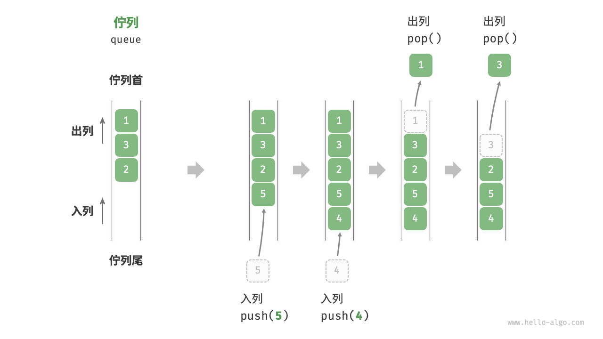
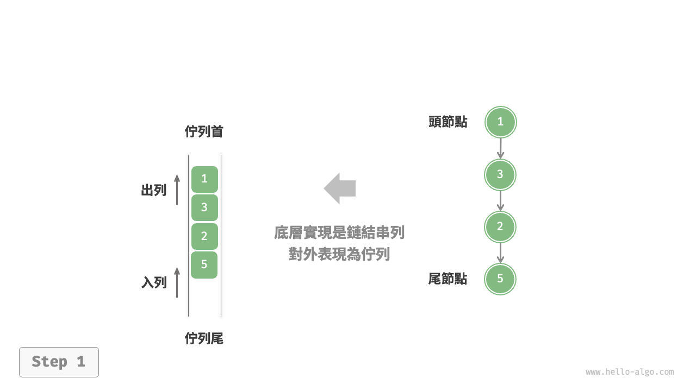
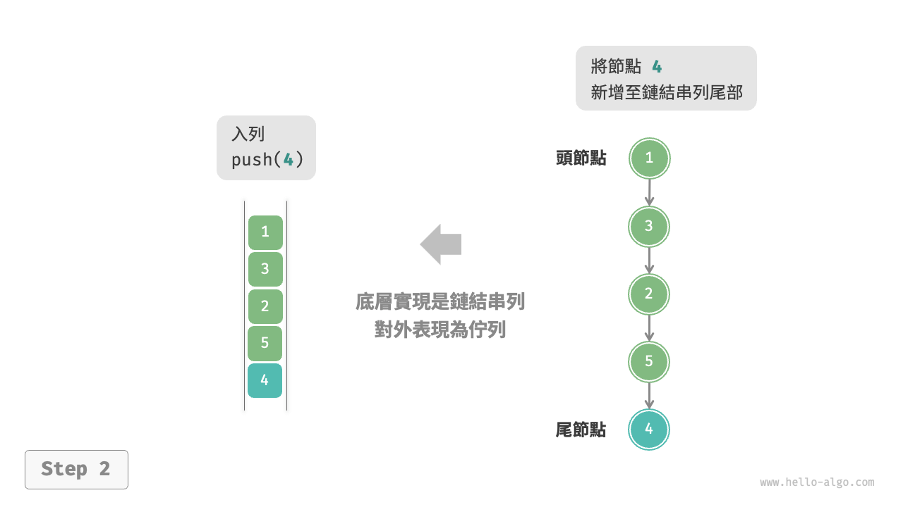
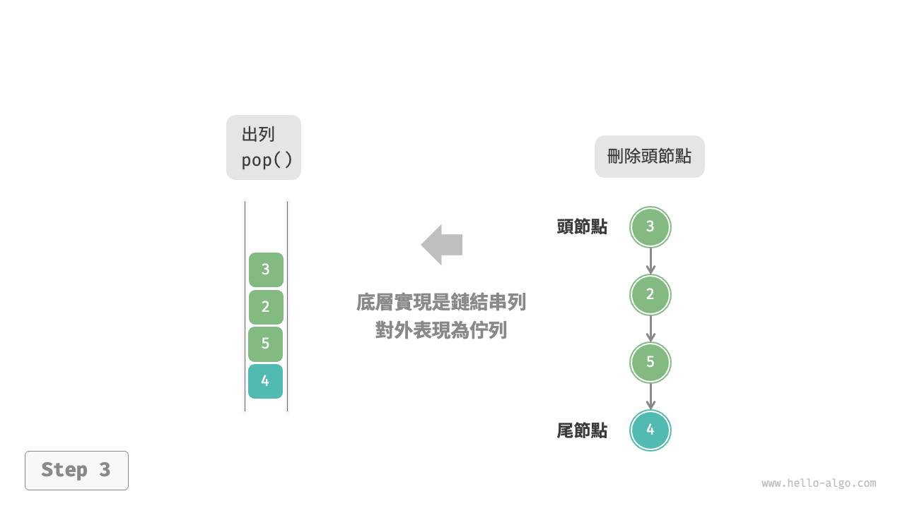
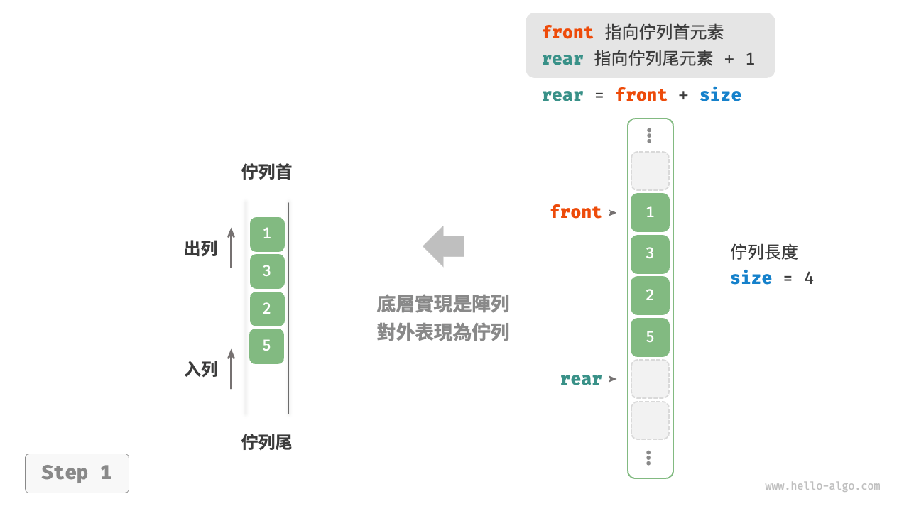
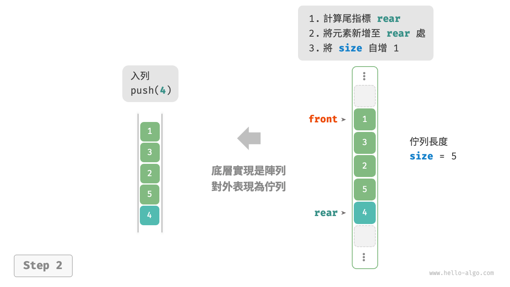
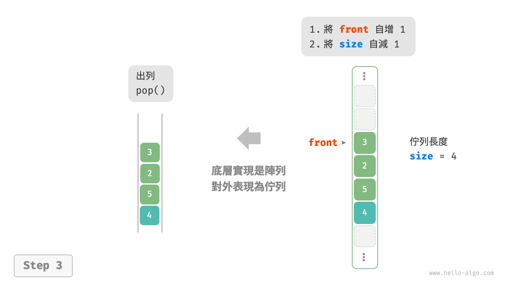

# 5.2 &nbsp; 佇列

<u>佇列（queue）</u>是一種遵循先入先出規則的線性資料結構。顧名思義，佇列模擬了排隊現象，即新來的人不斷加入佇列尾部，而位於佇列頭部的人逐個離開。

如圖 5-4 所示，我們將佇列頭部稱為“佇列首”，尾部稱為“佇列尾”，將把元素加入列尾的操作稱為“入列”，刪除佇列首元素的操作稱為“出列”。

{ class="animation-figure" }

<p align="center"> 圖 5-4 &nbsp; 佇列的先入先出規則 </p>

## 5.2.1 &nbsp; 佇列常用操作

佇列的常見操作如表 5-2 所示。需要注意的是，不同程式語言的方法名稱可能會有所不同。我們在此採用與堆疊相同的方法命名。

<p align="center"> 表 5-2 &nbsp; 佇列操作效率 </p>

<div class="center-table" markdown>

| 方法名   | 描述                         | 時間複雜度 |
| -------- | ---------------------------- | ---------- |
| `push()` | 元素入列，即將元素新增至佇列尾 | $O(1)$     |
| `pop()`  | 佇列首元素出列                 | $O(1)$     |
| `peek()` | 訪問佇列首元素                 | $O(1)$     |

</div>

我們可以直接使用程式語言中現成的佇列類別：

=== "Python"

    ```python title="queue.py"
    from collections import deque

    # 初始化佇列
    # 在 Python 中，我們一般將雙向佇列類別 deque 當作佇列使用
    # 雖然 queue.Queue() 是純正的佇列類別，但不太好用，因此不推薦
    que: deque[int] = deque()
    
    # 元素入列
    que.append(1)
    que.append(3)
    que.append(2)
    que.append(5)
    que.append(4)
    
    # 訪問佇列首元素
    front: int = que[0]
    
    # 元素出列
    pop: int = que.popleft()
    
    # 獲取佇列的長度
    size: int = len(que)
    
    # 判斷佇列是否為空
    is_empty: bool = len(que) == 0
    ```

=== "C++"

    ```cpp title="queue.cpp"
    /* 初始化佇列 */
    queue<int> queue;
    
    /* 元素入列 */
    queue.push(1);
    queue.push(3);
    queue.push(2);
    queue.push(5);
    queue.push(4);
    
    /* 訪問佇列首元素 */
    int front = queue.front();
    
    /* 元素出列 */
    queue.pop();
    
    /* 獲取佇列的長度 */
    int size = queue.size();
    
    /* 判斷佇列是否為空 */
    bool empty = queue.empty();
    ```

=== "Java"

    ```java title="queue.java"
    /* 初始化佇列 */
    Queue<Integer> queue = new LinkedList<>();
    
    /* 元素入列 */
    queue.offer(1);
    queue.offer(3);
    queue.offer(2);
    queue.offer(5);
    queue.offer(4);
    
    /* 訪問佇列首元素 */
    int peek = queue.peek();
    
    /* 元素出列 */
    int pop = queue.poll();
    
    /* 獲取佇列的長度 */
    int size = queue.size();
    
    /* 判斷佇列是否為空 */
    boolean isEmpty = queue.isEmpty();
    ```

=== "C#"

    ```csharp title="queue.cs"
    /* 初始化佇列 */
    Queue<int> queue = new();
    
    /* 元素入列 */
    queue.Enqueue(1);
    queue.Enqueue(3);
    queue.Enqueue(2);
    queue.Enqueue(5);
    queue.Enqueue(4);
    
    /* 訪問佇列首元素 */
    int peek = queue.Peek();
    
    /* 元素出列 */
    int pop = queue.Dequeue();
    
    /* 獲取佇列的長度 */
    int size = queue.Count;
    
    /* 判斷佇列是否為空 */
    bool isEmpty = queue.Count == 0;
    ```

=== "Go"

    ```go title="queue_test.go"
    /* 初始化佇列 */
    // 在 Go 中，將 list 作為佇列來使用
    queue := list.New()
    
    /* 元素入列 */
    queue.PushBack(1)
    queue.PushBack(3)
    queue.PushBack(2)
    queue.PushBack(5)
    queue.PushBack(4)
    
    /* 訪問佇列首元素 */
    peek := queue.Front()
    
    /* 元素出列 */
    pop := queue.Front()
    queue.Remove(pop)
    
    /* 獲取佇列的長度 */
    size := queue.Len()
    
    /* 判斷佇列是否為空 */
    isEmpty := queue.Len() == 0
    ```

=== "Swift"

    ```swift title="queue.swift"
    /* 初始化佇列 */
    // Swift 沒有內建的佇列類別，可以把 Array 當作佇列來使用
    var queue: [Int] = []
    
    /* 元素入列 */
    queue.append(1)
    queue.append(3)
    queue.append(2)
    queue.append(5)
    queue.append(4)
    
    /* 訪問佇列首元素 */
    let peek = queue.first!
    
    /* 元素出列 */
    // 由於是陣列，因此 removeFirst 的複雜度為 O(n)
    let pool = queue.removeFirst()
    
    /* 獲取佇列的長度 */
    let size = queue.count
    
    /* 判斷佇列是否為空 */
    let isEmpty = queue.isEmpty
    ```

=== "JS"

    ```javascript title="queue.js"
    /* 初始化佇列 */
    // JavaScript 沒有內建的佇列，可以把 Array 當作佇列來使用
    const queue = [];
    
    /* 元素入列 */
    queue.push(1);
    queue.push(3);
    queue.push(2);
    queue.push(5);
    queue.push(4);
    
    /* 訪問佇列首元素 */
    const peek = queue[0];
    
    /* 元素出列 */
    // 底層是陣列，因此 shift() 方法的時間複雜度為 O(n)
    const pop = queue.shift();
    
    /* 獲取佇列的長度 */
    const size = queue.length;
    
    /* 判斷佇列是否為空 */
    const empty = queue.length === 0;
    ```

=== "TS"

    ```typescript title="queue.ts"
    /* 初始化佇列 */
    // TypeScript 沒有內建的佇列，可以把 Array 當作佇列來使用 
    const queue: number[] = [];
    
    /* 元素入列 */
    queue.push(1);
    queue.push(3);
    queue.push(2);
    queue.push(5);
    queue.push(4);
    
    /* 訪問佇列首元素 */
    const peek = queue[0];
    
    /* 元素出列 */
    // 底層是陣列，因此 shift() 方法的時間複雜度為 O(n)
    const pop = queue.shift();
    
    /* 獲取佇列的長度 */
    const size = queue.length;
    
    /* 判斷佇列是否為空 */
    const empty = queue.length === 0;
    ```

=== "Dart"

    ```dart title="queue.dart"
    /* 初始化佇列 */
    // 在 Dart 中，佇列類別 Qeque 是雙向佇列，也可作為佇列使用
    Queue<int> queue = Queue();

    /* 元素入列 */
    queue.add(1);
    queue.add(3);
    queue.add(2);
    queue.add(5);
    queue.add(4);

    /* 訪問佇列首元素 */
    int peek = queue.first;

    /* 元素出列 */
    int pop = queue.removeFirst();

    /* 獲取佇列的長度 */
    int size = queue.length;

    /* 判斷佇列是否為空 */
    bool isEmpty = queue.isEmpty;
    ```

=== "Rust"

    ```rust title="queue.rs"
    /* 初始化雙向佇列 */
    // 在 Rust 中使用雙向佇列作為普通佇列來使用
    let mut deque: VecDeque<u32> = VecDeque::new();

    /* 元素入列 */
    deque.push_back(1);
    deque.push_back(3);
    deque.push_back(2);
    deque.push_back(5);
    deque.push_back(4);

    /* 訪問佇列首元素 */
    if let Some(front) = deque.front() {
    }

    /* 元素出列 */
    if let Some(pop) = deque.pop_front() {
    }

    /* 獲取佇列的長度 */
    let size = deque.len();

    /* 判斷佇列是否為空 */
    let is_empty = deque.is_empty();
    ```

=== "C"

    ```c title="queue.c"
    // C 未提供內建佇列
    ```

=== "Kotlin"

    ```kotlin title="queue.kt"
    /* 初始化佇列 */
    val queue = LinkedList<Int>()
    
    /* 元素入列 */
    queue.offer(1)
    queue.offer(3)
    queue.offer(2)
    queue.offer(5)
    queue.offer(4)
    
    /* 訪問佇列首元素 */
    val peek = queue.peek()
    
    /* 元素出列 */
    val pop = queue.poll()
    
    /* 獲取佇列的長度 */
    val size = queue.size
    
    /* 判斷佇列是否為空 */
    val isEmpty = queue.isEmpty()
    ```

=== "Ruby"

    ```ruby title="queue.rb"

    ```

=== "Zig"

    ```zig title="queue.zig"

    ```

??? pythontutor "視覺化執行"

    <div style="height: 549px; width: 100%;"><iframe class="pythontutor-iframe" src="https://pythontutor.com/iframe-embed.html#code=from%20collections%20import%20deque%0A%0A%22%22%22Driver%20Code%22%22%22%0Aif%20__name__%20%3D%3D%20%22__main__%22%3A%0A%20%20%20%20%23%20%E5%88%9D%E5%A7%8B%E5%8C%96%E9%98%9F%E5%88%97%0A%20%20%20%20%23%20%E5%9C%A8%20Python%20%E4%B8%AD%EF%BC%8C%E6%88%91%E4%BB%AC%E4%B8%80%E8%88%AC%E5%B0%86%E5%8F%8C%E5%90%91%E9%98%9F%E5%88%97%E7%B1%BB%20deque%20%E7%9C%8B%E4%BD%9C%E9%98%9F%E5%88%97%E4%BD%BF%E7%94%A8%0A%20%20%20%20%23%20%E8%99%BD%E7%84%B6%20queue.Queue%28%29%20%E6%98%AF%E7%BA%AF%E6%AD%A3%E7%9A%84%E9%98%9F%E5%88%97%E7%B1%BB%EF%BC%8C%E4%BD%86%E4%B8%8D%E5%A4%AA%E5%A5%BD%E7%94%A8%0A%20%20%20%20que%20%3D%20deque%28%29%0A%0A%20%20%20%20%23%20%E5%85%83%E7%B4%A0%E5%85%A5%E9%98%9F%0A%20%20%20%20que.append%281%29%0A%20%20%20%20que.append%283%29%0A%20%20%20%20que.append%282%29%0A%20%20%20%20que.append%285%29%0A%20%20%20%20que.append%284%29%0A%20%20%20%20print%28%22%E9%98%9F%E5%88%97%20que%20%3D%22,%20que%29%0A%0A%20%20%20%20%23%20%E8%AE%BF%E9%97%AE%E9%98%9F%E9%A6%96%E5%85%83%E7%B4%A0%0A%20%20%20%20front%20%3D%20que%5B0%5D%0A%20%20%20%20print%28%22%E9%98%9F%E9%A6%96%E5%85%83%E7%B4%A0%20front%20%3D%22,%20front%29%0A%0A%20%20%20%20%23%20%E5%85%83%E7%B4%A0%E5%87%BA%E9%98%9F%0A%20%20%20%20pop%20%3D%20que.popleft%28%29%0A%20%20%20%20print%28%22%E5%87%BA%E9%98%9F%E5%85%83%E7%B4%A0%20pop%20%3D%22,%20pop%29%0A%20%20%20%20print%28%22%E5%87%BA%E9%98%9F%E5%90%8E%20que%20%3D%22,%20que%29%0A%0A%20%20%20%20%23%20%E8%8E%B7%E5%8F%96%E9%98%9F%E5%88%97%E7%9A%84%E9%95%BF%E5%BA%A6%0A%20%20%20%20size%20%3D%20len%28que%29%0A%20%20%20%20print%28%22%E9%98%9F%E5%88%97%E9%95%BF%E5%BA%A6%20size%20%3D%22,%20size%29%0A%0A%20%20%20%20%23%20%E5%88%A4%E6%96%AD%E9%98%9F%E5%88%97%E6%98%AF%E5%90%A6%E4%B8%BA%E7%A9%BA%0A%20%20%20%20is_empty%20%3D%20len%28que%29%20%3D%3D%200%0A%20%20%20%20print%28%22%E9%98%9F%E5%88%97%E6%98%AF%E5%90%A6%E4%B8%BA%E7%A9%BA%20%3D%22,%20is_empty%29&codeDivHeight=472&codeDivWidth=350&cumulative=false&curInstr=3&heapPrimitives=nevernest&origin=opt-frontend.js&py=311&rawInputLstJSON=%5B%5D&textReferences=false"> </iframe></div>
    <div style="margin-top: 5px;"><a href="https://pythontutor.com/iframe-embed.html#code=from%20collections%20import%20deque%0A%0A%22%22%22Driver%20Code%22%22%22%0Aif%20__name__%20%3D%3D%20%22__main__%22%3A%0A%20%20%20%20%23%20%E5%88%9D%E5%A7%8B%E5%8C%96%E9%98%9F%E5%88%97%0A%20%20%20%20%23%20%E5%9C%A8%20Python%20%E4%B8%AD%EF%BC%8C%E6%88%91%E4%BB%AC%E4%B8%80%E8%88%AC%E5%B0%86%E5%8F%8C%E5%90%91%E9%98%9F%E5%88%97%E7%B1%BB%20deque%20%E7%9C%8B%E4%BD%9C%E9%98%9F%E5%88%97%E4%BD%BF%E7%94%A8%0A%20%20%20%20%23%20%E8%99%BD%E7%84%B6%20queue.Queue%28%29%20%E6%98%AF%E7%BA%AF%E6%AD%A3%E7%9A%84%E9%98%9F%E5%88%97%E7%B1%BB%EF%BC%8C%E4%BD%86%E4%B8%8D%E5%A4%AA%E5%A5%BD%E7%94%A8%0A%20%20%20%20que%20%3D%20deque%28%29%0A%0A%20%20%20%20%23%20%E5%85%83%E7%B4%A0%E5%85%A5%E9%98%9F%0A%20%20%20%20que.append%281%29%0A%20%20%20%20que.append%283%29%0A%20%20%20%20que.append%282%29%0A%20%20%20%20que.append%285%29%0A%20%20%20%20que.append%284%29%0A%20%20%20%20print%28%22%E9%98%9F%E5%88%97%20que%20%3D%22,%20que%29%0A%0A%20%20%20%20%23%20%E8%AE%BF%E9%97%AE%E9%98%9F%E9%A6%96%E5%85%83%E7%B4%A0%0A%20%20%20%20front%20%3D%20que%5B0%5D%0A%20%20%20%20print%28%22%E9%98%9F%E9%A6%96%E5%85%83%E7%B4%A0%20front%20%3D%22,%20front%29%0A%0A%20%20%20%20%23%20%E5%85%83%E7%B4%A0%E5%87%BA%E9%98%9F%0A%20%20%20%20pop%20%3D%20que.popleft%28%29%0A%20%20%20%20print%28%22%E5%87%BA%E9%98%9F%E5%85%83%E7%B4%A0%20pop%20%3D%22,%20pop%29%0A%20%20%20%20print%28%22%E5%87%BA%E9%98%9F%E5%90%8E%20que%20%3D%22,%20que%29%0A%0A%20%20%20%20%23%20%E8%8E%B7%E5%8F%96%E9%98%9F%E5%88%97%E7%9A%84%E9%95%BF%E5%BA%A6%0A%20%20%20%20size%20%3D%20len%28que%29%0A%20%20%20%20print%28%22%E9%98%9F%E5%88%97%E9%95%BF%E5%BA%A6%20size%20%3D%22,%20size%29%0A%0A%20%20%20%20%23%20%E5%88%A4%E6%96%AD%E9%98%9F%E5%88%97%E6%98%AF%E5%90%A6%E4%B8%BA%E7%A9%BA%0A%20%20%20%20is_empty%20%3D%20len%28que%29%20%3D%3D%200%0A%20%20%20%20print%28%22%E9%98%9F%E5%88%97%E6%98%AF%E5%90%A6%E4%B8%BA%E7%A9%BA%20%3D%22,%20is_empty%29&codeDivHeight=800&codeDivWidth=600&cumulative=false&curInstr=3&heapPrimitives=nevernest&origin=opt-frontend.js&py=311&rawInputLstJSON=%5B%5D&textReferences=false" target="_blank" rel="noopener noreferrer">全螢幕觀看 ></a></div>

## 5.2.2 &nbsp; 佇列實現

為了實現佇列，我們需要一種資料結構，可以在一端新增元素，並在另一端刪除元素，鏈結串列和陣列都符合要求。

### 1. &nbsp; 基於鏈結串列的實現

如圖 5-5 所示，我們可以將鏈結串列的“頭節點”和“尾節點”分別視為“佇列首”和“佇列尾”，規定佇列尾僅可新增節點，佇列首僅可刪除節點。

=== "LinkedListQueue"
    { class="animation-figure" }

=== "push()"
    { class="animation-figure" }

=== "pop()"
    { class="animation-figure" }

<p align="center"> 圖 5-5 &nbsp; 基於鏈結串列實現佇列的入列出列操作 </p>

以下是用鏈結串列實現佇列的程式碼：

=== "Python"

    ```python title="linkedlist_queue.py"
    class LinkedListQueue:
        """基於鏈結串列實現的佇列"""

        def __init__(self):
            """建構子"""
            self._front: ListNode | None = None  # 頭節點 front
            self._rear: ListNode | None = None  # 尾節點 rear
            self._size: int = 0

        def size(self) -> int:
            """獲取佇列的長度"""
            return self._size

        def is_empty(self) -> bool:
            """判斷佇列是否為空"""
            return not self._front

        def push(self, num: int):
            """入列"""
            # 在尾節點後新增 num
            node = ListNode(num)
            # 如果佇列為空，則令頭、尾節點都指向該節點
            if self._front is None:
                self._front = node
                self._rear = node
            # 如果佇列不為空，則將該節點新增到尾節點後
            else:
                self._rear.next = node
                self._rear = node
            self._size += 1

        def pop(self) -> int:
            """出列"""
            num = self.peek()
            # 刪除頭節點
            self._front = self._front.next
            self._size -= 1
            return num

        def peek(self) -> int:
            """訪問佇列首元素"""
            if self.is_empty():
                raise IndexError("佇列為空")
            return self._front.val

        def to_list(self) -> list[int]:
            """轉化為串列用於列印"""
            queue = []
            temp = self._front
            while temp:
                queue.append(temp.val)
                temp = temp.next
            return queue
    ```

=== "C++"

    ```cpp title="linkedlist_queue.cpp"
    /* 基於鏈結串列實現的佇列 */
    class LinkedListQueue {
      private:
        ListNode *front, *rear; // 頭節點 front ，尾節點 rear
        int queSize;

      public:
        LinkedListQueue() {
            front = nullptr;
            rear = nullptr;
            queSize = 0;
        }

        ~LinkedListQueue() {
            // 走訪鏈結串列刪除節點，釋放記憶體
            freeMemoryLinkedList(front);
        }

        /* 獲取佇列的長度 */
        int size() {
            return queSize;
        }

        /* 判斷佇列是否為空 */
        bool isEmpty() {
            return queSize == 0;
        }

        /* 入列 */
        void push(int num) {
            // 在尾節點後新增 num
            ListNode *node = new ListNode(num);
            // 如果佇列為空，則令頭、尾節點都指向該節點
            if (front == nullptr) {
                front = node;
                rear = node;
            }
            // 如果佇列不為空，則將該節點新增到尾節點後
            else {
                rear->next = node;
                rear = node;
            }
            queSize++;
        }

        /* 出列 */
        int pop() {
            int num = peek();
            // 刪除頭節點
            ListNode *tmp = front;
            front = front->next;
            // 釋放記憶體
            delete tmp;
            queSize--;
            return num;
        }

        /* 訪問佇列首元素 */
        int peek() {
            if (size() == 0)
                throw out_of_range("佇列為空");
            return front->val;
        }

        /* 將鏈結串列轉化為 Vector 並返回 */
        vector<int> toVector() {
            ListNode *node = front;
            vector<int> res(size());
            for (int i = 0; i < res.size(); i++) {
                res[i] = node->val;
                node = node->next;
            }
            return res;
        }
    };
    ```

=== "Java"

    ```java title="linkedlist_queue.java"
    /* 基於鏈結串列實現的佇列 */
    class LinkedListQueue {
        private ListNode front, rear; // 頭節點 front ，尾節點 rear
        private int queSize = 0;

        public LinkedListQueue() {
            front = null;
            rear = null;
        }

        /* 獲取佇列的長度 */
        public int size() {
            return queSize;
        }

        /* 判斷佇列是否為空 */
        public boolean isEmpty() {
            return size() == 0;
        }

        /* 入列 */
        public void push(int num) {
            // 在尾節點後新增 num
            ListNode node = new ListNode(num);
            // 如果佇列為空，則令頭、尾節點都指向該節點
            if (front == null) {
                front = node;
                rear = node;
            // 如果佇列不為空，則將該節點新增到尾節點後
            } else {
                rear.next = node;
                rear = node;
            }
            queSize++;
        }

        /* 出列 */
        public int pop() {
            int num = peek();
            // 刪除頭節點
            front = front.next;
            queSize--;
            return num;
        }

        /* 訪問佇列首元素 */
        public int peek() {
            if (isEmpty())
                throw new IndexOutOfBoundsException();
            return front.val;
        }

        /* 將鏈結串列轉化為 Array 並返回 */
        public int[] toArray() {
            ListNode node = front;
            int[] res = new int[size()];
            for (int i = 0; i < res.length; i++) {
                res[i] = node.val;
                node = node.next;
            }
            return res;
        }
    }
    ```

=== "C#"

    ```csharp title="linkedlist_queue.cs"
    /* 基於鏈結串列實現的佇列 */
    class LinkedListQueue {
        ListNode? front, rear;  // 頭節點 front ，尾節點 rear 
        int queSize = 0;

        public LinkedListQueue() {
            front = null;
            rear = null;
        }

        /* 獲取佇列的長度 */
        public int Size() {
            return queSize;
        }

        /* 判斷佇列是否為空 */
        public bool IsEmpty() {
            return Size() == 0;
        }

        /* 入列 */
        public void Push(int num) {
            // 在尾節點後新增 num
            ListNode node = new(num);
            // 如果佇列為空，則令頭、尾節點都指向該節點
            if (front == null) {
                front = node;
                rear = node;
                // 如果佇列不為空，則將該節點新增到尾節點後
            } else if (rear != null) {
                rear.next = node;
                rear = node;
            }
            queSize++;
        }

        /* 出列 */
        public int Pop() {
            int num = Peek();
            // 刪除頭節點
            front = front?.next;
            queSize--;
            return num;
        }

        /* 訪問佇列首元素 */
        public int Peek() {
            if (IsEmpty())
                throw new Exception();
            return front!.val;
        }

        /* 將鏈結串列轉化為 Array 並返回 */
        public int[] ToArray() {
            if (front == null)
                return [];

            ListNode? node = front;
            int[] res = new int[Size()];
            for (int i = 0; i < res.Length; i++) {
                res[i] = node!.val;
                node = node.next;
            }
            return res;
        }
    }
    ```

=== "Go"

    ```go title="linkedlist_queue.go"
    /* 基於鏈結串列實現的佇列 */
    type linkedListQueue struct {
        // 使用內建包 list 來實現佇列
        data *list.List
    }

    /* 初始化佇列 */
    func newLinkedListQueue() *linkedListQueue {
        return &linkedListQueue{
            data: list.New(),
        }
    }

    /* 入列 */
    func (s *linkedListQueue) push(value any) {
        s.data.PushBack(value)
    }

    /* 出列 */
    func (s *linkedListQueue) pop() any {
        if s.isEmpty() {
            return nil
        }
        e := s.data.Front()
        s.data.Remove(e)
        return e.Value
    }

    /* 訪問佇列首元素 */
    func (s *linkedListQueue) peek() any {
        if s.isEmpty() {
            return nil
        }
        e := s.data.Front()
        return e.Value
    }

    /* 獲取佇列的長度 */
    func (s *linkedListQueue) size() int {
        return s.data.Len()
    }

    /* 判斷佇列是否為空 */
    func (s *linkedListQueue) isEmpty() bool {
        return s.data.Len() == 0
    }

    /* 獲取 List 用於列印 */
    func (s *linkedListQueue) toList() *list.List {
        return s.data
    }
    ```

=== "Swift"

    ```swift title="linkedlist_queue.swift"
    /* 基於鏈結串列實現的佇列 */
    class LinkedListQueue {
        private var front: ListNode? // 頭節點
        private var rear: ListNode? // 尾節點
        private var _size: Int

        init() {
            _size = 0
        }

        /* 獲取佇列的長度 */
        func size() -> Int {
            _size
        }

        /* 判斷佇列是否為空 */
        func isEmpty() -> Bool {
            size() == 0
        }

        /* 入列 */
        func push(num: Int) {
            // 在尾節點後新增 num
            let node = ListNode(x: num)
            // 如果佇列為空，則令頭、尾節點都指向該節點
            if front == nil {
                front = node
                rear = node
            }
            // 如果佇列不為空，則將該節點新增到尾節點後
            else {
                rear?.next = node
                rear = node
            }
            _size += 1
        }

        /* 出列 */
        @discardableResult
        func pop() -> Int {
            let num = peek()
            // 刪除頭節點
            front = front?.next
            _size -= 1
            return num
        }

        /* 訪問佇列首元素 */
        func peek() -> Int {
            if isEmpty() {
                fatalError("佇列為空")
            }
            return front!.val
        }

        /* 將鏈結串列轉化為 Array 並返回 */
        func toArray() -> [Int] {
            var node = front
            var res = Array(repeating: 0, count: size())
            for i in res.indices {
                res[i] = node!.val
                node = node?.next
            }
            return res
        }
    }
    ```

=== "JS"

    ```javascript title="linkedlist_queue.js"
    /* 基於鏈結串列實現的佇列 */
    class LinkedListQueue {
        #front; // 頭節點 #front
        #rear; // 尾節點 #rear
        #queSize = 0;

        constructor() {
            this.#front = null;
            this.#rear = null;
        }

        /* 獲取佇列的長度 */
        get size() {
            return this.#queSize;
        }

        /* 判斷佇列是否為空 */
        isEmpty() {
            return this.size === 0;
        }

        /* 入列 */
        push(num) {
            // 在尾節點後新增 num
            const node = new ListNode(num);
            // 如果佇列為空，則令頭、尾節點都指向該節點
            if (!this.#front) {
                this.#front = node;
                this.#rear = node;
                // 如果佇列不為空，則將該節點新增到尾節點後
            } else {
                this.#rear.next = node;
                this.#rear = node;
            }
            this.#queSize++;
        }

        /* 出列 */
        pop() {
            const num = this.peek();
            // 刪除頭節點
            this.#front = this.#front.next;
            this.#queSize--;
            return num;
        }

        /* 訪問佇列首元素 */
        peek() {
            if (this.size === 0) throw new Error('佇列為空');
            return this.#front.val;
        }

        /* 將鏈結串列轉化為 Array 並返回 */
        toArray() {
            let node = this.#front;
            const res = new Array(this.size);
            for (let i = 0; i < res.length; i++) {
                res[i] = node.val;
                node = node.next;
            }
            return res;
        }
    }
    ```

=== "TS"

    ```typescript title="linkedlist_queue.ts"
    /* 基於鏈結串列實現的佇列 */
    class LinkedListQueue {
        private front: ListNode | null; // 頭節點 front
        private rear: ListNode | null; // 尾節點 rear
        private queSize: number = 0;

        constructor() {
            this.front = null;
            this.rear = null;
        }

        /* 獲取佇列的長度 */
        get size(): number {
            return this.queSize;
        }

        /* 判斷佇列是否為空 */
        isEmpty(): boolean {
            return this.size === 0;
        }

        /* 入列 */
        push(num: number): void {
            // 在尾節點後新增 num
            const node = new ListNode(num);
            // 如果佇列為空，則令頭、尾節點都指向該節點
            if (!this.front) {
                this.front = node;
                this.rear = node;
                // 如果佇列不為空，則將該節點新增到尾節點後
            } else {
                this.rear!.next = node;
                this.rear = node;
            }
            this.queSize++;
        }

        /* 出列 */
        pop(): number {
            const num = this.peek();
            if (!this.front) throw new Error('佇列為空');
            // 刪除頭節點
            this.front = this.front.next;
            this.queSize--;
            return num;
        }

        /* 訪問佇列首元素 */
        peek(): number {
            if (this.size === 0) throw new Error('佇列為空');
            return this.front!.val;
        }

        /* 將鏈結串列轉化為 Array 並返回 */
        toArray(): number[] {
            let node = this.front;
            const res = new Array<number>(this.size);
            for (let i = 0; i < res.length; i++) {
                res[i] = node!.val;
                node = node!.next;
            }
            return res;
        }
    }
    ```

=== "Dart"

    ```dart title="linkedlist_queue.dart"
    /* 基於鏈結串列實現的佇列 */
    class LinkedListQueue {
      ListNode? _front; // 頭節點 _front
      ListNode? _rear; // 尾節點 _rear
      int _queSize = 0; // 佇列長度

      LinkedListQueue() {
        _front = null;
        _rear = null;
      }

      /* 獲取佇列的長度 */
      int size() {
        return _queSize;
      }

      /* 判斷佇列是否為空 */
      bool isEmpty() {
        return _queSize == 0;
      }

      /* 入列 */
      void push(int _num) {
        // 在尾節點後新增 _num
        final node = ListNode(_num);
        // 如果佇列為空，則令頭、尾節點都指向該節點
        if (_front == null) {
          _front = node;
          _rear = node;
        } else {
          // 如果佇列不為空，則將該節點新增到尾節點後
          _rear!.next = node;
          _rear = node;
        }
        _queSize++;
      }

      /* 出列 */
      int pop() {
        final int _num = peek();
        // 刪除頭節點
        _front = _front!.next;
        _queSize--;
        return _num;
      }

      /* 訪問佇列首元素 */
      int peek() {
        if (_queSize == 0) {
          throw Exception('佇列為空');
        }
        return _front!.val;
      }

      /* 將鏈結串列轉化為 Array 並返回 */
      List<int> toArray() {
        ListNode? node = _front;
        final List<int> queue = [];
        while (node != null) {
          queue.add(node.val);
          node = node.next;
        }
        return queue;
      }
    }
    ```

=== "Rust"

    ```rust title="linkedlist_queue.rs"
    /* 基於鏈結串列實現的佇列 */
    #[allow(dead_code)]
    pub struct LinkedListQueue<T> {
        front: Option<Rc<RefCell<ListNode<T>>>>, // 頭節點 front
        rear: Option<Rc<RefCell<ListNode<T>>>>,  // 尾節點 rear
        que_size: usize,                         // 佇列的長度
    }

    impl<T: Copy> LinkedListQueue<T> {
        pub fn new() -> Self {
            Self {
                front: None,
                rear: None,
                que_size: 0,
            }
        }

        /* 獲取佇列的長度 */
        pub fn size(&self) -> usize {
            return self.que_size;
        }

        /* 判斷佇列是否為空 */
        pub fn is_empty(&self) -> bool {
            return self.size() == 0;
        }

        /* 入列 */
        pub fn push(&mut self, num: T) {
            // 在尾節點後新增 num
            let new_rear = ListNode::new(num);
            match self.rear.take() {
                // 如果佇列不為空，則將該節點新增到尾節點後
                Some(old_rear) => {
                    old_rear.borrow_mut().next = Some(new_rear.clone());
                    self.rear = Some(new_rear);
                }
                // 如果佇列為空，則令頭、尾節點都指向該節點
                None => {
                    self.front = Some(new_rear.clone());
                    self.rear = Some(new_rear);
                }
            }
            self.que_size += 1;
        }

        /* 出列 */
        pub fn pop(&mut self) -> Option<T> {
            self.front.take().map(|old_front| {
                match old_front.borrow_mut().next.take() {
                    Some(new_front) => {
                        self.front = Some(new_front);
                    }
                    None => {
                        self.rear.take();
                    }
                }
                self.que_size -= 1;
                Rc::try_unwrap(old_front).ok().unwrap().into_inner().val
            })
        }

        /* 訪問佇列首元素 */
        pub fn peek(&self) -> Option<&Rc<RefCell<ListNode<T>>>> {
            self.front.as_ref()
        }

        /* 將鏈結串列轉化為 Array 並返回 */
        pub fn to_array(&self, head: Option<&Rc<RefCell<ListNode<T>>>>) -> Vec<T> {
            if let Some(node) = head {
                let mut nums = self.to_array(node.borrow().next.as_ref());
                nums.insert(0, node.borrow().val);
                return nums;
            }
            return Vec::new();
        }
    }
    ```

=== "C"

    ```c title="linkedlist_queue.c"
    /* 基於鏈結串列實現的佇列 */
    typedef struct {
        ListNode *front, *rear;
        int queSize;
    } LinkedListQueue;

    /* 建構子 */
    LinkedListQueue *newLinkedListQueue() {
        LinkedListQueue *queue = (LinkedListQueue *)malloc(sizeof(LinkedListQueue));
        queue->front = NULL;
        queue->rear = NULL;
        queue->queSize = 0;
        return queue;
    }

    /* 析構函式 */
    void delLinkedListQueue(LinkedListQueue *queue) {
        // 釋放所有節點
        while (queue->front != NULL) {
            ListNode *tmp = queue->front;
            queue->front = queue->front->next;
            free(tmp);
        }
        // 釋放 queue 結構體
        free(queue);
    }

    /* 獲取佇列的長度 */
    int size(LinkedListQueue *queue) {
        return queue->queSize;
    }

    /* 判斷佇列是否為空 */
    bool empty(LinkedListQueue *queue) {
        return (size(queue) == 0);
    }

    /* 入列 */
    void push(LinkedListQueue *queue, int num) {
        // 尾節點處新增 node
        ListNode *node = newListNode(num);
        // 如果佇列為空，則令頭、尾節點都指向該節點
        if (queue->front == NULL) {
            queue->front = node;
            queue->rear = node;
        }
        // 如果佇列不為空，則將該節點新增到尾節點後
        else {
            queue->rear->next = node;
            queue->rear = node;
        }
        queue->queSize++;
    }

    /* 訪問佇列首元素 */
    int peek(LinkedListQueue *queue) {
        assert(size(queue) && queue->front);
        return queue->front->val;
    }

    /* 出列 */
    int pop(LinkedListQueue *queue) {
        int num = peek(queue);
        ListNode *tmp = queue->front;
        queue->front = queue->front->next;
        free(tmp);
        queue->queSize--;
        return num;
    }

    /* 列印佇列 */
    void printLinkedListQueue(LinkedListQueue *queue) {
        int *arr = malloc(sizeof(int) * queue->queSize);
        // 複製鏈結串列中的資料到陣列
        int i;
        ListNode *node;
        for (i = 0, node = queue->front; i < queue->queSize; i++) {
            arr[i] = node->val;
            node = node->next;
        }
        printArray(arr, queue->queSize);
        free(arr);
    }
    ```

=== "Kotlin"

    ```kotlin title="linkedlist_queue.kt"
    /* 基於鏈結串列實現的佇列 */
    class LinkedListQueue(
        // 頭節點 front ，尾節點 rear
        private var front: ListNode? = null,
        private var rear: ListNode? = null,
        private var queSize: Int = 0
    ) {

        /* 獲取佇列的長度 */
        fun size(): Int {
            return queSize
        }

        /* 判斷佇列是否為空 */
        fun isEmpty(): Boolean {
            return size() == 0
        }

        /* 入列 */
        fun push(num: Int) {
            // 在尾節點後新增 num
            val node = ListNode(num)
            // 如果佇列為空，則令頭、尾節點都指向該節點
            if (front == null) {
                front = node
                rear = node
                // 如果佇列不為空，則將該節點新增到尾節點後
            } else {
                rear?.next = node
                rear = node
            }
            queSize++
        }

        /* 出列 */
        fun pop(): Int {
            val num = peek()
            // 刪除頭節點
            front = front?.next
            queSize--
            return num
        }

        /* 訪問佇列首元素 */
        fun peek(): Int {
            if (isEmpty()) throw IndexOutOfBoundsException()
            return front!!.value
        }

        /* 將鏈結串列轉化為 Array 並返回 */
        fun toArray(): IntArray {
            var node = front
            val res = IntArray(size())
            for (i in res.indices) {
                res[i] = node!!.value
                node = node.next
            }
            return res
        }
    }
    ```

=== "Ruby"

    ```ruby title="linkedlist_queue.rb"
    [class]{LinkedListQueue}-[func]{}
    ```

=== "Zig"

    ```zig title="linkedlist_queue.zig"
    // 基於鏈結串列實現的佇列
    fn LinkedListQueue(comptime T: type) type {
        return struct {
            const Self = @This();

            front: ?*inc.ListNode(T) = null,                // 頭節點 front
            rear: ?*inc.ListNode(T) = null,                 // 尾節點 rear
            que_size: usize = 0,                            // 佇列的長度
            mem_arena: ?std.heap.ArenaAllocator = null,
            mem_allocator: std.mem.Allocator = undefined,   // 記憶體分配器

            // 建構子（分配記憶體+初始化佇列）
            pub fn init(self: *Self, allocator: std.mem.Allocator) !void {
                if (self.mem_arena == null) {
                    self.mem_arena = std.heap.ArenaAllocator.init(allocator);
                    self.mem_allocator = self.mem_arena.?.allocator();
                }
                self.front = null;
                self.rear = null;
                self.que_size = 0;
            }

            // 析構函式（釋放記憶體）
            pub fn deinit(self: *Self) void {
                if (self.mem_arena == null) return;
                self.mem_arena.?.deinit();
            }

            // 獲取佇列的長度
            pub fn size(self: *Self) usize {
                return self.que_size;
            }

            // 判斷佇列是否為空
            pub fn isEmpty(self: *Self) bool {
                return self.size() == 0;
            }

            // 訪問佇列首元素
            pub fn peek(self: *Self) T {
                if (self.size() == 0) @panic("佇列為空");
                return self.front.?.val;
            }  

            // 入列
            pub fn push(self: *Self, num: T) !void {
                // 在尾節點後新增 num
                var node = try self.mem_allocator.create(inc.ListNode(T));
                node.init(num);
                // 如果佇列為空，則令頭、尾節點都指向該節點
                if (self.front == null) {
                    self.front = node;
                    self.rear = node;
                // 如果佇列不為空，則將該節點新增到尾節點後
                } else {
                    self.rear.?.next = node;
                    self.rear = node;
                }
                self.que_size += 1;
            } 

            // 出列
            pub fn pop(self: *Self) T {
                var num = self.peek();
                // 刪除頭節點
                self.front = self.front.?.next;
                self.que_size -= 1;
                return num;
            } 

            // 將鏈結串列轉換為陣列
            pub fn toArray(self: *Self) ![]T {
                var node = self.front;
                var res = try self.mem_allocator.alloc(T, self.size());
                @memset(res, @as(T, 0));
                var i: usize = 0;
                while (i < res.len) : (i += 1) {
                    res[i] = node.?.val;
                    node = node.?.next;
                }
                return res;
            }
        };
    }
    ```

??? pythontutor "視覺化執行"

    <div style="height: 549px; width: 100%;"><iframe class="pythontutor-iframe" src="https://pythontutor.com/iframe-embed.html#code=class%20ListNode%3A%0A%20%20%20%20%22%22%22%E9%93%BE%E8%A1%A8%E8%8A%82%E7%82%B9%E7%B1%BB%22%22%22%0A%20%20%20%20def%20__init__%28self,%20val%3A%20int%29%3A%0A%20%20%20%20%20%20%20%20self.val%3A%20int%20%3D%20val%20%20%23%20%E8%8A%82%E7%82%B9%E5%80%BC%0A%20%20%20%20%20%20%20%20self.next%3A%20ListNode%20%7C%20None%20%3D%20None%20%20%23%20%E5%90%8E%E7%BB%A7%E8%8A%82%E7%82%B9%E5%BC%95%E7%94%A8%0A%0A%0Aclass%20LinkedListQueue%3A%0A%20%20%20%20%22%22%22%E5%9F%BA%E4%BA%8E%E9%93%BE%E8%A1%A8%E5%AE%9E%E7%8E%B0%E7%9A%84%E9%98%9F%E5%88%97%22%22%22%0A%0A%20%20%20%20def%20__init__%28self%29%3A%0A%20%20%20%20%20%20%20%20%22%22%22%E6%9E%84%E9%80%A0%E6%96%B9%E6%B3%95%22%22%22%0A%20%20%20%20%20%20%20%20self._front%3A%20ListNode%20%7C%20None%20%3D%20None%20%20%23%20%E5%A4%B4%E8%8A%82%E7%82%B9%20front%0A%20%20%20%20%20%20%20%20self._rear%3A%20ListNode%20%7C%20None%20%3D%20None%20%20%23%20%E5%B0%BE%E8%8A%82%E7%82%B9%20rear%0A%20%20%20%20%20%20%20%20self._size%3A%20int%20%3D%200%0A%0A%20%20%20%20def%20size%28self%29%20-%3E%20int%3A%0A%20%20%20%20%20%20%20%20%22%22%22%E8%8E%B7%E5%8F%96%E9%98%9F%E5%88%97%E7%9A%84%E9%95%BF%E5%BA%A6%22%22%22%0A%20%20%20%20%20%20%20%20return%20self._size%0A%0A%20%20%20%20def%20is_empty%28self%29%20-%3E%20bool%3A%0A%20%20%20%20%20%20%20%20%22%22%22%E5%88%A4%E6%96%AD%E9%98%9F%E5%88%97%E6%98%AF%E5%90%A6%E4%B8%BA%E7%A9%BA%22%22%22%0A%20%20%20%20%20%20%20%20return%20not%20self._front%0A%0A%20%20%20%20def%20push%28self,%20num%3A%20int%29%3A%0A%20%20%20%20%20%20%20%20%22%22%22%E5%85%A5%E9%98%9F%22%22%22%0A%20%20%20%20%20%20%20%20%23%20%E5%9C%A8%E5%B0%BE%E8%8A%82%E7%82%B9%E5%90%8E%E6%B7%BB%E5%8A%A0%20num%0A%20%20%20%20%20%20%20%20node%20%3D%20ListNode%28num%29%0A%20%20%20%20%20%20%20%20%23%20%E5%A6%82%E6%9E%9C%E9%98%9F%E5%88%97%E4%B8%BA%E7%A9%BA%EF%BC%8C%E5%88%99%E4%BB%A4%E5%A4%B4%E3%80%81%E5%B0%BE%E8%8A%82%E7%82%B9%E9%83%BD%E6%8C%87%E5%90%91%E8%AF%A5%E8%8A%82%E7%82%B9%0A%20%20%20%20%20%20%20%20if%20self._front%20is%20None%3A%0A%20%20%20%20%20%20%20%20%20%20%20%20self._front%20%3D%20node%0A%20%20%20%20%20%20%20%20%20%20%20%20self._rear%20%3D%20node%0A%20%20%20%20%20%20%20%20%23%20%E5%A6%82%E6%9E%9C%E9%98%9F%E5%88%97%E4%B8%8D%E4%B8%BA%E7%A9%BA%EF%BC%8C%E5%88%99%E5%B0%86%E8%AF%A5%E8%8A%82%E7%82%B9%E6%B7%BB%E5%8A%A0%E5%88%B0%E5%B0%BE%E8%8A%82%E7%82%B9%E5%90%8E%0A%20%20%20%20%20%20%20%20else%3A%0A%20%20%20%20%20%20%20%20%20%20%20%20self._rear.next%20%3D%20node%0A%20%20%20%20%20%20%20%20%20%20%20%20self._rear%20%3D%20node%0A%20%20%20%20%20%20%20%20self._size%20%2B%3D%201%0A%0A%20%20%20%20def%20pop%28self%29%20-%3E%20int%3A%0A%20%20%20%20%20%20%20%20%22%22%22%E5%87%BA%E9%98%9F%22%22%22%0A%20%20%20%20%20%20%20%20num%20%3D%20self.peek%28%29%0A%20%20%20%20%20%20%20%20%23%20%E5%88%A0%E9%99%A4%E5%A4%B4%E8%8A%82%E7%82%B9%0A%20%20%20%20%20%20%20%20self._front%20%3D%20self._front.next%0A%20%20%20%20%20%20%20%20self._size%20-%3D%201%0A%20%20%20%20%20%20%20%20return%20num%0A%0A%20%20%20%20def%20peek%28self%29%20-%3E%20int%3A%0A%20%20%20%20%20%20%20%20%22%22%22%E8%AE%BF%E9%97%AE%E9%98%9F%E9%A6%96%E5%85%83%E7%B4%A0%22%22%22%0A%20%20%20%20%20%20%20%20if%20self.is_empty%28%29%3A%0A%20%20%20%20%20%20%20%20%20%20%20%20raise%20IndexError%28%22%E9%98%9F%E5%88%97%E4%B8%BA%E7%A9%BA%22%29%0A%20%20%20%20%20%20%20%20return%20self._front.val%0A%0A%20%20%20%20def%20to_list%28self%29%20-%3E%20list%5Bint%5D%3A%0A%20%20%20%20%20%20%20%20%22%22%22%E8%BD%AC%E5%8C%96%E4%B8%BA%E5%88%97%E8%A1%A8%E7%94%A8%E4%BA%8E%E6%89%93%E5%8D%B0%22%22%22%0A%20%20%20%20%20%20%20%20queue%20%3D%20%5B%5D%0A%20%20%20%20%20%20%20%20temp%20%3D%20self._front%0A%20%20%20%20%20%20%20%20while%20temp%3A%0A%20%20%20%20%20%20%20%20%20%20%20%20queue.append%28temp.val%29%0A%20%20%20%20%20%20%20%20%20%20%20%20temp%20%3D%20temp.next%0A%20%20%20%20%20%20%20%20return%20queue%0A%0A%0A%22%22%22Driver%20Code%22%22%22%0Aif%20__name__%20%3D%3D%20%22__main__%22%3A%0A%20%20%20%20%23%20%E5%88%9D%E5%A7%8B%E5%8C%96%E9%98%9F%E5%88%97%0A%20%20%20%20queue%20%3D%20LinkedListQueue%28%29%0A%0A%20%20%20%20%23%20%E5%85%83%E7%B4%A0%E5%85%A5%E9%98%9F%0A%20%20%20%20queue.push%281%29%0A%20%20%20%20queue.push%283%29%0A%20%20%20%20queue.push%282%29%0A%20%20%20%20queue.push%285%29%0A%20%20%20%20queue.push%284%29%0A%20%20%20%20print%28%22%E9%98%9F%E5%88%97%20queue%20%3D%22,%20queue.to_list%28%29%29%0A%0A%20%20%20%20%23%20%E8%AE%BF%E9%97%AE%E9%98%9F%E9%A6%96%E5%85%83%E7%B4%A0%0A%20%20%20%20peek%20%3D%20queue.peek%28%29%0A%20%20%20%20print%28%22%E9%98%9F%E9%A6%96%E5%85%83%E7%B4%A0%20front%20%3D%22,%20peek%29%0A%0A%20%20%20%20%23%20%E5%85%83%E7%B4%A0%E5%87%BA%E9%98%9F%0A%20%20%20%20pop_front%20%3D%20queue.pop%28%29%0A%20%20%20%20print%28%22%E5%87%BA%E9%98%9F%E5%85%83%E7%B4%A0%20pop%20%3D%22,%20pop_front%29%0A%20%20%20%20print%28%22%E5%87%BA%E9%98%9F%E5%90%8E%20queue%20%3D%22,%20queue.to_list%28%29%29%0A%0A%20%20%20%20%23%20%E8%8E%B7%E5%8F%96%E9%98%9F%E5%88%97%E7%9A%84%E9%95%BF%E5%BA%A6%0A%20%20%20%20size%20%3D%20queue.size%28%29%0A%20%20%20%20print%28%22%E9%98%9F%E5%88%97%E9%95%BF%E5%BA%A6%20size%20%3D%22,%20size%29%0A%0A%20%20%20%20%23%20%E5%88%A4%E6%96%AD%E9%98%9F%E5%88%97%E6%98%AF%E5%90%A6%E4%B8%BA%E7%A9%BA%0A%20%20%20%20is_empty%20%3D%20queue.is_empty%28%29%0A%20%20%20%20print%28%22%E9%98%9F%E5%88%97%E6%98%AF%E5%90%A6%E4%B8%BA%E7%A9%BA%20%3D%22,%20is_empty%29&codeDivHeight=472&codeDivWidth=350&cumulative=false&curInstr=4&heapPrimitives=nevernest&origin=opt-frontend.js&py=311&rawInputLstJSON=%5B%5D&textReferences=false"> </iframe></div>
    <div style="margin-top: 5px;"><a href="https://pythontutor.com/iframe-embed.html#code=class%20ListNode%3A%0A%20%20%20%20%22%22%22%E9%93%BE%E8%A1%A8%E8%8A%82%E7%82%B9%E7%B1%BB%22%22%22%0A%20%20%20%20def%20__init__%28self,%20val%3A%20int%29%3A%0A%20%20%20%20%20%20%20%20self.val%3A%20int%20%3D%20val%20%20%23%20%E8%8A%82%E7%82%B9%E5%80%BC%0A%20%20%20%20%20%20%20%20self.next%3A%20ListNode%20%7C%20None%20%3D%20None%20%20%23%20%E5%90%8E%E7%BB%A7%E8%8A%82%E7%82%B9%E5%BC%95%E7%94%A8%0A%0A%0Aclass%20LinkedListQueue%3A%0A%20%20%20%20%22%22%22%E5%9F%BA%E4%BA%8E%E9%93%BE%E8%A1%A8%E5%AE%9E%E7%8E%B0%E7%9A%84%E9%98%9F%E5%88%97%22%22%22%0A%0A%20%20%20%20def%20__init__%28self%29%3A%0A%20%20%20%20%20%20%20%20%22%22%22%E6%9E%84%E9%80%A0%E6%96%B9%E6%B3%95%22%22%22%0A%20%20%20%20%20%20%20%20self._front%3A%20ListNode%20%7C%20None%20%3D%20None%20%20%23%20%E5%A4%B4%E8%8A%82%E7%82%B9%20front%0A%20%20%20%20%20%20%20%20self._rear%3A%20ListNode%20%7C%20None%20%3D%20None%20%20%23%20%E5%B0%BE%E8%8A%82%E7%82%B9%20rear%0A%20%20%20%20%20%20%20%20self._size%3A%20int%20%3D%200%0A%0A%20%20%20%20def%20size%28self%29%20-%3E%20int%3A%0A%20%20%20%20%20%20%20%20%22%22%22%E8%8E%B7%E5%8F%96%E9%98%9F%E5%88%97%E7%9A%84%E9%95%BF%E5%BA%A6%22%22%22%0A%20%20%20%20%20%20%20%20return%20self._size%0A%0A%20%20%20%20def%20is_empty%28self%29%20-%3E%20bool%3A%0A%20%20%20%20%20%20%20%20%22%22%22%E5%88%A4%E6%96%AD%E9%98%9F%E5%88%97%E6%98%AF%E5%90%A6%E4%B8%BA%E7%A9%BA%22%22%22%0A%20%20%20%20%20%20%20%20return%20not%20self._front%0A%0A%20%20%20%20def%20push%28self,%20num%3A%20int%29%3A%0A%20%20%20%20%20%20%20%20%22%22%22%E5%85%A5%E9%98%9F%22%22%22%0A%20%20%20%20%20%20%20%20%23%20%E5%9C%A8%E5%B0%BE%E8%8A%82%E7%82%B9%E5%90%8E%E6%B7%BB%E5%8A%A0%20num%0A%20%20%20%20%20%20%20%20node%20%3D%20ListNode%28num%29%0A%20%20%20%20%20%20%20%20%23%20%E5%A6%82%E6%9E%9C%E9%98%9F%E5%88%97%E4%B8%BA%E7%A9%BA%EF%BC%8C%E5%88%99%E4%BB%A4%E5%A4%B4%E3%80%81%E5%B0%BE%E8%8A%82%E7%82%B9%E9%83%BD%E6%8C%87%E5%90%91%E8%AF%A5%E8%8A%82%E7%82%B9%0A%20%20%20%20%20%20%20%20if%20self._front%20is%20None%3A%0A%20%20%20%20%20%20%20%20%20%20%20%20self._front%20%3D%20node%0A%20%20%20%20%20%20%20%20%20%20%20%20self._rear%20%3D%20node%0A%20%20%20%20%20%20%20%20%23%20%E5%A6%82%E6%9E%9C%E9%98%9F%E5%88%97%E4%B8%8D%E4%B8%BA%E7%A9%BA%EF%BC%8C%E5%88%99%E5%B0%86%E8%AF%A5%E8%8A%82%E7%82%B9%E6%B7%BB%E5%8A%A0%E5%88%B0%E5%B0%BE%E8%8A%82%E7%82%B9%E5%90%8E%0A%20%20%20%20%20%20%20%20else%3A%0A%20%20%20%20%20%20%20%20%20%20%20%20self._rear.next%20%3D%20node%0A%20%20%20%20%20%20%20%20%20%20%20%20self._rear%20%3D%20node%0A%20%20%20%20%20%20%20%20self._size%20%2B%3D%201%0A%0A%20%20%20%20def%20pop%28self%29%20-%3E%20int%3A%0A%20%20%20%20%20%20%20%20%22%22%22%E5%87%BA%E9%98%9F%22%22%22%0A%20%20%20%20%20%20%20%20num%20%3D%20self.peek%28%29%0A%20%20%20%20%20%20%20%20%23%20%E5%88%A0%E9%99%A4%E5%A4%B4%E8%8A%82%E7%82%B9%0A%20%20%20%20%20%20%20%20self._front%20%3D%20self._front.next%0A%20%20%20%20%20%20%20%20self._size%20-%3D%201%0A%20%20%20%20%20%20%20%20return%20num%0A%0A%20%20%20%20def%20peek%28self%29%20-%3E%20int%3A%0A%20%20%20%20%20%20%20%20%22%22%22%E8%AE%BF%E9%97%AE%E9%98%9F%E9%A6%96%E5%85%83%E7%B4%A0%22%22%22%0A%20%20%20%20%20%20%20%20if%20self.is_empty%28%29%3A%0A%20%20%20%20%20%20%20%20%20%20%20%20raise%20IndexError%28%22%E9%98%9F%E5%88%97%E4%B8%BA%E7%A9%BA%22%29%0A%20%20%20%20%20%20%20%20return%20self._front.val%0A%0A%20%20%20%20def%20to_list%28self%29%20-%3E%20list%5Bint%5D%3A%0A%20%20%20%20%20%20%20%20%22%22%22%E8%BD%AC%E5%8C%96%E4%B8%BA%E5%88%97%E8%A1%A8%E7%94%A8%E4%BA%8E%E6%89%93%E5%8D%B0%22%22%22%0A%20%20%20%20%20%20%20%20queue%20%3D%20%5B%5D%0A%20%20%20%20%20%20%20%20temp%20%3D%20self._front%0A%20%20%20%20%20%20%20%20while%20temp%3A%0A%20%20%20%20%20%20%20%20%20%20%20%20queue.append%28temp.val%29%0A%20%20%20%20%20%20%20%20%20%20%20%20temp%20%3D%20temp.next%0A%20%20%20%20%20%20%20%20return%20queue%0A%0A%0A%22%22%22Driver%20Code%22%22%22%0Aif%20__name__%20%3D%3D%20%22__main__%22%3A%0A%20%20%20%20%23%20%E5%88%9D%E5%A7%8B%E5%8C%96%E9%98%9F%E5%88%97%0A%20%20%20%20queue%20%3D%20LinkedListQueue%28%29%0A%0A%20%20%20%20%23%20%E5%85%83%E7%B4%A0%E5%85%A5%E9%98%9F%0A%20%20%20%20queue.push%281%29%0A%20%20%20%20queue.push%283%29%0A%20%20%20%20queue.push%282%29%0A%20%20%20%20queue.push%285%29%0A%20%20%20%20queue.push%284%29%0A%20%20%20%20print%28%22%E9%98%9F%E5%88%97%20queue%20%3D%22,%20queue.to_list%28%29%29%0A%0A%20%20%20%20%23%20%E8%AE%BF%E9%97%AE%E9%98%9F%E9%A6%96%E5%85%83%E7%B4%A0%0A%20%20%20%20peek%20%3D%20queue.peek%28%29%0A%20%20%20%20print%28%22%E9%98%9F%E9%A6%96%E5%85%83%E7%B4%A0%20front%20%3D%22,%20peek%29%0A%0A%20%20%20%20%23%20%E5%85%83%E7%B4%A0%E5%87%BA%E9%98%9F%0A%20%20%20%20pop_front%20%3D%20queue.pop%28%29%0A%20%20%20%20print%28%22%E5%87%BA%E9%98%9F%E5%85%83%E7%B4%A0%20pop%20%3D%22,%20pop_front%29%0A%20%20%20%20print%28%22%E5%87%BA%E9%98%9F%E5%90%8E%20queue%20%3D%22,%20queue.to_list%28%29%29%0A%0A%20%20%20%20%23%20%E8%8E%B7%E5%8F%96%E9%98%9F%E5%88%97%E7%9A%84%E9%95%BF%E5%BA%A6%0A%20%20%20%20size%20%3D%20queue.size%28%29%0A%20%20%20%20print%28%22%E9%98%9F%E5%88%97%E9%95%BF%E5%BA%A6%20size%20%3D%22,%20size%29%0A%0A%20%20%20%20%23%20%E5%88%A4%E6%96%AD%E9%98%9F%E5%88%97%E6%98%AF%E5%90%A6%E4%B8%BA%E7%A9%BA%0A%20%20%20%20is_empty%20%3D%20queue.is_empty%28%29%0A%20%20%20%20print%28%22%E9%98%9F%E5%88%97%E6%98%AF%E5%90%A6%E4%B8%BA%E7%A9%BA%20%3D%22,%20is_empty%29&codeDivHeight=800&codeDivWidth=600&cumulative=false&curInstr=4&heapPrimitives=nevernest&origin=opt-frontend.js&py=311&rawInputLstJSON=%5B%5D&textReferences=false" target="_blank" rel="noopener noreferrer">全螢幕觀看 ></a></div>

### 2. &nbsp; 基於陣列的實現

在陣列中刪除首元素的時間複雜度為 $O(n)$ ，這會導致出列操作效率較低。然而，我們可以採用以下巧妙方法來避免這個問題。

我們可以使用一個變數 `front` 指向佇列首元素的索引，並維護一個變數 `size` 用於記錄佇列長度。定義 `rear = front + size` ，這個公式計算出的 `rear` 指向佇列尾元素之後的下一個位置。

基於此設計，**陣列中包含元素的有效區間為 `[front, rear - 1]`**，各種操作的實現方法如圖 5-6 所示。

- 入列操作：將輸入元素賦值給 `rear` 索引處，並將 `size` 增加 1 。
- 出列操作：只需將 `front` 增加 1 ，並將 `size` 減少 1 。

可以看到，入列和出列操作都只需進行一次操作，時間複雜度均為 $O(1)$ 。

=== "ArrayQueue"
    { class="animation-figure" }

=== "push()"
    { class="animation-figure" }

=== "pop()"
    { class="animation-figure" }

<p align="center"> 圖 5-6 &nbsp; 基於陣列實現佇列的入列出列操作 </p>

你可能會發現一個問題：在不斷進行入列和出列的過程中，`front` 和 `rear` 都在向右移動，**當它們到達陣列尾部時就無法繼續移動了**。為了解決此問題，我們可以將陣列視為首尾相接的“環形陣列”。

對於環形陣列，我們需要讓 `front` 或 `rear` 在越過陣列尾部時，直接回到陣列頭部繼續走訪。這種週期性規律可以透過“取餘操作”來實現，程式碼如下所示：

=== "Python"

    ```python title="array_queue.py"
    class ArrayQueue:
        """基於環形陣列實現的佇列"""

        def __init__(self, size: int):
            """建構子"""
            self._nums: list[int] = [0] * size  # 用於儲存佇列元素的陣列
            self._front: int = 0  # 佇列首指標，指向佇列首元素
            self._size: int = 0  # 佇列長度

        def capacity(self) -> int:
            """獲取佇列的容量"""
            return len(self._nums)

        def size(self) -> int:
            """獲取佇列的長度"""
            return self._size

        def is_empty(self) -> bool:
            """判斷佇列是否為空"""
            return self._size == 0

        def push(self, num: int):
            """入列"""
            if self._size == self.capacity():
                raise IndexError("佇列已滿")
            # 計算佇列尾指標，指向佇列尾索引 + 1
            # 透過取餘操作實現 rear 越過陣列尾部後回到頭部
            rear: int = (self._front + self._size) % self.capacity()
            # 將 num 新增至佇列尾
            self._nums[rear] = num
            self._size += 1

        def pop(self) -> int:
            """出列"""
            num: int = self.peek()
            # 佇列首指標向後移動一位，若越過尾部，則返回到陣列頭部
            self._front = (self._front + 1) % self.capacity()
            self._size -= 1
            return num

        def peek(self) -> int:
            """訪問佇列首元素"""
            if self.is_empty():
                raise IndexError("佇列為空")
            return self._nums[self._front]

        def to_list(self) -> list[int]:
            """返回串列用於列印"""
            res = [0] * self.size()
            j: int = self._front
            for i in range(self.size()):
                res[i] = self._nums[(j % self.capacity())]
                j += 1
            return res
    ```

=== "C++"

    ```cpp title="array_queue.cpp"
    /* 基於環形陣列實現的佇列 */
    class ArrayQueue {
      private:
        int *nums;       // 用於儲存佇列元素的陣列
        int front;       // 佇列首指標，指向佇列首元素
        int queSize;     // 佇列長度
        int queCapacity; // 佇列容量

      public:
        ArrayQueue(int capacity) {
            // 初始化陣列
            nums = new int[capacity];
            queCapacity = capacity;
            front = queSize = 0;
        }

        ~ArrayQueue() {
            delete[] nums;
        }

        /* 獲取佇列的容量 */
        int capacity() {
            return queCapacity;
        }

        /* 獲取佇列的長度 */
        int size() {
            return queSize;
        }

        /* 判斷佇列是否為空 */
        bool isEmpty() {
            return size() == 0;
        }

        /* 入列 */
        void push(int num) {
            if (queSize == queCapacity) {
                cout << "佇列已滿" << endl;
                return;
            }
            // 計算佇列尾指標，指向佇列尾索引 + 1
            // 透過取餘操作實現 rear 越過陣列尾部後回到頭部
            int rear = (front + queSize) % queCapacity;
            // 將 num 新增至佇列尾
            nums[rear] = num;
            queSize++;
        }

        /* 出列 */
        int pop() {
            int num = peek();
            // 佇列首指標向後移動一位，若越過尾部，則返回到陣列頭部
            front = (front + 1) % queCapacity;
            queSize--;
            return num;
        }

        /* 訪問佇列首元素 */
        int peek() {
            if (isEmpty())
                throw out_of_range("佇列為空");
            return nums[front];
        }

        /* 將陣列轉化為 Vector 並返回 */
        vector<int> toVector() {
            // 僅轉換有效長度範圍內的串列元素
            vector<int> arr(queSize);
            for (int i = 0, j = front; i < queSize; i++, j++) {
                arr[i] = nums[j % queCapacity];
            }
            return arr;
        }
    };
    ```

=== "Java"

    ```java title="array_queue.java"
    /* 基於環形陣列實現的佇列 */
    class ArrayQueue {
        private int[] nums; // 用於儲存佇列元素的陣列
        private int front; // 佇列首指標，指向佇列首元素
        private int queSize; // 佇列長度

        public ArrayQueue(int capacity) {
            nums = new int[capacity];
            front = queSize = 0;
        }

        /* 獲取佇列的容量 */
        public int capacity() {
            return nums.length;
        }

        /* 獲取佇列的長度 */
        public int size() {
            return queSize;
        }

        /* 判斷佇列是否為空 */
        public boolean isEmpty() {
            return queSize == 0;
        }

        /* 入列 */
        public void push(int num) {
            if (queSize == capacity()) {
                System.out.println("佇列已滿");
                return;
            }
            // 計算佇列尾指標，指向佇列尾索引 + 1
            // 透過取餘操作實現 rear 越過陣列尾部後回到頭部
            int rear = (front + queSize) % capacity();
            // 將 num 新增至佇列尾
            nums[rear] = num;
            queSize++;
        }

        /* 出列 */
        public int pop() {
            int num = peek();
            // 佇列首指標向後移動一位，若越過尾部，則返回到陣列頭部
            front = (front + 1) % capacity();
            queSize--;
            return num;
        }

        /* 訪問佇列首元素 */
        public int peek() {
            if (isEmpty())
                throw new IndexOutOfBoundsException();
            return nums[front];
        }

        /* 返回陣列 */
        public int[] toArray() {
            // 僅轉換有效長度範圍內的串列元素
            int[] res = new int[queSize];
            for (int i = 0, j = front; i < queSize; i++, j++) {
                res[i] = nums[j % capacity()];
            }
            return res;
        }
    }
    ```

=== "C#"

    ```csharp title="array_queue.cs"
    /* 基於環形陣列實現的佇列 */
    class ArrayQueue {
        int[] nums;  // 用於儲存佇列元素的陣列
        int front;   // 佇列首指標，指向佇列首元素
        int queSize; // 佇列長度

        public ArrayQueue(int capacity) {
            nums = new int[capacity];
            front = queSize = 0;
        }

        /* 獲取佇列的容量 */
        int Capacity() {
            return nums.Length;
        }

        /* 獲取佇列的長度 */
        public int Size() {
            return queSize;
        }

        /* 判斷佇列是否為空 */
        public bool IsEmpty() {
            return queSize == 0;
        }

        /* 入列 */
        public void Push(int num) {
            if (queSize == Capacity()) {
                Console.WriteLine("佇列已滿");
                return;
            }
            // 計算佇列尾指標，指向佇列尾索引 + 1
            // 透過取餘操作實現 rear 越過陣列尾部後回到頭部
            int rear = (front + queSize) % Capacity();
            // 將 num 新增至佇列尾
            nums[rear] = num;
            queSize++;
        }

        /* 出列 */
        public int Pop() {
            int num = Peek();
            // 佇列首指標向後移動一位，若越過尾部，則返回到陣列頭部
            front = (front + 1) % Capacity();
            queSize--;
            return num;
        }

        /* 訪問佇列首元素 */
        public int Peek() {
            if (IsEmpty())
                throw new Exception();
            return nums[front];
        }

        /* 返回陣列 */
        public int[] ToArray() {
            // 僅轉換有效長度範圍內的串列元素
            int[] res = new int[queSize];
            for (int i = 0, j = front; i < queSize; i++, j++) {
                res[i] = nums[j % this.Capacity()];
            }
            return res;
        }
    }
    ```

=== "Go"

    ```go title="array_queue.go"
    /* 基於環形陣列實現的佇列 */
    type arrayQueue struct {
        nums        []int // 用於儲存佇列元素的陣列
        front       int   // 佇列首指標，指向佇列首元素
        queSize     int   // 佇列長度
        queCapacity int   // 佇列容量（即最大容納元素數量）
    }

    /* 初始化佇列 */
    func newArrayQueue(queCapacity int) *arrayQueue {
        return &arrayQueue{
            nums:        make([]int, queCapacity),
            queCapacity: queCapacity,
            front:       0,
            queSize:     0,
        }
    }

    /* 獲取佇列的長度 */
    func (q *arrayQueue) size() int {
        return q.queSize
    }

    /* 判斷佇列是否為空 */
    func (q *arrayQueue) isEmpty() bool {
        return q.queSize == 0
    }

    /* 入列 */
    func (q *arrayQueue) push(num int) {
        // 當 rear == queCapacity 表示佇列已滿
        if q.queSize == q.queCapacity {
            return
        }
        // 計算佇列尾指標，指向佇列尾索引 + 1
        // 透過取餘操作實現 rear 越過陣列尾部後回到頭部
        rear := (q.front + q.queSize) % q.queCapacity
        // 將 num 新增至佇列尾
        q.nums[rear] = num
        q.queSize++
    }

    /* 出列 */
    func (q *arrayQueue) pop() any {
        num := q.peek()
        // 佇列首指標向後移動一位，若越過尾部，則返回到陣列頭部
        q.front = (q.front + 1) % q.queCapacity
        q.queSize--
        return num
    }

    /* 訪問佇列首元素 */
    func (q *arrayQueue) peek() any {
        if q.isEmpty() {
            return nil
        }
        return q.nums[q.front]
    }

    /* 獲取 Slice 用於列印 */
    func (q *arrayQueue) toSlice() []int {
        rear := (q.front + q.queSize)
        if rear >= q.queCapacity {
            rear %= q.queCapacity
            return append(q.nums[q.front:], q.nums[:rear]...)
        }
        return q.nums[q.front:rear]
    }
    ```

=== "Swift"

    ```swift title="array_queue.swift"
    /* 基於環形陣列實現的佇列 */
    class ArrayQueue {
        private var nums: [Int] // 用於儲存佇列元素的陣列
        private var front: Int // 佇列首指標，指向佇列首元素
        private var _size: Int // 佇列長度

        init(capacity: Int) {
            // 初始化陣列
            nums = Array(repeating: 0, count: capacity)
            front = 0
            _size = 0
        }

        /* 獲取佇列的容量 */
        func capacity() -> Int {
            nums.count
        }

        /* 獲取佇列的長度 */
        func size() -> Int {
            _size
        }

        /* 判斷佇列是否為空 */
        func isEmpty() -> Bool {
            size() == 0
        }

        /* 入列 */
        func push(num: Int) {
            if size() == capacity() {
                print("佇列已滿")
                return
            }
            // 計算佇列尾指標，指向佇列尾索引 + 1
            // 透過取餘操作實現 rear 越過陣列尾部後回到頭部
            let rear = (front + size()) % capacity()
            // 將 num 新增至佇列尾
            nums[rear] = num
            _size += 1
        }

        /* 出列 */
        @discardableResult
        func pop() -> Int {
            let num = peek()
            // 佇列首指標向後移動一位，若越過尾部，則返回到陣列頭部
            front = (front + 1) % capacity()
            _size -= 1
            return num
        }

        /* 訪問佇列首元素 */
        func peek() -> Int {
            if isEmpty() {
                fatalError("佇列為空")
            }
            return nums[front]
        }

        /* 返回陣列 */
        func toArray() -> [Int] {
            // 僅轉換有效長度範圍內的串列元素
            (front ..< front + size()).map { nums[$0 % capacity()] }
        }
    }
    ```

=== "JS"

    ```javascript title="array_queue.js"
    /* 基於環形陣列實現的佇列 */
    class ArrayQueue {
        #nums; // 用於儲存佇列元素的陣列
        #front = 0; // 佇列首指標，指向佇列首元素
        #queSize = 0; // 佇列長度

        constructor(capacity) {
            this.#nums = new Array(capacity);
        }

        /* 獲取佇列的容量 */
        get capacity() {
            return this.#nums.length;
        }

        /* 獲取佇列的長度 */
        get size() {
            return this.#queSize;
        }

        /* 判斷佇列是否為空 */
        isEmpty() {
            return this.#queSize === 0;
        }

        /* 入列 */
        push(num) {
            if (this.size === this.capacity) {
                console.log('佇列已滿');
                return;
            }
            // 計算佇列尾指標，指向佇列尾索引 + 1
            // 透過取餘操作實現 rear 越過陣列尾部後回到頭部
            const rear = (this.#front + this.size) % this.capacity;
            // 將 num 新增至佇列尾
            this.#nums[rear] = num;
            this.#queSize++;
        }

        /* 出列 */
        pop() {
            const num = this.peek();
            // 佇列首指標向後移動一位，若越過尾部，則返回到陣列頭部
            this.#front = (this.#front + 1) % this.capacity;
            this.#queSize--;
            return num;
        }

        /* 訪問佇列首元素 */
        peek() {
            if (this.isEmpty()) throw new Error('佇列為空');
            return this.#nums[this.#front];
        }

        /* 返回 Array */
        toArray() {
            // 僅轉換有效長度範圍內的串列元素
            const arr = new Array(this.size);
            for (let i = 0, j = this.#front; i < this.size; i++, j++) {
                arr[i] = this.#nums[j % this.capacity];
            }
            return arr;
        }
    }
    ```

=== "TS"

    ```typescript title="array_queue.ts"
    /* 基於環形陣列實現的佇列 */
    class ArrayQueue {
        private nums: number[]; // 用於儲存佇列元素的陣列
        private front: number; // 佇列首指標，指向佇列首元素
        private queSize: number; // 佇列長度

        constructor(capacity: number) {
            this.nums = new Array(capacity);
            this.front = this.queSize = 0;
        }

        /* 獲取佇列的容量 */
        get capacity(): number {
            return this.nums.length;
        }

        /* 獲取佇列的長度 */
        get size(): number {
            return this.queSize;
        }

        /* 判斷佇列是否為空 */
        isEmpty(): boolean {
            return this.queSize === 0;
        }

        /* 入列 */
        push(num: number): void {
            if (this.size === this.capacity) {
                console.log('佇列已滿');
                return;
            }
            // 計算佇列尾指標，指向佇列尾索引 + 1
            // 透過取餘操作實現 rear 越過陣列尾部後回到頭部
            const rear = (this.front + this.queSize) % this.capacity;
            // 將 num 新增至佇列尾
            this.nums[rear] = num;
            this.queSize++;
        }

        /* 出列 */
        pop(): number {
            const num = this.peek();
            // 佇列首指標向後移動一位，若越過尾部，則返回到陣列頭部
            this.front = (this.front + 1) % this.capacity;
            this.queSize--;
            return num;
        }

        /* 訪問佇列首元素 */
        peek(): number {
            if (this.isEmpty()) throw new Error('佇列為空');
            return this.nums[this.front];
        }

        /* 返回 Array */
        toArray(): number[] {
            // 僅轉換有效長度範圍內的串列元素
            const arr = new Array(this.size);
            for (let i = 0, j = this.front; i < this.size; i++, j++) {
                arr[i] = this.nums[j % this.capacity];
            }
            return arr;
        }
    }
    ```

=== "Dart"

    ```dart title="array_queue.dart"
    /* 基於環形陣列實現的佇列 */
    class ArrayQueue {
      late List<int> _nums; // 用於儲存佇列元素的陣列
      late int _front; // 佇列首指標，指向佇列首元素
      late int _queSize; // 佇列長度

      ArrayQueue(int capacity) {
        _nums = List.filled(capacity, 0);
        _front = _queSize = 0;
      }

      /* 獲取佇列的容量 */
      int capaCity() {
        return _nums.length;
      }

      /* 獲取佇列的長度 */
      int size() {
        return _queSize;
      }

      /* 判斷佇列是否為空 */
      bool isEmpty() {
        return _queSize == 0;
      }

      /* 入列 */
      void push(int _num) {
        if (_queSize == capaCity()) {
          throw Exception("佇列已滿");
        }
        // 計算佇列尾指標，指向佇列尾索引 + 1
        // 透過取餘操作實現 rear 越過陣列尾部後回到頭部
        int rear = (_front + _queSize) % capaCity();
        // 將 _num 新增至佇列尾
        _nums[rear] = _num;
        _queSize++;
      }

      /* 出列 */
      int pop() {
        int _num = peek();
        // 佇列首指標向後移動一位，若越過尾部，則返回到陣列頭部
        _front = (_front + 1) % capaCity();
        _queSize--;
        return _num;
      }

      /* 訪問佇列首元素 */
      int peek() {
        if (isEmpty()) {
          throw Exception("佇列為空");
        }
        return _nums[_front];
      }

      /* 返回 Array */
      List<int> toArray() {
        // 僅轉換有效長度範圍內的串列元素
        final List<int> res = List.filled(_queSize, 0);
        for (int i = 0, j = _front; i < _queSize; i++, j++) {
          res[i] = _nums[j % capaCity()];
        }
        return res;
      }
    }
    ```

=== "Rust"

    ```rust title="array_queue.rs"
    /* 基於環形陣列實現的佇列 */
    struct ArrayQueue {
        nums: Vec<i32>,    // 用於儲存佇列元素的陣列
        front: i32,        // 佇列首指標，指向佇列首元素
        que_size: i32,     // 佇列長度
        que_capacity: i32, // 佇列容量
    }

    impl ArrayQueue {
        /* 建構子 */
        fn new(capacity: i32) -> ArrayQueue {
            ArrayQueue {
                nums: vec![0; capacity as usize],
                front: 0,
                que_size: 0,
                que_capacity: capacity,
            }
        }

        /* 獲取佇列的容量 */
        fn capacity(&self) -> i32 {
            self.que_capacity
        }

        /* 獲取佇列的長度 */
        fn size(&self) -> i32 {
            self.que_size
        }

        /* 判斷佇列是否為空 */
        fn is_empty(&self) -> bool {
            self.que_size == 0
        }

        /* 入列 */
        fn push(&mut self, num: i32) {
            if self.que_size == self.capacity() {
                println!("佇列已滿");
                return;
            }
            // 計算佇列尾指標，指向佇列尾索引 + 1
            // 透過取餘操作實現 rear 越過陣列尾部後回到頭部
            let rear = (self.front + self.que_size) % self.que_capacity;
            // 將 num 新增至佇列尾
            self.nums[rear as usize] = num;
            self.que_size += 1;
        }

        /* 出列 */
        fn pop(&mut self) -> i32 {
            let num = self.peek();
            // 佇列首指標向後移動一位，若越過尾部，則返回到陣列頭部
            self.front = (self.front + 1) % self.que_capacity;
            self.que_size -= 1;
            num
        }

        /* 訪問佇列首元素 */
        fn peek(&self) -> i32 {
            if self.is_empty() {
                panic!("index out of bounds");
            }
            self.nums[self.front as usize]
        }

        /* 返回陣列 */
        fn to_vector(&self) -> Vec<i32> {
            let cap = self.que_capacity;
            let mut j = self.front;
            let mut arr = vec![0; self.que_size as usize];
            for i in 0..self.que_size {
                arr[i as usize] = self.nums[(j % cap) as usize];
                j += 1;
            }
            arr
        }
    }
    ```

=== "C"

    ```c title="array_queue.c"
    /* 基於環形陣列實現的佇列 */
    typedef struct {
        int *nums;       // 用於儲存佇列元素的陣列
        int front;       // 佇列首指標，指向佇列首元素
        int queSize;     // 尾指標，指向佇列尾 + 1
        int queCapacity; // 佇列容量
    } ArrayQueue;

    /* 建構子 */
    ArrayQueue *newArrayQueue(int capacity) {
        ArrayQueue *queue = (ArrayQueue *)malloc(sizeof(ArrayQueue));
        // 初始化陣列
        queue->queCapacity = capacity;
        queue->nums = (int *)malloc(sizeof(int) * queue->queCapacity);
        queue->front = queue->queSize = 0;
        return queue;
    }

    /* 析構函式 */
    void delArrayQueue(ArrayQueue *queue) {
        free(queue->nums);
        free(queue);
    }

    /* 獲取佇列的容量 */
    int capacity(ArrayQueue *queue) {
        return queue->queCapacity;
    }

    /* 獲取佇列的長度 */
    int size(ArrayQueue *queue) {
        return queue->queSize;
    }

    /* 判斷佇列是否為空 */
    bool empty(ArrayQueue *queue) {
        return queue->queSize == 0;
    }

    /* 訪問佇列首元素 */
    int peek(ArrayQueue *queue) {
        assert(size(queue) != 0);
        return queue->nums[queue->front];
    }

    /* 入列 */
    void push(ArrayQueue *queue, int num) {
        if (size(queue) == capacity(queue)) {
            printf("佇列已滿\r\n");
            return;
        }
        // 計算佇列尾指標，指向佇列尾索引 + 1
        // 透過取餘操作實現 rear 越過陣列尾部後回到頭部
        int rear = (queue->front + queue->queSize) % queue->queCapacity;
        // 將 num 新增至佇列尾
        queue->nums[rear] = num;
        queue->queSize++;
    }

    /* 出列 */
    int pop(ArrayQueue *queue) {
        int num = peek(queue);
        // 佇列首指標向後移動一位，若越過尾部，則返回到陣列頭部
        queue->front = (queue->front + 1) % queue->queCapacity;
        queue->queSize--;
        return num;
    }
    ```

=== "Kotlin"

    ```kotlin title="array_queue.kt"
    /* 基於環形陣列實現的佇列 */
    class ArrayQueue(capacity: Int) {
        private val nums = IntArray(capacity) // 用於儲存佇列元素的陣列
        private var front = 0 // 佇列首指標，指向佇列首元素
        private var queSize = 0 // 佇列長度

        /* 獲取佇列的容量 */
        fun capacity(): Int {
            return nums.size
        }

        /* 獲取佇列的長度 */
        fun size(): Int {
            return queSize
        }

        /* 判斷佇列是否為空 */
        fun isEmpty(): Boolean {
            return queSize == 0
        }

        /* 入列 */
        fun push(num: Int) {
            if (queSize == capacity()) {
                println("佇列已滿")
                return
            }
            // 計算佇列尾指標，指向佇列尾索引 + 1
            // 透過取餘操作實現 rear 越過陣列尾部後回到頭部
            val rear = (front + queSize) % capacity()
            // 將 num 新增至佇列尾
            nums[rear] = num
            queSize++
        }

        /* 出列 */
        fun pop(): Int {
            val num = peek()
            // 佇列首指標向後移動一位，若越過尾部，則返回到陣列頭部
            front = (front + 1) % capacity()
            queSize--
            return num
        }

        /* 訪問佇列首元素 */
        fun peek(): Int {
            if (isEmpty()) throw IndexOutOfBoundsException()
            return nums[front]
        }

        /* 返回陣列 */
        fun toArray(): IntArray {
            // 僅轉換有效長度範圍內的串列元素
            val res = IntArray(queSize)
            var i = 0
            var j = front
            while (i < queSize) {
                res[i] = nums[j % capacity()]
                i++
                j++
            }
            return res
        }
    }
    ```

=== "Ruby"

    ```ruby title="array_queue.rb"
    [class]{ArrayQueue}-[func]{}
    ```

=== "Zig"

    ```zig title="array_queue.zig"
    // 基於環形陣列實現的佇列
    fn ArrayQueue(comptime T: type) type {
        return struct {
            const Self = @This();

            nums: []T = undefined,                          // 用於儲存佇列元素的陣列     
            cap: usize = 0,                                 // 佇列容量
            front: usize = 0,                               // 佇列首指標，指向佇列首元素
            queSize: usize = 0,                             // 尾指標，指向佇列尾 + 1
            mem_arena: ?std.heap.ArenaAllocator = null,
            mem_allocator: std.mem.Allocator = undefined,   // 記憶體分配器

            // 建構子（分配記憶體+初始化陣列）
            pub fn init(self: *Self, allocator: std.mem.Allocator, cap: usize) !void {
                if (self.mem_arena == null) {
                    self.mem_arena = std.heap.ArenaAllocator.init(allocator);
                    self.mem_allocator = self.mem_arena.?.allocator();
                }
                self.cap = cap;
                self.nums = try self.mem_allocator.alloc(T, self.cap);
                @memset(self.nums, @as(T, 0));
            }
            
            // 析構函式（釋放記憶體）
            pub fn deinit(self: *Self) void {
                if (self.mem_arena == null) return;
                self.mem_arena.?.deinit();
            }

            // 獲取佇列的容量
            pub fn capacity(self: *Self) usize {
                return self.cap;
            }

            // 獲取佇列的長度
            pub fn size(self: *Self) usize {
                return self.queSize;
            }

            // 判斷佇列是否為空
            pub fn isEmpty(self: *Self) bool {
                return self.queSize == 0;
            }

            // 入列
            pub fn push(self: *Self, num: T) !void {
                if (self.size() == self.capacity()) {
                    std.debug.print("佇列已滿\n", .{});
                    return;
                }
                // 計算佇列尾指標，指向佇列尾索引 + 1
                // 透過取餘操作實現 rear 越過陣列尾部後回到頭部
                var rear = (self.front + self.queSize) % self.capacity();
                // 在尾節點後新增 num
                self.nums[rear] = num;
                self.queSize += 1;
            } 

            // 出列
            pub fn pop(self: *Self) T {
                var num = self.peek();
                // 佇列首指標向後移動一位，若越過尾部，則返回到陣列頭部
                self.front = (self.front + 1) % self.capacity();
                self.queSize -= 1;
                return num;
            } 

            // 訪問佇列首元素
            pub fn peek(self: *Self) T {
                if (self.isEmpty()) @panic("佇列為空");
                return self.nums[self.front];
            } 

            // 返回陣列
            pub fn toArray(self: *Self) ![]T {
                // 僅轉換有效長度範圍內的串列元素
                var res = try self.mem_allocator.alloc(T, self.size());
                @memset(res, @as(T, 0));
                var i: usize = 0;
                var j: usize = self.front;
                while (i < self.size()) : ({ i += 1; j += 1; }) {
                    res[i] = self.nums[j % self.capacity()];
                }
                return res;
            }
        };
    }
    ```

??? pythontutor "視覺化執行"

    <div style="height: 549px; width: 100%;"><iframe class="pythontutor-iframe" src="https://pythontutor.com/iframe-embed.html#code=class%20ArrayQueue%3A%0A%20%20%20%20%22%22%22%E5%9F%BA%E4%BA%8E%E7%8E%AF%E5%BD%A2%E6%95%B0%E7%BB%84%E5%AE%9E%E7%8E%B0%E7%9A%84%E9%98%9F%E5%88%97%22%22%22%0A%0A%20%20%20%20def%20__init__%28self,%20size%3A%20int%29%3A%0A%20%20%20%20%20%20%20%20%22%22%22%E6%9E%84%E9%80%A0%E6%96%B9%E6%B3%95%22%22%22%0A%20%20%20%20%20%20%20%20self._nums%3A%20list%5Bint%5D%20%3D%20%5B0%5D%20*%20size%20%20%23%20%E7%94%A8%E4%BA%8E%E5%AD%98%E5%82%A8%E9%98%9F%E5%88%97%E5%85%83%E7%B4%A0%E7%9A%84%E6%95%B0%E7%BB%84%0A%20%20%20%20%20%20%20%20self._front%3A%20int%20%3D%200%20%20%23%20%E9%98%9F%E9%A6%96%E6%8C%87%E9%92%88%EF%BC%8C%E6%8C%87%E5%90%91%E9%98%9F%E9%A6%96%E5%85%83%E7%B4%A0%0A%20%20%20%20%20%20%20%20self._size%3A%20int%20%3D%200%20%20%23%20%E9%98%9F%E5%88%97%E9%95%BF%E5%BA%A6%0A%0A%20%20%20%20def%20capacity%28self%29%20-%3E%20int%3A%0A%20%20%20%20%20%20%20%20%22%22%22%E8%8E%B7%E5%8F%96%E9%98%9F%E5%88%97%E7%9A%84%E5%AE%B9%E9%87%8F%22%22%22%0A%20%20%20%20%20%20%20%20return%20len%28self._nums%29%0A%0A%20%20%20%20def%20size%28self%29%20-%3E%20int%3A%0A%20%20%20%20%20%20%20%20%22%22%22%E8%8E%B7%E5%8F%96%E9%98%9F%E5%88%97%E7%9A%84%E9%95%BF%E5%BA%A6%22%22%22%0A%20%20%20%20%20%20%20%20return%20self._size%0A%0A%20%20%20%20def%20is_empty%28self%29%20-%3E%20bool%3A%0A%20%20%20%20%20%20%20%20%22%22%22%E5%88%A4%E6%96%AD%E9%98%9F%E5%88%97%E6%98%AF%E5%90%A6%E4%B8%BA%E7%A9%BA%22%22%22%0A%20%20%20%20%20%20%20%20return%20self._size%20%3D%3D%200%0A%0A%20%20%20%20def%20push%28self,%20num%3A%20int%29%3A%0A%20%20%20%20%20%20%20%20%22%22%22%E5%85%A5%E9%98%9F%22%22%22%0A%20%20%20%20%20%20%20%20if%20self._size%20%3D%3D%20self.capacity%28%29%3A%0A%20%20%20%20%20%20%20%20%20%20%20%20raise%20IndexError%28%22%E9%98%9F%E5%88%97%E5%B7%B2%E6%BB%A1%22%29%0A%20%20%20%20%20%20%20%20%23%20%E8%AE%A1%E7%AE%97%E9%98%9F%E5%B0%BE%E6%8C%87%E9%92%88%EF%BC%8C%E6%8C%87%E5%90%91%E9%98%9F%E5%B0%BE%E7%B4%A2%E5%BC%95%20%2B%201%0A%20%20%20%20%20%20%20%20%23%20%E9%80%9A%E8%BF%87%E5%8F%96%E4%BD%99%E6%93%8D%E4%BD%9C%E5%AE%9E%E7%8E%B0%20rear%20%E8%B6%8A%E8%BF%87%E6%95%B0%E7%BB%84%E5%B0%BE%E9%83%A8%E5%90%8E%E5%9B%9E%E5%88%B0%E5%A4%B4%E9%83%A8%0A%20%20%20%20%20%20%20%20rear%3A%20int%20%3D%20%28self._front%20%2B%20self._size%29%20%25%20self.capacity%28%29%0A%20%20%20%20%20%20%20%20%23%20%E5%B0%86%20num%20%E6%B7%BB%E5%8A%A0%E8%87%B3%E9%98%9F%E5%B0%BE%0A%20%20%20%20%20%20%20%20self._nums%5Brear%5D%20%3D%20num%0A%20%20%20%20%20%20%20%20self._size%20%2B%3D%201%0A%0A%20%20%20%20def%20pop%28self%29%20-%3E%20int%3A%0A%20%20%20%20%20%20%20%20%22%22%22%E5%87%BA%E9%98%9F%22%22%22%0A%20%20%20%20%20%20%20%20num%3A%20int%20%3D%20self.peek%28%29%0A%20%20%20%20%20%20%20%20%23%20%E9%98%9F%E9%A6%96%E6%8C%87%E9%92%88%E5%90%91%E5%90%8E%E7%A7%BB%E5%8A%A8%E4%B8%80%E4%BD%8D%EF%BC%8C%E8%8B%A5%E8%B6%8A%E8%BF%87%E5%B0%BE%E9%83%A8%EF%BC%8C%E5%88%99%E8%BF%94%E5%9B%9E%E5%88%B0%E6%95%B0%E7%BB%84%E5%A4%B4%E9%83%A8%0A%20%20%20%20%20%20%20%20self._front%20%3D%20%28self._front%20%2B%201%29%20%25%20self.capacity%28%29%0A%20%20%20%20%20%20%20%20self._size%20-%3D%201%0A%20%20%20%20%20%20%20%20return%20num%0A%0A%20%20%20%20def%20peek%28self%29%20-%3E%20int%3A%0A%20%20%20%20%20%20%20%20%22%22%22%E8%AE%BF%E9%97%AE%E9%98%9F%E9%A6%96%E5%85%83%E7%B4%A0%22%22%22%0A%20%20%20%20%20%20%20%20if%20self.is_empty%28%29%3A%0A%20%20%20%20%20%20%20%20%20%20%20%20raise%20IndexError%28%22%E9%98%9F%E5%88%97%E4%B8%BA%E7%A9%BA%22%29%0A%20%20%20%20%20%20%20%20return%20self._nums%5Bself._front%5D%0A%0A%20%20%20%20def%20to_list%28self%29%20-%3E%20list%5Bint%5D%3A%0A%20%20%20%20%20%20%20%20%22%22%22%E8%BF%94%E5%9B%9E%E5%88%97%E8%A1%A8%E7%94%A8%E4%BA%8E%E6%89%93%E5%8D%B0%22%22%22%0A%20%20%20%20%20%20%20%20res%20%3D%20%5B0%5D%20*%20self.size%28%29%0A%20%20%20%20%20%20%20%20j%3A%20int%20%3D%20self._front%0A%20%20%20%20%20%20%20%20for%20i%20in%20range%28self.size%28%29%29%3A%0A%20%20%20%20%20%20%20%20%20%20%20%20res%5Bi%5D%20%3D%20self._nums%5B%28j%20%25%20self.capacity%28%29%29%5D%0A%20%20%20%20%20%20%20%20%20%20%20%20j%20%2B%3D%201%0A%20%20%20%20%20%20%20%20return%20res%0A%0A%0A%22%22%22Driver%20Code%22%22%22%0Aif%20__name__%20%3D%3D%20%22__main__%22%3A%0A%20%20%20%20%23%20%E5%88%9D%E5%A7%8B%E5%8C%96%E9%98%9F%E5%88%97%0A%20%20%20%20queue%20%3D%20ArrayQueue%2810%29%0A%0A%20%20%20%20%23%20%E5%85%83%E7%B4%A0%E5%85%A5%E9%98%9F%0A%20%20%20%20queue.push%281%29%0A%20%20%20%20queue.push%283%29%0A%20%20%20%20queue.push%282%29%0A%20%20%20%20queue.push%285%29%0A%20%20%20%20queue.push%284%29%0A%0A%20%20%20%20%23%20%E8%AE%BF%E9%97%AE%E9%98%9F%E9%A6%96%E5%85%83%E7%B4%A0%0A%20%20%20%20peek%20%3D%20queue.peek%28%29%0A%20%20%20%20print%28%22%E9%98%9F%E9%A6%96%E5%85%83%E7%B4%A0%20peek%20%3D%22,%20peek%29%0A%0A%20%20%20%20%23%20%E5%85%83%E7%B4%A0%E5%87%BA%E9%98%9F%0A%20%20%20%20pop%20%3D%20queue.pop%28%29%0A%20%20%20%20print%28%22%E5%87%BA%E9%98%9F%E5%85%83%E7%B4%A0%20pop%20%3D%22,%20pop%29%0A%0A%20%20%20%20%23%20%E8%8E%B7%E5%8F%96%E9%98%9F%E5%88%97%E7%9A%84%E9%95%BF%E5%BA%A6%0A%20%20%20%20size%20%3D%20queue.size%28%29%0A%20%20%20%20print%28%22%E9%98%9F%E5%88%97%E9%95%BF%E5%BA%A6%20size%20%3D%22,%20size%29%0A%0A%20%20%20%20%23%20%E5%88%A4%E6%96%AD%E9%98%9F%E5%88%97%E6%98%AF%E5%90%A6%E4%B8%BA%E7%A9%BA%0A%20%20%20%20is_empty%20%3D%20queue.is_empty%28%29%0A%20%20%20%20print%28%22%E9%98%9F%E5%88%97%E6%98%AF%E5%90%A6%E4%B8%BA%E7%A9%BA%20%3D%22,%20is_empty%29&codeDivHeight=472&codeDivWidth=350&cumulative=false&curInstr=3&heapPrimitives=nevernest&origin=opt-frontend.js&py=311&rawInputLstJSON=%5B%5D&textReferences=false"> </iframe></div>
    <div style="margin-top: 5px;"><a href="https://pythontutor.com/iframe-embed.html#code=class%20ArrayQueue%3A%0A%20%20%20%20%22%22%22%E5%9F%BA%E4%BA%8E%E7%8E%AF%E5%BD%A2%E6%95%B0%E7%BB%84%E5%AE%9E%E7%8E%B0%E7%9A%84%E9%98%9F%E5%88%97%22%22%22%0A%0A%20%20%20%20def%20__init__%28self,%20size%3A%20int%29%3A%0A%20%20%20%20%20%20%20%20%22%22%22%E6%9E%84%E9%80%A0%E6%96%B9%E6%B3%95%22%22%22%0A%20%20%20%20%20%20%20%20self._nums%3A%20list%5Bint%5D%20%3D%20%5B0%5D%20*%20size%20%20%23%20%E7%94%A8%E4%BA%8E%E5%AD%98%E5%82%A8%E9%98%9F%E5%88%97%E5%85%83%E7%B4%A0%E7%9A%84%E6%95%B0%E7%BB%84%0A%20%20%20%20%20%20%20%20self._front%3A%20int%20%3D%200%20%20%23%20%E9%98%9F%E9%A6%96%E6%8C%87%E9%92%88%EF%BC%8C%E6%8C%87%E5%90%91%E9%98%9F%E9%A6%96%E5%85%83%E7%B4%A0%0A%20%20%20%20%20%20%20%20self._size%3A%20int%20%3D%200%20%20%23%20%E9%98%9F%E5%88%97%E9%95%BF%E5%BA%A6%0A%0A%20%20%20%20def%20capacity%28self%29%20-%3E%20int%3A%0A%20%20%20%20%20%20%20%20%22%22%22%E8%8E%B7%E5%8F%96%E9%98%9F%E5%88%97%E7%9A%84%E5%AE%B9%E9%87%8F%22%22%22%0A%20%20%20%20%20%20%20%20return%20len%28self._nums%29%0A%0A%20%20%20%20def%20size%28self%29%20-%3E%20int%3A%0A%20%20%20%20%20%20%20%20%22%22%22%E8%8E%B7%E5%8F%96%E9%98%9F%E5%88%97%E7%9A%84%E9%95%BF%E5%BA%A6%22%22%22%0A%20%20%20%20%20%20%20%20return%20self._size%0A%0A%20%20%20%20def%20is_empty%28self%29%20-%3E%20bool%3A%0A%20%20%20%20%20%20%20%20%22%22%22%E5%88%A4%E6%96%AD%E9%98%9F%E5%88%97%E6%98%AF%E5%90%A6%E4%B8%BA%E7%A9%BA%22%22%22%0A%20%20%20%20%20%20%20%20return%20self._size%20%3D%3D%200%0A%0A%20%20%20%20def%20push%28self,%20num%3A%20int%29%3A%0A%20%20%20%20%20%20%20%20%22%22%22%E5%85%A5%E9%98%9F%22%22%22%0A%20%20%20%20%20%20%20%20if%20self._size%20%3D%3D%20self.capacity%28%29%3A%0A%20%20%20%20%20%20%20%20%20%20%20%20raise%20IndexError%28%22%E9%98%9F%E5%88%97%E5%B7%B2%E6%BB%A1%22%29%0A%20%20%20%20%20%20%20%20%23%20%E8%AE%A1%E7%AE%97%E9%98%9F%E5%B0%BE%E6%8C%87%E9%92%88%EF%BC%8C%E6%8C%87%E5%90%91%E9%98%9F%E5%B0%BE%E7%B4%A2%E5%BC%95%20%2B%201%0A%20%20%20%20%20%20%20%20%23%20%E9%80%9A%E8%BF%87%E5%8F%96%E4%BD%99%E6%93%8D%E4%BD%9C%E5%AE%9E%E7%8E%B0%20rear%20%E8%B6%8A%E8%BF%87%E6%95%B0%E7%BB%84%E5%B0%BE%E9%83%A8%E5%90%8E%E5%9B%9E%E5%88%B0%E5%A4%B4%E9%83%A8%0A%20%20%20%20%20%20%20%20rear%3A%20int%20%3D%20%28self._front%20%2B%20self._size%29%20%25%20self.capacity%28%29%0A%20%20%20%20%20%20%20%20%23%20%E5%B0%86%20num%20%E6%B7%BB%E5%8A%A0%E8%87%B3%E9%98%9F%E5%B0%BE%0A%20%20%20%20%20%20%20%20self._nums%5Brear%5D%20%3D%20num%0A%20%20%20%20%20%20%20%20self._size%20%2B%3D%201%0A%0A%20%20%20%20def%20pop%28self%29%20-%3E%20int%3A%0A%20%20%20%20%20%20%20%20%22%22%22%E5%87%BA%E9%98%9F%22%22%22%0A%20%20%20%20%20%20%20%20num%3A%20int%20%3D%20self.peek%28%29%0A%20%20%20%20%20%20%20%20%23%20%E9%98%9F%E9%A6%96%E6%8C%87%E9%92%88%E5%90%91%E5%90%8E%E7%A7%BB%E5%8A%A8%E4%B8%80%E4%BD%8D%EF%BC%8C%E8%8B%A5%E8%B6%8A%E8%BF%87%E5%B0%BE%E9%83%A8%EF%BC%8C%E5%88%99%E8%BF%94%E5%9B%9E%E5%88%B0%E6%95%B0%E7%BB%84%E5%A4%B4%E9%83%A8%0A%20%20%20%20%20%20%20%20self._front%20%3D%20%28self._front%20%2B%201%29%20%25%20self.capacity%28%29%0A%20%20%20%20%20%20%20%20self._size%20-%3D%201%0A%20%20%20%20%20%20%20%20return%20num%0A%0A%20%20%20%20def%20peek%28self%29%20-%3E%20int%3A%0A%20%20%20%20%20%20%20%20%22%22%22%E8%AE%BF%E9%97%AE%E9%98%9F%E9%A6%96%E5%85%83%E7%B4%A0%22%22%22%0A%20%20%20%20%20%20%20%20if%20self.is_empty%28%29%3A%0A%20%20%20%20%20%20%20%20%20%20%20%20raise%20IndexError%28%22%E9%98%9F%E5%88%97%E4%B8%BA%E7%A9%BA%22%29%0A%20%20%20%20%20%20%20%20return%20self._nums%5Bself._front%5D%0A%0A%20%20%20%20def%20to_list%28self%29%20-%3E%20list%5Bint%5D%3A%0A%20%20%20%20%20%20%20%20%22%22%22%E8%BF%94%E5%9B%9E%E5%88%97%E8%A1%A8%E7%94%A8%E4%BA%8E%E6%89%93%E5%8D%B0%22%22%22%0A%20%20%20%20%20%20%20%20res%20%3D%20%5B0%5D%20*%20self.size%28%29%0A%20%20%20%20%20%20%20%20j%3A%20int%20%3D%20self._front%0A%20%20%20%20%20%20%20%20for%20i%20in%20range%28self.size%28%29%29%3A%0A%20%20%20%20%20%20%20%20%20%20%20%20res%5Bi%5D%20%3D%20self._nums%5B%28j%20%25%20self.capacity%28%29%29%5D%0A%20%20%20%20%20%20%20%20%20%20%20%20j%20%2B%3D%201%0A%20%20%20%20%20%20%20%20return%20res%0A%0A%0A%22%22%22Driver%20Code%22%22%22%0Aif%20__name__%20%3D%3D%20%22__main__%22%3A%0A%20%20%20%20%23%20%E5%88%9D%E5%A7%8B%E5%8C%96%E9%98%9F%E5%88%97%0A%20%20%20%20queue%20%3D%20ArrayQueue%2810%29%0A%0A%20%20%20%20%23%20%E5%85%83%E7%B4%A0%E5%85%A5%E9%98%9F%0A%20%20%20%20queue.push%281%29%0A%20%20%20%20queue.push%283%29%0A%20%20%20%20queue.push%282%29%0A%20%20%20%20queue.push%285%29%0A%20%20%20%20queue.push%284%29%0A%0A%20%20%20%20%23%20%E8%AE%BF%E9%97%AE%E9%98%9F%E9%A6%96%E5%85%83%E7%B4%A0%0A%20%20%20%20peek%20%3D%20queue.peek%28%29%0A%20%20%20%20print%28%22%E9%98%9F%E9%A6%96%E5%85%83%E7%B4%A0%20peek%20%3D%22,%20peek%29%0A%0A%20%20%20%20%23%20%E5%85%83%E7%B4%A0%E5%87%BA%E9%98%9F%0A%20%20%20%20pop%20%3D%20queue.pop%28%29%0A%20%20%20%20print%28%22%E5%87%BA%E9%98%9F%E5%85%83%E7%B4%A0%20pop%20%3D%22,%20pop%29%0A%0A%20%20%20%20%23%20%E8%8E%B7%E5%8F%96%E9%98%9F%E5%88%97%E7%9A%84%E9%95%BF%E5%BA%A6%0A%20%20%20%20size%20%3D%20queue.size%28%29%0A%20%20%20%20print%28%22%E9%98%9F%E5%88%97%E9%95%BF%E5%BA%A6%20size%20%3D%22,%20size%29%0A%0A%20%20%20%20%23%20%E5%88%A4%E6%96%AD%E9%98%9F%E5%88%97%E6%98%AF%E5%90%A6%E4%B8%BA%E7%A9%BA%0A%20%20%20%20is_empty%20%3D%20queue.is_empty%28%29%0A%20%20%20%20print%28%22%E9%98%9F%E5%88%97%E6%98%AF%E5%90%A6%E4%B8%BA%E7%A9%BA%20%3D%22,%20is_empty%29&codeDivHeight=800&codeDivWidth=600&cumulative=false&curInstr=3&heapPrimitives=nevernest&origin=opt-frontend.js&py=311&rawInputLstJSON=%5B%5D&textReferences=false" target="_blank" rel="noopener noreferrer">全螢幕觀看 ></a></div>

以上實現的佇列仍然具有侷限性：其長度不可變。然而，這個問題不難解決，我們可以將陣列替換為動態陣列，從而引入擴容機制。有興趣的讀者可以嘗試自行實現。

兩種實現的對比結論與堆疊一致，在此不再贅述。

## 5.2.3 &nbsp; 佇列典型應用

- **淘寶訂單**。購物者下單後，訂單將加入列列中，系統隨後會根據順序處理佇列中的訂單。在雙十一期間，短時間內會產生海量訂單，高併發成為工程師們需要重點攻克的問題。
- **各類待辦事項**。任何需要實現“先來後到”功能的場景，例如印表機的任務佇列、餐廳的出餐佇列等，佇列在這些場景中可以有效地維護處理順序。
