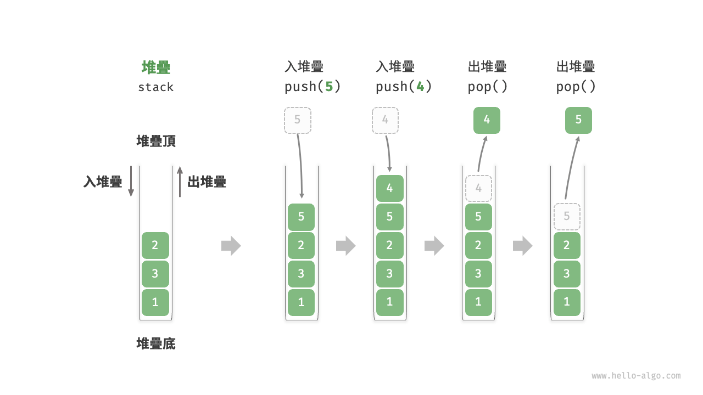
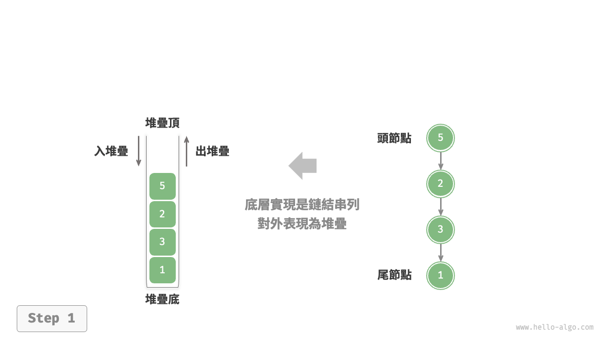
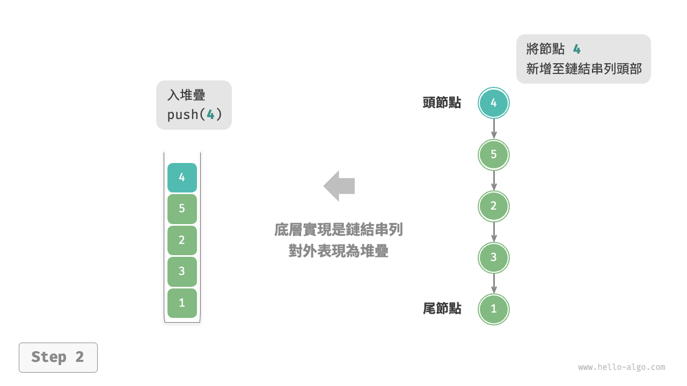
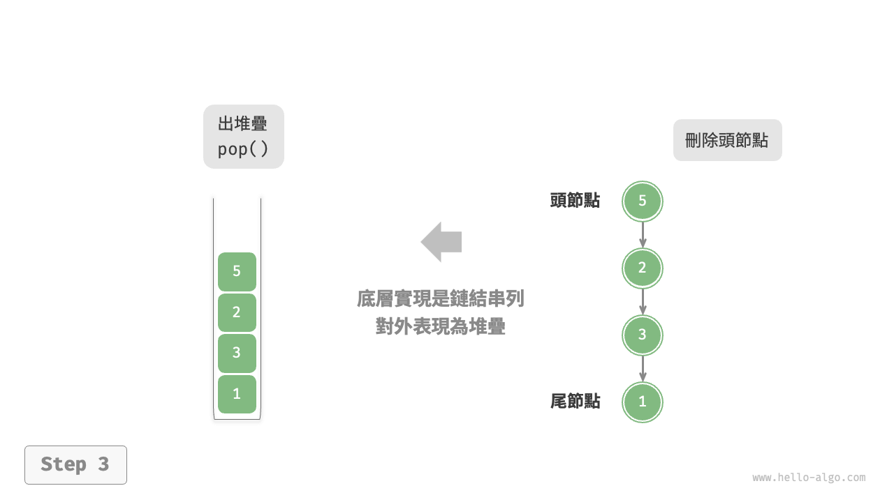
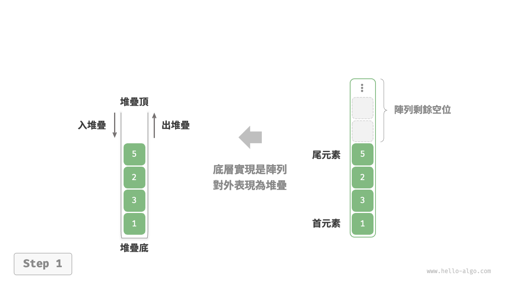
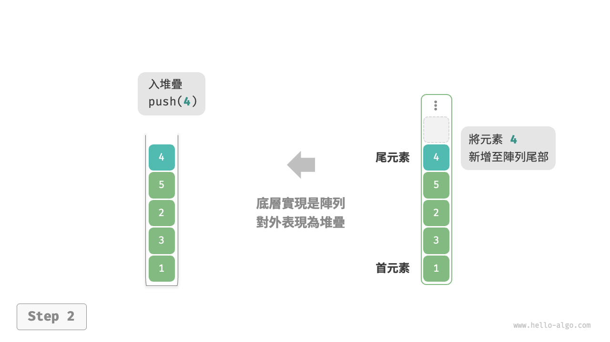
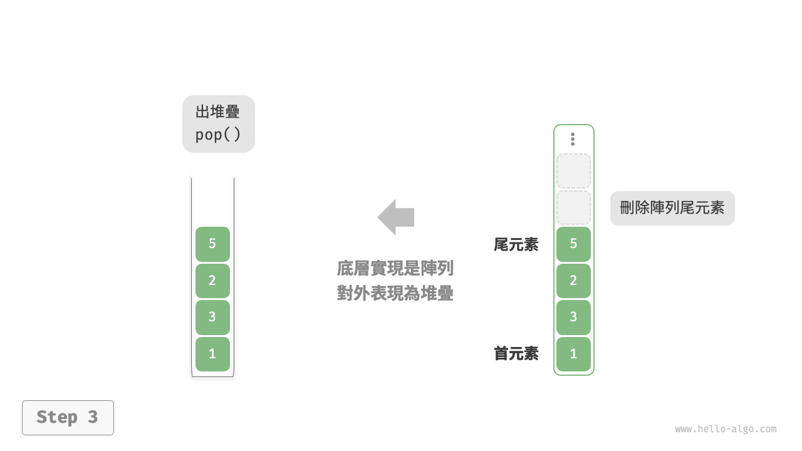

# 5.1 &nbsp; 堆疊

<u>堆疊（stack）</u>是一種遵循先入後出邏輯的線性資料結構。

我們可以將堆疊類比為桌面上的一疊盤子，如果想取出底部的盤子，則需要先將上面的盤子依次移走。我們將盤子替換為各種型別的元素（如整數、字元、物件等），就得到了堆疊這種資料結構。

如圖 5-1 所示，我們把堆積疊元素的頂部稱為“堆疊頂”，底部稱為“堆疊底”。將把元素新增到堆疊頂的操作叫作“入堆疊”，刪除堆疊頂元素的操作叫作“出堆疊”。

{ class="animation-figure" }

<p align="center"> 圖 5-1 &nbsp; 堆疊的先入後出規則 </p>

## 5.1.1 &nbsp; 堆疊的常用操作

堆疊的常用操作如表 5-1 所示，具體的方法名需要根據所使用的程式語言來確定。在此，我們以常見的 `push()`、`pop()`、`peek()` 命名為例。

<p align="center"> 表 5-1 &nbsp; 堆疊的操作效率 </p>

<div class="center-table" markdown>

| 方法     | 描述                   | 時間複雜度 |
| -------- | ---------------------- | ---------- |
| `push()` | 元素入堆疊（新增至堆疊頂） | $O(1)$     |
| `pop()`  | 堆疊頂元素出堆疊           | $O(1)$     |
| `peek()` | 訪問堆疊頂元素           | $O(1)$     |

</div>

通常情況下，我們可以直接使用程式語言內建的堆疊類別。然而，某些語言可能沒有專門提供堆疊類別，這時我們可以將該語言的“陣列”或“鏈結串列”當作堆疊來使用，並在程式邏輯上忽略與堆疊無關的操作。

=== "Python"

    ```python title="stack.py"
    # 初始化堆疊
    # Python 沒有內建的堆疊類別，可以把 list 當作堆疊來使用
    stack: list[int] = []

    # 元素入堆疊
    stack.append(1)
    stack.append(3)
    stack.append(2)
    stack.append(5)
    stack.append(4)

    # 訪問堆疊頂元素
    peek: int = stack[-1]

    # 元素出堆疊
    pop: int = stack.pop()

    # 獲取堆疊的長度
    size: int = len(stack)

    # 判斷是否為空
    is_empty: bool = len(stack) == 0
    ```

=== "C++"

    ```cpp title="stack.cpp"
    /* 初始化堆疊 */
    stack<int> stack;

    /* 元素入堆疊 */
    stack.push(1);
    stack.push(3);
    stack.push(2);
    stack.push(5);
    stack.push(4);

    /* 訪問堆疊頂元素 */
    int top = stack.top();

    /* 元素出堆疊 */
    stack.pop(); // 無返回值

    /* 獲取堆疊的長度 */
    int size = stack.size();

    /* 判斷是否為空 */
    bool empty = stack.empty();
    ```

=== "Java"

    ```java title="stack.java"
    /* 初始化堆疊 */
    Stack<Integer> stack = new Stack<>();

    /* 元素入堆疊 */
    stack.push(1);
    stack.push(3);
    stack.push(2);
    stack.push(5);
    stack.push(4);

    /* 訪問堆疊頂元素 */
    int peek = stack.peek();

    /* 元素出堆疊 */
    int pop = stack.pop();

    /* 獲取堆疊的長度 */
    int size = stack.size();

    /* 判斷是否為空 */
    boolean isEmpty = stack.isEmpty();
    ```

=== "C#"

    ```csharp title="stack.cs"
    /* 初始化堆疊 */
    Stack<int> stack = new();

    /* 元素入堆疊 */
    stack.Push(1);
    stack.Push(3);
    stack.Push(2);
    stack.Push(5);
    stack.Push(4);

    /* 訪問堆疊頂元素 */
    int peek = stack.Peek();

    /* 元素出堆疊 */
    int pop = stack.Pop();

    /* 獲取堆疊的長度 */
    int size = stack.Count;

    /* 判斷是否為空 */
    bool isEmpty = stack.Count == 0;
    ```

=== "Go"

    ```go title="stack_test.go"
    /* 初始化堆疊 */
    // 在 Go 中，推薦將 Slice 當作堆疊來使用
    var stack []int

    /* 元素入堆疊 */
    stack = append(stack, 1)
    stack = append(stack, 3)
    stack = append(stack, 2)
    stack = append(stack, 5)
    stack = append(stack, 4)

    /* 訪問堆疊頂元素 */
    peek := stack[len(stack)-1]

    /* 元素出堆疊 */
    pop := stack[len(stack)-1]
    stack = stack[:len(stack)-1]

    /* 獲取堆疊的長度 */
    size := len(stack)

    /* 判斷是否為空 */
    isEmpty := len(stack) == 0
    ```

=== "Swift"

    ```swift title="stack.swift"
    /* 初始化堆疊 */
    // Swift 沒有內建的堆疊類別，可以把 Array 當作堆疊來使用
    var stack: [Int] = []

    /* 元素入堆疊 */
    stack.append(1)
    stack.append(3)
    stack.append(2)
    stack.append(5)
    stack.append(4)

    /* 訪問堆疊頂元素 */
    let peek = stack.last!

    /* 元素出堆疊 */
    let pop = stack.removeLast()

    /* 獲取堆疊的長度 */
    let size = stack.count

    /* 判斷是否為空 */
    let isEmpty = stack.isEmpty
    ```

=== "JS"

    ```javascript title="stack.js"
    /* 初始化堆疊 */
    // JavaScript 沒有內建的堆疊類別，可以把 Array 當作堆疊來使用
    const stack = [];

    /* 元素入堆疊 */
    stack.push(1);
    stack.push(3);
    stack.push(2);
    stack.push(5);
    stack.push(4);

    /* 訪問堆疊頂元素 */
    const peek = stack[stack.length-1];

    /* 元素出堆疊 */
    const pop = stack.pop();

    /* 獲取堆疊的長度 */
    const size = stack.length;

    /* 判斷是否為空 */
    const is_empty = stack.length === 0;
    ```

=== "TS"

    ```typescript title="stack.ts"
    /* 初始化堆疊 */
    // TypeScript 沒有內建的堆疊類別，可以把 Array 當作堆疊來使用
    const stack: number[] = [];

    /* 元素入堆疊 */
    stack.push(1);
    stack.push(3);
    stack.push(2);
    stack.push(5);
    stack.push(4);

    /* 訪問堆疊頂元素 */
    const peek = stack[stack.length - 1];

    /* 元素出堆疊 */
    const pop = stack.pop();

    /* 獲取堆疊的長度 */
    const size = stack.length;

    /* 判斷是否為空 */
    const is_empty = stack.length === 0;
    ```

=== "Dart"

    ```dart title="stack.dart"
    /* 初始化堆疊 */
    // Dart 沒有內建的堆疊類別，可以把 List 當作堆疊來使用
    List<int> stack = [];

    /* 元素入堆疊 */
    stack.add(1);
    stack.add(3);
    stack.add(2);
    stack.add(5);
    stack.add(4);

    /* 訪問堆疊頂元素 */
    int peek = stack.last;

    /* 元素出堆疊 */
    int pop = stack.removeLast();

    /* 獲取堆疊的長度 */
    int size = stack.length;

    /* 判斷是否為空 */
    bool isEmpty = stack.isEmpty;
    ```

=== "Rust"

    ```rust title="stack.rs"
    /* 初始化堆疊 */
    // 把 Vec 當作堆疊來使用
    let mut stack: Vec<i32> = Vec::new();

    /* 元素入堆疊 */
    stack.push(1);
    stack.push(3);
    stack.push(2);
    stack.push(5);
    stack.push(4);

    /* 訪問堆疊頂元素 */
    let top = stack.last().unwrap();

    /* 元素出堆疊 */
    let pop = stack.pop().unwrap();

    /* 獲取堆疊的長度 */
    let size = stack.len();

    /* 判斷是否為空 */
    let is_empty = stack.is_empty();
    ```

=== "C"

    ```c title="stack.c"
    // C 未提供內建堆疊
    ```

=== "Kotlin"

    ```kotlin title="stack.kt"
    /* 初始化堆疊 */
    val stack = Stack<Int>()

    /* 元素入堆疊 */
    stack.push(1)
    stack.push(3)
    stack.push(2)
    stack.push(5)
    stack.push(4)

    /* 訪問堆疊頂元素 */
    val peek = stack.peek()

    /* 元素出堆疊 */
    val pop = stack.pop()

    /* 獲取堆疊的長度 */
    val size = stack.size

    /* 判斷是否為空 */
    val isEmpty = stack.isEmpty()
    ```

=== "Ruby"

    ```ruby title="stack.rb"
    # 初始化堆疊
    # Ruby 沒有內建的堆疊類別，可以把 Array 當作堆疊來使用
    stack = []

    # 元素入堆疊
    stack << 1
    stack << 3
    stack << 2
    stack << 5
    stack << 4

    # 訪問堆疊頂元素
    peek = stack.last

    # 元素出堆疊
    pop = stack.pop

    # 獲取堆疊的長度
    size = stack.length

    # 判斷是否為空
    is_empty = stack.empty?
    ```

=== "Zig"

    ```zig title="stack.zig"

    ```

??? pythontutor "視覺化執行"

    <div style="height: 549px; width: 100%;"><iframe class="pythontutor-iframe" src="https://pythontutor.com/iframe-embed.html#code=%22%22%22Driver%20Code%22%22%22%0Aif%20__name__%20%3D%3D%20%22__main__%22%3A%0A%20%20%20%20%23%20%E5%88%9D%E5%A7%8B%E5%8C%96%E5%A0%86%E7%96%8A%0A%20%20%20%20%23%20Python%20%E6%B2%92%E6%9C%89%E5%85%A7%E5%BB%BA%E7%9A%84%E5%A0%86%E7%96%8A%E9%A1%9E%E5%88%A5%EF%BC%8C%E5%8F%AF%E4%BB%A5%E6%8A%8A%20list%20%E7%95%B6%E4%BD%9C%E5%A0%86%E7%96%8A%E4%BE%86%E4%BD%BF%E7%94%A8%0A%20%20%20%20stack%20%3D%20%5B%5D%0A%0A%20%20%20%20%23%20%E5%85%83%E7%B4%A0%E5%85%A5%E5%A0%86%E7%96%8A%0A%20%20%20%20stack.append%281%29%0A%20%20%20%20stack.append%283%29%0A%20%20%20%20stack.append%282%29%0A%20%20%20%20stack.append%285%29%0A%20%20%20%20stack.append%284%29%0A%20%20%20%20print%28%22%E5%A0%86%E7%96%8A%20stack%20%3D%22%2C%20stack%29%0A%0A%20%20%20%20%23%20%E8%A8%AA%E5%95%8F%E5%A0%86%E7%96%8A%E9%A0%82%E5%85%83%E7%B4%A0%0A%20%20%20%20peek%20%3D%20stack%5B-1%5D%0A%20%20%20%20print%28%22%E5%A0%86%E7%96%8A%E9%A0%82%E5%85%83%E7%B4%A0%20peek%20%3D%22%2C%20peek%29%0A%0A%20%20%20%20%23%20%E5%85%83%E7%B4%A0%E5%87%BA%E5%A0%86%E7%96%8A%0A%20%20%20%20pop%20%3D%20stack.pop%28%29%0A%20%20%20%20print%28%22%E5%87%BA%E5%A0%86%E7%96%8A%E5%85%83%E7%B4%A0%20pop%20%3D%22%2C%20pop%29%0A%20%20%20%20print%28%22%E5%87%BA%E5%A0%86%E7%96%8A%E5%BE%8C%20stack%20%3D%22%2C%20stack%29%0A%0A%20%20%20%20%23%20%E7%8D%B2%E5%8F%96%E5%A0%86%E7%96%8A%E7%9A%84%E9%95%B7%E5%BA%A6%0A%20%20%20%20size%20%3D%20len%28stack%29%0A%20%20%20%20print%28%22%E5%A0%86%E7%96%8A%E7%9A%84%E9%95%B7%E5%BA%A6%20size%20%3D%22%2C%20size%29%0A%0A%20%20%20%20%23%20%E5%88%A4%E6%96%B7%E6%98%AF%E5%90%A6%E7%82%BA%E7%A9%BA%0A%20%20%20%20is_empty%20%3D%20len%28stack%29%20%3D%3D%200%0A%20%20%20%20print%28%22%E5%A0%86%E7%96%8A%E6%98%AF%E5%90%A6%E7%82%BA%E7%A9%BA%20%3D%22%2C%20is_empty%29&codeDivHeight=472&codeDivWidth=350&cumulative=false&curInstr=2&heapPrimitives=nevernest&origin=opt-frontend.js&py=311&rawInputLstJSON=%5B%5D&textReferences=false"> </iframe></div>
    <div style="margin-top: 5px;"><a href="https://pythontutor.com/iframe-embed.html#code=%22%22%22Driver%20Code%22%22%22%0Aif%20__name__%20%3D%3D%20%22__main__%22%3A%0A%20%20%20%20%23%20%E5%88%9D%E5%A7%8B%E5%8C%96%E5%A0%86%E7%96%8A%0A%20%20%20%20%23%20Python%20%E6%B2%92%E6%9C%89%E5%85%A7%E5%BB%BA%E7%9A%84%E5%A0%86%E7%96%8A%E9%A1%9E%E5%88%A5%EF%BC%8C%E5%8F%AF%E4%BB%A5%E6%8A%8A%20list%20%E7%95%B6%E4%BD%9C%E5%A0%86%E7%96%8A%E4%BE%86%E4%BD%BF%E7%94%A8%0A%20%20%20%20stack%20%3D%20%5B%5D%0A%0A%20%20%20%20%23%20%E5%85%83%E7%B4%A0%E5%85%A5%E5%A0%86%E7%96%8A%0A%20%20%20%20stack.append%281%29%0A%20%20%20%20stack.append%283%29%0A%20%20%20%20stack.append%282%29%0A%20%20%20%20stack.append%285%29%0A%20%20%20%20stack.append%284%29%0A%20%20%20%20print%28%22%E5%A0%86%E7%96%8A%20stack%20%3D%22%2C%20stack%29%0A%0A%20%20%20%20%23%20%E8%A8%AA%E5%95%8F%E5%A0%86%E7%96%8A%E9%A0%82%E5%85%83%E7%B4%A0%0A%20%20%20%20peek%20%3D%20stack%5B-1%5D%0A%20%20%20%20print%28%22%E5%A0%86%E7%96%8A%E9%A0%82%E5%85%83%E7%B4%A0%20peek%20%3D%22%2C%20peek%29%0A%0A%20%20%20%20%23%20%E5%85%83%E7%B4%A0%E5%87%BA%E5%A0%86%E7%96%8A%0A%20%20%20%20pop%20%3D%20stack.pop%28%29%0A%20%20%20%20print%28%22%E5%87%BA%E5%A0%86%E7%96%8A%E5%85%83%E7%B4%A0%20pop%20%3D%22%2C%20pop%29%0A%20%20%20%20print%28%22%E5%87%BA%E5%A0%86%E7%96%8A%E5%BE%8C%20stack%20%3D%22%2C%20stack%29%0A%0A%20%20%20%20%23%20%E7%8D%B2%E5%8F%96%E5%A0%86%E7%96%8A%E7%9A%84%E9%95%B7%E5%BA%A6%0A%20%20%20%20size%20%3D%20len%28stack%29%0A%20%20%20%20print%28%22%E5%A0%86%E7%96%8A%E7%9A%84%E9%95%B7%E5%BA%A6%20size%20%3D%22%2C%20size%29%0A%0A%20%20%20%20%23%20%E5%88%A4%E6%96%B7%E6%98%AF%E5%90%A6%E7%82%BA%E7%A9%BA%0A%20%20%20%20is_empty%20%3D%20len%28stack%29%20%3D%3D%200%0A%20%20%20%20print%28%22%E5%A0%86%E7%96%8A%E6%98%AF%E5%90%A6%E7%82%BA%E7%A9%BA%20%3D%22%2C%20is_empty%29&codeDivHeight=800&codeDivWidth=600&cumulative=false&curInstr=2&heapPrimitives=nevernest&origin=opt-frontend.js&py=311&rawInputLstJSON=%5B%5D&textReferences=false" target="_blank" rel="noopener noreferrer">全螢幕觀看 ></a></div>

## 5.1.2 &nbsp; 堆疊的實現

為了深入瞭解堆疊的執行機制，我們來嘗試自己實現一個堆疊類別。

堆疊遵循先入後出的原則，因此我們只能在堆疊頂新增或刪除元素。然而，陣列和鏈結串列都可以在任意位置新增和刪除元素，**因此堆疊可以視為一種受限制的陣列或鏈結串列**。換句話說，我們可以“遮蔽”陣列或鏈結串列的部分無關操作，使其對外表現的邏輯符合堆疊的特性。

### 1. &nbsp; 基於鏈結串列的實現

使用鏈結串列實現堆疊時，我們可以將鏈結串列的頭節點視為堆疊頂，尾節點視為堆疊底。

如圖 5-2 所示，對於入堆疊操作，我們只需將元素插入鏈結串列頭部，這種節點插入方法被稱為“頭插法”。而對於出堆疊操作，只需將頭節點從鏈結串列中刪除即可。

=== "LinkedListStack"
    { class="animation-figure" }

=== "push()"
    { class="animation-figure" }

=== "pop()"
    { class="animation-figure" }

<p align="center"> 圖 5-2 &nbsp; 基於鏈結串列實現堆疊的入堆疊出堆疊操作 </p>

以下是基於鏈結串列實現堆疊的示例程式碼：

=== "Python"

    ```python title="linkedlist_stack.py"
    class LinkedListStack:
        """基於鏈結串列實現的堆疊"""

        def __init__(self):
            """建構子"""
            self._peek: ListNode | None = None
            self._size: int = 0

        def size(self) -> int:
            """獲取堆疊的長度"""
            return self._size

        def is_empty(self) -> bool:
            """判斷堆疊是否為空"""
            return self._size == 0

        def push(self, val: int):
            """入堆疊"""
            node = ListNode(val)
            node.next = self._peek
            self._peek = node
            self._size += 1

        def pop(self) -> int:
            """出堆疊"""
            num = self.peek()
            self._peek = self._peek.next
            self._size -= 1
            return num

        def peek(self) -> int:
            """訪問堆疊頂元素"""
            if self.is_empty():
                raise IndexError("堆疊為空")
            return self._peek.val

        def to_list(self) -> list[int]:
            """轉化為串列用於列印"""
            arr = []
            node = self._peek
            while node:
                arr.append(node.val)
                node = node.next
            arr.reverse()
            return arr
    ```

=== "C++"

    ```cpp title="linkedlist_stack.cpp"
    /* 基於鏈結串列實現的堆疊 */
    class LinkedListStack {
      private:
        ListNode *stackTop; // 將頭節點作為堆疊頂
        int stkSize;        // 堆疊的長度

      public:
        LinkedListStack() {
            stackTop = nullptr;
            stkSize = 0;
        }

        ~LinkedListStack() {
            // 走訪鏈結串列刪除節點，釋放記憶體
            freeMemoryLinkedList(stackTop);
        }

        /* 獲取堆疊的長度 */
        int size() {
            return stkSize;
        }

        /* 判斷堆疊是否為空 */
        bool isEmpty() {
            return size() == 0;
        }

        /* 入堆疊 */
        void push(int num) {
            ListNode *node = new ListNode(num);
            node->next = stackTop;
            stackTop = node;
            stkSize++;
        }

        /* 出堆疊 */
        int pop() {
            int num = top();
            ListNode *tmp = stackTop;
            stackTop = stackTop->next;
            // 釋放記憶體
            delete tmp;
            stkSize--;
            return num;
        }

        /* 訪問堆疊頂元素 */
        int top() {
            if (isEmpty())
                throw out_of_range("堆疊為空");
            return stackTop->val;
        }

        /* 將 List 轉化為 Array 並返回 */
        vector<int> toVector() {
            ListNode *node = stackTop;
            vector<int> res(size());
            for (int i = res.size() - 1; i >= 0; i--) {
                res[i] = node->val;
                node = node->next;
            }
            return res;
        }
    };
    ```

=== "Java"

    ```java title="linkedlist_stack.java"
    /* 基於鏈結串列實現的堆疊 */
    class LinkedListStack {
        private ListNode stackPeek; // 將頭節點作為堆疊頂
        private int stkSize = 0; // 堆疊的長度

        public LinkedListStack() {
            stackPeek = null;
        }

        /* 獲取堆疊的長度 */
        public int size() {
            return stkSize;
        }

        /* 判斷堆疊是否為空 */
        public boolean isEmpty() {
            return size() == 0;
        }

        /* 入堆疊 */
        public void push(int num) {
            ListNode node = new ListNode(num);
            node.next = stackPeek;
            stackPeek = node;
            stkSize++;
        }

        /* 出堆疊 */
        public int pop() {
            int num = peek();
            stackPeek = stackPeek.next;
            stkSize--;
            return num;
        }

        /* 訪問堆疊頂元素 */
        public int peek() {
            if (isEmpty())
                throw new IndexOutOfBoundsException();
            return stackPeek.val;
        }

        /* 將 List 轉化為 Array 並返回 */
        public int[] toArray() {
            ListNode node = stackPeek;
            int[] res = new int[size()];
            for (int i = res.length - 1; i >= 0; i--) {
                res[i] = node.val;
                node = node.next;
            }
            return res;
        }
    }
    ```

=== "C#"

    ```csharp title="linkedlist_stack.cs"
    /* 基於鏈結串列實現的堆疊 */
    class LinkedListStack {
        ListNode? stackPeek;  // 將頭節點作為堆疊頂
        int stkSize = 0;   // 堆疊的長度

        public LinkedListStack() {
            stackPeek = null;
        }

        /* 獲取堆疊的長度 */
        public int Size() {
            return stkSize;
        }

        /* 判斷堆疊是否為空 */
        public bool IsEmpty() {
            return Size() == 0;
        }

        /* 入堆疊 */
        public void Push(int num) {
            ListNode node = new(num) {
                next = stackPeek
            };
            stackPeek = node;
            stkSize++;
        }

        /* 出堆疊 */
        public int Pop() {
            int num = Peek();
            stackPeek = stackPeek!.next;
            stkSize--;
            return num;
        }

        /* 訪問堆疊頂元素 */
        public int Peek() {
            if (IsEmpty())
                throw new Exception();
            return stackPeek!.val;
        }

        /* 將 List 轉化為 Array 並返回 */
        public int[] ToArray() {
            if (stackPeek == null)
                return [];

            ListNode? node = stackPeek;
            int[] res = new int[Size()];
            for (int i = res.Length - 1; i >= 0; i--) {
                res[i] = node!.val;
                node = node.next;
            }
            return res;
        }
    }
    ```

=== "Go"

    ```go title="linkedlist_stack.go"
    /* 基於鏈結串列實現的堆疊 */
    type linkedListStack struct {
        // 使用內建包 list 來實現堆疊
        data *list.List
    }

    /* 初始化堆疊 */
    func newLinkedListStack() *linkedListStack {
        return &linkedListStack{
            data: list.New(),
        }
    }

    /* 入堆疊 */
    func (s *linkedListStack) push(value int) {
        s.data.PushBack(value)
    }

    /* 出堆疊 */
    func (s *linkedListStack) pop() any {
        if s.isEmpty() {
            return nil
        }
        e := s.data.Back()
        s.data.Remove(e)
        return e.Value
    }

    /* 訪問堆疊頂元素 */
    func (s *linkedListStack) peek() any {
        if s.isEmpty() {
            return nil
        }
        e := s.data.Back()
        return e.Value
    }

    /* 獲取堆疊的長度 */
    func (s *linkedListStack) size() int {
        return s.data.Len()
    }

    /* 判斷堆疊是否為空 */
    func (s *linkedListStack) isEmpty() bool {
        return s.data.Len() == 0
    }

    /* 獲取 List 用於列印 */
    func (s *linkedListStack) toList() *list.List {
        return s.data
    }
    ```

=== "Swift"

    ```swift title="linkedlist_stack.swift"
    /* 基於鏈結串列實現的堆疊 */
    class LinkedListStack {
        private var _peek: ListNode? // 將頭節點作為堆疊頂
        private var _size: Int // 堆疊的長度

        init() {
            _size = 0
        }

        /* 獲取堆疊的長度 */
        func size() -> Int {
            _size
        }

        /* 判斷堆疊是否為空 */
        func isEmpty() -> Bool {
            size() == 0
        }

        /* 入堆疊 */
        func push(num: Int) {
            let node = ListNode(x: num)
            node.next = _peek
            _peek = node
            _size += 1
        }

        /* 出堆疊 */
        @discardableResult
        func pop() -> Int {
            let num = peek()
            _peek = _peek?.next
            _size -= 1
            return num
        }

        /* 訪問堆疊頂元素 */
        func peek() -> Int {
            if isEmpty() {
                fatalError("堆疊為空")
            }
            return _peek!.val
        }

        /* 將 List 轉化為 Array 並返回 */
        func toArray() -> [Int] {
            var node = _peek
            var res = Array(repeating: 0, count: size())
            for i in res.indices.reversed() {
                res[i] = node!.val
                node = node?.next
            }
            return res
        }
    }
    ```

=== "JS"

    ```javascript title="linkedlist_stack.js"
    /* 基於鏈結串列實現的堆疊 */
    class LinkedListStack {
        #stackPeek; // 將頭節點作為堆疊頂
        #stkSize = 0; // 堆疊的長度

        constructor() {
            this.#stackPeek = null;
        }

        /* 獲取堆疊的長度 */
        get size() {
            return this.#stkSize;
        }

        /* 判斷堆疊是否為空 */
        isEmpty() {
            return this.size === 0;
        }

        /* 入堆疊 */
        push(num) {
            const node = new ListNode(num);
            node.next = this.#stackPeek;
            this.#stackPeek = node;
            this.#stkSize++;
        }

        /* 出堆疊 */
        pop() {
            const num = this.peek();
            this.#stackPeek = this.#stackPeek.next;
            this.#stkSize--;
            return num;
        }

        /* 訪問堆疊頂元素 */
        peek() {
            if (!this.#stackPeek) throw new Error('堆疊為空');
            return this.#stackPeek.val;
        }

        /* 將鏈結串列轉化為 Array 並返回 */
        toArray() {
            let node = this.#stackPeek;
            const res = new Array(this.size);
            for (let i = res.length - 1; i >= 0; i--) {
                res[i] = node.val;
                node = node.next;
            }
            return res;
        }
    }
    ```

=== "TS"

    ```typescript title="linkedlist_stack.ts"
    /* 基於鏈結串列實現的堆疊 */
    class LinkedListStack {
        private stackPeek: ListNode | null; // 將頭節點作為堆疊頂
        private stkSize: number = 0; // 堆疊的長度

        constructor() {
            this.stackPeek = null;
        }

        /* 獲取堆疊的長度 */
        get size(): number {
            return this.stkSize;
        }

        /* 判斷堆疊是否為空 */
        isEmpty(): boolean {
            return this.size === 0;
        }

        /* 入堆疊 */
        push(num: number): void {
            const node = new ListNode(num);
            node.next = this.stackPeek;
            this.stackPeek = node;
            this.stkSize++;
        }

        /* 出堆疊 */
        pop(): number {
            const num = this.peek();
            if (!this.stackPeek) throw new Error('堆疊為空');
            this.stackPeek = this.stackPeek.next;
            this.stkSize--;
            return num;
        }

        /* 訪問堆疊頂元素 */
        peek(): number {
            if (!this.stackPeek) throw new Error('堆疊為空');
            return this.stackPeek.val;
        }

        /* 將鏈結串列轉化為 Array 並返回 */
        toArray(): number[] {
            let node = this.stackPeek;
            const res = new Array<number>(this.size);
            for (let i = res.length - 1; i >= 0; i--) {
                res[i] = node!.val;
                node = node!.next;
            }
            return res;
        }
    }
    ```

=== "Dart"

    ```dart title="linkedlist_stack.dart"
    /* 基於鏈結串列類別實現的堆疊 */
    class LinkedListStack {
      ListNode? _stackPeek; // 將頭節點作為堆疊頂
      int _stkSize = 0; // 堆疊的長度

      LinkedListStack() {
        _stackPeek = null;
      }

      /* 獲取堆疊的長度 */
      int size() {
        return _stkSize;
      }

      /* 判斷堆疊是否為空 */
      bool isEmpty() {
        return _stkSize == 0;
      }

      /* 入堆疊 */
      void push(int _num) {
        final ListNode node = ListNode(_num);
        node.next = _stackPeek;
        _stackPeek = node;
        _stkSize++;
      }

      /* 出堆疊 */
      int pop() {
        final int _num = peek();
        _stackPeek = _stackPeek!.next;
        _stkSize--;
        return _num;
      }

      /* 訪問堆疊頂元素 */
      int peek() {
        if (_stackPeek == null) {
          throw Exception("堆疊為空");
        }
        return _stackPeek!.val;
      }

      /* 將鏈結串列轉化為 List 並返回 */
      List<int> toList() {
        ListNode? node = _stackPeek;
        List<int> list = [];
        while (node != null) {
          list.add(node.val);
          node = node.next;
        }
        list = list.reversed.toList();
        return list;
      }
    }
    ```

=== "Rust"

    ```rust title="linkedlist_stack.rs"
    /* 基於鏈結串列實現的堆疊 */
    #[allow(dead_code)]
    pub struct LinkedListStack<T> {
        stack_peek: Option<Rc<RefCell<ListNode<T>>>>, // 將頭節點作為堆疊頂
        stk_size: usize,                              // 堆疊的長度
    }

    impl<T: Copy> LinkedListStack<T> {
        pub fn new() -> Self {
            Self {
                stack_peek: None,
                stk_size: 0,
            }
        }

        /* 獲取堆疊的長度 */
        pub fn size(&self) -> usize {
            return self.stk_size;
        }

        /* 判斷堆疊是否為空 */
        pub fn is_empty(&self) -> bool {
            return self.size() == 0;
        }

        /* 入堆疊 */
        pub fn push(&mut self, num: T) {
            let node = ListNode::new(num);
            node.borrow_mut().next = self.stack_peek.take();
            self.stack_peek = Some(node);
            self.stk_size += 1;
        }

        /* 出堆疊 */
        pub fn pop(&mut self) -> Option<T> {
            self.stack_peek.take().map(|old_head| {
                match old_head.borrow_mut().next.take() {
                    Some(new_head) => {
                        self.stack_peek = Some(new_head);
                    }
                    None => {
                        self.stack_peek = None;
                    }
                }
                self.stk_size -= 1;
                Rc::try_unwrap(old_head).ok().unwrap().into_inner().val
            })
        }

        /* 訪問堆疊頂元素 */
        pub fn peek(&self) -> Option<&Rc<RefCell<ListNode<T>>>> {
            self.stack_peek.as_ref()
        }

        /* 將 List 轉化為 Array 並返回 */
        pub fn to_array(&self, head: Option<&Rc<RefCell<ListNode<T>>>>) -> Vec<T> {
            if let Some(node) = head {
                let mut nums = self.to_array(node.borrow().next.as_ref());
                nums.push(node.borrow().val);
                return nums;
            }
            return Vec::new();
        }
    }
    ```

=== "C"

    ```c title="linkedlist_stack.c"
    /* 基於鏈結串列實現的堆疊 */
    typedef struct {
        ListNode *top; // 將頭節點作為堆疊頂
        int size;      // 堆疊的長度
    } LinkedListStack;

    /* 建構子 */
    LinkedListStack *newLinkedListStack() {
        LinkedListStack *s = malloc(sizeof(LinkedListStack));
        s->top = NULL;
        s->size = 0;
        return s;
    }

    /* 析構函式 */
    void delLinkedListStack(LinkedListStack *s) {
        while (s->top) {
            ListNode *n = s->top->next;
            free(s->top);
            s->top = n;
        }
        free(s);
    }

    /* 獲取堆疊的長度 */
    int size(LinkedListStack *s) {
        return s->size;
    }

    /* 判斷堆疊是否為空 */
    bool isEmpty(LinkedListStack *s) {
        return size(s) == 0;
    }

    /* 入堆疊 */
    void push(LinkedListStack *s, int num) {
        ListNode *node = (ListNode *)malloc(sizeof(ListNode));
        node->next = s->top; // 更新新加節點指標域
        node->val = num;     // 更新新加節點資料域
        s->top = node;       // 更新堆疊頂
        s->size++;           // 更新堆疊大小
    }

    /* 訪問堆疊頂元素 */
    int peek(LinkedListStack *s) {
        if (s->size == 0) {
            printf("堆疊為空\n");
            return INT_MAX;
        }
        return s->top->val;
    }

    /* 出堆疊 */
    int pop(LinkedListStack *s) {
        int val = peek(s);
        ListNode *tmp = s->top;
        s->top = s->top->next;
        // 釋放記憶體
        free(tmp);
        s->size--;
        return val;
    }
    ```

=== "Kotlin"

    ```kotlin title="linkedlist_stack.kt"
    /* 基於鏈結串列實現的堆疊 */
    class LinkedListStack(
        private var stackPeek: ListNode? = null, // 將頭節點作為堆疊頂
        private var stkSize: Int = 0 // 堆疊的長度
    ) {

        /* 獲取堆疊的長度 */
        fun size(): Int {
            return stkSize
        }

        /* 判斷堆疊是否為空 */
        fun isEmpty(): Boolean {
            return size() == 0
        }

        /* 入堆疊 */
        fun push(num: Int) {
            val node = ListNode(num)
            node.next = stackPeek
            stackPeek = node
            stkSize++
        }

        /* 出堆疊 */
        fun pop(): Int? {
            val num = peek()
            stackPeek = stackPeek?.next
            stkSize--
            return num
        }

        /* 訪問堆疊頂元素 */
        fun peek(): Int? {
            if (isEmpty()) throw IndexOutOfBoundsException()
            return stackPeek?._val
        }

        /* 將 List 轉化為 Array 並返回 */
        fun toArray(): IntArray {
            var node = stackPeek
            val res = IntArray(size())
            for (i in res.size - 1 downTo 0) {
                res[i] = node?._val!!
                node = node.next
            }
            return res
        }
    }
    ```

=== "Ruby"

    ```ruby title="linkedlist_stack.rb"
    ### 基於鏈結串列實現的堆疊 ###
    class LinkedListStack
      attr_reader :size

      ### 建構子 ###
      def initialize
        @size = 0
      end

      ### 判斷堆疊是否為空 ###
      def is_empty?
        @peek.nil?
      end

      ### 入堆疊 ###
      def push(val)
        node = ListNode.new(val)
        node.next = @peek
        @peek = node
        @size += 1
      end

      ### 出堆疊 ###
      def pop
        num = peek
        @peek = @peek.next
        @size -= 1
        num
      end

      ### 訪問堆疊頂元素 ###
      def peek
        raise IndexError, '堆疊為空' if is_empty?

        @peek.val
      end

      ### 將鏈結串列轉化為 Array 並反回 ###
      def to_array
        arr = []
        node = @peek
        while node
          arr << node.val
          node = node.next
        end
        arr.reverse
      end
    end
    ```

=== "Zig"

    ```zig title="linkedlist_stack.zig"
    // 基於鏈結串列實現的堆疊
    fn LinkedListStack(comptime T: type) type {
        return struct {
            const Self = @This();

            stack_top: ?*inc.ListNode(T) = null,             // 將頭節點作為堆疊頂
            stk_size: usize = 0,                             // 堆疊的長度
            mem_arena: ?std.heap.ArenaAllocator = null,
            mem_allocator: std.mem.Allocator = undefined,    // 記憶體分配器

            // 建構子（分配記憶體+初始化堆疊）
            pub fn init(self: *Self, allocator: std.mem.Allocator) !void {
                if (self.mem_arena == null) {
                    self.mem_arena = std.heap.ArenaAllocator.init(allocator);
                    self.mem_allocator = self.mem_arena.?.allocator();
                }
                self.stack_top = null;
                self.stk_size = 0;
            }

            // 析構函式（釋放記憶體）
            pub fn deinit(self: *Self) void {
                if (self.mem_arena == null) return;
                self.mem_arena.?.deinit();
            }

            // 獲取堆疊的長度
            pub fn size(self: *Self) usize {
                return self.stk_size;
            }

            // 判斷堆疊是否為空
            pub fn isEmpty(self: *Self) bool {
                return self.size() == 0;
            }

            // 訪問堆疊頂元素
            pub fn peek(self: *Self) T {
                if (self.size() == 0) @panic("堆疊為空");
                return self.stack_top.?.val;
            }  

            // 入堆疊
            pub fn push(self: *Self, num: T) !void {
                var node = try self.mem_allocator.create(inc.ListNode(T));
                node.init(num);
                node.next = self.stack_top;
                self.stack_top = node;
                self.stk_size += 1;
            } 

            // 出堆疊
            pub fn pop(self: *Self) T {
                var num = self.peek();
                self.stack_top = self.stack_top.?.next;
                self.stk_size -= 1;
                return num;
            } 

            // 將堆疊轉換為陣列
            pub fn toArray(self: *Self) ![]T {
                var node = self.stack_top;
                var res = try self.mem_allocator.alloc(T, self.size());
                @memset(res, @as(T, 0));
                var i: usize = 0;
                while (i < res.len) : (i += 1) {
                    res[res.len - i - 1] = node.?.val;
                    node = node.?.next;
                }
                return res;
            }
        };
    }
    ```

??? pythontutor "視覺化執行"

    <div style="height: 549px; width: 100%;"><iframe class="pythontutor-iframe" src="https://pythontutor.com/iframe-embed.html#code=class%20ListNode%3A%0A%20%20%20%20%22%22%22%E9%8F%88%E7%B5%90%E4%B8%B2%E5%88%97%E7%AF%80%E9%BB%9E%E9%A1%9E%E5%88%A5%22%22%22%0A%20%20%20%20def%20__init__%28self%2C%20val%3A%20int%29%3A%0A%20%20%20%20%20%20%20%20self.val%3A%20int%20%3D%20val%20%20%23%20%E7%AF%80%E9%BB%9E%E5%80%BC%0A%20%20%20%20%20%20%20%20self.next%3A%20ListNode%20%7C%20None%20%3D%20None%20%20%23%20%E5%BE%8C%E7%B9%BC%E7%AF%80%E9%BB%9E%E5%BC%95%E7%94%A8%0A%0A%0Aclass%20LinkedListStack%3A%0A%20%20%20%20%22%22%22%E5%9F%BA%E6%96%BC%E9%8F%88%E7%B5%90%E4%B8%B2%E5%88%97%E5%AF%A6%E7%8F%BE%E7%9A%84%E5%A0%86%E7%96%8A%22%22%22%0A%0A%20%20%20%20def%20__init__%28self%29%3A%0A%20%20%20%20%20%20%20%20%22%22%22%E5%BB%BA%E6%A7%8B%E5%AD%90%22%22%22%0A%20%20%20%20%20%20%20%20self._peek%3A%20ListNode%20%7C%20None%20%3D%20None%0A%20%20%20%20%20%20%20%20self._size%3A%20int%20%3D%200%0A%0A%20%20%20%20def%20size%28self%29%20-%3E%20int%3A%0A%20%20%20%20%20%20%20%20%22%22%22%E7%8D%B2%E5%8F%96%E5%A0%86%E7%96%8A%E7%9A%84%E9%95%B7%E5%BA%A6%22%22%22%0A%20%20%20%20%20%20%20%20return%20self._size%0A%0A%20%20%20%20def%20is_empty%28self%29%20-%3E%20bool%3A%0A%20%20%20%20%20%20%20%20%22%22%22%E5%88%A4%E6%96%B7%E5%A0%86%E7%96%8A%E6%98%AF%E5%90%A6%E7%82%BA%E7%A9%BA%22%22%22%0A%20%20%20%20%20%20%20%20return%20not%20self._peek%0A%0A%20%20%20%20def%20push%28self%2C%20val%3A%20int%29%3A%0A%20%20%20%20%20%20%20%20%22%22%22%E5%85%A5%E5%A0%86%E7%96%8A%22%22%22%0A%20%20%20%20%20%20%20%20node%20%3D%20ListNode%28val%29%0A%20%20%20%20%20%20%20%20node.next%20%3D%20self._peek%0A%20%20%20%20%20%20%20%20self._peek%20%3D%20node%0A%20%20%20%20%20%20%20%20self._size%20%2B%3D%201%0A%0A%20%20%20%20def%20pop%28self%29%20-%3E%20int%3A%0A%20%20%20%20%20%20%20%20%22%22%22%E5%87%BA%E5%A0%86%E7%96%8A%22%22%22%0A%20%20%20%20%20%20%20%20num%20%3D%20self.peek%28%29%0A%20%20%20%20%20%20%20%20self._peek%20%3D%20self._peek.next%0A%20%20%20%20%20%20%20%20self._size%20-%3D%201%0A%20%20%20%20%20%20%20%20return%20num%0A%0A%20%20%20%20def%20peek%28self%29%20-%3E%20int%3A%0A%20%20%20%20%20%20%20%20%22%22%22%E8%A8%AA%E5%95%8F%E5%A0%86%E7%96%8A%E9%A0%82%E5%85%83%E7%B4%A0%22%22%22%0A%20%20%20%20%20%20%20%20if%20self.is_empty%28%29%3A%0A%20%20%20%20%20%20%20%20%20%20%20%20raise%20IndexError%28%22%E5%A0%86%E7%96%8A%E7%82%BA%E7%A9%BA%22%29%0A%20%20%20%20%20%20%20%20return%20self._peek.val%0A%0A%20%20%20%20def%20to_list%28self%29%20-%3E%20list%5Bint%5D%3A%0A%20%20%20%20%20%20%20%20%22%22%22%E8%BD%89%E5%8C%96%E7%82%BA%E4%B8%B2%E5%88%97%E7%94%A8%E6%96%BC%E5%88%97%E5%8D%B0%22%22%22%0A%20%20%20%20%20%20%20%20arr%20%3D%20%5B%5D%0A%20%20%20%20%20%20%20%20node%20%3D%20self._peek%0A%20%20%20%20%20%20%20%20while%20node%3A%0A%20%20%20%20%20%20%20%20%20%20%20%20arr.append%28node.val%29%0A%20%20%20%20%20%20%20%20%20%20%20%20node%20%3D%20node.next%0A%20%20%20%20%20%20%20%20arr.reverse%28%29%0A%20%20%20%20%20%20%20%20return%20arr%0A%0A%0A%22%22%22Driver%20Code%22%22%22%0Aif%20__name__%20%3D%3D%20%22__main__%22%3A%0A%20%20%20%20%23%20%E5%88%9D%E5%A7%8B%E5%8C%96%E5%A0%86%E7%96%8A%0A%20%20%20%20stack%20%3D%20LinkedListStack%28%29%0A%0A%20%20%20%20%23%20%E5%85%83%E7%B4%A0%E5%85%A5%E5%A0%86%E7%96%8A%0A%20%20%20%20stack.push%281%29%0A%20%20%20%20stack.push%283%29%0A%20%20%20%20stack.push%282%29%0A%20%20%20%20stack.push%285%29%0A%20%20%20%20stack.push%284%29%0A%20%20%20%20print%28%22%E5%A0%86%E7%96%8A%20stack%20%3D%22%2C%20stack.to_list%28%29%29%0A%0A%20%20%20%20%23%20%E8%A8%AA%E5%95%8F%E5%A0%86%E7%96%8A%E9%A0%82%E5%85%83%E7%B4%A0%0A%20%20%20%20peek%20%3D%20stack.peek%28%29%0A%20%20%20%20print%28%22%E5%A0%86%E7%96%8A%E9%A0%82%E5%85%83%E7%B4%A0%20peek%20%3D%22%2C%20peek%29%0A%0A%20%20%20%20%23%20%E5%85%83%E7%B4%A0%E5%87%BA%E5%A0%86%E7%96%8A%0A%20%20%20%20pop%20%3D%20stack.pop%28%29%0A%20%20%20%20print%28%22%E5%87%BA%E5%A0%86%E7%96%8A%E5%85%83%E7%B4%A0%20pop%20%3D%22%2C%20pop%29%0A%20%20%20%20print%28%22%E5%87%BA%E5%A0%86%E7%96%8A%E5%BE%8C%20stack%20%3D%22%2C%20stack.to_list%28%29%29%0A%0A%20%20%20%20%23%20%E7%8D%B2%E5%8F%96%E5%A0%86%E7%96%8A%E7%9A%84%E9%95%B7%E5%BA%A6%0A%20%20%20%20size%20%3D%20stack.size%28%29%0A%20%20%20%20print%28%22%E5%A0%86%E7%96%8A%E7%9A%84%E9%95%B7%E5%BA%A6%20size%20%3D%22%2C%20size%29%0A%0A%20%20%20%20%23%20%E5%88%A4%E6%96%B7%E6%98%AF%E5%90%A6%E7%82%BA%E7%A9%BA%0A%20%20%20%20is_empty%20%3D%20stack.is_empty%28%29%0A%20%20%20%20print%28%22%E5%A0%86%E7%96%8A%E6%98%AF%E5%90%A6%E7%82%BA%E7%A9%BA%20%3D%22%2C%20is_empty%29&codeDivHeight=472&codeDivWidth=350&cumulative=false&curInstr=4&heapPrimitives=nevernest&origin=opt-frontend.js&py=311&rawInputLstJSON=%5B%5D&textReferences=false"> </iframe></div>
    <div style="margin-top: 5px;"><a href="https://pythontutor.com/iframe-embed.html#code=class%20ListNode%3A%0A%20%20%20%20%22%22%22%E9%8F%88%E7%B5%90%E4%B8%B2%E5%88%97%E7%AF%80%E9%BB%9E%E9%A1%9E%E5%88%A5%22%22%22%0A%20%20%20%20def%20__init__%28self%2C%20val%3A%20int%29%3A%0A%20%20%20%20%20%20%20%20self.val%3A%20int%20%3D%20val%20%20%23%20%E7%AF%80%E9%BB%9E%E5%80%BC%0A%20%20%20%20%20%20%20%20self.next%3A%20ListNode%20%7C%20None%20%3D%20None%20%20%23%20%E5%BE%8C%E7%B9%BC%E7%AF%80%E9%BB%9E%E5%BC%95%E7%94%A8%0A%0A%0Aclass%20LinkedListStack%3A%0A%20%20%20%20%22%22%22%E5%9F%BA%E6%96%BC%E9%8F%88%E7%B5%90%E4%B8%B2%E5%88%97%E5%AF%A6%E7%8F%BE%E7%9A%84%E5%A0%86%E7%96%8A%22%22%22%0A%0A%20%20%20%20def%20__init__%28self%29%3A%0A%20%20%20%20%20%20%20%20%22%22%22%E5%BB%BA%E6%A7%8B%E5%AD%90%22%22%22%0A%20%20%20%20%20%20%20%20self._peek%3A%20ListNode%20%7C%20None%20%3D%20None%0A%20%20%20%20%20%20%20%20self._size%3A%20int%20%3D%200%0A%0A%20%20%20%20def%20size%28self%29%20-%3E%20int%3A%0A%20%20%20%20%20%20%20%20%22%22%22%E7%8D%B2%E5%8F%96%E5%A0%86%E7%96%8A%E7%9A%84%E9%95%B7%E5%BA%A6%22%22%22%0A%20%20%20%20%20%20%20%20return%20self._size%0A%0A%20%20%20%20def%20is_empty%28self%29%20-%3E%20bool%3A%0A%20%20%20%20%20%20%20%20%22%22%22%E5%88%A4%E6%96%B7%E5%A0%86%E7%96%8A%E6%98%AF%E5%90%A6%E7%82%BA%E7%A9%BA%22%22%22%0A%20%20%20%20%20%20%20%20return%20not%20self._peek%0A%0A%20%20%20%20def%20push%28self%2C%20val%3A%20int%29%3A%0A%20%20%20%20%20%20%20%20%22%22%22%E5%85%A5%E5%A0%86%E7%96%8A%22%22%22%0A%20%20%20%20%20%20%20%20node%20%3D%20ListNode%28val%29%0A%20%20%20%20%20%20%20%20node.next%20%3D%20self._peek%0A%20%20%20%20%20%20%20%20self._peek%20%3D%20node%0A%20%20%20%20%20%20%20%20self._size%20%2B%3D%201%0A%0A%20%20%20%20def%20pop%28self%29%20-%3E%20int%3A%0A%20%20%20%20%20%20%20%20%22%22%22%E5%87%BA%E5%A0%86%E7%96%8A%22%22%22%0A%20%20%20%20%20%20%20%20num%20%3D%20self.peek%28%29%0A%20%20%20%20%20%20%20%20self._peek%20%3D%20self._peek.next%0A%20%20%20%20%20%20%20%20self._size%20-%3D%201%0A%20%20%20%20%20%20%20%20return%20num%0A%0A%20%20%20%20def%20peek%28self%29%20-%3E%20int%3A%0A%20%20%20%20%20%20%20%20%22%22%22%E8%A8%AA%E5%95%8F%E5%A0%86%E7%96%8A%E9%A0%82%E5%85%83%E7%B4%A0%22%22%22%0A%20%20%20%20%20%20%20%20if%20self.is_empty%28%29%3A%0A%20%20%20%20%20%20%20%20%20%20%20%20raise%20IndexError%28%22%E5%A0%86%E7%96%8A%E7%82%BA%E7%A9%BA%22%29%0A%20%20%20%20%20%20%20%20return%20self._peek.val%0A%0A%20%20%20%20def%20to_list%28self%29%20-%3E%20list%5Bint%5D%3A%0A%20%20%20%20%20%20%20%20%22%22%22%E8%BD%89%E5%8C%96%E7%82%BA%E4%B8%B2%E5%88%97%E7%94%A8%E6%96%BC%E5%88%97%E5%8D%B0%22%22%22%0A%20%20%20%20%20%20%20%20arr%20%3D%20%5B%5D%0A%20%20%20%20%20%20%20%20node%20%3D%20self._peek%0A%20%20%20%20%20%20%20%20while%20node%3A%0A%20%20%20%20%20%20%20%20%20%20%20%20arr.append%28node.val%29%0A%20%20%20%20%20%20%20%20%20%20%20%20node%20%3D%20node.next%0A%20%20%20%20%20%20%20%20arr.reverse%28%29%0A%20%20%20%20%20%20%20%20return%20arr%0A%0A%0A%22%22%22Driver%20Code%22%22%22%0Aif%20__name__%20%3D%3D%20%22__main__%22%3A%0A%20%20%20%20%23%20%E5%88%9D%E5%A7%8B%E5%8C%96%E5%A0%86%E7%96%8A%0A%20%20%20%20stack%20%3D%20LinkedListStack%28%29%0A%0A%20%20%20%20%23%20%E5%85%83%E7%B4%A0%E5%85%A5%E5%A0%86%E7%96%8A%0A%20%20%20%20stack.push%281%29%0A%20%20%20%20stack.push%283%29%0A%20%20%20%20stack.push%282%29%0A%20%20%20%20stack.push%285%29%0A%20%20%20%20stack.push%284%29%0A%20%20%20%20print%28%22%E5%A0%86%E7%96%8A%20stack%20%3D%22%2C%20stack.to_list%28%29%29%0A%0A%20%20%20%20%23%20%E8%A8%AA%E5%95%8F%E5%A0%86%E7%96%8A%E9%A0%82%E5%85%83%E7%B4%A0%0A%20%20%20%20peek%20%3D%20stack.peek%28%29%0A%20%20%20%20print%28%22%E5%A0%86%E7%96%8A%E9%A0%82%E5%85%83%E7%B4%A0%20peek%20%3D%22%2C%20peek%29%0A%0A%20%20%20%20%23%20%E5%85%83%E7%B4%A0%E5%87%BA%E5%A0%86%E7%96%8A%0A%20%20%20%20pop%20%3D%20stack.pop%28%29%0A%20%20%20%20print%28%22%E5%87%BA%E5%A0%86%E7%96%8A%E5%85%83%E7%B4%A0%20pop%20%3D%22%2C%20pop%29%0A%20%20%20%20print%28%22%E5%87%BA%E5%A0%86%E7%96%8A%E5%BE%8C%20stack%20%3D%22%2C%20stack.to_list%28%29%29%0A%0A%20%20%20%20%23%20%E7%8D%B2%E5%8F%96%E5%A0%86%E7%96%8A%E7%9A%84%E9%95%B7%E5%BA%A6%0A%20%20%20%20size%20%3D%20stack.size%28%29%0A%20%20%20%20print%28%22%E5%A0%86%E7%96%8A%E7%9A%84%E9%95%B7%E5%BA%A6%20size%20%3D%22%2C%20size%29%0A%0A%20%20%20%20%23%20%E5%88%A4%E6%96%B7%E6%98%AF%E5%90%A6%E7%82%BA%E7%A9%BA%0A%20%20%20%20is_empty%20%3D%20stack.is_empty%28%29%0A%20%20%20%20print%28%22%E5%A0%86%E7%96%8A%E6%98%AF%E5%90%A6%E7%82%BA%E7%A9%BA%20%3D%22%2C%20is_empty%29&codeDivHeight=800&codeDivWidth=600&cumulative=false&curInstr=4&heapPrimitives=nevernest&origin=opt-frontend.js&py=311&rawInputLstJSON=%5B%5D&textReferences=false" target="_blank" rel="noopener noreferrer">全螢幕觀看 ></a></div>

### 2. &nbsp; 基於陣列的實現

使用陣列實現堆疊時，我們可以將陣列的尾部作為堆疊頂。如圖 5-3 所示，入堆疊與出堆疊操作分別對應在陣列尾部新增元素與刪除元素，時間複雜度都為 $O(1)$ 。

=== "ArrayStack"
    { class="animation-figure" }

=== "push()"
    { class="animation-figure" }

=== "pop()"
    { class="animation-figure" }

<p align="center"> 圖 5-3 &nbsp; 基於陣列實現堆疊的入堆疊出堆疊操作 </p>

由於入堆疊的元素可能會源源不斷地增加，因此我們可以使用動態陣列，這樣就無須自行處理陣列擴容問題。以下為示例程式碼：

=== "Python"

    ```python title="array_stack.py"
    class ArrayStack:
        """基於陣列實現的堆疊"""

        def __init__(self):
            """建構子"""
            self._stack: list[int] = []

        def size(self) -> int:
            """獲取堆疊的長度"""
            return len(self._stack)

        def is_empty(self) -> bool:
            """判斷堆疊是否為空"""
            return self.size() == 0

        def push(self, item: int):
            """入堆疊"""
            self._stack.append(item)

        def pop(self) -> int:
            """出堆疊"""
            if self.is_empty():
                raise IndexError("堆疊為空")
            return self._stack.pop()

        def peek(self) -> int:
            """訪問堆疊頂元素"""
            if self.is_empty():
                raise IndexError("堆疊為空")
            return self._stack[-1]

        def to_list(self) -> list[int]:
            """返回串列用於列印"""
            return self._stack
    ```

=== "C++"

    ```cpp title="array_stack.cpp"
    /* 基於陣列實現的堆疊 */
    class ArrayStack {
      private:
        vector<int> stack;

      public:
        /* 獲取堆疊的長度 */
        int size() {
            return stack.size();
        }

        /* 判斷堆疊是否為空 */
        bool isEmpty() {
            return stack.size() == 0;
        }

        /* 入堆疊 */
        void push(int num) {
            stack.push_back(num);
        }

        /* 出堆疊 */
        int pop() {
            int num = top();
            stack.pop_back();
            return num;
        }

        /* 訪問堆疊頂元素 */
        int top() {
            if (isEmpty())
                throw out_of_range("堆疊為空");
            return stack.back();
        }

        /* 返回 Vector */
        vector<int> toVector() {
            return stack;
        }
    };
    ```

=== "Java"

    ```java title="array_stack.java"
    /* 基於陣列實現的堆疊 */
    class ArrayStack {
        private ArrayList<Integer> stack;

        public ArrayStack() {
            // 初始化串列（動態陣列）
            stack = new ArrayList<>();
        }

        /* 獲取堆疊的長度 */
        public int size() {
            return stack.size();
        }

        /* 判斷堆疊是否為空 */
        public boolean isEmpty() {
            return size() == 0;
        }

        /* 入堆疊 */
        public void push(int num) {
            stack.add(num);
        }

        /* 出堆疊 */
        public int pop() {
            if (isEmpty())
                throw new IndexOutOfBoundsException();
            return stack.remove(size() - 1);
        }

        /* 訪問堆疊頂元素 */
        public int peek() {
            if (isEmpty())
                throw new IndexOutOfBoundsException();
            return stack.get(size() - 1);
        }

        /* 將 List 轉化為 Array 並返回 */
        public Object[] toArray() {
            return stack.toArray();
        }
    }
    ```

=== "C#"

    ```csharp title="array_stack.cs"
    /* 基於陣列實現的堆疊 */
    class ArrayStack {
        List<int> stack;
        public ArrayStack() {
            // 初始化串列（動態陣列）
            stack = [];
        }

        /* 獲取堆疊的長度 */
        public int Size() {
            return stack.Count;
        }

        /* 判斷堆疊是否為空 */
        public bool IsEmpty() {
            return Size() == 0;
        }

        /* 入堆疊 */
        public void Push(int num) {
            stack.Add(num);
        }

        /* 出堆疊 */
        public int Pop() {
            if (IsEmpty())
                throw new Exception();
            var val = Peek();
            stack.RemoveAt(Size() - 1);
            return val;
        }

        /* 訪問堆疊頂元素 */
        public int Peek() {
            if (IsEmpty())
                throw new Exception();
            return stack[Size() - 1];
        }

        /* 將 List 轉化為 Array 並返回 */
        public int[] ToArray() {
            return [.. stack];
        }
    }
    ```

=== "Go"

    ```go title="array_stack.go"
    /* 基於陣列實現的堆疊 */
    type arrayStack struct {
        data []int // 資料
    }

    /* 初始化堆疊 */
    func newArrayStack() *arrayStack {
        return &arrayStack{
            // 設定堆疊的長度為 0，容量為 16
            data: make([]int, 0, 16),
        }
    }

    /* 堆疊的長度 */
    func (s *arrayStack) size() int {
        return len(s.data)
    }

    /* 堆疊是否為空 */
    func (s *arrayStack) isEmpty() bool {
        return s.size() == 0
    }

    /* 入堆疊 */
    func (s *arrayStack) push(v int) {
        // 切片會自動擴容
        s.data = append(s.data, v)
    }

    /* 出堆疊 */
    func (s *arrayStack) pop() any {
        val := s.peek()
        s.data = s.data[:len(s.data)-1]
        return val
    }

    /* 獲取堆疊頂元素 */
    func (s *arrayStack) peek() any {
        if s.isEmpty() {
            return nil
        }
        val := s.data[len(s.data)-1]
        return val
    }

    /* 獲取 Slice 用於列印 */
    func (s *arrayStack) toSlice() []int {
        return s.data
    }
    ```

=== "Swift"

    ```swift title="array_stack.swift"
    /* 基於陣列實現的堆疊 */
    class ArrayStack {
        private var stack: [Int]

        init() {
            // 初始化串列（動態陣列）
            stack = []
        }

        /* 獲取堆疊的長度 */
        func size() -> Int {
            stack.count
        }

        /* 判斷堆疊是否為空 */
        func isEmpty() -> Bool {
            stack.isEmpty
        }

        /* 入堆疊 */
        func push(num: Int) {
            stack.append(num)
        }

        /* 出堆疊 */
        @discardableResult
        func pop() -> Int {
            if isEmpty() {
                fatalError("堆疊為空")
            }
            return stack.removeLast()
        }

        /* 訪問堆疊頂元素 */
        func peek() -> Int {
            if isEmpty() {
                fatalError("堆疊為空")
            }
            return stack.last!
        }

        /* 將 List 轉化為 Array 並返回 */
        func toArray() -> [Int] {
            stack
        }
    }
    ```

=== "JS"

    ```javascript title="array_stack.js"
    /* 基於陣列實現的堆疊 */
    class ArrayStack {
        #stack;
        constructor() {
            this.#stack = [];
        }

        /* 獲取堆疊的長度 */
        get size() {
            return this.#stack.length;
        }

        /* 判斷堆疊是否為空 */
        isEmpty() {
            return this.#stack.length === 0;
        }

        /* 入堆疊 */
        push(num) {
            this.#stack.push(num);
        }

        /* 出堆疊 */
        pop() {
            if (this.isEmpty()) throw new Error('堆疊為空');
            return this.#stack.pop();
        }

        /* 訪問堆疊頂元素 */
        top() {
            if (this.isEmpty()) throw new Error('堆疊為空');
            return this.#stack[this.#stack.length - 1];
        }

        /* 返回 Array */
        toArray() {
            return this.#stack;
        }
    }
    ```

=== "TS"

    ```typescript title="array_stack.ts"
    /* 基於陣列實現的堆疊 */
    class ArrayStack {
        private stack: number[];
        constructor() {
            this.stack = [];
        }

        /* 獲取堆疊的長度 */
        get size(): number {
            return this.stack.length;
        }

        /* 判斷堆疊是否為空 */
        isEmpty(): boolean {
            return this.stack.length === 0;
        }

        /* 入堆疊 */
        push(num: number): void {
            this.stack.push(num);
        }

        /* 出堆疊 */
        pop(): number | undefined {
            if (this.isEmpty()) throw new Error('堆疊為空');
            return this.stack.pop();
        }

        /* 訪問堆疊頂元素 */
        top(): number | undefined {
            if (this.isEmpty()) throw new Error('堆疊為空');
            return this.stack[this.stack.length - 1];
        }

        /* 返回 Array */
        toArray() {
            return this.stack;
        }
    }
    ```

=== "Dart"

    ```dart title="array_stack.dart"
    /* 基於陣列實現的堆疊 */
    class ArrayStack {
      late List<int> _stack;
      ArrayStack() {
        _stack = [];
      }

      /* 獲取堆疊的長度 */
      int size() {
        return _stack.length;
      }

      /* 判斷堆疊是否為空 */
      bool isEmpty() {
        return _stack.isEmpty;
      }

      /* 入堆疊 */
      void push(int _num) {
        _stack.add(_num);
      }

      /* 出堆疊 */
      int pop() {
        if (isEmpty()) {
          throw Exception("堆疊為空");
        }
        return _stack.removeLast();
      }

      /* 訪問堆疊頂元素 */
      int peek() {
        if (isEmpty()) {
          throw Exception("堆疊為空");
        }
        return _stack.last;
      }

      /* 將堆疊轉化為 Array 並返回 */
      List<int> toArray() => _stack;
    }
    ```

=== "Rust"

    ```rust title="array_stack.rs"
    /* 基於陣列實現的堆疊 */
    struct ArrayStack<T> {
        stack: Vec<T>,
    }

    impl<T> ArrayStack<T> {
        /* 初始化堆疊 */
        fn new() -> ArrayStack<T> {
            ArrayStack::<T> {
                stack: Vec::<T>::new(),
            }
        }

        /* 獲取堆疊的長度 */
        fn size(&self) -> usize {
            self.stack.len()
        }

        /* 判斷堆疊是否為空 */
        fn is_empty(&self) -> bool {
            self.size() == 0
        }

        /* 入堆疊 */
        fn push(&mut self, num: T) {
            self.stack.push(num);
        }

        /* 出堆疊 */
        fn pop(&mut self) -> Option<T> {
            self.stack.pop()
        }

        /* 訪問堆疊頂元素 */
        fn peek(&self) -> Option<&T> {
            if self.is_empty() {
                panic!("堆疊為空")
            };
            self.stack.last()
        }

        /* 返回 &Vec */
        fn to_array(&self) -> &Vec<T> {
            &self.stack
        }
    }
    ```

=== "C"

    ```c title="array_stack.c"
    /* 基於陣列實現的堆疊 */
    typedef struct {
        int *data;
        int size;
    } ArrayStack;

    /* 建構子 */
    ArrayStack *newArrayStack() {
        ArrayStack *stack = malloc(sizeof(ArrayStack));
        // 初始化一個大容量，避免擴容
        stack->data = malloc(sizeof(int) * MAX_SIZE);
        stack->size = 0;
        return stack;
    }

    /* 析構函式 */
    void delArrayStack(ArrayStack *stack) {
        free(stack->data);
        free(stack);
    }

    /* 獲取堆疊的長度 */
    int size(ArrayStack *stack) {
        return stack->size;
    }

    /* 判斷堆疊是否為空 */
    bool isEmpty(ArrayStack *stack) {
        return stack->size == 0;
    }

    /* 入堆疊 */
    void push(ArrayStack *stack, int num) {
        if (stack->size == MAX_SIZE) {
            printf("堆疊已滿\n");
            return;
        }
        stack->data[stack->size] = num;
        stack->size++;
    }

    /* 訪問堆疊頂元素 */
    int peek(ArrayStack *stack) {
        if (stack->size == 0) {
            printf("堆疊為空\n");
            return INT_MAX;
        }
        return stack->data[stack->size - 1];
    }

    /* 出堆疊 */
    int pop(ArrayStack *stack) {
        int val = peek(stack);
        stack->size--;
        return val;
    }
    ```

=== "Kotlin"

    ```kotlin title="array_stack.kt"
    /* 基於陣列實現的堆疊 */
    class ArrayStack {
        // 初始化串列（動態陣列）
        private val stack = mutableListOf<Int>()

        /* 獲取堆疊的長度 */
        fun size(): Int {
            return stack.size
        }

        /* 判斷堆疊是否為空 */
        fun isEmpty(): Boolean {
            return size() == 0
        }

        /* 入堆疊 */
        fun push(num: Int) {
            stack.add(num)
        }

        /* 出堆疊 */
        fun pop(): Int {
            if (isEmpty()) throw IndexOutOfBoundsException()
            return stack.removeAt(size() - 1)
        }

        /* 訪問堆疊頂元素 */
        fun peek(): Int {
            if (isEmpty()) throw IndexOutOfBoundsException()
            return stack[size() - 1]
        }

        /* 將 List 轉化為 Array 並返回 */
        fun toArray(): Array<Any> {
            return stack.toTypedArray()
        }
    }
    ```

=== "Ruby"

    ```ruby title="array_stack.rb"
    ### 基於陣列實現的堆疊 ###
    class ArrayStack
      ### 建構子 ###
      def initialize
        @stack = []
      end

      ### 獲取堆疊的長度 ###
      def size
        @stack.length
      end

      ### 判斷堆疊是否為空 ###
      def is_empty?
        @stack.empty?
      end

      ### 入堆疊 ###
      def push(item)
        @stack << item
      end

      ### 出堆疊 ###
      def pop
        raise IndexError, '堆疊為空' if is_empty?

        @stack.pop
      end

      ### 訪問堆疊頂元素 ###
      def peek
        raise IndexError, '堆疊為空' if is_empty?

        @stack.last
      end

      ### 返回串列用於列印 ###
      def to_array
        @stack
      end
    end
    ```

=== "Zig"

    ```zig title="array_stack.zig"
    // 基於陣列實現的堆疊
    fn ArrayStack(comptime T: type) type {
        return struct {
            const Self = @This();

            stack: ?std.ArrayList(T) = null,     

            // 建構子（分配記憶體+初始化堆疊）
            pub fn init(self: *Self, allocator: std.mem.Allocator) void {
                if (self.stack == null) {
                    self.stack = std.ArrayList(T).init(allocator);
                }
            }

            // 析構方法（釋放記憶體）
            pub fn deinit(self: *Self) void {
                if (self.stack == null) return;
                self.stack.?.deinit();
            }

            // 獲取堆疊的長度
            pub fn size(self: *Self) usize {
                return self.stack.?.items.len;
            }

            // 判斷堆疊是否為空
            pub fn isEmpty(self: *Self) bool {
                return self.size() == 0;
            }

            // 訪問堆疊頂元素
            pub fn peek(self: *Self) T {
                if (self.isEmpty()) @panic("堆疊為空");
                return self.stack.?.items[self.size() - 1];
            }  

            // 入堆疊
            pub fn push(self: *Self, num: T) !void {
                try self.stack.?.append(num);
            } 

            // 出堆疊
            pub fn pop(self: *Self) T {
                var num = self.stack.?.pop();
                return num;
            } 

            // 返回 ArrayList
            pub fn toList(self: *Self) std.ArrayList(T) {
                return self.stack.?;
            }
        };
    }
    ```

??? pythontutor "視覺化執行"

    <div style="height: 549px; width: 100%;"><iframe class="pythontutor-iframe" src="https://pythontutor.com/iframe-embed.html#code=class%20ArrayStack%3A%0A%20%20%20%20%22%22%22%E5%9F%BA%E6%96%BC%E9%99%A3%E5%88%97%E5%AF%A6%E7%8F%BE%E7%9A%84%E5%A0%86%E7%96%8A%22%22%22%0A%0A%20%20%20%20def%20__init__%28self%29%3A%0A%20%20%20%20%20%20%20%20%22%22%22%E5%BB%BA%E6%A7%8B%E5%AD%90%22%22%22%0A%20%20%20%20%20%20%20%20self._stack%3A%20list%5Bint%5D%20%3D%20%5B%5D%0A%0A%20%20%20%20def%20size%28self%29%20-%3E%20int%3A%0A%20%20%20%20%20%20%20%20%22%22%22%E7%8D%B2%E5%8F%96%E5%A0%86%E7%96%8A%E7%9A%84%E9%95%B7%E5%BA%A6%22%22%22%0A%20%20%20%20%20%20%20%20return%20len%28self._stack%29%0A%0A%20%20%20%20def%20is_empty%28self%29%20-%3E%20bool%3A%0A%20%20%20%20%20%20%20%20%22%22%22%E5%88%A4%E6%96%B7%E5%A0%86%E7%96%8A%E6%98%AF%E5%90%A6%E7%82%BA%E7%A9%BA%22%22%22%0A%20%20%20%20%20%20%20%20return%20self._stack%20%3D%3D%20%5B%5D%0A%0A%20%20%20%20def%20push%28self%2C%20item%3A%20int%29%3A%0A%20%20%20%20%20%20%20%20%22%22%22%E5%85%A5%E5%A0%86%E7%96%8A%22%22%22%0A%20%20%20%20%20%20%20%20self._stack.append%28item%29%0A%0A%20%20%20%20def%20pop%28self%29%20-%3E%20int%3A%0A%20%20%20%20%20%20%20%20%22%22%22%E5%87%BA%E5%A0%86%E7%96%8A%22%22%22%0A%20%20%20%20%20%20%20%20if%20self.is_empty%28%29%3A%0A%20%20%20%20%20%20%20%20%20%20%20%20raise%20IndexError%28%22%E5%A0%86%E7%96%8A%E7%82%BA%E7%A9%BA%22%29%0A%20%20%20%20%20%20%20%20return%20self._stack.pop%28%29%0A%0A%20%20%20%20def%20peek%28self%29%20-%3E%20int%3A%0A%20%20%20%20%20%20%20%20%22%22%22%E8%A8%AA%E5%95%8F%E5%A0%86%E7%96%8A%E9%A0%82%E5%85%83%E7%B4%A0%22%22%22%0A%20%20%20%20%20%20%20%20if%20self.is_empty%28%29%3A%0A%20%20%20%20%20%20%20%20%20%20%20%20raise%20IndexError%28%22%E5%A0%86%E7%96%8A%E7%82%BA%E7%A9%BA%22%29%0A%20%20%20%20%20%20%20%20return%20self._stack%5B-1%5D%0A%0A%20%20%20%20def%20to_list%28self%29%20-%3E%20list%5Bint%5D%3A%0A%20%20%20%20%20%20%20%20%22%22%22%E8%BF%94%E5%9B%9E%E4%B8%B2%E5%88%97%E7%94%A8%E6%96%BC%E5%88%97%E5%8D%B0%22%22%22%0A%20%20%20%20%20%20%20%20return%20self._stack%0A%0A%0A%22%22%22Driver%20Code%22%22%22%0Aif%20__name__%20%3D%3D%20%22__main__%22%3A%0A%20%20%20%20%23%20%E5%88%9D%E5%A7%8B%E5%8C%96%E5%A0%86%E7%96%8A%0A%20%20%20%20stack%20%3D%20ArrayStack%28%29%0A%0A%20%20%20%20%23%20%E5%85%83%E7%B4%A0%E5%85%A5%E5%A0%86%E7%96%8A%0A%20%20%20%20stack.push%281%29%0A%20%20%20%20stack.push%283%29%0A%20%20%20%20stack.push%282%29%0A%20%20%20%20stack.push%285%29%0A%20%20%20%20stack.push%284%29%0A%20%20%20%20print%28%22%E5%A0%86%E7%96%8A%20stack%20%3D%22%2C%20stack.to_list%28%29%29%0A%0A%20%20%20%20%23%20%E8%A8%AA%E5%95%8F%E5%A0%86%E7%96%8A%E9%A0%82%E5%85%83%E7%B4%A0%0A%20%20%20%20peek%20%3D%20stack.peek%28%29%0A%20%20%20%20print%28%22%E5%A0%86%E7%96%8A%E9%A0%82%E5%85%83%E7%B4%A0%20peek%20%3D%22%2C%20peek%29%0A%0A%20%20%20%20%23%20%E5%85%83%E7%B4%A0%E5%87%BA%E5%A0%86%E7%96%8A%0A%20%20%20%20pop%20%3D%20stack.pop%28%29%0A%20%20%20%20print%28%22%E5%87%BA%E5%A0%86%E7%96%8A%E5%85%83%E7%B4%A0%20pop%20%3D%22%2C%20pop%29%0A%20%20%20%20print%28%22%E5%87%BA%E5%A0%86%E7%96%8A%E5%BE%8C%20stack%20%3D%22%2C%20stack.to_list%28%29%29%0A%0A%20%20%20%20%23%20%E7%8D%B2%E5%8F%96%E5%A0%86%E7%96%8A%E7%9A%84%E9%95%B7%E5%BA%A6%0A%20%20%20%20size%20%3D%20stack.size%28%29%0A%20%20%20%20print%28%22%E5%A0%86%E7%96%8A%E7%9A%84%E9%95%B7%E5%BA%A6%20size%20%3D%22%2C%20size%29%0A%0A%20%20%20%20%23%20%E5%88%A4%E6%96%B7%E6%98%AF%E5%90%A6%E7%82%BA%E7%A9%BA%0A%20%20%20%20is_empty%20%3D%20stack.is_empty%28%29%0A%20%20%20%20print%28%22%E5%A0%86%E7%96%8A%E6%98%AF%E5%90%A6%E7%82%BA%E7%A9%BA%20%3D%22%2C%20is_empty%29&codeDivHeight=472&codeDivWidth=350&cumulative=false&curInstr=3&heapPrimitives=nevernest&origin=opt-frontend.js&py=311&rawInputLstJSON=%5B%5D&textReferences=false"> </iframe></div>
    <div style="margin-top: 5px;"><a href="https://pythontutor.com/iframe-embed.html#code=class%20ArrayStack%3A%0A%20%20%20%20%22%22%22%E5%9F%BA%E6%96%BC%E9%99%A3%E5%88%97%E5%AF%A6%E7%8F%BE%E7%9A%84%E5%A0%86%E7%96%8A%22%22%22%0A%0A%20%20%20%20def%20__init__%28self%29%3A%0A%20%20%20%20%20%20%20%20%22%22%22%E5%BB%BA%E6%A7%8B%E5%AD%90%22%22%22%0A%20%20%20%20%20%20%20%20self._stack%3A%20list%5Bint%5D%20%3D%20%5B%5D%0A%0A%20%20%20%20def%20size%28self%29%20-%3E%20int%3A%0A%20%20%20%20%20%20%20%20%22%22%22%E7%8D%B2%E5%8F%96%E5%A0%86%E7%96%8A%E7%9A%84%E9%95%B7%E5%BA%A6%22%22%22%0A%20%20%20%20%20%20%20%20return%20len%28self._stack%29%0A%0A%20%20%20%20def%20is_empty%28self%29%20-%3E%20bool%3A%0A%20%20%20%20%20%20%20%20%22%22%22%E5%88%A4%E6%96%B7%E5%A0%86%E7%96%8A%E6%98%AF%E5%90%A6%E7%82%BA%E7%A9%BA%22%22%22%0A%20%20%20%20%20%20%20%20return%20self._stack%20%3D%3D%20%5B%5D%0A%0A%20%20%20%20def%20push%28self%2C%20item%3A%20int%29%3A%0A%20%20%20%20%20%20%20%20%22%22%22%E5%85%A5%E5%A0%86%E7%96%8A%22%22%22%0A%20%20%20%20%20%20%20%20self._stack.append%28item%29%0A%0A%20%20%20%20def%20pop%28self%29%20-%3E%20int%3A%0A%20%20%20%20%20%20%20%20%22%22%22%E5%87%BA%E5%A0%86%E7%96%8A%22%22%22%0A%20%20%20%20%20%20%20%20if%20self.is_empty%28%29%3A%0A%20%20%20%20%20%20%20%20%20%20%20%20raise%20IndexError%28%22%E5%A0%86%E7%96%8A%E7%82%BA%E7%A9%BA%22%29%0A%20%20%20%20%20%20%20%20return%20self._stack.pop%28%29%0A%0A%20%20%20%20def%20peek%28self%29%20-%3E%20int%3A%0A%20%20%20%20%20%20%20%20%22%22%22%E8%A8%AA%E5%95%8F%E5%A0%86%E7%96%8A%E9%A0%82%E5%85%83%E7%B4%A0%22%22%22%0A%20%20%20%20%20%20%20%20if%20self.is_empty%28%29%3A%0A%20%20%20%20%20%20%20%20%20%20%20%20raise%20IndexError%28%22%E5%A0%86%E7%96%8A%E7%82%BA%E7%A9%BA%22%29%0A%20%20%20%20%20%20%20%20return%20self._stack%5B-1%5D%0A%0A%20%20%20%20def%20to_list%28self%29%20-%3E%20list%5Bint%5D%3A%0A%20%20%20%20%20%20%20%20%22%22%22%E8%BF%94%E5%9B%9E%E4%B8%B2%E5%88%97%E7%94%A8%E6%96%BC%E5%88%97%E5%8D%B0%22%22%22%0A%20%20%20%20%20%20%20%20return%20self._stack%0A%0A%0A%22%22%22Driver%20Code%22%22%22%0Aif%20__name__%20%3D%3D%20%22__main__%22%3A%0A%20%20%20%20%23%20%E5%88%9D%E5%A7%8B%E5%8C%96%E5%A0%86%E7%96%8A%0A%20%20%20%20stack%20%3D%20ArrayStack%28%29%0A%0A%20%20%20%20%23%20%E5%85%83%E7%B4%A0%E5%85%A5%E5%A0%86%E7%96%8A%0A%20%20%20%20stack.push%281%29%0A%20%20%20%20stack.push%283%29%0A%20%20%20%20stack.push%282%29%0A%20%20%20%20stack.push%285%29%0A%20%20%20%20stack.push%284%29%0A%20%20%20%20print%28%22%E5%A0%86%E7%96%8A%20stack%20%3D%22%2C%20stack.to_list%28%29%29%0A%0A%20%20%20%20%23%20%E8%A8%AA%E5%95%8F%E5%A0%86%E7%96%8A%E9%A0%82%E5%85%83%E7%B4%A0%0A%20%20%20%20peek%20%3D%20stack.peek%28%29%0A%20%20%20%20print%28%22%E5%A0%86%E7%96%8A%E9%A0%82%E5%85%83%E7%B4%A0%20peek%20%3D%22%2C%20peek%29%0A%0A%20%20%20%20%23%20%E5%85%83%E7%B4%A0%E5%87%BA%E5%A0%86%E7%96%8A%0A%20%20%20%20pop%20%3D%20stack.pop%28%29%0A%20%20%20%20print%28%22%E5%87%BA%E5%A0%86%E7%96%8A%E5%85%83%E7%B4%A0%20pop%20%3D%22%2C%20pop%29%0A%20%20%20%20print%28%22%E5%87%BA%E5%A0%86%E7%96%8A%E5%BE%8C%20stack%20%3D%22%2C%20stack.to_list%28%29%29%0A%0A%20%20%20%20%23%20%E7%8D%B2%E5%8F%96%E5%A0%86%E7%96%8A%E7%9A%84%E9%95%B7%E5%BA%A6%0A%20%20%20%20size%20%3D%20stack.size%28%29%0A%20%20%20%20print%28%22%E5%A0%86%E7%96%8A%E7%9A%84%E9%95%B7%E5%BA%A6%20size%20%3D%22%2C%20size%29%0A%0A%20%20%20%20%23%20%E5%88%A4%E6%96%B7%E6%98%AF%E5%90%A6%E7%82%BA%E7%A9%BA%0A%20%20%20%20is_empty%20%3D%20stack.is_empty%28%29%0A%20%20%20%20print%28%22%E5%A0%86%E7%96%8A%E6%98%AF%E5%90%A6%E7%82%BA%E7%A9%BA%20%3D%22%2C%20is_empty%29&codeDivHeight=800&codeDivWidth=600&cumulative=false&curInstr=3&heapPrimitives=nevernest&origin=opt-frontend.js&py=311&rawInputLstJSON=%5B%5D&textReferences=false" target="_blank" rel="noopener noreferrer">全螢幕觀看 ></a></div>

## 5.1.3 &nbsp; 兩種實現對比

**支持操作**

兩種實現都支持堆疊定義中的各項操作。陣列實現額外支持隨機訪問，但這已超出了堆疊的定義範疇，因此一般不會用到。

**時間效率**

在基於陣列的實現中，入堆疊和出堆疊操作都在預先分配好的連續記憶體中進行，具有很好的快取本地性，因此效率較高。然而，如果入堆疊時超出陣列容量，會觸發擴容機制，導致該次入堆疊操作的時間複雜度變為 $O(n)$ 。

在基於鏈結串列的實現中，鏈結串列的擴容非常靈活，不存在上述陣列擴容時效率降低的問題。但是，入堆疊操作需要初始化節點物件並修改指標，因此效率相對較低。不過，如果入堆疊元素本身就是節點物件，那麼可以省去初始化步驟，從而提高效率。

綜上所述，當入堆疊與出堆疊操作的元素是基本資料型別時，例如 `int` 或 `double` ，我們可以得出以下結論。

- 基於陣列實現的堆疊在觸發擴容時效率會降低，但由於擴容是低頻操作，因此平均效率更高。
- 基於鏈結串列實現的堆疊可以提供更加穩定的效率表現。

**空間效率**

在初始化串列時，系統會為串列分配“初始容量”，該容量可能超出實際需求；並且，擴容機制通常是按照特定倍率（例如 2 倍）進行擴容的，擴容後的容量也可能超出實際需求。因此，**基於陣列實現的堆疊可能造成一定的空間浪費**。

然而，由於鏈結串列節點需要額外儲存指標，**因此鏈結串列節點佔用的空間相對較大**。

綜上，我們不能簡單地確定哪種實現更加節省記憶體，需要針對具體情況進行分析。

## 5.1.4 &nbsp; 堆疊的典型應用

- **瀏覽器中的後退與前進、軟體中的撤銷與反撤銷**。每當我們開啟新的網頁，瀏覽器就會對上一個網頁執行入堆疊，這樣我們就可以通過後退操作回到上一個網頁。後退操作實際上是在執行出堆疊。如果要同時支持後退和前進，那麼需要兩個堆疊來配合實現。
- **程式記憶體管理**。每次呼叫函式時，系統都會在堆疊頂新增一個堆疊幀，用於記錄函式的上下文資訊。在遞迴函式中，向下遞推階段會不斷執行入堆疊操作，而向上回溯階段則會不斷執行出堆疊操作。
