# 7.5 &nbsp; AVL 樹 *

在“二元搜尋樹”章節中我們提到，在多次插入和刪除操作後，二元搜尋樹可能退化為鏈結串列。在這種情況下，所有操作的時間複雜度將從 $O(\log n)$ 劣化為 $O(n)$ 。

如圖 7-24 所示，經過兩次刪除節點操作，這棵二元搜尋樹便會退化為鏈結串列。

{ class="animation-figure" }

<p align="center"> 圖 7-24 &nbsp; AVL 樹在刪除節點後發生退化 </p>

再例如，在圖 7-25 所示的完美二元樹中插入兩個節點後，樹將嚴重向左傾斜，查詢操作的時間複雜度也隨之劣化。

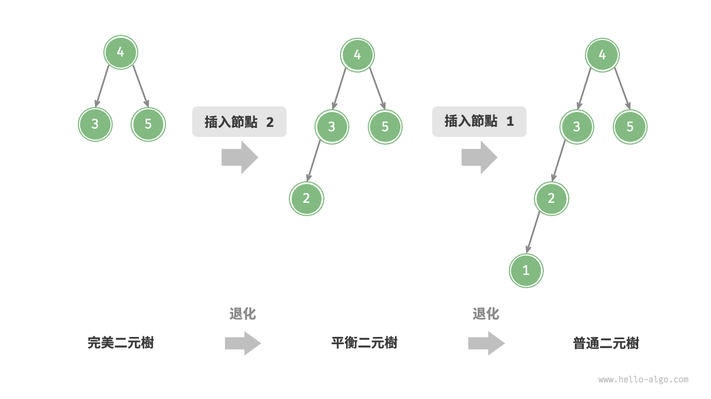{ class="animation-figure" }

<p align="center"> 圖 7-25 &nbsp; AVL 樹在插入節點後發生退化 </p>

1962 年 G. M. Adelson-Velsky 和 E. M. Landis 在論文“An algorithm for the organization of information”中提出了 <u>AVL 樹</u>。論文中詳細描述了一系列操作，確保在持續新增和刪除節點後，AVL 樹不會退化，從而使得各種操作的時間複雜度保持在 $O(\log n)$ 級別。換句話說，在需要頻繁進行增刪查改操作的場景中，AVL 樹能始終保持高效的資料操作效能，具有很好的應用價值。

## 7.5.1 &nbsp; AVL 樹常見術語

AVL 樹既是二元搜尋樹，也是平衡二元樹，同時滿足這兩類二元樹的所有性質，因此是一種<u>平衡二元搜尋樹（balanced binary search tree）</u>。

### 1. &nbsp; 節點高度

由於 AVL 樹的相關操作需要獲取節點高度，因此我們需要為節點類別新增 `height` 變數：

=== "Python"

    ```python title=""
    class TreeNode:
        """AVL 樹節點類別"""
        def __init__(self, val: int):
            self.val: int = val                 # 節點值
            self.height: int = 0                # 節點高度
            self.left: TreeNode | None = None   # 左子節點引用
            self.right: TreeNode | None = None  # 右子節點引用
    ```

=== "C++"

    ```cpp title=""
    /* AVL 樹節點類別 */
    struct TreeNode {
        int val{};          // 節點值
        int height = 0;     // 節點高度
        TreeNode *left{};   // 左子節點
        TreeNode *right{};  // 右子節點
        TreeNode() = default;
        explicit TreeNode(int x) : val(x){}
    };
    ```

=== "Java"

    ```java title=""
    /* AVL 樹節點類別 */
    class TreeNode {
        public int val;        // 節點值
        public int height;     // 節點高度
        public TreeNode left;  // 左子節點
        public TreeNode right; // 右子節點
        public TreeNode(int x) { val = x; }
    }
    ```

=== "C#"

    ```csharp title=""
    /* AVL 樹節點類別 */
    class TreeNode(int? x) {
        public int? val = x;    // 節點值
        public int height;      // 節點高度
        public TreeNode? left;  // 左子節點引用
        public TreeNode? right; // 右子節點引用
    }
    ```

=== "Go"

    ```go title=""
    /* AVL 樹節點結構體 */
    type TreeNode struct {
        Val    int       // 節點值
        Height int       // 節點高度
        Left   *TreeNode // 左子節點引用
        Right  *TreeNode // 右子節點引用
    }
    ```

=== "Swift"

    ```swift title=""
    /* AVL 樹節點類別 */
    class TreeNode {
        var val: Int // 節點值
        var height: Int // 節點高度
        var left: TreeNode? // 左子節點
        var right: TreeNode? // 右子節點

        init(x: Int) {
            val = x
            height = 0
        }
    }
    ```

=== "JS"

    ```javascript title=""
    /* AVL 樹節點類別 */
    class TreeNode {
        val; // 節點值
        height; //節點高度
        left; // 左子節點指標
        right; // 右子節點指標
        constructor(val, left, right, height) {
            this.val = val === undefined ? 0 : val;
            this.height = height === undefined ? 0 : height;
            this.left = left === undefined ? null : left;
            this.right = right === undefined ? null : right;
        }
    }
    ```

=== "TS"

    ```typescript title=""
    /* AVL 樹節點類別 */
    class TreeNode {
        val: number;            // 節點值
        height: number;         // 節點高度
        left: TreeNode | null;  // 左子節點指標
        right: TreeNode | null; // 右子節點指標
        constructor(val?: number, height?: number, left?: TreeNode | null, right?: TreeNode | null) {
            this.val = val === undefined ? 0 : val;
            this.height = height === undefined ? 0 : height;
            this.left = left === undefined ? null : left;
            this.right = right === undefined ? null : right;
        }
    }
    ```

=== "Dart"

    ```dart title=""
    /* AVL 樹節點類別 */
    class TreeNode {
      int val;         // 節點值
      int height;      // 節點高度
      TreeNode? left;  // 左子節點
      TreeNode? right; // 右子節點
      TreeNode(this.val, [this.height = 0, this.left, this.right]);
    }
    ```

=== "Rust"

    ```rust title=""
    use std::rc::Rc;
    use std::cell::RefCell;

    /* AVL 樹節點結構體 */
    struct TreeNode {
        val: i32,                               // 節點值
        height: i32,                            // 節點高度
        left: Option<Rc<RefCell<TreeNode>>>,    // 左子節點
        right: Option<Rc<RefCell<TreeNode>>>,   // 右子節點
    }

    impl TreeNode {
        /* 建構子 */
        fn new(val: i32) -> Rc<RefCell<Self>> {
            Rc::new(RefCell::new(Self {
                val,
                height: 0,
                left: None,
                right: None
            }))
        }
    }
    ```

=== "C"

    ```c title=""
    /* AVL 樹節點結構體 */
    typedef struct TreeNode {
        int val;
        int height;
        struct TreeNode *left;
        struct TreeNode *right;
    } TreeNode;

    /* 建構子 */
    TreeNode *newTreeNode(int val) {
        TreeNode *node;

        node = (TreeNode *)malloc(sizeof(TreeNode));
        node->val = val;
        node->height = 0;
        node->left = NULL;
        node->right = NULL;
        return node;
    }
    ```

=== "Kotlin"

    ```kotlin title=""
    /* AVL 樹節點類別 */
    class TreeNode(val _val: Int) {  // 節點值
        val height: Int = 0          // 節點高度
        val left: TreeNode? = null   // 左子節點
        val right: TreeNode? = null  // 右子節點
    }
    ```

=== "Ruby"

    ```ruby title=""
    ### AVL 樹節點類別 ###
    class TreeNode
      attr_accessor :val    # 節點值
      attr_accessor :height # 節點高度
      attr_accessor :left   # 左子節點引用
      attr_accessor :right  # 右子節點引用

      def initialize(val)
        @val = val
        @height = 0
      end
    end
    ```

=== "Zig"

    ```zig title=""

    ```

“節點高度”是指從該節點到它的最遠葉節點的距離，即所經過的“邊”的數量。需要特別注意的是，葉節點的高度為 $0$ ，而空節點的高度為 $-1$ 。我們將建立兩個工具函式，分別用於獲取和更新節點的高度：

=== "Python"

    ```python title="avl_tree.py"
    def height(self, node: TreeNode | None) -> int:
        """獲取節點高度"""
        # 空節點高度為 -1 ，葉節點高度為 0
        if node is not None:
            return node.height
        return -1

    def update_height(self, node: TreeNode | None):
        """更新節點高度"""
        # 節點高度等於最高子樹高度 + 1
        node.height = max([self.height(node.left), self.height(node.right)]) + 1
    ```

=== "C++"

    ```cpp title="avl_tree.cpp"
    /* 獲取節點高度 */
    int height(TreeNode *node) {
        // 空節點高度為 -1 ，葉節點高度為 0
        return node == nullptr ? -1 : node->height;
    }

    /* 更新節點高度 */
    void updateHeight(TreeNode *node) {
        // 節點高度等於最高子樹高度 + 1
        node->height = max(height(node->left), height(node->right)) + 1;
    }
    ```

=== "Java"

    ```java title="avl_tree.java"
    /* 獲取節點高度 */
    int height(TreeNode node) {
        // 空節點高度為 -1 ，葉節點高度為 0
        return node == null ? -1 : node.height;
    }

    /* 更新節點高度 */
    void updateHeight(TreeNode node) {
        // 節點高度等於最高子樹高度 + 1
        node.height = Math.max(height(node.left), height(node.right)) + 1;
    }
    ```

=== "C#"

    ```csharp title="avl_tree.cs"
    /* 獲取節點高度 */
    int Height(TreeNode? node) {
        // 空節點高度為 -1 ，葉節點高度為 0
        return node == null ? -1 : node.height;
    }

    /* 更新節點高度 */
    void UpdateHeight(TreeNode node) {
        // 節點高度等於最高子樹高度 + 1
        node.height = Math.Max(Height(node.left), Height(node.right)) + 1;
    }
    ```

=== "Go"

    ```go title="avl_tree.go"
    /* 獲取節點高度 */
    func (t *aVLTree) height(node *TreeNode) int {
        // 空節點高度為 -1 ，葉節點高度為 0
        if node != nil {
            return node.Height
        }
        return -1
    }

    /* 更新節點高度 */
    func (t *aVLTree) updateHeight(node *TreeNode) {
        lh := t.height(node.Left)
        rh := t.height(node.Right)
        // 節點高度等於最高子樹高度 + 1
        if lh > rh {
            node.Height = lh + 1
        } else {
            node.Height = rh + 1
        }
    }
    ```

=== "Swift"

    ```swift title="avl_tree.swift"
    /* 獲取節點高度 */
    func height(node: TreeNode?) -> Int {
        // 空節點高度為 -1 ，葉節點高度為 0
        node?.height ?? -1
    }

    /* 更新節點高度 */
    func updateHeight(node: TreeNode?) {
        // 節點高度等於最高子樹高度 + 1
        node?.height = max(height(node: node?.left), height(node: node?.right)) + 1
    }
    ```

=== "JS"

    ```javascript title="avl_tree.js"
    /* 獲取節點高度 */
    height(node) {
        // 空節點高度為 -1 ，葉節點高度為 0
        return node === null ? -1 : node.height;
    }

    /* 更新節點高度 */
    #updateHeight(node) {
        // 節點高度等於最高子樹高度 + 1
        node.height =
            Math.max(this.height(node.left), this.height(node.right)) + 1;
    }
    ```

=== "TS"

    ```typescript title="avl_tree.ts"
    /* 獲取節點高度 */
    height(node: TreeNode): number {
        // 空節點高度為 -1 ，葉節點高度為 0
        return node === null ? -1 : node.height;
    }

    /* 更新節點高度 */
    updateHeight(node: TreeNode): void {
        // 節點高度等於最高子樹高度 + 1
        node.height =
            Math.max(this.height(node.left), this.height(node.right)) + 1;
    }
    ```

=== "Dart"

    ```dart title="avl_tree.dart"
    /* 獲取節點高度 */
    int height(TreeNode? node) {
      // 空節點高度為 -1 ，葉節點高度為 0
      return node == null ? -1 : node.height;
    }

    /* 更新節點高度 */
    void updateHeight(TreeNode? node) {
      // 節點高度等於最高子樹高度 + 1
      node!.height = max(height(node.left), height(node.right)) + 1;
    }
    ```

=== "Rust"

    ```rust title="avl_tree.rs"
    /* 獲取節點高度 */
    fn height(node: OptionTreeNodeRc) -> i32 {
        // 空節點高度為 -1 ，葉節點高度為 0
        match node {
            Some(node) => node.borrow().height,
            None => -1,
        }
    }

    /* 更新節點高度 */
    fn update_height(node: OptionTreeNodeRc) {
        if let Some(node) = node {
            let left = node.borrow().left.clone();
            let right = node.borrow().right.clone();
            // 節點高度等於最高子樹高度 + 1
            node.borrow_mut().height = std::cmp::max(Self::height(left), Self::height(right)) + 1;
        }
    }
    ```

=== "C"

    ```c title="avl_tree.c"
    /* 獲取節點高度 */
    int height(TreeNode *node) {
        // 空節點高度為 -1 ，葉節點高度為 0
        if (node != NULL) {
            return node->height;
        }
        return -1;
    }

    /* 更新節點高度 */
    void updateHeight(TreeNode *node) {
        int lh = height(node->left);
        int rh = height(node->right);
        // 節點高度等於最高子樹高度 + 1
        if (lh > rh) {
            node->height = lh + 1;
        } else {
            node->height = rh + 1;
        }
    }
    ```

=== "Kotlin"

    ```kotlin title="avl_tree.kt"
    /* 獲取節點高度 */
    fun height(node: TreeNode?): Int {
        // 空節點高度為 -1 ，葉節點高度為 0
        return node?.height ?: -1
    }

    /* 更新節點高度 */
    fun updateHeight(node: TreeNode?) {
        // 節點高度等於最高子樹高度 + 1
        node?.height = max(height(node?.left), height(node?.right)) + 1
    }
    ```

=== "Ruby"

    ```ruby title="avl_tree.rb"
    ### 獲取節點高度 ###
    def height(node)
      # 空節點高度為 -1 ，葉節點高度為 0
      return node.height unless node.nil?

      -1
    end

    ### 更新節點高度 ###
    def update_height(node)
      # 節點高度等於最高子樹高度 + 1
      node.height = [height(node.left), height(node.right)].max + 1
    end
    ```

=== "Zig"

    ```zig title="avl_tree.zig"
    // 獲取節點高度
    fn height(self: *Self, node: ?*inc.TreeNode(T)) i32 {
        _ = self;
        // 空節點高度為 -1 ，葉節點高度為 0
        return if (node == null) -1 else node.?.height;
    }

    // 更新節點高度
    fn updateHeight(self: *Self, node: ?*inc.TreeNode(T)) void {
        // 節點高度等於最高子樹高度 + 1
        node.?.height = @max(self.height(node.?.left), self.height(node.?.right)) + 1;
    }
    ```

### 2. &nbsp; 節點平衡因子

節點的<u>平衡因子（balance factor）</u>定義為節點左子樹的高度減去右子樹的高度，同時規定空節點的平衡因子為 $0$ 。我們同樣將獲取節點平衡因子的功能封裝成函式，方便後續使用：

=== "Python"

    ```python title="avl_tree.py"
    def balance_factor(self, node: TreeNode | None) -> int:
        """獲取平衡因子"""
        # 空節點平衡因子為 0
        if node is None:
            return 0
        # 節點平衡因子 = 左子樹高度 - 右子樹高度
        return self.height(node.left) - self.height(node.right)
    ```

=== "C++"

    ```cpp title="avl_tree.cpp"
    /* 獲取平衡因子 */
    int balanceFactor(TreeNode *node) {
        // 空節點平衡因子為 0
        if (node == nullptr)
            return 0;
        // 節點平衡因子 = 左子樹高度 - 右子樹高度
        return height(node->left) - height(node->right);
    }
    ```

=== "Java"

    ```java title="avl_tree.java"
    /* 獲取平衡因子 */
    int balanceFactor(TreeNode node) {
        // 空節點平衡因子為 0
        if (node == null)
            return 0;
        // 節點平衡因子 = 左子樹高度 - 右子樹高度
        return height(node.left) - height(node.right);
    }
    ```

=== "C#"

    ```csharp title="avl_tree.cs"
    /* 獲取平衡因子 */
    int BalanceFactor(TreeNode? node) {
        // 空節點平衡因子為 0
        if (node == null) return 0;
        // 節點平衡因子 = 左子樹高度 - 右子樹高度
        return Height(node.left) - Height(node.right);
    }
    ```

=== "Go"

    ```go title="avl_tree.go"
    /* 獲取平衡因子 */
    func (t *aVLTree) balanceFactor(node *TreeNode) int {
        // 空節點平衡因子為 0
        if node == nil {
            return 0
        }
        // 節點平衡因子 = 左子樹高度 - 右子樹高度
        return t.height(node.Left) - t.height(node.Right)
    }
    ```

=== "Swift"

    ```swift title="avl_tree.swift"
    /* 獲取平衡因子 */
    func balanceFactor(node: TreeNode?) -> Int {
        // 空節點平衡因子為 0
        guard let node = node else { return 0 }
        // 節點平衡因子 = 左子樹高度 - 右子樹高度
        return height(node: node.left) - height(node: node.right)
    }
    ```

=== "JS"

    ```javascript title="avl_tree.js"
    /* 獲取平衡因子 */
    balanceFactor(node) {
        // 空節點平衡因子為 0
        if (node === null) return 0;
        // 節點平衡因子 = 左子樹高度 - 右子樹高度
        return this.height(node.left) - this.height(node.right);
    }
    ```

=== "TS"

    ```typescript title="avl_tree.ts"
    /* 獲取平衡因子 */
    balanceFactor(node: TreeNode): number {
        // 空節點平衡因子為 0
        if (node === null) return 0;
        // 節點平衡因子 = 左子樹高度 - 右子樹高度
        return this.height(node.left) - this.height(node.right);
    }
    ```

=== "Dart"

    ```dart title="avl_tree.dart"
    /* 獲取平衡因子 */
    int balanceFactor(TreeNode? node) {
      // 空節點平衡因子為 0
      if (node == null) return 0;
      // 節點平衡因子 = 左子樹高度 - 右子樹高度
      return height(node.left) - height(node.right);
    }
    ```

=== "Rust"

    ```rust title="avl_tree.rs"
    /* 獲取平衡因子 */
    fn balance_factor(node: OptionTreeNodeRc) -> i32 {
        match node {
            // 空節點平衡因子為 0
            None => 0,
            // 節點平衡因子 = 左子樹高度 - 右子樹高度
            Some(node) => {
                Self::height(node.borrow().left.clone()) - Self::height(node.borrow().right.clone())
            }
        }
    }
    ```

=== "C"

    ```c title="avl_tree.c"
    /* 獲取平衡因子 */
    int balanceFactor(TreeNode *node) {
        // 空節點平衡因子為 0
        if (node == NULL) {
            return 0;
        }
        // 節點平衡因子 = 左子樹高度 - 右子樹高度
        return height(node->left) - height(node->right);
    }
    ```

=== "Kotlin"

    ```kotlin title="avl_tree.kt"
    /* 獲取平衡因子 */
    fun balanceFactor(node: TreeNode?): Int {
        // 空節點平衡因子為 0
        if (node == null) return 0
        // 節點平衡因子 = 左子樹高度 - 右子樹高度
        return height(node.left) - height(node.right)
    }
    ```

=== "Ruby"

    ```ruby title="avl_tree.rb"
    ### 獲取平衡因子 ###
    def balance_factor(node)
      # 空節點平衡因子為 0
      return 0 if node.nil?

      # 節點平衡因子 = 左子樹高度 - 右子樹高度
      height(node.left) - height(node.right)
    end
    ```

=== "Zig"

    ```zig title="avl_tree.zig"
    // 獲取平衡因子
    fn balanceFactor(self: *Self, node: ?*inc.TreeNode(T)) i32 {
        // 空節點平衡因子為 0
        if (node == null) return 0;
        // 節點平衡因子 = 左子樹高度 - 右子樹高度
        return self.height(node.?.left) - self.height(node.?.right);
    }
    ```

!!! tip

    設平衡因子為 $f$ ，則一棵 AVL 樹的任意節點的平衡因子皆滿足 $-1 \le f \le 1$ 。

## 7.5.2 &nbsp; AVL 樹旋轉

AVL 樹的特點在於“旋轉”操作，它能夠在不影響二元樹的中序走訪序列的前提下，使失衡節點重新恢復平衡。換句話說，**旋轉操作既能保持“二元搜尋樹”的性質，也能使樹重新變為“平衡二元樹”**。

我們將平衡因子絕對值 $> 1$ 的節點稱為“失衡節點”。根據節點失衡情況的不同，旋轉操作分為四種：右旋、左旋、先右旋後左旋、先左旋後右旋。下面詳細介紹這些旋轉操作。

### 1. &nbsp; 右旋

如圖 7-26 所示，節點下方為平衡因子。從底至頂看，二元樹中首個失衡節點是“節點 3”。我們關注以該失衡節點為根節點的子樹，將該節點記為 `node` ，其左子節點記為 `child` ，執行“右旋”操作。完成右旋後，子樹恢復平衡，並且仍然保持二元搜尋樹的性質。

=== "<1>"
    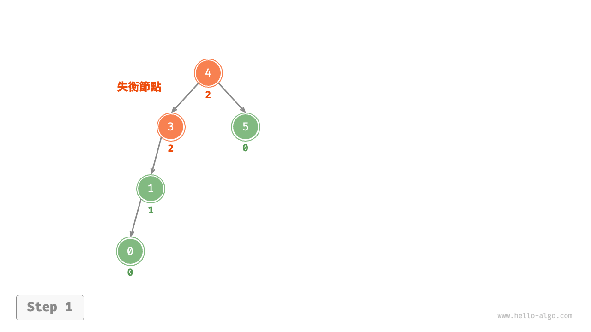{ class="animation-figure" }

=== "<2>"
    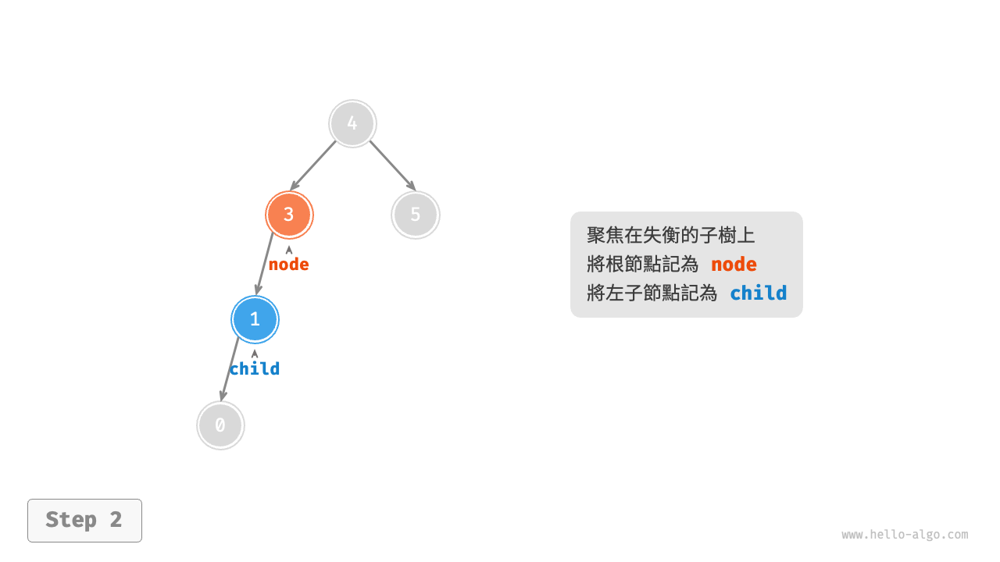{ class="animation-figure" }

=== "<3>"
    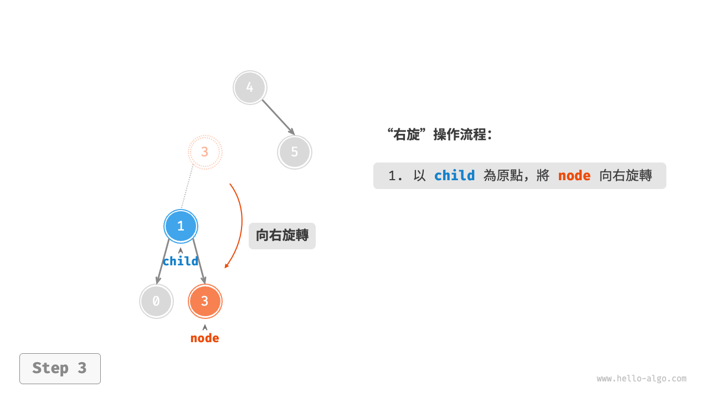{ class="animation-figure" }

=== "<4>"
    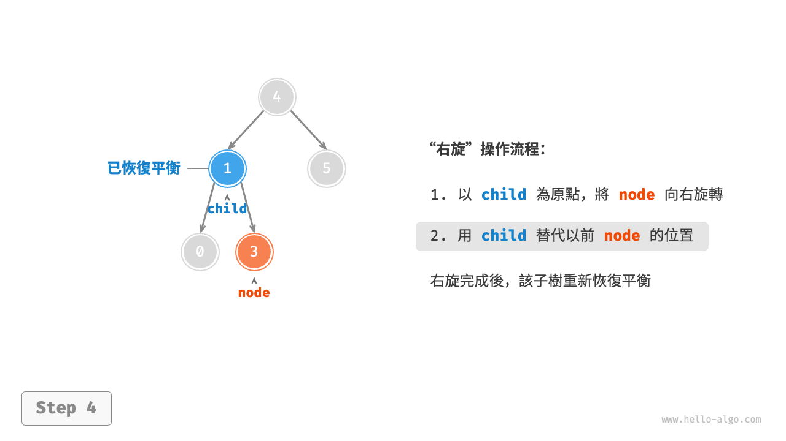{ class="animation-figure" }

<p align="center"> 圖 7-26 &nbsp; 右旋操作步驟 </p>

如圖 7-27 所示，當節點 `child` 有右子節點（記為 `grand_child` ）時，需要在右旋中新增一步：將 `grand_child` 作為 `node` 的左子節點。

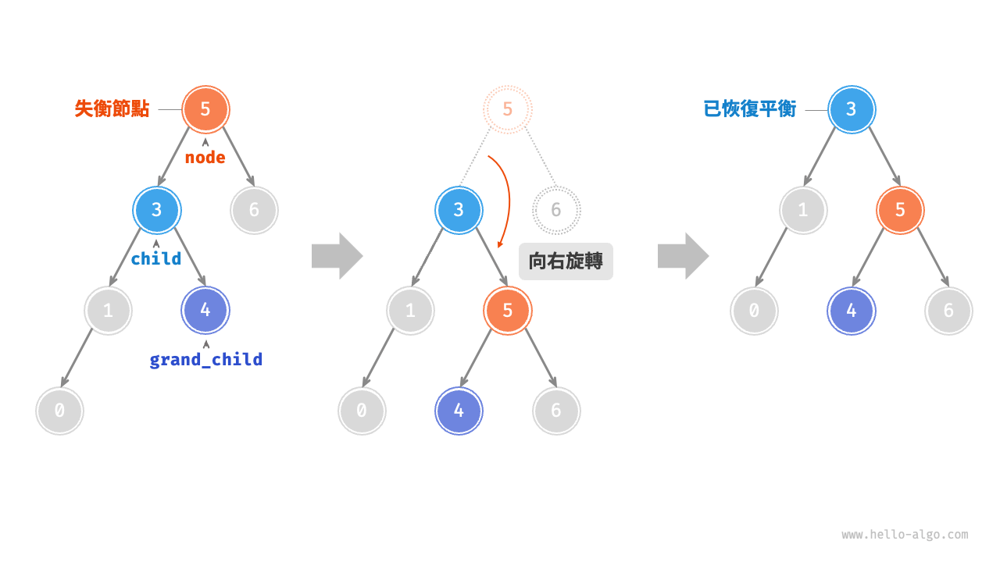{ class="animation-figure" }

<p align="center"> 圖 7-27 &nbsp; 有 grand_child 的右旋操作 </p>

“向右旋轉”是一種形象化的說法，實際上需要透過修改節點指標來實現，程式碼如下所示：

=== "Python"

    ```python title="avl_tree.py"
    def right_rotate(self, node: TreeNode | None) -> TreeNode | None:
        """右旋操作"""
        child = node.left
        grand_child = child.right
        # 以 child 為原點，將 node 向右旋轉
        child.right = node
        node.left = grand_child
        # 更新節點高度
        self.update_height(node)
        self.update_height(child)
        # 返回旋轉後子樹的根節點
        return child
    ```

=== "C++"

    ```cpp title="avl_tree.cpp"
    /* 右旋操作 */
    TreeNode *rightRotate(TreeNode *node) {
        TreeNode *child = node->left;
        TreeNode *grandChild = child->right;
        // 以 child 為原點，將 node 向右旋轉
        child->right = node;
        node->left = grandChild;
        // 更新節點高度
        updateHeight(node);
        updateHeight(child);
        // 返回旋轉後子樹的根節點
        return child;
    }
    ```

=== "Java"

    ```java title="avl_tree.java"
    /* 右旋操作 */
    TreeNode rightRotate(TreeNode node) {
        TreeNode child = node.left;
        TreeNode grandChild = child.right;
        // 以 child 為原點，將 node 向右旋轉
        child.right = node;
        node.left = grandChild;
        // 更新節點高度
        updateHeight(node);
        updateHeight(child);
        // 返回旋轉後子樹的根節點
        return child;
    }
    ```

=== "C#"

    ```csharp title="avl_tree.cs"
    /* 右旋操作 */
    TreeNode? RightRotate(TreeNode? node) {
        TreeNode? child = node?.left;
        TreeNode? grandChild = child?.right;
        // 以 child 為原點，將 node 向右旋轉
        child.right = node;
        node.left = grandChild;
        // 更新節點高度
        UpdateHeight(node);
        UpdateHeight(child);
        // 返回旋轉後子樹的根節點
        return child;
    }
    ```

=== "Go"

    ```go title="avl_tree.go"
    /* 右旋操作 */
    func (t *aVLTree) rightRotate(node *TreeNode) *TreeNode {
        child := node.Left
        grandChild := child.Right
        // 以 child 為原點，將 node 向右旋轉
        child.Right = node
        node.Left = grandChild
        // 更新節點高度
        t.updateHeight(node)
        t.updateHeight(child)
        // 返回旋轉後子樹的根節點
        return child
    }
    ```

=== "Swift"

    ```swift title="avl_tree.swift"
    /* 右旋操作 */
    func rightRotate(node: TreeNode?) -> TreeNode? {
        let child = node?.left
        let grandChild = child?.right
        // 以 child 為原點，將 node 向右旋轉
        child?.right = node
        node?.left = grandChild
        // 更新節點高度
        updateHeight(node: node)
        updateHeight(node: child)
        // 返回旋轉後子樹的根節點
        return child
    }
    ```

=== "JS"

    ```javascript title="avl_tree.js"
    /* 右旋操作 */
    #rightRotate(node) {
        const child = node.left;
        const grandChild = child.right;
        // 以 child 為原點，將 node 向右旋轉
        child.right = node;
        node.left = grandChild;
        // 更新節點高度
        this.#updateHeight(node);
        this.#updateHeight(child);
        // 返回旋轉後子樹的根節點
        return child;
    }
    ```

=== "TS"

    ```typescript title="avl_tree.ts"
    /* 右旋操作 */
    rightRotate(node: TreeNode): TreeNode {
        const child = node.left;
        const grandChild = child.right;
        // 以 child 為原點，將 node 向右旋轉
        child.right = node;
        node.left = grandChild;
        // 更新節點高度
        this.updateHeight(node);
        this.updateHeight(child);
        // 返回旋轉後子樹的根節點
        return child;
    }
    ```

=== "Dart"

    ```dart title="avl_tree.dart"
    /* 右旋操作 */
    TreeNode? rightRotate(TreeNode? node) {
      TreeNode? child = node!.left;
      TreeNode? grandChild = child!.right;
      // 以 child 為原點，將 node 向右旋轉
      child.right = node;
      node.left = grandChild;
      // 更新節點高度
      updateHeight(node);
      updateHeight(child);
      // 返回旋轉後子樹的根節點
      return child;
    }
    ```

=== "Rust"

    ```rust title="avl_tree.rs"
    /* 右旋操作 */
    fn right_rotate(node: OptionTreeNodeRc) -> OptionTreeNodeRc {
        match node {
            Some(node) => {
                let child = node.borrow().left.clone().unwrap();
                let grand_child = child.borrow().right.clone();
                // 以 child 為原點，將 node 向右旋轉
                child.borrow_mut().right = Some(node.clone());
                node.borrow_mut().left = grand_child;
                // 更新節點高度
                Self::update_height(Some(node));
                Self::update_height(Some(child.clone()));
                // 返回旋轉後子樹的根節點
                Some(child)
            }
            None => None,
        }
    }
    ```

=== "C"

    ```c title="avl_tree.c"
    /* 右旋操作 */
    TreeNode *rightRotate(TreeNode *node) {
        TreeNode *child, *grandChild;
        child = node->left;
        grandChild = child->right;
        // 以 child 為原點，將 node 向右旋轉
        child->right = node;
        node->left = grandChild;
        // 更新節點高度
        updateHeight(node);
        updateHeight(child);
        // 返回旋轉後子樹的根節點
        return child;
    }
    ```

=== "Kotlin"

    ```kotlin title="avl_tree.kt"
    /* 右旋操作 */
    fun rightRotate(node: TreeNode?): TreeNode {
        val child = node!!.left
        val grandChild = child!!.right
        // 以 child 為原點，將 node 向右旋轉
        child.right = node
        node.left = grandChild
        // 更新節點高度
        updateHeight(node)
        updateHeight(child)
        // 返回旋轉後子樹的根節點
        return child
    }
    ```

=== "Ruby"

    ```ruby title="avl_tree.rb"
    ### 右旋操作 ###
    def right_rotate(node)
      child = node.left
      grand_child = child.right
      # 以 child 為原點，將 node 向右旋轉
      child.right = node
      node.left = grand_child
      # 更新節點高度
      update_height(node)
      update_height(child)
      # 返回旋轉後子樹的根節點
      child
    end
    ```

=== "Zig"

    ```zig title="avl_tree.zig"
    // 右旋操作
    fn rightRotate(self: *Self, node: ?*inc.TreeNode(T)) ?*inc.TreeNode(T) {
        var child = node.?.left;
        var grandChild = child.?.right;
        // 以 child 為原點，將 node 向右旋轉
        child.?.right = node;
        node.?.left = grandChild;
        // 更新節點高度
        self.updateHeight(node);
        self.updateHeight(child);
        // 返回旋轉後子樹的根節點
        return child;
    }
    ```

### 2. &nbsp; 左旋

相應地，如果考慮上述失衡二元樹的“映象”，則需要執行圖 7-28 所示的“左旋”操作。

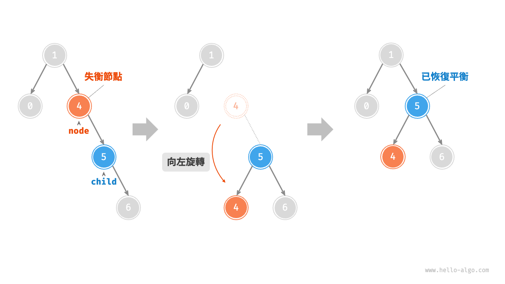{ class="animation-figure" }

<p align="center"> 圖 7-28 &nbsp; 左旋操作 </p>

同理，如圖 7-29 所示，當節點 `child` 有左子節點（記為 `grand_child` ）時，需要在左旋中新增一步：將 `grand_child` 作為 `node` 的右子節點。

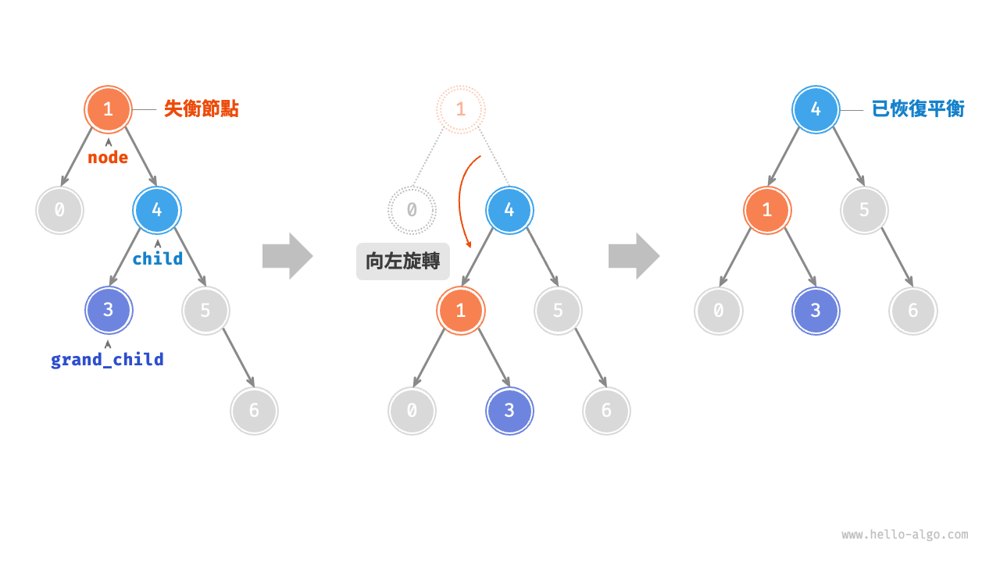{ class="animation-figure" }

<p align="center"> 圖 7-29 &nbsp; 有 grand_child 的左旋操作 </p>

可以觀察到，**右旋和左旋操作在邏輯上是映象對稱的，它們分別解決的兩種失衡情況也是對稱的**。基於對稱性，我們只需將右旋的實現程式碼中的所有的 `left` 替換為 `right` ，將所有的 `right` 替換為 `left` ，即可得到左旋的實現程式碼：

=== "Python"

    ```python title="avl_tree.py"
    def left_rotate(self, node: TreeNode | None) -> TreeNode | None:
        """左旋操作"""
        child = node.right
        grand_child = child.left
        # 以 child 為原點，將 node 向左旋轉
        child.left = node
        node.right = grand_child
        # 更新節點高度
        self.update_height(node)
        self.update_height(child)
        # 返回旋轉後子樹的根節點
        return child
    ```

=== "C++"

    ```cpp title="avl_tree.cpp"
    /* 左旋操作 */
    TreeNode *leftRotate(TreeNode *node) {
        TreeNode *child = node->right;
        TreeNode *grandChild = child->left;
        // 以 child 為原點，將 node 向左旋轉
        child->left = node;
        node->right = grandChild;
        // 更新節點高度
        updateHeight(node);
        updateHeight(child);
        // 返回旋轉後子樹的根節點
        return child;
    }
    ```

=== "Java"

    ```java title="avl_tree.java"
    /* 左旋操作 */
    TreeNode leftRotate(TreeNode node) {
        TreeNode child = node.right;
        TreeNode grandChild = child.left;
        // 以 child 為原點，將 node 向左旋轉
        child.left = node;
        node.right = grandChild;
        // 更新節點高度
        updateHeight(node);
        updateHeight(child);
        // 返回旋轉後子樹的根節點
        return child;
    }
    ```

=== "C#"

    ```csharp title="avl_tree.cs"
    /* 左旋操作 */
    TreeNode? LeftRotate(TreeNode? node) {
        TreeNode? child = node?.right;
        TreeNode? grandChild = child?.left;
        // 以 child 為原點，將 node 向左旋轉
        child.left = node;
        node.right = grandChild;
        // 更新節點高度
        UpdateHeight(node);
        UpdateHeight(child);
        // 返回旋轉後子樹的根節點
        return child;
    }
    ```

=== "Go"

    ```go title="avl_tree.go"
    /* 左旋操作 */
    func (t *aVLTree) leftRotate(node *TreeNode) *TreeNode {
        child := node.Right
        grandChild := child.Left
        // 以 child 為原點，將 node 向左旋轉
        child.Left = node
        node.Right = grandChild
        // 更新節點高度
        t.updateHeight(node)
        t.updateHeight(child)
        // 返回旋轉後子樹的根節點
        return child
    }
    ```

=== "Swift"

    ```swift title="avl_tree.swift"
    /* 左旋操作 */
    func leftRotate(node: TreeNode?) -> TreeNode? {
        let child = node?.right
        let grandChild = child?.left
        // 以 child 為原點，將 node 向左旋轉
        child?.left = node
        node?.right = grandChild
        // 更新節點高度
        updateHeight(node: node)
        updateHeight(node: child)
        // 返回旋轉後子樹的根節點
        return child
    }
    ```

=== "JS"

    ```javascript title="avl_tree.js"
    /* 左旋操作 */
    #leftRotate(node) {
        const child = node.right;
        const grandChild = child.left;
        // 以 child 為原點，將 node 向左旋轉
        child.left = node;
        node.right = grandChild;
        // 更新節點高度
        this.#updateHeight(node);
        this.#updateHeight(child);
        // 返回旋轉後子樹的根節點
        return child;
    }
    ```

=== "TS"

    ```typescript title="avl_tree.ts"
    /* 左旋操作 */
    leftRotate(node: TreeNode): TreeNode {
        const child = node.right;
        const grandChild = child.left;
        // 以 child 為原點，將 node 向左旋轉
        child.left = node;
        node.right = grandChild;
        // 更新節點高度
        this.updateHeight(node);
        this.updateHeight(child);
        // 返回旋轉後子樹的根節點
        return child;
    }
    ```

=== "Dart"

    ```dart title="avl_tree.dart"
    /* 左旋操作 */
    TreeNode? leftRotate(TreeNode? node) {
      TreeNode? child = node!.right;
      TreeNode? grandChild = child!.left;
      // 以 child 為原點，將 node 向左旋轉
      child.left = node;
      node.right = grandChild;
      // 更新節點高度
      updateHeight(node);
      updateHeight(child);
      // 返回旋轉後子樹的根節點
      return child;
    }
    ```

=== "Rust"

    ```rust title="avl_tree.rs"
    /* 左旋操作 */
    fn left_rotate(node: OptionTreeNodeRc) -> OptionTreeNodeRc {
        match node {
            Some(node) => {
                let child = node.borrow().right.clone().unwrap();
                let grand_child = child.borrow().left.clone();
                // 以 child 為原點，將 node 向左旋轉
                child.borrow_mut().left = Some(node.clone());
                node.borrow_mut().right = grand_child;
                // 更新節點高度
                Self::update_height(Some(node));
                Self::update_height(Some(child.clone()));
                // 返回旋轉後子樹的根節點
                Some(child)
            }
            None => None,
        }
    }
    ```

=== "C"

    ```c title="avl_tree.c"
    /* 左旋操作 */
    TreeNode *leftRotate(TreeNode *node) {
        TreeNode *child, *grandChild;
        child = node->right;
        grandChild = child->left;
        // 以 child 為原點，將 node 向左旋轉
        child->left = node;
        node->right = grandChild;
        // 更新節點高度
        updateHeight(node);
        updateHeight(child);
        // 返回旋轉後子樹的根節點
        return child;
    }
    ```

=== "Kotlin"

    ```kotlin title="avl_tree.kt"
    /* 左旋操作 */
    fun leftRotate(node: TreeNode?): TreeNode {
        val child = node!!.right
        val grandChild = child!!.left
        // 以 child 為原點，將 node 向左旋轉
        child.left = node
        node.right = grandChild
        // 更新節點高度
        updateHeight(node)
        updateHeight(child)
        // 返回旋轉後子樹的根節點
        return child
    }
    ```

=== "Ruby"

    ```ruby title="avl_tree.rb"
    ### 左旋操作 ###
    def left_rotate(node)
      child = node.right
      grand_child = child.left
      # 以 child 為原點，將 node 向左旋轉
      child.left = node
      node.right = grand_child
      # 更新節點高度
      update_height(node)
      update_height(child)
      # 返回旋轉後子樹的根節點
      child
    end
    ```

=== "Zig"

    ```zig title="avl_tree.zig"
    // 左旋操作
    fn leftRotate(self: *Self, node: ?*inc.TreeNode(T)) ?*inc.TreeNode(T) {
        var child = node.?.right;
        var grandChild = child.?.left;
        // 以 child 為原點，將 node 向左旋轉
        child.?.left = node;
        node.?.right = grandChild;
        // 更新節點高度
        self.updateHeight(node);
        self.updateHeight(child);
        // 返回旋轉後子樹的根節點
        return child;
    }
    ```

### 3. &nbsp; 先左旋後右旋

對於圖 7-30 中的失衡節點 3 ，僅使用左旋或右旋都無法使子樹恢復平衡。此時需要先對 `child` 執行“左旋”，再對 `node` 執行“右旋”。

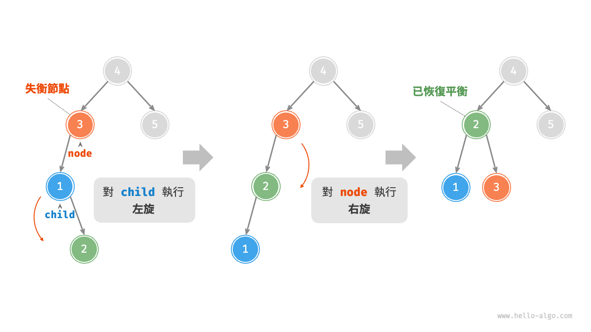{ class="animation-figure" }

<p align="center"> 圖 7-30 &nbsp; 先左旋後右旋 </p>

### 4. &nbsp; 先右旋後左旋

如圖 7-31 所示，對於上述失衡二元樹的映象情況，需要先對 `child` 執行“右旋”，再對 `node` 執行“左旋”。

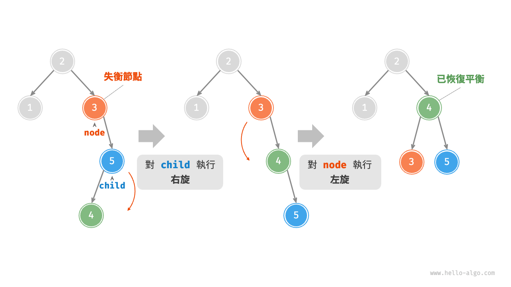{ class="animation-figure" }

<p align="center"> 圖 7-31 &nbsp; 先右旋後左旋 </p>

### 5. &nbsp; 旋轉的選擇

圖 7-32 展示的四種失衡情況與上述案例逐個對應，分別需要採用右旋、先左旋後右旋、先右旋後左旋、左旋的操作。

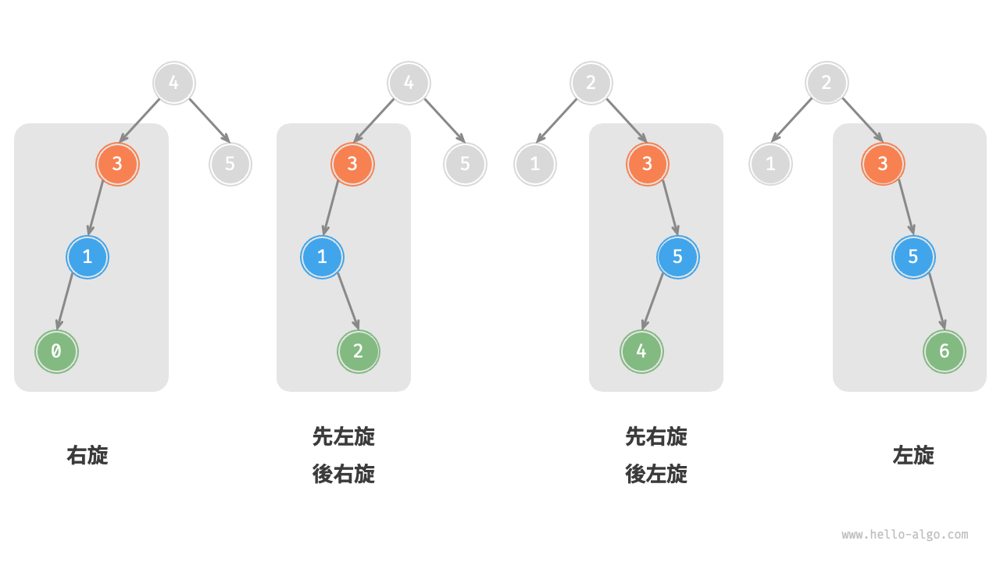{ class="animation-figure" }

<p align="center"> 圖 7-32 &nbsp; AVL 樹的四種旋轉情況 </p>

如下表所示，我們透過判斷失衡節點的平衡因子以及較高一側子節點的平衡因子的正負號，來確定失衡節點屬於圖 7-32 中的哪種情況。

<p align="center"> 表 7-3 &nbsp; 四種旋轉情況的選擇條件 </p>

<div class="center-table" markdown>

| 失衡節點的平衡因子 | 子節點的平衡因子 | 應採用的旋轉方法 |
| ------------------ | ---------------- | ---------------- |
| $> 1$ （左偏樹）   | $\geq 0$         | 右旋             |
| $> 1$ （左偏樹）   | $<0$             | 先左旋後右旋     |
| $< -1$ （右偏樹）  | $\leq 0$         | 左旋             |
| $< -1$ （右偏樹）  | $>0$             | 先右旋後左旋     |

</div>

為了便於使用，我們將旋轉操作封裝成一個函式。**有了這個函式，我們就能對各種失衡情況進行旋轉，使失衡節點重新恢復平衡**。程式碼如下所示：

=== "Python"

    ```python title="avl_tree.py"
    def rotate(self, node: TreeNode | None) -> TreeNode | None:
        """執行旋轉操作，使該子樹重新恢復平衡"""
        # 獲取節點 node 的平衡因子
        balance_factor = self.balance_factor(node)
        # 左偏樹
        if balance_factor > 1:
            if self.balance_factor(node.left) >= 0:
                # 右旋
                return self.right_rotate(node)
            else:
                # 先左旋後右旋
                node.left = self.left_rotate(node.left)
                return self.right_rotate(node)
        # 右偏樹
        elif balance_factor < -1:
            if self.balance_factor(node.right) <= 0:
                # 左旋
                return self.left_rotate(node)
            else:
                # 先右旋後左旋
                node.right = self.right_rotate(node.right)
                return self.left_rotate(node)
        # 平衡樹，無須旋轉，直接返回
        return node
    ```

=== "C++"

    ```cpp title="avl_tree.cpp"
    /* 執行旋轉操作，使該子樹重新恢復平衡 */
    TreeNode *rotate(TreeNode *node) {
        // 獲取節點 node 的平衡因子
        int _balanceFactor = balanceFactor(node);
        // 左偏樹
        if (_balanceFactor > 1) {
            if (balanceFactor(node->left) >= 0) {
                // 右旋
                return rightRotate(node);
            } else {
                // 先左旋後右旋
                node->left = leftRotate(node->left);
                return rightRotate(node);
            }
        }
        // 右偏樹
        if (_balanceFactor < -1) {
            if (balanceFactor(node->right) <= 0) {
                // 左旋
                return leftRotate(node);
            } else {
                // 先右旋後左旋
                node->right = rightRotate(node->right);
                return leftRotate(node);
            }
        }
        // 平衡樹，無須旋轉，直接返回
        return node;
    }
    ```

=== "Java"

    ```java title="avl_tree.java"
    /* 執行旋轉操作，使該子樹重新恢復平衡 */
    TreeNode rotate(TreeNode node) {
        // 獲取節點 node 的平衡因子
        int balanceFactor = balanceFactor(node);
        // 左偏樹
        if (balanceFactor > 1) {
            if (balanceFactor(node.left) >= 0) {
                // 右旋
                return rightRotate(node);
            } else {
                // 先左旋後右旋
                node.left = leftRotate(node.left);
                return rightRotate(node);
            }
        }
        // 右偏樹
        if (balanceFactor < -1) {
            if (balanceFactor(node.right) <= 0) {
                // 左旋
                return leftRotate(node);
            } else {
                // 先右旋後左旋
                node.right = rightRotate(node.right);
                return leftRotate(node);
            }
        }
        // 平衡樹，無須旋轉，直接返回
        return node;
    }
    ```

=== "C#"

    ```csharp title="avl_tree.cs"
    /* 執行旋轉操作，使該子樹重新恢復平衡 */
    TreeNode? Rotate(TreeNode? node) {
        // 獲取節點 node 的平衡因子
        int balanceFactorInt = BalanceFactor(node);
        // 左偏樹
        if (balanceFactorInt > 1) {
            if (BalanceFactor(node?.left) >= 0) {
                // 右旋
                return RightRotate(node);
            } else {
                // 先左旋後右旋
                node!.left = LeftRotate(node!.left);
                return RightRotate(node);
            }
        }
        // 右偏樹
        if (balanceFactorInt < -1) {
            if (BalanceFactor(node?.right) <= 0) {
                // 左旋
                return LeftRotate(node);
            } else {
                // 先右旋後左旋
                node!.right = RightRotate(node!.right);
                return LeftRotate(node);
            }
        }
        // 平衡樹，無須旋轉，直接返回
        return node;
    }
    ```

=== "Go"

    ```go title="avl_tree.go"
    /* 執行旋轉操作，使該子樹重新恢復平衡 */
    func (t *aVLTree) rotate(node *TreeNode) *TreeNode {
        // 獲取節點 node 的平衡因子
        // Go 推薦短變數，這裡 bf 指代 t.balanceFactor
        bf := t.balanceFactor(node)
        // 左偏樹
        if bf > 1 {
            if t.balanceFactor(node.Left) >= 0 {
                // 右旋
                return t.rightRotate(node)
            } else {
                // 先左旋後右旋
                node.Left = t.leftRotate(node.Left)
                return t.rightRotate(node)
            }
        }
        // 右偏樹
        if bf < -1 {
            if t.balanceFactor(node.Right) <= 0 {
                // 左旋
                return t.leftRotate(node)
            } else {
                // 先右旋後左旋
                node.Right = t.rightRotate(node.Right)
                return t.leftRotate(node)
            }
        }
        // 平衡樹，無須旋轉，直接返回
        return node
    }
    ```

=== "Swift"

    ```swift title="avl_tree.swift"
    /* 執行旋轉操作，使該子樹重新恢復平衡 */
    func rotate(node: TreeNode?) -> TreeNode? {
        // 獲取節點 node 的平衡因子
        let balanceFactor = balanceFactor(node: node)
        // 左偏樹
        if balanceFactor > 1 {
            if self.balanceFactor(node: node?.left) >= 0 {
                // 右旋
                return rightRotate(node: node)
            } else {
                // 先左旋後右旋
                node?.left = leftRotate(node: node?.left)
                return rightRotate(node: node)
            }
        }
        // 右偏樹
        if balanceFactor < -1 {
            if self.balanceFactor(node: node?.right) <= 0 {
                // 左旋
                return leftRotate(node: node)
            } else {
                // 先右旋後左旋
                node?.right = rightRotate(node: node?.right)
                return leftRotate(node: node)
            }
        }
        // 平衡樹，無須旋轉，直接返回
        return node
    }
    ```

=== "JS"

    ```javascript title="avl_tree.js"
    /* 執行旋轉操作，使該子樹重新恢復平衡 */
    #rotate(node) {
        // 獲取節點 node 的平衡因子
        const balanceFactor = this.balanceFactor(node);
        // 左偏樹
        if (balanceFactor > 1) {
            if (this.balanceFactor(node.left) >= 0) {
                // 右旋
                return this.#rightRotate(node);
            } else {
                // 先左旋後右旋
                node.left = this.#leftRotate(node.left);
                return this.#rightRotate(node);
            }
        }
        // 右偏樹
        if (balanceFactor < -1) {
            if (this.balanceFactor(node.right) <= 0) {
                // 左旋
                return this.#leftRotate(node);
            } else {
                // 先右旋後左旋
                node.right = this.#rightRotate(node.right);
                return this.#leftRotate(node);
            }
        }
        // 平衡樹，無須旋轉，直接返回
        return node;
    }
    ```

=== "TS"

    ```typescript title="avl_tree.ts"
    /* 執行旋轉操作，使該子樹重新恢復平衡 */
    rotate(node: TreeNode): TreeNode {
        // 獲取節點 node 的平衡因子
        const balanceFactor = this.balanceFactor(node);
        // 左偏樹
        if (balanceFactor > 1) {
            if (this.balanceFactor(node.left) >= 0) {
                // 右旋
                return this.rightRotate(node);
            } else {
                // 先左旋後右旋
                node.left = this.leftRotate(node.left);
                return this.rightRotate(node);
            }
        }
        // 右偏樹
        if (balanceFactor < -1) {
            if (this.balanceFactor(node.right) <= 0) {
                // 左旋
                return this.leftRotate(node);
            } else {
                // 先右旋後左旋
                node.right = this.rightRotate(node.right);
                return this.leftRotate(node);
            }
        }
        // 平衡樹，無須旋轉，直接返回
        return node;
    }
    ```

=== "Dart"

    ```dart title="avl_tree.dart"
    /* 執行旋轉操作，使該子樹重新恢復平衡 */
    TreeNode? rotate(TreeNode? node) {
      // 獲取節點 node 的平衡因子
      int factor = balanceFactor(node);
      // 左偏樹
      if (factor > 1) {
        if (balanceFactor(node!.left) >= 0) {
          // 右旋
          return rightRotate(node);
        } else {
          // 先左旋後右旋
          node.left = leftRotate(node.left);
          return rightRotate(node);
        }
      }
      // 右偏樹
      if (factor < -1) {
        if (balanceFactor(node!.right) <= 0) {
          // 左旋
          return leftRotate(node);
        } else {
          // 先右旋後左旋
          node.right = rightRotate(node.right);
          return leftRotate(node);
        }
      }
      // 平衡樹，無須旋轉，直接返回
      return node;
    }
    ```

=== "Rust"

    ```rust title="avl_tree.rs"
    /* 執行旋轉操作，使該子樹重新恢復平衡 */
    fn rotate(node: OptionTreeNodeRc) -> OptionTreeNodeRc {
        // 獲取節點 node 的平衡因子
        let balance_factor = Self::balance_factor(node.clone());
        // 左偏樹
        if balance_factor > 1 {
            let node = node.unwrap();
            if Self::balance_factor(node.borrow().left.clone()) >= 0 {
                // 右旋
                Self::right_rotate(Some(node))
            } else {
                // 先左旋後右旋
                let left = node.borrow().left.clone();
                node.borrow_mut().left = Self::left_rotate(left);
                Self::right_rotate(Some(node))
            }
        }
        // 右偏樹
        else if balance_factor < -1 {
            let node = node.unwrap();
            if Self::balance_factor(node.borrow().right.clone()) <= 0 {
                // 左旋
                Self::left_rotate(Some(node))
            } else {
                // 先右旋後左旋
                let right = node.borrow().right.clone();
                node.borrow_mut().right = Self::right_rotate(right);
                Self::left_rotate(Some(node))
            }
        } else {
            // 平衡樹，無須旋轉，直接返回
            node
        }
    }
    ```

=== "C"

    ```c title="avl_tree.c"
    /* 執行旋轉操作，使該子樹重新恢復平衡 */
    TreeNode *rotate(TreeNode *node) {
        // 獲取節點 node 的平衡因子
        int bf = balanceFactor(node);
        // 左偏樹
        if (bf > 1) {
            if (balanceFactor(node->left) >= 0) {
                // 右旋
                return rightRotate(node);
            } else {
                // 先左旋後右旋
                node->left = leftRotate(node->left);
                return rightRotate(node);
            }
        }
        // 右偏樹
        if (bf < -1) {
            if (balanceFactor(node->right) <= 0) {
                // 左旋
                return leftRotate(node);
            } else {
                // 先右旋後左旋
                node->right = rightRotate(node->right);
                return leftRotate(node);
            }
        }
        // 平衡樹，無須旋轉，直接返回
        return node;
    }
    ```

=== "Kotlin"

    ```kotlin title="avl_tree.kt"
    /* 執行旋轉操作，使該子樹重新恢復平衡 */
    fun rotate(node: TreeNode): TreeNode {
        // 獲取節點 node 的平衡因子
        val balanceFactor = balanceFactor(node)
        // 左偏樹
        if (balanceFactor > 1) {
            if (balanceFactor(node.left) >= 0) {
                // 右旋
                return rightRotate(node)
            } else {
                // 先左旋後右旋
                node.left = leftRotate(node.left)
                return rightRotate(node)
            }
        }
        // 右偏樹
        if (balanceFactor < -1) {
            if (balanceFactor(node.right) <= 0) {
                // 左旋
                return leftRotate(node)
            } else {
                // 先右旋後左旋
                node.right = rightRotate(node.right)
                return leftRotate(node)
            }
        }
        // 平衡樹，無須旋轉，直接返回
        return node
    }
    ```

=== "Ruby"

    ```ruby title="avl_tree.rb"
    ### 執行旋轉操作，使該子樹重新恢復平衡 ###
    def rotate(node)
      # 獲取節點 node 的平衡因子
      balance_factor = balance_factor(node)
      # 左遍樹
      if balance_factor > 1
        if balance_factor(node.left) >= 0
          # 右旋
          return right_rotate(node)
        else
          # 先左旋後右旋
          node.left = left_rotate(node.left)
          return right_rotate(node)
        end
      # 右遍樹
      elsif balance_factor < -1
        if balance_factor(node.right) <= 0
          # 左旋
          return left_rotate(node)
        else
          # 先右旋後左旋
          node.right = right_rotate(node.right)
          return left_rotate(node)
        end
      end
      # 平衡樹，無須旋轉，直接返回
      node
    end
    ```

=== "Zig"

    ```zig title="avl_tree.zig"
    // 執行旋轉操作，使該子樹重新恢復平衡
    fn rotate(self: *Self, node: ?*inc.TreeNode(T)) ?*inc.TreeNode(T) {
        // 獲取節點 node 的平衡因子
        var balance_factor = self.balanceFactor(node);
        // 左偏樹
        if (balance_factor > 1) {
            if (self.balanceFactor(node.?.left) >= 0) {
                // 右旋
                return self.rightRotate(node);
            } else {
                // 先左旋後右旋
                node.?.left = self.leftRotate(node.?.left);
                return self.rightRotate(node);
            }
        }
        // 右偏樹
        if (balance_factor < -1) {
            if (self.balanceFactor(node.?.right) <= 0) {
                // 左旋
                return self.leftRotate(node);
            } else {
                // 先右旋後左旋
                node.?.right = self.rightRotate(node.?.right);
                return self.leftRotate(node);
            }
        }
        // 平衡樹，無須旋轉，直接返回
        return node;
    }
    ```

## 7.5.3 &nbsp; AVL 樹常用操作

### 1. &nbsp; 插入節點

AVL 樹的節點插入操作與二元搜尋樹在主體上類似。唯一的區別在於，在 AVL 樹中插入節點後，從該節點到根節點的路徑上可能會出現一系列失衡節點。因此，**我們需要從這個節點開始，自底向上執行旋轉操作，使所有失衡節點恢復平衡**。程式碼如下所示：

=== "Python"

    ```python title="avl_tree.py"
    def insert(self, val):
        """插入節點"""
        self._root = self.insert_helper(self._root, val)

    def insert_helper(self, node: TreeNode | None, val: int) -> TreeNode:
        """遞迴插入節點（輔助方法）"""
        if node is None:
            return TreeNode(val)
        # 1. 查詢插入位置並插入節點
        if val < node.val:
            node.left = self.insert_helper(node.left, val)
        elif val > node.val:
            node.right = self.insert_helper(node.right, val)
        else:
            # 重複節點不插入，直接返回
            return node
        # 更新節點高度
        self.update_height(node)
        # 2. 執行旋轉操作，使該子樹重新恢復平衡
        return self.rotate(node)
    ```

=== "C++"

    ```cpp title="avl_tree.cpp"
    /* 插入節點 */
    void insert(int val) {
        root = insertHelper(root, val);
    }

    /* 遞迴插入節點（輔助方法） */
    TreeNode *insertHelper(TreeNode *node, int val) {
        if (node == nullptr)
            return new TreeNode(val);
        /* 1. 查詢插入位置並插入節點 */
        if (val < node->val)
            node->left = insertHelper(node->left, val);
        else if (val > node->val)
            node->right = insertHelper(node->right, val);
        else
            return node;    // 重複節點不插入，直接返回
        updateHeight(node); // 更新節點高度
        /* 2. 執行旋轉操作，使該子樹重新恢復平衡 */
        node = rotate(node);
        // 返回子樹的根節點
        return node;
    }
    ```

=== "Java"

    ```java title="avl_tree.java"
    /* 插入節點 */
    void insert(int val) {
        root = insertHelper(root, val);
    }

    /* 遞迴插入節點（輔助方法） */
    TreeNode insertHelper(TreeNode node, int val) {
        if (node == null)
            return new TreeNode(val);
        /* 1. 查詢插入位置並插入節點 */
        if (val < node.val)
            node.left = insertHelper(node.left, val);
        else if (val > node.val)
            node.right = insertHelper(node.right, val);
        else
            return node; // 重複節點不插入，直接返回
        updateHeight(node); // 更新節點高度
        /* 2. 執行旋轉操作，使該子樹重新恢復平衡 */
        node = rotate(node);
        // 返回子樹的根節點
        return node;
    }
    ```

=== "C#"

    ```csharp title="avl_tree.cs"
    /* 插入節點 */
    void Insert(int val) {
        root = InsertHelper(root, val);
    }

    /* 遞迴插入節點（輔助方法） */
    TreeNode? InsertHelper(TreeNode? node, int val) {
        if (node == null) return new TreeNode(val);
        /* 1. 查詢插入位置並插入節點 */
        if (val < node.val)
            node.left = InsertHelper(node.left, val);
        else if (val > node.val)
            node.right = InsertHelper(node.right, val);
        else
            return node;     // 重複節點不插入，直接返回
        UpdateHeight(node);  // 更新節點高度
        /* 2. 執行旋轉操作，使該子樹重新恢復平衡 */
        node = Rotate(node);
        // 返回子樹的根節點
        return node;
    }
    ```

=== "Go"

    ```go title="avl_tree.go"
    /* 插入節點 */
    func (t *aVLTree) insert(val int) {
        t.root = t.insertHelper(t.root, val)
    }

    /* 遞迴插入節點（輔助函式） */
    func (t *aVLTree) insertHelper(node *TreeNode, val int) *TreeNode {
        if node == nil {
            return NewTreeNode(val)
        }
        /* 1. 查詢插入位置並插入節點 */
        if val < node.Val.(int) {
            node.Left = t.insertHelper(node.Left, val)
        } else if val > node.Val.(int) {
            node.Right = t.insertHelper(node.Right, val)
        } else {
            // 重複節點不插入，直接返回
            return node
        }
        // 更新節點高度
        t.updateHeight(node)
        /* 2. 執行旋轉操作，使該子樹重新恢復平衡 */
        node = t.rotate(node)
        // 返回子樹的根節點
        return node
    }
    ```

=== "Swift"

    ```swift title="avl_tree.swift"
    /* 插入節點 */
    func insert(val: Int) {
        root = insertHelper(node: root, val: val)
    }

    /* 遞迴插入節點（輔助方法） */
    func insertHelper(node: TreeNode?, val: Int) -> TreeNode? {
        var node = node
        if node == nil {
            return TreeNode(x: val)
        }
        /* 1. 查詢插入位置並插入節點 */
        if val < node!.val {
            node?.left = insertHelper(node: node?.left, val: val)
        } else if val > node!.val {
            node?.right = insertHelper(node: node?.right, val: val)
        } else {
            return node // 重複節點不插入，直接返回
        }
        updateHeight(node: node) // 更新節點高度
        /* 2. 執行旋轉操作，使該子樹重新恢復平衡 */
        node = rotate(node: node)
        // 返回子樹的根節點
        return node
    }
    ```

=== "JS"

    ```javascript title="avl_tree.js"
    /* 插入節點 */
    insert(val) {
        this.root = this.#insertHelper(this.root, val);
    }

    /* 遞迴插入節點（輔助方法） */
    #insertHelper(node, val) {
        if (node === null) return new TreeNode(val);
        /* 1. 查詢插入位置並插入節點 */
        if (val < node.val) node.left = this.#insertHelper(node.left, val);
        else if (val > node.val)
            node.right = this.#insertHelper(node.right, val);
        else return node; // 重複節點不插入，直接返回
        this.#updateHeight(node); // 更新節點高度
        /* 2. 執行旋轉操作，使該子樹重新恢復平衡 */
        node = this.#rotate(node);
        // 返回子樹的根節點
        return node;
    }
    ```

=== "TS"

    ```typescript title="avl_tree.ts"
    /* 插入節點 */
    insert(val: number): void {
        this.root = this.insertHelper(this.root, val);
    }

    /* 遞迴插入節點（輔助方法） */
    insertHelper(node: TreeNode, val: number): TreeNode {
        if (node === null) return new TreeNode(val);
        /* 1. 查詢插入位置並插入節點 */
        if (val < node.val) {
            node.left = this.insertHelper(node.left, val);
        } else if (val > node.val) {
            node.right = this.insertHelper(node.right, val);
        } else {
            return node; // 重複節點不插入，直接返回
        }
        this.updateHeight(node); // 更新節點高度
        /* 2. 執行旋轉操作，使該子樹重新恢復平衡 */
        node = this.rotate(node);
        // 返回子樹的根節點
        return node;
    }
    ```

=== "Dart"

    ```dart title="avl_tree.dart"
    /* 插入節點 */
    void insert(int val) {
      root = insertHelper(root, val);
    }

    /* 遞迴插入節點（輔助方法） */
    TreeNode? insertHelper(TreeNode? node, int val) {
      if (node == null) return TreeNode(val);
      /* 1. 查詢插入位置並插入節點 */
      if (val < node.val)
        node.left = insertHelper(node.left, val);
      else if (val > node.val)
        node.right = insertHelper(node.right, val);
      else
        return node; // 重複節點不插入，直接返回
      updateHeight(node); // 更新節點高度
      /* 2. 執行旋轉操作，使該子樹重新恢復平衡 */
      node = rotate(node);
      // 返回子樹的根節點
      return node;
    }
    ```

=== "Rust"

    ```rust title="avl_tree.rs"
    /* 插入節點 */
    fn insert(&mut self, val: i32) {
        self.root = Self::insert_helper(self.root.clone(), val);
    }

    /* 遞迴插入節點（輔助方法） */
    fn insert_helper(node: OptionTreeNodeRc, val: i32) -> OptionTreeNodeRc {
        match node {
            Some(mut node) => {
                /* 1. 查詢插入位置並插入節點 */
                match {
                    let node_val = node.borrow().val;
                    node_val
                }
                .cmp(&val)
                {
                    Ordering::Greater => {
                        let left = node.borrow().left.clone();
                        node.borrow_mut().left = Self::insert_helper(left, val);
                    }
                    Ordering::Less => {
                        let right = node.borrow().right.clone();
                        node.borrow_mut().right = Self::insert_helper(right, val);
                    }
                    Ordering::Equal => {
                        return Some(node); // 重複節點不插入，直接返回
                    }
                }
                Self::update_height(Some(node.clone())); // 更新節點高度

                /* 2. 執行旋轉操作，使該子樹重新恢復平衡 */
                node = Self::rotate(Some(node)).unwrap();
                // 返回子樹的根節點
                Some(node)
            }
            None => Some(TreeNode::new(val)),
        }
    }
    ```

=== "C"

    ```c title="avl_tree.c"
    /* 插入節點 */
    void insert(AVLTree *tree, int val) {
        tree->root = insertHelper(tree->root, val);
    }

    /* 遞迴插入節點（輔助函式） */
    TreeNode *insertHelper(TreeNode *node, int val) {
        if (node == NULL) {
            return newTreeNode(val);
        }
        /* 1. 查詢插入位置並插入節點 */
        if (val < node->val) {
            node->left = insertHelper(node->left, val);
        } else if (val > node->val) {
            node->right = insertHelper(node->right, val);
        } else {
            // 重複節點不插入，直接返回
            return node;
        }
        // 更新節點高度
        updateHeight(node);
        /* 2. 執行旋轉操作，使該子樹重新恢復平衡 */
        node = rotate(node);
        // 返回子樹的根節點
        return node;
    }
    ```

=== "Kotlin"

    ```kotlin title="avl_tree.kt"
    /* 插入節點 */
    fun insert(_val: Int) {
        root = insertHelper(root, _val)
    }

    /* 遞迴插入節點（輔助方法） */
    fun insertHelper(n: TreeNode?, _val: Int): TreeNode {
        if (n == null)
            return TreeNode(_val)
        var node = n
        /* 1. 查詢插入位置並插入節點 */
        if (_val < node._val)
            node.left = insertHelper(node.left, _val)
        else if (_val > node._val)
            node.right = insertHelper(node.right, _val)
        else
            return node // 重複節點不插入，直接返回
        updateHeight(node) // 更新節點高度
        /* 2. 執行旋轉操作，使該子樹重新恢復平衡 */
        node = rotate(node)
        // 返回子樹的根節點
        return node
    }
    ```

=== "Ruby"

    ```ruby title="avl_tree.rb"
    ### 插入節點 ###
    def insert(val)
      @root = insert_helper(@root, val)
    end

    ### 遞迴插入節點（輔助方法）###
    def insert_helper(node, val)
      return TreeNode.new(val) if node.nil?
      # 1. 查詢插入位置並插入節點
      if val < node.val
        node.left = insert_helper(node.left, val)
      elsif val > node.val
        node.right = insert_helper(node.right, val)
      else
        # 重複節點不插入，直接返回
        return node
      end
      # 更新節點高度
      update_height(node)
      # 2. 執行旋轉操作，使該子樹重新恢復平衡
      rotate(node)
    end
    ```

=== "Zig"

    ```zig title="avl_tree.zig"
    // 插入節點
    fn insert(self: *Self, val: T) !void {
        self.root = (try self.insertHelper(self.root, val)).?;
    }

    // 遞迴插入節點（輔助方法）
    fn insertHelper(self: *Self, node_: ?*inc.TreeNode(T), val: T) !?*inc.TreeNode(T) {
        var node = node_;
        if (node == null) {
            var tmp_node = try self.mem_allocator.create(inc.TreeNode(T));
            tmp_node.init(val);
            return tmp_node;
        }
        // 1. 查詢插入位置並插入節點
        if (val < node.?.val) {
            node.?.left = try self.insertHelper(node.?.left, val);
        } else if (val > node.?.val) {
            node.?.right = try self.insertHelper(node.?.right, val);
        } else {
            return node;            // 重複節點不插入，直接返回
        }
        self.updateHeight(node);    // 更新節點高度
        // 2. 執行旋轉操作，使該子樹重新恢復平衡
        node = self.rotate(node);
        // 返回子樹的根節點
        return node;
    }
    ```

### 2. &nbsp; 刪除節點

類似地，在二元搜尋樹的刪除節點方法的基礎上，需要從底至頂執行旋轉操作，使所有失衡節點恢復平衡。程式碼如下所示：

=== "Python"

    ```python title="avl_tree.py"
    def remove(self, val: int):
        """刪除節點"""
        self._root = self.remove_helper(self._root, val)

    def remove_helper(self, node: TreeNode | None, val: int) -> TreeNode | None:
        """遞迴刪除節點（輔助方法）"""
        if node is None:
            return None
        # 1. 查詢節點並刪除
        if val < node.val:
            node.left = self.remove_helper(node.left, val)
        elif val > node.val:
            node.right = self.remove_helper(node.right, val)
        else:
            if node.left is None or node.right is None:
                child = node.left or node.right
                # 子節點數量 = 0 ，直接刪除 node 並返回
                if child is None:
                    return None
                # 子節點數量 = 1 ，直接刪除 node
                else:
                    node = child
            else:
                # 子節點數量 = 2 ，則將中序走訪的下個節點刪除，並用該節點替換當前節點
                temp = node.right
                while temp.left is not None:
                    temp = temp.left
                node.right = self.remove_helper(node.right, temp.val)
                node.val = temp.val
        # 更新節點高度
        self.update_height(node)
        # 2. 執行旋轉操作，使該子樹重新恢復平衡
        return self.rotate(node)
    ```

=== "C++"

    ```cpp title="avl_tree.cpp"
    /* 刪除節點 */
    void remove(int val) {
        root = removeHelper(root, val);
    }

    /* 遞迴刪除節點（輔助方法） */
    TreeNode *removeHelper(TreeNode *node, int val) {
        if (node == nullptr)
            return nullptr;
        /* 1. 查詢節點並刪除 */
        if (val < node->val)
            node->left = removeHelper(node->left, val);
        else if (val > node->val)
            node->right = removeHelper(node->right, val);
        else {
            if (node->left == nullptr || node->right == nullptr) {
                TreeNode *child = node->left != nullptr ? node->left : node->right;
                // 子節點數量 = 0 ，直接刪除 node 並返回
                if (child == nullptr) {
                    delete node;
                    return nullptr;
                }
                // 子節點數量 = 1 ，直接刪除 node
                else {
                    delete node;
                    node = child;
                }
            } else {
                // 子節點數量 = 2 ，則將中序走訪的下個節點刪除，並用該節點替換當前節點
                TreeNode *temp = node->right;
                while (temp->left != nullptr) {
                    temp = temp->left;
                }
                int tempVal = temp->val;
                node->right = removeHelper(node->right, temp->val);
                node->val = tempVal;
            }
        }
        updateHeight(node); // 更新節點高度
        /* 2. 執行旋轉操作，使該子樹重新恢復平衡 */
        node = rotate(node);
        // 返回子樹的根節點
        return node;
    }
    ```

=== "Java"

    ```java title="avl_tree.java"
    /* 刪除節點 */
    void remove(int val) {
        root = removeHelper(root, val);
    }

    /* 遞迴刪除節點（輔助方法） */
    TreeNode removeHelper(TreeNode node, int val) {
        if (node == null)
            return null;
        /* 1. 查詢節點並刪除 */
        if (val < node.val)
            node.left = removeHelper(node.left, val);
        else if (val > node.val)
            node.right = removeHelper(node.right, val);
        else {
            if (node.left == null || node.right == null) {
                TreeNode child = node.left != null ? node.left : node.right;
                // 子節點數量 = 0 ，直接刪除 node 並返回
                if (child == null)
                    return null;
                // 子節點數量 = 1 ，直接刪除 node
                else
                    node = child;
            } else {
                // 子節點數量 = 2 ，則將中序走訪的下個節點刪除，並用該節點替換當前節點
                TreeNode temp = node.right;
                while (temp.left != null) {
                    temp = temp.left;
                }
                node.right = removeHelper(node.right, temp.val);
                node.val = temp.val;
            }
        }
        updateHeight(node); // 更新節點高度
        /* 2. 執行旋轉操作，使該子樹重新恢復平衡 */
        node = rotate(node);
        // 返回子樹的根節點
        return node;
    }
    ```

=== "C#"

    ```csharp title="avl_tree.cs"
    /* 刪除節點 */
    void Remove(int val) {
        root = RemoveHelper(root, val);
    }

    /* 遞迴刪除節點（輔助方法） */
    TreeNode? RemoveHelper(TreeNode? node, int val) {
        if (node == null) return null;
        /* 1. 查詢節點並刪除 */
        if (val < node.val)
            node.left = RemoveHelper(node.left, val);
        else if (val > node.val)
            node.right = RemoveHelper(node.right, val);
        else {
            if (node.left == null || node.right == null) {
                TreeNode? child = node.left ?? node.right;
                // 子節點數量 = 0 ，直接刪除 node 並返回
                if (child == null)
                    return null;
                // 子節點數量 = 1 ，直接刪除 node
                else
                    node = child;
            } else {
                // 子節點數量 = 2 ，則將中序走訪的下個節點刪除，並用該節點替換當前節點
                TreeNode? temp = node.right;
                while (temp.left != null) {
                    temp = temp.left;
                }
                node.right = RemoveHelper(node.right, temp.val!.Value);
                node.val = temp.val;
            }
        }
        UpdateHeight(node);  // 更新節點高度
        /* 2. 執行旋轉操作，使該子樹重新恢復平衡 */
        node = Rotate(node);
        // 返回子樹的根節點
        return node;
    }
    ```

=== "Go"

    ```go title="avl_tree.go"
    /* 刪除節點 */
    func (t *aVLTree) remove(val int) {
        t.root = t.removeHelper(t.root, val)
    }

    /* 遞迴刪除節點（輔助函式） */
    func (t *aVLTree) removeHelper(node *TreeNode, val int) *TreeNode {
        if node == nil {
            return nil
        }
        /* 1. 查詢節點並刪除 */
        if val < node.Val.(int) {
            node.Left = t.removeHelper(node.Left, val)
        } else if val > node.Val.(int) {
            node.Right = t.removeHelper(node.Right, val)
        } else {
            if node.Left == nil || node.Right == nil {
                child := node.Left
                if node.Right != nil {
                    child = node.Right
                }
                if child == nil {
                    // 子節點數量 = 0 ，直接刪除 node 並返回
                    return nil
                } else {
                    // 子節點數量 = 1 ，直接刪除 node
                    node = child
                }
            } else {
                // 子節點數量 = 2 ，則將中序走訪的下個節點刪除，並用該節點替換當前節點
                temp := node.Right
                for temp.Left != nil {
                    temp = temp.Left
                }
                node.Right = t.removeHelper(node.Right, temp.Val.(int))
                node.Val = temp.Val
            }
        }
        // 更新節點高度
        t.updateHeight(node)
        /* 2. 執行旋轉操作，使該子樹重新恢復平衡 */
        node = t.rotate(node)
        // 返回子樹的根節點
        return node
    }
    ```

=== "Swift"

    ```swift title="avl_tree.swift"
    /* 刪除節點 */
    func remove(val: Int) {
        root = removeHelper(node: root, val: val)
    }

    /* 遞迴刪除節點（輔助方法） */
    func removeHelper(node: TreeNode?, val: Int) -> TreeNode? {
        var node = node
        if node == nil {
            return nil
        }
        /* 1. 查詢節點並刪除 */
        if val < node!.val {
            node?.left = removeHelper(node: node?.left, val: val)
        } else if val > node!.val {
            node?.right = removeHelper(node: node?.right, val: val)
        } else {
            if node?.left == nil || node?.right == nil {
                let child = node?.left ?? node?.right
                // 子節點數量 = 0 ，直接刪除 node 並返回
                if child == nil {
                    return nil
                }
                // 子節點數量 = 1 ，直接刪除 node
                else {
                    node = child
                }
            } else {
                // 子節點數量 = 2 ，則將中序走訪的下個節點刪除，並用該節點替換當前節點
                var temp = node?.right
                while temp?.left != nil {
                    temp = temp?.left
                }
                node?.right = removeHelper(node: node?.right, val: temp!.val)
                node?.val = temp!.val
            }
        }
        updateHeight(node: node) // 更新節點高度
        /* 2. 執行旋轉操作，使該子樹重新恢復平衡 */
        node = rotate(node: node)
        // 返回子樹的根節點
        return node
    }
    ```

=== "JS"

    ```javascript title="avl_tree.js"
    /* 刪除節點 */
    remove(val) {
        this.root = this.#removeHelper(this.root, val);
    }

    /* 遞迴刪除節點（輔助方法） */
    #removeHelper(node, val) {
        if (node === null) return null;
        /* 1. 查詢節點並刪除 */
        if (val < node.val) node.left = this.#removeHelper(node.left, val);
        else if (val > node.val)
            node.right = this.#removeHelper(node.right, val);
        else {
            if (node.left === null || node.right === null) {
                const child = node.left !== null ? node.left : node.right;
                // 子節點數量 = 0 ，直接刪除 node 並返回
                if (child === null) return null;
                // 子節點數量 = 1 ，直接刪除 node
                else node = child;
            } else {
                // 子節點數量 = 2 ，則將中序走訪的下個節點刪除，並用該節點替換當前節點
                let temp = node.right;
                while (temp.left !== null) {
                    temp = temp.left;
                }
                node.right = this.#removeHelper(node.right, temp.val);
                node.val = temp.val;
            }
        }
        this.#updateHeight(node); // 更新節點高度
        /* 2. 執行旋轉操作，使該子樹重新恢復平衡 */
        node = this.#rotate(node);
        // 返回子樹的根節點
        return node;
    }
    ```

=== "TS"

    ```typescript title="avl_tree.ts"
    /* 刪除節點 */
    remove(val: number): void {
        this.root = this.removeHelper(this.root, val);
    }

    /* 遞迴刪除節點（輔助方法） */
    removeHelper(node: TreeNode, val: number): TreeNode {
        if (node === null) return null;
        /* 1. 查詢節點並刪除 */
        if (val < node.val) {
            node.left = this.removeHelper(node.left, val);
        } else if (val > node.val) {
            node.right = this.removeHelper(node.right, val);
        } else {
            if (node.left === null || node.right === null) {
                const child = node.left !== null ? node.left : node.right;
                // 子節點數量 = 0 ，直接刪除 node 並返回
                if (child === null) {
                    return null;
                } else {
                    // 子節點數量 = 1 ，直接刪除 node
                    node = child;
                }
            } else {
                // 子節點數量 = 2 ，則將中序走訪的下個節點刪除，並用該節點替換當前節點
                let temp = node.right;
                while (temp.left !== null) {
                    temp = temp.left;
                }
                node.right = this.removeHelper(node.right, temp.val);
                node.val = temp.val;
            }
        }
        this.updateHeight(node); // 更新節點高度
        /* 2. 執行旋轉操作，使該子樹重新恢復平衡 */
        node = this.rotate(node);
        // 返回子樹的根節點
        return node;
    }
    ```

=== "Dart"

    ```dart title="avl_tree.dart"
    /* 刪除節點 */
    void remove(int val) {
      root = removeHelper(root, val);
    }

    /* 遞迴刪除節點（輔助方法） */
    TreeNode? removeHelper(TreeNode? node, int val) {
      if (node == null) return null;
      /* 1. 查詢節點並刪除 */
      if (val < node.val)
        node.left = removeHelper(node.left, val);
      else if (val > node.val)
        node.right = removeHelper(node.right, val);
      else {
        if (node.left == null || node.right == null) {
          TreeNode? child = node.left ?? node.right;
          // 子節點數量 = 0 ，直接刪除 node 並返回
          if (child == null)
            return null;
          // 子節點數量 = 1 ，直接刪除 node
          else
            node = child;
        } else {
          // 子節點數量 = 2 ，則將中序走訪的下個節點刪除，並用該節點替換當前節點
          TreeNode? temp = node.right;
          while (temp!.left != null) {
            temp = temp.left;
          }
          node.right = removeHelper(node.right, temp.val);
          node.val = temp.val;
        }
      }
      updateHeight(node); // 更新節點高度
      /* 2. 執行旋轉操作，使該子樹重新恢復平衡 */
      node = rotate(node);
      // 返回子樹的根節點
      return node;
    }
    ```

=== "Rust"

    ```rust title="avl_tree.rs"
    /* 刪除節點 */
    fn remove(&self, val: i32) {
        Self::remove_helper(self.root.clone(), val);
    }

    /* 遞迴刪除節點（輔助方法） */
    fn remove_helper(node: OptionTreeNodeRc, val: i32) -> OptionTreeNodeRc {
        match node {
            Some(mut node) => {
                /* 1. 查詢節點並刪除 */
                if val < node.borrow().val {
                    let left = node.borrow().left.clone();
                    node.borrow_mut().left = Self::remove_helper(left, val);
                } else if val > node.borrow().val {
                    let right = node.borrow().right.clone();
                    node.borrow_mut().right = Self::remove_helper(right, val);
                } else if node.borrow().left.is_none() || node.borrow().right.is_none() {
                    let child = if node.borrow().left.is_some() {
                        node.borrow().left.clone()
                    } else {
                        node.borrow().right.clone()
                    };
                    match child {
                        // 子節點數量 = 0 ，直接刪除 node 並返回
                        None => {
                            return None;
                        }
                        // 子節點數量 = 1 ，直接刪除 node
                        Some(child) => node = child,
                    }
                } else {
                    // 子節點數量 = 2 ，則將中序走訪的下個節點刪除，並用該節點替換當前節點
                    let mut temp = node.borrow().right.clone().unwrap();
                    loop {
                        let temp_left = temp.borrow().left.clone();
                        if temp_left.is_none() {
                            break;
                        }
                        temp = temp_left.unwrap();
                    }
                    let right = node.borrow().right.clone();
                    node.borrow_mut().right = Self::remove_helper(right, temp.borrow().val);
                    node.borrow_mut().val = temp.borrow().val;
                }
                Self::update_height(Some(node.clone())); // 更新節點高度

                /* 2. 執行旋轉操作，使該子樹重新恢復平衡 */
                node = Self::rotate(Some(node)).unwrap();
                // 返回子樹的根節點
                Some(node)
            }
            None => None,
        }
    }
    ```

=== "C"

    ```c title="avl_tree.c"
    /* 刪除節點 */
    // 由於引入了 stdio.h ，此處無法使用 remove 關鍵詞
    void removeItem(AVLTree *tree, int val) {
        TreeNode *root = removeHelper(tree->root, val);
    }

    /* 遞迴刪除節點（輔助函式） */
    TreeNode *removeHelper(TreeNode *node, int val) {
        TreeNode *child, *grandChild;
        if (node == NULL) {
            return NULL;
        }
        /* 1. 查詢節點並刪除 */
        if (val < node->val) {
            node->left = removeHelper(node->left, val);
        } else if (val > node->val) {
            node->right = removeHelper(node->right, val);
        } else {
            if (node->left == NULL || node->right == NULL) {
                child = node->left;
                if (node->right != NULL) {
                    child = node->right;
                }
                // 子節點數量 = 0 ，直接刪除 node 並返回
                if (child == NULL) {
                    return NULL;
                } else {
                    // 子節點數量 = 1 ，直接刪除 node
                    node = child;
                }
            } else {
                // 子節點數量 = 2 ，則將中序走訪的下個節點刪除，並用該節點替換當前節點
                TreeNode *temp = node->right;
                while (temp->left != NULL) {
                    temp = temp->left;
                }
                int tempVal = temp->val;
                node->right = removeHelper(node->right, temp->val);
                node->val = tempVal;
            }
        }
        // 更新節點高度
        updateHeight(node);
        /* 2. 執行旋轉操作，使該子樹重新恢復平衡 */
        node = rotate(node);
        // 返回子樹的根節點
        return node;
    }
    ```

=== "Kotlin"

    ```kotlin title="avl_tree.kt"
    /* 刪除節點 */
    fun remove(_val: Int) {
        root = removeHelper(root, _val)
    }

    /* 遞迴刪除節點（輔助方法） */
    fun removeHelper(n: TreeNode?, _val: Int): TreeNode? {
        var node = n ?: return null
        /* 1. 查詢節點並刪除 */
        if (_val < node._val)
            node.left = removeHelper(node.left, _val)
        else if (_val > node._val)
            node.right = removeHelper(node.right, _val)
        else {
            if (node.left == null || node.right == null) {
                val child = if (node.left != null)
                    node.left
                else
                    node.right
                // 子節點數量 = 0 ，直接刪除 node 並返回
                if (child == null)
                    return null
                // 子節點數量 = 1 ，直接刪除 node
                else
                    node = child
            } else {
                // 子節點數量 = 2 ，則將中序走訪的下個節點刪除，並用該節點替換當前節點
                var temp = node.right
                while (temp!!.left != null) {
                    temp = temp.left
                }
                node.right = removeHelper(node.right, temp._val)
                node._val = temp._val
            }
        }
        updateHeight(node) // 更新節點高度
        /* 2. 執行旋轉操作，使該子樹重新恢復平衡 */
        node = rotate(node)
        // 返回子樹的根節點
        return node
    }
    ```

=== "Ruby"

    ```ruby title="avl_tree.rb"
    ### 刪除節點 ###
    def remove(val)
      @root = remove_helper(@root, val)
    end

    ### 遞迴刪除節點（輔助方法）###
    def remove_helper(node, val)
      return if node.nil?
      # 1. 查詢節點並刪除
      if val < node.val
        node.left = remove_helper(node.left, val)
      elsif val > node.val
        node.right = remove_helper(node.right, val)
      else
        if node.left.nil? || node.right.nil?
          child = node.left || node.right
          # 子節點數量 = 0 ，直接刪除 node 並返回
          return if child.nil?
          # 子節點數量 = 1 ，直接刪除 node
          node = child
        else
          # 子節點數量 = 2 ，則將中序走訪的下個節點刪除，並用該節點替換當前節點
          temp = node.right
          while !temp.left.nil?
            temp = temp.left
          end
          node.right = remove_helper(node.right, temp.val)
          node.val = temp.val
        end
      end
      # 更新節點高度
      update_height(node)
      # 2. 執行旋轉操作，使該子樹重新恢復平衡
      rotate(node)
    end
    ```

=== "Zig"

    ```zig title="avl_tree.zig"
    // 刪除節點
    fn remove(self: *Self, val: T) void {
       self.root = self.removeHelper(self.root, val).?;
    }

    // 遞迴刪除節點（輔助方法）
    fn removeHelper(self: *Self, node_: ?*inc.TreeNode(T), val: T) ?*inc.TreeNode(T) {
        var node = node_;
        if (node == null) return null;
        // 1. 查詢節點並刪除
        if (val < node.?.val) {
            node.?.left = self.removeHelper(node.?.left, val);
        } else if (val > node.?.val) {
            node.?.right = self.removeHelper(node.?.right, val);
        } else {
            if (node.?.left == null or node.?.right == null) {
                var child = if (node.?.left != null) node.?.left else node.?.right;
                // 子節點數量 = 0 ，直接刪除 node 並返回
                if (child == null) {
                    return null;
                // 子節點數量 = 1 ，直接刪除 node
                } else {
                    node = child;
                }
            } else {
                // 子節點數量 = 2 ，則將中序走訪的下個節點刪除，並用該節點替換當前節點
                var temp = node.?.right;
                while (temp.?.left != null) {
                    temp = temp.?.left;
                }
                node.?.right = self.removeHelper(node.?.right, temp.?.val);
                node.?.val = temp.?.val;
            }
        }
        self.updateHeight(node); // 更新節點高度
        // 2. 執行旋轉操作，使該子樹重新恢復平衡
        node = self.rotate(node);
        // 返回子樹的根節點
        return node;
    }
    ```

### 3. &nbsp; 查詢節點

AVL 樹的節點查詢操作與二元搜尋樹一致，在此不再贅述。

## 7.5.4 &nbsp; AVL 樹典型應用

- 組織和儲存大型資料，適用於高頻查詢、低頻增刪的場景。
- 用於構建資料庫中的索引系統。
- 紅黑樹也是一種常見的平衡二元搜尋樹。相較於 AVL 樹，紅黑樹的平衡條件更寬鬆，插入與刪除節點所需的旋轉操作更少，節點增刪操作的平均效率更高。
