# 二元搜尋樹

如下圖所示，<u>二元搜尋樹（binary search tree）</u>滿足以下條件。

1. 對於根節點，左子樹中所有節點的值 $<$ 根節點的值 $<$ 右子樹中所有節點的值。
2. 任意節點的左、右子樹也是二元搜尋樹，即同樣滿足條件 `1.` 。

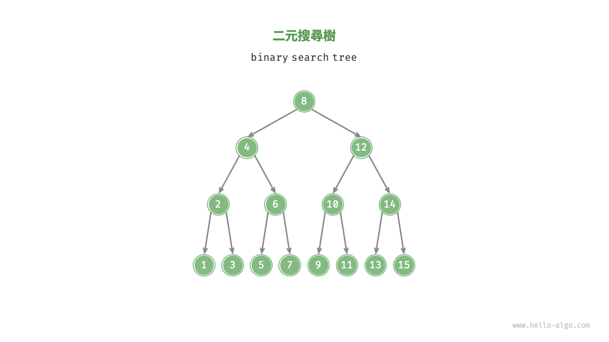

## 二元搜尋樹的操作

我們將二元搜尋樹封裝為一個類別 `BinarySearchTree` ，並宣告一個成員變數 `root` ，指向樹的根節點。

### 查詢節點

給定目標節點值 `num` ，可以根據二元搜尋樹的性質來查詢。如下圖所示，我們宣告一個節點 `cur` ，從二元樹的根節點 `root` 出發，迴圈比較節點值 `cur.val` 和 `num` 之間的大小關係。

- 若 `cur.val < num` ，說明目標節點在 `cur` 的右子樹中，因此執行 `cur = cur.right` 。
- 若 `cur.val > num` ，說明目標節點在 `cur` 的左子樹中，因此執行 `cur = cur.left` 。
- 若 `cur.val = num` ，說明找到目標節點，跳出迴圈並返回該節點。

=== "<1>"
    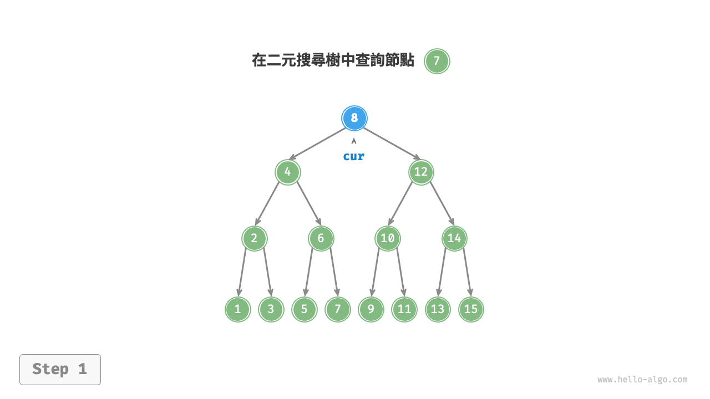

=== "<2>"
    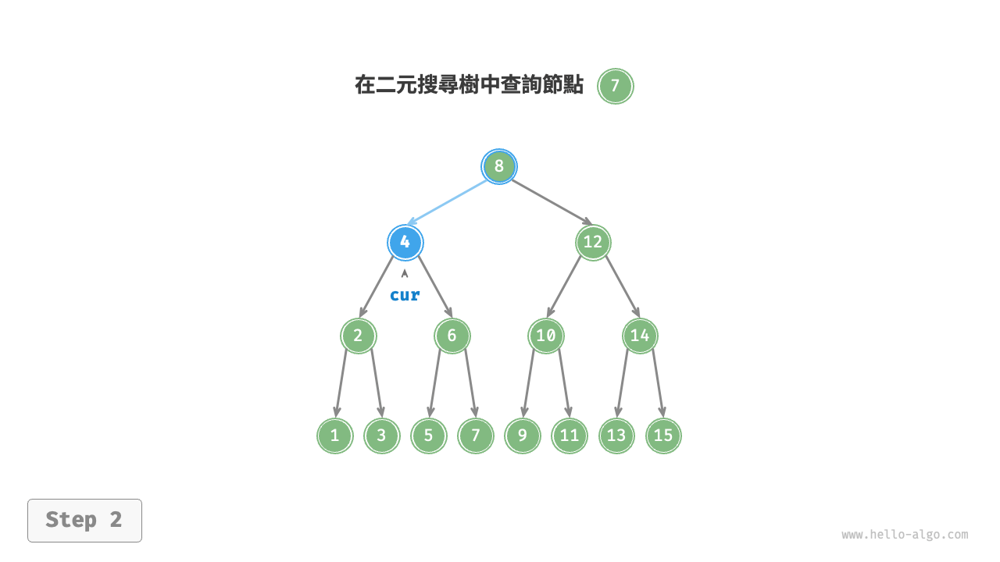

=== "<3>"
    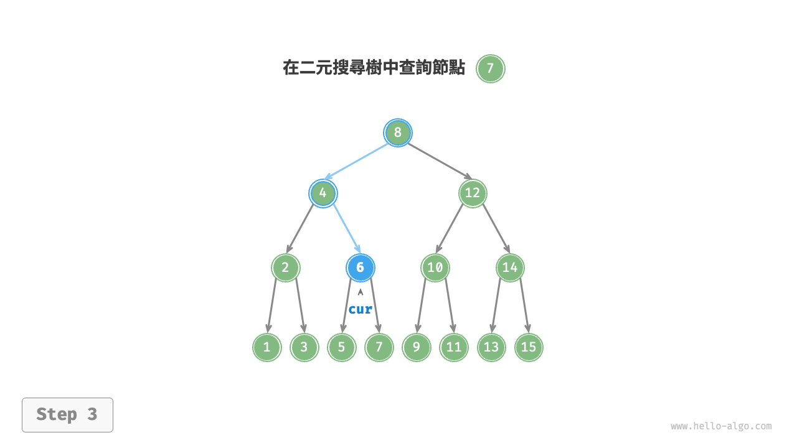

=== "<4>"
    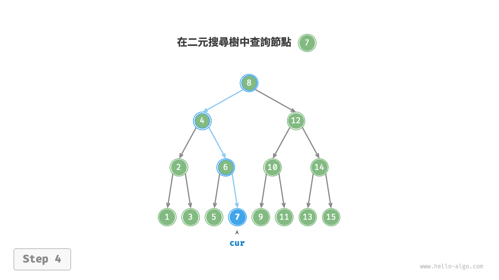

二元搜尋樹的查詢操作與二分搜尋演算法的工作原理一致，都是每輪排除一半情況。迴圈次數最多為二元樹的高度，當二元樹平衡時，使用 $O(\log n)$ 時間。示例程式碼如下：

```src
[file]{binary_search_tree}-[class]{binary_search_tree}-[func]{search}
```

### 插入節點

給定一個待插入元素 `num` ，為了保持二元搜尋樹“左子樹 < 根節點 < 右子樹”的性質，插入操作流程如下圖所示。

1. **查詢插入位置**：與查詢操作相似，從根節點出發，根據當前節點值和 `num` 的大小關係迴圈向下搜尋，直到越過葉節點（走訪至 `None` ）時跳出迴圈。
2. **在該位置插入節點**：初始化節點 `num` ，將該節點置於 `None` 的位置。

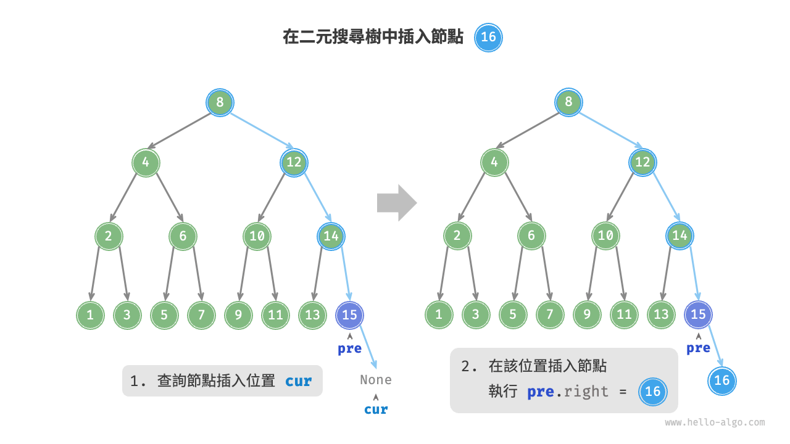

在程式碼實現中，需要注意以下兩點。

- 二元搜尋樹不允許存在重複節點，否則將違反其定義。因此，若待插入節點在樹中已存在，則不執行插入，直接返回。
- 為了實現插入節點，我們需要藉助節點 `pre` 儲存上一輪迴圈的節點。這樣在走訪至 `None` 時，我們可以獲取到其父節點，從而完成節點插入操作。

```src
[file]{binary_search_tree}-[class]{binary_search_tree}-[func]{insert}
```

與查詢節點相同，插入節點使用 $O(\log n)$ 時間。

### 刪除節點

先在二元樹中查詢到目標節點，再將其刪除。與插入節點類似，我們需要保證在刪除操作完成後，二元搜尋樹的“左子樹 < 根節點 < 右子樹”的性質仍然滿足。因此，我們根據目標節點的子節點數量，分 0、1 和 2 三種情況，執行對應的刪除節點操作。

如下圖所示，當待刪除節點的度為 $0$ 時，表示該節點是葉節點，可以直接刪除。

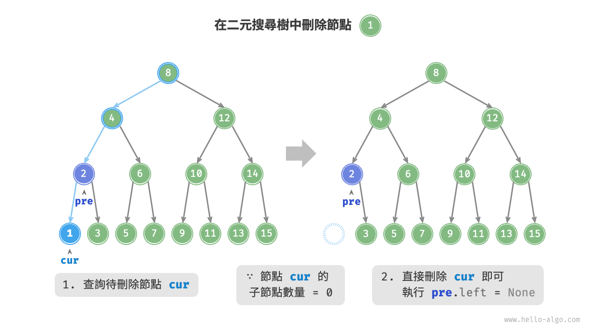

如下圖所示，當待刪除節點的度為 $1$ 時，將待刪除節點替換為其子節點即可。

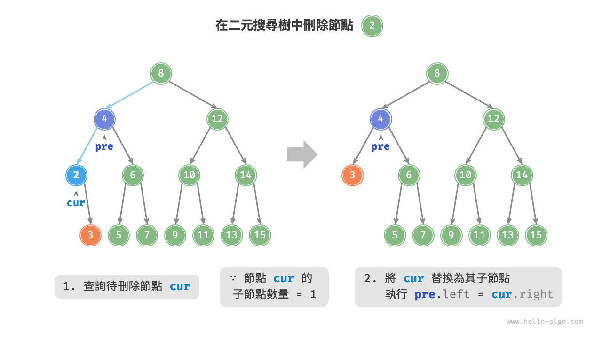

當待刪除節點的度為 $2$ 時，我們無法直接刪除它，而需要使用一個節點替換該節點。由於要保持二元搜尋樹“左子樹 $<$ 根節點 $<$ 右子樹”的性質，**因此這個節點可以是右子樹的最小節點或左子樹的最大節點**。

假設我們選擇右子樹的最小節點（中序走訪的下一個節點），則刪除操作流程如下圖所示。

1. 找到待刪除節點在“中序走訪序列”中的下一個節點，記為 `tmp` 。
2. 用 `tmp` 的值覆蓋待刪除節點的值，並在樹中遞迴刪除節點 `tmp` 。

=== "<1>"
    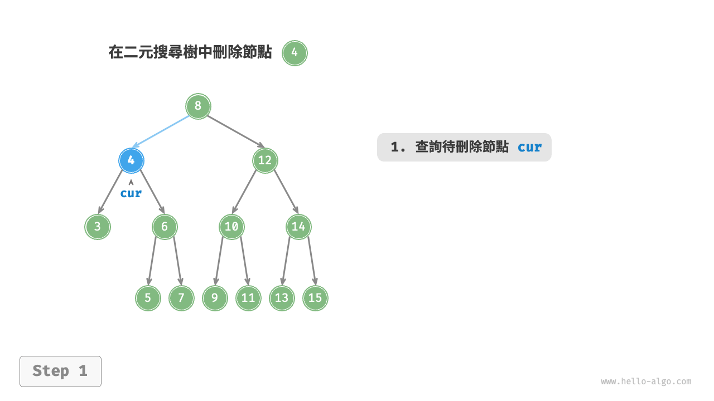

=== "<2>"
    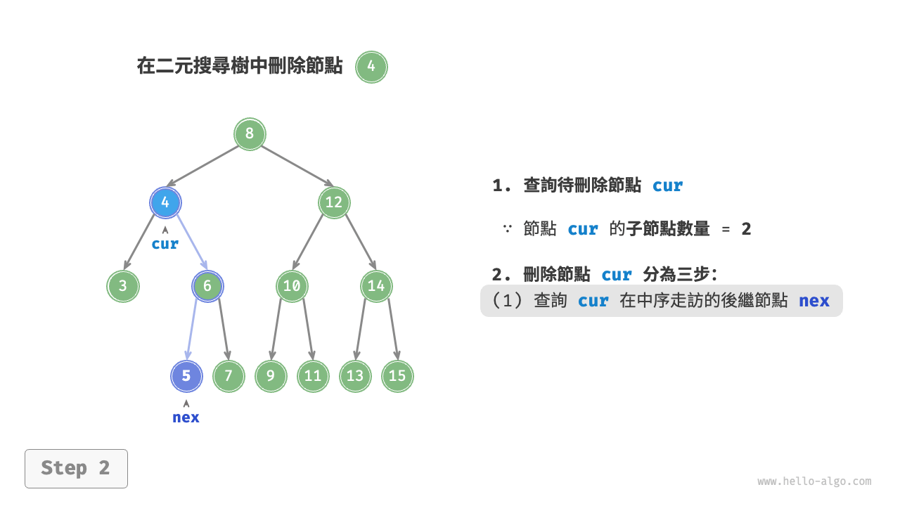

=== "<3>"
    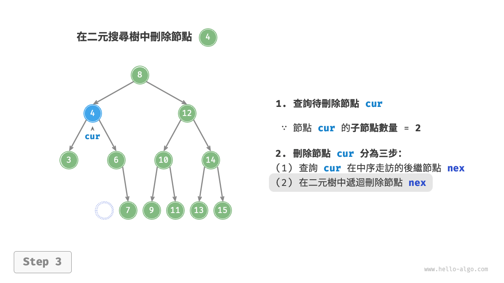

=== "<4>"
    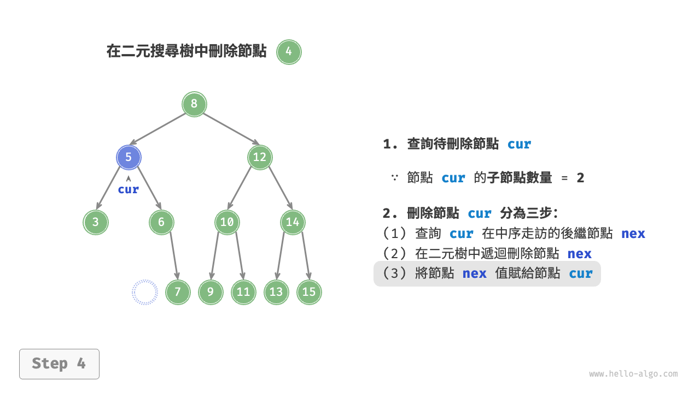

刪除節點操作同樣使用 $O(\log n)$ 時間，其中查詢待刪除節點需要 $O(\log n)$ 時間，獲取中序走訪後繼節點需要 $O(\log n)$ 時間。示例程式碼如下：

```src
[file]{binary_search_tree}-[class]{binary_search_tree}-[func]{remove}
```

### 中序走訪有序

如下圖所示，二元樹的中序走訪遵循“左 $\rightarrow$ 根 $\rightarrow$ 右”的走訪順序，而二元搜尋樹滿足“左子節點 $<$ 根節點 $<$ 右子節點”的大小關係。

這意味著在二元搜尋樹中進行中序走訪時，總是會優先走訪下一個最小節點，從而得出一個重要性質：**二元搜尋樹的中序走訪序列是升序的**。

利用中序走訪升序的性質，我們在二元搜尋樹中獲取有序資料僅需 $O(n)$ 時間，無須進行額外的排序操作，非常高效。

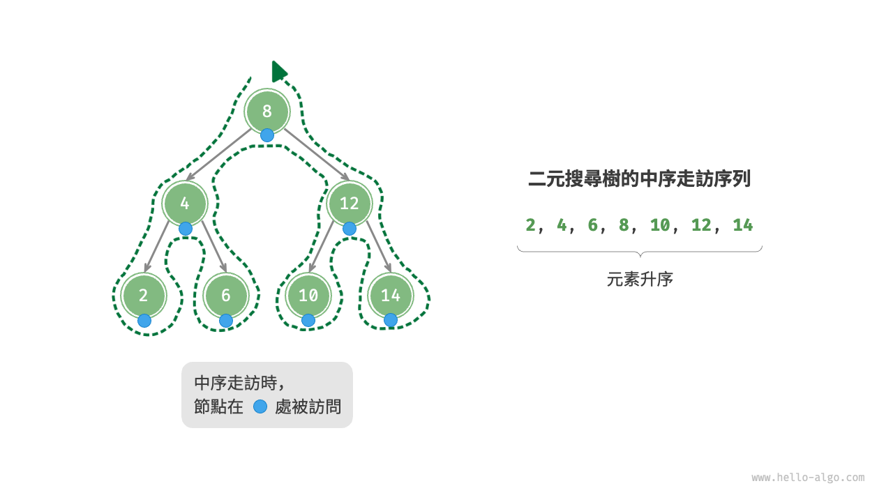

## 二元搜尋樹的效率

給定一組資料，我們考慮使用陣列或二元搜尋樹儲存。觀察下表，二元搜尋樹的各項操作的時間複雜度都是對數階，具有穩定且高效的效能。只有在高頻新增、低頻查詢刪除資料的場景下，陣列比二元搜尋樹的效率更高。

<p align="center"> 表 <id> &nbsp; 陣列與搜尋樹的效率對比 </p>

|          | 無序陣列 | 二元搜尋樹  |
| -------- | -------- | ----------- |
| 查詢元素 | $O(n)$   | $O(\log n)$ |
| 插入元素 | $O(1)$   | $O(\log n)$ |
| 刪除元素 | $O(n)$   | $O(\log n)$ |

在理想情況下，二元搜尋樹是“平衡”的，這樣就可以在 $\log n$ 輪迴圈內查詢任意節點。

然而，如果我們在二元搜尋樹中不斷地插入和刪除節點，可能導致二元樹退化為下圖所示的鏈結串列，這時各種操作的時間複雜度也會退化為 $O(n)$ 。

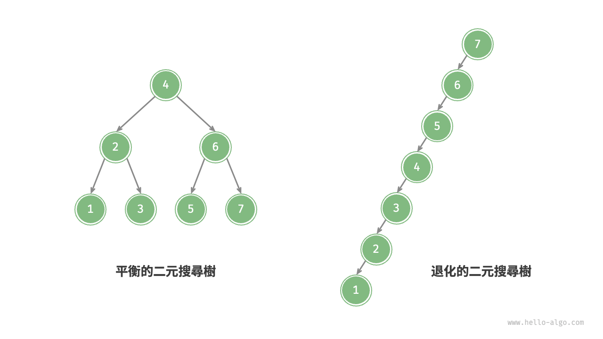

## 二元搜尋樹常見應用

- 用作系統中的多級索引，實現高效的查詢、插入、刪除操作。
- 作為某些搜尋演算法的底層資料結構。
- 用於儲存資料流，以保持其有序狀態。
