# 二元樹走訪

從物理結構的角度來看，樹是一種基於鏈結串列的資料結構，因此其走訪方式是透過指標逐個訪問節點。然而，樹是一種非線性資料結構，這使得走訪樹比走訪鏈結串列更加複雜，需要藉助搜尋演算法來實現。

二元樹常見的走訪方式包括層序走訪、前序走訪、中序走訪和後序走訪等。

## 層序走訪

如下圖所示，<u>層序走訪（level-order traversal）</u>從頂部到底部逐層走訪二元樹，並在每一層按照從左到右的順序訪問節點。

層序走訪本質上屬於<u>廣度優先走訪（breadth-first traversal）</u>，也稱<u>廣度優先搜尋（breadth-first search, BFS）</u>，它體現了一種“一圈一圈向外擴展”的逐層走訪方式。

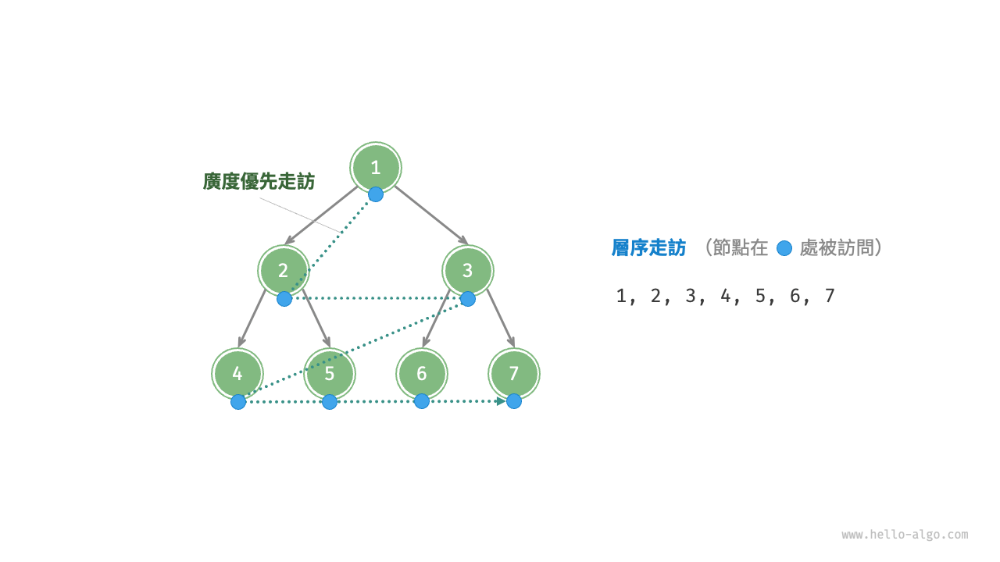

### 程式碼實現

廣度優先走訪通常藉助“佇列”來實現。佇列遵循“先進先出”的規則，而廣度優先走訪則遵循“逐層推進”的規則，兩者背後的思想是一致的。實現程式碼如下：

```src
[file]{binary_tree_bfs}-[class]{}-[func]{level_order}
```

### 複雜度分析

- **時間複雜度為 $O(n)$** ：所有節點被訪問一次，使用 $O(n)$ 時間，其中 $n$ 為節點數量。
- **空間複雜度為 $O(n)$** ：在最差情況下，即滿二元樹時，走訪到最底層之前，佇列中最多同時存在 $(n + 1) / 2$ 個節點，佔用 $O(n)$ 空間。

## 前序、中序、後序走訪

相應地，前序、中序和後序走訪都屬於<u>深度優先走訪（depth-first traversal）</u>，也稱<u>深度優先搜尋（depth-first search, DFS）</u>，它體現了一種“先走到盡頭，再回溯繼續”的走訪方式。

下圖展示了對二元樹進行深度優先走訪的工作原理。**深度優先走訪就像是繞著整棵二元樹的外圍“走”一圈**，在每個節點都會遇到三個位置，分別對應前序走訪、中序走訪和後序走訪。

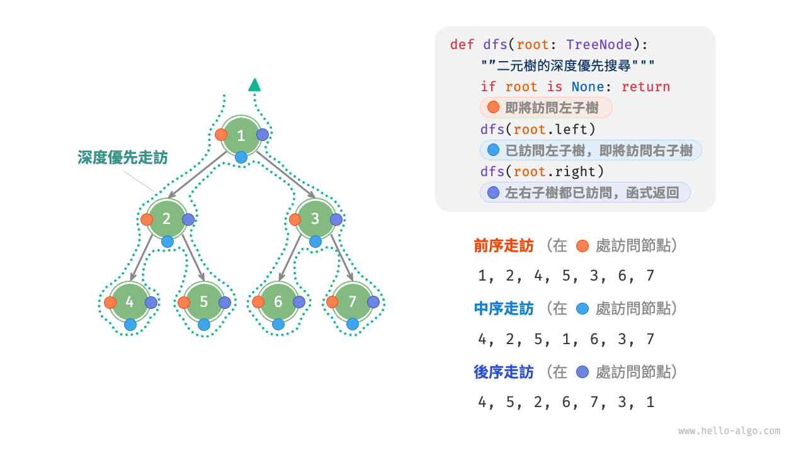

### 程式碼實現

深度優先搜尋通常基於遞迴實現：

```src
[file]{binary_tree_dfs}-[class]{}-[func]{post_order}
```

!!! tip

    深度優先搜尋也可以基於迭代實現，有興趣的讀者可以自行研究。

下圖展示了前序走訪二元樹的遞迴過程，其可分為“遞”和“迴”兩個逆向的部分。

1. “遞”表示開啟新方法，程式在此過程中訪問下一個節點。
2. “迴”表示函式返回，代表當前節點已經訪問完畢。

=== "<1>"
    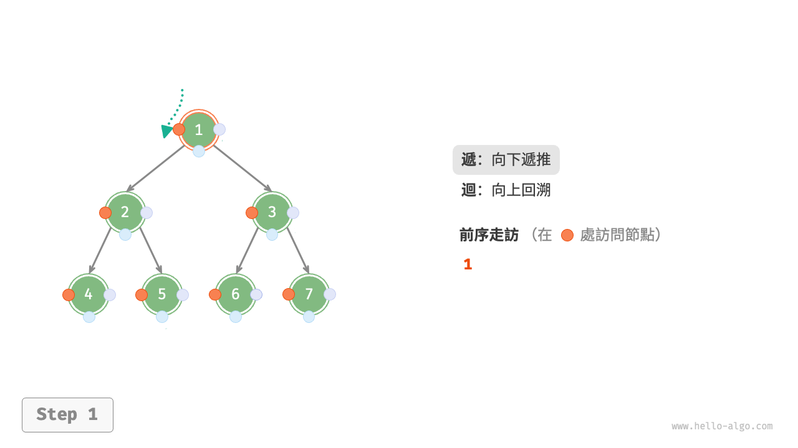

=== "<2>"
    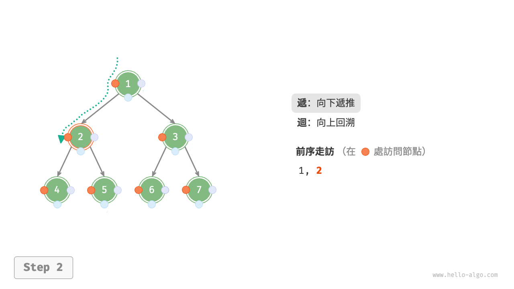

=== "<3>"
    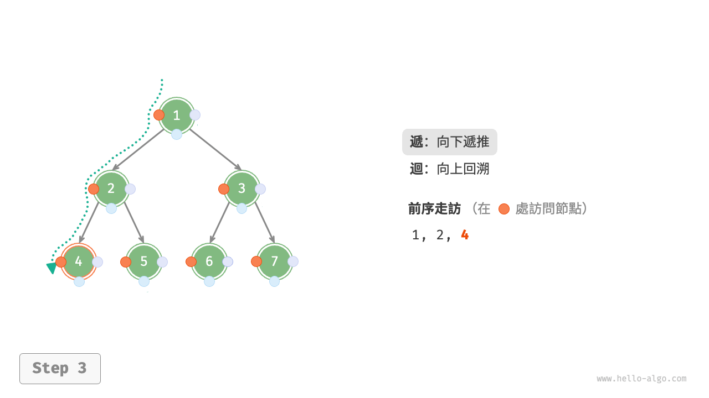

=== "<4>"
    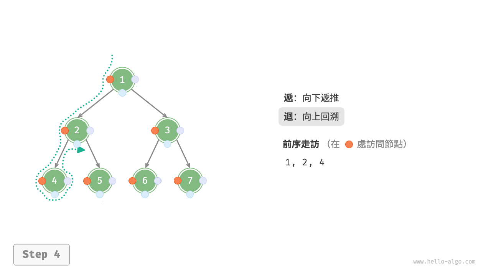

=== "<5>"
    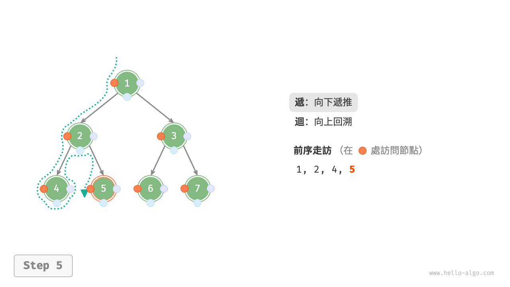

=== "<6>"
    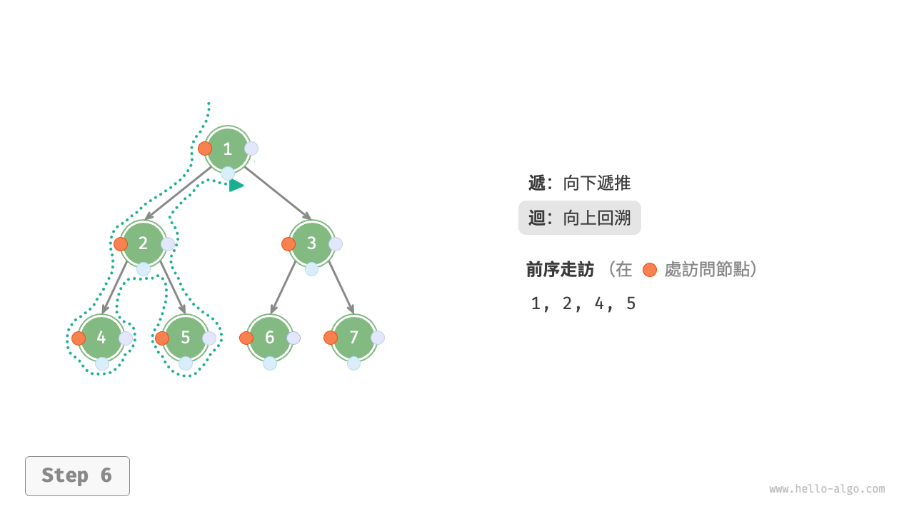

=== "<7>"
    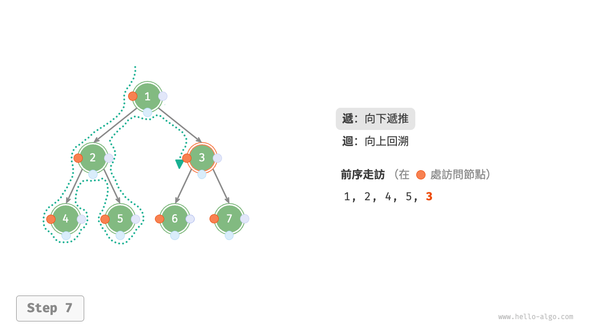

=== "<8>"
    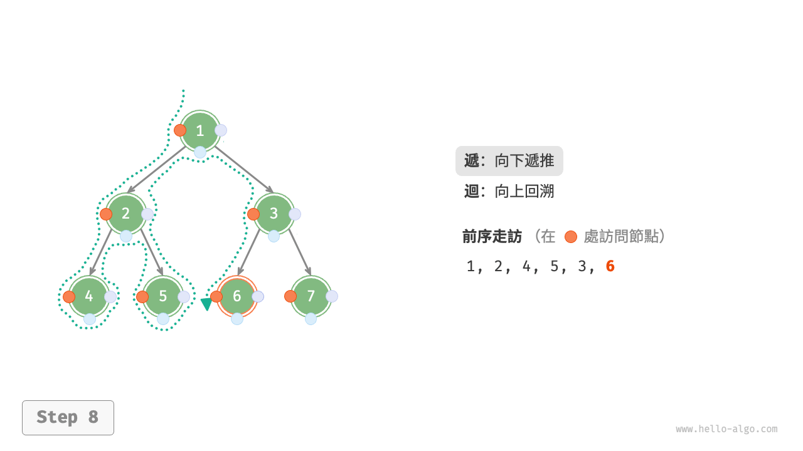

=== "<9>"
    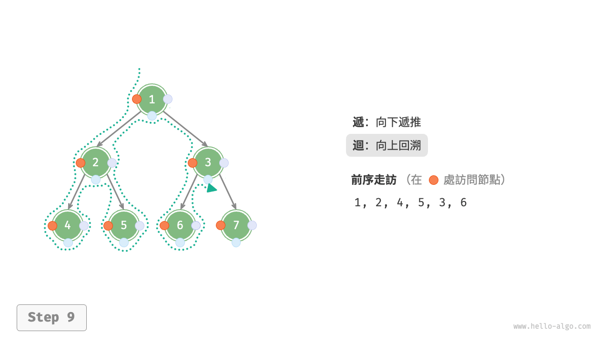

=== "<10>"
    

=== "<11>"
    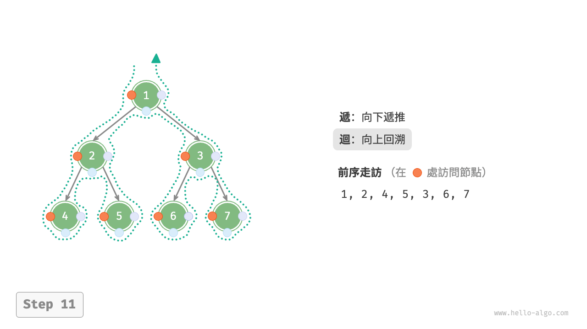

### 複雜度分析

- **時間複雜度為 $O(n)$** ：所有節點被訪問一次，使用 $O(n)$ 時間。
- **空間複雜度為 $O(n)$** ：在最差情況下，即樹退化為鏈結串列時，遞迴深度達到 $n$ ，系統佔用 $O(n)$ 堆疊幀空間。
