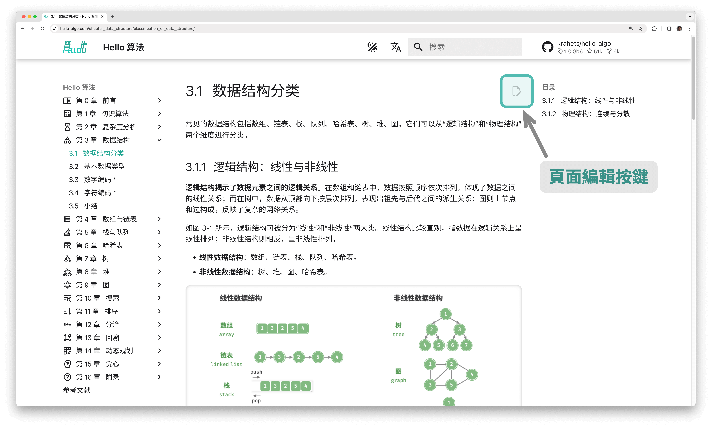

# 一起參與創作

由於筆者能力有限，書中難免存在一些遺漏和錯誤，請您諒解。如果您發現了筆誤、連結失效、內容缺失、文字歧義、解釋不清晰或行文結構不合理等問題，請協助我們進行修正，以給讀者提供更優質的學習資源。

所有[撰稿人](https://github.com/krahets/hello-algo/graphs/contributors)的 GitHub ID 將在本書倉庫、網頁版和 PDF 版的主頁上進行展示，以感謝他們對開源社群的無私奉獻。

!!! success "開源的魅力"

    紙質圖書的兩次印刷的間隔時間往往較久，內容更新非常不方便。
    
    而在本開源書中，內容更迭的時間被縮短至數日甚至幾個小時。

### 內容微調

如下圖所示，每個頁面的右上角都有“編輯圖示”。您可以按照以下步驟修改文字或程式碼。

1. 點選“編輯圖示”，如果遇到“需要 Fork 此倉庫”的提示，請同意該操作。
2. 修改 Markdown 源檔案內容，檢查內容的正確性，並儘量保持排版格式的統一。
3. 在頁面底部填寫修改說明，然後點選“Propose file change”按鈕。頁面跳轉後，點選“Create pull request”按鈕即可發起拉取請求。



圖片無法直接修改，需要透過新建 [Issue](https://github.com/krahets/hello-algo/issues) 或評論留言來描述問題，我們會盡快重新繪製並替換圖片。

### 內容創作

如果您有興趣參與此開源專案，包括將程式碼翻譯成其他程式語言、擴展文章內容等，那麼需要實施以下 Pull Request 工作流程。

1. 登入 GitHub ，將本書的[程式碼倉庫](https://github.com/krahets/hello-algo) Fork 到個人帳號下。
2. 進入您的 Fork 倉庫網頁，使用 `git clone` 命令將倉庫克隆至本地。
3. 在本地進行內容創作，並進行完整測試，驗證程式碼的正確性。
4. 將本地所做更改 Commit ，然後 Push 至遠端倉庫。
5. 重新整理倉庫網頁，點選“Create pull request”按鈕即可發起拉取請求。

### Docker 部署

在 `hello-algo` 根目錄下，執行以下 Docker 指令碼，即可在 `http://localhost:8000` 訪問本專案：

```shell
docker-compose up -d
```

使用以下命令即可刪除部署：

```shell
docker-compose down
```
