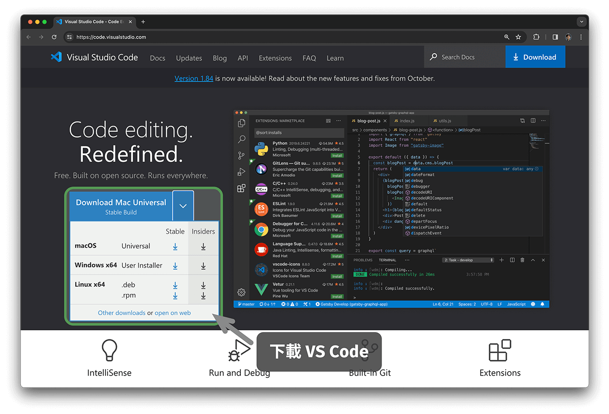
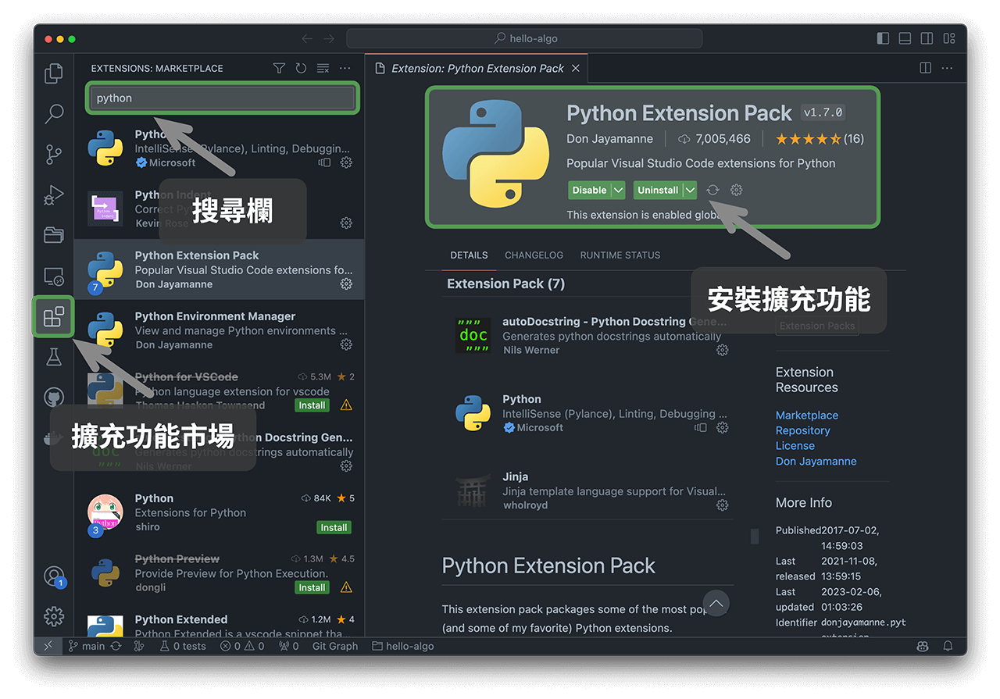

# 程式設計環境安裝

## 安裝 IDE

推薦使用開源、輕量的 VS Code 作為本地整合開發環境（IDE）。訪問 [VS Code 官網](https://code.visualstudio.com/)，根據作業系統選擇相應版本的 VS Code 進行下載和安裝。

VS Code 擁有強大的擴展包生態系統，支持大多數程式語言的執行和除錯。以 Python 為例，安裝“Python Extension Pack”擴展包之後，即可進行 Python 程式碼除錯。安裝步驟如下圖所示。

## 安裝語言環境

### Python 環境

1. 下載並安裝 [Miniconda3](https://docs.conda.io/en/latest/miniconda.html) ，需要 Python 3.10 或更新版本。
2. 在 VS Code 的擴充功能市場中搜索 `python` ，安裝 Python Extension Pack 。
3. （可選）在命令列輸入 `pip install black` ，安裝程式碼格式化工具。

### C/C++ 環境

1. Windows 系統需要安裝 [MinGW](https://sourceforge.net/projects/mingw-w64/files/)（[配置教程](https://blog.csdn.net/qq_33698226/article/details/129031241)）；MacOS 自帶 Clang ，無須安裝。
2. 在 VS Code 的擴充功能市場中搜索 `c++` ，安裝 C/C++ Extension Pack 。
3. （可選）開啟 Settings 頁面，搜尋 `Clang_format_fallback Style` 程式碼格式化選項，設定為 `{ BasedOnStyle: Microsoft, BreakBeforeBraces: Attach }` 。

### Java 環境

1. 下載並安裝 [OpenJDK](https://jdk.java.net/18/)（版本需滿足 > JDK 9）。
2. 在 VS Code 的擴充功能市場中搜索 `java` ，安裝 Extension Pack for Java 。

### C# 環境

1. 下載並安裝 [.Net 8.0](https://dotnet.microsoft.com/en-us/download) 。
2. 在 VS Code 的擴充功能市場中搜索 `C# Dev Kit` ，安裝 C# Dev Kit （[配置教程](https://code.visualstudio.com/docs/csharp/get-started)）。
3. 也可使用 Visual Studio（[安裝教程](https://learn.microsoft.com/zh-cn/visualstudio/install/install-visual-studio?view=vs-2022)）。

### Go 環境

1. 下載並安裝 [go](https://go.dev/dl/) 。
2. 在 VS Code 的擴充功能市場中搜索 `go` ，安裝 Go 。
3. 按快捷鍵 `Ctrl + Shift + P` 撥出命令欄，輸入 go ，選擇 `Go: Install/Update Tools` ，全部勾選並安裝即可。

### Swift 環境

1. 下載並安裝 [Swift](https://www.swift.org/download/) 。
2. 在 VS Code 的擴充功能市場中搜索 `swift` ，安裝 [Swift for Visual Studio Code](https://marketplace.visualstudio.com/items?itemName=sswg.swift-lang) 。

### JavaScript 環境

1. 下載並安裝 [Node.js](https://nodejs.org/en/) 。
2. （可選）在 VS Code 的擴充功能市場中搜索 `Prettier` ，安裝程式碼格式化工具。

### TypeScript 環境

1. 同 JavaScript 環境安裝步驟。
2. 安裝 [TypeScript Execute (tsx)](https://github.com/privatenumber/tsx?tab=readme-ov-file#global-installation) 。
3. 在 VS Code 的擴充功能市場中搜索 `typescript` ，安裝 [Pretty TypeScript Errors](https://marketplace.visualstudio.com/items?itemName=yoavbls.pretty-ts-errors) 。

### Dart 環境

1. 下載並安裝 [Dart](https://dart.dev/get-dart) 。
2. 在 VS Code 的擴充功能市場中搜索 `dart` ，安裝 [Dart](https://marketplace.visualstudio.com/items?itemName=Dart-Code.dart-code) 。

### Rust 環境

1. 下載並安裝 [Rust](https://www.rust-lang.org/tools/install) 。
2. 在 VS Code 的擴充功能市場中搜索 `rust` ，安裝 [rust-analyzer](https://marketplace.visualstudio.com/items?itemName=rust-lang.rust-analyzer) 。
