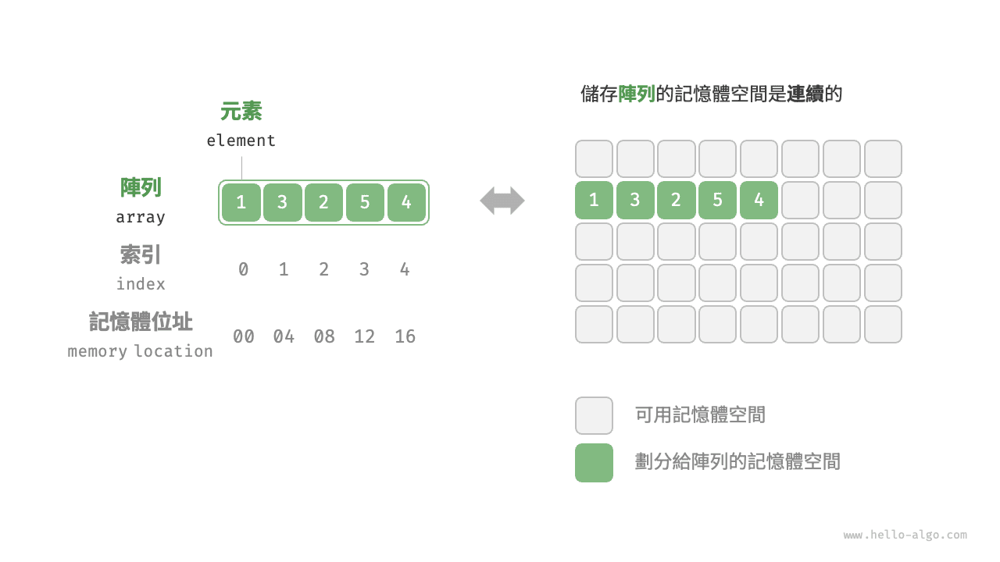
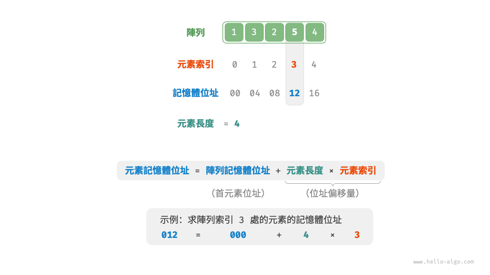
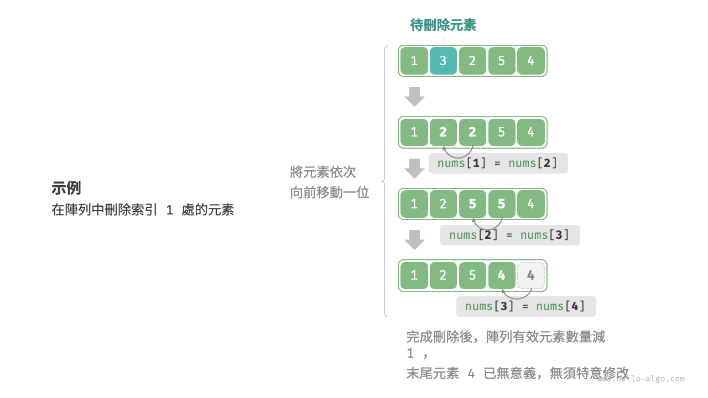

# 陣列

<u>陣列（array）</u>是一種線性資料結構，其將相同型別的元素儲存在連續的記憶體空間中。我們將元素在陣列中的位置稱為該元素的<u>索引（index）</u>。下圖展示了陣列的主要概念和儲存方式。



## 陣列常用操作

### 初始化陣列

我們可以根據需求選用陣列的兩種初始化方式：無初始值、給定初始值。在未指定初始值的情況下，大多數程式語言會將陣列元素初始化為 $0$ ：

=== "Python"

    ```python title="array.py"
    # 初始化陣列
    arr: list[int] = [0] * 5  # [ 0, 0, 0, 0, 0 ]
    nums: list[int] = [1, 3, 2, 5, 4]  
    ```

=== "C++"

    ```cpp title="array.cpp"
    /* 初始化陣列 */
    // 儲存在堆疊上
    int arr[5];
    int nums[5] = { 1, 3, 2, 5, 4 };
    // 儲存在堆積上（需要手動釋放空間）
    int* arr1 = new int[5];
    int* nums1 = new int[5] { 1, 3, 2, 5, 4 };
    ```

=== "Java"

    ```java title="array.java"
    /* 初始化陣列 */
    int[] arr = new int[5]; // { 0, 0, 0, 0, 0 }
    int[] nums = { 1, 3, 2, 5, 4 };
    ```

=== "C#"

    ```csharp title="array.cs"
    /* 初始化陣列 */
    int[] arr = new int[5]; // [ 0, 0, 0, 0, 0 ]
    int[] nums = [1, 3, 2, 5, 4];
    ```

=== "Go"

    ```go title="array.go"
    /* 初始化陣列 */
    var arr [5]int
    // 在 Go 中，指定長度時（[5]int）為陣列，不指定長度時（[]int）為切片
    // 由於 Go 的陣列被設計為在編譯期確定長度，因此只能使用常數來指定長度
    // 為了方便實現擴容 extend() 方法，以下將切片（Slice）看作陣列（Array）
    nums := []int{1, 3, 2, 5, 4}
    ```

=== "Swift"

    ```swift title="array.swift"
    /* 初始化陣列 */
    let arr = Array(repeating: 0, count: 5) // [0, 0, 0, 0, 0]
    let nums = [1, 3, 2, 5, 4]
    ```

=== "JS"

    ```javascript title="array.js"
    /* 初始化陣列 */
    var arr = new Array(5).fill(0);
    var nums = [1, 3, 2, 5, 4];
    ```

=== "TS"

    ```typescript title="array.ts"
    /* 初始化陣列 */
    let arr: number[] = new Array(5).fill(0);
    let nums: number[] = [1, 3, 2, 5, 4];
    ```

=== "Dart"

    ```dart title="array.dart"
    /* 初始化陣列 */
    List<int> arr = List.filled(5, 0); // [0, 0, 0, 0, 0]
    List<int> nums = [1, 3, 2, 5, 4];
    ```

=== "Rust"

    ```rust title="array.rs"
    /* 初始化陣列 */
    let arr: [i32; 5] = [0; 5]; // [0, 0, 0, 0, 0]
    let slice: &[i32] = &[0; 5];
    // 在 Rust 中，指定長度時（[i32; 5]）為陣列，不指定長度時（&[i32]）為切片
    // 由於 Rust 的陣列被設計為在編譯期確定長度，因此只能使用常數來指定長度
    // Vector 是 Rust 一般情況下用作動態陣列的型別
    // 為了方便實現擴容 extend() 方法，以下將 vector 看作陣列（array）
    let nums: Vec<i32> = vec![1, 3, 2, 5, 4];
    ```

=== "C"

    ```c title="array.c"
    /* 初始化陣列 */
    int arr[5] = { 0 }; // { 0, 0, 0, 0, 0 }
    int nums[5] = { 1, 3, 2, 5, 4 };
    ```

=== "Kotlin"

    ```kotlin title="array.kt"
    /* 初始化陣列 */
    var arr = IntArray(5) // { 0, 0, 0, 0, 0 }
    var nums = intArrayOf(1, 3, 2, 5, 4)
    ```

=== "Ruby"

    ```ruby title="array.rb"
    # 初始化陣列
    arr = Array.new(5, 0)
    nums = [1, 3, 2, 5, 4]
    ```

=== "Zig"

    ```zig title="array.zig"
    // 初始化陣列
    var arr = [_]i32{0} ** 5; // { 0, 0, 0, 0, 0 }
    var nums = [_]i32{ 1, 3, 2, 5, 4 };
    ```

??? pythontutor "視覺化執行"

    https://pythontutor.com/render.html#code=%23%20%E5%88%9D%E5%A7%8B%E5%8C%96%E9%99%A3%E5%88%97%0Aarr%20%3D%20%5B0%5D%20%2A%205%20%20%23%20%5B%200%2C%200%2C%200%2C%200%2C%200%20%5D%0Anums%20%3D%20%5B1%2C%203%2C%202%2C%205%2C%204%5D&cumulative=false&curInstr=0&heapPrimitives=nevernest&mode=display&origin=opt-frontend.js&py=311&rawInputLstJSON=%5B%5D&textReferences=false

### 訪問元素

陣列元素被儲存在連續的記憶體空間中，這意味著計算陣列元素的記憶體位址非常容易。給定陣列記憶體位址（首元素記憶體位址）和某個元素的索引，我們可以使用下圖所示的公式計算得到該元素的記憶體位址，從而直接訪問該元素。



觀察上圖，我們發現陣列首個元素的索引為 $0$ ，這似乎有些反直覺，因為從 $1$ 開始計數會更自然。但從位址計算公式的角度看，**索引本質上是記憶體位址的偏移量**。首個元素的位址偏移量是 $0$ ，因此它的索引為 $0$ 是合理的。

在陣列中訪問元素非常高效，我們可以在 $O(1)$ 時間內隨機訪問陣列中的任意一個元素。

```src
[file]{array}-[class]{}-[func]{random_access}
```

### 插入元素

陣列元素在記憶體中是“緊挨著的”，它們之間沒有空間再存放任何資料。如下圖所示，如果想在陣列中間插入一個元素，則需要將該元素之後的所有元素都向後移動一位，之後再把元素賦值給該索引。


值得注意的是，由於陣列的長度是固定的，因此插入一個元素必定會導致陣列尾部元素“丟失”。我們將這個問題的解決方案留在“串列”章節中討論。

```src
[file]{array}-[class]{}-[func]{insert}
```

### 刪除元素

同理，如下圖所示，若想刪除索引 $i$ 處的元素，則需要把索引 $i$ 之後的元素都向前移動一位。



請注意，刪除元素完成後，原先末尾的元素變得“無意義”了，所以我們無須特意去修改它。

```src
[file]{array}-[class]{}-[func]{remove}
```

總的來看，陣列的插入與刪除操作有以下缺點。

- **時間複雜度高**：陣列的插入和刪除的平均時間複雜度均為 $O(n)$ ，其中 $n$ 為陣列長度。
- **丟失元素**：由於陣列的長度不可變，因此在插入元素後，超出陣列長度範圍的元素會丟失。
- **記憶體浪費**：我們可以初始化一個比較長的陣列，只用前面一部分，這樣在插入資料時，丟失的末尾元素都是“無意義”的，但這樣做會造成部分記憶體空間浪費。

### 走訪陣列

在大多數程式語言中，我們既可以透過索引走訪陣列，也可以直接走訪獲取陣列中的每個元素：

```src
[file]{array}-[class]{}-[func]{traverse}
```

### 查詢元素

在陣列中查詢指定元素需要走訪陣列，每輪判斷元素值是否匹配，若匹配則輸出對應索引。

因為陣列是線性資料結構，所以上述查詢操作被稱為“線性查詢”。

```src
[file]{array}-[class]{}-[func]{find}
```

### 擴容陣列

在複雜的系統環境中，程式難以保證陣列之後的記憶體空間是可用的，從而無法安全地擴展陣列容量。因此在大多數程式語言中，**陣列的長度是不可變的**。

如果我們希望擴容陣列，則需重新建立一個更大的陣列，然後把原陣列元素依次複製到新陣列。這是一個 $O(n)$ 的操作，在陣列很大的情況下非常耗時。程式碼如下所示：

```src
[file]{array}-[class]{}-[func]{extend}
```

## 陣列的優點與侷限性

陣列儲存在連續的記憶體空間內，且元素型別相同。這種做法包含豐富的先驗資訊，系統可以利用這些資訊來最佳化資料結構的操作效率。

- **空間效率高**：陣列為資料分配了連續的記憶體塊，無須額外的結構開銷。
- **支持隨機訪問**：陣列允許在 $O(1)$ 時間內訪問任何元素。
- **快取區域性**：當訪問陣列元素時，計算機不僅會載入它，還會快取其周圍的其他資料，從而藉助高速快取來提升後續操作的執行速度。

連續空間儲存是一把雙刃劍，其存在以下侷限性。

- **插入與刪除效率低**：當陣列中元素較多時，插入與刪除操作需要移動大量的元素。
- **長度不可變**：陣列在初始化後長度就固定了，擴容陣列需要將所有資料複製到新陣列，開銷很大。
- **空間浪費**：如果陣列分配的大小超過實際所需，那麼多餘的空間就被浪費了。

## 陣列典型應用

陣列是一種基礎且常見的資料結構，既頻繁應用在各類演算法之中，也可用於實現各種複雜資料結構。

- **隨機訪問**：如果我們想隨機抽取一些樣本，那麼可以用陣列儲存，並生成一個隨機序列，根據索引實現隨機抽樣。
- **排序和搜尋**：陣列是排序和搜尋演算法最常用的資料結構。快速排序、合併排序、二分搜尋等都主要在陣列上進行。
- **查詢表**：當需要快速查詢一個元素或其對應關係時，可以使用陣列作為查詢表。假如我們想實現字元到 ASCII 碼的對映，則可以將字元的 ASCII 碼值作為索引，對應的元素存放在陣列中的對應位置。
- **機器學習**：神經網路中大量使用了向量、矩陣、張量之間的線性代數運算，這些資料都是以陣列的形式構建的。陣列是神經網路程式設計中最常使用的資料結構。
- **資料結構實現**：陣列可以用於實現堆疊、佇列、雜湊表、堆積、圖等資料結構。例如，圖的鄰接矩陣表示實際上是一個二維陣列。
