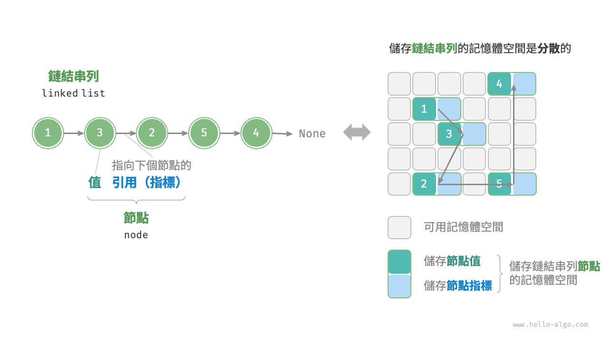
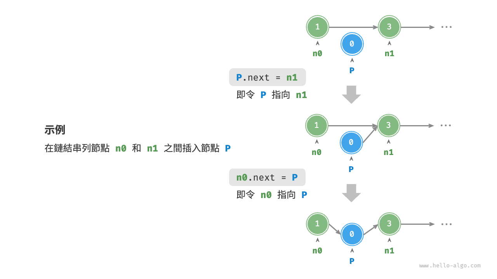
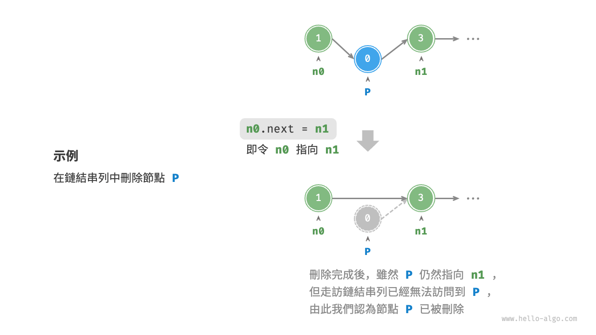
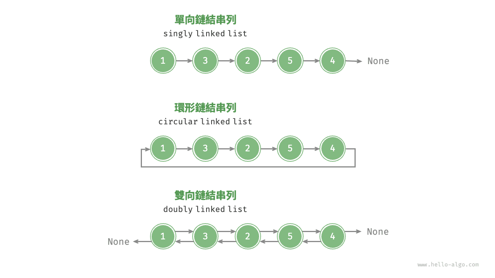

# 鏈結串列

記憶體空間是所有程式的公共資源，在一個複雜的系統執行環境下，空閒的記憶體空間可能散落在記憶體各處。我們知道，儲存陣列的記憶體空間必須是連續的，而當陣列非常大時，記憶體可能無法提供如此大的連續空間。此時鏈結串列的靈活性優勢就體現出來了。

<u>鏈結串列（linked list）</u>是一種線性資料結構，其中的每個元素都是一個節點物件，各個節點透過“引用”相連線。引用記錄了下一個節點的記憶體位址，透過它可以從當前節點訪問到下一個節點。

鏈結串列的設計使得各個節點可以分散儲存在記憶體各處，它們的記憶體位址無須連續。



觀察上圖，鏈結串列的組成單位是<u>節點（node）</u>物件。每個節點都包含兩項資料：節點的“值”和指向下一節點的“引用”。

- 鏈結串列的首個節點被稱為“頭節點”，最後一個節點被稱為“尾節點”。
- 尾節點指向的是“空”，它在 Java、C++ 和 Python 中分別被記為 `null`、`nullptr` 和 `None` 。
- 在 C、C++、Go 和 Rust 等支持指標的語言中，上述“引用”應被替換為“指標”。

如以下程式碼所示，鏈結串列節點 `ListNode` 除了包含值，還需額外儲存一個引用（指標）。因此在相同資料量下，**鏈結串列比陣列佔用更多的記憶體空間**。

=== "Python"

    ```python title=""
    class ListNode:
        """鏈結串列節點類別"""
        def __init__(self, val: int):
            self.val: int = val               # 節點值
            self.next: ListNode | None = None # 指向下一節點的引用
    ```

=== "C++"

    ```cpp title=""
    /* 鏈結串列節點結構體 */
    struct ListNode {
        int val;         // 節點值
        ListNode *next;  // 指向下一節點的指標
        ListNode(int x) : val(x), next(nullptr) {}  // 建構子
    };
    ```

=== "Java"

    ```java title=""
    /* 鏈結串列節點類別 */
    class ListNode {
        int val;        // 節點值
        ListNode next;  // 指向下一節點的引用
        ListNode(int x) { val = x; }  // 建構子
    }
    ```

=== "C#"

    ```csharp title=""
    /* 鏈結串列節點類別 */
    class ListNode(int x) {  //建構子
        int val = x;         // 節點值
        ListNode? next;      // 指向下一節點的引用
    }
    ```

=== "Go"

    ```go title=""
    /* 鏈結串列節點結構體 */
    type ListNode struct {
        Val  int       // 節點值
        Next *ListNode // 指向下一節點的指標
    }

    // NewListNode 建構子，建立一個新的鏈結串列
    func NewListNode(val int) *ListNode {
        return &ListNode{
            Val:  val,
            Next: nil,
        }
    }
    ```

=== "Swift"

    ```swift title=""
    /* 鏈結串列節點類別 */
    class ListNode {
        var val: Int // 節點值
        var next: ListNode? // 指向下一節點的引用

        init(x: Int) { // 建構子
            val = x
        }
    }
    ```

=== "JS"

    ```javascript title=""
    /* 鏈結串列節點類別 */
    class ListNode {
        constructor(val, next) {
            this.val = (val === undefined ? 0 : val);       // 節點值
            this.next = (next === undefined ? null : next); // 指向下一節點的引用
        }
    }
    ```

=== "TS"

    ```typescript title=""
    /* 鏈結串列節點類別 */
    class ListNode {
        val: number;
        next: ListNode | null;
        constructor(val?: number, next?: ListNode | null) {
            this.val = val === undefined ? 0 : val;        // 節點值
            this.next = next === undefined ? null : next;  // 指向下一節點的引用
        }
    }
    ```

=== "Dart"

    ```dart title=""
    /* 鏈結串列節點類別 */
    class ListNode {
      int val; // 節點值
      ListNode? next; // 指向下一節點的引用
      ListNode(this.val, [this.next]); // 建構子
    }
    ```

=== "Rust"

    ```rust title=""
    use std::rc::Rc;
    use std::cell::RefCell;
    /* 鏈結串列節點類別 */
    #[derive(Debug)]
    struct ListNode {
        val: i32, // 節點值
        next: Option<Rc<RefCell<ListNode>>>, // 指向下一節點的指標
    }
    ```

=== "C"

    ```c title=""
    /* 鏈結串列節點結構體 */
    typedef struct ListNode {
        int val;               // 節點值
        struct ListNode *next; // 指向下一節點的指標
    } ListNode;

    /* 建構子 */
    ListNode *newListNode(int val) {
        ListNode *node;
        node = (ListNode *) malloc(sizeof(ListNode));
        node->val = val;
        node->next = NULL;
        return node;
    }
    ```

=== "Kotlin"

    ```kotlin title=""
    /* 鏈結串列節點類別 */
    // 建構子
    class ListNode(x: Int) {
        val _val: Int = x          // 節點值
        val next: ListNode? = null // 指向下一個節點的引用
    }
    ```

=== "Ruby"

    ```ruby title=""
    # 鏈結串列節點類別
    class ListNode
      attr_accessor :val  # 節點值
      attr_accessor :next # 指向下一節點的引用

      def initialize(val=0, next_node=nil)
        @val = val
        @next = next_node
      end
    end
    ```

=== "Zig"

    ```zig title=""
    // 鏈結串列節點類別
    pub fn ListNode(comptime T: type) type {
        return struct {
            const Self = @This();

            val: T = 0, // 節點值
            next: ?*Self = null, // 指向下一節點的指標

            // 建構子
            pub fn init(self: *Self, x: i32) void {
                self.val = x;
                self.next = null;
            }
        };
    }
    ```

## 鏈結串列常用操作

### 初始化鏈結串列

建立鏈結串列分為兩步，第一步是初始化各個節點物件，第二步是構建節點之間的引用關係。初始化完成後，我們就可以從鏈結串列的頭節點出發，透過引用指向 `next` 依次訪問所有節點。

=== "Python"

    ```python title="linked_list.py"
    # 初始化鏈結串列 1 -> 3 -> 2 -> 5 -> 4
    # 初始化各個節點
    n0 = ListNode(1)
    n1 = ListNode(3)
    n2 = ListNode(2)
    n3 = ListNode(5)
    n4 = ListNode(4)
    # 構建節點之間的引用
    n0.next = n1
    n1.next = n2
    n2.next = n3
    n3.next = n4
    ```

=== "C++"

    ```cpp title="linked_list.cpp"
    /* 初始化鏈結串列 1 -> 3 -> 2 -> 5 -> 4 */
    // 初始化各個節點
    ListNode* n0 = new ListNode(1);
    ListNode* n1 = new ListNode(3);
    ListNode* n2 = new ListNode(2);
    ListNode* n3 = new ListNode(5);
    ListNode* n4 = new ListNode(4);
    // 構建節點之間的引用
    n0->next = n1;
    n1->next = n2;
    n2->next = n3;
    n3->next = n4;
    ```

=== "Java"

    ```java title="linked_list.java"
    /* 初始化鏈結串列 1 -> 3 -> 2 -> 5 -> 4 */
    // 初始化各個節點
    ListNode n0 = new ListNode(1);
    ListNode n1 = new ListNode(3);
    ListNode n2 = new ListNode(2);
    ListNode n3 = new ListNode(5);
    ListNode n4 = new ListNode(4);
    // 構建節點之間的引用
    n0.next = n1;
    n1.next = n2;
    n2.next = n3;
    n3.next = n4;
    ```

=== "C#"

    ```csharp title="linked_list.cs"
    /* 初始化鏈結串列 1 -> 3 -> 2 -> 5 -> 4 */
    // 初始化各個節點
    ListNode n0 = new(1);
    ListNode n1 = new(3);
    ListNode n2 = new(2);
    ListNode n3 = new(5);
    ListNode n4 = new(4);
    // 構建節點之間的引用
    n0.next = n1;
    n1.next = n2;
    n2.next = n3;
    n3.next = n4;
    ```

=== "Go"

    ```go title="linked_list.go"
    /* 初始化鏈結串列 1 -> 3 -> 2 -> 5 -> 4 */
    // 初始化各個節點
    n0 := NewListNode(1)
    n1 := NewListNode(3)
    n2 := NewListNode(2)
    n3 := NewListNode(5)
    n4 := NewListNode(4)
    // 構建節點之間的引用
    n0.Next = n1
    n1.Next = n2
    n2.Next = n3
    n3.Next = n4
    ```

=== "Swift"

    ```swift title="linked_list.swift"
    /* 初始化鏈結串列 1 -> 3 -> 2 -> 5 -> 4 */
    // 初始化各個節點
    let n0 = ListNode(x: 1)
    let n1 = ListNode(x: 3)
    let n2 = ListNode(x: 2)
    let n3 = ListNode(x: 5)
    let n4 = ListNode(x: 4)
    // 構建節點之間的引用
    n0.next = n1
    n1.next = n2
    n2.next = n3
    n3.next = n4
    ```

=== "JS"

    ```javascript title="linked_list.js"
    /* 初始化鏈結串列 1 -> 3 -> 2 -> 5 -> 4 */
    // 初始化各個節點
    const n0 = new ListNode(1);
    const n1 = new ListNode(3);
    const n2 = new ListNode(2);
    const n3 = new ListNode(5);
    const n4 = new ListNode(4);
    // 構建節點之間的引用
    n0.next = n1;
    n1.next = n2;
    n2.next = n3;
    n3.next = n4;
    ```

=== "TS"

    ```typescript title="linked_list.ts"
    /* 初始化鏈結串列 1 -> 3 -> 2 -> 5 -> 4 */
    // 初始化各個節點
    const n0 = new ListNode(1);
    const n1 = new ListNode(3);
    const n2 = new ListNode(2);
    const n3 = new ListNode(5);
    const n4 = new ListNode(4);
    // 構建節點之間的引用
    n0.next = n1;
    n1.next = n2;
    n2.next = n3;
    n3.next = n4;
    ```

=== "Dart"

    ```dart title="linked_list.dart"
    /* 初始化鏈結串列 1 -> 3 -> 2 -> 5 -> 4 */\
    // 初始化各個節點
    ListNode n0 = ListNode(1);
    ListNode n1 = ListNode(3);
    ListNode n2 = ListNode(2);
    ListNode n3 = ListNode(5);
    ListNode n4 = ListNode(4);
    // 構建節點之間的引用
    n0.next = n1;
    n1.next = n2;
    n2.next = n3;
    n3.next = n4;
    ```

=== "Rust"

    ```rust title="linked_list.rs"
    /* 初始化鏈結串列 1 -> 3 -> 2 -> 5 -> 4 */
    // 初始化各個節點
    let n0 = Rc::new(RefCell::new(ListNode { val: 1, next: None }));
    let n1 = Rc::new(RefCell::new(ListNode { val: 3, next: None }));
    let n2 = Rc::new(RefCell::new(ListNode { val: 2, next: None }));
    let n3 = Rc::new(RefCell::new(ListNode { val: 5, next: None }));
    let n4 = Rc::new(RefCell::new(ListNode { val: 4, next: None }));

    // 構建節點之間的引用
    n0.borrow_mut().next = Some(n1.clone());
    n1.borrow_mut().next = Some(n2.clone());
    n2.borrow_mut().next = Some(n3.clone());
    n3.borrow_mut().next = Some(n4.clone());
    ```

=== "C"

    ```c title="linked_list.c"
    /* 初始化鏈結串列 1 -> 3 -> 2 -> 5 -> 4 */
    // 初始化各個節點
    ListNode* n0 = newListNode(1);
    ListNode* n1 = newListNode(3);
    ListNode* n2 = newListNode(2);
    ListNode* n3 = newListNode(5);
    ListNode* n4 = newListNode(4);
    // 構建節點之間的引用
    n0->next = n1;
    n1->next = n2;
    n2->next = n3;
    n3->next = n4;
    ```

=== "Kotlin"

    ```kotlin title="linked_list.kt"
    /* 初始化鏈結串列 1 -> 3 -> 2 -> 5 -> 4 */
    // 初始化各個節點
    val n0 = ListNode(1)
    val n1 = ListNode(3)
    val n2 = ListNode(2)
    val n3 = ListNode(5)
    val n4 = ListNode(4)
    // 構建節點之間的引用
    n0.next = n1;
    n1.next = n2;
    n2.next = n3;
    n3.next = n4;
    ```

=== "Ruby"

    ```ruby title="linked_list.rb"
    # 初始化鏈結串列 1 -> 3 -> 2 -> 5 -> 4
    # 初始化各個節點
    n0 = ListNode.new(1)
    n1 = ListNode.new(3)
    n2 = ListNode.new(2)
    n3 = ListNode.new(5)
    n4 = ListNode.new(4)
    # 構建節點之間的引用
    n0.next = n1
    n1.next = n2
    n2.next = n3
    n3.next = n4
    ```

=== "Zig"

    ```zig title="linked_list.zig"
    // 初始化鏈結串列
    // 初始化各個節點
    var n0 = inc.ListNode(i32){.val = 1};
    var n1 = inc.ListNode(i32){.val = 3};
    var n2 = inc.ListNode(i32){.val = 2};
    var n3 = inc.ListNode(i32){.val = 5};
    var n4 = inc.ListNode(i32){.val = 4};
    // 構建節點之間的引用
    n0.next = &n1;
    n1.next = &n2;
    n2.next = &n3;
    n3.next = &n4;
    ```

??? pythontutor "視覺化執行"

    https://pythontutor.com/render.html#code=class%20ListNode%3A%0A%20%20%20%20%22%22%22%E9%8F%88%E7%B5%90%E4%B8%B2%E5%88%97%E7%AF%80%E9%BB%9E%E9%A1%9E%E5%88%A5%22%22%22%0A%20%20%20%20def%20__init__%28self%2C%20val%3A%20int%29%3A%0A%20%20%20%20%20%20%20%20self.val%3A%20int%20%3D%20val%20%20%23%20%E7%AF%80%E9%BB%9E%E5%80%BC%0A%20%20%20%20%20%20%20%20self.next%3A%20ListNode%20%7C%20None%20%3D%20None%20%20%23%20%E5%BE%8C%E7%B9%BC%E7%AF%80%E9%BB%9E%E5%BC%95%E7%94%A8%0A%0A%22%22%22Driver%20Code%22%22%22%0Aif%20__name__%20%3D%3D%20%22__main__%22%3A%0A%20%20%20%20%23%20%E5%88%9D%E5%A7%8B%E5%8C%96%E9%8F%88%E7%B5%90%E4%B8%B2%E5%88%97%201%20-%3E%203%20-%3E%202%20-%3E%205%20-%3E%204%0A%20%20%20%20%23%20%E5%88%9D%E5%A7%8B%E5%8C%96%E5%90%84%E5%80%8B%E7%AF%80%E9%BB%9E%0A%20%20%20%20n0%20%3D%20ListNode%281%29%0A%20%20%20%20n1%20%3D%20ListNode%283%29%0A%20%20%20%20n2%20%3D%20ListNode%282%29%0A%20%20%20%20n3%20%3D%20ListNode%285%29%0A%20%20%20%20n4%20%3D%20ListNode%284%29%0A%20%20%20%20%23%20%E6%A7%8B%E5%BB%BA%E7%AF%80%E9%BB%9E%E4%B9%8B%E9%96%93%E7%9A%84%E5%BC%95%E7%94%A8%0A%20%20%20%20n0.next%20%3D%20n1%0A%20%20%20%20n1.next%20%3D%20n2%0A%20%20%20%20n2.next%20%3D%20n3%0A%20%20%20%20n3.next%20%3D%20n4&cumulative=false&curInstr=3&heapPrimitives=nevernest&mode=display&origin=opt-frontend.js&py=311&rawInputLstJSON=%5B%5D&textReferences=false

陣列整體是一個變數，比如陣列 `nums` 包含元素 `nums[0]` 和 `nums[1]` 等，而鏈結串列是由多個獨立的節點物件組成的。**我們通常將頭節點當作鏈結串列的代稱**，比如以上程式碼中的鏈結串列可記作鏈結串列 `n0` 。

### 插入節點

在鏈結串列中插入節點非常容易。如下圖所示，假設我們想在相鄰的兩個節點 `n0` 和 `n1` 之間插入一個新節點 `P` ，**則只需改變兩個節點引用（指標）即可**，時間複雜度為 $O(1)$ 。

相比之下，在陣列中插入元素的時間複雜度為 $O(n)$ ，在大資料量下的效率較低。



```src
[file]{linked_list}-[class]{}-[func]{insert}
```

### 刪除節點

如下圖所示，在鏈結串列中刪除節點也非常方便，**只需改變一個節點的引用（指標）即可**。

請注意，儘管在刪除操作完成後節點 `P` 仍然指向 `n1` ，但實際上走訪此鏈結串列已經無法訪問到 `P` ，這意味著 `P` 已經不再屬於該鏈結串列了。



```src
[file]{linked_list}-[class]{}-[func]{remove}
```

### 訪問節點

**在鏈結串列中訪問節點的效率較低**。如上一節所述，我們可以在 $O(1)$ 時間下訪問陣列中的任意元素。鏈結串列則不然，程式需要從頭節點出發，逐個向後走訪，直至找到目標節點。也就是說，訪問鏈結串列的第 $i$ 個節點需要迴圈 $i - 1$ 輪，時間複雜度為 $O(n)$ 。

```src
[file]{linked_list}-[class]{}-[func]{access}
```

### 查詢節點

走訪鏈結串列，查詢其中值為 `target` 的節點，輸出該節點在鏈結串列中的索引。此過程也屬於線性查詢。程式碼如下所示：

```src
[file]{linked_list}-[class]{}-[func]{find}
```

## 陣列 vs. 鏈結串列

下表總結了陣列和鏈結串列的各項特點並對比了操作效率。由於它們採用兩種相反的儲存策略，因此各種性質和操作效率也呈現對立的特點。

<p align="center"> 表 <id> &nbsp; 陣列與鏈結串列的效率對比 </p>

|          | 陣列                           | 鏈結串列           |
| -------- | ------------------------------ | -------------- |
| 儲存方式 | 連續記憶體空間                   | 分散記憶體空間   |
| 容量擴展 | 長度不可變                     | 可靈活擴展     |
| 記憶體效率 | 元素佔用記憶體少、但可能浪費空間 | 元素佔用記憶體多 |
| 訪問元素 | $O(1)$                         | $O(n)$         |
| 新增元素 | $O(n)$                         | $O(1)$         |
| 刪除元素 | $O(n)$                         | $O(1)$         |

## 常見鏈結串列型別

如下圖所示，常見的鏈結串列型別包括三種。

- **單向鏈結串列**：即前面介紹的普通鏈結串列。單向鏈結串列的節點包含值和指向下一節點的引用兩項資料。我們將首個節點稱為頭節點，將最後一個節點稱為尾節點，尾節點指向空 `None` 。
- **環形鏈結串列**：如果我們令單向鏈結串列的尾節點指向頭節點（首尾相接），則得到一個環形鏈結串列。在環形鏈結串列中，任意節點都可以視作頭節點。
- **雙向鏈結串列**：與單向鏈結串列相比，雙向鏈結串列記錄了兩個方向的引用。雙向鏈結串列的節點定義同時包含指向後繼節點（下一個節點）和前驅節點（上一個節點）的引用（指標）。相較於單向鏈結串列，雙向鏈結串列更具靈活性，可以朝兩個方向走訪鏈結串列，但相應地也需要佔用更多的記憶體空間。

=== "Python"

    ```python title=""
    class ListNode:
        """雙向鏈結串列節點類別"""
        def __init__(self, val: int):
            self.val: int = val                # 節點值
            self.next: ListNode | None = None  # 指向後繼節點的引用
            self.prev: ListNode | None = None  # 指向前驅節點的引用
    ```

=== "C++"

    ```cpp title=""
    /* 雙向鏈結串列節點結構體 */
    struct ListNode {
        int val;         // 節點值
        ListNode *next;  // 指向後繼節點的指標
        ListNode *prev;  // 指向前驅節點的指標
        ListNode(int x) : val(x), next(nullptr), prev(nullptr) {}  // 建構子
    };
    ```

=== "Java"

    ```java title=""
    /* 雙向鏈結串列節點類別 */
    class ListNode {
        int val;        // 節點值
        ListNode next;  // 指向後繼節點的引用
        ListNode prev;  // 指向前驅節點的引用
        ListNode(int x) { val = x; }  // 建構子
    }
    ```

=== "C#"

    ```csharp title=""
    /* 雙向鏈結串列節點類別 */
    class ListNode(int x) {  // 建構子
        int val = x;    // 節點值
        ListNode next;  // 指向後繼節點的引用
        ListNode prev;  // 指向前驅節點的引用
    }
    ```

=== "Go"

    ```go title=""
    /* 雙向鏈結串列節點結構體 */
    type DoublyListNode struct {
        Val  int             // 節點值
        Next *DoublyListNode // 指向後繼節點的指標
        Prev *DoublyListNode // 指向前驅節點的指標
    }

    // NewDoublyListNode 初始化
    func NewDoublyListNode(val int) *DoublyListNode {
        return &DoublyListNode{
            Val:  val,
            Next: nil,
            Prev: nil,
        }
    }
    ```

=== "Swift"

    ```swift title=""
    /* 雙向鏈結串列節點類別 */
    class ListNode {
        var val: Int // 節點值
        var next: ListNode? // 指向後繼節點的引用
        var prev: ListNode? // 指向前驅節點的引用

        init(x: Int) { // 建構子
            val = x
        }
    }
    ```

=== "JS"

    ```javascript title=""
    /* 雙向鏈結串列節點類別 */
    class ListNode {
        constructor(val, next, prev) {
            this.val = val  ===  undefined ? 0 : val;        // 節點值
            this.next = next  ===  undefined ? null : next;  // 指向後繼節點的引用
            this.prev = prev  ===  undefined ? null : prev;  // 指向前驅節點的引用
        }
    }
    ```

=== "TS"

    ```typescript title=""
    /* 雙向鏈結串列節點類別 */
    class ListNode {
        val: number;
        next: ListNode | null;
        prev: ListNode | null;
        constructor(val?: number, next?: ListNode | null, prev?: ListNode | null) {
            this.val = val  ===  undefined ? 0 : val;        // 節點值
            this.next = next  ===  undefined ? null : next;  // 指向後繼節點的引用
            this.prev = prev  ===  undefined ? null : prev;  // 指向前驅節點的引用
        }
    }
    ```

=== "Dart"

    ```dart title=""
    /* 雙向鏈結串列節點類別 */
    class ListNode {
        int val;        // 節點值
        ListNode next;  // 指向後繼節點的引用
        ListNode prev;  // 指向前驅節點的引用
        ListNode(this.val, [this.next, this.prev]);  // 建構子
    }
    ```

=== "Rust"

    ```rust title=""
    use std::rc::Rc;
    use std::cell::RefCell;

    /* 雙向鏈結串列節點型別 */
    #[derive(Debug)]
    struct ListNode {
        val: i32, // 節點值
        next: Option<Rc<RefCell<ListNode>>>, // 指向後繼節點的指標
        prev: Option<Rc<RefCell<ListNode>>>, // 指向前驅節點的指標
    }

    /* 建構子 */
    impl ListNode {
        fn new(val: i32) -> Self {
            ListNode {
                val,
                next: None,
                prev: None,
            }
        }
    }
    ```

=== "C"

    ```c title=""
    /* 雙向鏈結串列節點結構體 */
    typedef struct ListNode {
        int val;               // 節點值
        struct ListNode *next; // 指向後繼節點的指標
        struct ListNode *prev; // 指向前驅節點的指標
    } ListNode;

    /* 建構子 */
    ListNode *newListNode(int val) {
        ListNode *node;
        node = (ListNode *) malloc(sizeof(ListNode));
        node->val = val;
        node->next = NULL;
        node->prev = NULL;
        return node;
    }
    ```

=== "Kotlin"

    ```kotlin title=""
    /* 雙向鏈結串列節點類別 */
    // 建構子
    class ListNode(x: Int) {
        val _val: Int = x           // 節點值
        val next: ListNode? = null  // 指向後繼節點的引用
        val prev: ListNode? = null  // 指向前驅節點的引用
    }
    ```

=== "Ruby"

    ```ruby title=""
    # 雙向鏈結串列節點類別
    class ListNode
      attr_accessor :val    # 節點值
      attr_accessor :next   # 指向後繼節點的引用
      attr_accessor :prev   # 指向前驅節點的引用

      def initialize(val=0, next_node=nil, prev_node=nil)
        @val = val
        @next = next_node
        @prev = prev_node
      end
    end
    ```

=== "Zig"

    ```zig title=""
    // 雙向鏈結串列節點類別
    pub fn ListNode(comptime T: type) type {
        return struct {
            const Self = @This();

            val: T = 0, // 節點值
            next: ?*Self = null, // 指向後繼節點的指標
            prev: ?*Self = null, // 指向前驅節點的指標

            // 建構子
            pub fn init(self: *Self, x: i32) void {
                self.val = x;
                self.next = null;
                self.prev = null;
            }
        };
    }
    ```



## 鏈結串列典型應用

單向鏈結串列通常用於實現堆疊、佇列、雜湊表和圖等資料結構。

- **堆疊與佇列**：當插入和刪除操作都在鏈結串列的一端進行時，它表現出先進後出的特性，對應堆疊；當插入操作在鏈結串列的一端進行，刪除操作在鏈結串列的另一端進行，它表現出先進先出的特性，對應佇列。
- **雜湊表**：鏈式位址是解決雜湊衝突的主流方案之一，在該方案中，所有衝突的元素都會被放到一個鏈結串列中。
- **圖**：鄰接表是表示圖的一種常用方式，其中圖的每個頂點都與一個鏈結串列相關聯，鏈結串列中的每個元素都代表與該頂點相連的其他頂點。

雙向鏈結串列常用於需要快速查詢前一個和後一個元素的場景。

- **高階資料結構**：比如在紅黑樹、B 樹中，我們需要訪問節點的父節點，這可以透過在節點中儲存一個指向父節點的引用來實現，類似於雙向鏈結串列。
- **瀏覽器歷史**：在網頁瀏覽器中，當用戶點選前進或後退按鈕時，瀏覽器需要知道使用者訪問過的前一個和後一個網頁。雙向鏈結串列的特性使得這種操作變得簡單。
- **LRU 演算法**：在快取淘汰（LRU）演算法中，我們需要快速找到最近最少使用的資料，以及支持快速新增和刪除節點。這時候使用雙向鏈結串列就非常合適。

環形鏈結串列常用於需要週期性操作的場景，比如作業系統的資源排程。

- **時間片輪轉排程演算法**：在作業系統中，時間片輪轉排程演算法是一種常見的 CPU 排程演算法，它需要對一組程序進行迴圈。每個程序被賦予一個時間片，當時間片用完時，CPU 將切換到下一個程序。這種迴圈操作可以透過環形鏈結串列來實現。
- **資料緩衝區**：在某些資料緩衝區的實現中，也可能會使用環形鏈結串列。比如在音訊、影片播放器中，資料流可能會被分成多個緩衝塊並放入一個環形鏈結串列，以便實現無縫播放。
