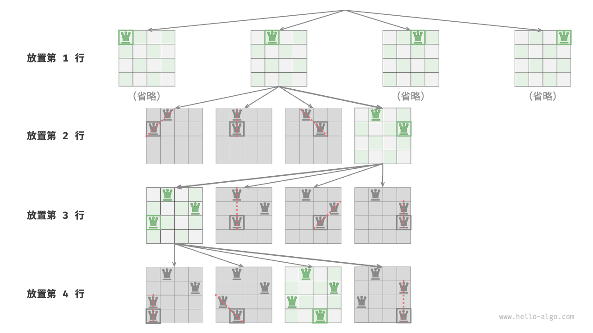

# n 皇后問題

!!! question

    根據國際象棋的規則，皇后可以攻擊與同處一行、一列或一條斜線上的棋子。給定 $n$ 個皇后和一個 $n \times n$ 大小的棋盤，尋找使得所有皇后之間無法相互攻擊的擺放方案。

如下圖所示，當 $n = 4$ 時，共可以找到兩個解。從回溯演算法的角度看，$n \times n$ 大小的棋盤共有 $n^2$ 個格子，給出了所有的選擇 `choices` 。在逐個放置皇后的過程中，棋盤狀態在不斷地變化，每個時刻的棋盤就是狀態 `state` 。


下圖展示了本題的三個約束條件：**多個皇后不能在同一行、同一列、同一條對角線上**。值得注意的是，對角線分為主對角線 `\` 和次對角線 `/` 兩種。


### 逐行放置策略

皇后的數量和棋盤的行數都為 $n$ ，因此我們容易得到一個推論：**棋盤每行都允許且只允許放置一個皇后**。

也就是說，我們可以採取逐行放置策略：從第一行開始，在每行放置一個皇后，直至最後一行結束。

下圖所示為 4 皇后問題的逐行放置過程。受畫幅限制，下圖僅展開了第一行的其中一個搜尋分支，並且將不滿足列約束和對角線約束的方案都進行了剪枝。



從本質上看，**逐行放置策略起到了剪枝的作用**，它避免了同一行出現多個皇后的所有搜尋分支。

### 列與對角線剪枝

為了滿足列約束，我們可以利用一個長度為 $n$ 的布林型陣列 `cols` 記錄每一列是否有皇后。在每次決定放置前，我們透過 `cols` 將已有皇后的列進行剪枝，並在回溯中動態更新 `cols` 的狀態。

!!! tip

    請注意，矩陣的起點位於左上角，其中行索引從上到下增加，列索引從左到右增加。

那麼，如何處理對角線約束呢？設棋盤中某個格子的行列索引為 $(row, col)$ ，選定矩陣中的某條主對角線，我們發現該對角線上所有格子的行索引減列索引都相等，**即主對角線上所有格子的 $row - col$ 為恆定值**。

也就是說，如果兩個格子滿足 $row_1 - col_1 = row_2 - col_2$ ，則它們一定處在同一條主對角線上。利用該規律，我們可以藉助下圖所示的陣列 `diags1` 記錄每條主對角線上是否有皇后。

同理，**次對角線上的所有格子的 $row + col$ 是恆定值**。我們同樣也可以藉助陣列 `diags2` 來處理次對角線約束。


### 程式碼實現

請注意，$n$ 維方陣中 $row - col$ 的範圍是 $[-n + 1, n - 1]$ ，$row + col$ 的範圍是 $[0, 2n - 2]$ ，所以主對角線和次對角線的數量都為 $2n - 1$ ，即陣列 `diags1` 和 `diags2` 的長度都為 $2n - 1$ 。

```src
[file]{n_queens}-[class]{}-[func]{n_queens}
```

逐行放置 $n$ 次，考慮列約束，則從第一行到最後一行分別有 $n$、$n-1$、$\dots$、$2$、$1$ 個選擇，使用 $O(n!)$ 時間。當記錄解時，需要複製矩陣 `state` 並新增進 `res` ，複製操作使用 $O(n^2)$ 時間。因此，**總體時間複雜度為 $O(n! \cdot n^2)$** 。實際上，根據對角線約束的剪枝也能夠大幅縮小搜尋空間，因而搜尋效率往往優於以上時間複雜度。

陣列 `state` 使用 $O(n^2)$ 空間，陣列 `cols`、`diags1` 和 `diags2` 皆使用 $O(n)$ 空間。最大遞迴深度為 $n$ ，使用 $O(n)$ 堆疊幀空間。因此，**空間複雜度為 $O(n^2)$** 。
