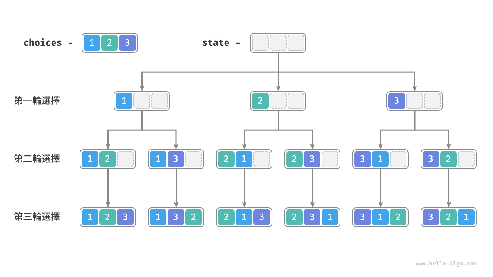
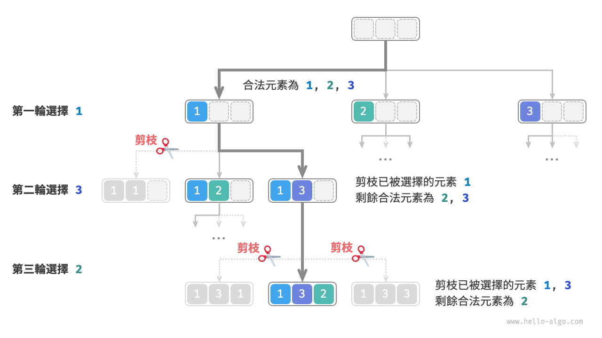
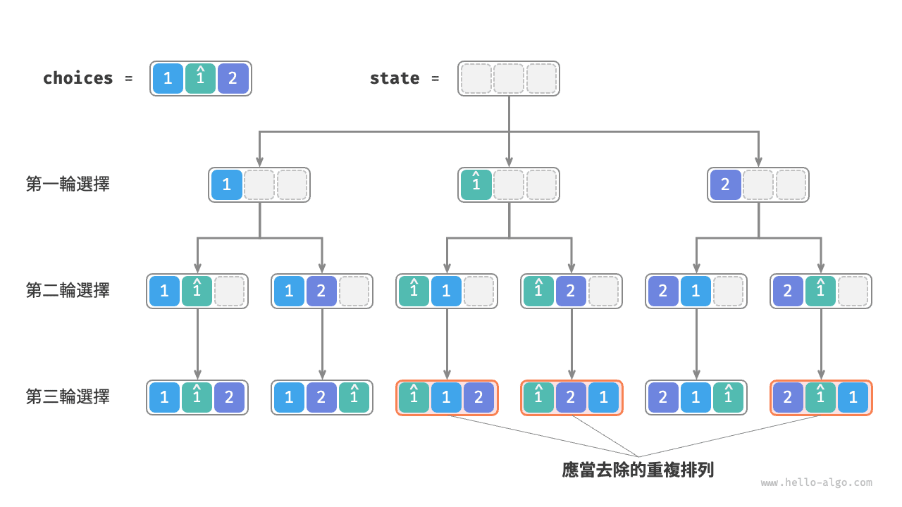
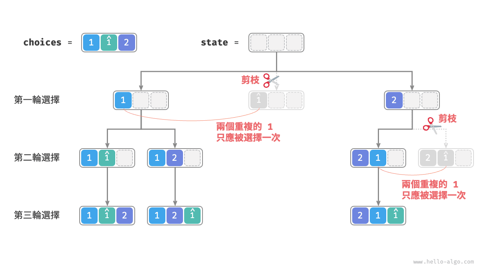
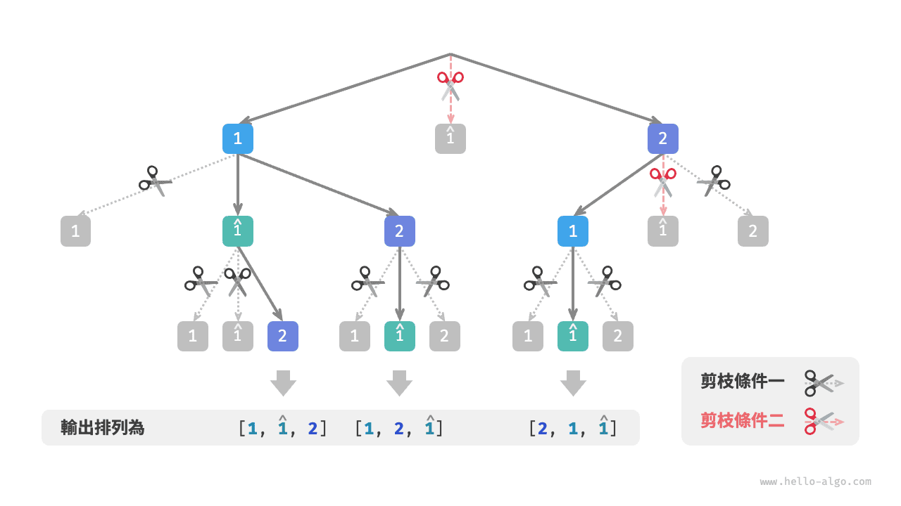

# 全排列問題

全排列問題是回溯演算法的一個典型應用。它的定義是在給定一個集合（如一個陣列或字串）的情況下，找出其中元素的所有可能的排列。

下表列舉了幾個示例資料，包括輸入陣列和對應的所有排列。

<p align="center"> 表 <id> &nbsp; 全排列示例 </p>

| 輸入陣列    | 所有排列                                                           |
| :---------- | :----------------------------------------------------------------- |
| $[1]$       | $[1]$                                                              |
| $[1, 2]$    | $[1, 2], [2, 1]$                                                   |
| $[1, 2, 3]$ | $[1, 2, 3], [1, 3, 2], [2, 1, 3], [2, 3, 1], [3, 1, 2], [3, 2, 1]$ |

## 無相等元素的情況

!!! question

    輸入一個整數陣列，其中不包含重複元素，返回所有可能的排列。

從回溯演算法的角度看，**我們可以把生成排列的過程想象成一系列選擇的結果**。假設輸入陣列為 $[1, 2, 3]$ ，如果我們先選擇 $1$ ，再選擇 $3$ ，最後選擇 $2$ ，則獲得排列 $[1, 3, 2]$ 。回退表示撤銷一個選擇，之後繼續嘗試其他選擇。

從回溯程式碼的角度看，候選集合 `choices` 是輸入陣列中的所有元素，狀態 `state` 是直至目前已被選擇的元素。請注意，每個元素只允許被選擇一次，**因此 `state` 中的所有元素都應該是唯一的**。

如下圖所示，我們可以將搜尋過程展開成一棵遞迴樹，樹中的每個節點代表當前狀態 `state` 。從根節點開始，經過三輪選擇後到達葉節點，每個葉節點都對應一個排列。



### 重複選擇剪枝

為了實現每個元素只被選擇一次，我們考慮引入一個布林型陣列 `selected` ，其中 `selected[i]` 表示 `choices[i]` 是否已被選擇，並基於它實現以下剪枝操作。

- 在做出選擇 `choice[i]` 後，我們就將 `selected[i]` 賦值為 $\text{True}$ ，代表它已被選擇。
- 走訪選擇串列 `choices` 時，跳過所有已被選擇的節點，即剪枝。

如下圖所示，假設我們第一輪選擇 1 ，第二輪選擇 3 ，第三輪選擇 2 ，則需要在第二輪剪掉元素 1 的分支，在第三輪剪掉元素 1 和元素 3 的分支。



觀察上圖發現，該剪枝操作將搜尋空間大小從 $O(n^n)$ 減小至 $O(n!)$ 。

### 程式碼實現

想清楚以上資訊之後，我們就可以在框架程式碼中做“完形填空”了。為了縮短整體程式碼，我們不單獨實現框架程式碼中的各個函式，而是將它們展開在 `backtrack()` 函式中：

```src
[file]{permutations_i}-[class]{}-[func]{permutations_i}
```

## 考慮相等元素的情況

!!! question

    輸入一個整數陣列，**陣列中可能包含重複元素**，返回所有不重複的排列。

假設輸入陣列為 $[1, 1, 2]$ 。為了方便區分兩個重複元素 $1$ ，我們將第二個 $1$ 記為 $\hat{1}$ 。

如下圖所示，上述方法生成的排列有一半是重複的。



那麼如何去除重複的排列呢？最直接地，考慮藉助一個雜湊集合，直接對排列結果進行去重。然而這樣做不夠優雅，**因為生成重複排列的搜尋分支沒有必要，應當提前識別並剪枝**，這樣可以進一步提升演算法效率。

### 相等元素剪枝

觀察下圖，在第一輪中，選擇 $1$ 或選擇 $\hat{1}$ 是等價的，在這兩個選擇之下生成的所有排列都是重複的。因此應該把 $\hat{1}$ 剪枝。

同理，在第一輪選擇 $2$ 之後，第二輪選擇中的 $1$ 和 $\hat{1}$ 也會產生重複分支，因此也應將第二輪的 $\hat{1}$ 剪枝。

從本質上看，**我們的目標是在某一輪選擇中，保證多個相等的元素僅被選擇一次**。



### 程式碼實現

在上一題的程式碼的基礎上，我們考慮在每一輪選擇中開啟一個雜湊集合 `duplicated` ，用於記錄該輪中已經嘗試過的元素，並將重複元素剪枝：

```src
[file]{permutations_ii}-[class]{}-[func]{permutations_ii}
```

假設元素兩兩之間互不相同，則 $n$ 個元素共有 $n!$  種排列（階乘）；在記錄結果時，需要複製長度為 $n$ 的串列，使用 $O(n)$ 時間。**因此時間複雜度為 $O(n!n)$** 。

最大遞迴深度為 $n$ ，使用 $O(n)$ 堆疊幀空間。`selected` 使用 $O(n)$ 空間。同一時刻最多共有 $n$ 個 `duplicated` ，使用 $O(n^2)$ 空間。**因此空間複雜度為 $O(n^2)$** 。

### 兩種剪枝對比

請注意，雖然 `selected` 和 `duplicated` 都用於剪枝，但兩者的目標不同。

- **重複選擇剪枝**：整個搜尋過程中只有一個 `selected` 。它記錄的是當前狀態中包含哪些元素，其作用是避免某個元素在 `state` 中重複出現。
- **相等元素剪枝**：每輪選擇（每個呼叫的 `backtrack` 函式）都包含一個 `duplicated` 。它記錄的是在本輪走訪（`for` 迴圈）中哪些元素已被選擇過，其作用是保證相等元素只被選擇一次。

下圖展示了兩個剪枝條件的生效範圍。注意，樹中的每個節點代表一個選擇，從根節點到葉節點的路徑上的各個節點構成一個排列。


