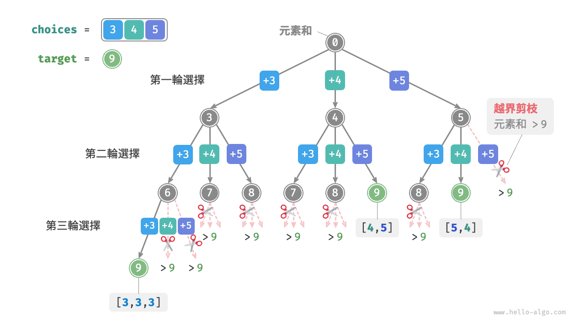
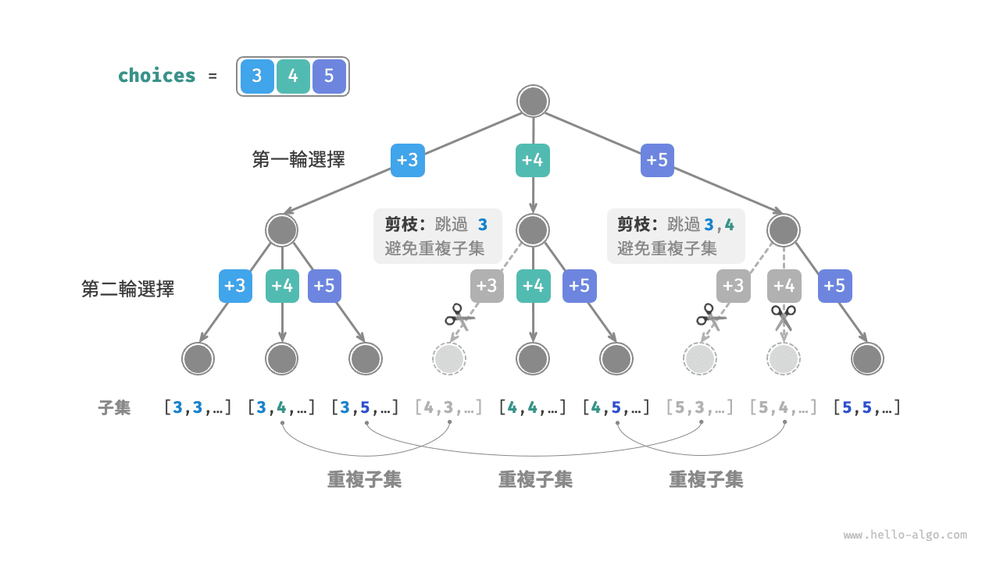
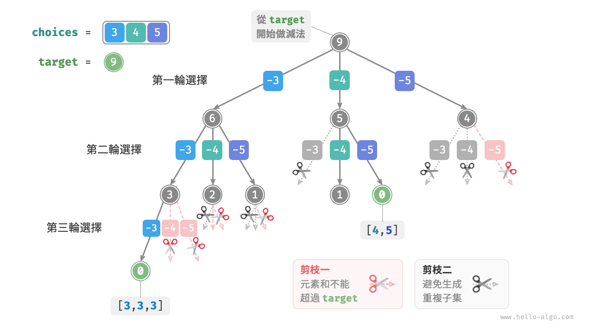
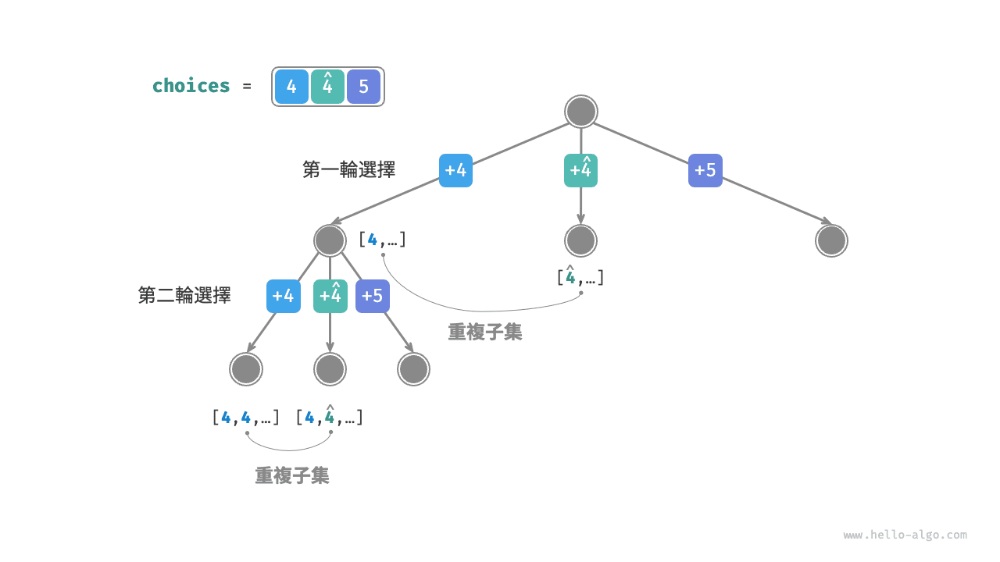
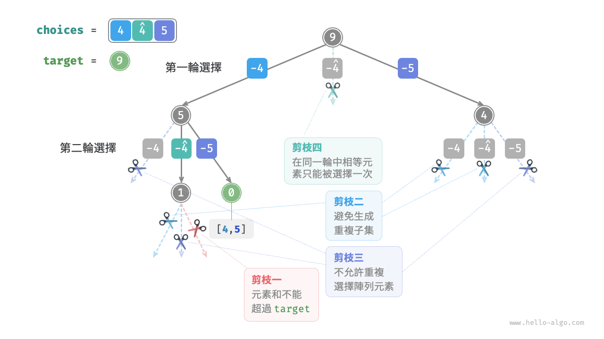

# 子集和問題

## 無重複元素的情況

!!! question

    給定一個正整數陣列 `nums` 和一個目標正整數 `target` ，請找出所有可能的組合，使得組合中的元素和等於 `target` 。給定陣列無重複元素，每個元素可以被選取多次。請以串列形式返回這些組合，串列中不應包含重複組合。

例如，輸入集合 $\{3, 4, 5\}$ 和目標整數 $9$ ，解為 $\{3, 3, 3\}, \{4, 5\}$ 。需要注意以下兩點。

- 輸入集合中的元素可以被無限次重複選取。
- 子集不區分元素順序，比如 $\{4, 5\}$ 和 $\{5, 4\}$ 是同一個子集。

### 參考全排列解法

類似於全排列問題，我們可以把子集的生成過程想象成一系列選擇的結果，並在選擇過程中實時更新“元素和”，當元素和等於 `target` 時，就將子集記錄至結果串列。

而與全排列問題不同的是，**本題集合中的元素可以被無限次選取**，因此無須藉助 `selected` 布林串列來記錄元素是否已被選擇。我們可以對全排列程式碼進行小幅修改，初步得到解題程式碼：

```src
[file]{subset_sum_i_naive}-[class]{}-[func]{subset_sum_i_naive}
```

向以上程式碼輸入陣列 $[3, 4, 5]$ 和目標元素 $9$ ，輸出結果為 $[3, 3, 3], [4, 5], [5, 4]$ 。**雖然成功找出了所有和為 $9$ 的子集，但其中存在重複的子集 $[4, 5]$ 和 $[5, 4]$** 。

這是因為搜尋過程是區分選擇順序的，然而子集不區分選擇順序。如下圖所示，先選 $4$ 後選 $5$ 與先選 $5$ 後選 $4$ 是不同的分支，但對應同一個子集。



為了去除重複子集，**一種直接的思路是對結果串列進行去重**。但這個方法效率很低，有兩方面原因。

- 當陣列元素較多，尤其是當 `target` 較大時，搜尋過程會產生大量的重複子集。
- 比較子集（陣列）的異同非常耗時，需要先排序陣列，再比較陣列中每個元素的異同。

### 重複子集剪枝

**我們考慮在搜尋過程中透過剪枝進行去重**。觀察下圖，重複子集是在以不同順序選擇陣列元素時產生的，例如以下情況。

1. 當第一輪和第二輪分別選擇 $3$ 和 $4$ 時，會生成包含這兩個元素的所有子集，記為 $[3, 4, \dots]$ 。
2. 之後，當第一輪選擇 $4$ 時，**則第二輪應該跳過 $3$** ，因為該選擇產生的子集 $[4, 3, \dots]$ 和第 `1.` 步中生成的子集完全重複。

在搜尋過程中，每一層的選擇都是從左到右被逐個嘗試的，因此越靠右的分支被剪掉的越多。

1. 前兩輪選擇 $3$ 和 $5$ ，生成子集 $[3, 5, \dots]$ 。
2. 前兩輪選擇 $4$ 和 $5$ ，生成子集 $[4, 5, \dots]$ 。
3. 若第一輪選擇 $5$ ，**則第二輪應該跳過 $3$ 和 $4$** ，因為子集 $[5, 3, \dots]$ 和 $[5, 4, \dots]$ 與第 `1.` 步和第 `2.` 步中描述的子集完全重複。



總結來看，給定輸入陣列 $[x_1, x_2, \dots, x_n]$ ，設搜尋過程中的選擇序列為 $[x_{i_1}, x_{i_2}, \dots, x_{i_m}]$ ，則該選擇序列需要滿足 $i_1 \leq i_2 \leq \dots \leq i_m$ ，**不滿足該條件的選擇序列都會造成重複，應當剪枝**。

### 程式碼實現

為實現該剪枝，我們初始化變數 `start` ，用於指示走訪起始點。**當做出選擇 $x_{i}$ 後，設定下一輪從索引 $i$ 開始走訪**。這樣做就可以讓選擇序列滿足 $i_1 \leq i_2 \leq \dots \leq i_m$ ，從而保證子集唯一。

除此之外，我們還對程式碼進行了以下兩項最佳化。

- 在開啟搜尋前，先將陣列 `nums` 排序。在走訪所有選擇時，**當子集和超過 `target` 時直接結束迴圈**，因為後邊的元素更大，其子集和一定超過 `target` 。
- 省去元素和變數 `total` ，**透過在 `target` 上執行減法來統計元素和**，當 `target` 等於 $0$ 時記錄解。

```src
[file]{subset_sum_i}-[class]{}-[func]{subset_sum_i}
```

下圖所示為將陣列 $[3, 4, 5]$ 和目標元素 $9$ 輸入以上程式碼後的整體回溯過程。



## 考慮重複元素的情況

!!! question

    給定一個正整數陣列 `nums` 和一個目標正整數 `target` ，請找出所有可能的組合，使得組合中的元素和等於 `target` 。**給定陣列可能包含重複元素，每個元素只可被選擇一次**。請以串列形式返回這些組合，串列中不應包含重複組合。

相比於上題，**本題的輸入陣列可能包含重複元素**，這引入了新的問題。例如，給定陣列 $[4, \hat{4}, 5]$ 和目標元素 $9$ ，則現有程式碼的輸出結果為 $[4, 5], [\hat{4}, 5]$ ，出現了重複子集。

**造成這種重複的原因是相等元素在某輪中被多次選擇**。在下圖中，第一輪共有三個選擇，其中兩個都為 $4$ ，會產生兩個重複的搜尋分支，從而輸出重複子集；同理，第二輪的兩個 $4$ 也會產生重複子集。



### 相等元素剪枝

為解決此問題，**我們需要限制相等元素在每一輪中只能被選擇一次**。實現方式比較巧妙：由於陣列是已排序的，因此相等元素都是相鄰的。這意味著在某輪選擇中，若當前元素與其左邊元素相等，則說明它已經被選擇過，因此直接跳過當前元素。

與此同時，**本題規定每個陣列元素只能被選擇一次**。幸運的是，我們也可以利用變數 `start` 來滿足該約束：當做出選擇 $x_{i}$ 後，設定下一輪從索引 $i + 1$ 開始向後走訪。這樣既能去除重複子集，也能避免重複選擇元素。

### 程式碼實現

```src
[file]{subset_sum_ii}-[class]{}-[func]{subset_sum_ii}
```

下圖展示了陣列 $[4, 4, 5]$ 和目標元素 $9$ 的回溯過程，共包含四種剪枝操作。請你將圖示與程式碼註釋相結合，理解整個搜尋過程，以及每種剪枝操作是如何工作的。


