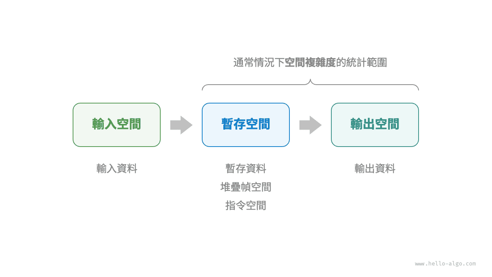
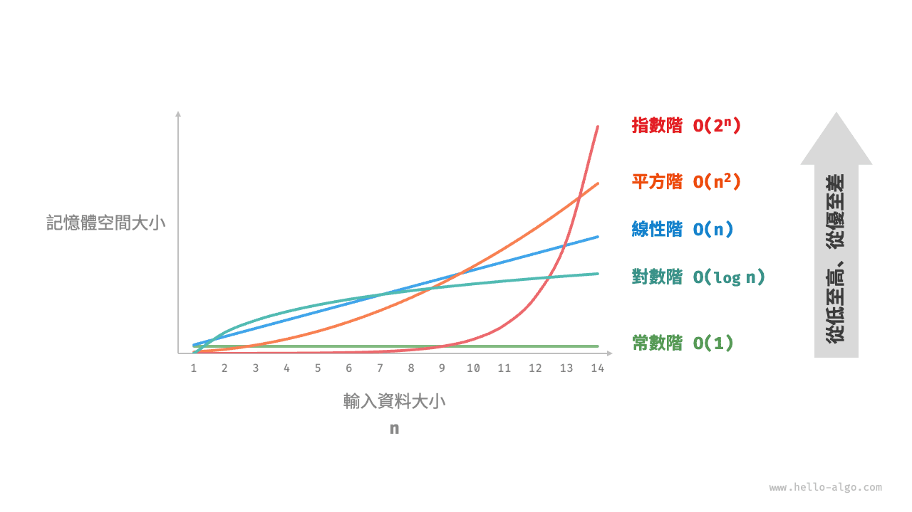
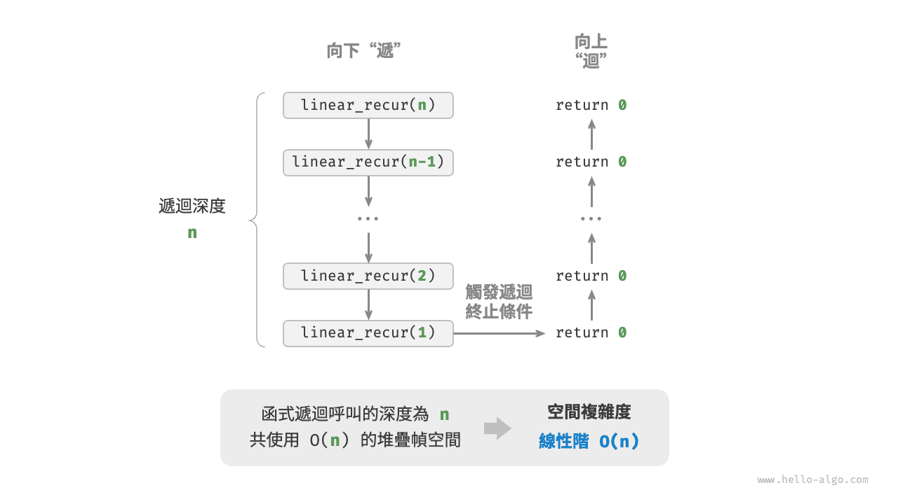
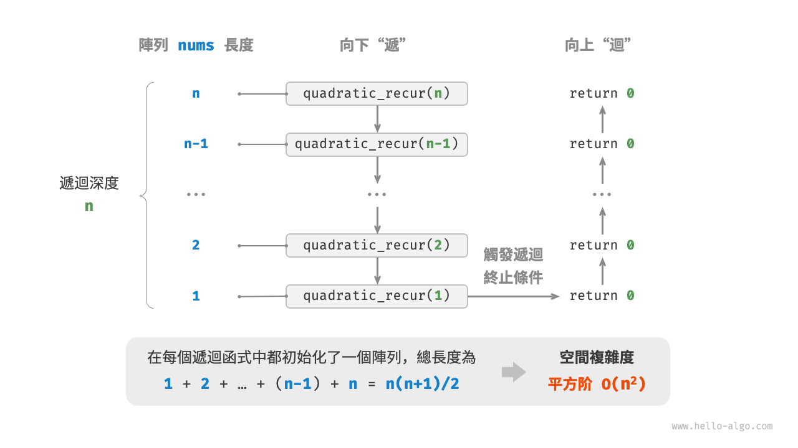
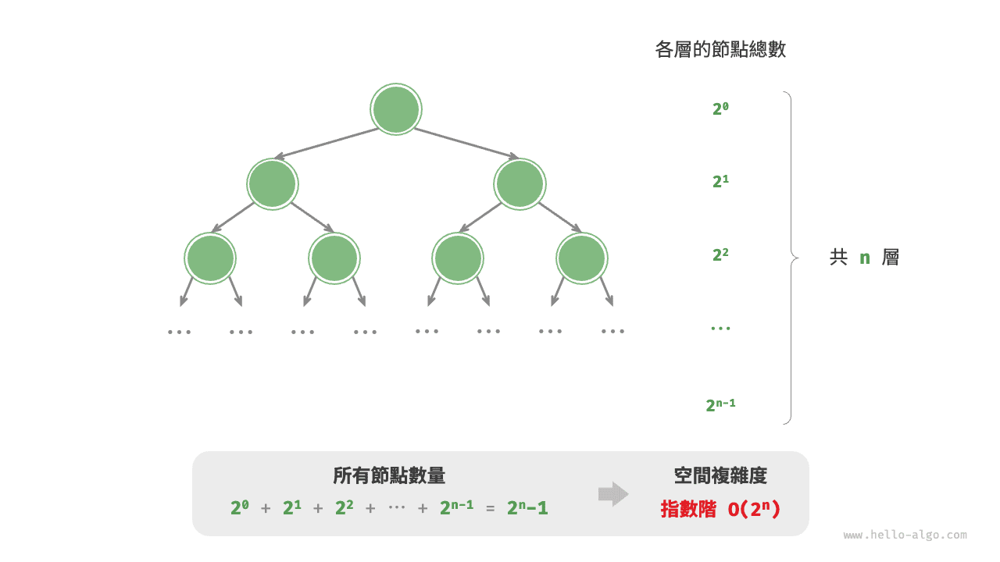

# 空間複雜度

<u>空間複雜度（space complexity）</u>用於衡量演算法佔用記憶體空間隨著資料量變大時的增長趨勢。這個概念與時間複雜度非常類似，只需將“執行時間”替換為“佔用記憶體空間”。

## 演算法相關空間

演算法在執行過程中使用的記憶體空間主要包括以下幾種。

- **輸入空間**：用於儲存演算法的輸入資料。
- **暫存空間**：用於儲存演算法在執行過程中的變數、物件、函式上下文等資料。
- **輸出空間**：用於儲存演算法的輸出資料。

一般情況下，空間複雜度的統計範圍是“暫存空間”加上“輸出空間”。

暫存空間可以進一步劃分為三個部分。

- **暫存資料**：用於儲存演算法執行過程中的各種常數、變數、物件等。
- **堆疊幀空間**：用於儲存呼叫函式的上下文資料。系統在每次呼叫函式時都會在堆疊頂部建立一個堆疊幀，函式返回後，堆疊幀空間會被釋放。
- **指令空間**：用於儲存編譯後的程式指令，在實際統計中通常忽略不計。

在分析一段程式的空間複雜度時，**我們通常統計暫存資料、堆疊幀空間和輸出資料三部分**，如下圖所示。



相關程式碼如下：

=== "Python"

    ```python title=""
    class Node:
        """類別"""
        def __init__(self, x: int):
            self.val: int = x              # 節點值
            self.next: Node | None = None  # 指向下一節點的引用

    def function() -> int:
        """函式"""
        # 執行某些操作...
        return 0

    def algorithm(n) -> int:  # 輸入資料
        A = 0                 # 暫存資料（常數，一般用大寫字母表示）
        b = 0                 # 暫存資料（變數）
        node = Node(0)        # 暫存資料（物件）
        c = function()        # 堆疊幀空間（呼叫函式）
        return A + b + c      # 輸出資料
    ```

=== "C++"

    ```cpp title=""
    /* 結構體 */
    struct Node {
        int val;
        Node *next;
        Node(int x) : val(x), next(nullptr) {}
    };

    /* 函式 */
    int func() {
        // 執行某些操作...
        return 0;
    }

    int algorithm(int n) {        // 輸入資料
        const int a = 0;          // 暫存資料（常數）
        int b = 0;                // 暫存資料（變數）
        Node* node = new Node(0); // 暫存資料（物件）
        int c = func();           // 堆疊幀空間（呼叫函式）
        return a + b + c;         // 輸出資料
    }
    ```

=== "Java"

    ```java title=""
    /* 類別 */
    class Node {
        int val;
        Node next;
        Node(int x) { val = x; }
    }
    
    /* 函式 */
    int function() {
        // 執行某些操作...
        return 0;
    }
    
    int algorithm(int n) {        // 輸入資料
        final int a = 0;          // 暫存資料（常數）
        int b = 0;                // 暫存資料（變數）
        Node node = new Node(0);  // 暫存資料（物件）
        int c = function();       // 堆疊幀空間（呼叫函式）
        return a + b + c;         // 輸出資料
    }
    ```

=== "C#"

    ```csharp title=""
    /* 類別 */
    class Node(int x) {
        int val = x;
        Node next;
    }

    /* 函式 */
    int Function() {
        // 執行某些操作...
        return 0;
    }

    int Algorithm(int n) {        // 輸入資料
        const int a = 0;          // 暫存資料（常數）
        int b = 0;                // 暫存資料（變數）
        Node node = new(0);       // 暫存資料（物件）
        int c = Function();       // 堆疊幀空間（呼叫函式）
        return a + b + c;         // 輸出資料
    }
    ```

=== "Go"

    ```go title=""
    /* 結構體 */
    type node struct {
        val  int
        next *node
    }

    /* 建立 node 結構體  */
    func newNode(val int) *node {
        return &node{val: val}
    }
    
    /* 函式 */
    func function() int {
        // 執行某些操作...
        return 0
    }

    func algorithm(n int) int { // 輸入資料
        const a = 0             // 暫存資料（常數）
        b := 0                  // 暫存資料（變數）
        newNode(0)              // 暫存資料（物件）
        c := function()         // 堆疊幀空間（呼叫函式）
        return a + b + c        // 輸出資料
    }
    ```

=== "Swift"

    ```swift title=""
    /* 類別 */
    class Node {
        var val: Int
        var next: Node?

        init(x: Int) {
            val = x
        }
    }

    /* 函式 */
    func function() -> Int {
        // 執行某些操作...
        return 0
    }

    func algorithm(n: Int) -> Int { // 輸入資料
        let a = 0             // 暫存資料（常數）
        var b = 0             // 暫存資料（變數）
        let node = Node(x: 0) // 暫存資料（物件）
        let c = function()    // 堆疊幀空間（呼叫函式）
        return a + b + c      // 輸出資料
    }
    ```

=== "JS"

    ```javascript title=""
    /* 類別 */
    class Node {
        val;
        next;
        constructor(val) {
            this.val = val === undefined ? 0 : val; // 節點值
            this.next = null;                       // 指向下一節點的引用
        }
    }

    /* 函式 */
    function constFunc() {
        // 執行某些操作
        return 0;
    }

    function algorithm(n) {       // 輸入資料
        const a = 0;              // 暫存資料（常數）
        let b = 0;                // 暫存資料（變數）
        const node = new Node(0); // 暫存資料（物件）
        const c = constFunc();    // 堆疊幀空間（呼叫函式）
        return a + b + c;         // 輸出資料
    }
    ```

=== "TS"

    ```typescript title=""
    /* 類別 */
    class Node {
        val: number;
        next: Node | null;
        constructor(val?: number) {
            this.val = val === undefined ? 0 : val; // 節點值
            this.next = null;                       // 指向下一節點的引用
        }
    }

    /* 函式 */
    function constFunc(): number {
        // 執行某些操作
        return 0;
    }

    function algorithm(n: number): number { // 輸入資料
        const a = 0;                        // 暫存資料（常數）
        let b = 0;                          // 暫存資料（變數）
        const node = new Node(0);           // 暫存資料（物件）
        const c = constFunc();              // 堆疊幀空間（呼叫函式）
        return a + b + c;                   // 輸出資料
    }
    ```

=== "Dart"

    ```dart title=""
    /* 類別 */
    class Node {
      int val;
      Node next;
      Node(this.val, [this.next]);
    }

    /* 函式 */
    int function() {
      // 執行某些操作...
      return 0;
    }

    int algorithm(int n) {  // 輸入資料
      const int a = 0;      // 暫存資料（常數）
      int b = 0;            // 暫存資料（變數）
      Node node = Node(0);  // 暫存資料（物件）
      int c = function();   // 堆疊幀空間（呼叫函式）
      return a + b + c;     // 輸出資料
    }
    ```

=== "Rust"

    ```rust title=""
    use std::rc::Rc;
    use std::cell::RefCell;
    
    /* 結構體 */
    struct Node {
        val: i32,
        next: Option<Rc<RefCell<Node>>>,
    }

    /* 建立 Node 結構體 */
    impl Node {
        fn new(val: i32) -> Self {
            Self { val: val, next: None }
        }
    }

    /* 函式 */
    fn function() -> i32 {      
        // 執行某些操作...
        return 0;
    }

    fn algorithm(n: i32) -> i32 {       // 輸入資料
        const a: i32 = 0;               // 暫存資料（常數）
        let mut b = 0;                  // 暫存資料（變數）
        let node = Node::new(0);        // 暫存資料（物件）
        let c = function();             // 堆疊幀空間（呼叫函式）
        return a + b + c;               // 輸出資料
    }
    ```

=== "C"

    ```c title=""
    /* 函式 */
    int func() {
        // 執行某些操作...
        return 0;
    }

    int algorithm(int n) { // 輸入資料
        const int a = 0;   // 暫存資料（常數）
        int b = 0;         // 暫存資料（變數）
        int c = func();    // 堆疊幀空間（呼叫函式）
        return a + b + c;  // 輸出資料
    }
    ```

=== "Kotlin"

    ```kotlin title=""
    /* 類別 */
    class Node(var _val: Int) {
        var next: Node? = null
    }

    /* 函式 */
    fun function(): Int {
        // 執行某些操作...
        return 0
    }

    fun algorithm(n: Int): Int { // 輸入資料
        val a = 0                // 暫存資料（常數）
        var b = 0                // 暫存資料（變數）
        val node = Node(0)       // 暫存資料（物件）
        val c = function()       // 堆疊幀空間（呼叫函式）
        return a + b + c         // 輸出資料
    }
    ```

=== "Ruby"

    ```ruby title=""
    ### 類別 ###
    class Node
        attr_accessor :val      # 節點值
        attr_accessor :next     # 指向下一節點的引用

        def initialize(x)
            @val = x
        end
    end

    ### 函式 ###
    def function
        # 執行某些操作...
        0
    end

    ### 演算法 ###
    def algorithm(n)        # 輸入資料
        a = 0               # 暫存資料（常數）
        b = 0               # 暫存資料（變數）
        node = Node.new(0)  # 暫存資料（物件）
        c = function        # 堆疊幀空間（呼叫函式）
        a + b + c           # 輸出資料
    end
    ```

=== "Zig"

    ```zig title=""

    ```

## 推算方法

空間複雜度的推算方法與時間複雜度大致相同，只需將統計物件從“操作數量”轉為“使用空間大小”。

而與時間複雜度不同的是，**我們通常只關注最差空間複雜度**。這是因為記憶體空間是一項硬性要求，我們必須確保在所有輸入資料下都有足夠的記憶體空間預留。

觀察以下程式碼，最差空間複雜度中的“最差”有兩層含義。

1. **以最差輸入資料為準**：當 $n < 10$ 時，空間複雜度為 $O(1)$ ；但當 $n > 10$ 時，初始化的陣列 `nums` 佔用 $O(n)$ 空間，因此最差空間複雜度為 $O(n)$ 。
2. **以演算法執行中的峰值記憶體為準**：例如，程式在執行最後一行之前，佔用 $O(1)$ 空間；當初始化陣列 `nums` 時，程式佔用 $O(n)$ 空間，因此最差空間複雜度為 $O(n)$ 。

=== "Python"

    ```python title=""
    def algorithm(n: int):
        a = 0               # O(1)
        b = [0] * 10000     # O(1)
        if n > 10:
            nums = [0] * n  # O(n)
    ```

=== "C++"

    ```cpp title=""
    void algorithm(int n) {
        int a = 0;               // O(1)
        vector<int> b(10000);    // O(1)
        if (n > 10)
            vector<int> nums(n); // O(n)
    }
    ```

=== "Java"

    ```java title=""
    void algorithm(int n) {
        int a = 0;                   // O(1)
        int[] b = new int[10000];    // O(1)
        if (n > 10)
            int[] nums = new int[n]; // O(n)
    }
    ```

=== "C#"

    ```csharp title=""
    void Algorithm(int n) {
        int a = 0;                   // O(1)
        int[] b = new int[10000];    // O(1)
        if (n > 10) {
            int[] nums = new int[n]; // O(n)
        }
    }
    ```

=== "Go"

    ```go title=""
    func algorithm(n int) {
        a := 0                      // O(1)
        b := make([]int, 10000)     // O(1)
        var nums []int
        if n > 10 {
            nums := make([]int, n)  // O(n)
        }
        fmt.Println(a, b, nums)
    }
    ```

=== "Swift"

    ```swift title=""
    func algorithm(n: Int) {
        let a = 0 // O(1)
        let b = Array(repeating: 0, count: 10000) // O(1)
        if n > 10 {
            let nums = Array(repeating: 0, count: n) // O(n)
        }
    }
    ```

=== "JS"

    ```javascript title=""
    function algorithm(n) {
        const a = 0;                   // O(1)
        const b = new Array(10000);    // O(1)
        if (n > 10) {
            const nums = new Array(n); // O(n)
        }
    }
    ```

=== "TS"

    ```typescript title=""
    function algorithm(n: number): void {
        const a = 0;                   // O(1)
        const b = new Array(10000);    // O(1)
        if (n > 10) {
            const nums = new Array(n); // O(n)
        }
    }
    ```

=== "Dart"

    ```dart title=""
    void algorithm(int n) {
      int a = 0;                            // O(1)
      List<int> b = List.filled(10000, 0);  // O(1)
      if (n > 10) {
        List<int> nums = List.filled(n, 0); // O(n)
      }
    }
    ```

=== "Rust"

    ```rust title=""
    fn algorithm(n: i32) {
        let a = 0;                              // O(1)
        let b = [0; 10000];                     // O(1)
        if n > 10 {
            let nums = vec![0; n as usize];     // O(n)
        }
    }
    ```

=== "C"

    ```c title=""
    void algorithm(int n) {
        int a = 0;               // O(1)
        int b[10000];            // O(1)
        if (n > 10)
            int nums[n] = {0};   // O(n)
    }
    ```

=== "Kotlin"

    ```kotlin title=""
    fun algorithm(n: Int) {
        val a = 0                    // O(1)
        val b = IntArray(10000)      // O(1)
        if (n > 10) {
            val nums = IntArray(n)   // O(n)
        }
    }
    ```

=== "Ruby"

    ```ruby title=""
    def algorithm(n)
        a = 0                           # O(1)
        b = Array.new(10000)            # O(1)
        nums = Array.new(n) if n > 10   # O(n)
    end
    ```

=== "Zig"

    ```zig title=""

    ```

**在遞迴函式中，需要注意統計堆疊幀空間**。觀察以下程式碼：

=== "Python"

    ```python title=""
    def function() -> int:
        # 執行某些操作
        return 0

    def loop(n: int):
        """迴圈的空間複雜度為 O(1)"""
        for _ in range(n):
            function()

    def recur(n: int):
        """遞迴的空間複雜度為 O(n)"""
        if n == 1:
            return
        return recur(n - 1)
    ```

=== "C++"

    ```cpp title=""
    int func() {
        // 執行某些操作
        return 0;
    }
    /* 迴圈的空間複雜度為 O(1) */
    void loop(int n) {
        for (int i = 0; i < n; i++) {
            func();
        }
    }
    /* 遞迴的空間複雜度為 O(n) */
    void recur(int n) {
        if (n == 1) return;
        return recur(n - 1);
    }
    ```

=== "Java"

    ```java title=""
    int function() {
        // 執行某些操作
        return 0;
    }
    /* 迴圈的空間複雜度為 O(1) */
    void loop(int n) {
        for (int i = 0; i < n; i++) {
            function();
        }
    }
    /* 遞迴的空間複雜度為 O(n) */
    void recur(int n) {
        if (n == 1) return;
        return recur(n - 1);
    }
    ```

=== "C#"

    ```csharp title=""
    int Function() {
        // 執行某些操作
        return 0;
    }
    /* 迴圈的空間複雜度為 O(1) */
    void Loop(int n) {
        for (int i = 0; i < n; i++) {
            Function();
        }
    }
    /* 遞迴的空間複雜度為 O(n) */
    int Recur(int n) {
        if (n == 1) return 1;
        return Recur(n - 1);
    }
    ```

=== "Go"

    ```go title=""
    func function() int {
        // 執行某些操作
        return 0
    }
    
    /* 迴圈的空間複雜度為 O(1) */
    func loop(n int) {
        for i := 0; i < n; i++ {
            function()
        }
    }
    
    /* 遞迴的空間複雜度為 O(n) */
    func recur(n int) {
        if n == 1 {
            return
        }
        recur(n - 1)
    }
    ```

=== "Swift"

    ```swift title=""
    @discardableResult
    func function() -> Int {
        // 執行某些操作
        return 0
    }

    /* 迴圈的空間複雜度為 O(1) */
    func loop(n: Int) {
        for _ in 0 ..< n {
            function()
        }
    }

    /* 遞迴的空間複雜度為 O(n) */
    func recur(n: Int) {
        if n == 1 {
            return
        }
        recur(n: n - 1)
    }
    ```

=== "JS"

    ```javascript title=""
    function constFunc() {
        // 執行某些操作
        return 0;
    }
    /* 迴圈的空間複雜度為 O(1) */
    function loop(n) {
        for (let i = 0; i < n; i++) {
            constFunc();
        }
    }
    /* 遞迴的空間複雜度為 O(n) */
    function recur(n) {
        if (n === 1) return;
        return recur(n - 1);
    }
    ```

=== "TS"

    ```typescript title=""
    function constFunc(): number {
        // 執行某些操作
        return 0;
    }
    /* 迴圈的空間複雜度為 O(1) */
    function loop(n: number): void {
        for (let i = 0; i < n; i++) {
            constFunc();
        }
    }
    /* 遞迴的空間複雜度為 O(n) */
    function recur(n: number): void {
        if (n === 1) return;
        return recur(n - 1);
    }
    ```

=== "Dart"

    ```dart title=""
    int function() {
      // 執行某些操作
      return 0;
    }
    /* 迴圈的空間複雜度為 O(1) */
    void loop(int n) {
      for (int i = 0; i < n; i++) {
        function();
      }
    }
    /* 遞迴的空間複雜度為 O(n) */
    void recur(int n) {
      if (n == 1) return;
      return recur(n - 1);
    }
    ```

=== "Rust"

    ```rust title=""
    fn function() -> i32 {
        // 執行某些操作
        return 0;
    }
    /* 迴圈的空間複雜度為 O(1) */
    fn loop(n: i32) {
        for i in 0..n {
            function();
        }
    }
    /* 遞迴的空間複雜度為 O(n) */
    fn recur(n: i32) {
        if n == 1 {
            return;
        }
        recur(n - 1);
    }
    ```

=== "C"

    ```c title=""
    int func() {
        // 執行某些操作
        return 0;
    }
    /* 迴圈的空間複雜度為 O(1) */
    void loop(int n) {
        for (int i = 0; i < n; i++) {
            func();
        }
    }
    /* 遞迴的空間複雜度為 O(n) */
    void recur(int n) {
        if (n == 1) return;
        return recur(n - 1);
    }
    ```

=== "Kotlin"

    ```kotlin title=""
    fun function(): Int {
        // 執行某些操作
        return 0
    }
    /* 迴圈的空間複雜度為 O(1) */
    fun loop(n: Int) {
        for (i in 0..<n) {
            function()
        }
    }
    /* 遞迴的空間複雜度為 O(n) */
    fun recur(n: Int) {
        if (n == 1) return
        return recur(n - 1)
    }
    ```

=== "Ruby"

    ```ruby title=""
    def function
        # 執行某些操作
        0
    end

    ### 迴圈的空間複雜度為 O(1) ###
    def loop(n)
        (0...n).each { function }
    end

    ### 遞迴的空間複雜度為 O(n) ###
    def recur(n)
        return if n == 1
        recur(n - 1)
    end
    ```

=== "Zig"

    ```zig title=""

    ```

函式 `loop()` 和 `recur()` 的時間複雜度都為 $O(n)$ ，但空間複雜度不同。

- 函式 `loop()` 在迴圈中呼叫了 $n$ 次 `function()` ，每輪中的 `function()` 都返回並釋放了堆疊幀空間，因此空間複雜度仍為 $O(1)$ 。
- 遞迴函式 `recur()` 在執行過程中會同時存在 $n$ 個未返回的 `recur()` ，從而佔用 $O(n)$ 的堆疊幀空間。

## 常見型別

設輸入資料大小為 $n$ ，下圖展示了常見的空間複雜度型別（從低到高排列）。

$$
\begin{aligned}
O(1) < O(\log n) < O(n) < O(n^2) < O(2^n) \newline
\text{常數階} < \text{對數階} < \text{線性階} < \text{平方階} < \text{指數階}
\end{aligned}
$$



### 常數階 $O(1)$

常數階常見於數量與輸入資料大小 $n$ 無關的常數、變數、物件。

需要注意的是，在迴圈中初始化變數或呼叫函式而佔用的記憶體，在進入下一迴圈後就會被釋放，因此不會累積佔用空間，空間複雜度仍為 $O(1)$ ：

```src
[file]{space_complexity}-[class]{}-[func]{constant}
```

### 線性階 $O(n)$

線性階常見於元素數量與 $n$ 成正比的陣列、鏈結串列、堆疊、佇列等：

```src
[file]{space_complexity}-[class]{}-[func]{linear}
```

如下圖所示，此函式的遞迴深度為 $n$ ，即同時存在 $n$ 個未返回的 `linear_recur()` 函式，使用 $O(n)$ 大小的堆疊幀空間：

```src
[file]{space_complexity}-[class]{}-[func]{linear_recur}
```



### 平方階 $O(n^2)$

平方階常見於矩陣和圖，元素數量與 $n$ 成平方關係：

```src
[file]{space_complexity}-[class]{}-[func]{quadratic}
```

如下圖所示，該函式的遞迴深度為 $n$ ，在每個遞迴函式中都初始化了一個陣列，長度分別為 $n$、$n-1$、$\dots$、$2$、$1$ ，平均長度為 $n / 2$ ，因此總體佔用 $O(n^2)$ 空間：

```src
[file]{space_complexity}-[class]{}-[func]{quadratic_recur}
```



### 指數階 $O(2^n)$

指數階常見於二元樹。觀察下圖，層數為 $n$ 的“滿二元樹”的節點數量為 $2^n - 1$ ，佔用 $O(2^n)$ 空間：

```src
[file]{space_complexity}-[class]{}-[func]{build_tree}
```



### 對數階 $O(\log n)$

對數階常見於分治演算法。例如合併排序，輸入長度為 $n$ 的陣列，每輪遞迴將陣列從中點處劃分為兩半，形成高度為 $\log n$ 的遞迴樹，使用 $O(\log n)$ 堆疊幀空間。

再例如將數字轉化為字串，輸入一個正整數 $n$ ，它的位數為 $\lfloor \log_{10} n \rfloor + 1$ ，即對應字串長度為 $\lfloor \log_{10} n \rfloor + 1$ ，因此空間複雜度為 $O(\log_{10} n + 1) = O(\log n)$ 。

## 權衡時間與空間

理想情況下，我們希望演算法的時間複雜度和空間複雜度都能達到最優。然而在實際情況中，同時最佳化時間複雜度和空間複雜度通常非常困難。

**降低時間複雜度通常需要以提升空間複雜度為代價，反之亦然**。我們將犧牲記憶體空間來提升演算法執行速度的思路稱為“以空間換時間”；反之，則稱為“以時間換空間”。

選擇哪種思路取決於我們更看重哪個方面。在大多數情況下，時間比空間更寶貴，因此“以空間換時間”通常是更常用的策略。當然，在資料量很大的情況下，控制空間複雜度也非常重要。
