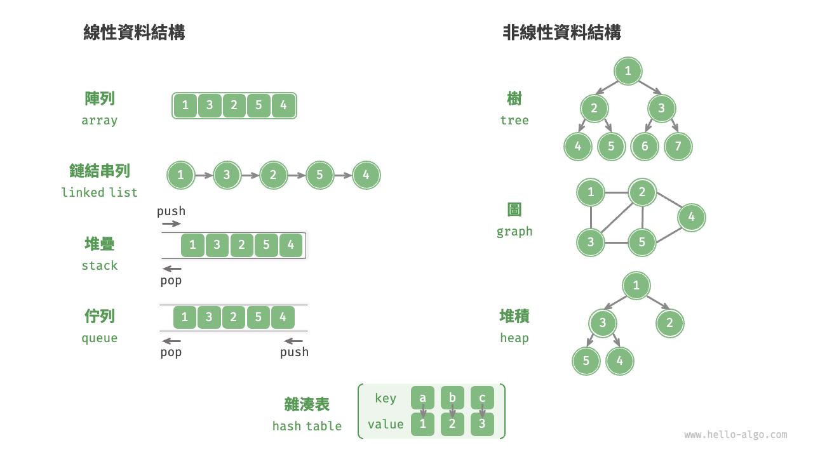
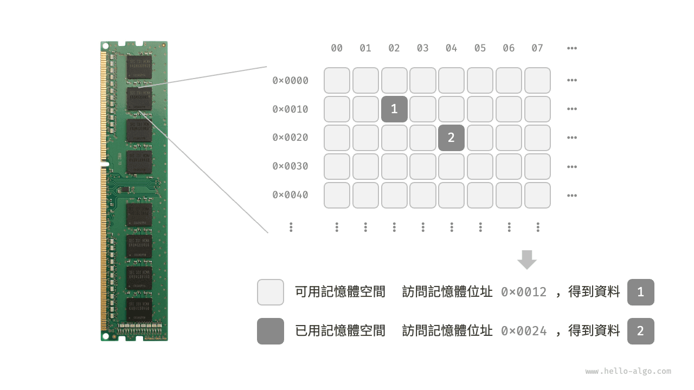
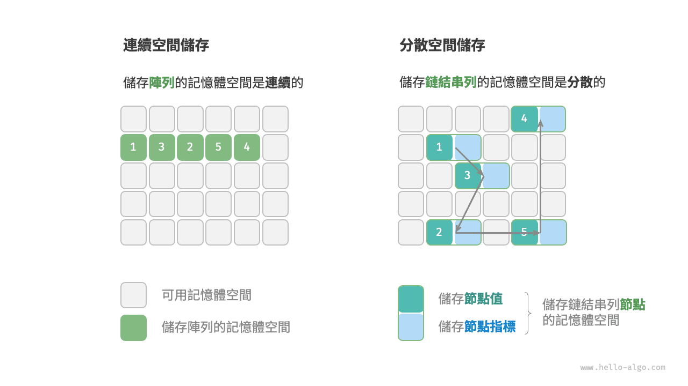

# 資料結構分類

常見的資料結構包括陣列、鏈結串列、堆疊、佇列、雜湊表、樹、堆積、圖，它們可以從“邏輯結構”和“物理結構”兩個維度進行分類。

## 邏輯結構：線性與非線性

**邏輯結構揭示了資料元素之間的邏輯關係**。在陣列和鏈結串列中，資料按照一定順序排列，體現了資料之間的線性關係；而在樹中，資料從頂部向下按層次排列，表現出“祖先”與“後代”之間的派生關係；圖則由節點和邊構成，反映了複雜的網路關係。

如下圖所示，邏輯結構可分為“線性”和“非線性”兩大類。線性結構比較直觀，指資料在邏輯關係上呈線性排列；非線性結構則相反，呈非線性排列。

- **線性資料結構**：陣列、鏈結串列、堆疊、佇列、雜湊表，元素之間是一對一的順序關係。
- **非線性資料結構**：樹、堆積、圖、雜湊表。

非線性資料結構可以進一步劃分為樹形結構和網狀結構。

- **樹形結構**：樹、堆積、雜湊表，元素之間是一對多的關係。
- **網狀結構**：圖，元素之間是多對多的關係。

## 物理結構：連續與分散

**當演算法程式執行時，正在處理的資料主要儲存在記憶體中**。下圖展示了一個計算機記憶體條，其中每個黑色方塊都包含一塊記憶體空間。我們可以將記憶體想象成一個巨大的 Excel 表格，其中每個單元格都可以儲存一定大小的資料。

**系統透過記憶體位址來訪問目標位置的資料**。如下圖所示，計算機根據特定規則為表格中的每個單元格分配編號，確保每個記憶體空間都有唯一的記憶體位址。有了這些位址，程式便可以訪問記憶體中的資料。

!!! tip

    值得說明的是，將記憶體比作 Excel 表格是一個簡化的類比，實際記憶體的工作機制比較複雜，涉及位址空間、記憶體管理、快取機制、虛擬記憶體和物理記憶體等概念。

記憶體是所有程式的共享資源，當某塊記憶體被某個程式佔用時，則通常無法被其他程式同時使用了。**因此在資料結構與演算法的設計中，記憶體資源是一個重要的考慮因素**。比如，演算法所佔用的記憶體峰值不應超過系統剩餘空閒記憶體；如果缺少連續大塊的記憶體空間，那麼所選用的資料結構必須能夠儲存在分散的記憶體空間內。

如下圖所示，**物理結構反映了資料在計算機記憶體中的儲存方式**，可分為連續空間儲存（陣列）和分散空間儲存（鏈結串列）。物理結構從底層決定了資料的訪問、更新、增刪等操作方法，兩種物理結構在時間效率和空間效率方面呈現出互補的特點。

值得說明的是，**所有資料結構都是基於陣列、鏈結串列或二者的組合實現的**。例如，堆疊和佇列既可以使用陣列實現，也可以使用鏈結串列實現；而雜湊表的實現可能同時包含陣列和鏈結串列。

- **基於陣列可實現**：堆疊、佇列、雜湊表、樹、堆積、圖、矩陣、張量（維度 $\geq 3$ 的陣列）等。
- **基於鏈結串列可實現**：堆疊、佇列、雜湊表、樹、堆積、圖等。

鏈結串列在初始化後，仍可以在程式執行過程中對其長度進行調整，因此也稱“動態資料結構”。陣列在初始化後長度不可變，因此也稱“靜態資料結構”。值得注意的是，陣列可透過重新分配記憶體實現長度變化，從而具備一定的“動態性”。

!!! tip

    如果你感覺物理結構理解起來有困難，建議先閱讀下一章，然後再回顧本節內容。
