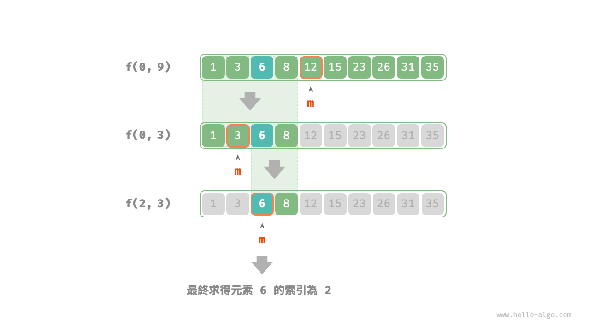

# 分治搜尋策略

我們已經學過，搜尋演算法分為兩大類。

- **暴力搜尋**：它透過走訪資料結構實現，時間複雜度為 $O(n)$ 。
- **自適應搜尋**：它利用特有的資料組織形式或先驗資訊，時間複雜度可達到 $O(\log n)$ 甚至 $O(1)$ 。

實際上，**時間複雜度為 $O(\log n)$ 的搜尋演算法通常是基於分治策略實現的**，例如二分搜尋和樹。

- 二分搜尋的每一步都將問題（在陣列中搜索目標元素）分解為一個小問題（在陣列的一半中搜索目標元素），這個過程一直持續到陣列為空或找到目標元素為止。
- 樹是分治思想的代表，在二元搜尋樹、AVL 樹、堆積等資料結構中，各種操作的時間複雜度皆為 $O(\log n)$ 。

二分搜尋的分治策略如下所示。

- **問題可以分解**：二分搜尋遞迴地將原問題（在陣列中進行查詢）分解為子問題（在陣列的一半中進行查詢），這是透過比較中間元素和目標元素來實現的。
- **子問題是獨立的**：在二分搜尋中，每輪只處理一個子問題，它不受其他子問題的影響。
- **子問題的解無須合併**：二分搜尋旨在查詢一個特定元素，因此不需要將子問題的解進行合併。當子問題得到解決時，原問題也會同時得到解決。

分治能夠提升搜尋效率，本質上是因為暴力搜尋每輪只能排除一個選項，**而分治搜尋每輪可以排除一半選項**。

### 基於分治實現二分搜尋

在之前的章節中，二分搜尋是基於遞推（迭代）實現的。現在我們基於分治（遞迴）來實現它。

!!! question

    給定一個長度為 $n$ 的有序陣列 `nums` ，其中所有元素都是唯一的，請查詢元素 `target` 。

從分治角度，我們將搜尋區間 $[i, j]$ 對應的子問題記為 $f(i, j)$ 。

以原問題 $f(0, n-1)$ 為起始點，透過以下步驟進行二分搜尋。

1. 計算搜尋區間 $[i, j]$ 的中點 $m$ ，根據它排除一半搜尋區間。
2. 遞迴求解規模減小一半的子問題，可能為 $f(i, m-1)$ 或 $f(m+1, j)$ 。
3. 迴圈第 `1.` 步和第 `2.` 步，直至找到 `target` 或區間為空時返回。

下圖展示了在陣列中二分搜尋元素 $6$ 的分治過程。



在實現程式碼中，我們宣告一個遞迴函式 `dfs()` 來求解問題 $f(i, j)$ ：

```src
[file]{binary_search_recur}-[class]{}-[func]{binary_search}
```
