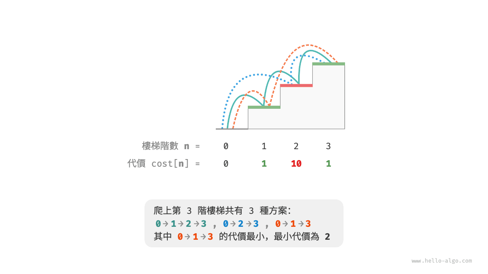
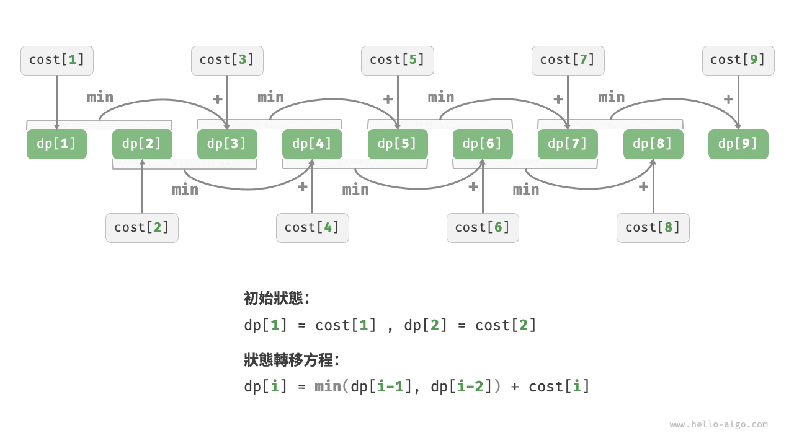
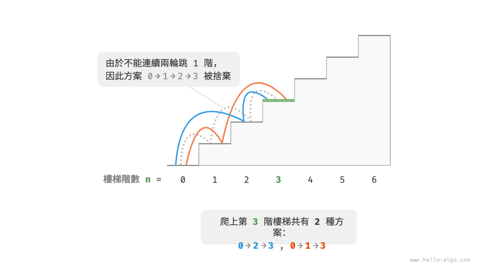
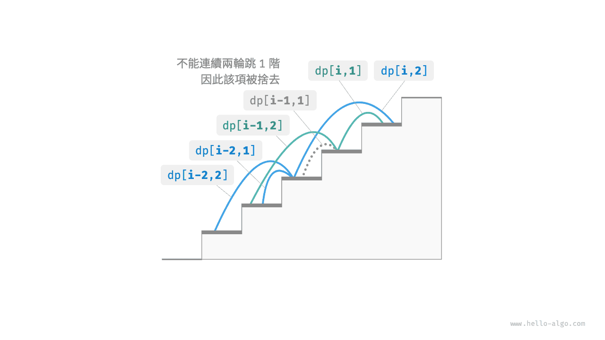

# 動態規劃問題特性

在上一節中，我們學習了動態規劃是如何透過子問題分解來求解原問題的。實際上，子問題分解是一種通用的演算法思路，在分治、動態規劃、回溯中的側重點不同。

- 分治演算法遞迴地將原問題劃分為多個相互獨立的子問題，直至最小子問題，並在回溯中合併子問題的解，最終得到原問題的解。
- 動態規劃也對問題進行遞迴分解，但與分治演算法的主要區別是，動態規劃中的子問題是相互依賴的，在分解過程中會出現許多重疊子問題。
- 回溯演算法在嘗試和回退中窮舉所有可能的解，並透過剪枝避免不必要的搜尋分支。原問題的解由一系列決策步驟構成，我們可以將每個決策步驟之前的子序列看作一個子問題。

實際上，動態規劃常用來求解最最佳化問題，它們不僅包含重疊子問題，還具有另外兩大特性：最優子結構、無後效性。

## 最優子結構

我們對爬樓梯問題稍作改動，使之更加適合展示最優子結構概念。

!!! question "爬樓梯最小代價"

    給定一個樓梯，你每步可以上 $1$ 階或者 $2$ 階，每一階樓梯上都貼有一個非負整數，表示你在該臺階所需要付出的代價。給定一個非負整數陣列 $cost$ ，其中 $cost[i]$ 表示在第 $i$ 個臺階需要付出的代價，$cost[0]$ 為地面（起始點）。請計算最少需要付出多少代價才能到達頂部？

如下圖所示，若第 $1$、$2$、$3$ 階的代價分別為 $1$、$10$、$1$ ，則從地面爬到第 $3$ 階的最小代價為 $2$ 。



設 $dp[i]$ 為爬到第 $i$ 階累計付出的代價，由於第 $i$ 階只可能從 $i - 1$ 階或 $i - 2$ 階走來，因此 $dp[i]$ 只可能等於 $dp[i - 1] + cost[i]$ 或 $dp[i - 2] + cost[i]$ 。為了儘可能減少代價，我們應該選擇兩者中較小的那一個：

$$
dp[i] = \min(dp[i-1], dp[i-2]) + cost[i]
$$

這便可以引出最優子結構的含義：**原問題的最優解是從子問題的最優解構建得來的**。

本題顯然具有最優子結構：我們從兩個子問題最優解 $dp[i-1]$ 和 $dp[i-2]$ 中挑選出較優的那一個，並用它構建出原問題 $dp[i]$ 的最優解。

那麼，上一節的爬樓梯題目有沒有最優子結構呢？它的目標是求解方案數量，看似是一個計數問題，但如果換一種問法：“求解最大方案數量”。我們意外地發現，**雖然題目修改前後是等價的，但最優子結構浮現出來了**：第 $n$ 階最大方案數量等於第 $n-1$ 階和第 $n-2$ 階最大方案數量之和。所以說，最優子結構的解釋方式比較靈活，在不同問題中會有不同的含義。

根據狀態轉移方程，以及初始狀態 $dp[1] = cost[1]$ 和 $dp[2] = cost[2]$ ，我們就可以得到動態規劃程式碼：

```src
[file]{min_cost_climbing_stairs_dp}-[class]{}-[func]{min_cost_climbing_stairs_dp}
```

下圖展示了以上程式碼的動態規劃過程。



本題也可以進行空間最佳化，將一維壓縮至零維，使得空間複雜度從 $O(n)$ 降至 $O(1)$ ：

```src
[file]{min_cost_climbing_stairs_dp}-[class]{}-[func]{min_cost_climbing_stairs_dp_comp}
```

## 無後效性

無後效性是動態規劃能夠有效解決問題的重要特性之一，其定義為：**給定一個確定的狀態，它的未來發展只與當前狀態有關，而與過去經歷的所有狀態無關**。

以爬樓梯問題為例，給定狀態 $i$ ，它會發展出狀態 $i+1$ 和狀態 $i+2$ ，分別對應跳 $1$ 步和跳 $2$ 步。在做出這兩種選擇時，我們無須考慮狀態 $i$ 之前的狀態，它們對狀態 $i$ 的未來沒有影響。

然而，如果我們給爬樓梯問題新增一個約束，情況就不一樣了。

!!! question "帶約束爬樓梯"

    給定一個共有 $n$ 階的樓梯，你每步可以上 $1$ 階或者 $2$ 階，**但不能連續兩輪跳 $1$ 階**，請問有多少種方案可以爬到樓頂？

如下圖所示，爬上第 $3$ 階僅剩 $2$ 種可行方案，其中連續三次跳 $1$ 階的方案不滿足約束條件，因此被捨棄。



在該問題中，如果上一輪是跳 $1$ 階上來的，那麼下一輪就必須跳 $2$ 階。這意味著，**下一步選擇不能由當前狀態（當前所在樓梯階數）獨立決定，還和前一個狀態（上一輪所在樓梯階數）有關**。

不難發現，此問題已不滿足無後效性，狀態轉移方程 $dp[i] = dp[i-1] + dp[i-2]$ 也失效了，因為 $dp[i-1]$ 代表本輪跳 $1$ 階，但其中包含了許多“上一輪是跳 $1$ 階上來的”方案，而為了滿足約束，我們就不能將 $dp[i-1]$ 直接計入 $dp[i]$ 中。

為此，我們需要擴展狀態定義：**狀態 $[i, j]$ 表示處在第 $i$ 階並且上一輪跳了 $j$ 階**，其中 $j \in \{1, 2\}$ 。此狀態定義有效地區分了上一輪跳了 $1$ 階還是 $2$ 階，我們可以據此判斷當前狀態是從何而來的。

- 當上一輪跳了 $1$ 階時，上上一輪只能選擇跳 $2$ 階，即 $dp[i, 1]$ 只能從 $dp[i-1, 2]$ 轉移過來。
- 當上一輪跳了 $2$ 階時，上上一輪可選擇跳 $1$ 階或跳 $2$ 階，即 $dp[i, 2]$ 可以從 $dp[i-2, 1]$ 或 $dp[i-2, 2]$ 轉移過來。

如下圖所示，在該定義下，$dp[i, j]$ 表示狀態 $[i, j]$ 對應的方案數。此時狀態轉移方程為：

$$
\begin{cases}
dp[i, 1] = dp[i-1, 2] \\
dp[i, 2] = dp[i-2, 1] + dp[i-2, 2]
\end{cases}
$$



最終，返回 $dp[n, 1] + dp[n, 2]$ 即可，兩者之和代表爬到第 $n$ 階的方案總數：

```src
[file]{climbing_stairs_constraint_dp}-[class]{}-[func]{climbing_stairs_constraint_dp}
```

在上面的案例中，由於僅需多考慮前面一個狀態，因此我們仍然可以透過擴展狀態定義，使得問題重新滿足無後效性。然而，某些問題具有非常嚴重的“有後效性”。

!!! question "爬樓梯與障礙生成"

    給定一個共有 $n$ 階的樓梯，你每步可以上 $1$ 階或者 $2$ 階。**規定當爬到第 $i$ 階時，系統自動會在第 $2i$ 階上放上障礙物，之後所有輪都不允許跳到第 $2i$ 階上**。例如，前兩輪分別跳到了第 $2$、$3$ 階上，則之後就不能跳到第 $4$、$6$ 階上。請問有多少種方案可以爬到樓頂？

在這個問題中，下次跳躍依賴過去所有的狀態，因為每一次跳躍都會在更高的階梯上設定障礙，並影響未來的跳躍。對於這類問題，動態規劃往往難以解決。

實際上，許多複雜的組合最佳化問題（例如旅行商問題）不滿足無後效性。對於這類問題，我們通常會選擇使用其他方法，例如啟發式搜尋、遺傳演算法、強化學習等，從而在有限時間內得到可用的區域性最優解。
