# 動態規劃解題思路

上兩節介紹了動態規劃問題的主要特徵，接下來我們一起探究兩個更加實用的問題。

1. 如何判斷一個問題是不是動態規劃問題？
2. 求解動態規劃問題該從何處入手，完整步驟是什麼？

## 問題判斷

總的來說，如果一個問題包含重疊子問題、最優子結構，並滿足無後效性，那麼它通常適合用動態規劃求解。然而，我們很難從問題描述中直接提取出這些特性。因此我們通常會放寬條件，**先觀察問題是否適合使用回溯（窮舉）解決**。

**適合用回溯解決的問題通常滿足“決策樹模型”**，這種問題可以使用樹形結構來描述，其中每一個節點代表一個決策，每一條路徑代表一個決策序列。

換句話說，如果問題包含明確的決策概念，並且解是透過一系列決策產生的，那麼它就滿足決策樹模型，通常可以使用回溯來解決。

在此基礎上，動態規劃問題還有一些判斷的“加分項”。

- 問題包含最大（小）或最多（少）等最最佳化描述。
- 問題的狀態能夠使用一個串列、多維矩陣或樹來表示，並且一個狀態與其周圍的狀態存在遞推關係。

相應地，也存在一些“減分項”。

- 問題的目標是找出所有可能的解決方案，而不是找出最優解。
- 問題描述中有明顯的排列組合的特徵，需要返回具體的多個方案。

如果一個問題滿足決策樹模型，並具有較為明顯的“加分項”，我們就可以假設它是一個動態規劃問題，並在求解過程中驗證它。

## 問題求解步驟

動態規劃的解題流程會因問題的性質和難度而有所不同，但通常遵循以下步驟：描述決策，定義狀態，建立 $dp$ 表，推導狀態轉移方程，確定邊界條件等。

為了更形象地展示解題步驟，我們使用一個經典問題“最小路徑和”來舉例。

!!! question

    給定一個 $n \times m$ 的二維網格 `grid` ，網格中的每個單元格包含一個非負整數，表示該單元格的代價。機器人以左上角單元格為起始點，每次只能向下或者向右移動一步，直至到達右下角單元格。請返回從左上角到右下角的最小路徑和。

下圖展示了一個例子，給定網格的最小路徑和為 $13$ 。

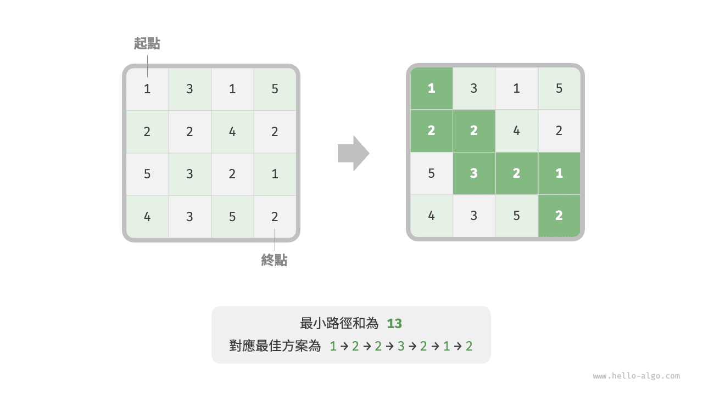

**第一步：思考每輪的決策，定義狀態，從而得到 $dp$ 表**

本題的每一輪的決策就是從當前格子向下或向右走一步。設當前格子的行列索引為 $[i, j]$ ，則向下或向右走一步後，索引變為 $[i+1, j]$ 或 $[i, j+1]$ 。因此，狀態應包含行索引和列索引兩個變數，記為 $[i, j]$ 。

狀態 $[i, j]$ 對應的子問題為：從起始點 $[0, 0]$ 走到 $[i, j]$ 的最小路徑和，解記為 $dp[i, j]$ 。

至此，我們就得到了下圖所示的二維 $dp$ 矩陣，其尺寸與輸入網格 $grid$ 相同。

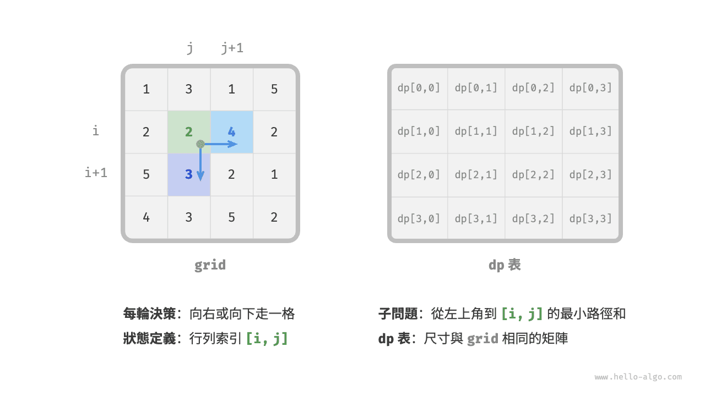

!!! note

    動態規劃和回溯過程可以描述為一個決策序列，而狀態由所有決策變數構成。它應當包含描述解題進度的所有變數，其包含了足夠的資訊，能夠用來推導出下一個狀態。
    
    每個狀態都對應一個子問題，我們會定義一個 $dp$ 表來儲存所有子問題的解，狀態的每個獨立變數都是 $dp$ 表的一個維度。從本質上看，$dp$ 表是狀態和子問題的解之間的對映。

**第二步：找出最優子結構，進而推導出狀態轉移方程**

對於狀態 $[i, j]$ ，它只能從上邊格子 $[i-1, j]$ 和左邊格子 $[i, j-1]$ 轉移而來。因此最優子結構為：到達 $[i, j]$ 的最小路徑和由 $[i, j-1]$ 的最小路徑和與 $[i-1, j]$ 的最小路徑和中較小的那一個決定。

根據以上分析，可推出下圖所示的狀態轉移方程：

$$
dp[i, j] = \min(dp[i-1, j], dp[i, j-1]) + grid[i, j]
$$

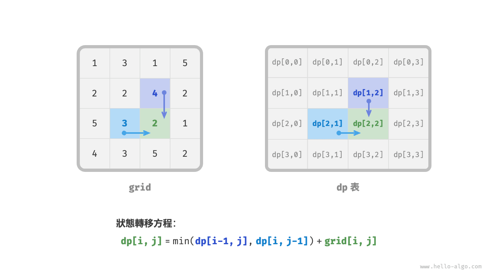

!!! note

    根據定義好的 $dp$ 表，思考原問題和子問題的關係，找出透過子問題的最優解來構造原問題的最優解的方法，即最優子結構。

    一旦我們找到了最優子結構，就可以使用它來構建出狀態轉移方程。

**第三步：確定邊界條件和狀態轉移順序**

在本題中，處在首行的狀態只能從其左邊的狀態得來，處在首列的狀態只能從其上邊的狀態得來，因此首行 $i = 0$ 和首列 $j = 0$ 是邊界條件。

如下圖所示，由於每個格子是由其左方格子和上方格子轉移而來，因此我們使用迴圈來走訪矩陣，外迴圈走訪各行，內迴圈走訪各列。

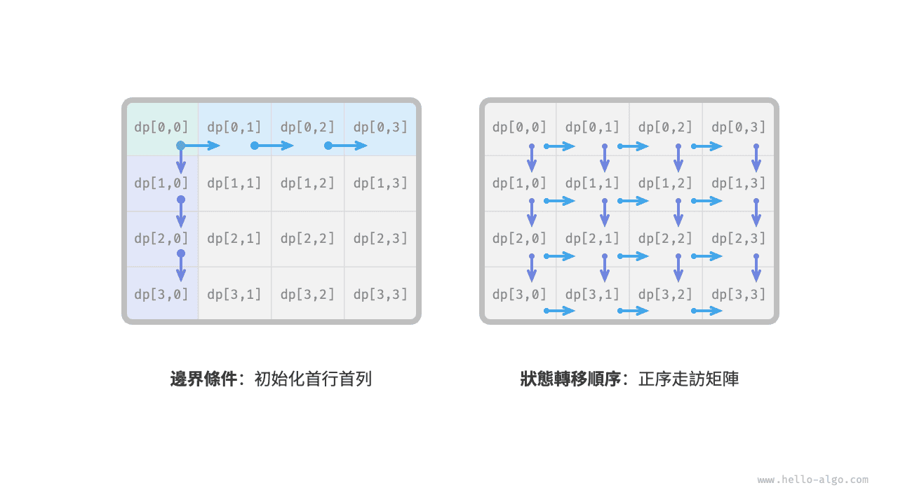

!!! note

    邊界條件在動態規劃中用於初始化 $dp$ 表，在搜尋中用於剪枝。
    
    狀態轉移順序的核心是要保證在計算當前問題的解時，所有它依賴的更小子問題的解都已經被正確地計算出來。

根據以上分析，我們已經可以直接寫出動態規劃程式碼。然而子問題分解是一種從頂至底的思想，因此按照“暴力搜尋 $\rightarrow$ 記憶化搜尋 $\rightarrow$ 動態規劃”的順序實現更加符合思維習慣。

### 方法一：暴力搜尋

從狀態 $[i, j]$ 開始搜尋，不斷分解為更小的狀態 $[i-1, j]$ 和 $[i, j-1]$ ，遞迴函式包括以下要素。

- **遞迴參數**：狀態 $[i, j]$ 。
- **返回值**：從 $[0, 0]$ 到 $[i, j]$ 的最小路徑和 $dp[i, j]$ 。
- **終止條件**：當 $i = 0$ 且 $j = 0$ 時，返回代價 $grid[0, 0]$ 。
- **剪枝**：當 $i < 0$ 時或 $j < 0$ 時索引越界，此時返回代價 $+\infty$ ，代表不可行。

實現程式碼如下：

```src
[file]{min_path_sum}-[class]{}-[func]{min_path_sum_dfs}
```

下圖給出了以 $dp[2, 1]$ 為根節點的遞迴樹，其中包含一些重疊子問題，其數量會隨著網格 `grid` 的尺寸變大而急劇增多。

從本質上看，造成重疊子問題的原因為：**存在多條路徑可以從左上角到達某一單元格**。

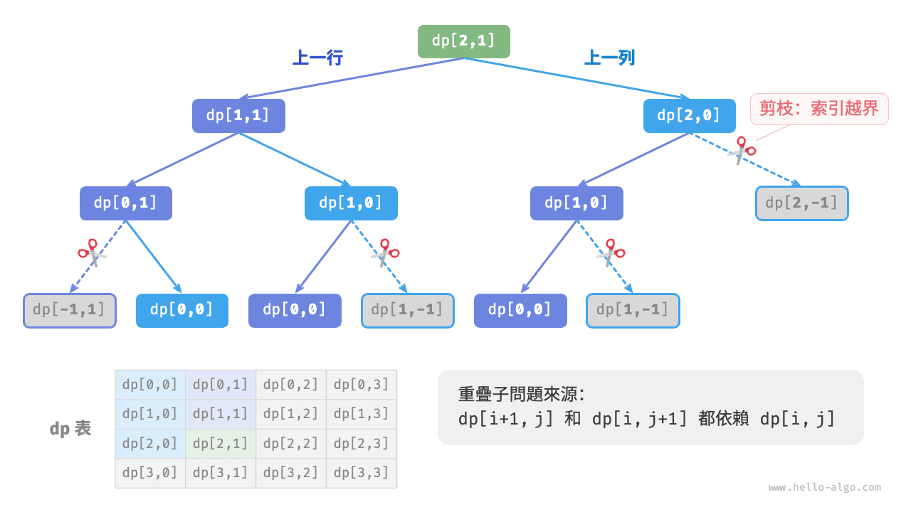

每個狀態都有向下和向右兩種選擇，從左上角走到右下角總共需要 $m + n - 2$ 步，所以最差時間複雜度為 $O(2^{m + n})$ 。請注意，這種計算方式未考慮臨近網格邊界的情況，當到達網路邊界時只剩下一種選擇，因此實際的路徑數量會少一些。

### 方法二：記憶化搜尋

我們引入一個和網格 `grid` 相同尺寸的記憶串列 `mem` ，用於記錄各個子問題的解，並將重疊子問題進行剪枝：

```src
[file]{min_path_sum}-[class]{}-[func]{min_path_sum_dfs_mem}
```

如下圖所示，在引入記憶化後，所有子問題的解只需計算一次，因此時間複雜度取決於狀態總數，即網格尺寸 $O(nm)$ 。

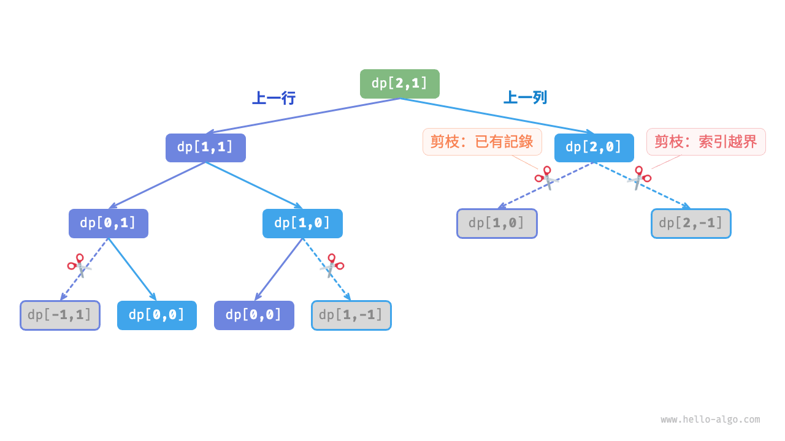

### 方法三：動態規劃

基於迭代實現動態規劃解法，程式碼如下所示：

```src
[file]{min_path_sum}-[class]{}-[func]{min_path_sum_dp}
```

下圖展示了最小路徑和的狀態轉移過程，其走訪了整個網格，**因此時間複雜度為 $O(nm)$** 。

陣列 `dp` 大小為 $n \times m$ ，**因此空間複雜度為 $O(nm)$** 。

=== "<1>"
    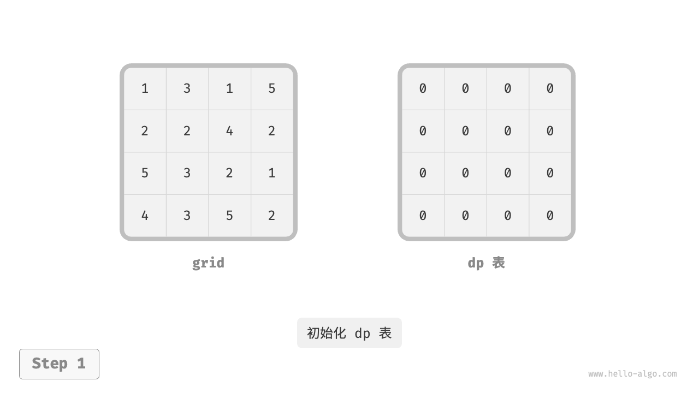

=== "<2>"
    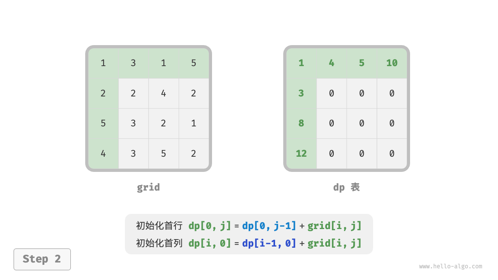

=== "<3>"
    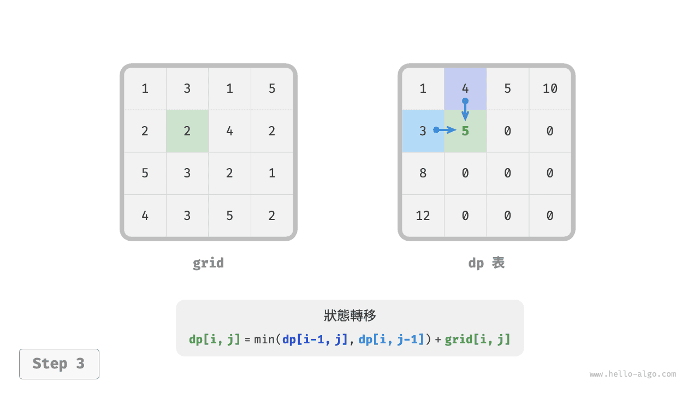

=== "<4>"
    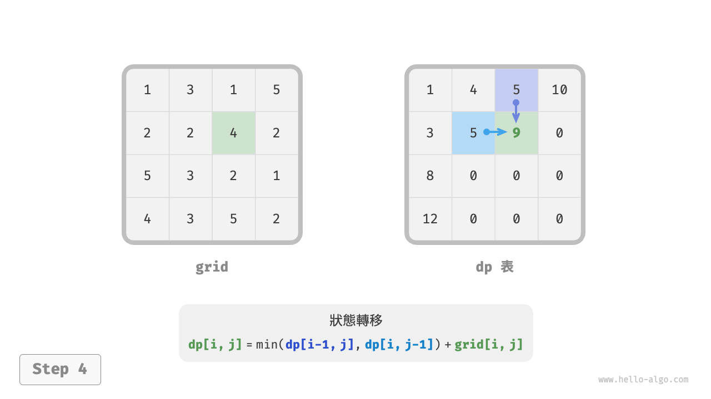

=== "<5>"
    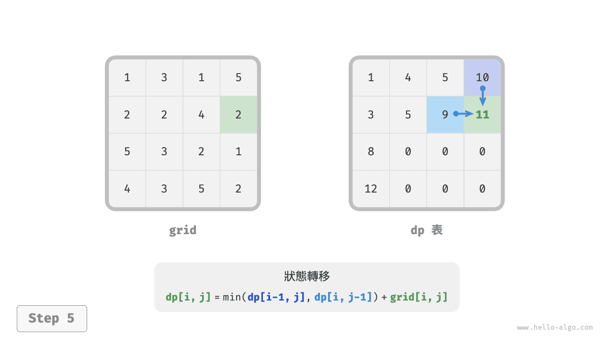

=== "<6>"
    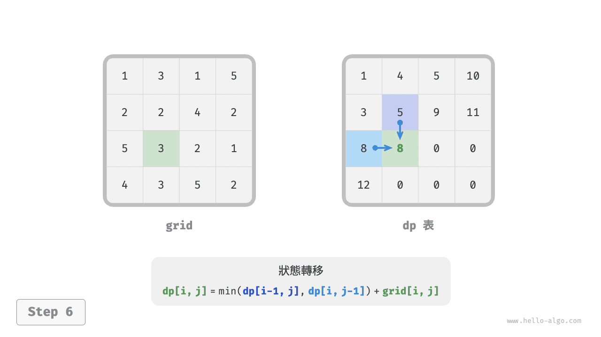

=== "<7>"
    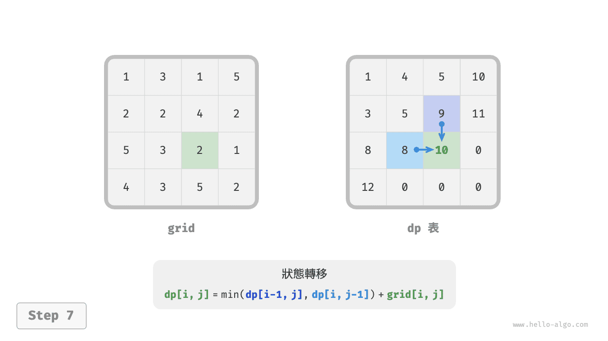

=== "<8>"
    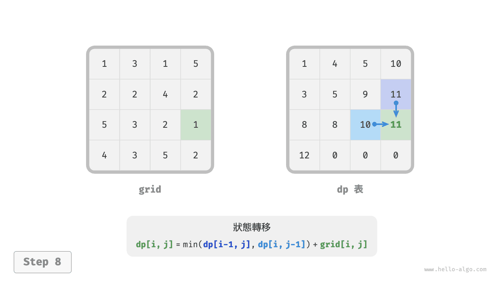

=== "<9>"
    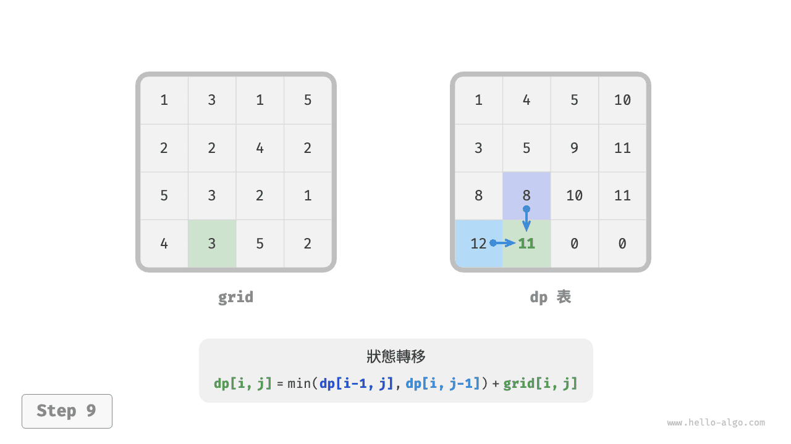

=== "<10>"
    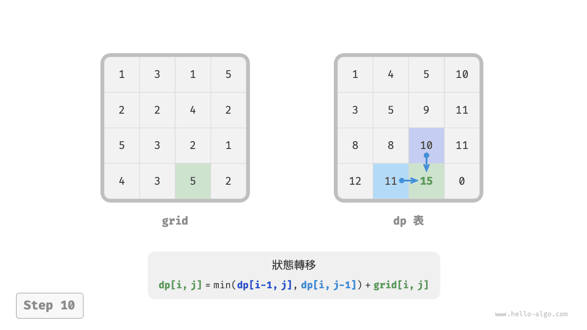

=== "<11>"
    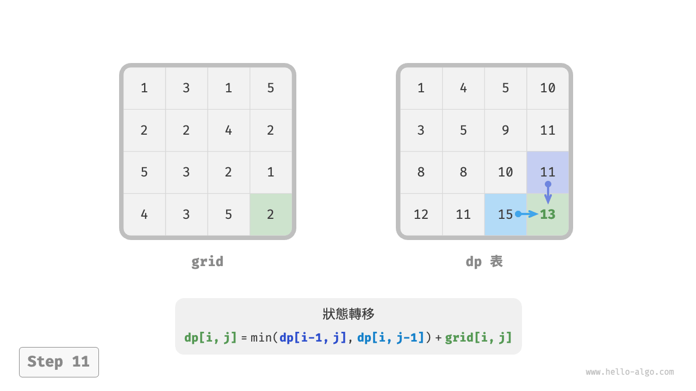

=== "<12>"
    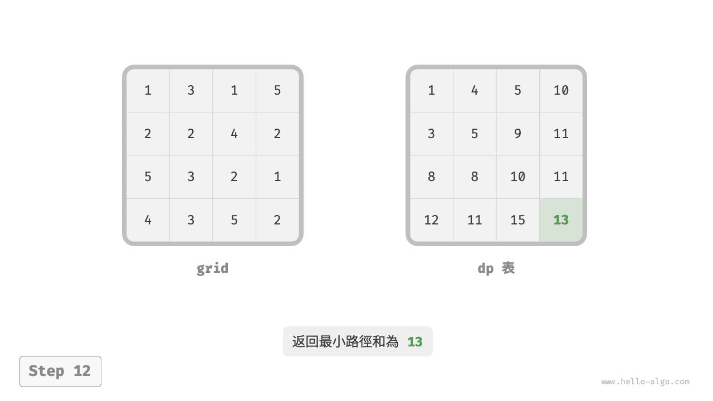

### 空間最佳化

由於每個格子只與其左邊和上邊的格子有關，因此我們可以只用一個單行陣列來實現 $dp$ 表。

請注意，因為陣列 `dp` 只能表示一行的狀態，所以我們無法提前初始化首列狀態，而是在走訪每行時更新它：

```src
[file]{min_path_sum}-[class]{}-[func]{min_path_sum_dp_comp}
```
