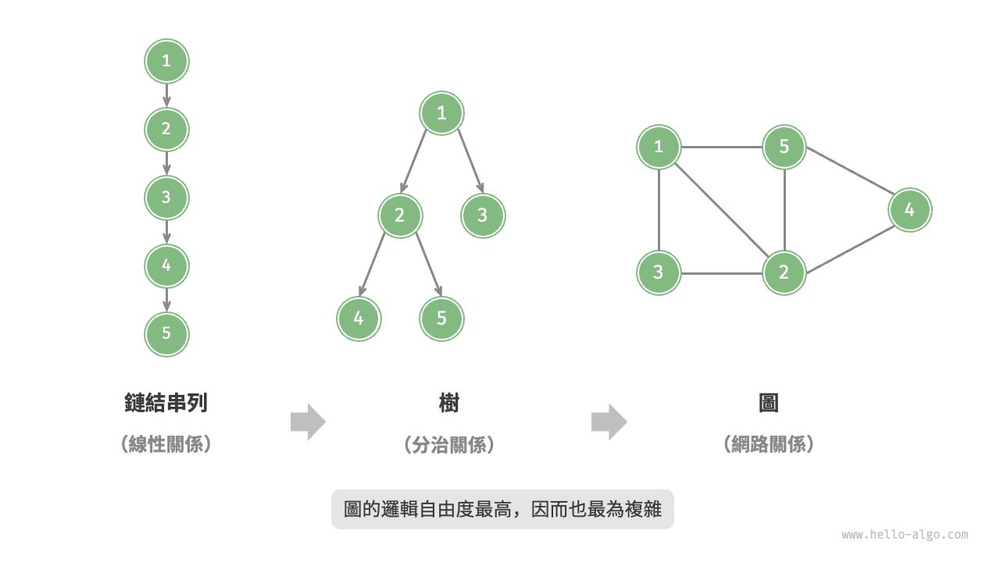
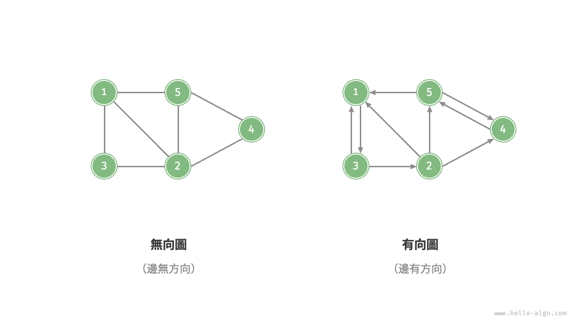
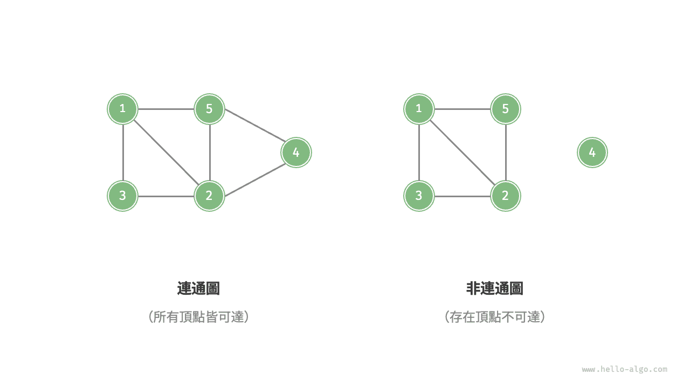
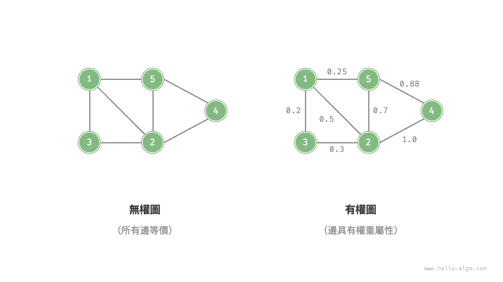
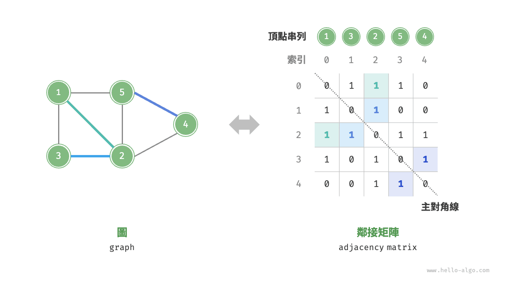
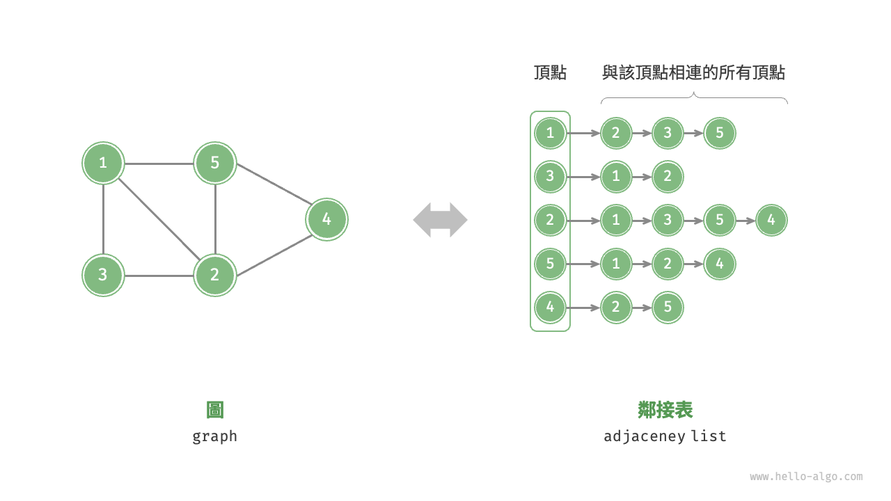

# 圖

<u>圖（graph）</u>是一種非線性資料結構，由<u>頂點（vertex）</u>和<u>邊（edge）</u>組成。我們可以將圖 $G$ 抽象地表示為一組頂點 $V$ 和一組邊 $E$ 的集合。以下示例展示了一個包含 5 個頂點和 7 條邊的圖。

$$
\begin{aligned}
V & = \{ 1, 2, 3, 4, 5 \} \newline
E & = \{ (1,2), (1,3), (1,5), (2,3), (2,4), (2,5), (4,5) \} \newline
G & = \{ V, E \} \newline
\end{aligned}
$$

如果將頂點看作節點，將邊看作連線各個節點的引用（指標），我們就可以將圖看作一種從鏈結串列拓展而來的資料結構。如下圖所示，**相較於線性關係（鏈結串列）和分治關係（樹），網路關係（圖）的自由度更高**，因而更為複雜。

## 圖的常見型別與術語

根據邊是否具有方向，可分為<u>無向圖（undirected graph）</u>和<u>有向圖（directed graph）</u>，如下圖所示。

- 在無向圖中，邊表示兩頂點之間的“雙向”連線關係，例如微信或 QQ 中的“好友關係”。
- 在有向圖中，邊具有方向性，即 $A \rightarrow B$ 和 $A \leftarrow B$ 兩個方向的邊是相互獨立的，例如微博或抖音上的“關注”與“被關注”關係。

根據所有頂點是否連通，可分為<u>連通圖（connected graph）</u>和<u>非連通圖（disconnected graph）</u>，如下圖所示。

- 對於連通圖，從某個頂點出發，可以到達其餘任意頂點。
- 對於非連通圖，從某個頂點出發，至少有一個頂點無法到達。

我們還可以為邊新增“權重”變數，從而得到如下圖所示的<u>有權圖（weighted graph）</u>。例如在《王者榮耀》等手遊中，系統會根據共同遊戲時間來計算玩家之間的“親密度”，這種親密度網路就可以用有權圖來表示。

圖資料結構包含以下常用術語。

- <u>鄰接（adjacency）</u>：當兩頂點之間存在邊相連時，稱這兩頂點“鄰接”。在上圖中，頂點 1 的鄰接頂點為頂點 2、3、5。
- <u>路徑（path）</u>：從頂點 A 到頂點 B 經過的邊構成的序列被稱為從 A 到 B 的“路徑”。在上圖中，邊序列 1-5-2-4 是頂點 1 到頂點 4 的一條路徑。
- <u>度（degree）</u>：一個頂點擁有的邊數。對於有向圖，<u>入度（in-degree）</u>表示有多少條邊指向該頂點，<u>出度（out-degree）</u>表示有多少條邊從該頂點指出。

## 圖的表示

圖的常用表示方式包括“鄰接矩陣”和“鄰接表”。以下使用無向圖進行舉例。

### 鄰接矩陣

設圖的頂點數量為 $n$ ，<u>鄰接矩陣（adjacency matrix）</u>使用一個 $n \times n$ 大小的矩陣來表示圖，每一行（列）代表一個頂點，矩陣元素代表邊，用 $1$ 或 $0$ 表示兩個頂點之間是否存在邊。

如下圖所示，設鄰接矩陣為 $M$、頂點串列為 $V$ ，那麼矩陣元素 $M[i, j] = 1$ 表示頂點 $V[i]$ 到頂點 $V[j]$ 之間存在邊，反之 $M[i, j] = 0$ 表示兩頂點之間無邊。

鄰接矩陣具有以下特性。

- 頂點不能與自身相連，因此鄰接矩陣主對角線元素沒有意義。
- 對於無向圖，兩個方向的邊等價，此時鄰接矩陣關於主對角線對稱。
- 將鄰接矩陣的元素從 $1$ 和 $0$ 替換為權重，則可表示有權圖。

使用鄰接矩陣表示圖時，我們可以直接訪問矩陣元素以獲取邊，因此增刪查改操作的效率很高，時間複雜度均為 $O(1)$ 。然而，矩陣的空間複雜度為 $O(n^2)$ ，記憶體佔用較多。

### 鄰接表

<u>鄰接表（adjacency list）</u>使用 $n$ 個鏈結串列來表示圖，鏈結串列節點表示頂點。第 $i$ 個鏈結串列對應頂點 $i$ ，其中儲存了該頂點的所有鄰接頂點（與該頂點相連的頂點）。下圖展示了一個使用鄰接表儲存的圖的示例。

鄰接表僅儲存實際存在的邊，而邊的總數通常遠小於 $n^2$ ，因此它更加節省空間。然而，在鄰接表中需要透過走訪鏈結串列來查詢邊，因此其時間效率不如鄰接矩陣。

觀察上圖，**鄰接表結構與雜湊表中的“鏈式位址”非常相似，因此我們也可以採用類似的方法來最佳化效率**。比如當鏈結串列較長時，可以將鏈結串列轉化為 AVL 樹或紅黑樹，從而將時間效率從 $O(n)$ 最佳化至 $O(\log n)$ ；還可以把鏈結串列轉換為雜湊表，從而將時間複雜度降至 $O(1)$ 。

## 圖的常見應用

如下表所示，許多現實系統可以用圖來建模，相應的問題也可以約化為圖計算問題。

 表 <id> &nbsp; 現實生活中常見的圖 

|          | 頂點 | 邊                   | 圖計算問題   |
| -------- | ---- | -------------------- | ------------ |
| 社交網路 | 使用者 | 好友關係             | 潛在好友推薦 |
| 地鐵線路 | 站點 | 站點間的連通性       | 最短路線推薦 |
| 太陽系   | 星體 | 星體間的萬有引力作用 | 行星軌道計算 |
