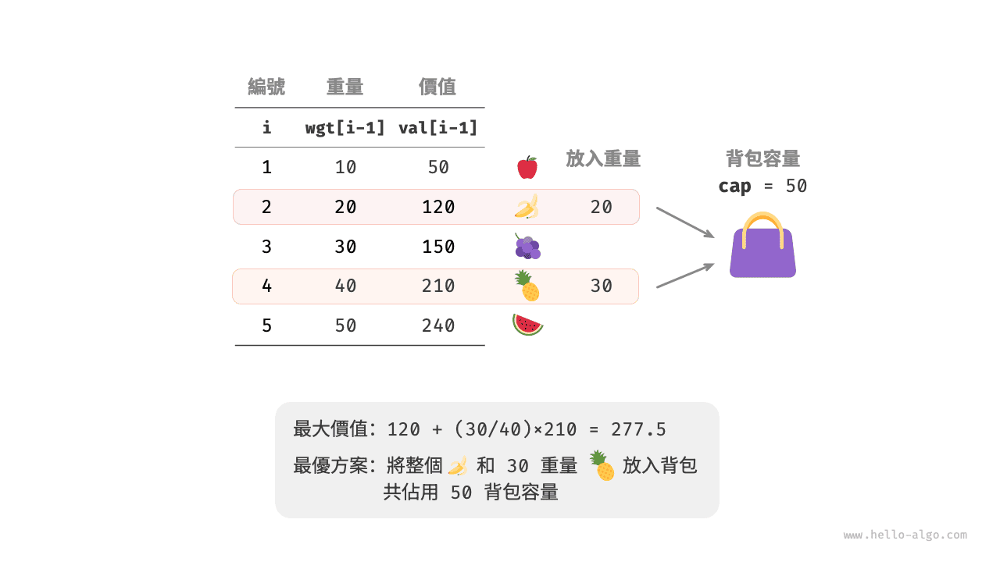
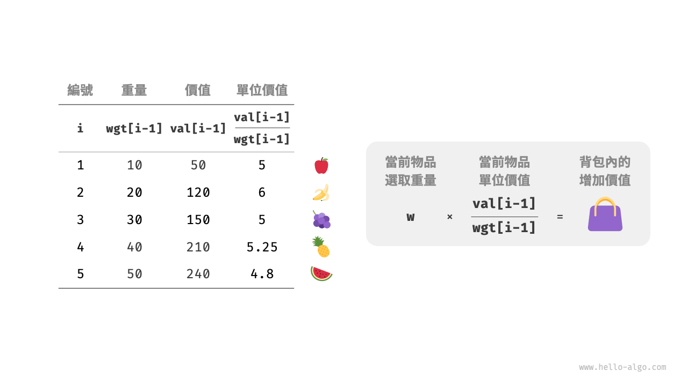
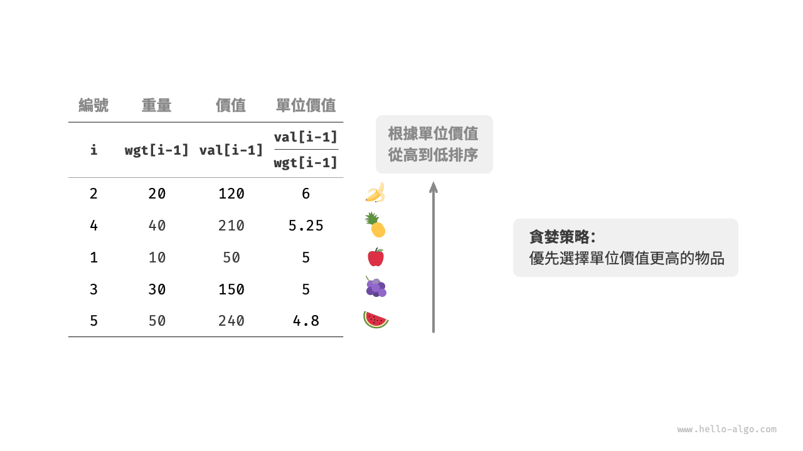
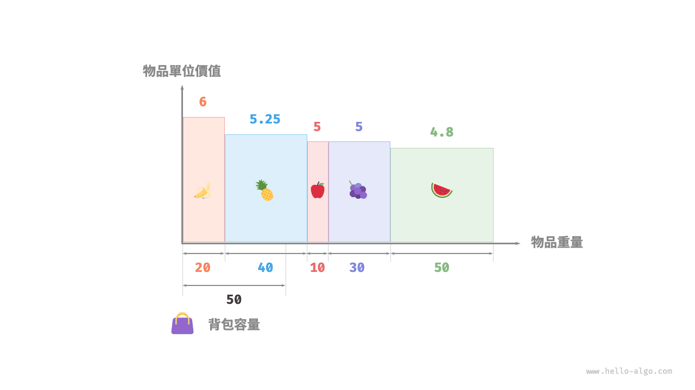

# 分數背包問題

!!! question

    給定 $n$ 個物品，第 $i$ 個物品的重量為 $wgt[i-1]$、價值為 $val[i-1]$ ，和一個容量為 $cap$ 的背包。每個物品只能選擇一次，**但可以選擇物品的一部分，價值根據選擇的重量比例計算**，問在限定背包容量下背包中物品的最大價值。示例如下圖所示。



分數背包問題和 0-1 背包問題整體上非常相似，狀態包含當前物品 $i$ 和容量 $c$ ，目標是求限定背包容量下的最大價值。

不同點在於，本題允許只選擇物品的一部分。如下圖所示，**我們可以對物品任意地進行切分，並按照重量比例來計算相應價值**。

1. 對於物品 $i$ ，它在單位重量下的價值為 $val[i-1] / wgt[i-1]$ ，簡稱單位價值。
2. 假設放入一部分物品 $i$ ，重量為 $w$ ，則背包增加的價值為 $w \times val[i-1] / wgt[i-1]$ 。



### 貪婪策略確定

最大化背包內物品總價值，**本質上是最大化單位重量下的物品價值**。由此便可推理出下圖所示的貪婪策略。

1. 將物品按照單位價值從高到低進行排序。
2. 走訪所有物品，**每輪貪婪地選擇單位價值最高的物品**。
3. 若剩餘背包容量不足，則使用當前物品的一部分填滿背包。



### 程式碼實現

我們建立了一個物品類別 `Item` ，以便將物品按照單位價值進行排序。迴圈進行貪婪選擇，當背包已滿時跳出並返回解：

```src
[file]{fractional_knapsack}-[class]{}-[func]{fractional_knapsack}
```

內建排序演算法的時間複雜度通常為 $O(\log n)$ ，空間複雜度通常為 $O(\log n)$ 或 $O(n)$ ，取決於程式語言的具體實現。

除排序之外，在最差情況下，需要走訪整個物品串列，**因此時間複雜度為 $O(n)$** ，其中 $n$ 為物品數量。

由於初始化了一個 `Item` 物件串列，**因此空間複雜度為 $O(n)$** 。

### 正確性證明

採用反證法。假設物品 $x$ 是單位價值最高的物品，使用某演算法求得最大價值為 `res` ，但該解中不包含物品 $x$ 。

現在從背包中拿出單位重量的任意物品，並替換為單位重量的物品 $x$ 。由於物品 $x$ 的單位價值最高，因此替換後的總價值一定大於 `res` 。**這與 `res` 是最優解矛盾，說明最優解中必須包含物品 $x$** 。

對於該解中的其他物品，我們也可以構建出上述矛盾。總而言之，**單位價值更大的物品總是更優選擇**，這說明貪婪策略是有效的。

如下圖所示，如果將物品重量和物品單位價值分別看作一張二維圖表的橫軸和縱軸，則分數背包問題可轉化為“求在有限橫軸區間下圍成的最大面積”。這個類比可以幫助我們從幾何角度理解貪婪策略的有效性。


