# 最大容量問題

!!! question

    輸入一個陣列 $ht$ ，其中的每個元素代表一個垂直隔板的高度。陣列中的任意兩個隔板，以及它們之間的空間可以組成一個容器。
    
    容器的容量等於高度和寬度的乘積（面積），其中高度由較短的隔板決定，寬度是兩個隔板的陣列索引之差。
    
    請在陣列中選擇兩個隔板，使得組成的容器的容量最大，返回最大容量。示例如下圖所示。

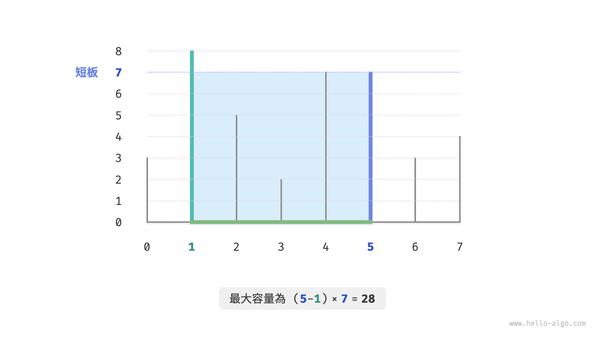

容器由任意兩個隔板圍成，**因此本題的狀態為兩個隔板的索引，記為 $[i, j]$** 。

根據題意，容量等於高度乘以寬度，其中高度由短板決定，寬度是兩隔板的陣列索引之差。設容量為 $cap[i, j]$ ，則可得計算公式：

$$
cap[i, j] = \min(ht[i], ht[j]) \times (j - i)
$$

設陣列長度為 $n$ ，兩個隔板的組合數量（狀態總數）為 $C_n^2 = \frac{n(n - 1)}{2}$ 個。最直接地，**我們可以窮舉所有狀態**，從而求得最大容量，時間複雜度為 $O(n^2)$ 。

### 貪婪策略確定

這道題還有更高效率的解法。如下圖所示，現選取一個狀態 $[i, j]$ ，其滿足索引 $i < j$ 且高度 $ht[i] < ht[j]$ ，即 $i$ 為短板、$j$ 為長板。

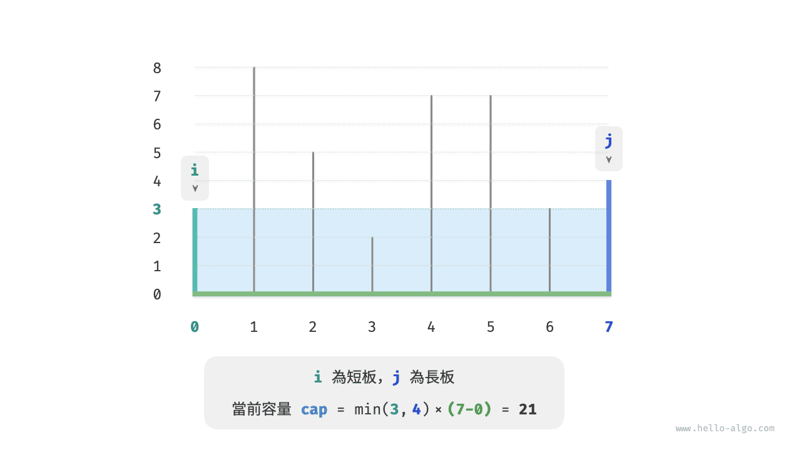

如下圖所示，**若此時將長板 $j$ 向短板 $i$ 靠近，則容量一定變小**。

這是因為在移動長板 $j$ 後，寬度 $j-i$ 肯定變小；而高度由短板決定，因此高度只可能不變（ $i$ 仍為短板）或變小（移動後的 $j$ 成為短板）。

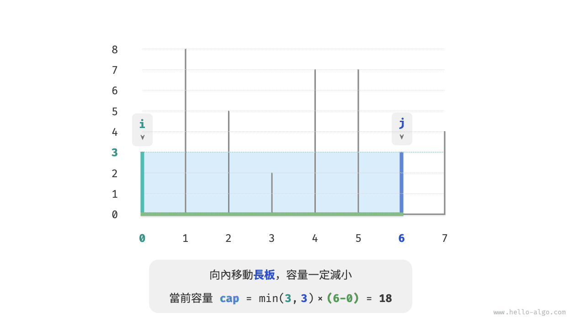

反向思考，**我們只有向內收縮短板 $i$ ，才有可能使容量變大**。因為雖然寬度一定變小，**但高度可能會變大**（移動後的短板 $i$ 可能會變長）。例如在下圖中，移動短板後面積變大。

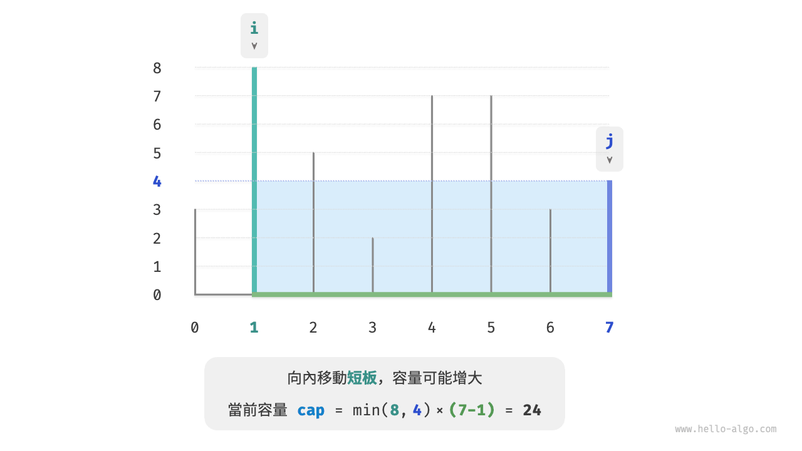

由此便可推出本題的貪婪策略：初始化兩指標，使其分列容器兩端，每輪向內收縮短板對應的指標，直至兩指標相遇。

下圖展示了貪婪策略的執行過程。

1. 初始狀態下，指標 $i$ 和 $j$ 分列陣列兩端。
2. 計算當前狀態的容量 $cap[i, j]$ ，並更新最大容量。
3. 比較板 $i$ 和 板 $j$ 的高度，並將短板向內移動一格。
4. 迴圈執行第 `2.` 步和第 `3.` 步，直至 $i$ 和 $j$ 相遇時結束。

=== "<1>"
    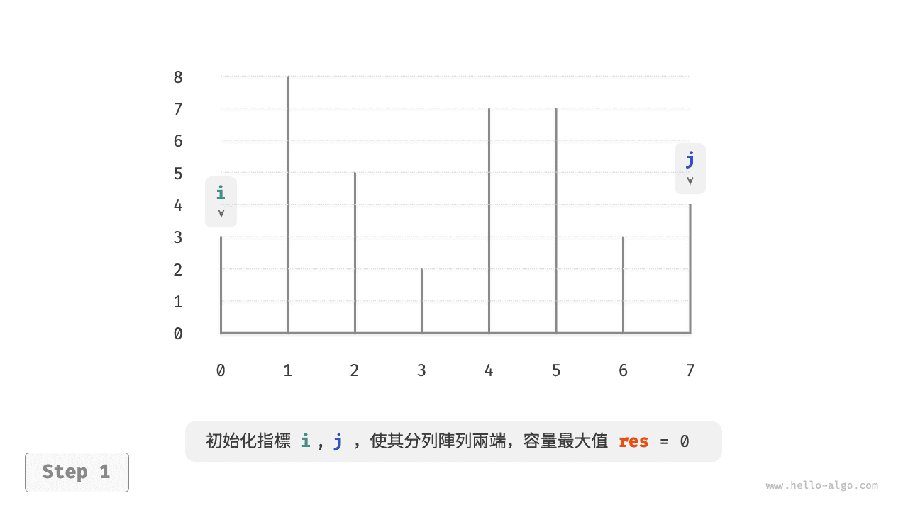

=== "<2>"
    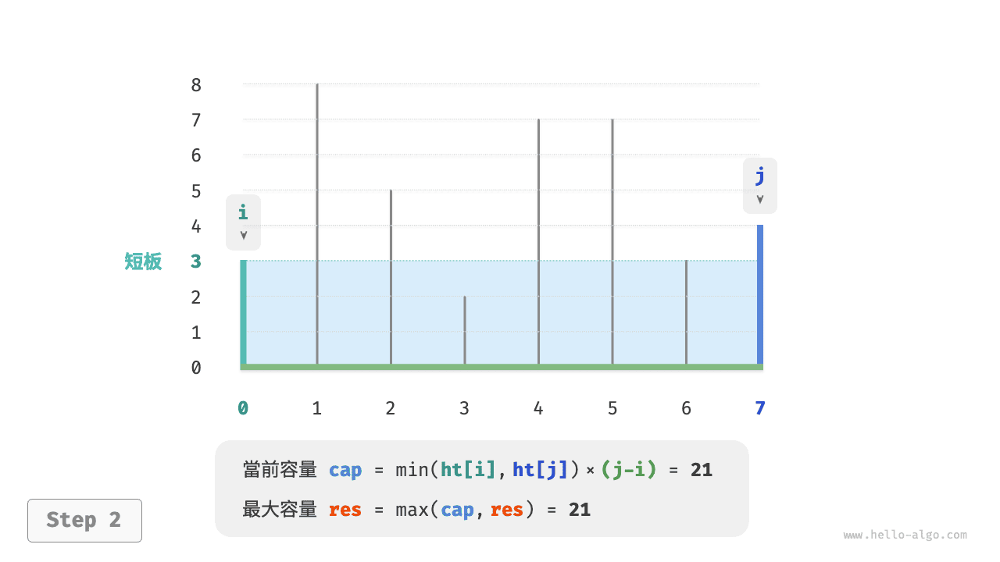

=== "<3>"
    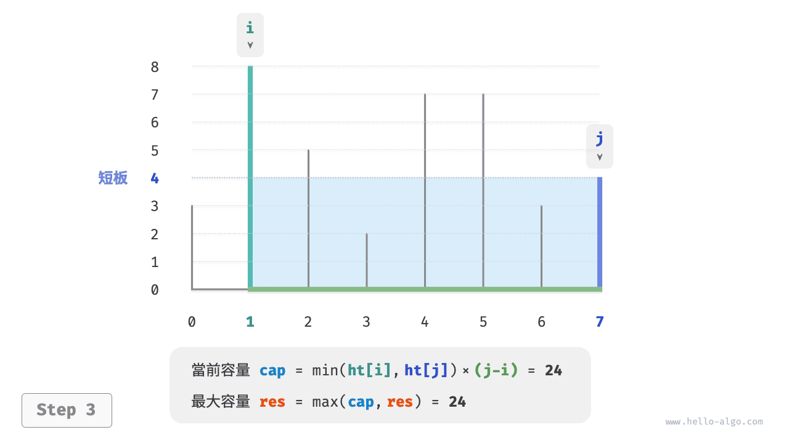

=== "<4>"
    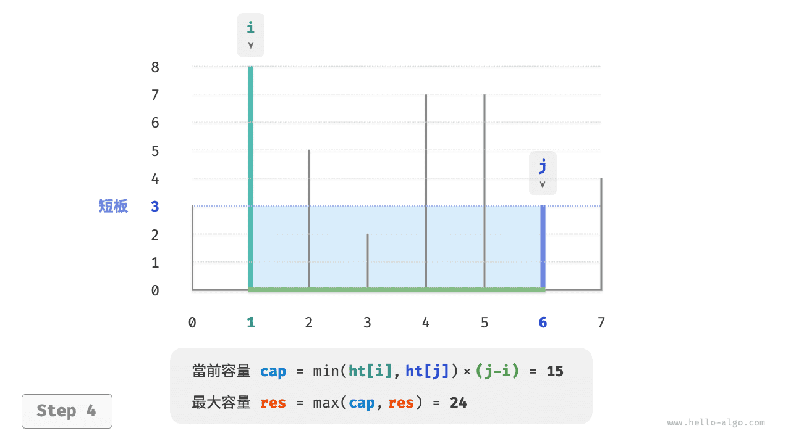

=== "<5>"
    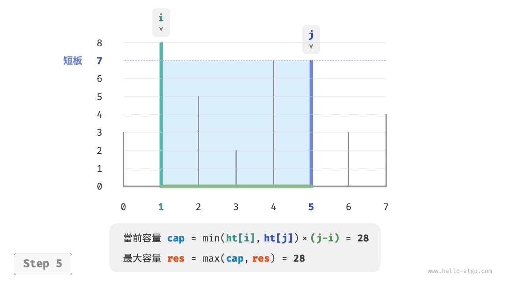

=== "<6>"
    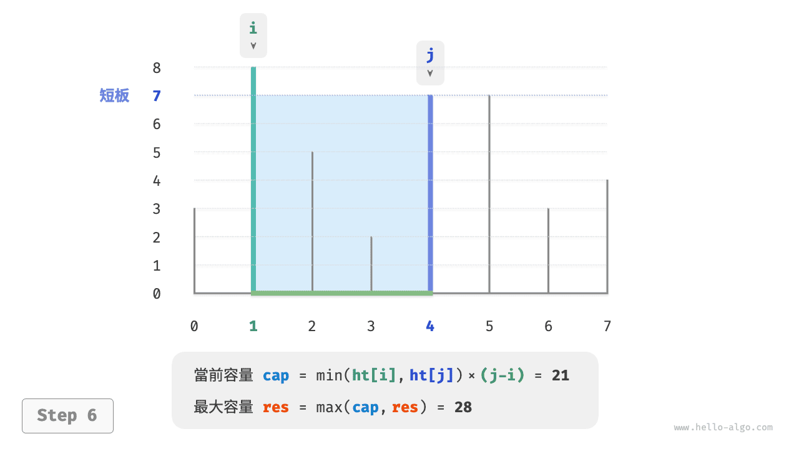

=== "<7>"
    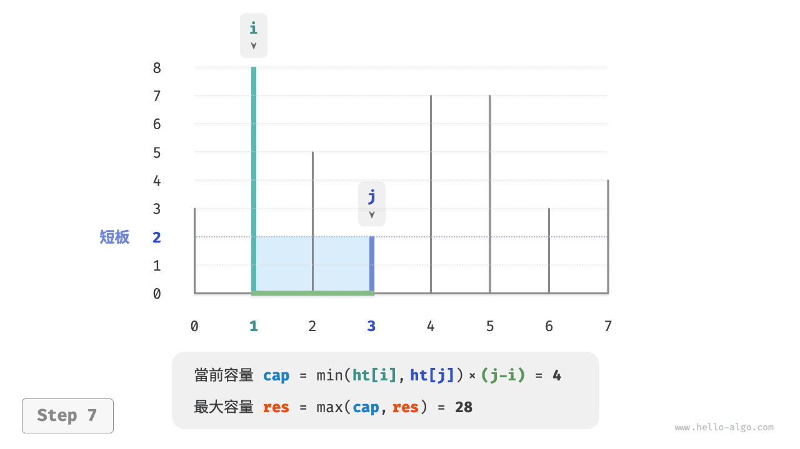

=== "<8>"
    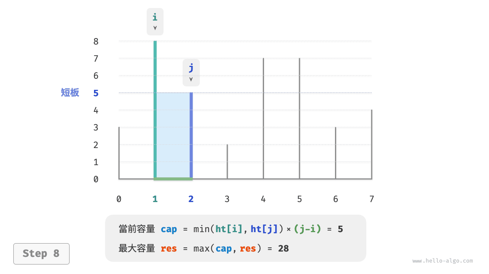

=== "<9>"
    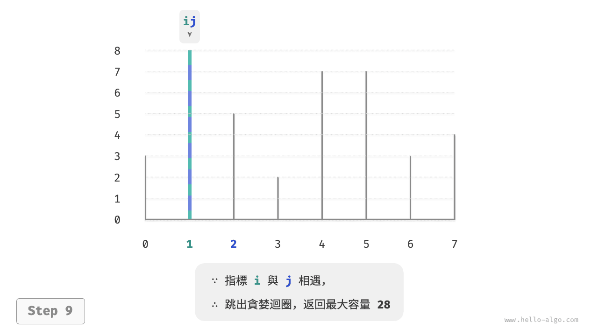

### 程式碼實現

程式碼迴圈最多 $n$ 輪，**因此時間複雜度為 $O(n)$** 。

變數 $i$、$j$、$res$ 使用常數大小的額外空間，**因此空間複雜度為 $O(1)$** 。

```src
[file]{max_capacity}-[class]{}-[func]{max_capacity}
```

### 正確性證明

之所以貪婪比窮舉更快，是因為每輪的貪婪選擇都會“跳過”一些狀態。

比如在狀態 $cap[i, j]$ 下，$i$ 為短板、$j$ 為長板。若貪婪地將短板 $i$ 向內移動一格，會導致下圖所示的狀態被“跳過”。**這意味著之後無法驗證這些狀態的容量大小**。

$$
cap[i, i+1], cap[i, i+2], \dots, cap[i, j-2], cap[i, j-1]
$$

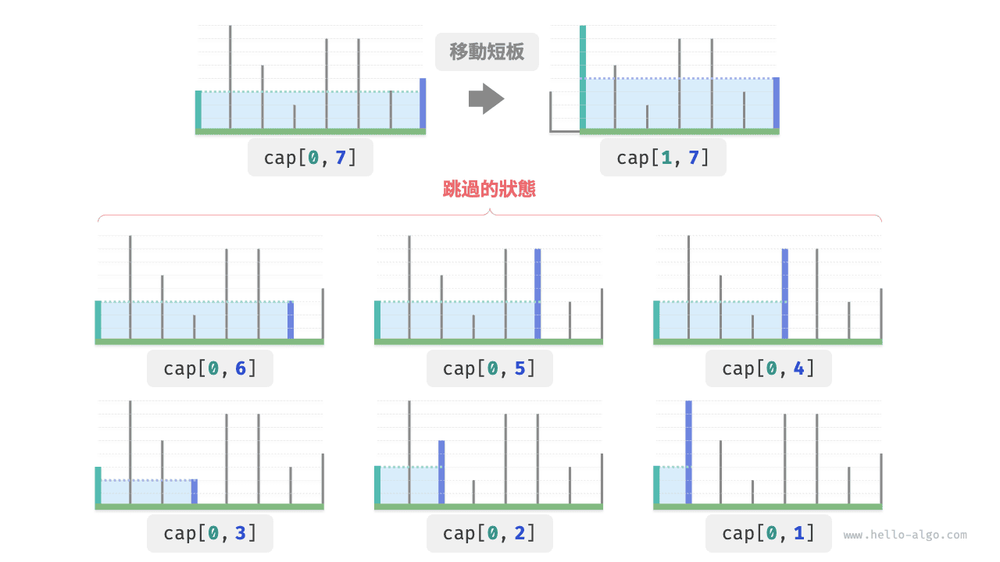

觀察發現，**這些被跳過的狀態實際上就是將長板 $j$ 向內移動的所有狀態**。前面我們已經證明內移長板一定會導致容量變小。也就是說，被跳過的狀態都不可能是最優解，**跳過它們不會導致錯過最優解**。

以上分析說明，移動短板的操作是“安全”的，貪婪策略是有效的。
