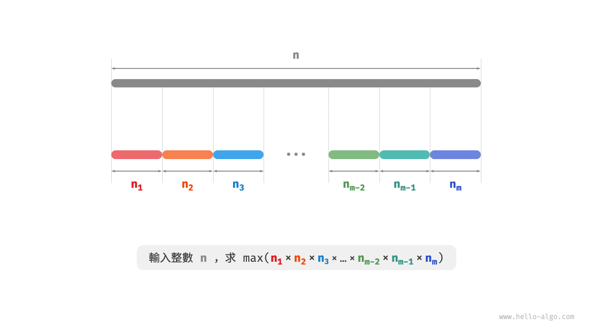
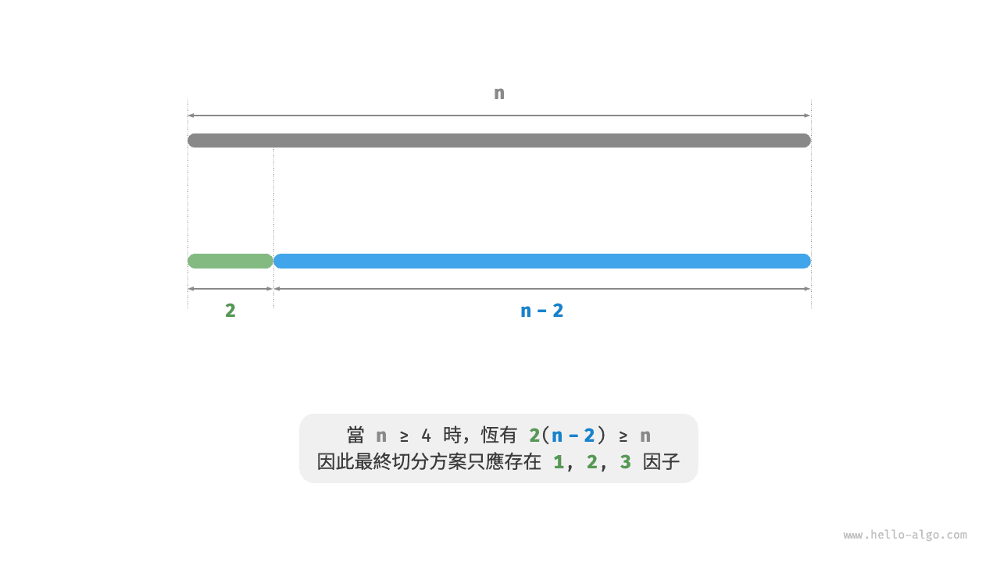
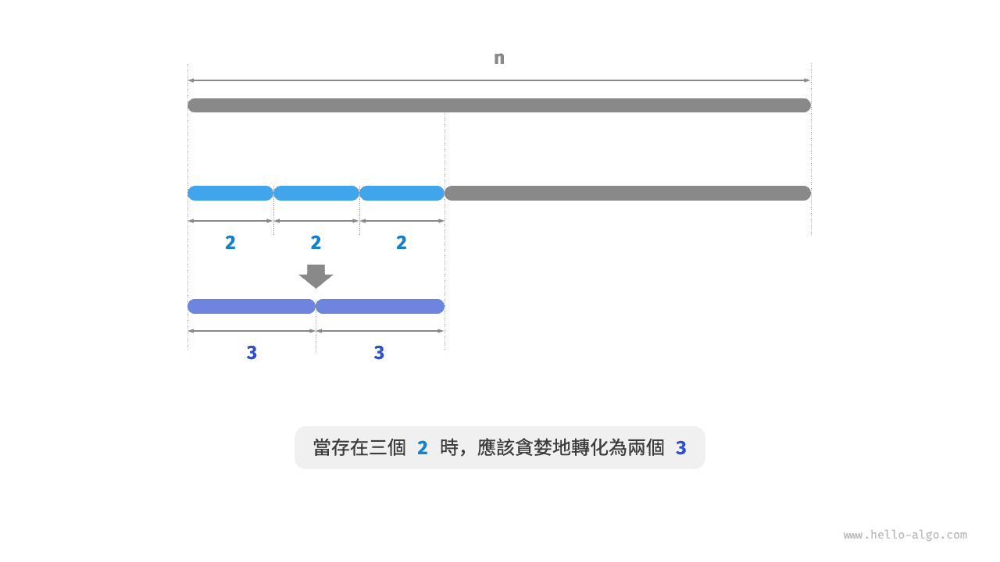
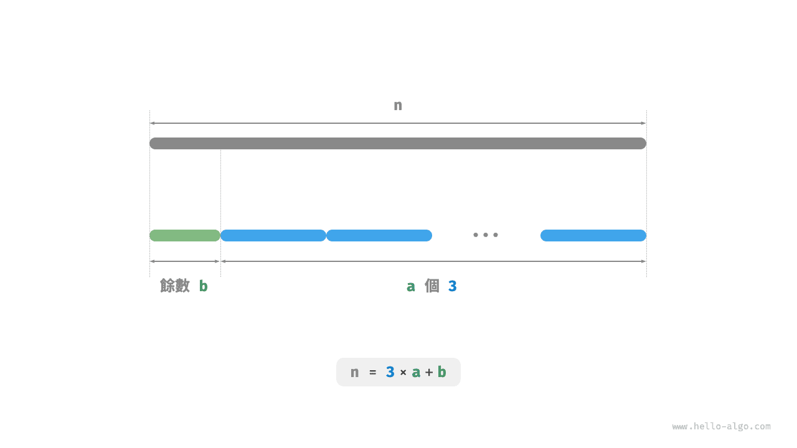

# 最大切分乘積問題

!!! question

    給定一個正整數 $n$ ，將其切分為至少兩個正整數的和，求切分後所有整數的乘積最大是多少，如下圖所示。



假設我們將 $n$ 切分為 $m$ 個整數因子，其中第 $i$ 個因子記為 $n_i$ ，即

$$
n = \sum_{i=1}^{m}n_i
$$

本題的目標是求得所有整數因子的最大乘積，即

$$
\max(\prod_{i=1}^{m}n_i)
$$

我們需要思考的是：切分數量 $m$ 應該多大，每個 $n_i$ 應該是多少？

### 貪婪策略確定

根據經驗，兩個整數的乘積往往比它們的加和更大。假設從 $n$ 中分出一個因子 $2$ ，則它們的乘積為 $2(n-2)$ 。我們將該乘積與 $n$ 作比較：

$$
\begin{aligned}
2(n-2) & \geq n \newline
2n - n - 4 & \geq 0 \newline
n & \geq 4
\end{aligned}
$$

如下圖所示，當 $n \geq 4$ 時，切分出一個 $2$ 後乘積會變大，**這說明大於等於 $4$ 的整數都應該被切分**。

**貪婪策略一**：如果切分方案中包含 $\geq 4$ 的因子，那麼它就應該被繼續切分。最終的切分方案只應出現 $1$、$2$、$3$ 這三種因子。



接下來思考哪個因子是最優的。在 $1$、$2$、$3$ 這三個因子中，顯然 $1$ 是最差的，因為 $1 \times (n-1) < n$ 恆成立，即切分出 $1$ 反而會導致乘積減小。

如下圖所示，當 $n = 6$ 時，有 $3 \times 3 > 2 \times 2 \times 2$ 。**這意味著切分出 $3$ 比切分出 $2$ 更優**。

**貪婪策略二**：在切分方案中，最多隻應存在兩個 $2$ 。因為三個 $2$ 總是可以替換為兩個 $3$ ，從而獲得更大的乘積。



綜上所述，可推理出以下貪婪策略。

1. 輸入整數 $n$ ，從其不斷地切分出因子 $3$ ，直至餘數為 $0$、$1$、$2$ 。
2. 當餘數為 $0$ 時，代表 $n$ 是 $3$ 的倍數，因此不做任何處理。
3. 當餘數為 $2$ 時，不繼續劃分，保留。
4. 當餘數為 $1$ 時，由於 $2 \times 2 > 1 \times 3$ ，因此應將最後一個 $3$ 替換為 $2$ 。

### 程式碼實現

如下圖所示，我們無須透過迴圈來切分整數，而可以利用向下整除運算得到 $3$ 的個數 $a$ ，用取模運算得到餘數 $b$ ，此時有：

$$
n = 3 a + b
$$

請注意，對於 $n \leq 3$ 的邊界情況，必須拆分出一個 $1$ ，乘積為 $1 \times (n - 1)$ 。

```src
[file]{max_product_cutting}-[class]{}-[func]{max_product_cutting}
```



**時間複雜度取決於程式語言的冪運算的實現方法**。以 Python 為例，常用的冪計算函式有三種。

- 運算子 `**` 和函式 `pow()` 的時間複雜度均為 $O(\log⁡ a)$ 。
- 函式 `math.pow()` 內部呼叫 C 語言庫的 `pow()` 函式，其執行浮點取冪，時間複雜度為 $O(1)$ 。

變數 $a$ 和 $b$ 使用常數大小的額外空間，**因此空間複雜度為 $O(1)$** 。

### 正確性證明

使用反證法，只分析 $n \geq 3$ 的情況。

1. **所有因子 $\leq 3$** ：假設最優切分方案中存在 $\geq 4$ 的因子 $x$ ，那麼一定可以將其繼續劃分為 $2(x-2)$ ，從而獲得更大的乘積。這與假設矛盾。
2. **切分方案不包含 $1$** ：假設最優切分方案中存在一個因子 $1$ ，那麼它一定可以合併入另外一個因子中，以獲得更大的乘積。這與假設矛盾。
3. **切分方案最多包含兩個 $2$** ：假設最優切分方案中包含三個 $2$ ，那麼一定可以替換為兩個 $3$ ，乘積更大。這與假設矛盾。
