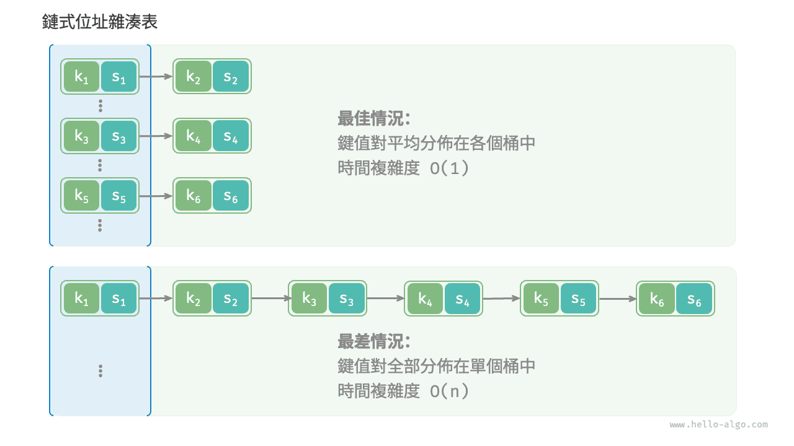

# 雜湊演算法

前兩節介紹了雜湊表的工作原理和雜湊衝突的處理方法。然而無論是開放定址還是鏈式位址，**它們只能保證雜湊表可以在發生衝突時正常工作，而無法減少雜湊衝突的發生**。

如果雜湊衝突過於頻繁，雜湊表的效能則會急劇劣化。如下圖所示，對於鏈式位址雜湊表，理想情況下鍵值對均勻分佈在各個桶中，達到最佳查詢效率；最差情況下所有鍵值對都儲存到同一個桶中，時間複雜度退化至 $O(n)$ 。



**鍵值對的分佈情況由雜湊函式決定**。回憶雜湊函式的計算步驟，先計算雜湊值，再對陣列長度取模：

```shell
index = hash(key) % capacity
```

觀察以上公式，當雜湊表容量 `capacity` 固定時，**雜湊演算法 `hash()` 決定了輸出值**，進而決定了鍵值對在雜湊表中的分佈情況。

這意味著，為了降低雜湊衝突的發生機率，我們應當將注意力集中在雜湊演算法 `hash()` 的設計上。

## 雜湊演算法的目標

為了實現“既快又穩”的雜湊表資料結構，雜湊演算法應具備以下特點。

- **確定性**：對於相同的輸入，雜湊演算法應始終產生相同的輸出。這樣才能確保雜湊表是可靠的。
- **效率高**：計算雜湊值的過程應該足夠快。計算開銷越小，雜湊表的實用性越高。
- **均勻分佈**：雜湊演算法應使得鍵值對均勻分佈在雜湊表中。分佈越均勻，雜湊衝突的機率就越低。

實際上，雜湊演算法除了可以用於實現雜湊表，還廣泛應用於其他領域中。

- **密碼儲存**：為了保護使用者密碼的安全，系統通常不會直接儲存使用者的明文密碼，而是儲存密碼的雜湊值。當用戶輸入密碼時，系統會對輸入的密碼計算雜湊值，然後與儲存的雜湊值進行比較。如果兩者匹配，那麼密碼就被視為正確。
- **資料完整性檢查**：資料傳送方可以計算資料的雜湊值並將其一同傳送；接收方可以重新計算接收到的資料的雜湊值，並與接收到的雜湊值進行比較。如果兩者匹配，那麼資料就被視為完整。

對於密碼學的相關應用，為了防止從雜湊值推導出原始密碼等逆向工程，雜湊演算法需要具備更高等級的安全特性。

- **單向性**：無法透過雜湊值反推出關於輸入資料的任何資訊。
- **抗碰撞性**：應當極難找到兩個不同的輸入，使得它們的雜湊值相同。
- **雪崩效應**：輸入的微小變化應當導致輸出的顯著且不可預測的變化。

請注意，**“均勻分佈”與“抗碰撞性”是兩個獨立的概念**，滿足均勻分佈不一定滿足抗碰撞性。例如，在隨機輸入 `key` 下，雜湊函式 `key % 100` 可以產生均勻分佈的輸出。然而該雜湊演算法過於簡單，所有後兩位相等的 `key` 的輸出都相同，因此我們可以很容易地從雜湊值反推出可用的 `key` ，從而破解密碼。

## 雜湊演算法的設計

雜湊演算法的設計是一個需要考慮許多因素的複雜問題。然而對於某些要求不高的場景，我們也能設計一些簡單的雜湊演算法。

- **加法雜湊**：對輸入的每個字元的 ASCII 碼進行相加，將得到的總和作為雜湊值。
- **乘法雜湊**：利用乘法的不相關性，每輪乘以一個常數，將各個字元的 ASCII 碼累積到雜湊值中。
- **互斥或雜湊**：將輸入資料的每個元素透過互斥或操作累積到一個雜湊值中。
- **旋轉雜湊**：將每個字元的 ASCII 碼累積到一個雜湊值中，每次累積之前都會對雜湊值進行旋轉操作。

```src
[file]{simple_hash}-[class]{}-[func]{rot_hash}
```

觀察發現，每種雜湊演算法的最後一步都是對大質數 $1000000007$ 取模，以確保雜湊值在合適的範圍內。值得思考的是，為什麼要強調對質數取模，或者說對合數取模的弊端是什麼？這是一個有趣的問題。

先說結論：**使用大質數作為模數，可以最大化地保證雜湊值的均勻分佈**。因為質數不與其他數字存在公約數，可以減少因取模操作而產生的週期性模式，從而避免雜湊衝突。

舉個例子，假設我們選擇合數 $9$ 作為模數，它可以被 $3$ 整除，那麼所有可以被 $3$ 整除的 `key` 都會被對映到 $0$、$3$、$6$ 這三個雜湊值。

$$
\begin{aligned}
\text{modulus} & = 9 \newline
\text{key} & = \{ 0, 3, 6, 9, 12, 15, 18, 21, 24, 27, 30, 33, \dots \} \newline
\text{hash} & = \{ 0, 3, 6, 0, 3, 6, 0, 3, 6, 0, 3, 6,\dots \}
\end{aligned}
$$

如果輸入 `key` 恰好滿足這種等差數列的資料分佈，那麼雜湊值就會出現聚堆積，從而加重雜湊衝突。現在，假設將 `modulus` 替換為質數 $13$ ，由於 `key` 和 `modulus` 之間不存在公約數，因此輸出的雜湊值的均勻性會明顯提升。

$$
\begin{aligned}
\text{modulus} & = 13 \newline
\text{key} & = \{ 0, 3, 6, 9, 12, 15, 18, 21, 24, 27, 30, 33, \dots \} \newline
\text{hash} & = \{ 0, 3, 6, 9, 12, 2, 5, 8, 11, 1, 4, 7, \dots \}
\end{aligned}
$$

值得說明的是，如果能夠保證 `key` 是隨機均勻分佈的，那麼選擇質數或者合數作為模數都可以，它們都能輸出均勻分佈的雜湊值。而當 `key` 的分佈存在某種週期性時，對合數取模更容易出現聚集現象。

總而言之，我們通常選取質數作為模數，並且這個質數最好足夠大，以儘可能消除週期性模式，提升雜湊演算法的穩健性。

## 常見雜湊演算法

不難發現，以上介紹的簡單雜湊演算法都比較“脆弱”，遠遠沒有達到雜湊演算法的設計目標。例如，由於加法和互斥或滿足交換律，因此加法雜湊和互斥或雜湊無法區分內容相同但順序不同的字串，這可能會加劇雜湊衝突，並引起一些安全問題。

在實際中，我們通常會用一些標準雜湊演算法，例如 MD5、SHA-1、SHA-2 和 SHA-3 等。它們可以將任意長度的輸入資料對映到恆定長度的雜湊值。

近一個世紀以來，雜湊演算法處在不斷升級與最佳化的過程中。一部分研究人員努力提升雜湊演算法的效能，另一部分研究人員和駭客則致力於尋找雜湊演算法的安全性問題。下表展示了在實際應用中常見的雜湊演算法。

- MD5 和 SHA-1 已多次被成功攻擊，因此它們被各類安全應用棄用。
- SHA-2 系列中的 SHA-256 是最安全的雜湊演算法之一，仍未出現成功的攻擊案例，因此常用在各類安全應用與協議中。
- SHA-3 相較 SHA-2 的實現開銷更低、計算效率更高，但目前使用覆蓋度不如 SHA-2 系列。

<p align="center"> 表 <id> &nbsp; 常見的雜湊演算法 </p>

|          | MD5                            | SHA-1            | SHA-2                        | SHA-3               |
| -------- | ------------------------------ | ---------------- | ---------------------------- | ------------------- |
| 推出時間 | 1992                           | 1995             | 2002                         | 2008                |
| 輸出長度 | 128 bit                        | 160 bit          | 256/512 bit                  | 224/256/384/512 bit |
| 雜湊衝突 | 較多                           | 較多             | 很少                         | 很少                |
| 安全等級 | 低，已被成功攻擊               | 低，已被成功攻擊 | 高                           | 高                  |
| 應用     | 已被棄用，仍用於資料完整性檢查 | 已被棄用         | 加密貨幣交易驗證、數字簽名等 | 可用於替代 SHA-2    |

## 資料結構的雜湊值

我們知道，雜湊表的 `key` 可以是整數、小數或字串等資料型別。程式語言通常會為這些資料型別提供內建的雜湊演算法，用於計算雜湊表中的桶索引。以 Python 為例，我們可以呼叫 `hash()` 函式來計算各種資料型別的雜湊值。

- 整數和布林量的雜湊值就是其本身。
- 浮點數和字串的雜湊值計算較為複雜，有興趣的讀者請自行學習。
- 元組的雜湊值是對其中每一個元素進行雜湊，然後將這些雜湊值組合起來，得到單一的雜湊值。
- 物件的雜湊值基於其記憶體位址生成。透過重寫物件的雜湊方法，可實現基於內容生成雜湊值。

!!! tip

    請注意，不同程式語言的內建雜湊值計算函式的定義和方法不同。

=== "Python"

    ```python title="built_in_hash.py"
    num = 3
    hash_num = hash(num)
    # 整數 3 的雜湊值為 3

    bol = True
    hash_bol = hash(bol)
    # 布林量 True 的雜湊值為 1

    dec = 3.14159
    hash_dec = hash(dec)
    # 小數 3.14159 的雜湊值為 326484311674566659

    str = "Hello 演算法"
    hash_str = hash(str)
    # 字串“Hello 演算法”的雜湊值為 4617003410720528961

    tup = (12836, "小哈")
    hash_tup = hash(tup)
    # 元組 (12836, '小哈') 的雜湊值為 1029005403108185979

    obj = ListNode(0)
    hash_obj = hash(obj)
    # 節點物件 <ListNode object at 0x1058fd810> 的雜湊值為 274267521
    ```

=== "C++"

    ```cpp title="built_in_hash.cpp"
    int num = 3;
    size_t hashNum = hash<int>()(num);
    // 整數 3 的雜湊值為 3

    bool bol = true;
    size_t hashBol = hash<bool>()(bol);
    // 布林量 1 的雜湊值為 1

    double dec = 3.14159;
    size_t hashDec = hash<double>()(dec);
    // 小數 3.14159 的雜湊值為 4614256650576692846

    string str = "Hello 演算法";
    size_t hashStr = hash<string>()(str);
    // 字串“Hello 演算法”的雜湊值為 15466937326284535026

    // 在 C++ 中，內建 std:hash() 僅提供基本資料型別的雜湊值計算
    // 陣列、物件的雜湊值計算需要自行實現
    ```

=== "Java"

    ```java title="built_in_hash.java"
    int num = 3;
    int hashNum = Integer.hashCode(num);
    // 整數 3 的雜湊值為 3

    boolean bol = true;
    int hashBol = Boolean.hashCode(bol);
    // 布林量 true 的雜湊值為 1231

    double dec = 3.14159;
    int hashDec = Double.hashCode(dec);
    // 小數 3.14159 的雜湊值為 -1340954729

    String str = "Hello 演算法";
    int hashStr = str.hashCode();
    // 字串“Hello 演算法”的雜湊值為 -727081396

    Object[] arr = { 12836, "小哈" };
    int hashTup = Arrays.hashCode(arr);
    // 陣列 [12836, 小哈] 的雜湊值為 1151158

    ListNode obj = new ListNode(0);
    int hashObj = obj.hashCode();
    // 節點物件 utils.ListNode@7dc5e7b4 的雜湊值為 2110121908
    ```

=== "C#"

    ```csharp title="built_in_hash.cs"
    int num = 3;
    int hashNum = num.GetHashCode();
    // 整數 3 的雜湊值為 3;

    bool bol = true;
    int hashBol = bol.GetHashCode();
    // 布林量 true 的雜湊值為 1;

    double dec = 3.14159;
    int hashDec = dec.GetHashCode();
    // 小數 3.14159 的雜湊值為 -1340954729;

    string str = "Hello 演算法";
    int hashStr = str.GetHashCode();
    // 字串“Hello 演算法”的雜湊值為 -586107568;

    object[] arr = [12836, "小哈"];
    int hashTup = arr.GetHashCode();
    // 陣列 [12836, 小哈] 的雜湊值為 42931033;

    ListNode obj = new(0);
    int hashObj = obj.GetHashCode();
    // 節點物件 0 的雜湊值為 39053774;
    ```

=== "Go"

    ```go title="built_in_hash.go"
    // Go 未提供內建 hash code 函式
    ```

=== "Swift"

    ```swift title="built_in_hash.swift"
    let num = 3
    let hashNum = num.hashValue
    // 整數 3 的雜湊值為 9047044699613009734

    let bol = true
    let hashBol = bol.hashValue
    // 布林量 true 的雜湊值為 -4431640247352757451

    let dec = 3.14159
    let hashDec = dec.hashValue
    // 小數 3.14159 的雜湊值為 -2465384235396674631

    let str = "Hello 演算法"
    let hashStr = str.hashValue
    // 字串“Hello 演算法”的雜湊值為 -7850626797806988787

    let arr = [AnyHashable(12836), AnyHashable("小哈")]
    let hashTup = arr.hashValue
    // 陣列 [AnyHashable(12836), AnyHashable("小哈")] 的雜湊值為 -2308633508154532996

    let obj = ListNode(x: 0)
    let hashObj = obj.hashValue
    // 節點物件 utils.ListNode 的雜湊值為 -2434780518035996159
    ```

=== "JS"

    ```javascript title="built_in_hash.js"
    // JavaScript 未提供內建 hash code 函式
    ```

=== "TS"

    ```typescript title="built_in_hash.ts"
    // TypeScript 未提供內建 hash code 函式
    ```

=== "Dart"

    ```dart title="built_in_hash.dart"
    int num = 3;
    int hashNum = num.hashCode;
    // 整數 3 的雜湊值為 34803

    bool bol = true;
    int hashBol = bol.hashCode;
    // 布林值 true 的雜湊值為 1231

    double dec = 3.14159;
    int hashDec = dec.hashCode;
    // 小數 3.14159 的雜湊值為 2570631074981783

    String str = "Hello 演算法";
    int hashStr = str.hashCode;
    // 字串“Hello 演算法”的雜湊值為 468167534

    List arr = [12836, "小哈"];
    int hashArr = arr.hashCode;
    // 陣列 [12836, 小哈] 的雜湊值為 976512528

    ListNode obj = new ListNode(0);
    int hashObj = obj.hashCode;
    // 節點物件 Instance of 'ListNode' 的雜湊值為 1033450432
    ```

=== "Rust"

    ```rust title="built_in_hash.rs"
    use std::collections::hash_map::DefaultHasher;
    use std::hash::{Hash, Hasher};

    let num = 3;
    let mut num_hasher = DefaultHasher::new();
    num.hash(&mut num_hasher);
    let hash_num = num_hasher.finish();
    // 整數 3 的雜湊值為 568126464209439262

    let bol = true;
    let mut bol_hasher = DefaultHasher::new();
    bol.hash(&mut bol_hasher);
    let hash_bol = bol_hasher.finish();
    // 布林量 true 的雜湊值為 4952851536318644461

    let dec: f32 = 3.14159;
    let mut dec_hasher = DefaultHasher::new();
    dec.to_bits().hash(&mut dec_hasher);
    let hash_dec = dec_hasher.finish();
    // 小數 3.14159 的雜湊值為 2566941990314602357

    let str = "Hello 演算法";
    let mut str_hasher = DefaultHasher::new();
    str.hash(&mut str_hasher);
    let hash_str = str_hasher.finish();
    // 字串“Hello 演算法”的雜湊值為 16092673739211250988

    let arr = (&12836, &"小哈");
    let mut tup_hasher = DefaultHasher::new();
    arr.hash(&mut tup_hasher);
    let hash_tup = tup_hasher.finish();
    // 元組 (12836, "小哈") 的雜湊值為 1885128010422702749

    let node = ListNode::new(42);
    let mut hasher = DefaultHasher::new();
    node.borrow().val.hash(&mut hasher);
    let hash = hasher.finish();
    // 節點物件 RefCell { value: ListNode { val: 42, next: None } } 的雜湊值為15387811073369036852
    ```

=== "C"

    ```c title="built_in_hash.c"
    // C 未提供內建 hash code 函式
    ```

=== "Kotlin"

    ```kotlin title="built_in_hash.kt"
    val num = 3
    val hashNum = num.hashCode()
    // 整數 3 的雜湊值為 3

    val bol = true
    val hashBol = bol.hashCode()
    // 布林量 true 的雜湊值為 1231

    val dec = 3.14159
    val hashDec = dec.hashCode()
    // 小數 3.14159 的雜湊值為 -1340954729

    val str = "Hello 演算法"
    val hashStr = str.hashCode()
    // 字串“Hello 演算法”的雜湊值為 -727081396

    val arr = arrayOf<Any>(12836, "小哈")
    val hashTup = arr.hashCode()
    // 陣列 [12836, 小哈] 的雜湊值為 189568618

    val obj = ListNode(0)
    val hashObj = obj.hashCode()
    // 節點物件 utils.ListNode@1d81eb93 的雜湊值為 495053715
    ```

=== "Ruby"

    ```ruby title="built_in_hash.rb"
    num = 3
    hash_num = num.hash
    # 整數 3 的雜湊值為 -4385856518450339636

    bol = true
    hash_bol = bol.hash
    # 布林量 true 的雜湊值為 -1617938112149317027

    dec = 3.14159
    hash_dec = dec.hash
    # 小數 3.14159 的雜湊值為 -1479186995943067893

    str = "Hello 演算法"
    hash_str = str.hash
    # 字串“Hello 演算法”的雜湊值為 -4075943250025831763

    tup = [12836, '小哈']
    hash_tup = tup.hash
    # 元組 (12836, '小哈') 的雜湊值為 1999544809202288822

    obj = ListNode.new(0)
    hash_obj = obj.hash
    # 節點物件 #<ListNode:0x000078133140ab70> 的雜湊值為 4302940560806366381
    ```

=== "Zig"

    ```zig title="built_in_hash.zig"

    ```

??? pythontutor "視覺化執行"

    https://pythontutor.com/render.html#code=class%20ListNode%3A%0A%20%20%20%20%22%22%22%E9%8F%88%E7%B5%90%E4%B8%B2%E5%88%97%E7%AF%80%E9%BB%9E%E9%A1%9E%E5%88%A5%22%22%22%0A%20%20%20%20def%20__init__%28self%2C%20val%3A%20int%29%3A%0A%20%20%20%20%20%20%20%20self.val%3A%20int%20%3D%20val%20%20%23%20%E7%AF%80%E9%BB%9E%E5%80%BC%0A%20%20%20%20%20%20%20%20self.next%3A%20ListNode%20%7C%20None%20%3D%20None%20%20%23%20%E5%BE%8C%E7%B9%BC%E7%AF%80%E9%BB%9E%E5%BC%95%E7%94%A8%0A%0A%22%22%22Driver%20Code%22%22%22%0Aif%20__name__%20%3D%3D%20%22__main__%22%3A%0A%20%20%20%20num%20%3D%203%0A%20%20%20%20hash_num%20%3D%20hash%28num%29%0A%20%20%20%20%23%20%E6%95%B4%E6%95%B8%203%20%E7%9A%84%E9%9B%9C%E6%B9%8A%E5%80%BC%E7%82%BA%203%0A%0A%20%20%20%20bol%20%3D%20True%0A%20%20%20%20hash_bol%20%3D%20hash%28bol%29%0A%20%20%20%20%23%20%E5%B8%83%E6%9E%97%E9%87%8F%20True%20%E7%9A%84%E9%9B%9C%E6%B9%8A%E5%80%BC%E7%82%BA%201%0A%0A%20%20%20%20dec%20%3D%203.14159%0A%20%20%20%20hash_dec%20%3D%20hash%28dec%29%0A%20%20%20%20%23%20%E5%B0%8F%E6%95%B8%203.14159%20%E7%9A%84%E9%9B%9C%E6%B9%8A%E5%80%BC%E7%82%BA%20326484311674566659%0A%0A%20%20%20%20str%20%3D%20%22Hello%20%E6%BC%94%E7%AE%97%E6%B3%95%22%0A%20%20%20%20hash_str%20%3D%20hash%28str%29%0A%20%20%20%20%23%20%E5%AD%97%E4%B8%B2%E2%80%9CHello%20%E6%BC%94%E7%AE%97%E6%B3%95%E2%80%9D%E7%9A%84%E9%9B%9C%E6%B9%8A%E5%80%BC%E7%82%BA%204617003410720528961%0A%0A%20%20%20%20tup%20%3D%20%2812836%2C%20%22%E5%B0%8F%E5%93%88%22%29%0A%20%20%20%20hash_tup%20%3D%20hash%28tup%29%0A%20%20%20%20%23%20%E5%85%83%E7%B5%84%20%2812836%2C%20%27%E5%B0%8F%E5%93%88%27%29%20%E7%9A%84%E9%9B%9C%E6%B9%8A%E5%80%BC%E7%82%BA%201029005403108185979%0A%0A%20%20%20%20obj%20%3D%20ListNode%280%29%0A%20%20%20%20hash_obj%20%3D%20hash%28obj%29%0A%20%20%20%20%23%20%E7%AF%80%E9%BB%9E%E7%89%A9%E4%BB%B6%20%3CListNode%20object%20at%200x1058fd810%3E%20%E7%9A%84%E9%9B%9C%E6%B9%8A%E5%80%BC%E7%82%BA%20274267521&cumulative=false&curInstr=19&heapPrimitives=nevernest&mode=display&origin=opt-frontend.js&py=311&rawInputLstJSON=%5B%5D&textReferences=false

在許多程式語言中，**只有不可變物件才可作為雜湊表的 `key`** 。假如我們將串列（動態陣列）作為 `key` ，當串列的內容發生變化時，它的雜湊值也隨之改變，我們就無法在雜湊表中查詢到原先的 `value` 了。

雖然自定義物件（比如鏈結串列節點）的成員變數是可變的，但它是可雜湊的。**這是因為物件的雜湊值通常是基於記憶體位址生成的**，即使物件的內容發生了變化，但它的記憶體位址不變，雜湊值仍然是不變的。

細心的你可能發現在不同控制檯中執行程式時，輸出的雜湊值是不同的。**這是因為 Python 直譯器在每次啟動時，都會為字串雜湊函式加入一個隨機的鹽（salt）值**。這種做法可以有效防止 HashDoS 攻擊，提升雜湊演算法的安全性。
