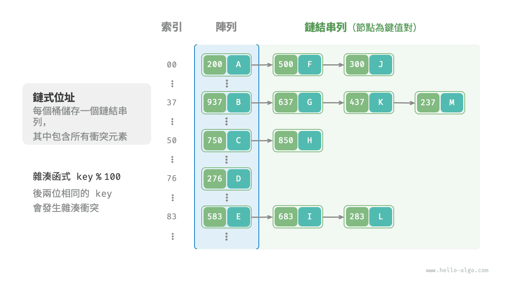
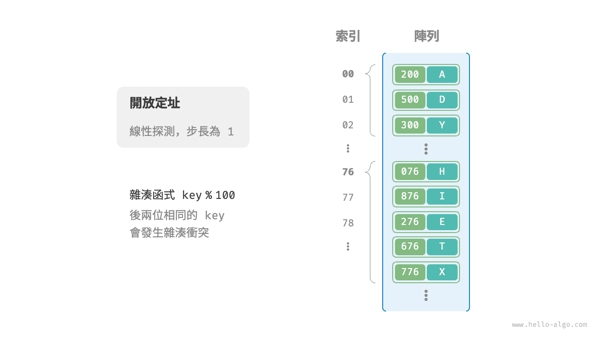
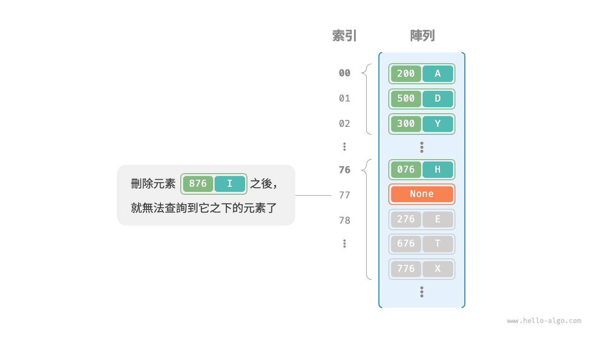

# 雜湊衝突

上一節提到，**通常情況下雜湊函式的輸入空間遠大於輸出空間**，因此理論上雜湊衝突是不可避免的。比如，輸入空間為全體整數，輸出空間為陣列容量大小，則必然有多個整數對映至同一桶索引。

雜湊衝突會導致查詢結果錯誤，嚴重影響雜湊表的可用性。為了解決該問題，每當遇到雜湊衝突時，我們就進行雜湊表擴容，直至衝突消失為止。此方法簡單粗暴且有效，但效率太低，因為雜湊表擴容需要進行大量的資料搬運與雜湊值計算。為了提升效率，我們可以採用以下策略。

1. 改良雜湊表資料結構，**使得雜湊表可以在出現雜湊衝突時正常工作**。
2. 僅在必要時，即當雜湊衝突比較嚴重時，才執行擴容操作。

雜湊表的結構改良方法主要包括“鏈式位址”和“開放定址”。

## 鏈式位址

在原始雜湊表中，每個桶僅能儲存一個鍵值對。<u>鏈式位址（separate chaining）</u>將單個元素轉換為鏈結串列，將鍵值對作為鏈結串列節點，將所有發生衝突的鍵值對都儲存在同一鏈結串列中。下圖展示了一個鏈式位址雜湊表的例子。



基於鏈式位址實現的雜湊表的操作方法發生了以下變化。

- **查詢元素**：輸入 `key` ，經過雜湊函式得到桶索引，即可訪問鏈結串列頭節點，然後走訪鏈結串列並對比 `key` 以查詢目標鍵值對。
- **新增元素**：首先透過雜湊函式訪問鏈結串列頭節點，然後將節點（鍵值對）新增到鏈結串列中。
- **刪除元素**：根據雜湊函式的結果訪問鏈結串列頭部，接著走訪鏈結串列以查詢目標節點並將其刪除。

鏈式位址存在以下侷限性。

- **佔用空間增大**：鏈結串列包含節點指標，它相比陣列更加耗費記憶體空間。
- **查詢效率降低**：因為需要線性走訪鏈結串列來查詢對應元素。

以下程式碼給出了鏈式位址雜湊表的簡單實現，需要注意兩點。

- 使用串列（動態陣列）代替鏈結串列，從而簡化程式碼。在這種設定下，雜湊表（陣列）包含多個桶，每個桶都是一個串列。
- 以下實現包含雜湊表擴容方法。當負載因子超過 $\frac{2}{3}$ 時，我們將雜湊表擴容至原先的 $2$ 倍。

```src
[file]{hash_map_chaining}-[class]{hash_map_chaining}-[func]{}
```

值得注意的是，當鏈結串列很長時，查詢效率 $O(n)$ 很差。**此時可以將鏈結串列轉換為“AVL 樹”或“紅黑樹”**，從而將查詢操作的時間複雜度最佳化至 $O(\log n)$ 。

## 開放定址

<u>開放定址（open addressing）</u>不引入額外的資料結構，而是透過“多次探測”來處理雜湊衝突，探測方式主要包括線性探查、平方探測和多次雜湊等。

下面以線性探查為例，介紹開放定址雜湊表的工作機制。

### 線性探查

線性探查採用固定步長的線性搜尋來進行探測，其操作方法與普通雜湊表有所不同。

- **插入元素**：透過雜湊函式計算桶索引，若發現桶內已有元素，則從衝突位置向後線性走訪（步長通常為 $1$ ），直至找到空桶，將元素插入其中。
- **查詢元素**：若發現雜湊衝突，則使用相同步長向後進行線性走訪，直到找到對應元素，返回 `value` 即可；如果遇到空桶，說明目標元素不在雜湊表中，返回 `None` 。

下圖展示了開放定址（線性探查）雜湊表的鍵值對分佈。根據此雜湊函式，最後兩位相同的 `key` 都會被對映到相同的桶。而透過線性探查，它們被依次儲存在該桶以及之下的桶中。



然而，**線性探查容易產生“聚集現象”**。具體來說，陣列中連續被佔用的位置越長，這些連續位置發生雜湊衝突的可能性越大，從而進一步促使該位置的聚堆積生長，形成惡性迴圈，最終導致增刪查改操作效率劣化。

值得注意的是，**我們不能在開放定址雜湊表中直接刪除元素**。這是因為刪除元素會在陣列內產生一個空桶 `None` ，而當查詢元素時，線性探查到該空桶就會返回，因此在該空桶之下的元素都無法再被訪問到，程式可能誤判這些元素不存在，如下圖所示。



為了解決該問題，我們可以採用<u>懶刪除（lazy deletion）</u>機制：它不直接從雜湊表中移除元素，**而是利用一個常數 `TOMBSTONE` 來標記這個桶**。在該機制下，`None` 和 `TOMBSTONE` 都代表空桶，都可以放置鍵值對。但不同的是，線性探查到 `TOMBSTONE` 時應該繼續走訪，因為其之下可能還存在鍵值對。

然而，**懶刪除可能會加速雜湊表的效能退化**。這是因為每次刪除操作都會產生一個刪除標記，隨著 `TOMBSTONE` 的增加，搜尋時間也會增加，因為線性探查可能需要跳過多個 `TOMBSTONE` 才能找到目標元素。

為此，考慮在線性探查中記錄遇到的首個 `TOMBSTONE` 的索引，並將搜尋到的目標元素與該 `TOMBSTONE` 交換位置。這樣做的好處是當每次查詢或新增元素時，元素會被移動至距離理想位置（探測起始點）更近的桶，從而最佳化查詢效率。

以下程式碼實現了一個包含懶刪除的開放定址（線性探查）雜湊表。為了更加充分地使用雜湊表的空間，我們將雜湊表看作一個“環形陣列”，當越過陣列尾部時，回到頭部繼續走訪。

```src
[file]{hash_map_open_addressing}-[class]{hash_map_open_addressing}-[func]{}
```

### 平方探測

平方探測與線性探查類似，都是開放定址的常見策略之一。當發生衝突時，平方探測不是簡單地跳過一個固定的步數，而是跳過“探測次數的平方”的步數，即 $1, 4, 9, \dots$ 步。

平方探測主要具有以下優勢。

- 平方探測透過跳過探測次數平方的距離，試圖緩解線性探查的聚集效應。
- 平方探測會跳過更大的距離來尋找空位置，有助於資料分佈得更加均勻。

然而，平方探測並不是完美的。

- 仍然存在聚集現象，即某些位置比其他位置更容易被佔用。
- 由於平方的增長，平方探測可能不會探測整個雜湊表，這意味著即使雜湊表中有空桶，平方探測也可能無法訪問到它。

### 多次雜湊

顧名思義，多次雜湊方法使用多個雜湊函式 $f_1(x)$、$f_2(x)$、$f_3(x)$、$\dots$ 進行探測。

- **插入元素**：若雜湊函式 $f_1(x)$ 出現衝突，則嘗試 $f_2(x)$ ，以此類推，直到找到空位後插入元素。
- **查詢元素**：在相同的雜湊函式順序下進行查詢，直到找到目標元素時返回；若遇到空位或已嘗試所有雜湊函式，說明雜湊表中不存在該元素，則返回 `None` 。

與線性探查相比，多次雜湊方法不易產生聚集，但多個雜湊函式會帶來額外的計算量。

!!! tip

    請注意，開放定址（線性探查、平方探測和多次雜湊）雜湊表都存在“不能直接刪除元素”的問題。

## 程式語言的選擇

各種程式語言採取了不同的雜湊表實現策略，下面舉幾個例子。

- Python 採用開放定址。字典 `dict` 使用偽隨機數進行探測。
- Java 採用鏈式位址。自 JDK 1.8 以來，當 `HashMap` 內陣列長度達到 64 且鏈結串列長度達到 8 時，鏈結串列會轉換為紅黑樹以提升查詢效能。
- Go 採用鏈式位址。Go 規定每個桶最多儲存 8 個鍵值對，超出容量則連線一個溢位桶；當溢位桶過多時，會執行一次特殊的等量擴容操作，以確保效能。
