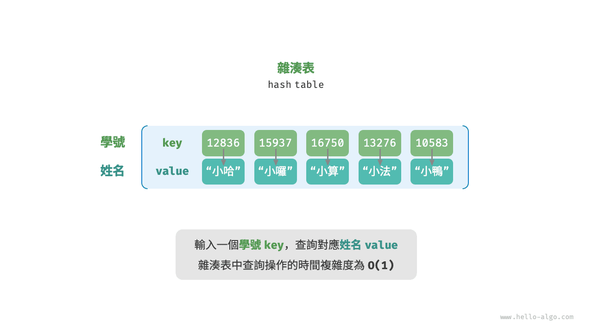
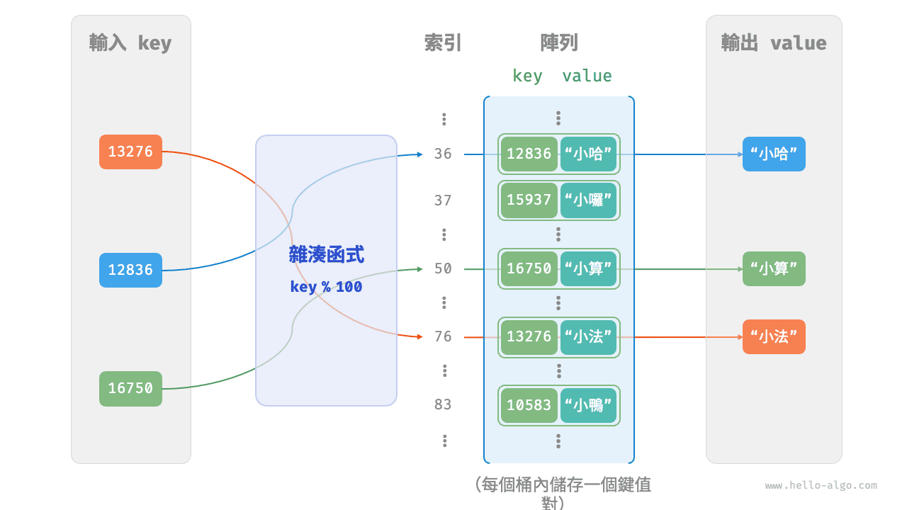
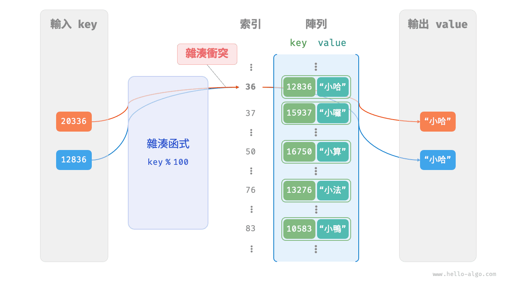
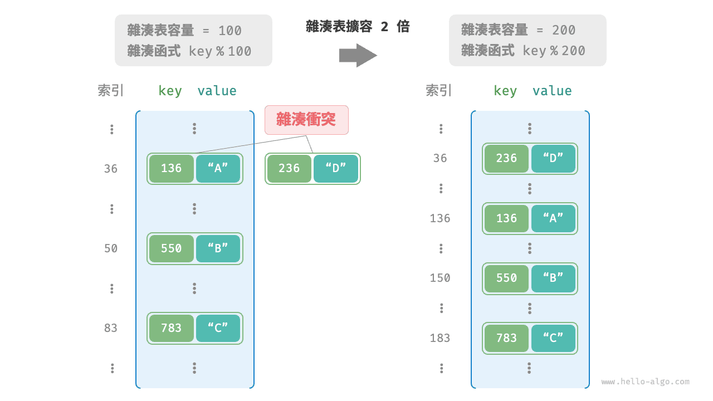

# 雜湊表

<u>雜湊表（hash table）</u>，又稱<u>散列表</u>，它透過建立鍵 `key` 與值 `value` 之間的對映，實現高效的元素查詢。具體而言，我們向雜湊表中輸入一個鍵 `key` ，則可以在 $O(1)$ 時間內獲取對應的值 `value` 。

如下圖所示，給定 $n$ 個學生，每個學生都有“姓名”和“學號”兩項資料。假如我們希望實現“輸入一個學號，返回對應的姓名”的查詢功能，則可以採用下圖所示的雜湊表來實現。



除雜湊表外，陣列和鏈結串列也可以實現查詢功能，它們的效率對比如下表所示。

- **新增元素**：僅需將元素新增至陣列（鏈結串列）的尾部即可，使用 $O(1)$ 時間。
- **查詢元素**：由於陣列（鏈結串列）是亂序的，因此需要走訪其中的所有元素，使用 $O(n)$ 時間。
- **刪除元素**：需要先查詢到元素，再從陣列（鏈結串列）中刪除，使用 $O(n)$ 時間。

<p align="center"> 表 <id> &nbsp; 元素查詢效率對比 </p>

|          | 陣列   | 鏈結串列   | 雜湊表 |
| -------- | ------ | ------ | ------ |
| 查詢元素 | $O(n)$ | $O(n)$ | $O(1)$ |
| 新增元素 | $O(1)$ | $O(1)$ | $O(1)$ |
| 刪除元素 | $O(n)$ | $O(n)$ | $O(1)$ |

觀察發現，**在雜湊表中進行增刪查改的時間複雜度都是 $O(1)$** ，非常高效。

## 雜湊表常用操作

雜湊表的常見操作包括：初始化、查詢操作、新增鍵值對和刪除鍵值對等，示例程式碼如下：

=== "Python"

    ```python title="hash_map.py"
    # 初始化雜湊表
    hmap: dict = {}

    # 新增操作
    # 在雜湊表中新增鍵值對 (key, value)
    hmap[12836] = "小哈"
    hmap[15937] = "小囉"
    hmap[16750] = "小算"
    hmap[13276] = "小法"
    hmap[10583] = "小鴨"

    # 查詢操作
    # 向雜湊表中輸入鍵 key ，得到值 value
    name: str = hmap[15937]

    # 刪除操作
    # 在雜湊表中刪除鍵值對 (key, value)
    hmap.pop(10583)
    ```

=== "C++"

    ```cpp title="hash_map.cpp"
    /* 初始化雜湊表 */
    unordered_map<int, string> map;

    /* 新增操作 */
    // 在雜湊表中新增鍵值對 (key, value)
    map[12836] = "小哈";
    map[15937] = "小囉";
    map[16750] = "小算";
    map[13276] = "小法";
    map[10583] = "小鴨";

    /* 查詢操作 */
    // 向雜湊表中輸入鍵 key ，得到值 value
    string name = map[15937];

    /* 刪除操作 */
    // 在雜湊表中刪除鍵值對 (key, value)
    map.erase(10583);
    ```

=== "Java"

    ```java title="hash_map.java"
    /* 初始化雜湊表 */
    Map<Integer, String> map = new HashMap<>();

    /* 新增操作 */
    // 在雜湊表中新增鍵值對 (key, value)
    map.put(12836, "小哈");
    map.put(15937, "小囉");
    map.put(16750, "小算");
    map.put(13276, "小法");
    map.put(10583, "小鴨");

    /* 查詢操作 */
    // 向雜湊表中輸入鍵 key ，得到值 value
    String name = map.get(15937);

    /* 刪除操作 */
    // 在雜湊表中刪除鍵值對 (key, value)
    map.remove(10583);
    ```

=== "C#"

    ```csharp title="hash_map.cs"
    /* 初始化雜湊表 */
    Dictionary<int, string> map = new() {
        /* 新增操作 */
        // 在雜湊表中新增鍵值對 (key, value)
        { 12836, "小哈" },
        { 15937, "小囉" },
        { 16750, "小算" },
        { 13276, "小法" },
        { 10583, "小鴨" }
    };

    /* 查詢操作 */
    // 向雜湊表中輸入鍵 key ，得到值 value
    string name = map[15937];

    /* 刪除操作 */
    // 在雜湊表中刪除鍵值對 (key, value)
    map.Remove(10583);
    ```

=== "Go"

    ```go title="hash_map_test.go"
    /* 初始化雜湊表 */
    hmap := make(map[int]string)

    /* 新增操作 */
    // 在雜湊表中新增鍵值對 (key, value)
    hmap[12836] = "小哈"
    hmap[15937] = "小囉"
    hmap[16750] = "小算"
    hmap[13276] = "小法"
    hmap[10583] = "小鴨"

    /* 查詢操作 */
    // 向雜湊表中輸入鍵 key ，得到值 value
    name := hmap[15937]

    /* 刪除操作 */
    // 在雜湊表中刪除鍵值對 (key, value)
    delete(hmap, 10583)
    ```

=== "Swift"

    ```swift title="hash_map.swift"
    /* 初始化雜湊表 */
    var map: [Int: String] = [:]

    /* 新增操作 */
    // 在雜湊表中新增鍵值對 (key, value)
    map[12836] = "小哈"
    map[15937] = "小囉"
    map[16750] = "小算"
    map[13276] = "小法"
    map[10583] = "小鴨"

    /* 查詢操作 */
    // 向雜湊表中輸入鍵 key ，得到值 value
    let name = map[15937]!

    /* 刪除操作 */
    // 在雜湊表中刪除鍵值對 (key, value)
    map.removeValue(forKey: 10583)
    ```

=== "JS"

    ```javascript title="hash_map.js"
    /* 初始化雜湊表 */
    const map = new Map();
    /* 新增操作 */
    // 在雜湊表中新增鍵值對 (key, value)
    map.set(12836, '小哈');
    map.set(15937, '小囉');
    map.set(16750, '小算');
    map.set(13276, '小法');
    map.set(10583, '小鴨');

    /* 查詢操作 */
    // 向雜湊表中輸入鍵 key ，得到值 value
    let name = map.get(15937);

    /* 刪除操作 */
    // 在雜湊表中刪除鍵值對 (key, value)
    map.delete(10583);
    ```

=== "TS"

    ```typescript title="hash_map.ts"
    /* 初始化雜湊表 */
    const map = new Map<number, string>();
    /* 新增操作 */
    // 在雜湊表中新增鍵值對 (key, value)
    map.set(12836, '小哈');
    map.set(15937, '小囉');
    map.set(16750, '小算');
    map.set(13276, '小法');
    map.set(10583, '小鴨');
    console.info('\n新增完成後，雜湊表為\nKey -> Value');
    console.info(map);

    /* 查詢操作 */
    // 向雜湊表中輸入鍵 key ，得到值 value
    let name = map.get(15937);
    console.info('\n輸入學號 15937 ，查詢到姓名 ' + name);

    /* 刪除操作 */
    // 在雜湊表中刪除鍵值對 (key, value)
    map.delete(10583);
    console.info('\n刪除 10583 後，雜湊表為\nKey -> Value');
    console.info(map);
    ```

=== "Dart"

    ```dart title="hash_map.dart"
    /* 初始化雜湊表 */
    Map<int, String> map = {};

    /* 新增操作 */
    // 在雜湊表中新增鍵值對 (key, value)
    map[12836] = "小哈";
    map[15937] = "小囉";
    map[16750] = "小算";
    map[13276] = "小法";
    map[10583] = "小鴨";

    /* 查詢操作 */
    // 向雜湊表中輸入鍵 key ，得到值 value
    String name = map[15937];

    /* 刪除操作 */
    // 在雜湊表中刪除鍵值對 (key, value)
    map.remove(10583);
    ```

=== "Rust"

    ```rust title="hash_map.rs"
    use std::collections::HashMap;

    /* 初始化雜湊表 */
    let mut map: HashMap<i32, String> = HashMap::new();

    /* 新增操作 */
    // 在雜湊表中新增鍵值對 (key, value)
    map.insert(12836, "小哈".to_string());
    map.insert(15937, "小囉".to_string());
    map.insert(16750, "小算".to_string());
    map.insert(13279, "小法".to_string());
    map.insert(10583, "小鴨".to_string());

    /* 查詢操作 */
    // 向雜湊表中輸入鍵 key ，得到值 value
    let _name: Option<&String> = map.get(&15937);

    /* 刪除操作 */
    // 在雜湊表中刪除鍵值對 (key, value)
    let _removed_value: Option<String> = map.remove(&10583);
    ```

=== "C"

    ```c title="hash_map.c"
    // C 未提供內建雜湊表
    ```

=== "Kotlin"

    ```kotlin title="hash_map.kt"
    /* 初始化雜湊表 */
    val map = HashMap<Int,String>()

    /* 新增操作 */
    // 在雜湊表中新增鍵值對 (key, value)
    map[12836] = "小哈"
    map[15937] = "小囉"
    map[16750] = "小算"
    map[13276] = "小法"
    map[10583] = "小鴨"

    /* 查詢操作 */
    // 向雜湊表中輸入鍵 key ，得到值 value
    val name = map[15937]

    /* 刪除操作 */
    // 在雜湊表中刪除鍵值對 (key, value)
    map.remove(10583)
    ```

=== "Ruby"

    ```ruby title="hash_map.rb"
    # 初始化雜湊表
    hmap = {}

    # 新增操作
    # 在雜湊表中新增鍵值對 (key, value)
    hmap[12836] = "小哈"
    hmap[15937] = "小囉"
    hmap[16750] = "小算"
    hmap[13276] = "小法"
    hmap[10583] = "小鴨"

    # 查詢操作
    # 向雜湊表中輸入鍵 key ，得到值 value
    name = hmap[15937]

    # 刪除操作
    # 在雜湊表中刪除鍵值對 (key, value)
    hmap.delete(10583)
    ```

=== "Zig"

    ```zig title="hash_map.zig"

    ```

??? pythontutor "視覺化執行"

    https://pythontutor.com/render.html#code=%22%22%22Driver%20Code%22%22%22%0Aif%20__name__%20%3D%3D%20%22__main__%22%3A%0A%20%20%20%20%23%20%E5%88%9D%E5%A7%8B%E5%8C%96%E9%9B%9C%E6%B9%8A%E8%A1%A8%0A%20%20%20%20hmap%20%3D%20%7B%7D%0A%20%20%20%20%0A%20%20%20%20%23%20%E6%96%B0%E5%A2%9E%E6%93%8D%E4%BD%9C%0A%20%20%20%20%23%20%E5%9C%A8%E9%9B%9C%E6%B9%8A%E8%A1%A8%E4%B8%AD%E6%96%B0%E5%A2%9E%E9%8D%B5%E5%80%BC%E5%B0%8D%20%28key%2C%20value%29%0A%20%20%20%20hmap%5B12836%5D%20%3D%20%22%E5%B0%8F%E5%93%88%22%0A%20%20%20%20hmap%5B15937%5D%20%3D%20%22%E5%B0%8F%E5%9B%89%22%0A%20%20%20%20hmap%5B16750%5D%20%3D%20%22%E5%B0%8F%E7%AE%97%22%0A%20%20%20%20hmap%5B13276%5D%20%3D%20%22%E5%B0%8F%E6%B3%95%22%0A%20%20%20%20hmap%5B10583%5D%20%3D%20%22%E5%B0%8F%E9%B4%A8%22%0A%20%20%20%20%0A%20%20%20%20%23%20%E6%9F%A5%E8%A9%A2%E6%93%8D%E4%BD%9C%0A%20%20%20%20%23%20%E5%90%91%E9%9B%9C%E6%B9%8A%E8%A1%A8%E4%B8%AD%E8%BC%B8%E5%85%A5%E9%8D%B5%20key%20%EF%BC%8C%E5%BE%97%E5%88%B0%E5%80%BC%20value%0A%20%20%20%20name%20%3D%20hmap%5B15937%5D%0A%20%20%20%20%0A%20%20%20%20%23%20%E5%88%AA%E9%99%A4%E6%93%8D%E4%BD%9C%0A%20%20%20%20%23%20%E5%9C%A8%E9%9B%9C%E6%B9%8A%E8%A1%A8%E4%B8%AD%E5%88%AA%E9%99%A4%E9%8D%B5%E5%80%BC%E5%B0%8D%20%28key%2C%20value%29%0A%20%20%20%20hmap.pop%2810583%29&cumulative=false&curInstr=2&heapPrimitives=nevernest&mode=display&origin=opt-frontend.js&py=311&rawInputLstJSON=%5B%5D&textReferences=false

雜湊表有三種常用的走訪方式：走訪鍵值對、走訪鍵和走訪值。示例程式碼如下：

=== "Python"

    ```python title="hash_map.py"
    # 走訪雜湊表
    # 走訪鍵值對 key->value
    for key, value in hmap.items():
        print(key, "->", value)
    # 單獨走訪鍵 key
    for key in hmap.keys():
        print(key)
    # 單獨走訪值 value
    for value in hmap.values():
        print(value)
    ```

=== "C++"

    ```cpp title="hash_map.cpp"
    /* 走訪雜湊表 */
    // 走訪鍵值對 key->value
    for (auto kv: map) {
        cout << kv.first << " -> " << kv.second << endl;
    }
    // 使用迭代器走訪 key->value
    for (auto iter = map.begin(); iter != map.end(); iter++) {
        cout << iter->first << "->" << iter->second << endl;
    }
    ```

=== "Java"

    ```java title="hash_map.java"
    /* 走訪雜湊表 */
    // 走訪鍵值對 key->value
    for (Map.Entry <Integer, String> kv: map.entrySet()) {
        System.out.println(kv.getKey() + " -> " + kv.getValue());
    }
    // 單獨走訪鍵 key
    for (int key: map.keySet()) {
        System.out.println(key);
    }
    // 單獨走訪值 value
    for (String val: map.values()) {
        System.out.println(val);
    }
    ```

=== "C#"

    ```csharp title="hash_map.cs"
    /* 走訪雜湊表 */
    // 走訪鍵值對 Key->Value
    foreach (var kv in map) {
        Console.WriteLine(kv.Key + " -> " + kv.Value);
    }
    // 單獨走訪鍵 key
    foreach (int key in map.Keys) {
        Console.WriteLine(key);
    }
    // 單獨走訪值 value
    foreach (string val in map.Values) {
        Console.WriteLine(val);
    }
    ```

=== "Go"

    ```go title="hash_map_test.go"
    /* 走訪雜湊表 */
    // 走訪鍵值對 key->value
    for key, value := range hmap {
        fmt.Println(key, "->", value)
    }
    // 單獨走訪鍵 key
    for key := range hmap {
        fmt.Println(key)
    }
    // 單獨走訪值 value
    for _, value := range hmap {
        fmt.Println(value)
    }
    ```

=== "Swift"

    ```swift title="hash_map.swift"
    /* 走訪雜湊表 */
    // 走訪鍵值對 Key->Value
    for (key, value) in map {
        print("\(key) -> \(value)")
    }
    // 單獨走訪鍵 Key
    for key in map.keys {
        print(key)
    }
    // 單獨走訪值 Value
    for value in map.values {
        print(value)
    }
    ```

=== "JS"

    ```javascript title="hash_map.js"
    /* 走訪雜湊表 */
    console.info('\n走訪鍵值對 Key->Value');
    for (const [k, v] of map.entries()) {
        console.info(k + ' -> ' + v);
    }
    console.info('\n單獨走訪鍵 Key');
    for (const k of map.keys()) {
        console.info(k);
    }
    console.info('\n單獨走訪值 Value');
    for (const v of map.values()) {
        console.info(v);
    }
    ```

=== "TS"

    ```typescript title="hash_map.ts"
    /* 走訪雜湊表 */
    console.info('\n走訪鍵值對 Key->Value');
    for (const [k, v] of map.entries()) {
        console.info(k + ' -> ' + v);
    }
    console.info('\n單獨走訪鍵 Key');
    for (const k of map.keys()) {
        console.info(k);
    }
    console.info('\n單獨走訪值 Value');
    for (const v of map.values()) {
        console.info(v);
    }
    ```

=== "Dart"

    ```dart title="hash_map.dart"
    /* 走訪雜湊表 */
    // 走訪鍵值對 Key->Value
    map.forEach((key, value) {
      print('$key -> $value');
    });

    // 單獨走訪鍵 Key
    map.keys.forEach((key) {
      print(key);
    });

    // 單獨走訪值 Value
    map.values.forEach((value) {
      print(value);
    });
    ```

=== "Rust"

    ```rust title="hash_map.rs"
    /* 走訪雜湊表 */
    // 走訪鍵值對 Key->Value
    for (key, value) in &map {
        println!("{key} -> {value}");
    }

    // 單獨走訪鍵 Key
    for key in map.keys() {
        println!("{key}");
    }

    // 單獨走訪值 Value
    for value in map.values() {
        println!("{value}");
    }
    ```

=== "C"

    ```c title="hash_map.c"
    // C 未提供內建雜湊表
    ```

=== "Kotlin"

    ```kotlin title="hash_map.kt"
    /* 走訪雜湊表 */
    // 走訪鍵值對 key->value
    for ((key, value) in map) {
        println("$key -> $value")
    }
    // 單獨走訪鍵 key
    for (key in map.keys) {
        println(key)
    }
    // 單獨走訪值 value
    for (_val in map.values) {
        println(_val)
    }
    ```

=== "Ruby"

    ```ruby title="hash_map.rb"
    # 走訪雜湊表
    # 走訪鍵值對 key->value
    hmap.entries.each { |key, value| puts "#{key} -> #{value}" }

    # 單獨走訪鍵 key
    hmap.keys.each { |key| puts key }

    # 單獨走訪值 value
    hmap.values.each { |val| puts val }
    ```

=== "Zig"

    ```zig title="hash_map.zig"

    ```

??? pythontutor "視覺化執行"

    https://pythontutor.com/render.html#code=%22%22%22Driver%20Code%22%22%22%0Aif%20__name__%20%3D%3D%20%22__main__%22%3A%0A%20%20%20%20%23%20%E5%88%9D%E5%A7%8B%E5%8C%96%E9%9B%9C%E6%B9%8A%E8%A1%A8%0A%20%20%20%20hmap%20%3D%20%7B%7D%0A%20%20%20%20%0A%20%20%20%20%23%20%E6%96%B0%E5%A2%9E%E6%93%8D%E4%BD%9C%0A%20%20%20%20%23%20%E5%9C%A8%E9%9B%9C%E6%B9%8A%E8%A1%A8%E4%B8%AD%E6%96%B0%E5%A2%9E%E9%8D%B5%E5%80%BC%E5%B0%8D%20%28key%2C%20value%29%0A%20%20%20%20hmap%5B12836%5D%20%3D%20%22%E5%B0%8F%E5%93%88%22%0A%20%20%20%20hmap%5B15937%5D%20%3D%20%22%E5%B0%8F%E5%9B%89%22%0A%20%20%20%20hmap%5B16750%5D%20%3D%20%22%E5%B0%8F%E7%AE%97%22%0A%20%20%20%20hmap%5B13276%5D%20%3D%20%22%E5%B0%8F%E6%B3%95%22%0A%20%20%20%20hmap%5B10583%5D%20%3D%20%22%E5%B0%8F%E9%B4%A8%22%0A%20%20%20%20%0A%20%20%20%20%23%20%E8%B5%B0%E8%A8%AA%E9%9B%9C%E6%B9%8A%E8%A1%A8%0A%20%20%20%20%23%20%E8%B5%B0%E8%A8%AA%E9%8D%B5%E5%80%BC%E5%B0%8D%20key-%3Evalue%0A%20%20%20%20for%20key%2C%20value%20in%20hmap.items%28%29%3A%0A%20%20%20%20%20%20%20%20print%28key%2C%20%22-%3E%22%2C%20value%29%0A%20%20%20%20%23%20%E5%96%AE%E7%8D%A8%E8%B5%B0%E8%A8%AA%E9%8D%B5%20key%0A%20%20%20%20for%20key%20in%20hmap.keys%28%29%3A%0A%20%20%20%20%20%20%20%20print%28key%29%0A%20%20%20%20%23%20%E5%96%AE%E7%8D%A8%E8%B5%B0%E8%A8%AA%E5%80%BC%20value%0A%20%20%20%20for%20value%20in%20hmap.values%28%29%3A%0A%20%20%20%20%20%20%20%20print%28value%29&cumulative=false&curInstr=8&heapPrimitives=nevernest&mode=display&origin=opt-frontend.js&py=311&rawInputLstJSON=%5B%5D&textReferences=false

## 雜湊表簡單實現

我們先考慮最簡單的情況，**僅用一個陣列來實現雜湊表**。在雜湊表中，我們將陣列中的每個空位稱為<u>桶（bucket）</u>，每個桶可儲存一個鍵值對。因此，查詢操作就是找到 `key` 對應的桶，並在桶中獲取 `value` 。

那麼，如何基於 `key` 定位對應的桶呢？這是透過<u>雜湊函式（hash function）</u>實現的。雜湊函式的作用是將一個較大的輸入空間對映到一個較小的輸出空間。在雜湊表中，輸入空間是所有 `key` ，輸出空間是所有桶（陣列索引）。換句話說，輸入一個 `key` ，**我們可以透過雜湊函式得到該 `key` 對應的鍵值對在陣列中的儲存位置**。

輸入一個 `key` ，雜湊函式的計算過程分為以下兩步。

1. 透過某種雜湊演算法 `hash()` 計算得到雜湊值。
2. 將雜湊值對桶數量（陣列長度）`capacity` 取模，從而獲取該 `key` 對應的陣列索引 `index` 。

```shell
index = hash(key) % capacity
```

隨後，我們就可以利用 `index` 在雜湊表中訪問對應的桶，從而獲取 `value` 。

設陣列長度 `capacity = 100`、雜湊演算法 `hash(key) = key` ，易得雜湊函式為 `key % 100` 。下圖以 `key` 學號和 `value` 姓名為例，展示了雜湊函式的工作原理。



以下程式碼實現了一個簡單雜湊表。其中，我們將 `key` 和 `value` 封裝成一個類別 `Pair` ，以表示鍵值對。

```src
[file]{array_hash_map}-[class]{array_hash_map}-[func]{}
```

## 雜湊衝突與擴容

從本質上看，雜湊函式的作用是將所有 `key` 構成的輸入空間對映到陣列所有索引構成的輸出空間，而輸入空間往往遠大於輸出空間。因此，**理論上一定存在“多個輸入對應相同輸出”的情況**。

對於上述示例中的雜湊函式，當輸入的 `key` 後兩位相同時，雜湊函式的輸出結果也相同。例如，查詢學號為 12836 和 20336 的兩個學生時，我們得到：

```shell
12836 % 100 = 36
20336 % 100 = 36
```

如下圖所示，兩個學號指向了同一個姓名，這顯然是不對的。我們將這種多個輸入對應同一輸出的情況稱為<u>雜湊衝突（hash collision）</u>。



容易想到，雜湊表容量 $n$ 越大，多個 `key` 被分配到同一個桶中的機率就越低，衝突就越少。因此，**我們可以透過擴容雜湊表來減少雜湊衝突**。

如下圖所示，擴容前鍵值對 `(136, A)` 和 `(236, D)` 發生衝突，擴容後衝突消失。



類似於陣列擴容，雜湊表擴容需將所有鍵值對從原雜湊表遷移至新雜湊表，非常耗時；並且由於雜湊表容量 `capacity` 改變，我們需要透過雜湊函式來重新計算所有鍵值對的儲存位置，這進一步增加了擴容過程的計算開銷。為此，程式語言通常會預留足夠大的雜湊表容量，防止頻繁擴容。

<u>負載因子（load factor）</u>是雜湊表的一個重要概念，其定義為雜湊表的元素數量除以桶數量，用於衡量雜湊衝突的嚴重程度，**也常作為雜湊表擴容的觸發條件**。例如在 Java 中，當負載因子超過 $0.75$ 時，系統會將雜湊表擴容至原先的 $2$ 倍。
