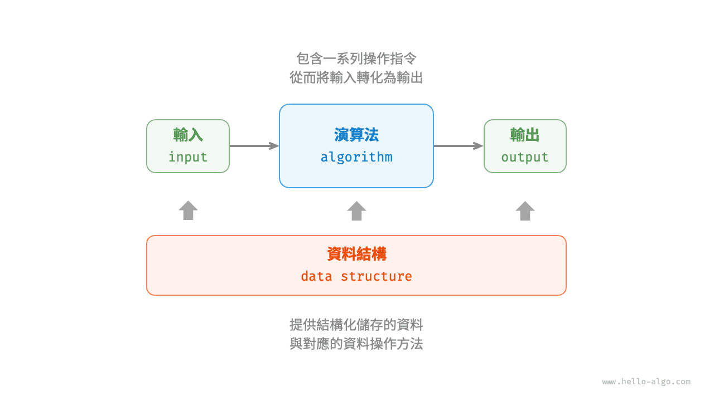

# 演算法是什麼

## 演算法定義

<u>演算法（algorithm）</u>是在有限時間內解決特定問題的一組指令或操作步驟，它具有以下特性。

- 問題是明確的，包含清晰的輸入和輸出定義。
- 具有可行性，能夠在有限步驟、時間和記憶體空間下完成。
- 各步驟都有確定的含義，在相同的輸入和執行條件下，輸出始終相同。

## 資料結構定義

<u>資料結構（data structure）</u>是組織和儲存資料的方式，涵蓋資料內容、資料之間關係和資料操作方法，它具有以下設計目標。

- 空間佔用儘量少，以節省計算機記憶體。
- 資料操作儘可能快速，涵蓋資料訪問、新增、刪除、更新等。
- 提供簡潔的資料表示和邏輯資訊，以便演算法高效執行。

**資料結構設計是一個充滿權衡的過程**。如果想在某方面取得提升，往往需要在另一方面作出妥協。下面舉兩個例子。

- 鏈結串列相較於陣列，在資料新增和刪除操作上更加便捷，但犧牲了資料訪問速度。
- 圖相較於鏈結串列，提供了更豐富的邏輯資訊，但需要佔用更大的記憶體空間。

## 資料結構與演算法的關係

如下圖所示，資料結構與演算法高度相關、緊密結合，具體表現在以下三個方面。

- 資料結構是演算法的基石。資料結構為演算法提供了結構化儲存的資料，以及操作資料的方法。
- 演算法為資料結構注入生命力。資料結構本身僅儲存資料資訊，結合演算法才能解決特定問題。
- 演算法通常可以基於不同的資料結構實現，但執行效率可能相差很大，選擇合適的資料結構是關鍵。

資料結構與演算法猶如下圖所示的拼裝積木。一套積木，除了包含許多零件之外，還附有詳細的組裝說明書。我們按照說明書一步步操作，就能組裝出精美的積木模型。

兩者的詳細對應關係如下表所示。

 表 <id> &nbsp; 將資料結構與演算法類比為拼裝積木 

| 資料結構與演算法 | 拼裝積木                                 |
| -------------- | ---------------------------------------- |
| 輸入資料       | 未拼裝的積木                             |
| 資料結構       | 積木組織形式，包括形狀、大小、連線方式等 |
| 演算法           | 把積木拼成目標形態的一系列操作步驟       |
| 輸出資料       | 積木模型                                 |

值得說明的是，資料結構與演算法是獨立於程式語言的。正因如此，本書得以提供基於多種程式語言的實現。

!!! tip "約定俗成的簡稱"

    在實際討論時，我們通常會將“資料結構與演算法”簡稱為“演算法”。比如眾所周知的 LeetCode 演算法題目，實際上同時考查資料結構和演算法兩方面的知識。
