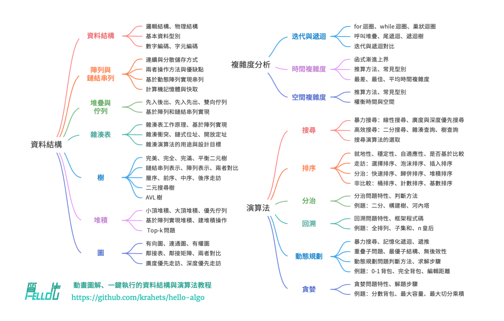

# 關於本書

本專案旨在建立一本開源、免費、對新手友好的資料結構與演算法入門教程。

- 全書採用動畫圖解，內容清晰易懂、學習曲線平滑，引導初學者探索資料結構與演算法的知識地圖。
- 源程式碼可一鍵執行，幫助讀者在練習中提升程式設計技能，瞭解演算法工作原理和資料結構底層實現。
- 提倡讀者互助學習，歡迎大家在評論區提出問題與分享見解，在交流討論中共同進步。

## 目標讀者

若你是演算法初學者，從未接觸過演算法，或者已經有一些刷題經驗，對資料結構與演算法有模糊的認識，在會與不會之間反覆橫跳，那麼本書正是為你量身定製的！

如果你已經積累一定的刷題量，熟悉大部分題型，那麼本書可助你回顧與梳理演算法知識體系，倉庫源程式碼可以當作“刷題工具庫”或“演算法字典”來使用。

若你是演算法“大神”，我們期待收到你的寶貴建議，或者[一起參與創作](https://www.hello-algo.com/chapter_appendix/contribution/)。

!!! success "前置條件"

    你需要至少具備任一語言的程式設計基礎，能夠閱讀和編寫簡單程式碼。

## 內容結構

本書的主要內容如下圖所示。

- **複雜度分析**：資料結構和演算法的評價維度與方法。時間複雜度和空間複雜度的推算方法、常見型別、示例等。
- **資料結構**：基本資料型別和資料結構的分類方法。陣列、鏈結串列、堆疊、佇列、雜湊表、樹、堆積、圖等資料結構的定義、優缺點、常用操作、常見型別、典型應用、實現方法等。
- **演算法**：搜尋、排序、分治、回溯、動態規劃、貪婪等演算法的定義、優缺點、效率、應用場景、解題步驟和示例問題等。

## 致謝

本書在開源社群眾多貢獻者的共同努力下不斷完善。感謝每一位投入時間與精力的撰稿人，他們是（按照 GitHub 自動生成的順序）：krahets、coderonion、Gonglja、nuomi1、Reanon、justin-tse、hpstory、danielsss、curtishd、night-cruise、S-N-O-R-L-A-X、msk397、gvenusleo、khoaxuantu、RiverTwilight、rongyi、gyt95、zhuoqinyue、K3v123、Zuoxun、mingXta、hello-ikun、FangYuan33、GN-Yu、yuelinxin、longsizhuo、Cathay-Chen、guowei-gong、xBLACKICEx、IsChristina、JoseHung、qualifier1024、QiLOL、pengchzn、Guanngxu、L-Super、WSL0809、Slone123c、lhxsm、yuan0221、what-is-me、theNefelibatas、longranger2、cy-by-side、xiongsp、JeffersonHuang、Transmigration-zhou、magentaqin、Wonderdch、malone6、xiaomiusa87、gaofer、bluebean-cloud、a16su、Shyam-Chen、nanlei、hongyun-robot、Phoenix0415、MolDuM、Nigh、he-weilai、junminhong、mgisr、iron-irax、yd-j、XiaChuerwu、XC-Zero、seven1240、SamJin98、wodray、reeswell、NI-SW、Horbin-Magician、Enlightenus、xjr7670、YangXuanyi、DullSword、boloboloda、iStig、qq909244296、jiaxianhua、wenjianmin、keshida、kilikilikid、lclc6、lwbaptx、liuxjerry、lucaswangdev、lyl625760、hts0000、gledfish、fbigm、echo1937、szu17dmy、dshlstarr、Yucao-cy、coderlef、czruby、bongbongbakudan、beintentional、ZongYangL、ZhongYuuu、luluxia、xb534、bitsmi、ElaBosak233、baagod、zhouLion、yishangzhang、yi427、yabo083、weibk、wangwang105、th1nk3r-ing、tao363、4yDX3906、syd168、steventimes、sslmj2020、smilelsb、siqyka、selear、sdshaoda、Xi-Row、popozhu、nuquist19、noobcodemaker、XiaoK29、chadyi、ZhongGuanbin、shanghai-Jerry、JackYang-hellobobo、Javesun99、lipusheng、BlindTerran、ShiMaRing、FreddieLi、FloranceYeh、iFleey、fanchenggang、gltianwen、goerll、Dr-XYZ、nedchu、curly210102、CuB3y0nd、KraHsu、CarrotDLaw、youshaoXG、bubble9um、fanenr、eagleanurag、LifeGoesOnionOnionOnion、52coder、foursevenlove、KorsChen、hezhizhen、linzeyan、ZJKung、GaochaoZhu、hopkings2008、yang-le、Evilrabbit520、Turing-1024-Lee、thomasq0、Suremotoo、Allen-Scai、Risuntsy、Richard-Zhang1019、qingpeng9802、primexiao、nidhoggfgg、1ch0、MwumLi、martinx、ZnYang2018、hugtyftg、logan-qiu、psychelzh、Keynman、KeiichiKasai 和 0130w。

本書的程式碼審閱工作由 coderonion、curtishd、Gonglja、gvenusleo、hpstory、justin-tse、khoaxuantu、krahets、night-cruise、nuomi1、Reanon 和 rongyi 完成（按照首字母順序排列）。感謝他們付出的時間與精力，正是他們確保了各語言程式碼的規範與統一。

本書的繁體中文版由 Shyam-Chen 和 Dr-XYZ 審閱，英文版由 yuelinxin、K3v123、QiLOL、Phoenix0415、SamJin98、yanedie、RafaelCaso、pengchzn、thomasq0 和 magentaqin 審閱。正是因為他們的持續貢獻，這本書才能夠服務於更廣泛的讀者群體，感謝他們。

在本書的創作過程中，我得到了許多人的幫助。

- 感謝我在公司的導師李汐博士，在一次暢談中你鼓勵我“快行動起來”，堅定了我寫這本書的決心；
- 感謝我的女朋友泡泡作為本書的首位讀者，從演算法小白的角度提出許多寶貴建議，使得本書更適合新手閱讀；
- 感謝騰寶、琦寶、飛寶為本書起了一個富有創意的名字，喚起大家寫下第一行程式碼“Hello World!”的美好回憶；
- 感謝校銓在智慧財產權方面提供的專業幫助，這對本開源書的完善起到了重要作用；
- 感謝蘇潼為本書設計了精美的封面和 logo ，並在我的強迫症的驅使下多次耐心修改；
- 感謝 @squidfunk 提供的排版建議，以及他開發的開源文件主題 [Material-for-MkDocs](https://github.com/squidfunk/mkdocs-material/tree/master) 。

在寫作過程中，我閱讀了許多關於資料結構與演算法的教材和文章。這些作品為本書提供了優秀的範本，確保了本書內容的準確性與品質。在此感謝所有老師和前輩的傑出貢獻！

本書倡導手腦並用的學習方式，在這一點上我深受[《動手學深度學習》](https://github.com/d2l-ai/d2l-zh)的啟發。在此向各位讀者強烈推薦這本優秀的著作。

**衷心感謝我的父母，正是你們一直以來的支持與鼓勵，讓我有機會做這件富有趣味的事**。
