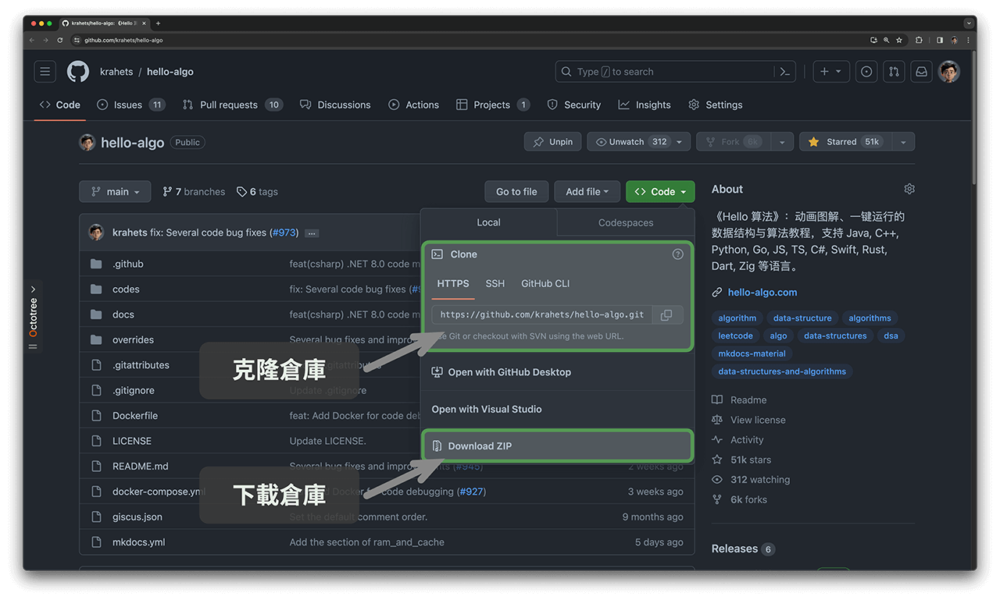
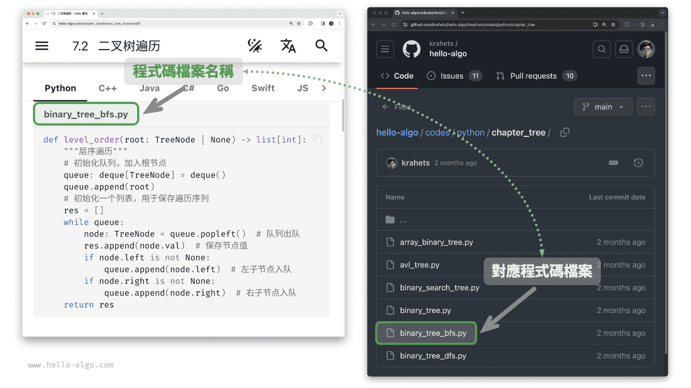
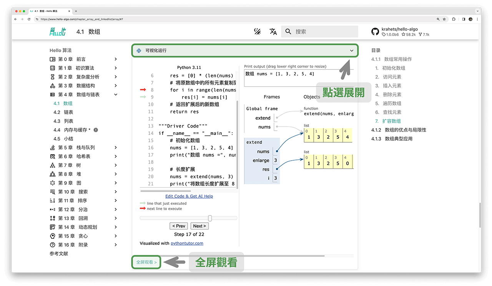
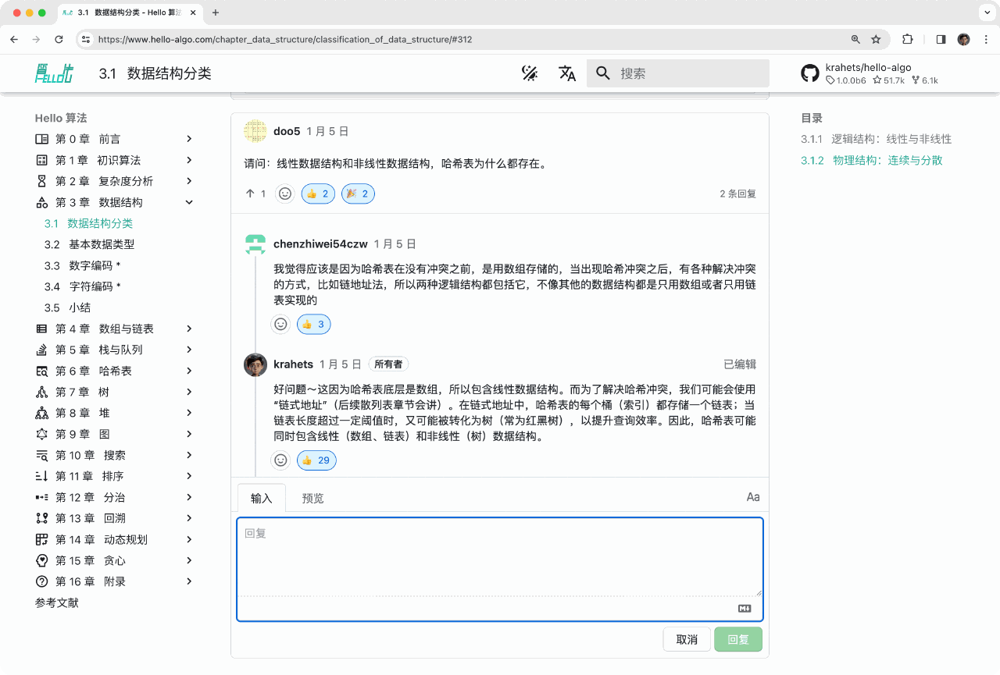
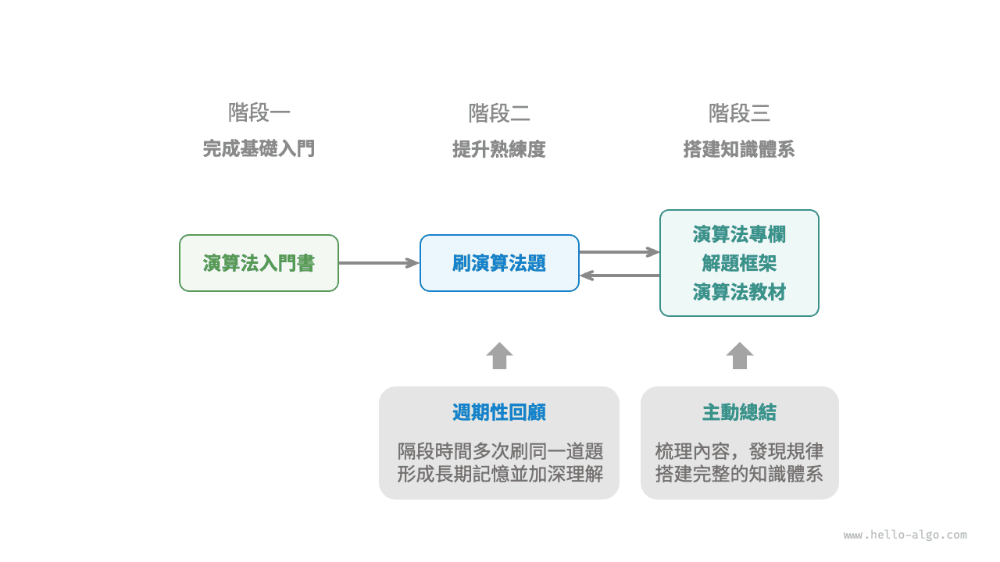

# 如何使用本書

!!! tip

    為了獲得最佳的閱讀體驗，建議你通讀本節內容。

## 行文風格約定

- 標題後標註 `*` 的是選讀章節，內容相對困難。如果你的時間有限，可以先跳過。
- 專業術語會使用黑體（紙質版和 PDF 版）或新增下劃線（網頁版），例如<u>陣列（array）</u>。建議記住它們，以便閱讀文獻。
- 重點內容和總結性語句會 **加粗**，這類文字值得特別關注。
- 有特指含義的詞句會使用“引號”標註，以避免歧義。
- 當涉及程式語言之間不一致的名詞時，本書均以 Python 為準，例如使用 `None` 來表示“空”。
- 本書部分放棄了程式語言的註釋規範，以換取更加緊湊的內容排版。註釋主要分為三種類型：標題註釋、內容註釋、多行註釋。

=== "Python"

    ```python title=""
    """標題註釋，用於標註函式、類別、測試樣例等"""
    
    # 內容註釋，用於詳解程式碼
    
    """
    多行
    註釋
    """
    ```

=== "C++"

    ```cpp title=""
    /* 標題註釋，用於標註函式、類別、測試樣例等 */
    
    // 內容註釋，用於詳解程式碼
    
    /**
     * 多行
     * 註釋
     */
    ```

=== "Java"

    ```java title=""
    /* 標題註釋，用於標註函式、類別、測試樣例等 */
    
    // 內容註釋，用於詳解程式碼
    
    /**
     * 多行
     * 註釋
     */
    ```

=== "C#"

    ```csharp title=""
    /* 標題註釋，用於標註函式、類別、測試樣例等 */
    
    // 內容註釋，用於詳解程式碼
    
    /**
     * 多行
     * 註釋
     */
    ```

=== "Go"

    ```go title=""
    /* 標題註釋，用於標註函式、類別、測試樣例等 */
    
    // 內容註釋，用於詳解程式碼
    
    /**
     * 多行
     * 註釋
     */
    ```

=== "Swift"

    ```swift title=""
    /* 標題註釋，用於標註函式、類別、測試樣例等 */
    
    // 內容註釋，用於詳解程式碼
    
    /**
     * 多行
     * 註釋
     */
    ```

=== "JS"

    ```javascript title=""
    /* 標題註釋，用於標註函式、類別、測試樣例等 */
    
    // 內容註釋，用於詳解程式碼
    
    /**
     * 多行
     * 註釋
     */
    ```

=== "TS"

    ```typescript title=""
    /* 標題註釋，用於標註函式、類別、測試樣例等 */
    
    // 內容註釋，用於詳解程式碼
    
    /**
     * 多行
     * 註釋
     */
    ```

=== "Dart"

    ```dart title=""
    /* 標題註釋，用於標註函式、類別、測試樣例等 */
    
    // 內容註釋，用於詳解程式碼
    
    /**
     * 多行
     * 註釋
     */
    ```

=== "Rust"

    ```rust title=""
    /* 標題註釋，用於標註函式、類別、測試樣例等 */

    // 內容註釋，用於詳解程式碼
    
    /**
     * 多行
     * 註釋
     */
    ```

=== "C"

    ```c title=""
    /* 標題註釋，用於標註函式、類別、測試樣例等 */
    
    // 內容註釋，用於詳解程式碼
    
    /**
     * 多行
     * 註釋
     */
    ```

=== "Kotlin"

    ```kotlin title=""
    /* 標題註釋，用於標註函式、類別、測試樣例等 */
    
    // 內容註釋，用於詳解程式碼
    
    /**
     * 多行
     * 註釋
     */
    ```

=== "Ruby"

    ```ruby title=""
    ### 標題註釋，用於標註函式、類別、測試樣例等 ###

    # 內容註釋，用於詳解程式碼
    
    # 多行
    # 註釋
    ```

=== "Zig"

    ```zig title=""
    // 標題註釋，用於標註函式、類別、測試樣例等
    
    // 內容註釋，用於詳解程式碼
    
    // 多行
    // 註釋
    ```

## 在動畫圖解中高效學習

相較於文字，影片和圖片具有更高的資訊密度和結構化程度，更易於理解。在本書中，**重點和難點知識將主要透過動畫以圖解形式展示**，而文字則作為解釋與補充。

如果你在閱讀本書時，發現某段內容提供瞭如下圖所示的動畫圖解，**請以圖為主、以文字為輔**，綜合兩者來理解內容。


## 在程式碼實踐中加深理解

本書的配套程式碼託管在 [GitHub 倉庫](https://github.com/krahets/hello-algo)。如下圖所示，**源程式碼附有測試樣例，可一鍵執行**。

如果時間允許，**建議你參照程式碼自行敲一遍**。如果學習時間有限，請至少通讀並執行所有程式碼。

與閱讀程式碼相比，編寫程式碼的過程往往能帶來更多收穫。**動手學，才是真的學**。


執行程式碼的前置工作主要分為三步。

**第一步：安裝本地程式設計環境**。請參照附錄所示的[教程](https://www.hello-algo.com/chapter_appendix/installation/)進行安裝，如果已安裝，則可跳過此步驟。

**第二步：克隆或下載程式碼倉庫**。前往 [GitHub 倉庫](https://github.com/krahets/hello-algo)。如果已經安裝 [Git](https://git-scm.com/downloads) ，可以透過以下命令克隆本倉庫：

```shell
git clone https://github.com/krahets/hello-algo.git
```

當然，你也可以在下圖所示的位置，點選“Download ZIP”按鈕直接下載程式碼壓縮包，然後在本地解壓即可。



**第三步：執行源程式碼**。如下圖所示，對於頂部標有檔案名稱的程式碼塊，我們可以在倉庫的 `codes` 檔案夾內找到對應的源程式碼檔案。源程式碼檔案可一鍵執行，將幫助你節省不必要的除錯時間，讓你能夠專注於學習內容。



除了本地執行程式碼，**網頁版還支持 Python 程式碼的視覺化執行**（基於 [pythontutor](https://pythontutor.com/) 實現）。如下圖所示，你可以點選程式碼塊下方的“視覺化執行”來展開檢視，觀察演算法程式碼的執行過程；也可以點選“全屏觀看”，以獲得更好的閱覽體驗。



## 在提問討論中共同成長

在閱讀本書時，請不要輕易跳過那些沒學明白的知識點。**歡迎在評論區提出你的問題**，我和小夥伴們將竭誠為你解答，一般情況下可在兩天內回覆。

如下圖所示，網頁版每個章節的底部都配有評論區。希望你能多關注評論區的內容。一方面，你可以瞭解大家遇到的問題，從而查漏補缺，激發更深入的思考。另一方面，期待你能慷慨地回答其他小夥伴的問題，分享你的見解，幫助他人進步。



## 演算法學習路線

從總體上看，我們可以將學習資料結構與演算法的過程劃分為三個階段。

1. **階段一：演算法入門**。我們需要熟悉各種資料結構的特點和用法，學習不同演算法的原理、流程、用途和效率等方面的內容。
2. **階段二：刷演算法題**。建議從熱門題目開刷，先積累至少 100 道題目，熟悉主流的演算法問題。初次刷題時，“知識遺忘”可能是一個挑戰，但請放心，這是很正常的。我們可以按照“艾賓浩斯遺忘曲線”來複習題目，通常在進行 3～5 輪的重複後，就能將其牢記在心。推薦的題單和刷題計劃請見此 [GitHub 倉庫](https://github.com/krahets/LeetCode-Book)。
3. **階段三：搭建知識體系**。在學習方面，我們可以閱讀演算法專欄文章、解題框架和演算法教材，以不斷豐富知識體系。在刷題方面，可以嘗試採用進階刷題策略，如按專題分類、一題多解、一解多題等，相關的刷題心得可以在各個社群找到。

如下圖所示，本書內容主要涵蓋“階段一”，旨在幫助你更高效地展開階段二和階段三的學習。


