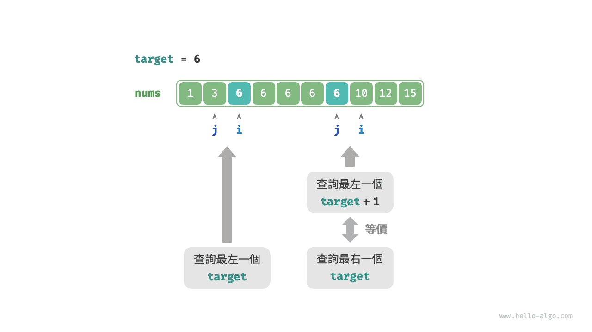
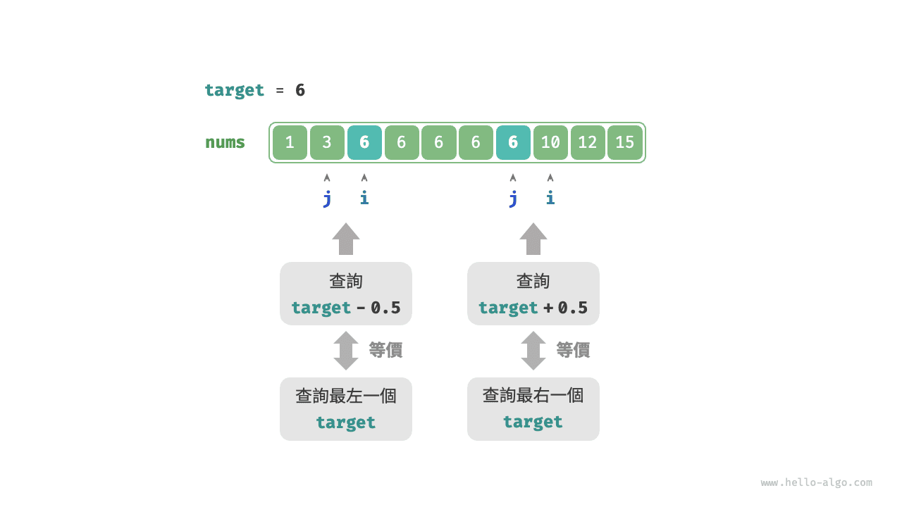

# 二分搜尋邊界

## 查詢左邊界

!!! question

    給定一個長度為 $n$ 的有序陣列 `nums` ，其中可能包含重複元素。請返回陣列中最左一個元素 `target` 的索引。若陣列中不包含該元素，則返回 $-1$ 。

回憶二分搜尋插入點的方法，搜尋完成後 $i$ 指向最左一個 `target` ，**因此查詢插入點本質上是在查詢最左一個 `target` 的索引**。

考慮透過查詢插入點的函式實現查詢左邊界。請注意，陣列中可能不包含 `target` ，這種情況可能導致以下兩種結果。

- 插入點的索引 $i$ 越界。
- 元素 `nums[i]` 與 `target` 不相等。

當遇到以上兩種情況時，直接返回 $-1$ 即可。程式碼如下所示：

```src
[file]{binary_search_edge}-[class]{}-[func]{binary_search_left_edge}
```

## 查詢右邊界

那麼如何查詢最右一個 `target` 呢？最直接的方式是修改程式碼，替換在 `nums[m] == target` 情況下的指標收縮操作。程式碼在此省略，有興趣的讀者可以自行實現。

下面我們介紹兩種更加取巧的方法。

### 複用查詢左邊界

實際上，我們可以利用查詢最左元素的函式來查詢最右元素，具體方法為：**將查詢最右一個 `target` 轉化為查詢最左一個 `target + 1`**。

如下圖所示，查詢完成後，指標 $i$ 指向最左一個 `target + 1`（如果存在），而 $j$ 指向最右一個 `target` ，**因此返回 $j$ 即可**。



請注意，返回的插入點是 $i$ ，因此需要將其減 $1$ ，從而獲得 $j$ ：

```src
[file]{binary_search_edge}-[class]{}-[func]{binary_search_right_edge}
```

### 轉化為查詢元素

我們知道，當陣列不包含 `target` 時，最終 $i$ 和 $j$ 會分別指向首個大於、小於 `target` 的元素。

因此，如下圖所示，我們可以構造一個陣列中不存在的元素，用於查詢左右邊界。

- 查詢最左一個 `target` ：可以轉化為查詢 `target - 0.5` ，並返回指標 $i$ 。
- 查詢最右一個 `target` ：可以轉化為查詢 `target + 0.5` ，並返回指標 $j$ 。



程式碼在此省略，以下兩點值得注意。

- 給定陣列不包含小數，這意味著我們無須關心如何處理相等的情況。
- 因為該方法引入了小數，所以需要將函式中的變數 `target` 改為浮點數型別（Python 無須改動）。
