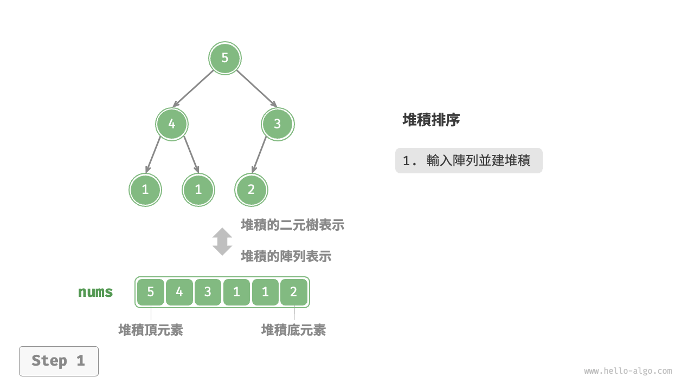
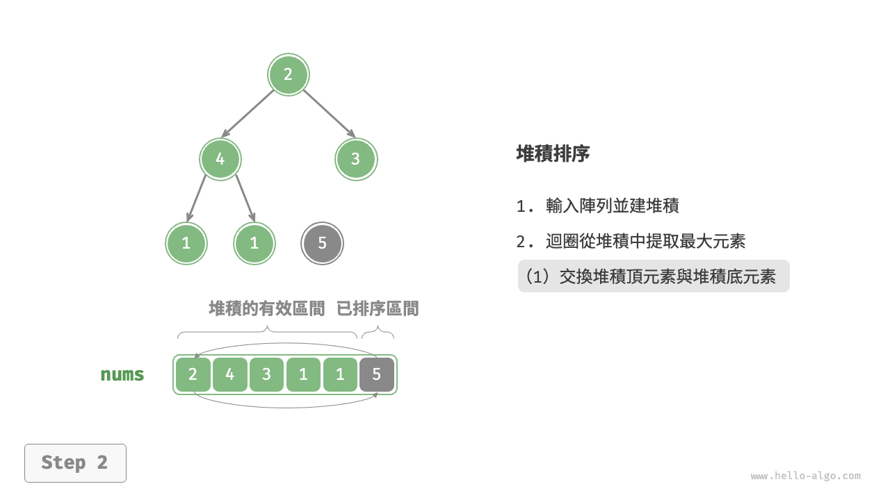
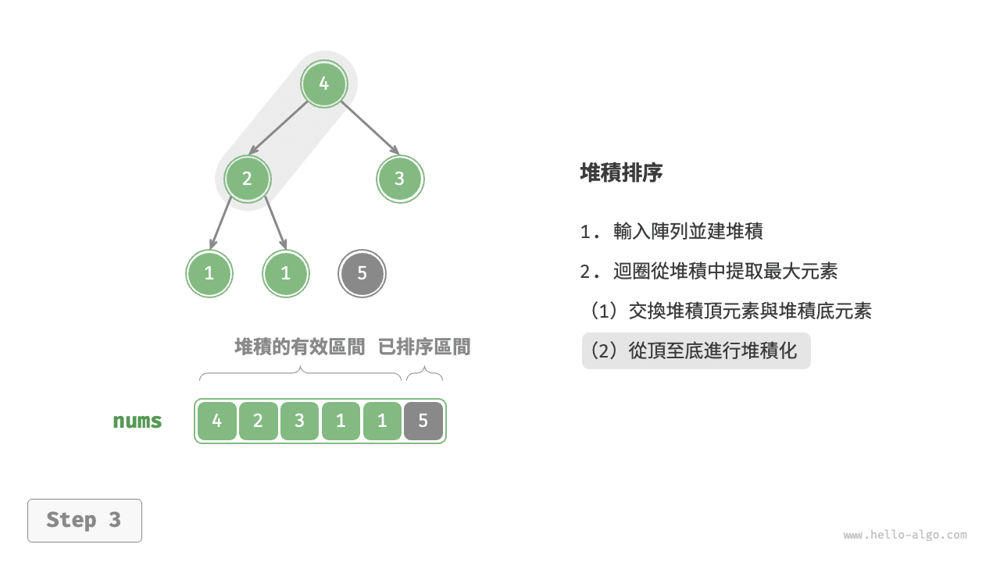
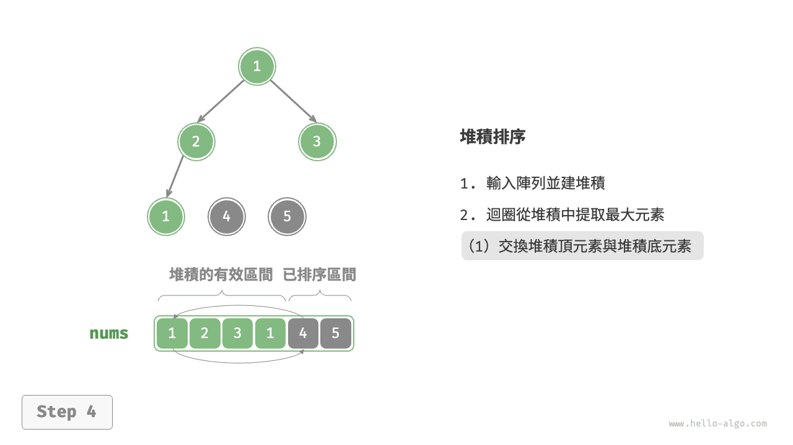
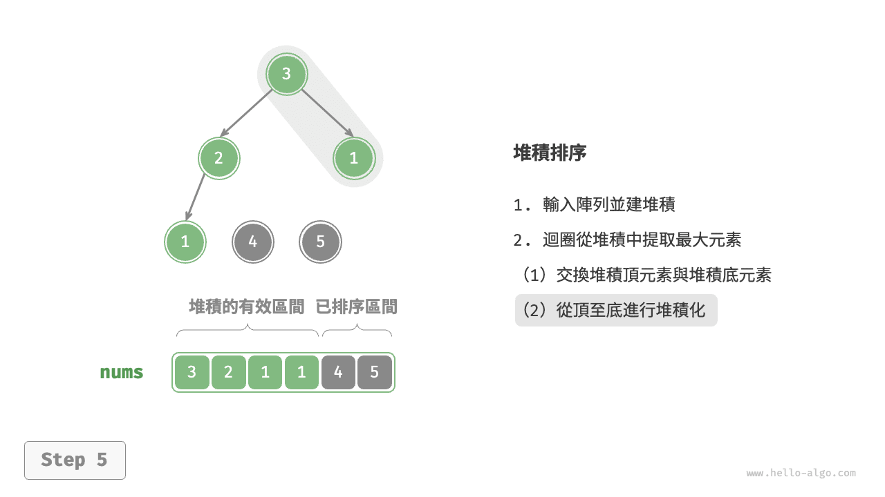
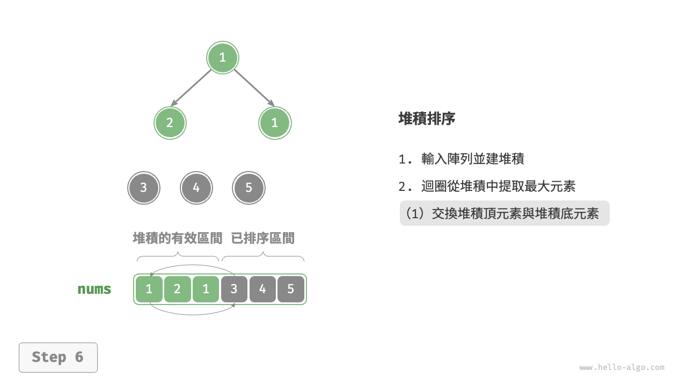
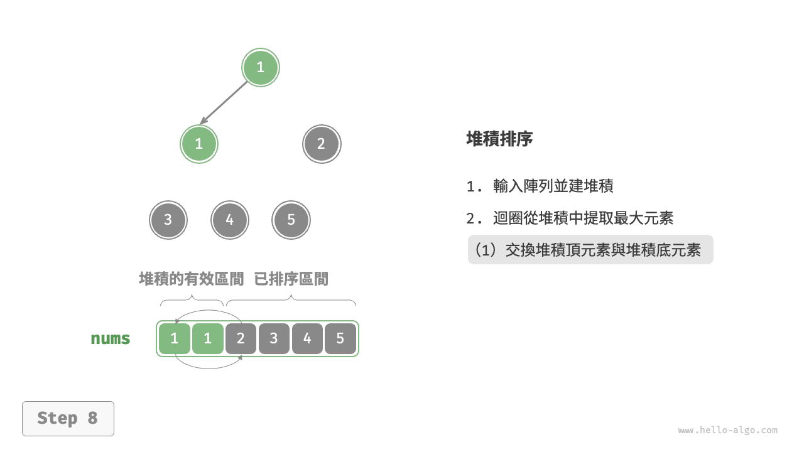
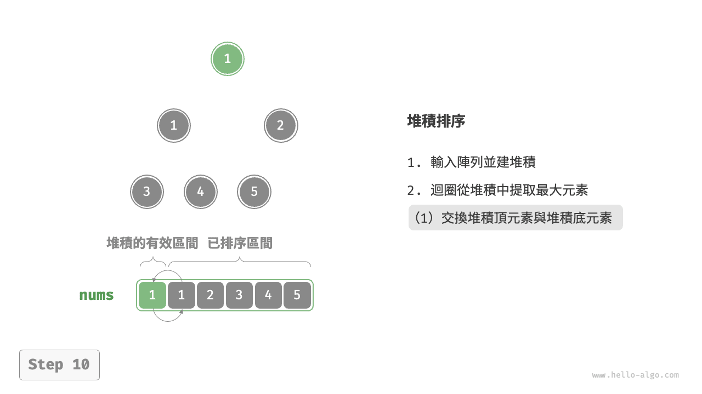
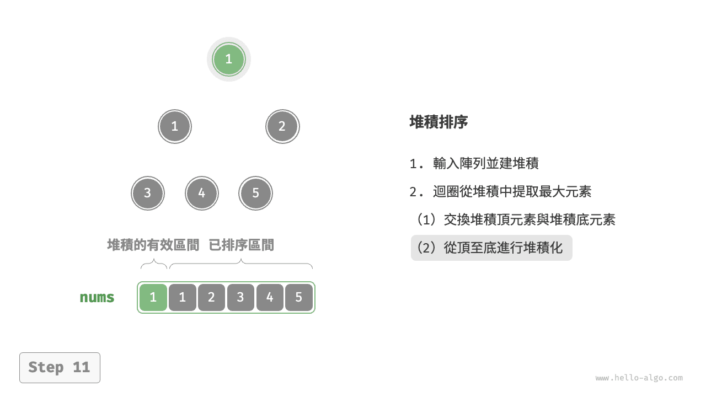
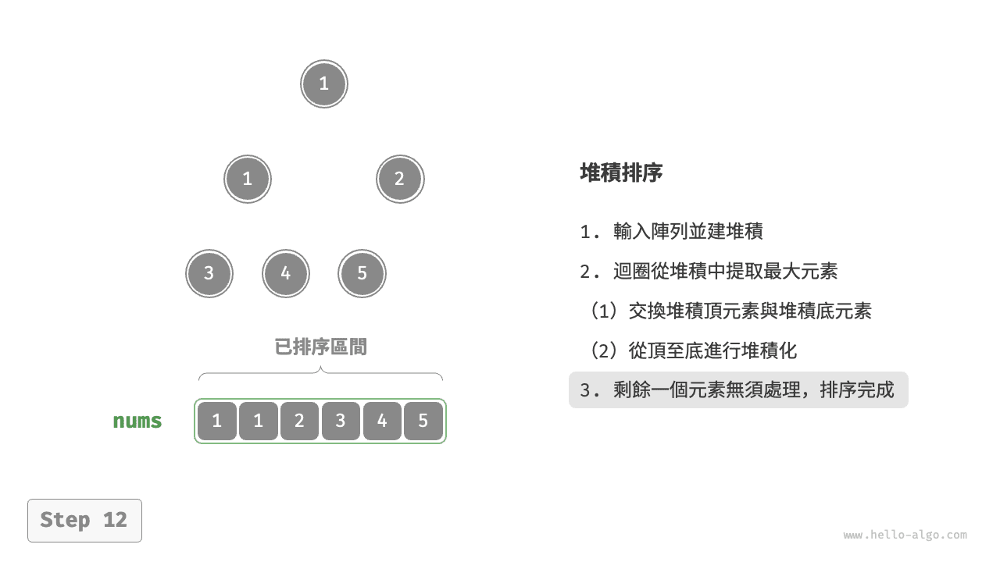

# 堆積排序

!!! tip

    閱讀本節前，請確保已學完“堆積”章節。

<u>堆積排序（heap sort）</u>是一種基於堆積資料結構實現的高效排序演算法。我們可以利用已經學過的“建堆積操作”和“元素出堆積操作”實現堆積排序。

1. 輸入陣列並建立小頂堆積，此時最小元素位於堆積頂。
2. 不斷執行出堆積操作，依次記錄出堆積元素，即可得到從小到大排序的序列。

以上方法雖然可行，但需要藉助一個額外陣列來儲存彈出的元素，比較浪費空間。在實際中，我們通常使用一種更加優雅的實現方式。

## 演算法流程

設陣列的長度為 $n$ ，堆積排序的流程如下圖所示。

1. 輸入陣列並建立大頂堆積。完成後，最大元素位於堆積頂。
2. 將堆積頂元素（第一個元素）與堆積底元素（最後一個元素）交換。完成交換後，堆積的長度減 $1$ ，已排序元素數量加 $1$ 。
3. 從堆積頂元素開始，從頂到底執行堆積化操作（sift down）。完成堆積化後，堆積的性質得到修復。
4. 迴圈執行第 `2.` 步和第 `3.` 步。迴圈 $n - 1$ 輪後，即可完成陣列排序。

!!! tip

    實際上，元素出堆積操作中也包含第 `2.` 步和第 `3.` 步，只是多了一個彈出元素的步驟。

=== "<1>"
    

=== "<2>"
    

=== "<3>"
    

=== "<4>"
    

=== "<5>"
    

=== "<6>"
    

=== "<7>"
    

=== "<8>"
    

=== "<9>"
    

=== "<10>"
    

=== "<11>"
    

=== "<12>"
    

在程式碼實現中，我們使用了與“堆積”章節相同的從頂至底堆積化 `sift_down()` 函式。值得注意的是，由於堆積的長度會隨著提取最大元素而減小，因此我們需要給 `sift_down()` 函式新增一個長度參數 $n$ ，用於指定堆積的當前有效長度。程式碼如下所示：

```src
[file]{heap_sort}-[class]{}-[func]{heap_sort}
```

## 演算法特性

- **時間複雜度為 $O(n \log n)$、非自適應排序**：建堆積操作使用 $O(n)$ 時間。從堆積中提取最大元素的時間複雜度為 $O(\log n)$ ，共迴圈 $n - 1$ 輪。
- **空間複雜度為 $O(1)$、原地排序**：幾個指標變數使用 $O(1)$ 空間。元素交換和堆積化操作都是在原陣列上進行的。
- **非穩定排序**：在交換堆積頂元素和堆積底元素時，相等元素的相對位置可能發生變化。
