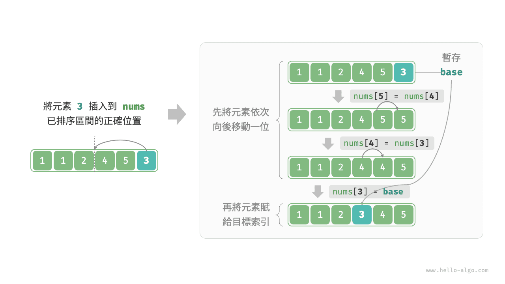
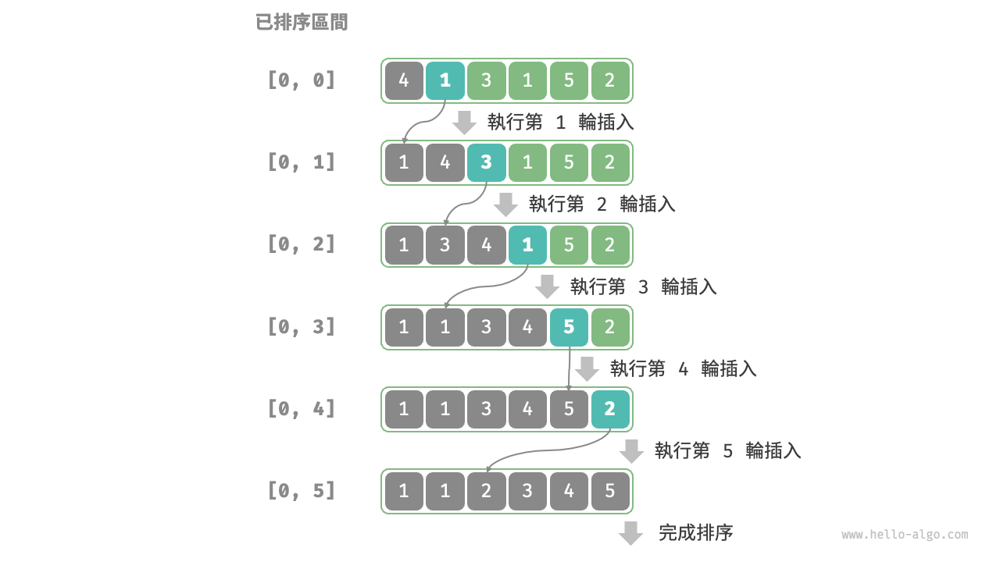

# 插入排序

<u>插入排序（insertion sort）</u>是一種簡單的排序演算法，它的工作原理與手動整理一副牌的過程非常相似。

具體來說，我們在未排序區間選擇一個基準元素，將該元素與其左側已排序區間的元素逐一比較大小，並將該元素插入到正確的位置。

下圖展示了陣列插入元素的操作流程。設基準元素為 `base` ，我們需要將從目標索引到 `base` 之間的所有元素向右移動一位，然後將 `base` 賦值給目標索引。



## 演算法流程

插入排序的整體流程如下圖所示。

1. 初始狀態下，陣列的第 1 個元素已完成排序。
2. 選取陣列的第 2 個元素作為 `base` ，將其插入到正確位置後，**陣列的前 2 個元素已排序**。
3. 選取第 3 個元素作為 `base` ，將其插入到正確位置後，**陣列的前 3 個元素已排序**。
4. 以此類推，在最後一輪中，選取最後一個元素作為 `base` ，將其插入到正確位置後，**所有元素均已排序**。



示例程式碼如下：

```src
[file]{insertion_sort}-[class]{}-[func]{insertion_sort}
```

## 演算法特性

- **時間複雜度為 $O(n^2)$、自適應排序**：在最差情況下，每次插入操作分別需要迴圈 $n - 1$、$n-2$、$\dots$、$2$、$1$ 次，求和得到 $(n - 1) n / 2$ ，因此時間複雜度為 $O(n^2)$ 。在遇到有序資料時，插入操作會提前終止。當輸入陣列完全有序時，插入排序達到最佳時間複雜度 $O(n)$ 。
- **空間複雜度為 $O(1)$、原地排序**：指標 $i$ 和 $j$ 使用常數大小的額外空間。
- **穩定排序**：在插入操作過程中，我們會將元素插入到相等元素的右側，不會改變它們的順序。

## 插入排序的優勢

插入排序的時間複雜度為 $O(n^2)$ ，而我們即將學習的快速排序的時間複雜度為 $O(n \log n)$ 。儘管插入排序的時間複雜度更高，**但在資料量較小的情況下，插入排序通常更快**。

這個結論與線性查詢和二分搜尋的適用情況的結論類似。快速排序這類 $O(n \log n)$ 的演算法屬於基於分治策略的排序演算法，往往包含更多單元計算操作。而在資料量較小時，$n^2$ 和 $n \log n$ 的數值比較接近，複雜度不佔主導地位，每輪中的單元操作數量起到決定性作用。

實際上，許多程式語言（例如 Java）的內建排序函式採用了插入排序，大致思路為：對於長陣列，採用基於分治策略的排序演算法，例如快速排序；對於短陣列，直接使用插入排序。

雖然泡沫排序、選擇排序和插入排序的時間複雜度都為 $O(n^2)$ ，但在實際情況中，**插入排序的使用頻率顯著高於泡沫排序和選擇排序**，主要有以下原因。

- 泡沫排序基於元素交換實現，需要藉助一個臨時變數，共涉及 3 個單元操作；插入排序基於元素賦值實現，僅需 1 個單元操作。因此，**泡沫排序的計算開銷通常比插入排序更高**。
- 選擇排序在任何情況下的時間複雜度都為 $O(n^2)$ 。**如果給定一組部分有序的資料，插入排序通常比選擇排序效率更高**。
- 選擇排序不穩定，無法應用於多級排序。
