# 合併排序

<u>合併排序（merge sort）</u>是一種基於分治策略的排序演算法，包含下圖所示的“劃分”和“合併”階段。

1. **劃分階段**：透過遞迴不斷地將陣列從中點處分開，將長陣列的排序問題轉換為短陣列的排序問題。
2. **合併階段**：當子陣列長度為 1 時終止劃分，開始合併，持續地將左右兩個較短的有序陣列合併為一個較長的有序陣列，直至結束。

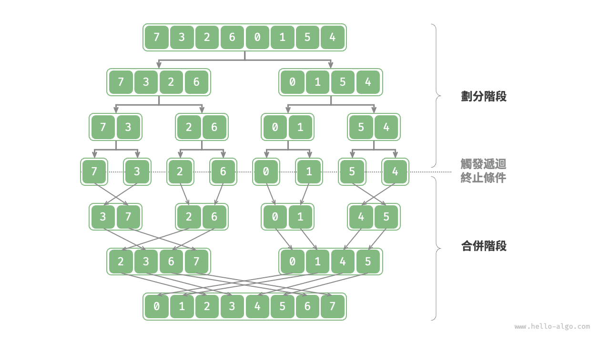

## 演算法流程

如下圖所示，“劃分階段”從頂至底遞迴地將陣列從中點切分為兩個子陣列。

1. 計算陣列中點 `mid` ，遞迴劃分左子陣列（區間 `[left, mid]` ）和右子陣列（區間 `[mid + 1, right]` ）。
2. 遞迴執行步驟 `1.` ，直至子陣列區間長度為 1 時終止。

“合併階段”從底至頂地將左子陣列和右子陣列合併為一個有序陣列。需要注意的是，從長度為 1 的子陣列開始合併，合併階段中的每個子陣列都是有序的。

=== "<1>"
    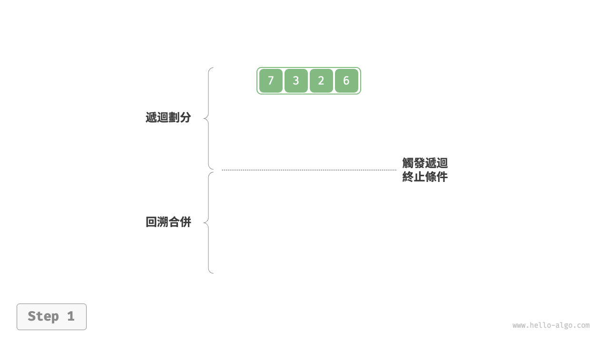

=== "<2>"
    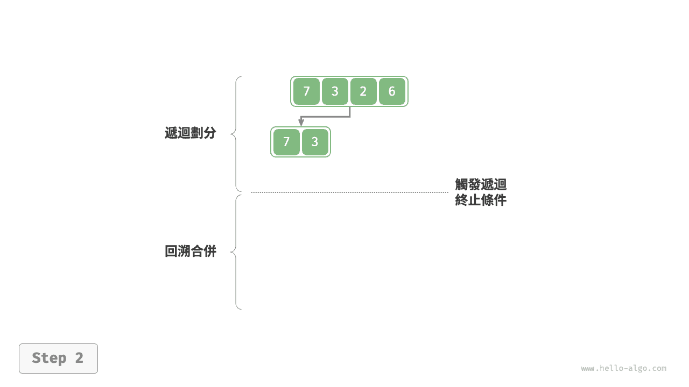

=== "<3>"
    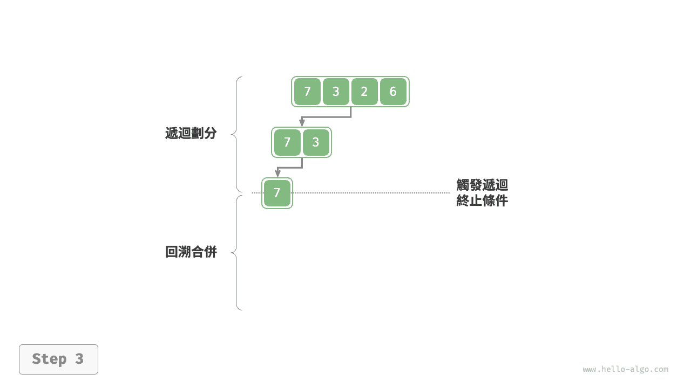

=== "<4>"
    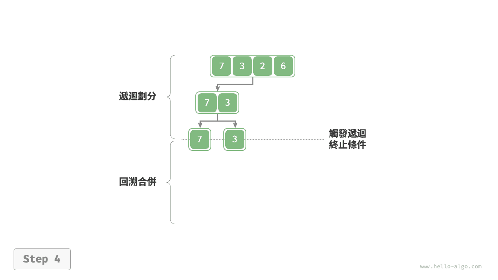

=== "<5>"
    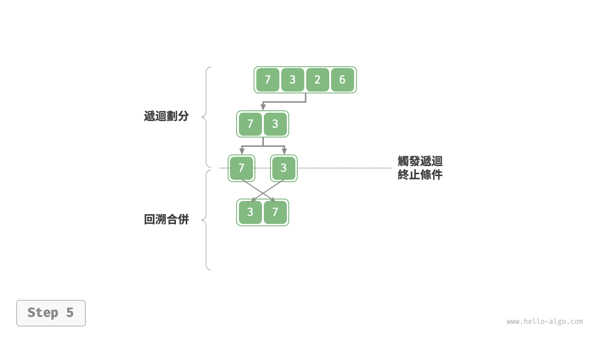

=== "<6>"
    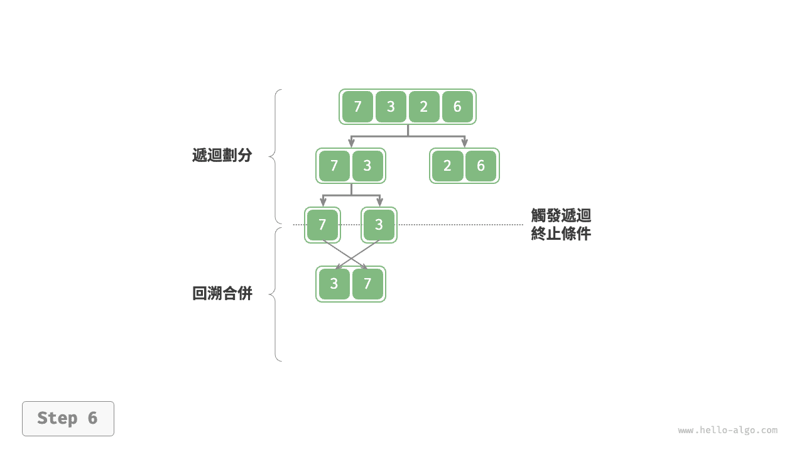

=== "<7>"
    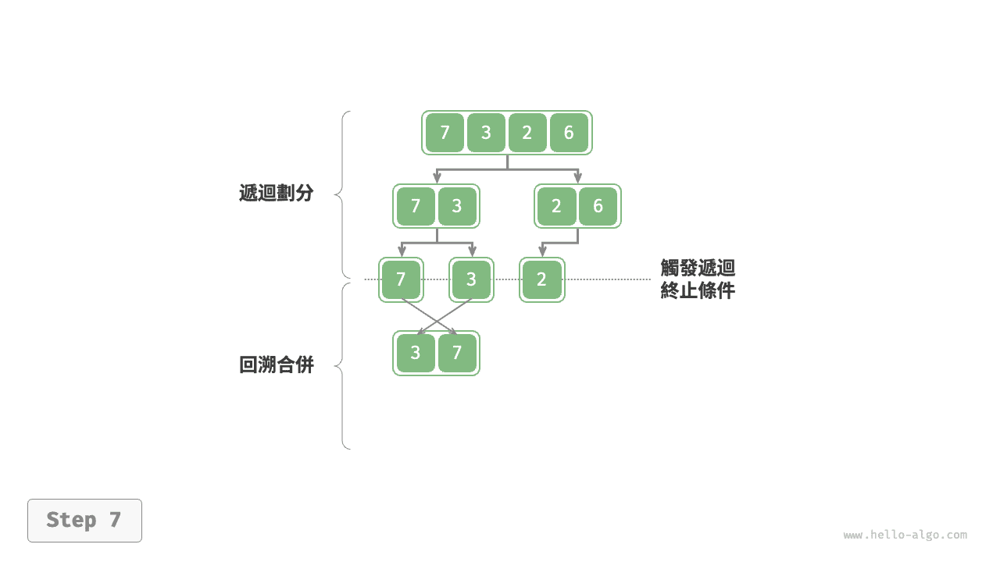

=== "<8>"
    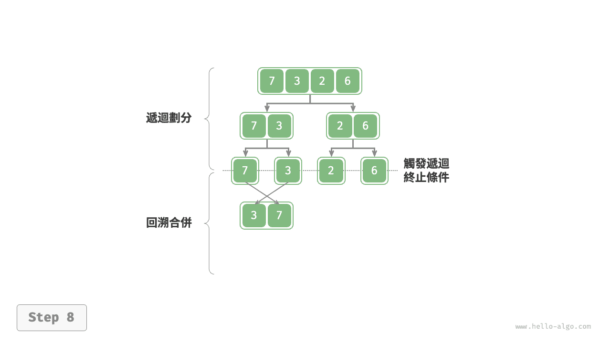

=== "<9>"
    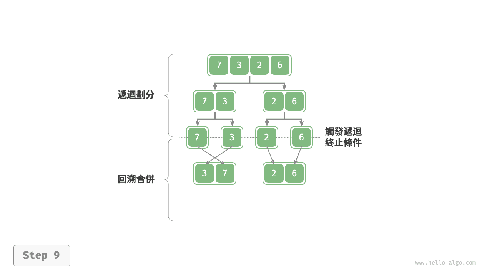

=== "<10>"
    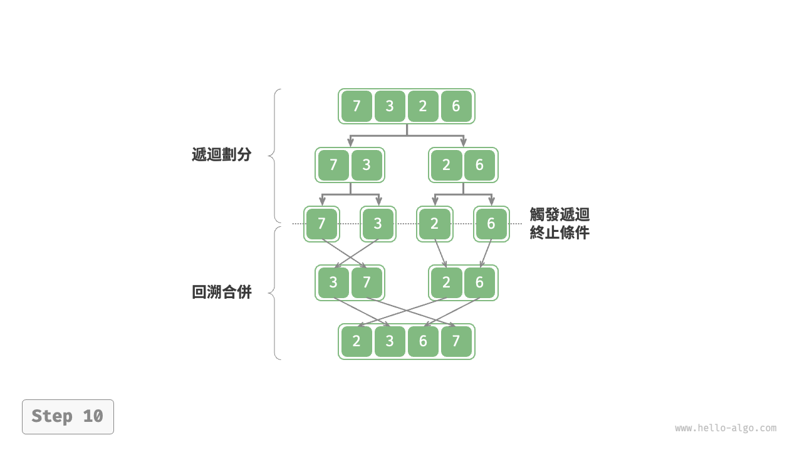

觀察發現，合併排序與二元樹後序走訪的遞迴順序是一致的。

- **後序走訪**：先遞迴左子樹，再遞迴右子樹，最後處理根節點。
- **合併排序**：先遞迴左子陣列，再遞迴右子陣列，最後處理合併。

合併排序的實現如以下程式碼所示。請注意，`nums` 的待合併區間為 `[left, right]` ，而 `tmp` 的對應區間為 `[0, right - left]` 。

```src
[file]{merge_sort}-[class]{}-[func]{merge_sort}
```

## 演算法特性

- **時間複雜度為 $O(n \log n)$、非自適應排序**：劃分產生高度為 $\log n$ 的遞迴樹，每層合併的總操作數量為 $n$ ，因此總體時間複雜度為 $O(n \log n)$ 。
- **空間複雜度為 $O(n)$、非原地排序**：遞迴深度為 $\log n$ ，使用 $O(\log n)$ 大小的堆疊幀空間。合併操作需要藉助輔助陣列實現，使用 $O(n)$ 大小的額外空間。
- **穩定排序**：在合併過程中，相等元素的次序保持不變。

## 鏈結串列排序

對於鏈結串列，合併排序相較於其他排序演算法具有顯著優勢，**可以將鏈結串列排序任務的空間複雜度最佳化至 $O(1)$** 。

- **劃分階段**：可以使用“迭代”替代“遞迴”來實現鏈結串列劃分工作，從而省去遞迴使用的堆疊幀空間。
- **合併階段**：在鏈結串列中，節點增刪操作僅需改變引用（指標）即可實現，因此合併階段（將兩個短有序鏈結串列合併為一個長有序鏈結串列）無須建立額外鏈結串列。

具體實現細節比較複雜，有興趣的讀者可以查閱相關資料進行學習。
