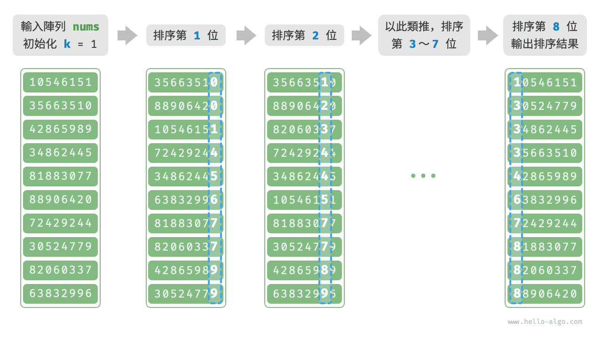

# 基數排序

上一節介紹了計數排序，它適用於資料量 $n$ 較大但資料範圍 $m$ 較小的情況。假設我們需要對 $n = 10^6$ 個學號進行排序，而學號是一個 $8$ 位數字，這意味著資料範圍 $m = 10^8$ 非常大，使用計數排序需要分配大量記憶體空間，而基數排序可以避免這種情況。

<u>基數排序（radix sort）</u>的核心思想與計數排序一致，也透過統計個數來實現排序。在此基礎上，基數排序利用數字各位之間的遞進關係，依次對每一位進行排序，從而得到最終的排序結果。

## 演算法流程

以學號資料為例，假設數字的最低位是第 $1$ 位，最高位是第 $8$ 位，基數排序的流程如下圖所示。

1. 初始化位數 $k = 1$ 。
2. 對學號的第 $k$ 位執行“計數排序”。完成後，資料會根據第 $k$ 位從小到大排序。
3. 將 $k$ 增加 $1$ ，然後返回步驟 `2.` 繼續迭代，直到所有位都排序完成後結束。



下面剖析程式碼實現。對於一個 $d$ 進位制的數字 $x$ ，要獲取其第 $k$ 位 $x_k$ ，可以使用以下計算公式：

$$
x_k = \lfloor\frac{x}{d^{k-1}}\rfloor \bmod d
$$

其中 $\lfloor a \rfloor$ 表示對浮點數 $a$ 向下取整，而 $\bmod \: d$ 表示對 $d$ 取模（取餘）。對於學號資料，$d = 10$ 且 $k \in [1, 8]$ 。

此外，我們需要小幅改動計數排序程式碼，使之可以根據數字的第 $k$ 位進行排序：

```src
[file]{radix_sort}-[class]{}-[func]{radix_sort}
```

!!! question "為什麼從最低位開始排序？"

    在連續的排序輪次中，後一輪排序會覆蓋前一輪排序的結果。舉例來說，如果第一輪排序結果 $a < b$ ，而第二輪排序結果 $a > b$ ，那麼第二輪的結果將取代第一輪的結果。由於數字的高位優先順序高於低位，因此應該先排序低位再排序高位。

## 演算法特性

相較於計數排序，基數排序適用於數值範圍較大的情況，**但前提是資料必須可以表示為固定位數的格式，且位數不能過大**。例如，浮點數不適合使用基數排序，因為其位數 $k$ 過大，可能導致時間複雜度 $O(nk) \gg O(n^2)$ 。

- **時間複雜度為 $O(nk)$、非自適應排序**：設資料量為 $n$、資料為 $d$ 進位制、最大位數為 $k$ ，則對某一位執行計數排序使用 $O(n + d)$ 時間，排序所有 $k$ 位使用 $O((n + d)k)$ 時間。通常情況下，$d$ 和 $k$ 都相對較小，時間複雜度趨向 $O(n)$ 。
- **空間複雜度為 $O(n + d)$、非原地排序**：與計數排序相同，基數排序需要藉助長度為 $n$ 和 $d$ 的陣列 `res` 和 `counter` 。
- **穩定排序**：當計數排序穩定時，基數排序也穩定；當計數排序不穩定時，基數排序無法保證得到正確的排序結果。
