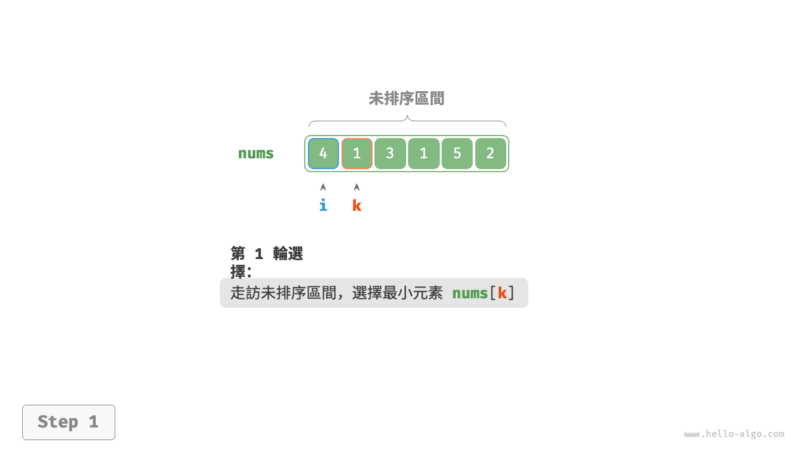
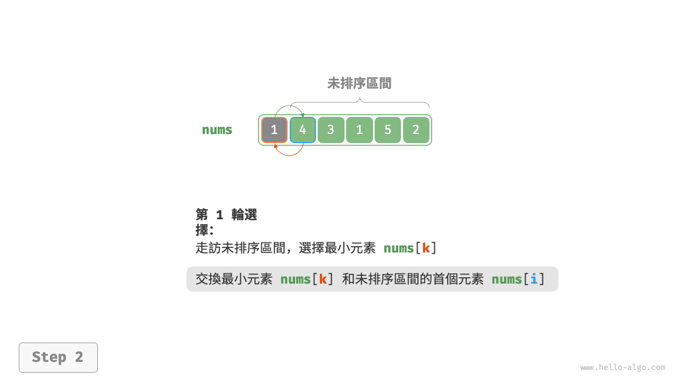
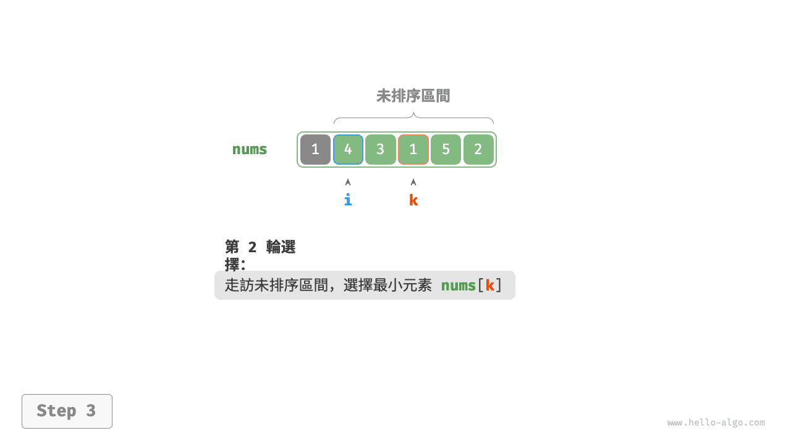
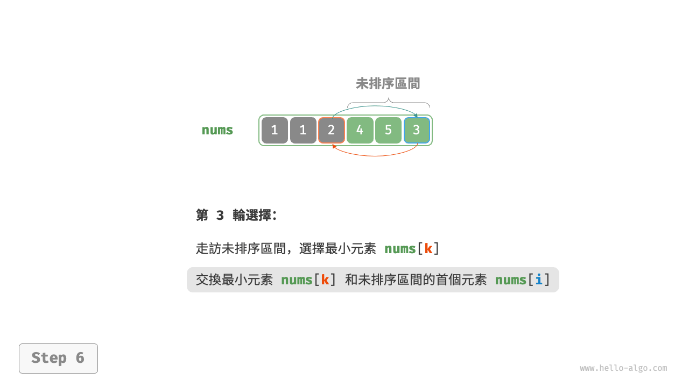
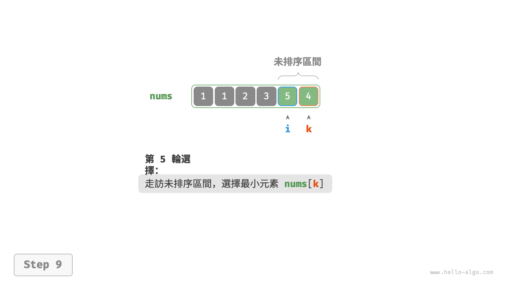
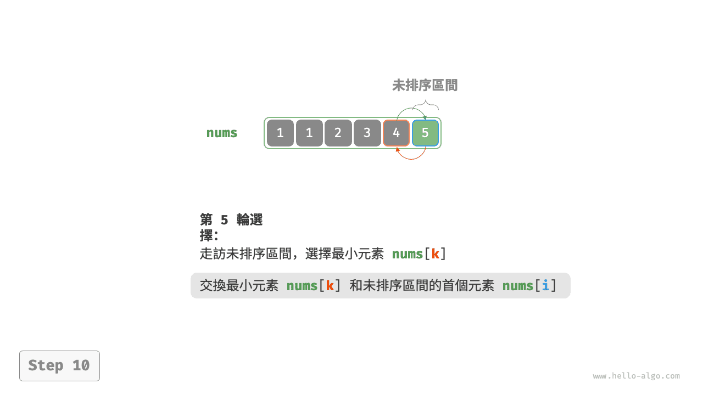
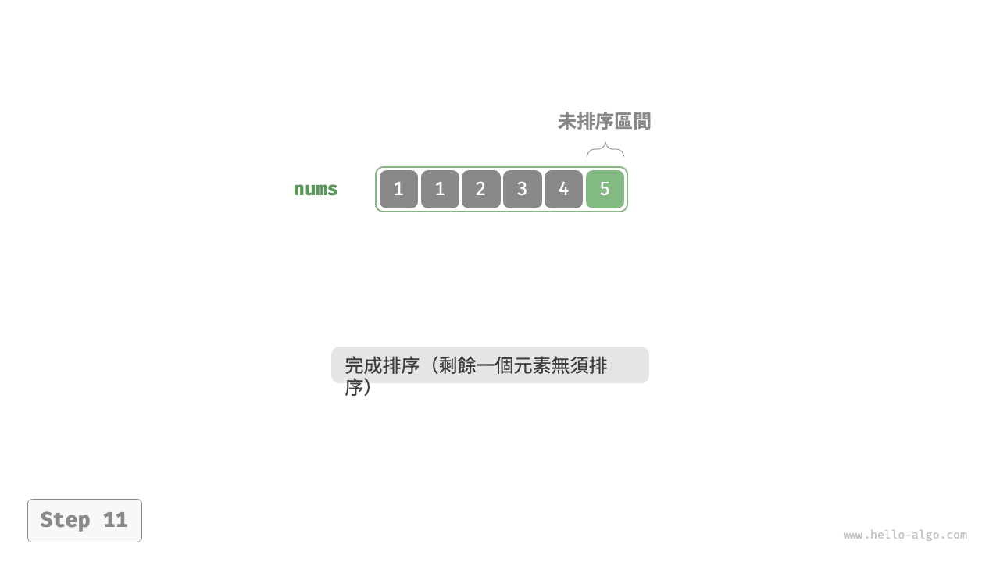
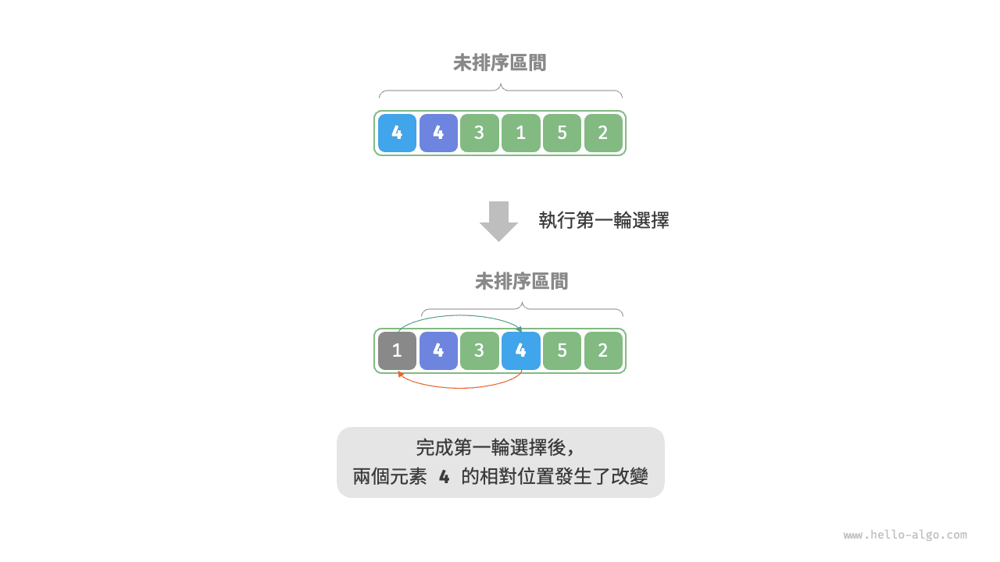

# 選擇排序

<u>選擇排序（selection sort）</u>的工作原理非常簡單：開啟一個迴圈，每輪從未排序區間選擇最小的元素，將其放到已排序區間的末尾。

設陣列的長度為 $n$ ，選擇排序的演算法流程如下圖所示。

1. 初始狀態下，所有元素未排序，即未排序（索引）區間為 $[0, n-1]$ 。
2. 選取區間 $[0, n-1]$ 中的最小元素，將其與索引 $0$ 處的元素交換。完成後，陣列前 1 個元素已排序。
3. 選取區間 $[1, n-1]$ 中的最小元素，將其與索引 $1$ 處的元素交換。完成後，陣列前 2 個元素已排序。
4. 以此類推。經過 $n - 1$ 輪選擇與交換後，陣列前 $n - 1$ 個元素已排序。
5. 僅剩的一個元素必定是最大元素，無須排序，因此陣列排序完成。

=== "<1>"
    

=== "<2>"
    

=== "<3>"
    

=== "<4>"
    

=== "<5>"
    

=== "<6>"
    

=== "<7>"
    

=== "<8>"
    

=== "<9>"
    

=== "<10>"
    

=== "<11>"
    

在程式碼中，我們用 $k$ 來記錄未排序區間內的最小元素：

```src
[file]{selection_sort}-[class]{}-[func]{selection_sort}
```

## 演算法特性

- **時間複雜度為 $O(n^2)$、非自適應排序**：外迴圈共 $n - 1$ 輪，第一輪的未排序區間長度為 $n$ ，最後一輪的未排序區間長度為 $2$ ，即各輪外迴圈分別包含 $n$、$n - 1$、$\dots$、$3$、$2$ 輪內迴圈，求和為 $\frac{(n - 1)(n + 2)}{2}$ 。
- **空間複雜度為 $O(1)$、原地排序**：指標 $i$ 和 $j$ 使用常數大小的額外空間。
- **非穩定排序**：如下圖所示，元素 `nums[i]` 有可能被交換至與其相等的元素的右邊，導致兩者的相對順序發生改變。


