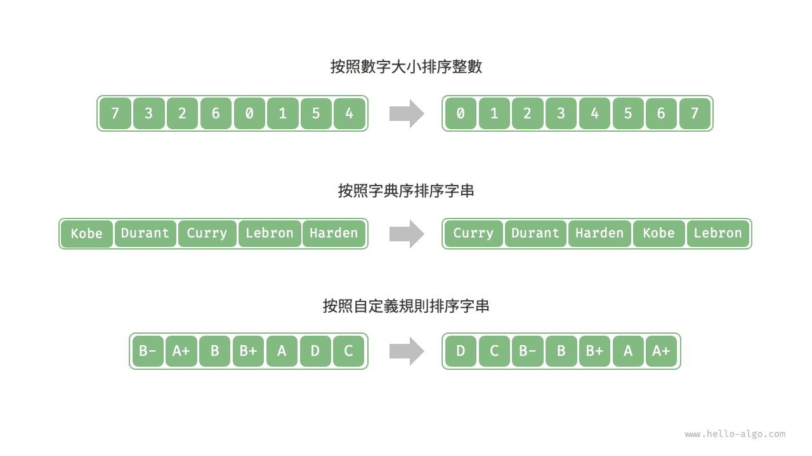

# 排序演算法

<u>排序演算法（sorting algorithm）</u>用於對一組資料按照特定順序進行排列。排序演算法有著廣泛的應用，因為有序資料通常能夠被更高效地查詢、分析和處理。

如下圖所示，排序演算法中的資料型別可以是整數、浮點數、字元或字串等。排序的判斷規則可根據需求設定，如數字大小、字元 ASCII 碼順序或自定義規則。



## 評價維度

**執行效率**：我們期望排序演算法的時間複雜度儘量低，且總體操作數量較少（時間複雜度中的常數項變小）。對於大資料量的情況，執行效率顯得尤為重要。

**就地性**：顧名思義，<u>原地排序</u>透過在原陣列上直接操作實現排序，無須藉助額外的輔助陣列，從而節省記憶體。通常情況下，原地排序的資料搬運操作較少，執行速度也更快。

**穩定性**：<u>穩定排序</u>在完成排序後，相等元素在陣列中的相對順序不發生改變。

穩定排序是多級排序場景的必要條件。假設我們有一個儲存學生資訊的表格，第 1 列和第 2 列分別是姓名和年齡。在這種情況下，<u>非穩定排序</u>可能導致輸入資料的有序性喪失：

```shell
# 輸入資料是按照姓名排序好的
# (name, age)
  ('A', 19)
  ('B', 18)
  ('C', 21)
  ('D', 19)
  ('E', 23)

# 假設使用非穩定排序演算法按年齡排序串列，
# 結果中 ('D', 19) 和 ('A', 19) 的相對位置改變，
# 輸入資料按姓名排序的性質丟失
  ('B', 18)
  ('D', 19)
  ('A', 19)
  ('C', 21)
  ('E', 23)
```

**自適應性**：<u>自適應排序</u>的時間複雜度會受輸入資料的影響，即最佳時間複雜度、最差時間複雜度、平均時間複雜度並不完全相等。

自適應性需要根據具體情況來評估。如果最差時間複雜度差於平均時間複雜度，說明排序演算法在某些資料下效能可能劣化，因此被視為負面屬性；而如果最佳時間複雜度優於平均時間複雜度，則被視為正面屬性。

**是否基於比較**：<u>基於比較的排序</u>依賴比較運算子（$<$、$=$、$>$）來判斷元素的相對順序，從而排序整個陣列，理論最優時間複雜度為 $O(n \log n)$ 。而<u>非比較排序</u>不使用比較運算子，時間複雜度可達 $O(n)$ ，但其通用性相對較差。

## 理想排序演算法

**執行快、原地、穩定、正向自適應、通用性好**。顯然，迄今為止尚未發現兼具以上所有特性的排序演算法。因此，在選擇排序演算法時，需要根據具體的資料特點和問題需求來決定。

接下來，我們將共同學習各種排序演算法，並基於上述評價維度對各個排序演算法的優缺點進行分析。
