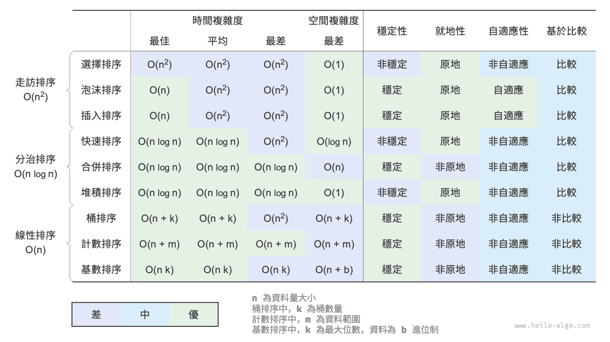

# 小結

### 重點回顧

- 泡沫排序透過交換相鄰元素來實現排序。透過新增一個標誌位來實現提前返回，我們可以將泡沫排序的最佳時間複雜度最佳化到 $O(n)$ 。
- 插入排序每輪將未排序區間內的元素插入到已排序區間的正確位置，從而完成排序。雖然插入排序的時間複雜度為 $O(n^2)$ ，但由於單元操作相對較少，因此在小資料量的排序任務中非常受歡迎。
- 快速排序基於哨兵劃分操作實現排序。在哨兵劃分中，有可能每次都選取到最差的基準數，導致時間複雜度劣化至 $O(n^2)$ 。引入中位數基準數或隨機基準數可以降低這種劣化的機率。尾遞迴方法可以有效地減少遞迴深度，將空間複雜度最佳化到 $O(\log n)$ 。
- 合併排序包括劃分和合並兩個階段，典型地體現了分治策略。在合併排序中，排序陣列需要建立輔助陣列，空間複雜度為 $O(n)$ ；然而排序鏈結串列的空間複雜度可以最佳化至 $O(1)$ 。
- 桶排序包含三個步驟：資料分桶、桶內排序和合並結果。它同樣體現了分治策略，適用於資料體量很大的情況。桶排序的關鍵在於對資料進行平均分配。
- 計數排序是桶排序的一個特例，它透過統計資料出現的次數來實現排序。計數排序適用於資料量大但資料範圍有限的情況，並且要求資料能夠轉換為正整數。
- 基數排序透過逐位排序來實現資料排序，要求資料能夠表示為固定位數的數字。
- 總的來說，我們希望找到一種排序演算法，具有高效率、穩定、原地以及正向自適應性等優點。然而，正如其他資料結構和演算法一樣，沒有一種排序演算法能夠同時滿足所有這些條件。在實際應用中，我們需要根據資料的特性來選擇合適的排序演算法。
- 下圖對比了主流排序演算法的效率、穩定性、就地性和自適應性等。

### Q & A

**Q**：排序演算法穩定性在什麼情況下是必需的？

在現實中，我們有可能基於物件的某個屬性進行排序。例如，學生有姓名和身高兩個屬性，我們希望實現一個多級排序：先按照姓名進行排序，得到 `(A, 180) (B, 185) (C, 170) (D, 170)` ；再對身高進行排序。由於排序演算法不穩定，因此可能得到 `(D, 170) (C, 170) (A, 180) (B, 185)` 。

可以發現，學生 D 和 C 的位置發生了交換，姓名的有序性被破壞了，而這是我們不希望看到的。

**Q**：哨兵劃分中“從右往左查詢”與“從左往右查詢”的順序可以交換嗎？

不行，當我們以最左端元素為基準數時，必須先“從右往左查詢”再“從左往右查詢”。這個結論有些反直覺，我們來剖析一下原因。

哨兵劃分 `partition()` 的最後一步是交換 `nums[left]` 和 `nums[i]` 。完成交換後，基準數左邊的元素都 `<=` 基準數，**這就要求最後一步交換前 `nums[left] >= nums[i]` 必須成立**。假設我們先“從左往右查詢”，那麼如果找不到比基準數更大的元素，**則會在 `i == j` 時跳出迴圈，此時可能 `nums[j] == nums[i] > nums[left]`**。也就是說，此時最後一步交換操作會把一個比基準數更大的元素交換至陣列最左端，導致哨兵劃分失敗。

舉個例子，給定陣列 `[0, 0, 0, 0, 1]` ，如果先“從左向右查詢”，哨兵劃分後陣列為 `[1, 0, 0, 0, 0]` ，這個結果是不正確的。

再深入思考一下，如果我們選擇 `nums[right]` 為基準數，那麼正好反過來，必須先“從左往右查詢”。

**Q**：關於尾遞迴最佳化，為什麼選短的陣列能保證遞迴深度不超過 $\log n$ ？

遞迴深度就是當前未返回的遞迴方法的數量。每輪哨兵劃分我們將原陣列劃分為兩個子陣列。在尾遞迴最佳化後，向下遞迴的子陣列長度最大為原陣列長度的一半。假設最差情況，一直為一半長度，那麼最終的遞迴深度就是 $\log n$ 。

回顧原始的快速排序，我們有可能會連續地遞迴長度較大的陣列，最差情況下為 $n$、$n - 1$、$\dots$、$2$、$1$ ，遞迴深度為 $n$ 。尾遞迴最佳化可以避免這種情況出現。

**Q**：當陣列中所有元素都相等時，快速排序的時間複雜度是 $O(n^2)$ 嗎？該如何處理這種退化情況？

是的。對於這種情況，可以考慮透過哨兵劃分將陣列劃分為三個部分：小於、等於、大於基準數。僅向下遞迴小於和大於的兩部分。在該方法下，輸入元素全部相等的陣列，僅一輪哨兵劃分即可完成排序。

**Q**：桶排序的最差時間複雜度為什麼是 $O(n^2)$ ？

最差情況下，所有元素被分至同一個桶中。如果我們採用一個 $O(n^2)$ 演算法來排序這些元素，則時間複雜度為 $O(n^2)$ 。
