# 雙向佇列

在佇列中，我們僅能刪除頭部元素或在尾部新增元素。如下圖所示，<u>雙向佇列（double-ended queue）</u>提供了更高的靈活性，允許在頭部和尾部執行元素的新增或刪除操作。

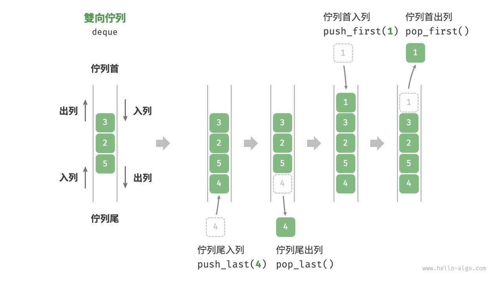

## 雙向佇列常用操作

雙向佇列的常用操作如下表所示，具體的方法名稱需要根據所使用的程式語言來確定。

<p align="center"> 表 <id> &nbsp; 雙向佇列操作效率 </p>

| 方法名         | 描述             | 時間複雜度 |
| -------------- | ---------------- | ---------- |
| `push_first()` | 將元素新增至佇列首 | $O(1)$     |
| `push_last()`  | 將元素新增至佇列尾 | $O(1)$     |
| `pop_first()`  | 刪除佇列首元素     | $O(1)$     |
| `pop_last()`   | 刪除佇列尾元素     | $O(1)$     |
| `peek_first()` | 訪問佇列首元素     | $O(1)$     |
| `peek_last()`  | 訪問佇列尾元素     | $O(1)$     |

同樣地，我們可以直接使用程式語言中已實現的雙向佇列類別：

=== "Python"

    ```python title="deque.py"
    from collections import deque

    # 初始化雙向佇列
    deque: deque[int] = deque()

    # 元素入列
    deque.append(2)      # 新增至佇列尾
    deque.append(5)
    deque.append(4)
    deque.appendleft(3)  # 新增至佇列首
    deque.appendleft(1)

    # 訪問元素
    front: int = deque[0]  # 佇列首元素
    rear: int = deque[-1]  # 佇列尾元素

    # 元素出列
    pop_front: int = deque.popleft()  # 佇列首元素出列
    pop_rear: int = deque.pop()       # 佇列尾元素出列

    # 獲取雙向佇列的長度
    size: int = len(deque)

    # 判斷雙向佇列是否為空
    is_empty: bool = len(deque) == 0
    ```

=== "C++"

    ```cpp title="deque.cpp"
    /* 初始化雙向佇列 */
    deque<int> deque;

    /* 元素入列 */
    deque.push_back(2);   // 新增至佇列尾
    deque.push_back(5);
    deque.push_back(4);
    deque.push_front(3);  // 新增至佇列首
    deque.push_front(1);

    /* 訪問元素 */
    int front = deque.front(); // 佇列首元素
    int back = deque.back();   // 佇列尾元素

    /* 元素出列 */
    deque.pop_front();  // 佇列首元素出列
    deque.pop_back();   // 佇列尾元素出列

    /* 獲取雙向佇列的長度 */
    int size = deque.size();

    /* 判斷雙向佇列是否為空 */
    bool empty = deque.empty();
    ```

=== "Java"

    ```java title="deque.java"
    /* 初始化雙向佇列 */
    Deque<Integer> deque = new LinkedList<>();

    /* 元素入列 */
    deque.offerLast(2);   // 新增至佇列尾
    deque.offerLast(5);
    deque.offerLast(4);
    deque.offerFirst(3);  // 新增至佇列首
    deque.offerFirst(1);

    /* 訪問元素 */
    int peekFirst = deque.peekFirst();  // 佇列首元素
    int peekLast = deque.peekLast();    // 佇列尾元素

    /* 元素出列 */
    int popFirst = deque.pollFirst();  // 佇列首元素出列
    int popLast = deque.pollLast();    // 佇列尾元素出列

    /* 獲取雙向佇列的長度 */
    int size = deque.size();

    /* 判斷雙向佇列是否為空 */
    boolean isEmpty = deque.isEmpty();
    ```

=== "C#"

    ```csharp title="deque.cs"
    /* 初始化雙向佇列 */
    // 在 C# 中，將鏈結串列 LinkedList 看作雙向佇列來使用
    LinkedList<int> deque = new();

    /* 元素入列 */
    deque.AddLast(2);   // 新增至佇列尾
    deque.AddLast(5);
    deque.AddLast(4);
    deque.AddFirst(3);  // 新增至佇列首
    deque.AddFirst(1);

    /* 訪問元素 */
    int peekFirst = deque.First.Value;  // 佇列首元素
    int peekLast = deque.Last.Value;    // 佇列尾元素

    /* 元素出列 */
    deque.RemoveFirst();  // 佇列首元素出列
    deque.RemoveLast();   // 佇列尾元素出列

    /* 獲取雙向佇列的長度 */
    int size = deque.Count;

    /* 判斷雙向佇列是否為空 */
    bool isEmpty = deque.Count == 0;
    ```

=== "Go"

    ```go title="deque_test.go"
    /* 初始化雙向佇列 */
    // 在 Go 中，將 list 作為雙向佇列使用
    deque := list.New()

    /* 元素入列 */
    deque.PushBack(2)      // 新增至佇列尾
    deque.PushBack(5)
    deque.PushBack(4)
    deque.PushFront(3)     // 新增至佇列首
    deque.PushFront(1)

    /* 訪問元素 */
    front := deque.Front() // 佇列首元素
    rear := deque.Back()   // 佇列尾元素

    /* 元素出列 */
    deque.Remove(front)    // 佇列首元素出列
    deque.Remove(rear)     // 佇列尾元素出列

    /* 獲取雙向佇列的長度 */
    size := deque.Len()

    /* 判斷雙向佇列是否為空 */
    isEmpty := deque.Len() == 0
    ```

=== "Swift"

    ```swift title="deque.swift"
    /* 初始化雙向佇列 */
    // Swift 沒有內建的雙向佇列類別，可以把 Array 當作雙向佇列來使用
    var deque: [Int] = []

    /* 元素入列 */
    deque.append(2) // 新增至佇列尾
    deque.append(5)
    deque.append(4)
    deque.insert(3, at: 0) // 新增至佇列首
    deque.insert(1, at: 0)

    /* 訪問元素 */
    let peekFirst = deque.first! // 佇列首元素
    let peekLast = deque.last! // 佇列尾元素

    /* 元素出列 */
    // 使用 Array 模擬時 popFirst 的複雜度為 O(n)
    let popFirst = deque.removeFirst() // 佇列首元素出列
    let popLast = deque.removeLast() // 佇列尾元素出列

    /* 獲取雙向佇列的長度 */
    let size = deque.count

    /* 判斷雙向佇列是否為空 */
    let isEmpty = deque.isEmpty
    ```

=== "JS"

    ```javascript title="deque.js"
    /* 初始化雙向佇列 */
    // JavaScript 沒有內建的雙端佇列，只能把 Array 當作雙端佇列來使用
    const deque = [];

    /* 元素入列 */
    deque.push(2);
    deque.push(5);
    deque.push(4);
    // 請注意，由於是陣列，unshift() 方法的時間複雜度為 O(n)
    deque.unshift(3);
    deque.unshift(1);

    /* 訪問元素 */
    const peekFirst = deque[0];
    const peekLast = deque[deque.length - 1];

    /* 元素出列 */
    // 請注意，由於是陣列，shift() 方法的時間複雜度為 O(n)
    const popFront = deque.shift();
    const popBack = deque.pop();

    /* 獲取雙向佇列的長度 */
    const size = deque.length;

    /* 判斷雙向佇列是否為空 */
    const isEmpty = size === 0;
    ```

=== "TS"

    ```typescript title="deque.ts"
    /* 初始化雙向佇列 */
    // TypeScript 沒有內建的雙端佇列，只能把 Array 當作雙端佇列來使用
    const deque: number[] = [];

    /* 元素入列 */
    deque.push(2);
    deque.push(5);
    deque.push(4);
    // 請注意，由於是陣列，unshift() 方法的時間複雜度為 O(n)
    deque.unshift(3);
    deque.unshift(1);

    /* 訪問元素 */
    const peekFirst: number = deque[0];
    const peekLast: number = deque[deque.length - 1];

    /* 元素出列 */
    // 請注意，由於是陣列，shift() 方法的時間複雜度為 O(n)
    const popFront: number = deque.shift() as number;
    const popBack: number = deque.pop() as number;

    /* 獲取雙向佇列的長度 */
    const size: number = deque.length;

    /* 判斷雙向佇列是否為空 */
    const isEmpty: boolean = size === 0;
    ```

=== "Dart"

    ```dart title="deque.dart"
    /* 初始化雙向佇列 */
    // 在 Dart 中，Queue 被定義為雙向佇列
    Queue<int> deque = Queue<int>();

    /* 元素入列 */
    deque.addLast(2);  // 新增至佇列尾
    deque.addLast(5);
    deque.addLast(4);
    deque.addFirst(3); // 新增至佇列首
    deque.addFirst(1);

    /* 訪問元素 */
    int peekFirst = deque.first; // 佇列首元素
    int peekLast = deque.last;   // 佇列尾元素

    /* 元素出列 */
    int popFirst = deque.removeFirst(); // 佇列首元素出列
    int popLast = deque.removeLast();   // 佇列尾元素出列

    /* 獲取雙向佇列的長度 */
    int size = deque.length;

    /* 判斷雙向佇列是否為空 */
    bool isEmpty = deque.isEmpty;
    ```

=== "Rust"

    ```rust title="deque.rs"
    /* 初始化雙向佇列 */
    let mut deque: VecDeque<u32> = VecDeque::new();

    /* 元素入列 */
    deque.push_back(2);  // 新增至佇列尾
    deque.push_back(5);
    deque.push_back(4);
    deque.push_front(3); // 新增至佇列首
    deque.push_front(1);

    /* 訪問元素 */
    if let Some(front) = deque.front() { // 佇列首元素
    }
    if let Some(rear) = deque.back() {   // 佇列尾元素
    }

    /* 元素出列 */
    if let Some(pop_front) = deque.pop_front() { // 佇列首元素出列
    }
    if let Some(pop_rear) = deque.pop_back() {   // 佇列尾元素出列
    }

    /* 獲取雙向佇列的長度 */
    let size = deque.len();

    /* 判斷雙向佇列是否為空 */
    let is_empty = deque.is_empty();
    ```

=== "C"

    ```c title="deque.c"
    // C 未提供內建雙向佇列
    ```

=== "Kotlin"

    ```kotlin title="deque.kt"
    /* 初始化雙向佇列 */
    val deque = LinkedList<Int>()

    /* 元素入列 */
    deque.offerLast(2)  // 新增至佇列尾
    deque.offerLast(5)
    deque.offerLast(4)
    deque.offerFirst(3) // 新增至佇列首
    deque.offerFirst(1)

    /* 訪問元素 */
    val peekFirst = deque.peekFirst() // 佇列首元素
    val peekLast = deque.peekLast()   // 佇列尾元素

    /* 元素出列 */
    val popFirst = deque.pollFirst() // 佇列首元素出列
    val popLast = deque.pollLast()   // 佇列尾元素出列

    /* 獲取雙向佇列的長度 */
    val size = deque.size

    /* 判斷雙向佇列是否為空 */
    val isEmpty = deque.isEmpty()
    ```

=== "Ruby"

    ```ruby title="deque.rb"
    # 初始化雙向佇列
    # Ruby 沒有內直的雙端佇列，只能把 Array 當作雙端佇列來使用
    deque = []

    # 元素如隊
    deque << 2
    deque << 5
    deque << 4
    # 請注意，由於是陣列，Array#unshift 方法的時間複雜度為 O(n)
    deque.unshift(3)
    deque.unshift(1)

    # 訪問元素
    peek_first = deque.first
    peek_last = deque.last

    # 元素出列
    # 請注意，由於是陣列， Array#shift 方法的時間複雜度為 O(n)
    pop_front = deque.shift
    pop_back = deque.pop

    # 獲取雙向佇列的長度
    size = deque.length

    # 判斷雙向佇列是否為空
    is_empty = size.zero?
    ```

=== "Zig"

    ```zig title="deque.zig"

    ```

??? pythontutor "視覺化執行"

    https://pythontutor.com/render.html#code=from%20collections%20import%20deque%0A%0A%22%22%22Driver%20Code%22%22%22%0Aif%20__name__%20%3D%3D%20%22__main__%22%3A%0A%20%20%20%20%23%20%E5%88%9D%E5%A7%8B%E5%8C%96%E9%9B%99%E5%90%91%E4%BD%87%E5%88%97%0A%20%20%20%20deq%20%3D%20deque%28%29%0A%0A%20%20%20%20%23%20%E5%85%83%E7%B4%A0%E5%85%A5%E5%88%97%0A%20%20%20%20deq.append%282%29%20%20%23%20%E6%96%B0%E5%A2%9E%E8%87%B3%E4%BD%87%E5%88%97%E5%B0%BE%0A%20%20%20%20deq.append%285%29%0A%20%20%20%20deq.append%284%29%0A%20%20%20%20deq.appendleft%283%29%20%20%23%20%E6%96%B0%E5%A2%9E%E8%87%B3%E4%BD%87%E5%88%97%E9%A6%96%0A%20%20%20%20deq.appendleft%281%29%0A%20%20%20%20print%28%22%E9%9B%99%E5%90%91%E4%BD%87%E5%88%97%20deque%20%3D%22%2C%20deq%29%0A%0A%20%20%20%20%23%20%E8%A8%AA%E5%95%8F%E5%85%83%E7%B4%A0%0A%20%20%20%20front%20%3D%20deq%5B0%5D%20%20%23%20%E4%BD%87%E5%88%97%E9%A6%96%E5%85%83%E7%B4%A0%0A%20%20%20%20print%28%22%E4%BD%87%E5%88%97%E9%A6%96%E5%85%83%E7%B4%A0%20front%20%3D%22%2C%20front%29%0A%20%20%20%20rear%20%3D%20deq%5B-1%5D%20%20%23%20%E4%BD%87%E5%88%97%E5%B0%BE%E5%85%83%E7%B4%A0%0A%20%20%20%20print%28%22%E4%BD%87%E5%88%97%E5%B0%BE%E5%85%83%E7%B4%A0%20rear%20%3D%22%2C%20rear%29%0A%0A%20%20%20%20%23%20%E5%85%83%E7%B4%A0%E5%87%BA%E5%88%97%0A%20%20%20%20pop_front%20%3D%20deq.popleft%28%29%20%20%23%20%E4%BD%87%E5%88%97%E9%A6%96%E5%85%83%E7%B4%A0%E5%87%BA%E5%88%97%0A%20%20%20%20print%28%22%E4%BD%87%E5%88%97%E9%A6%96%E5%87%BA%E5%88%97%E5%85%83%E7%B4%A0%20%20pop_front%20%3D%22%2C%20pop_front%29%0A%20%20%20%20print%28%22%E4%BD%87%E5%88%97%E9%A6%96%E5%87%BA%E5%88%97%E5%BE%8C%20deque%20%3D%22%2C%20deq%29%0A%20%20%20%20pop_rear%20%3D%20deq.pop%28%29%20%20%23%20%E4%BD%87%E5%88%97%E5%B0%BE%E5%85%83%E7%B4%A0%E5%87%BA%E5%88%97%0A%20%20%20%20print%28%22%E4%BD%87%E5%88%97%E5%B0%BE%E5%87%BA%E5%88%97%E5%85%83%E7%B4%A0%20%20pop_rear%20%3D%22%2C%20pop_rear%29%0A%20%20%20%20print%28%22%E4%BD%87%E5%88%97%E5%B0%BE%E5%87%BA%E5%88%97%E5%BE%8C%20deque%20%3D%22%2C%20deq%29%0A%0A%20%20%20%20%23%20%E7%8D%B2%E5%8F%96%E9%9B%99%E5%90%91%E4%BD%87%E5%88%97%E7%9A%84%E9%95%B7%E5%BA%A6%0A%20%20%20%20size%20%3D%20len%28deq%29%0A%20%20%20%20print%28%22%E9%9B%99%E5%90%91%E4%BD%87%E5%88%97%E9%95%B7%E5%BA%A6%20size%20%3D%22%2C%20size%29%0A%0A%20%20%20%20%23%20%E5%88%A4%E6%96%B7%E9%9B%99%E5%90%91%E4%BD%87%E5%88%97%E6%98%AF%E5%90%A6%E7%82%BA%E7%A9%BA%0A%20%20%20%20is_empty%20%3D%20len%28deq%29%20%3D%3D%200%0A%20%20%20%20print%28%22%E9%9B%99%E5%90%91%E4%BD%87%E5%88%97%E6%98%AF%E5%90%A6%E7%82%BA%E7%A9%BA%20%3D%22%2C%20is_empty%29&cumulative=false&curInstr=3&heapPrimitives=nevernest&mode=display&origin=opt-frontend.js&py=311&rawInputLstJSON=%5B%5D&textReferences=false

## 雙向佇列實現 *

雙向佇列的實現與佇列類似，可以選擇鏈結串列或陣列作為底層資料結構。

### 基於雙向鏈結串列的實現

回顧上一節內容，我們使用普通單向鏈結串列來實現佇列，因為它可以方便地刪除頭節點（對應出列操作）和在尾節點後新增新節點（對應入列操作）。

對於雙向佇列而言，頭部和尾部都可以執行入列和出列操作。換句話說，雙向佇列需要實現另一個對稱方向的操作。為此，我們採用“雙向鏈結串列”作為雙向佇列的底層資料結構。

如下圖所示，我們將雙向鏈結串列的頭節點和尾節點視為雙向佇列的佇列首和佇列尾，同時實現在兩端新增和刪除節點的功能。

=== "LinkedListDeque"
    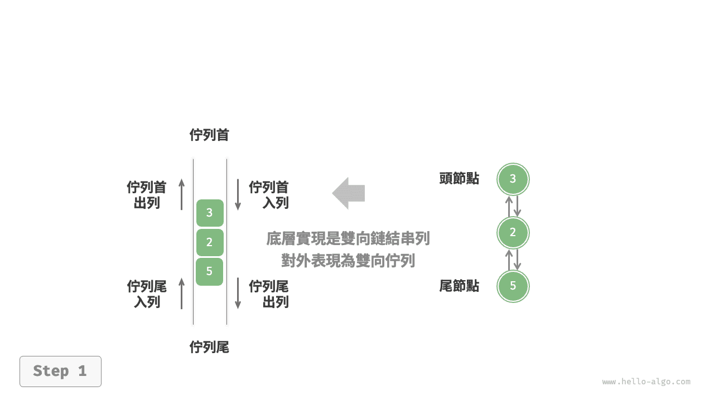

=== "push_last()"
    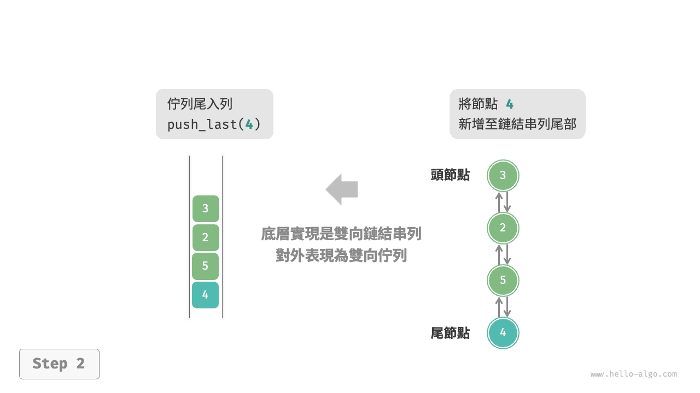

=== "push_first()"
    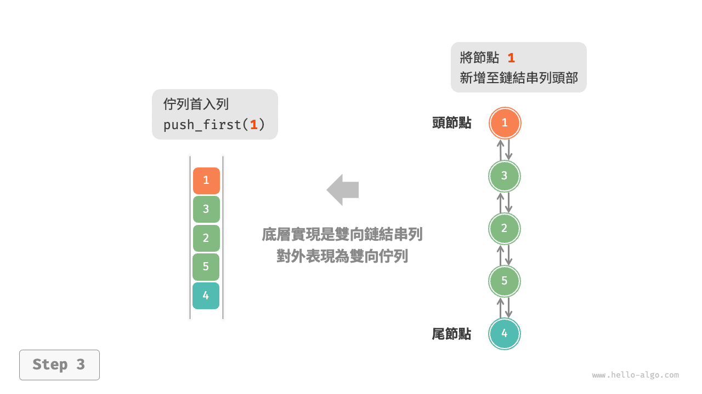

=== "pop_last()"
    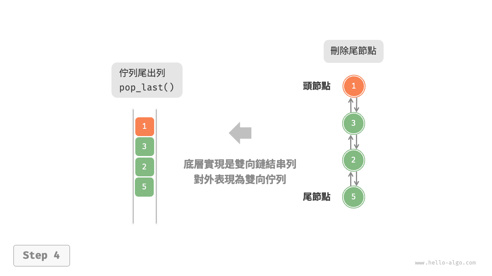

=== "pop_first()"
    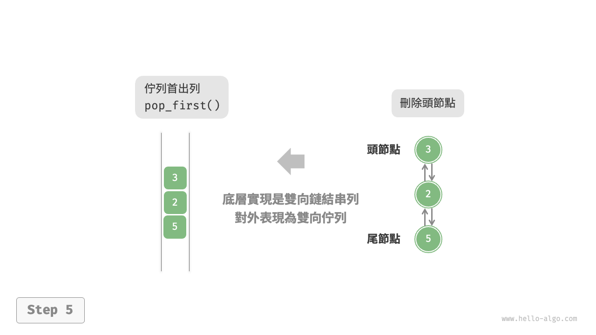

實現程式碼如下所示：

```src
[file]{linkedlist_deque}-[class]{linked_list_deque}-[func]{}
```

### 基於陣列的實現

如下圖所示，與基於陣列實現佇列類似，我們也可以使用環形陣列來實現雙向佇列。

=== "ArrayDeque"
    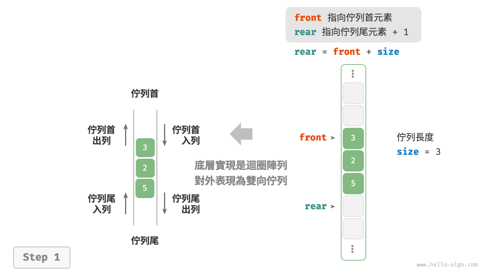

=== "push_last()"
    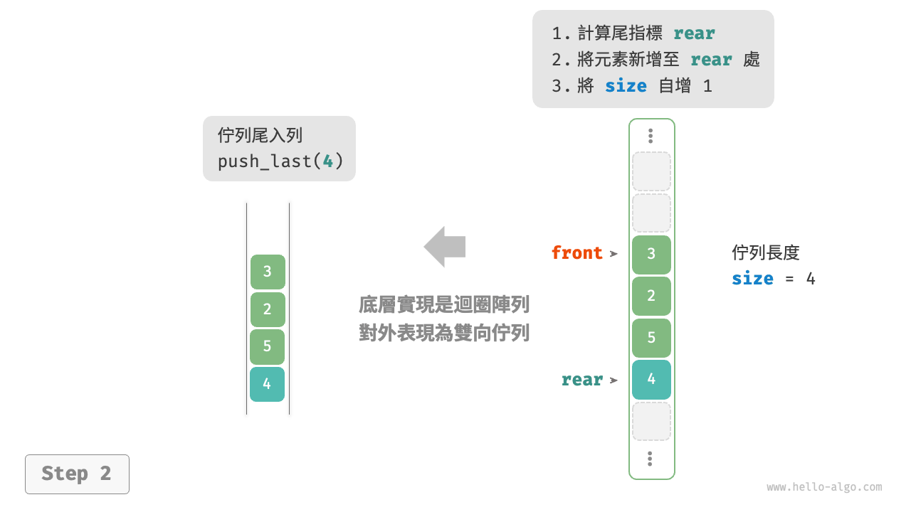

=== "push_first()"
    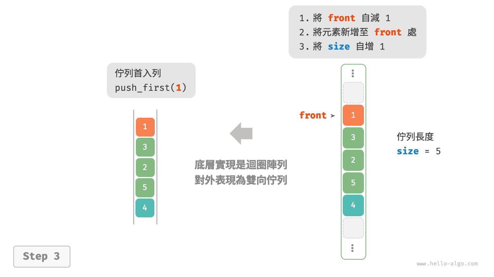

=== "pop_last()"
    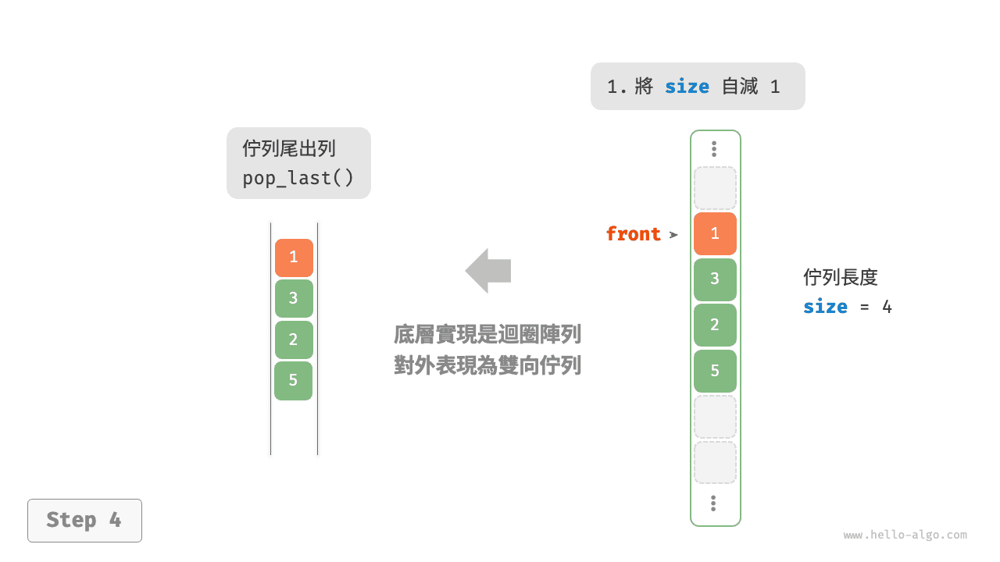

=== "pop_first()"
    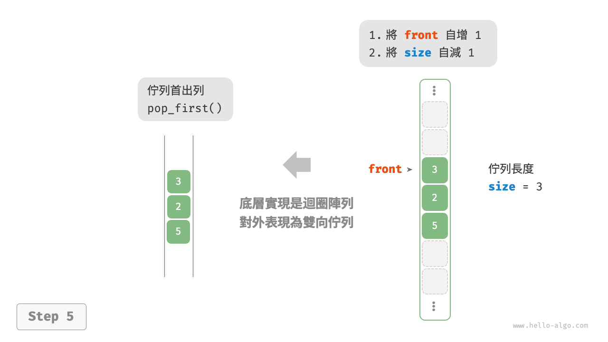

在佇列的實現基礎上，僅需增加“佇列首入列”和“佇列尾出列”的方法：

```src
[file]{array_deque}-[class]{array_deque}-[func]{}
```

## 雙向佇列應用

雙向佇列兼具堆疊與佇列的邏輯，**因此它可以實現這兩者的所有應用場景，同時提供更高的自由度**。

我們知道，軟體的“撤銷”功能通常使用堆疊來實現：系統將每次更改操作 `push` 到堆疊中，然後透過 `pop` 實現撤銷。然而，考慮到系統資源的限制，軟體通常會限制撤銷的步數（例如僅允許儲存 $50$ 步）。當堆疊的長度超過 $50$ 時，軟體需要在堆疊底（佇列首）執行刪除操作。**但堆疊無法實現該功能，此時就需要使用雙向佇列來替代堆疊**。請注意，“撤銷”的核心邏輯仍然遵循堆疊的先入後出原則，只是雙向佇列能夠更加靈活地實現一些額外邏輯。
