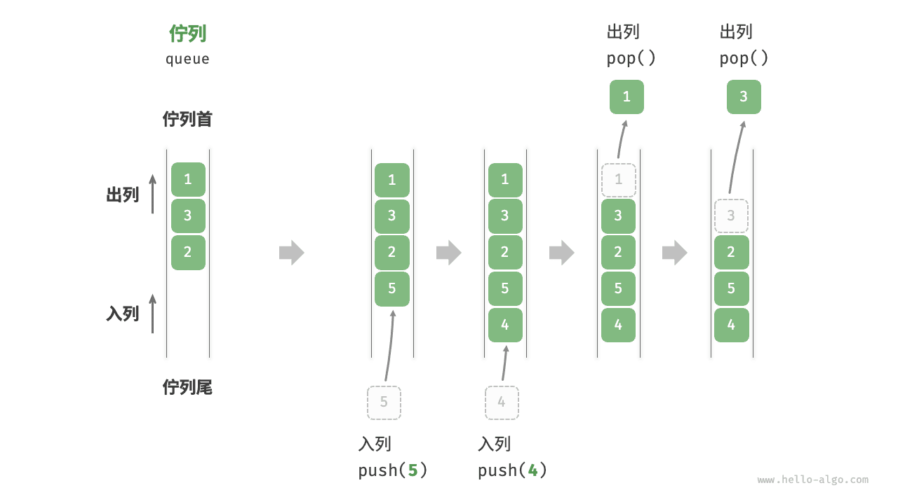
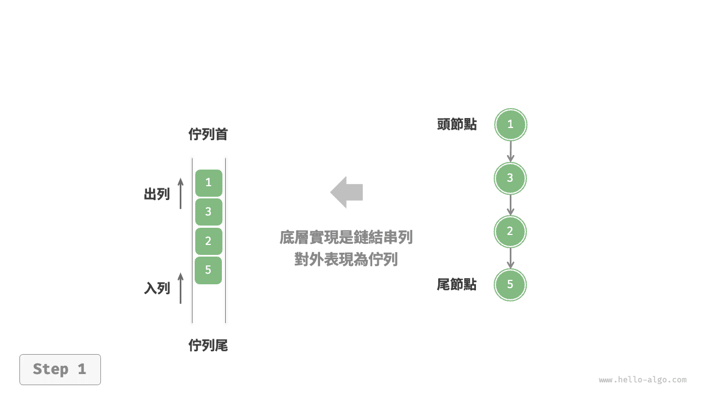
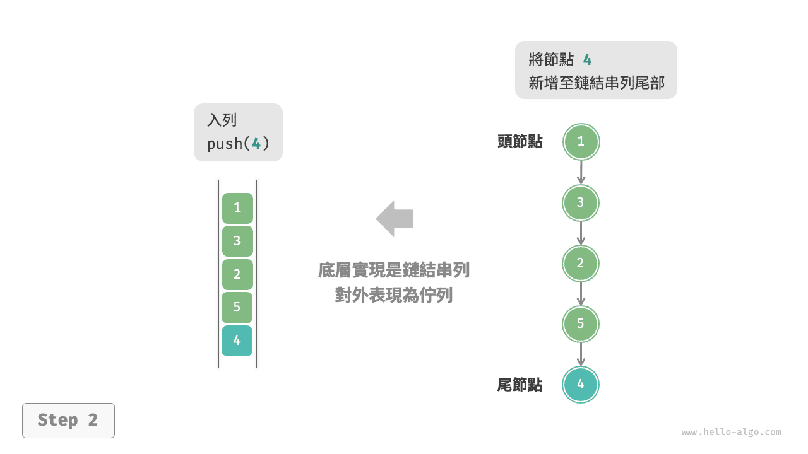
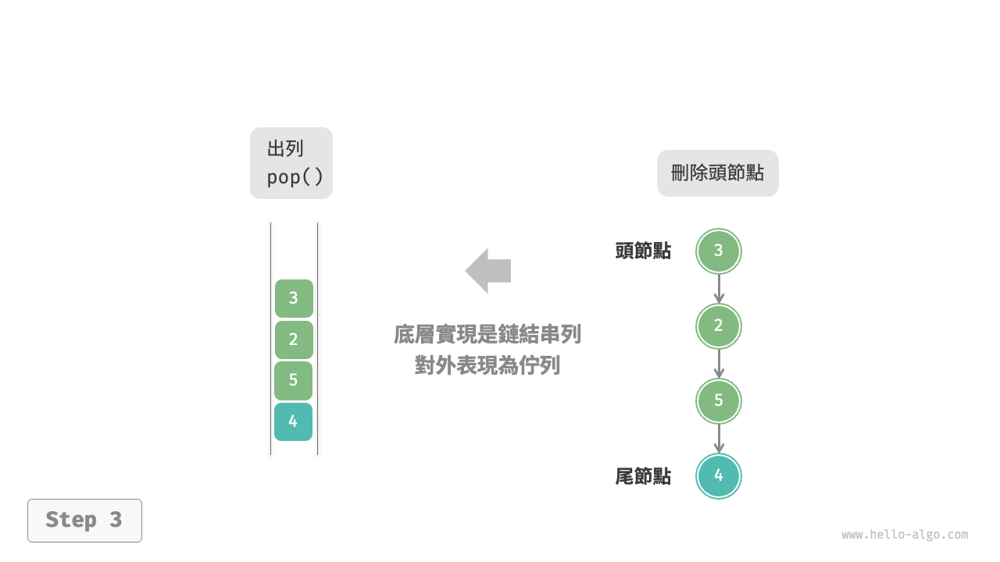
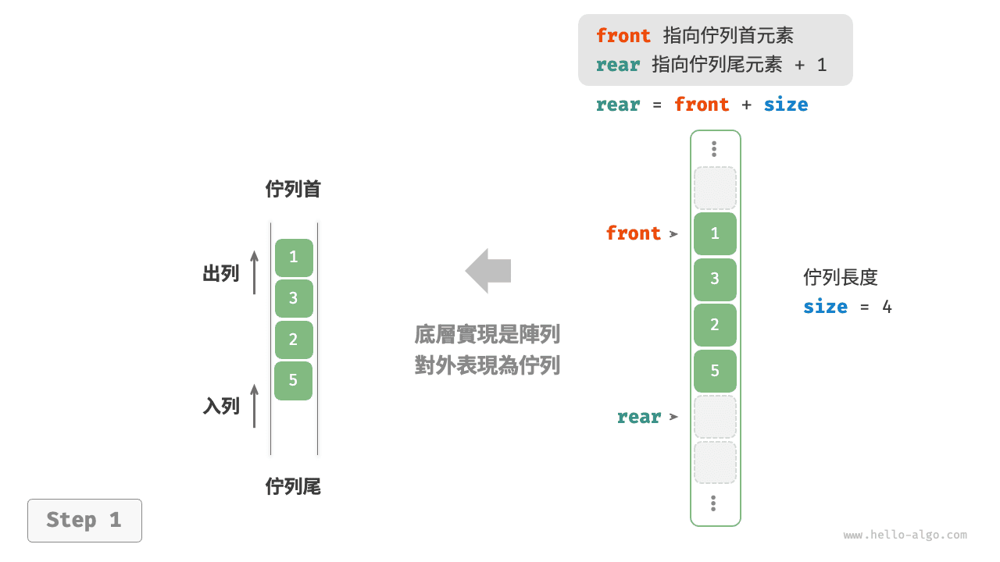
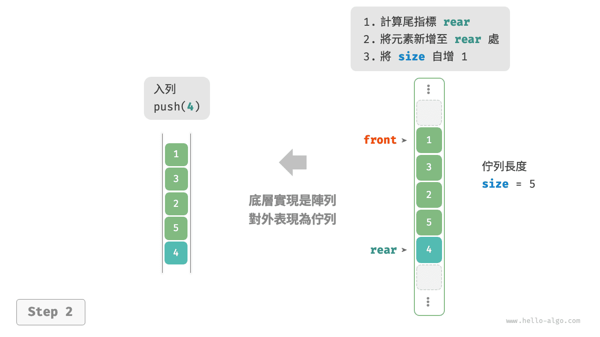
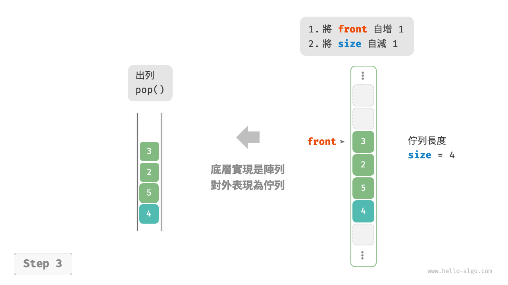

# 佇列

<u>佇列（queue）</u>是一種遵循先入先出規則的線性資料結構。顧名思義，佇列模擬了排隊現象，即新來的人不斷加入佇列尾部，而位於佇列頭部的人逐個離開。

如下圖所示，我們將佇列頭部稱為“佇列首”，尾部稱為“佇列尾”，將把元素加入列尾的操作稱為“入列”，刪除佇列首元素的操作稱為“出列”。



## 佇列常用操作

佇列的常見操作如下表所示。需要注意的是，不同程式語言的方法名稱可能會有所不同。我們在此採用與堆疊相同的方法命名。

<p align="center"> 表 <id> &nbsp; 佇列操作效率 </p>

| 方法名   | 描述                         | 時間複雜度 |
| -------- | ---------------------------- | ---------- |
| `push()` | 元素入列，即將元素新增至佇列尾 | $O(1)$     |
| `pop()`  | 佇列首元素出列                 | $O(1)$     |
| `peek()` | 訪問佇列首元素                 | $O(1)$     |

我們可以直接使用程式語言中現成的佇列類別：

=== "Python"

    ```python title="queue.py"
    from collections import deque

    # 初始化佇列
    # 在 Python 中，我們一般將雙向佇列類別 deque 當作佇列使用
    # 雖然 queue.Queue() 是純正的佇列類別，但不太好用，因此不推薦
    que: deque[int] = deque()

    # 元素入列
    que.append(1)
    que.append(3)
    que.append(2)
    que.append(5)
    que.append(4)

    # 訪問佇列首元素
    front: int = que[0]

    # 元素出列
    pop: int = que.popleft()

    # 獲取佇列的長度
    size: int = len(que)

    # 判斷佇列是否為空
    is_empty: bool = len(que) == 0
    ```

=== "C++"

    ```cpp title="queue.cpp"
    /* 初始化佇列 */
    queue<int> queue;

    /* 元素入列 */
    queue.push(1);
    queue.push(3);
    queue.push(2);
    queue.push(5);
    queue.push(4);

    /* 訪問佇列首元素 */
    int front = queue.front();

    /* 元素出列 */
    queue.pop();

    /* 獲取佇列的長度 */
    int size = queue.size();

    /* 判斷佇列是否為空 */
    bool empty = queue.empty();
    ```

=== "Java"

    ```java title="queue.java"
    /* 初始化佇列 */
    Queue<Integer> queue = new LinkedList<>();

    /* 元素入列 */
    queue.offer(1);
    queue.offer(3);
    queue.offer(2);
    queue.offer(5);
    queue.offer(4);

    /* 訪問佇列首元素 */
    int peek = queue.peek();

    /* 元素出列 */
    int pop = queue.poll();

    /* 獲取佇列的長度 */
    int size = queue.size();

    /* 判斷佇列是否為空 */
    boolean isEmpty = queue.isEmpty();
    ```

=== "C#"

    ```csharp title="queue.cs"
    /* 初始化佇列 */
    Queue<int> queue = new();

    /* 元素入列 */
    queue.Enqueue(1);
    queue.Enqueue(3);
    queue.Enqueue(2);
    queue.Enqueue(5);
    queue.Enqueue(4);

    /* 訪問佇列首元素 */
    int peek = queue.Peek();

    /* 元素出列 */
    int pop = queue.Dequeue();

    /* 獲取佇列的長度 */
    int size = queue.Count;

    /* 判斷佇列是否為空 */
    bool isEmpty = queue.Count == 0;
    ```

=== "Go"

    ```go title="queue_test.go"
    /* 初始化佇列 */
    // 在 Go 中，將 list 作為佇列來使用
    queue := list.New()

    /* 元素入列 */
    queue.PushBack(1)
    queue.PushBack(3)
    queue.PushBack(2)
    queue.PushBack(5)
    queue.PushBack(4)

    /* 訪問佇列首元素 */
    peek := queue.Front()

    /* 元素出列 */
    pop := queue.Front()
    queue.Remove(pop)

    /* 獲取佇列的長度 */
    size := queue.Len()

    /* 判斷佇列是否為空 */
    isEmpty := queue.Len() == 0
    ```

=== "Swift"

    ```swift title="queue.swift"
    /* 初始化佇列 */
    // Swift 沒有內建的佇列類別，可以把 Array 當作佇列來使用
    var queue: [Int] = []

    /* 元素入列 */
    queue.append(1)
    queue.append(3)
    queue.append(2)
    queue.append(5)
    queue.append(4)

    /* 訪問佇列首元素 */
    let peek = queue.first!

    /* 元素出列 */
    // 由於是陣列，因此 removeFirst 的複雜度為 O(n)
    let pool = queue.removeFirst()

    /* 獲取佇列的長度 */
    let size = queue.count

    /* 判斷佇列是否為空 */
    let isEmpty = queue.isEmpty
    ```

=== "JS"

    ```javascript title="queue.js"
    /* 初始化佇列 */
    // JavaScript 沒有內建的佇列，可以把 Array 當作佇列來使用
    const queue = [];

    /* 元素入列 */
    queue.push(1);
    queue.push(3);
    queue.push(2);
    queue.push(5);
    queue.push(4);

    /* 訪問佇列首元素 */
    const peek = queue[0];

    /* 元素出列 */
    // 底層是陣列，因此 shift() 方法的時間複雜度為 O(n)
    const pop = queue.shift();

    /* 獲取佇列的長度 */
    const size = queue.length;

    /* 判斷佇列是否為空 */
    const empty = queue.length === 0;
    ```

=== "TS"

    ```typescript title="queue.ts"
    /* 初始化佇列 */
    // TypeScript 沒有內建的佇列，可以把 Array 當作佇列來使用
    const queue: number[] = [];

    /* 元素入列 */
    queue.push(1);
    queue.push(3);
    queue.push(2);
    queue.push(5);
    queue.push(4);

    /* 訪問佇列首元素 */
    const peek = queue[0];

    /* 元素出列 */
    // 底層是陣列，因此 shift() 方法的時間複雜度為 O(n)
    const pop = queue.shift();

    /* 獲取佇列的長度 */
    const size = queue.length;

    /* 判斷佇列是否為空 */
    const empty = queue.length === 0;
    ```

=== "Dart"

    ```dart title="queue.dart"
    /* 初始化佇列 */
    // 在 Dart 中，佇列類別 Qeque 是雙向佇列，也可作為佇列使用
    Queue<int> queue = Queue();

    /* 元素入列 */
    queue.add(1);
    queue.add(3);
    queue.add(2);
    queue.add(5);
    queue.add(4);

    /* 訪問佇列首元素 */
    int peek = queue.first;

    /* 元素出列 */
    int pop = queue.removeFirst();

    /* 獲取佇列的長度 */
    int size = queue.length;

    /* 判斷佇列是否為空 */
    bool isEmpty = queue.isEmpty;
    ```

=== "Rust"

    ```rust title="queue.rs"
    /* 初始化雙向佇列 */
    // 在 Rust 中使用雙向佇列作為普通佇列來使用
    let mut deque: VecDeque<u32> = VecDeque::new();

    /* 元素入列 */
    deque.push_back(1);
    deque.push_back(3);
    deque.push_back(2);
    deque.push_back(5);
    deque.push_back(4);

    /* 訪問佇列首元素 */
    if let Some(front) = deque.front() {
    }

    /* 元素出列 */
    if let Some(pop) = deque.pop_front() {
    }

    /* 獲取佇列的長度 */
    let size = deque.len();

    /* 判斷佇列是否為空 */
    let is_empty = deque.is_empty();
    ```

=== "C"

    ```c title="queue.c"
    // C 未提供內建佇列
    ```

=== "Kotlin"

    ```kotlin title="queue.kt"
    /* 初始化佇列 */
    val queue = LinkedList<Int>()

    /* 元素入列 */
    queue.offer(1)
    queue.offer(3)
    queue.offer(2)
    queue.offer(5)
    queue.offer(4)

    /* 訪問佇列首元素 */
    val peek = queue.peek()

    /* 元素出列 */
    val pop = queue.poll()

    /* 獲取佇列的長度 */
    val size = queue.size

    /* 判斷佇列是否為空 */
    val isEmpty = queue.isEmpty()
    ```

=== "Ruby"

    ```ruby title="queue.rb"
    # 初始化佇列
    # Ruby 內建的佇列（Thread::Queue) 沒有 peek 和走訪方法，可以把 Array 當作佇列來使用
    queue = []

    # 元素入列
    queue.push(1)
    queue.push(3)
    queue.push(2)
    queue.push(5)
    queue.push(4)

    # 訪問佇列元素
    peek = queue.first

    # 元素出列
    # 清注意，由於是陣列，Array#shift 方法時間複雜度為 O(n)
    pop = queue.shift

    # 獲取佇列的長度
    size = queue.length

    # 判斷佇列是否為空
    is_empty = queue.empty?
    ```

=== "Zig"

    ```zig title="queue.zig"

    ```

??? pythontutor "視覺化執行"

    https://pythontutor.com/render.html#code=from%20collections%20import%20deque%0A%0A%22%22%22Driver%20Code%22%22%22%0Aif%20__name__%20%3D%3D%20%22__main__%22%3A%0A%20%20%20%20%23%20%E5%88%9D%E5%A7%8B%E5%8C%96%E4%BD%87%E5%88%97%0A%20%20%20%20%23%20%E5%9C%A8%20Python%20%E4%B8%AD%EF%BC%8C%E6%88%91%E5%80%91%E4%B8%80%E8%88%AC%E5%B0%87%E9%9B%99%E5%90%91%E4%BD%87%E5%88%97%E9%A1%9E%E5%88%A5%20deque%20%E7%9C%8B%E4%BD%9C%E4%BD%87%E5%88%97%E4%BD%BF%E7%94%A8%0A%20%20%20%20%23%20%E9%9B%96%E7%84%B6%20queue.Queue%28%29%20%E6%98%AF%E7%B4%94%E6%AD%A3%E7%9A%84%E4%BD%87%E5%88%97%E9%A1%9E%E5%88%A5%EF%BC%8C%E4%BD%86%E4%B8%8D%E5%A4%AA%E5%A5%BD%E7%94%A8%0A%20%20%20%20que%20%3D%20deque%28%29%0A%0A%20%20%20%20%23%20%E5%85%83%E7%B4%A0%E5%85%A5%E5%88%97%0A%20%20%20%20que.append%281%29%0A%20%20%20%20que.append%283%29%0A%20%20%20%20que.append%282%29%0A%20%20%20%20que.append%285%29%0A%20%20%20%20que.append%284%29%0A%20%20%20%20print%28%22%E4%BD%87%E5%88%97%20que%20%3D%22%2C%20que%29%0A%0A%20%20%20%20%23%20%E8%A8%AA%E5%95%8F%E4%BD%87%E5%88%97%E9%A6%96%E5%85%83%E7%B4%A0%0A%20%20%20%20front%20%3D%20que%5B0%5D%0A%20%20%20%20print%28%22%E4%BD%87%E5%88%97%E9%A6%96%E5%85%83%E7%B4%A0%20front%20%3D%22%2C%20front%29%0A%0A%20%20%20%20%23%20%E5%85%83%E7%B4%A0%E5%87%BA%E5%88%97%0A%20%20%20%20pop%20%3D%20que.popleft%28%29%0A%20%20%20%20print%28%22%E5%87%BA%E5%88%97%E5%85%83%E7%B4%A0%20pop%20%3D%22%2C%20pop%29%0A%20%20%20%20print%28%22%E5%87%BA%E5%88%97%E5%BE%8C%20que%20%3D%22%2C%20que%29%0A%0A%20%20%20%20%23%20%E7%8D%B2%E5%8F%96%E4%BD%87%E5%88%97%E7%9A%84%E9%95%B7%E5%BA%A6%0A%20%20%20%20size%20%3D%20len%28que%29%0A%20%20%20%20print%28%22%E4%BD%87%E5%88%97%E9%95%B7%E5%BA%A6%20size%20%3D%22%2C%20size%29%0A%0A%20%20%20%20%23%20%E5%88%A4%E6%96%B7%E4%BD%87%E5%88%97%E6%98%AF%E5%90%A6%E7%82%BA%E7%A9%BA%0A%20%20%20%20is_empty%20%3D%20len%28que%29%20%3D%3D%200%0A%20%20%20%20print%28%22%E4%BD%87%E5%88%97%E6%98%AF%E5%90%A6%E7%82%BA%E7%A9%BA%20%3D%22%2C%20is_empty%29&cumulative=false&curInstr=3&heapPrimitives=nevernest&mode=display&origin=opt-frontend.js&py=311&rawInputLstJSON=%5B%5D&textReferences=false

## 佇列實現

為了實現佇列，我們需要一種資料結構，可以在一端新增元素，並在另一端刪除元素，鏈結串列和陣列都符合要求。

### 基於鏈結串列的實現

如下圖所示，我們可以將鏈結串列的“頭節點”和“尾節點”分別視為“佇列首”和“佇列尾”，規定佇列尾僅可新增節點，佇列首僅可刪除節點。

=== "LinkedListQueue"
    

=== "push()"
    

=== "pop()"
    

以下是用鏈結串列實現佇列的程式碼：

```src
[file]{linkedlist_queue}-[class]{linked_list_queue}-[func]{}
```

### 基於陣列的實現

在陣列中刪除首元素的時間複雜度為 $O(n)$ ，這會導致出列操作效率較低。然而，我們可以採用以下巧妙方法來避免這個問題。

我們可以使用一個變數 `front` 指向佇列首元素的索引，並維護一個變數 `size` 用於記錄佇列長度。定義 `rear = front + size` ，這個公式計算出的 `rear` 指向佇列尾元素之後的下一個位置。

基於此設計，**陣列中包含元素的有效區間為 `[front, rear - 1]`**，各種操作的實現方法如下圖所示。

- 入列操作：將輸入元素賦值給 `rear` 索引處，並將 `size` 增加 1 。
- 出列操作：只需將 `front` 增加 1 ，並將 `size` 減少 1 。

可以看到，入列和出列操作都只需進行一次操作，時間複雜度均為 $O(1)$ 。

=== "ArrayQueue"
    

=== "push()"
    

=== "pop()"
    

你可能會發現一個問題：在不斷進行入列和出列的過程中，`front` 和 `rear` 都在向右移動，**當它們到達陣列尾部時就無法繼續移動了**。為了解決此問題，我們可以將陣列視為首尾相接的“環形陣列”。

對於環形陣列，我們需要讓 `front` 或 `rear` 在越過陣列尾部時，直接回到陣列頭部繼續走訪。這種週期性規律可以透過“取餘操作”來實現，程式碼如下所示：

```src
[file]{array_queue}-[class]{array_queue}-[func]{}
```

以上實現的佇列仍然具有侷限性：其長度不可變。然而，這個問題不難解決，我們可以將陣列替換為動態陣列，從而引入擴容機制。有興趣的讀者可以嘗試自行實現。

兩種實現的對比結論與堆疊一致，在此不再贅述。

## 佇列典型應用

- **淘寶訂單**。購物者下單後，訂單將加入列列中，系統隨後會根據順序處理佇列中的訂單。在雙十一期間，短時間內會產生海量訂單，高併發成為工程師們需要重點攻克的問題。
- **各類待辦事項**。任何需要實現“先來後到”功能的場景，例如印表機的任務佇列、餐廳的出餐佇列等，佇列在這些場景中可以有效地維護處理順序。
