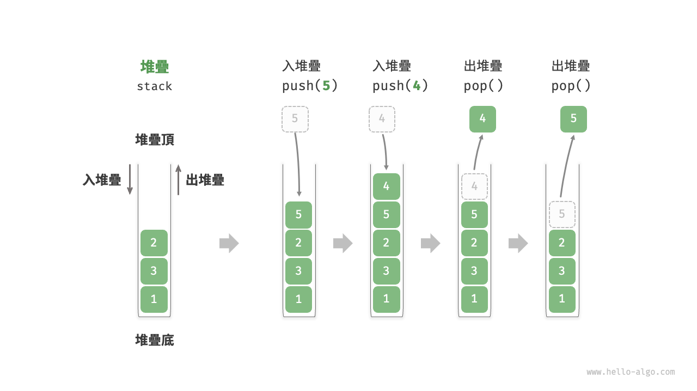
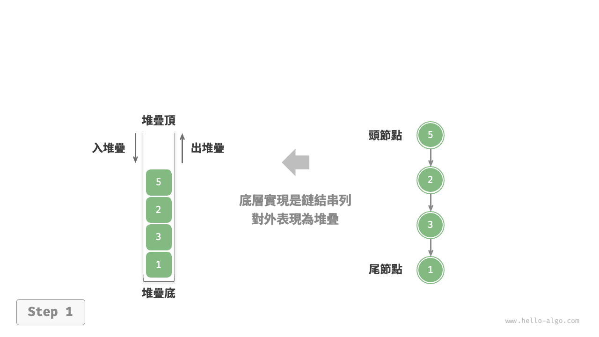
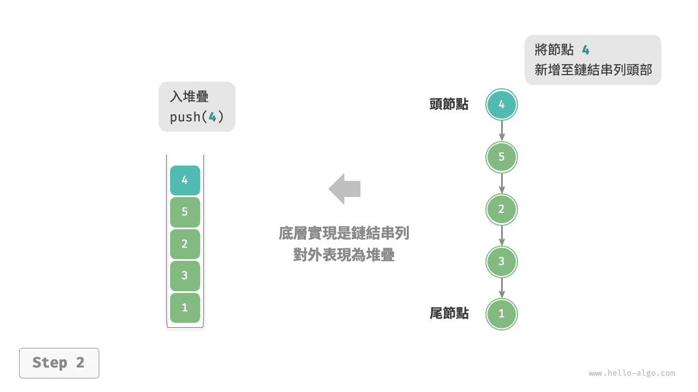
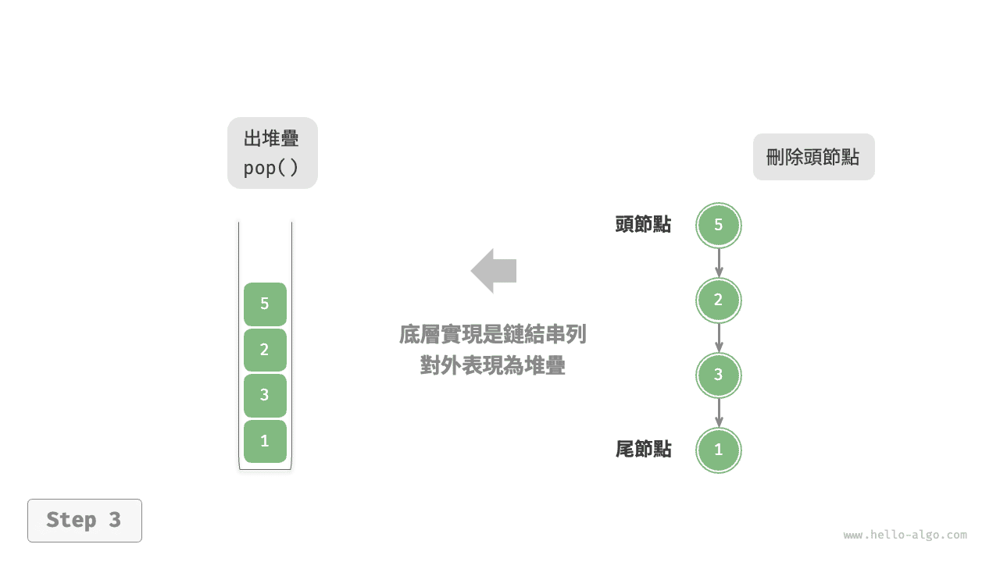
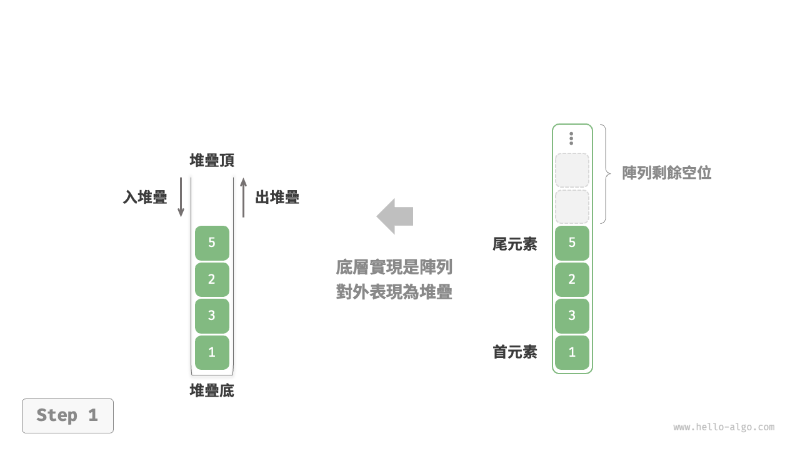
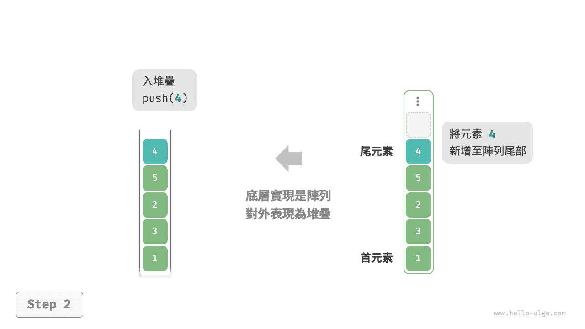
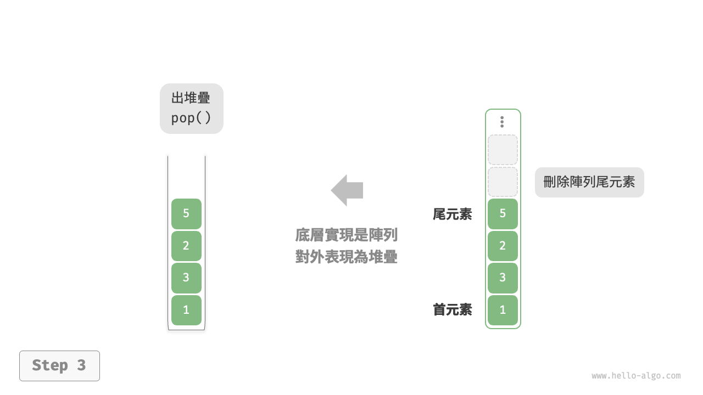

# 堆疊

<u>堆疊（stack）</u>是一種遵循先入後出邏輯的線性資料結構。

我們可以將堆疊類比為桌面上的一疊盤子，如果想取出底部的盤子，則需要先將上面的盤子依次移走。我們將盤子替換為各種型別的元素（如整數、字元、物件等），就得到了堆疊這種資料結構。

如下圖所示，我們把堆積疊元素的頂部稱為“堆疊頂”，底部稱為“堆疊底”。將把元素新增到堆疊頂的操作叫作“入堆疊”，刪除堆疊頂元素的操作叫作“出堆疊”。



## 堆疊的常用操作

堆疊的常用操作如下表所示，具體的方法名需要根據所使用的程式語言來確定。在此，我們以常見的 `push()`、`pop()`、`peek()` 命名為例。

<p align="center"> 表 <id> &nbsp; 堆疊的操作效率 </p>

| 方法     | 描述                   | 時間複雜度 |
| -------- | ---------------------- | ---------- |
| `push()` | 元素入堆疊（新增至堆疊頂） | $O(1)$     |
| `pop()`  | 堆疊頂元素出堆疊           | $O(1)$     |
| `peek()` | 訪問堆疊頂元素           | $O(1)$     |

通常情況下，我們可以直接使用程式語言內建的堆疊類別。然而，某些語言可能沒有專門提供堆疊類別，這時我們可以將該語言的“陣列”或“鏈結串列”當作堆疊來使用，並在程式邏輯上忽略與堆疊無關的操作。

=== "Python"

    ```python title="stack.py"
    # 初始化堆疊
    # Python 沒有內建的堆疊類別，可以把 list 當作堆疊來使用
    stack: list[int] = []

    # 元素入堆疊
    stack.append(1)
    stack.append(3)
    stack.append(2)
    stack.append(5)
    stack.append(4)

    # 訪問堆疊頂元素
    peek: int = stack[-1]

    # 元素出堆疊
    pop: int = stack.pop()

    # 獲取堆疊的長度
    size: int = len(stack)

    # 判斷是否為空
    is_empty: bool = len(stack) == 0
    ```

=== "C++"

    ```cpp title="stack.cpp"
    /* 初始化堆疊 */
    stack<int> stack;

    /* 元素入堆疊 */
    stack.push(1);
    stack.push(3);
    stack.push(2);
    stack.push(5);
    stack.push(4);

    /* 訪問堆疊頂元素 */
    int top = stack.top();

    /* 元素出堆疊 */
    stack.pop(); // 無返回值

    /* 獲取堆疊的長度 */
    int size = stack.size();

    /* 判斷是否為空 */
    bool empty = stack.empty();
    ```

=== "Java"

    ```java title="stack.java"
    /* 初始化堆疊 */
    Stack<Integer> stack = new Stack<>();

    /* 元素入堆疊 */
    stack.push(1);
    stack.push(3);
    stack.push(2);
    stack.push(5);
    stack.push(4);

    /* 訪問堆疊頂元素 */
    int peek = stack.peek();

    /* 元素出堆疊 */
    int pop = stack.pop();

    /* 獲取堆疊的長度 */
    int size = stack.size();

    /* 判斷是否為空 */
    boolean isEmpty = stack.isEmpty();
    ```

=== "C#"

    ```csharp title="stack.cs"
    /* 初始化堆疊 */
    Stack<int> stack = new();

    /* 元素入堆疊 */
    stack.Push(1);
    stack.Push(3);
    stack.Push(2);
    stack.Push(5);
    stack.Push(4);

    /* 訪問堆疊頂元素 */
    int peek = stack.Peek();

    /* 元素出堆疊 */
    int pop = stack.Pop();

    /* 獲取堆疊的長度 */
    int size = stack.Count;

    /* 判斷是否為空 */
    bool isEmpty = stack.Count == 0;
    ```

=== "Go"

    ```go title="stack_test.go"
    /* 初始化堆疊 */
    // 在 Go 中，推薦將 Slice 當作堆疊來使用
    var stack []int

    /* 元素入堆疊 */
    stack = append(stack, 1)
    stack = append(stack, 3)
    stack = append(stack, 2)
    stack = append(stack, 5)
    stack = append(stack, 4)

    /* 訪問堆疊頂元素 */
    peek := stack[len(stack)-1]

    /* 元素出堆疊 */
    pop := stack[len(stack)-1]
    stack = stack[:len(stack)-1]

    /* 獲取堆疊的長度 */
    size := len(stack)

    /* 判斷是否為空 */
    isEmpty := len(stack) == 0
    ```

=== "Swift"

    ```swift title="stack.swift"
    /* 初始化堆疊 */
    // Swift 沒有內建的堆疊類別，可以把 Array 當作堆疊來使用
    var stack: [Int] = []

    /* 元素入堆疊 */
    stack.append(1)
    stack.append(3)
    stack.append(2)
    stack.append(5)
    stack.append(4)

    /* 訪問堆疊頂元素 */
    let peek = stack.last!

    /* 元素出堆疊 */
    let pop = stack.removeLast()

    /* 獲取堆疊的長度 */
    let size = stack.count

    /* 判斷是否為空 */
    let isEmpty = stack.isEmpty
    ```

=== "JS"

    ```javascript title="stack.js"
    /* 初始化堆疊 */
    // JavaScript 沒有內建的堆疊類別，可以把 Array 當作堆疊來使用
    const stack = [];

    /* 元素入堆疊 */
    stack.push(1);
    stack.push(3);
    stack.push(2);
    stack.push(5);
    stack.push(4);

    /* 訪問堆疊頂元素 */
    const peek = stack[stack.length-1];

    /* 元素出堆疊 */
    const pop = stack.pop();

    /* 獲取堆疊的長度 */
    const size = stack.length;

    /* 判斷是否為空 */
    const is_empty = stack.length === 0;
    ```

=== "TS"

    ```typescript title="stack.ts"
    /* 初始化堆疊 */
    // TypeScript 沒有內建的堆疊類別，可以把 Array 當作堆疊來使用
    const stack: number[] = [];

    /* 元素入堆疊 */
    stack.push(1);
    stack.push(3);
    stack.push(2);
    stack.push(5);
    stack.push(4);

    /* 訪問堆疊頂元素 */
    const peek = stack[stack.length - 1];

    /* 元素出堆疊 */
    const pop = stack.pop();

    /* 獲取堆疊的長度 */
    const size = stack.length;

    /* 判斷是否為空 */
    const is_empty = stack.length === 0;
    ```

=== "Dart"

    ```dart title="stack.dart"
    /* 初始化堆疊 */
    // Dart 沒有內建的堆疊類別，可以把 List 當作堆疊來使用
    List<int> stack = [];

    /* 元素入堆疊 */
    stack.add(1);
    stack.add(3);
    stack.add(2);
    stack.add(5);
    stack.add(4);

    /* 訪問堆疊頂元素 */
    int peek = stack.last;

    /* 元素出堆疊 */
    int pop = stack.removeLast();

    /* 獲取堆疊的長度 */
    int size = stack.length;

    /* 判斷是否為空 */
    bool isEmpty = stack.isEmpty;
    ```

=== "Rust"

    ```rust title="stack.rs"
    /* 初始化堆疊 */
    // 把 Vec 當作堆疊來使用
    let mut stack: Vec<i32> = Vec::new();

    /* 元素入堆疊 */
    stack.push(1);
    stack.push(3);
    stack.push(2);
    stack.push(5);
    stack.push(4);

    /* 訪問堆疊頂元素 */
    let top = stack.last().unwrap();

    /* 元素出堆疊 */
    let pop = stack.pop().unwrap();

    /* 獲取堆疊的長度 */
    let size = stack.len();

    /* 判斷是否為空 */
    let is_empty = stack.is_empty();
    ```

=== "C"

    ```c title="stack.c"
    // C 未提供內建堆疊
    ```

=== "Kotlin"

    ```kotlin title="stack.kt"
    /* 初始化堆疊 */
    val stack = Stack<Int>()

    /* 元素入堆疊 */
    stack.push(1)
    stack.push(3)
    stack.push(2)
    stack.push(5)
    stack.push(4)

    /* 訪問堆疊頂元素 */
    val peek = stack.peek()

    /* 元素出堆疊 */
    val pop = stack.pop()

    /* 獲取堆疊的長度 */
    val size = stack.size

    /* 判斷是否為空 */
    val isEmpty = stack.isEmpty()
    ```

=== "Ruby"

    ```ruby title="stack.rb"
    # 初始化堆疊
    # Ruby 沒有內建的堆疊類別，可以把 Array 當作堆疊來使用
    stack = []

    # 元素入堆疊
    stack << 1
    stack << 3
    stack << 2
    stack << 5
    stack << 4

    # 訪問堆疊頂元素
    peek = stack.last

    # 元素出堆疊
    pop = stack.pop

    # 獲取堆疊的長度
    size = stack.length

    # 判斷是否為空
    is_empty = stack.empty?
    ```

=== "Zig"

    ```zig title="stack.zig"

    ```

??? pythontutor "視覺化執行"

    https://pythontutor.com/render.html#code=%22%22%22Driver%20Code%22%22%22%0Aif%20__name__%20%3D%3D%20%22__main__%22%3A%0A%20%20%20%20%23%20%E5%88%9D%E5%A7%8B%E5%8C%96%E5%A0%86%E7%96%8A%0A%20%20%20%20%23%20Python%20%E6%B2%92%E6%9C%89%E5%85%A7%E5%BB%BA%E7%9A%84%E5%A0%86%E7%96%8A%E9%A1%9E%E5%88%A5%EF%BC%8C%E5%8F%AF%E4%BB%A5%E6%8A%8A%20list%20%E7%95%B6%E4%BD%9C%E5%A0%86%E7%96%8A%E4%BE%86%E4%BD%BF%E7%94%A8%0A%20%20%20%20stack%20%3D%20%5B%5D%0A%0A%20%20%20%20%23%20%E5%85%83%E7%B4%A0%E5%85%A5%E5%A0%86%E7%96%8A%0A%20%20%20%20stack.append%281%29%0A%20%20%20%20stack.append%283%29%0A%20%20%20%20stack.append%282%29%0A%20%20%20%20stack.append%285%29%0A%20%20%20%20stack.append%284%29%0A%20%20%20%20print%28%22%E5%A0%86%E7%96%8A%20stack%20%3D%22%2C%20stack%29%0A%0A%20%20%20%20%23%20%E8%A8%AA%E5%95%8F%E5%A0%86%E7%96%8A%E9%A0%82%E5%85%83%E7%B4%A0%0A%20%20%20%20peek%20%3D%20stack%5B-1%5D%0A%20%20%20%20print%28%22%E5%A0%86%E7%96%8A%E9%A0%82%E5%85%83%E7%B4%A0%20peek%20%3D%22%2C%20peek%29%0A%0A%20%20%20%20%23%20%E5%85%83%E7%B4%A0%E5%87%BA%E5%A0%86%E7%96%8A%0A%20%20%20%20pop%20%3D%20stack.pop%28%29%0A%20%20%20%20print%28%22%E5%87%BA%E5%A0%86%E7%96%8A%E5%85%83%E7%B4%A0%20pop%20%3D%22%2C%20pop%29%0A%20%20%20%20print%28%22%E5%87%BA%E5%A0%86%E7%96%8A%E5%BE%8C%20stack%20%3D%22%2C%20stack%29%0A%0A%20%20%20%20%23%20%E7%8D%B2%E5%8F%96%E5%A0%86%E7%96%8A%E7%9A%84%E9%95%B7%E5%BA%A6%0A%20%20%20%20size%20%3D%20len%28stack%29%0A%20%20%20%20print%28%22%E5%A0%86%E7%96%8A%E7%9A%84%E9%95%B7%E5%BA%A6%20size%20%3D%22%2C%20size%29%0A%0A%20%20%20%20%23%20%E5%88%A4%E6%96%B7%E6%98%AF%E5%90%A6%E7%82%BA%E7%A9%BA%0A%20%20%20%20is_empty%20%3D%20len%28stack%29%20%3D%3D%200%0A%20%20%20%20print%28%22%E5%A0%86%E7%96%8A%E6%98%AF%E5%90%A6%E7%82%BA%E7%A9%BA%20%3D%22%2C%20is_empty%29&cumulative=false&curInstr=2&heapPrimitives=nevernest&mode=display&origin=opt-frontend.js&py=311&rawInputLstJSON=%5B%5D&textReferences=false

## 堆疊的實現

為了深入瞭解堆疊的執行機制，我們來嘗試自己實現一個堆疊類別。

堆疊遵循先入後出的原則，因此我們只能在堆疊頂新增或刪除元素。然而，陣列和鏈結串列都可以在任意位置新增和刪除元素，**因此堆疊可以視為一種受限制的陣列或鏈結串列**。換句話說，我們可以“遮蔽”陣列或鏈結串列的部分無關操作，使其對外表現的邏輯符合堆疊的特性。

### 基於鏈結串列的實現

使用鏈結串列實現堆疊時，我們可以將鏈結串列的頭節點視為堆疊頂，尾節點視為堆疊底。

如下圖所示，對於入堆疊操作，我們只需將元素插入鏈結串列頭部，這種節點插入方法被稱為“頭插法”。而對於出堆疊操作，只需將頭節點從鏈結串列中刪除即可。

=== "LinkedListStack"
    

=== "push()"
    

=== "pop()"
    

以下是基於鏈結串列實現堆疊的示例程式碼：

```src
[file]{linkedlist_stack}-[class]{linked_list_stack}-[func]{}
```

### 基於陣列的實現

使用陣列實現堆疊時，我們可以將陣列的尾部作為堆疊頂。如下圖所示，入堆疊與出堆疊操作分別對應在陣列尾部新增元素與刪除元素，時間複雜度都為 $O(1)$ 。

=== "ArrayStack"
    

=== "push()"
    

=== "pop()"
    

由於入堆疊的元素可能會源源不斷地增加，因此我們可以使用動態陣列，這樣就無須自行處理陣列擴容問題。以下為示例程式碼：

```src
[file]{array_stack}-[class]{array_stack}-[func]{}
```

## 兩種實現對比

**支持操作**

兩種實現都支持堆疊定義中的各項操作。陣列實現額外支持隨機訪問，但這已超出了堆疊的定義範疇，因此一般不會用到。

**時間效率**

在基於陣列的實現中，入堆疊和出堆疊操作都在預先分配好的連續記憶體中進行，具有很好的快取本地性，因此效率較高。然而，如果入堆疊時超出陣列容量，會觸發擴容機制，導致該次入堆疊操作的時間複雜度變為 $O(n)$ 。

在基於鏈結串列的實現中，鏈結串列的擴容非常靈活，不存在上述陣列擴容時效率降低的問題。但是，入堆疊操作需要初始化節點物件並修改指標，因此效率相對較低。不過，如果入堆疊元素本身就是節點物件，那麼可以省去初始化步驟，從而提高效率。

綜上所述，當入堆疊與出堆疊操作的元素是基本資料型別時，例如 `int` 或 `double` ，我們可以得出以下結論。

- 基於陣列實現的堆疊在觸發擴容時效率會降低，但由於擴容是低頻操作，因此平均效率更高。
- 基於鏈結串列實現的堆疊可以提供更加穩定的效率表現。

**空間效率**

在初始化串列時，系統會為串列分配“初始容量”，該容量可能超出實際需求；並且，擴容機制通常是按照特定倍率（例如 2 倍）進行擴容的，擴容後的容量也可能超出實際需求。因此，**基於陣列實現的堆疊可能造成一定的空間浪費**。

然而，由於鏈結串列節點需要額外儲存指標，**因此鏈結串列節點佔用的空間相對較大**。

綜上，我們不能簡單地確定哪種實現更加節省記憶體，需要針對具體情況進行分析。

## 堆疊的典型應用

- **瀏覽器中的後退與前進、軟體中的撤銷與反撤銷**。每當我們開啟新的網頁，瀏覽器就會對上一個網頁執行入堆疊，這樣我們就可以通過後退操作回到上一個網頁。後退操作實際上是在執行出堆疊。如果要同時支持後退和前進，那麼需要兩個堆疊來配合實現。
- **程式記憶體管理**。每次呼叫函式時，系統都會在堆疊頂新增一個堆疊幀，用於記錄函式的上下文資訊。在遞迴函式中，向下遞推階段會不斷執行入堆疊操作，而向上回溯階段則會不斷執行出堆疊操作。
