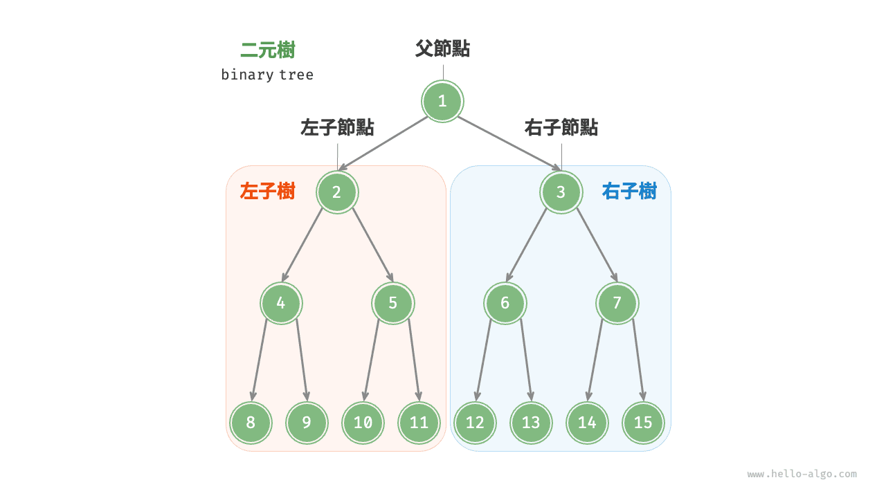
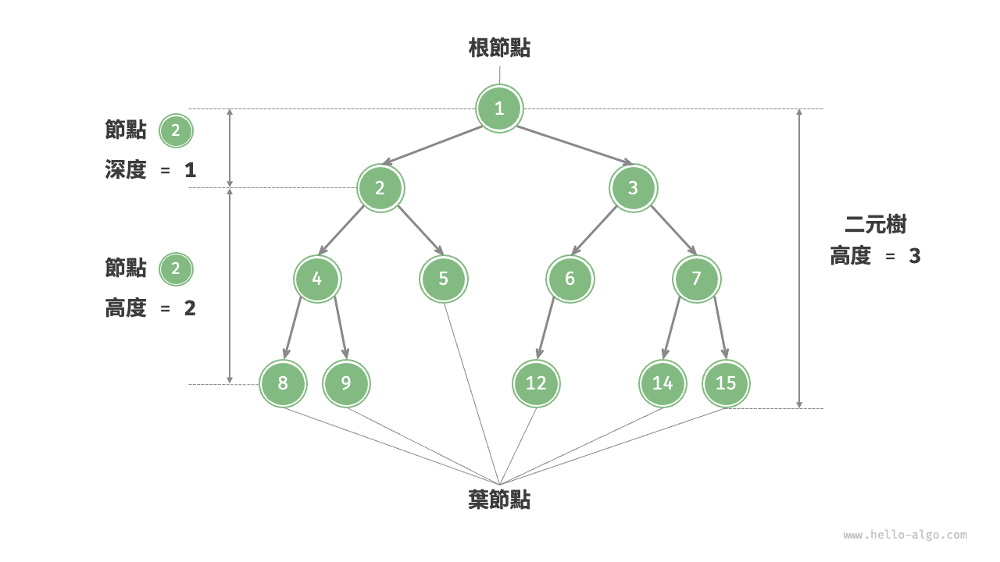
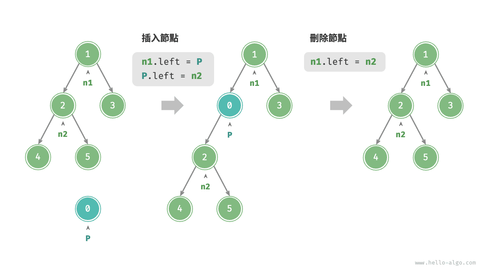
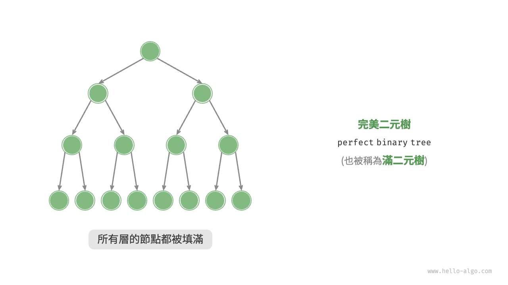
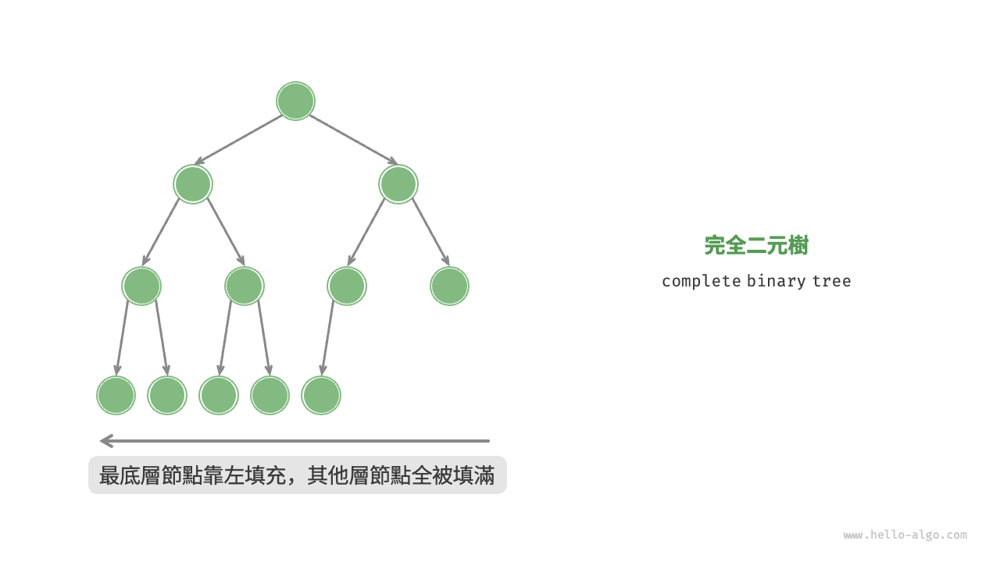
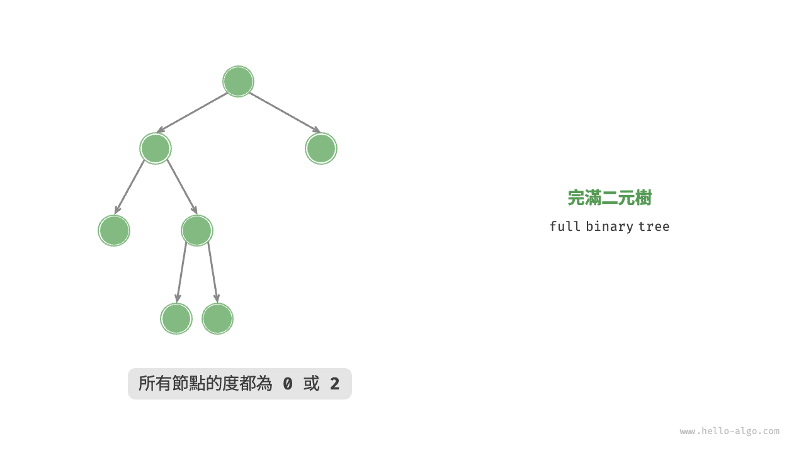
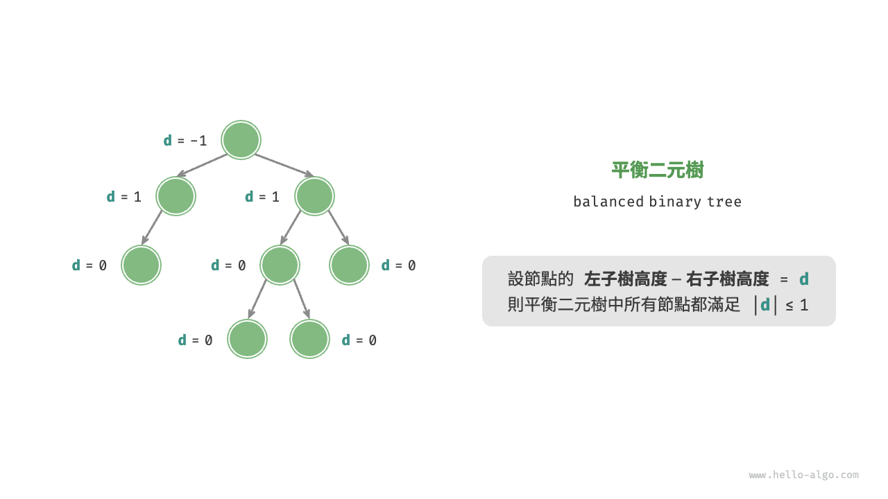
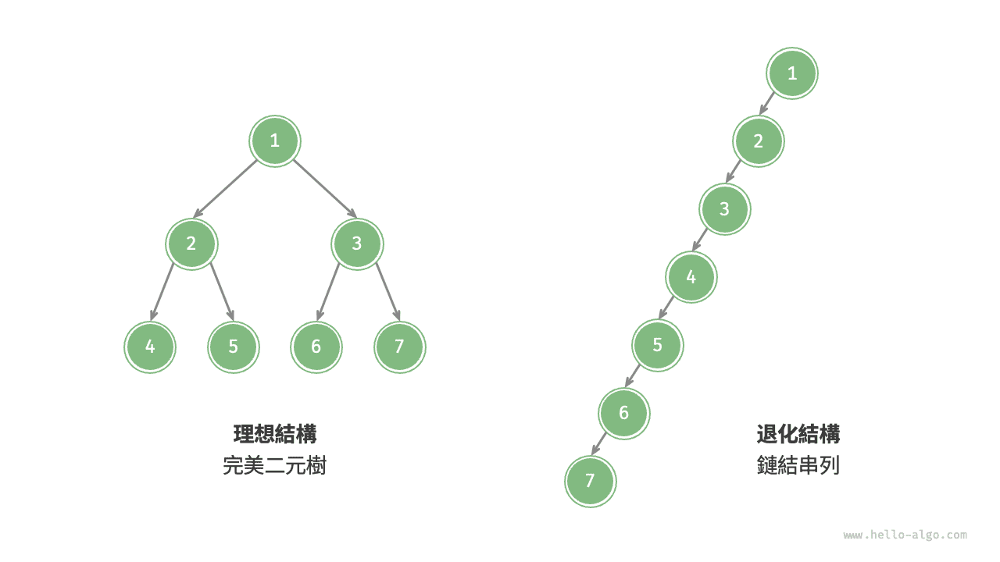

# 二元樹

<u>二元樹（binary tree）</u>是一種非線性資料結構，代表“祖先”與“後代”之間的派生關係，體現了“一分為二”的分治邏輯。與鏈結串列類似，二元樹的基本單元是節點，每個節點包含值、左子節點引用和右子節點引用。

=== "Python"

    ```python title=""
    class TreeNode:
        """二元樹節點類別"""
        def __init__(self, val: int):
            self.val: int = val                # 節點值
            self.left: TreeNode | None = None  # 左子節點引用
            self.right: TreeNode | None = None # 右子節點引用
    ```

=== "C++"

    ```cpp title=""
    /* 二元樹節點結構體 */
    struct TreeNode {
        int val;          // 節點值
        TreeNode *left;   // 左子節點指標
        TreeNode *right;  // 右子節點指標
        TreeNode(int x) : val(x), left(nullptr), right(nullptr) {}
    };
    ```

=== "Java"

    ```java title=""
    /* 二元樹節點類別 */
    class TreeNode {
        int val;         // 節點值
        TreeNode left;   // 左子節點引用
        TreeNode right;  // 右子節點引用
        TreeNode(int x) { val = x; }
    }
    ```

=== "C#"

    ```csharp title=""
    /* 二元樹節點類別 */
    class TreeNode(int? x) {
        public int? val = x;    // 節點值
        public TreeNode? left;  // 左子節點引用
        public TreeNode? right; // 右子節點引用
    }
    ```

=== "Go"

    ```go title=""
    /* 二元樹節點結構體 */
    type TreeNode struct {
        Val   int
        Left  *TreeNode
        Right *TreeNode
    }
    /* 建構子 */
    func NewTreeNode(v int) *TreeNode {
        return &TreeNode{
            Left:  nil, // 左子節點指標
            Right: nil, // 右子節點指標
            Val:   v,   // 節點值
        }
    }
    ```

=== "Swift"

    ```swift title=""
    /* 二元樹節點類別 */
    class TreeNode {
        var val: Int // 節點值
        var left: TreeNode? // 左子節點引用
        var right: TreeNode? // 右子節點引用

        init(x: Int) {
            val = x
        }
    }
    ```

=== "JS"

    ```javascript title=""
    /* 二元樹節點類別 */
    class TreeNode {
        val; // 節點值
        left; // 左子節點指標
        right; // 右子節點指標
        constructor(val, left, right) {
            this.val = val === undefined ? 0 : val;
            this.left = left === undefined ? null : left;
            this.right = right === undefined ? null : right;
        }
    }
    ```

=== "TS"

    ```typescript title=""
    /* 二元樹節點類別 */
    class TreeNode {
        val: number;
        left: TreeNode | null;
        right: TreeNode | null;

        constructor(val?: number, left?: TreeNode | null, right?: TreeNode | null) {
            this.val = val === undefined ? 0 : val; // 節點值
            this.left = left === undefined ? null : left; // 左子節點引用
            this.right = right === undefined ? null : right; // 右子節點引用
        }
    }
    ```

=== "Dart"

    ```dart title=""
    /* 二元樹節點類別 */
    class TreeNode {
      int val;         // 節點值
      TreeNode? left;  // 左子節點引用
      TreeNode? right; // 右子節點引用
      TreeNode(this.val, [this.left, this.right]);
    }
    ```

=== "Rust"

    ```rust title=""
    use std::rc::Rc;
    use std::cell::RefCell;

    /* 二元樹節點結構體 */
    struct TreeNode {
        val: i32,                               // 節點值
        left: Option<Rc<RefCell<TreeNode>>>,    // 左子節點引用
        right: Option<Rc<RefCell<TreeNode>>>,   // 右子節點引用
    }

    impl TreeNode {
        /* 建構子 */
        fn new(val: i32) -> Rc<RefCell<Self>> {
            Rc::new(RefCell::new(Self {
                val,
                left: None,
                right: None
            }))
        }
    }
    ```

=== "C"

    ```c title=""
    /* 二元樹節點結構體 */
    typedef struct TreeNode {
        int val;                // 節點值
        int height;             // 節點高度
        struct TreeNode *left;  // 左子節點指標
        struct TreeNode *right; // 右子節點指標
    } TreeNode;

    /* 建構子 */
    TreeNode *newTreeNode(int val) {
        TreeNode *node;

        node = (TreeNode *)malloc(sizeof(TreeNode));
        node->val = val;
        node->height = 0;
        node->left = NULL;
        node->right = NULL;
        return node;
    }
    ```

=== "Kotlin"

    ```kotlin title=""
    /* 二元樹節點類別 */
    class TreeNode(val _val: Int) {  // 節點值
        val left: TreeNode? = null   // 左子節點引用
        val right: TreeNode? = null  // 右子節點引用
    }
    ```

=== "Ruby"

    ```ruby title=""
    ### 二元樹節點類別 ###
    class TreeNode
      attr_accessor :val    # 節點值
      attr_accessor :left   # 左子節點引用
      attr_accessor :right  # 右子節點引用

      def initialize(val)
        @val = val
      end
    end
    ```

=== "Zig"

    ```zig title=""

    ```

每個節點都有兩個引用（指標），分別指向<u>左子節點（left-child node）</u>和<u>右子節點（right-child node）</u>，該節點被稱為這兩個子節點的<u>父節點（parent node）</u>。當給定一個二元樹的節點時，我們將該節點的左子節點及其以下節點形成的樹稱為該節點的<u>左子樹（left subtree）</u>，同理可得<u>右子樹（right subtree）</u>。

**在二元樹中，除葉節點外，其他所有節點都包含子節點和非空子樹**。如下圖所示，如果將“節點 2”視為父節點，則其左子節點和右子節點分別是“節點 4”和“節點 5”，左子樹是“節點 4 及其以下節點形成的樹”，右子樹是“節點 5 及其以下節點形成的樹”。



## 二元樹常見術語

二元樹的常用術語如下圖所示。

- <u>根節點（root node）</u>：位於二元樹頂層的節點，沒有父節點。
- <u>葉節點（leaf node）</u>：沒有子節點的節點，其兩個指標均指向 `None` 。
- <u>邊（edge）</u>：連線兩個節點的線段，即節點引用（指標）。
- 節點所在的<u>層（level）</u>：從頂至底遞增，根節點所在層為 1 。
- 節點的<u>度（degree）</u>：節點的子節點的數量。在二元樹中，度的取值範圍是 0、1、2 。
- 二元樹的<u>高度（height）</u>：從根節點到最遠葉節點所經過的邊的數量。
- 節點的<u>深度（depth）</u>：從根節點到該節點所經過的邊的數量。
- 節點的<u>高度（height）</u>：從距離該節點最遠的葉節點到該節點所經過的邊的數量。



!!! tip

    請注意，我們通常將“高度”和“深度”定義為“經過的邊的數量”，但有些題目或教材可能會將其定義為“經過的節點的數量”。在這種情況下，高度和深度都需要加 1 。

## 二元樹基本操作

### 初始化二元樹

與鏈結串列類似，首先初始化節點，然後構建引用（指標）。

=== "Python"

    ```python title="binary_tree.py"
    # 初始化二元樹
    # 初始化節點
    n1 = TreeNode(val=1)
    n2 = TreeNode(val=2)
    n3 = TreeNode(val=3)
    n4 = TreeNode(val=4)
    n5 = TreeNode(val=5)
    # 構建節點之間的引用（指標）
    n1.left = n2
    n1.right = n3
    n2.left = n4
    n2.right = n5
    ```

=== "C++"

    ```cpp title="binary_tree.cpp"
    /* 初始化二元樹 */
    // 初始化節點
    TreeNode* n1 = new TreeNode(1);
    TreeNode* n2 = new TreeNode(2);
    TreeNode* n3 = new TreeNode(3);
    TreeNode* n4 = new TreeNode(4);
    TreeNode* n5 = new TreeNode(5);
    // 構建節點之間的引用（指標）
    n1->left = n2;
    n1->right = n3;
    n2->left = n4;
    n2->right = n5;
    ```

=== "Java"

    ```java title="binary_tree.java"
    // 初始化節點
    TreeNode n1 = new TreeNode(1);
    TreeNode n2 = new TreeNode(2);
    TreeNode n3 = new TreeNode(3);
    TreeNode n4 = new TreeNode(4);
    TreeNode n5 = new TreeNode(5);
    // 構建節點之間的引用（指標）
    n1.left = n2;
    n1.right = n3;
    n2.left = n4;
    n2.right = n5;
    ```

=== "C#"

    ```csharp title="binary_tree.cs"
    /* 初始化二元樹 */
    // 初始化節點
    TreeNode n1 = new(1);
    TreeNode n2 = new(2);
    TreeNode n3 = new(3);
    TreeNode n4 = new(4);
    TreeNode n5 = new(5);
    // 構建節點之間的引用（指標）
    n1.left = n2;
    n1.right = n3;
    n2.left = n4;
    n2.right = n5;
    ```

=== "Go"

    ```go title="binary_tree.go"
    /* 初始化二元樹 */
    // 初始化節點
    n1 := NewTreeNode(1)
    n2 := NewTreeNode(2)
    n3 := NewTreeNode(3)
    n4 := NewTreeNode(4)
    n5 := NewTreeNode(5)
    // 構建節點之間的引用（指標）
    n1.Left = n2
    n1.Right = n3
    n2.Left = n4
    n2.Right = n5
    ```

=== "Swift"

    ```swift title="binary_tree.swift"
    // 初始化節點
    let n1 = TreeNode(x: 1)
    let n2 = TreeNode(x: 2)
    let n3 = TreeNode(x: 3)
    let n4 = TreeNode(x: 4)
    let n5 = TreeNode(x: 5)
    // 構建節點之間的引用（指標）
    n1.left = n2
    n1.right = n3
    n2.left = n4
    n2.right = n5
    ```

=== "JS"

    ```javascript title="binary_tree.js"
    /* 初始化二元樹 */
    // 初始化節點
    let n1 = new TreeNode(1),
        n2 = new TreeNode(2),
        n3 = new TreeNode(3),
        n4 = new TreeNode(4),
        n5 = new TreeNode(5);
    // 構建節點之間的引用（指標）
    n1.left = n2;
    n1.right = n3;
    n2.left = n4;
    n2.right = n5;
    ```

=== "TS"

    ```typescript title="binary_tree.ts"
    /* 初始化二元樹 */
    // 初始化節點
    let n1 = new TreeNode(1),
        n2 = new TreeNode(2),
        n3 = new TreeNode(3),
        n4 = new TreeNode(4),
        n5 = new TreeNode(5);
    // 構建節點之間的引用（指標）
    n1.left = n2;
    n1.right = n3;
    n2.left = n4;
    n2.right = n5;
    ```

=== "Dart"

    ```dart title="binary_tree.dart"
    /* 初始化二元樹 */
    // 初始化節點
    TreeNode n1 = new TreeNode(1);
    TreeNode n2 = new TreeNode(2);
    TreeNode n3 = new TreeNode(3);
    TreeNode n4 = new TreeNode(4);
    TreeNode n5 = new TreeNode(5);
    // 構建節點之間的引用（指標）
    n1.left = n2;
    n1.right = n3;
    n2.left = n4;
    n2.right = n5;
    ```

=== "Rust"

    ```rust title="binary_tree.rs"
    // 初始化節點
    let n1 = TreeNode::new(1);
    let n2 = TreeNode::new(2);
    let n3 = TreeNode::new(3);
    let n4 = TreeNode::new(4);
    let n5 = TreeNode::new(5);
    // 構建節點之間的引用（指標）
    n1.borrow_mut().left = Some(n2.clone());
    n1.borrow_mut().right = Some(n3);
    n2.borrow_mut().left = Some(n4);
    n2.borrow_mut().right = Some(n5);
    ```

=== "C"

    ```c title="binary_tree.c"
    /* 初始化二元樹 */
    // 初始化節點
    TreeNode *n1 = newTreeNode(1);
    TreeNode *n2 = newTreeNode(2);
    TreeNode *n3 = newTreeNode(3);
    TreeNode *n4 = newTreeNode(4);
    TreeNode *n5 = newTreeNode(5);
    // 構建節點之間的引用（指標）
    n1->left = n2;
    n1->right = n3;
    n2->left = n4;
    n2->right = n5;
    ```

=== "Kotlin"

    ```kotlin title="binary_tree.kt"
    // 初始化節點
    val n1 = TreeNode(1)
    val n2 = TreeNode(2)
    val n3 = TreeNode(3)
    val n4 = TreeNode(4)
    val n5 = TreeNode(5)
    // 構建節點之間的引用（指標）
    n1.left = n2
    n1.right = n3
    n2.left = n4
    n2.right = n5
    ```

=== "Ruby"

    ```ruby title="binary_tree.rb"
    # 初始化二元樹
    # 初始化節點
    n1 = TreeNode.new(1)
    n2 = TreeNode.new(2)
    n3 = TreeNode.new(3)
    n4 = TreeNode.new(4)
    n5 = TreeNode.new(5)
    # 構建節點之間的引用（指標）
    n1.left = n2
    n1.right = n3
    n2.left = n4
    n2.right = n5
    ```

=== "Zig"

    ```zig title="binary_tree.zig"

    ```

??? pythontutor "視覺化執行"

    https://pythontutor.com/render.html#code=class%20TreeNode%3A%0A%20%20%20%20%22%22%22%E4%BA%8C%E5%85%83%E6%A8%B9%E7%AF%80%E9%BB%9E%E9%A1%9E%E5%88%A5%22%22%22%0A%20%20%20%20def%20__init__%28self%2C%20val%3A%20int%29%3A%0A%20%20%20%20%20%20%20%20self.val%3A%20int%20%3D%20val%20%20%20%20%20%20%20%20%20%20%20%20%20%20%20%20%23%20%E7%AF%80%E9%BB%9E%E5%80%BC%0A%20%20%20%20%20%20%20%20self.left%3A%20TreeNode%20%7C%20None%20%3D%20None%20%20%23%20%E5%B7%A6%E5%AD%90%E7%AF%80%E9%BB%9E%E5%BC%95%E7%94%A8%0A%20%20%20%20%20%20%20%20self.right%3A%20TreeNode%20%7C%20None%20%3D%20None%20%23%20%E5%8F%B3%E5%AD%90%E7%AF%80%E9%BB%9E%E5%BC%95%E7%94%A8%0A%0A%22%22%22Driver%20Code%22%22%22%0Aif%20__name__%20%3D%3D%20%22__main__%22%3A%0A%20%20%20%20%23%20%E5%88%9D%E5%A7%8B%E5%8C%96%E4%BA%8C%E5%85%83%E6%A8%B9%0A%20%20%20%20%23%20%E5%88%9D%E5%A7%8B%E5%8C%96%E7%AF%80%E9%BB%9E%0A%20%20%20%20n1%20%3D%20TreeNode%28val%3D1%29%0A%20%20%20%20n2%20%3D%20TreeNode%28val%3D2%29%0A%20%20%20%20n3%20%3D%20TreeNode%28val%3D3%29%0A%20%20%20%20n4%20%3D%20TreeNode%28val%3D4%29%0A%20%20%20%20n5%20%3D%20TreeNode%28val%3D5%29%0A%20%20%20%20%23%20%E6%A7%8B%E5%BB%BA%E7%AF%80%E9%BB%9E%E4%B9%8B%E9%96%93%E7%9A%84%E5%BC%95%E7%94%A8%EF%BC%88%E6%8C%87%E6%A8%99%EF%BC%89%0A%20%20%20%20n1.left%20%3D%20n2%0A%20%20%20%20n1.right%20%3D%20n3%0A%20%20%20%20n2.left%20%3D%20n4%0A%20%20%20%20n2.right%20%3D%20n5&cumulative=false&curInstr=3&heapPrimitives=nevernest&mode=display&origin=opt-frontend.js&py=311&rawInputLstJSON=%5B%5D&textReferences=false

### 插入與刪除節點

與鏈結串列類似，在二元樹中插入與刪除節點可以透過修改指標來實現。下圖給出了一個示例。



=== "Python"

    ```python title="binary_tree.py"
    # 插入與刪除節點
    p = TreeNode(0)
    # 在 n1 -> n2 中間插入節點 P
    n1.left = p
    p.left = n2
    # 刪除節點 P
    n1.left = n2
    ```

=== "C++"

    ```cpp title="binary_tree.cpp"
    /* 插入與刪除節點 */
    TreeNode* P = new TreeNode(0);
    // 在 n1 -> n2 中間插入節點 P
    n1->left = P;
    P->left = n2;
    // 刪除節點 P
    n1->left = n2;
    ```

=== "Java"

    ```java title="binary_tree.java"
    TreeNode P = new TreeNode(0);
    // 在 n1 -> n2 中間插入節點 P
    n1.left = P;
    P.left = n2;
    // 刪除節點 P
    n1.left = n2;
    ```

=== "C#"

    ```csharp title="binary_tree.cs"
    /* 插入與刪除節點 */
    TreeNode P = new(0);
    // 在 n1 -> n2 中間插入節點 P
    n1.left = P;
    P.left = n2;
    // 刪除節點 P
    n1.left = n2;
    ```

=== "Go"

    ```go title="binary_tree.go"
    /* 插入與刪除節點 */
    // 在 n1 -> n2 中間插入節點 P
    p := NewTreeNode(0)
    n1.Left = p
    p.Left = n2
    // 刪除節點 P
    n1.Left = n2
    ```

=== "Swift"

    ```swift title="binary_tree.swift"
    let P = TreeNode(x: 0)
    // 在 n1 -> n2 中間插入節點 P
    n1.left = P
    P.left = n2
    // 刪除節點 P
    n1.left = n2
    ```

=== "JS"

    ```javascript title="binary_tree.js"
    /* 插入與刪除節點 */
    let P = new TreeNode(0);
    // 在 n1 -> n2 中間插入節點 P
    n1.left = P;
    P.left = n2;
    // 刪除節點 P
    n1.left = n2;
    ```

=== "TS"

    ```typescript title="binary_tree.ts"
    /* 插入與刪除節點 */
    const P = new TreeNode(0);
    // 在 n1 -> n2 中間插入節點 P
    n1.left = P;
    P.left = n2;
    // 刪除節點 P
    n1.left = n2;
    ```

=== "Dart"

    ```dart title="binary_tree.dart"
    /* 插入與刪除節點 */
    TreeNode P = new TreeNode(0);
    // 在 n1 -> n2 中間插入節點 P
    n1.left = P;
    P.left = n2;
    // 刪除節點 P
    n1.left = n2;
    ```

=== "Rust"

    ```rust title="binary_tree.rs"
    let p = TreeNode::new(0);
    // 在 n1 -> n2 中間插入節點 P
    n1.borrow_mut().left = Some(p.clone());
    p.borrow_mut().left = Some(n2.clone());
    // 刪除節點 p
    n1.borrow_mut().left = Some(n2);
    ```

=== "C"

    ```c title="binary_tree.c"
    /* 插入與刪除節點 */
    TreeNode *P = newTreeNode(0);
    // 在 n1 -> n2 中間插入節點 P
    n1->left = P;
    P->left = n2;
    // 刪除節點 P
    n1->left = n2;
    ```

=== "Kotlin"

    ```kotlin title="binary_tree.kt"
    val P = TreeNode(0)
    // 在 n1 -> n2 中間插入節點 P
    n1.left = P
    P.left = n2
    // 刪除節點 P
    n1.left = n2
    ```

=== "Ruby"

    ```ruby title="binary_tree.rb"
    # 插入與刪除節點
    _p = TreeNode.new(0)
    # 在 n1 -> n2 中間插入節點 _p
    n1.left = _p
    _p.left = n2
    # 刪除節點
    n1.left = n2
    ```

=== "Zig"

    ```zig title="binary_tree.zig"

    ```

??? pythontutor "視覺化執行"

    https://pythontutor.com/render.html#code=class%20TreeNode%3A%0A%20%20%20%20%22%22%22%E4%BA%8C%E5%85%83%E6%A8%B9%E7%AF%80%E9%BB%9E%E9%A1%9E%E5%88%A5%22%22%22%0A%20%20%20%20def%20__init__%28self%2C%20val%3A%20int%29%3A%0A%20%20%20%20%20%20%20%20self.val%3A%20int%20%3D%20val%20%20%20%20%20%20%20%20%20%20%20%20%20%20%20%20%23%20%E7%AF%80%E9%BB%9E%E5%80%BC%0A%20%20%20%20%20%20%20%20self.left%3A%20TreeNode%20%7C%20None%20%3D%20None%20%20%23%20%E5%B7%A6%E5%AD%90%E7%AF%80%E9%BB%9E%E5%BC%95%E7%94%A8%0A%20%20%20%20%20%20%20%20self.right%3A%20TreeNode%20%7C%20None%20%3D%20None%20%23%20%E5%8F%B3%E5%AD%90%E7%AF%80%E9%BB%9E%E5%BC%95%E7%94%A8%0A%0A%22%22%22Driver%20Code%22%22%22%0Aif%20__name__%20%3D%3D%20%22__main__%22%3A%0A%20%20%20%20%23%20%E5%88%9D%E5%A7%8B%E5%8C%96%E4%BA%8C%E5%85%83%E6%A8%B9%0A%20%20%20%20%23%20%E5%88%9D%E5%A7%8B%E5%8C%96%E7%AF%80%E9%BB%9E%0A%20%20%20%20n1%20%3D%20TreeNode%28val%3D1%29%0A%20%20%20%20n2%20%3D%20TreeNode%28val%3D2%29%0A%20%20%20%20n3%20%3D%20TreeNode%28val%3D3%29%0A%20%20%20%20n4%20%3D%20TreeNode%28val%3D4%29%0A%20%20%20%20n5%20%3D%20TreeNode%28val%3D5%29%0A%20%20%20%20%23%20%E6%A7%8B%E5%BB%BA%E7%AF%80%E9%BB%9E%E4%B9%8B%E9%96%93%E7%9A%84%E5%BC%95%E7%94%A8%EF%BC%88%E6%8C%87%E6%A8%99%EF%BC%89%0A%20%20%20%20n1.left%20%3D%20n2%0A%20%20%20%20n1.right%20%3D%20n3%0A%20%20%20%20n2.left%20%3D%20n4%0A%20%20%20%20n2.right%20%3D%20n5%0A%0A%20%20%20%20%23%20%E6%8F%92%E5%85%A5%E8%88%87%E5%88%AA%E9%99%A4%E7%AF%80%E9%BB%9E%0A%20%20%20%20p%20%3D%20TreeNode%280%29%0A%20%20%20%20%23%20%E5%9C%A8%20n1%20-%3E%20n2%20%E4%B8%AD%E9%96%93%E6%8F%92%E5%85%A5%E7%AF%80%E9%BB%9E%20P%0A%20%20%20%20n1.left%20%3D%20p%0A%20%20%20%20p.left%20%3D%20n2%0A%20%20%20%20%23%20%E5%88%AA%E9%99%A4%E7%AF%80%E9%BB%9E%20P%0A%20%20%20%20n1.left%20%3D%20n2&cumulative=false&curInstr=37&heapPrimitives=nevernest&mode=display&origin=opt-frontend.js&py=311&rawInputLstJSON=%5B%5D&textReferences=false

!!! note

    需要注意的是，插入節點可能會改變二元樹的原有邏輯結構，而刪除節點通常意味著刪除該節點及其所有子樹。因此，在二元樹中，插入與刪除通常是由一套操作配合完成的，以實現有實際意義的操作。

## 常見二元樹型別

### 完美二元樹

如下圖所示，<u>完美二元樹（perfect binary tree）</u>所有層的節點都被完全填滿。在完美二元樹中，葉節點的度為 $0$ ，其餘所有節點的度都為 $2$ ；若樹的高度為 $h$ ，則節點總數為 $2^{h+1} - 1$ ，呈現標準的指數級關係，反映了自然界中常見的細胞分裂現象。

!!! tip

    請注意，在中文社群中，完美二元樹常被稱為<u>滿二元樹</u>。



### 完全二元樹

如下圖所示，<u>完全二元樹（complete binary tree）</u>只有最底層的節點未被填滿，且最底層節點儘量靠左填充。



### 完滿二元樹

如下圖所示，<u>完滿二元樹（full binary tree）</u>除了葉節點之外，其餘所有節點都有兩個子節點。



### 平衡二元樹

如下圖所示，<u>平衡二元樹（balanced binary tree）</u>中任意節點的左子樹和右子樹的高度之差的絕對值不超過 1 。



## 二元樹的退化

下圖展示了二元樹的理想結構與退化結構。當二元樹的每層節點都被填滿時，達到“完美二元樹”；而當所有節點都偏向一側時，二元樹退化為“鏈結串列”。

- 完美二元樹是理想情況，可以充分發揮二元樹“分治”的優勢。
- 鏈結串列則是另一個極端，各項操作都變為線性操作，時間複雜度退化至 $O(n)$ 。



如下表所示，在最佳結構和最差結構下，二元樹的葉節點數量、節點總數、高度等達到極大值或極小值。

<p align="center"> 表 <id> &nbsp; 二元樹的最佳結構與最差結構 </p>

|                             | 完美二元樹         | 鏈結串列    |
| --------------------------- | ------------------ | ------- |
| 第 $i$ 層的節點數量         | $2^{i-1}$          | $1$     |
| 高度為 $h$ 的樹的葉節點數量 | $2^h$              | $1$     |
| 高度為 $h$ 的樹的節點總數   | $2^{h+1} - 1$      | $h + 1$ |
| 節點總數為 $n$ 的樹的高度   | $\log_2 (n+1) - 1$ | $n - 1$ |
